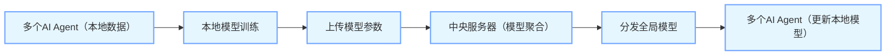

# 联邦学习在AI Agent隐私保护中的应用

> 关键词：联邦学习、AI Agent、隐私保护、分布式学习、数据安全

> 摘要：本文深入探讨了联邦学习在AI Agent隐私保护中的应用。首先介绍了联邦学习和AI Agent的背景知识，明确了文章的目的和范围。接着阐述了联邦学习和AI Agent的核心概念及其联系，详细讲解了联邦学习的核心算法原理与具体操作步骤，并给出了Python源代码示例。同时，介绍了相关的数学模型和公式，并举例说明。通过项目实战，展示了如何在实际场景中运用联邦学习进行AI Agent的隐私保护。此外，还列举了联邦学习在AI Agent隐私保护中的实际应用场景，推荐了相关的学习资源、开发工具框架以及论文著作。最后，对联邦学习在AI Agent隐私保护领域的未来发展趋势与挑战进行了总结，并提供了常见问题与解答以及扩展阅读和参考资料。

## 1. 背景介绍 
### 1.1 目的和范围
随着人工智能技术的快速发展，AI Agent在各个领域得到了广泛应用。然而，AI Agent在运行过程中需要处理大量的数据，这些数据往往包含用户的隐私信息。如何在保证AI Agent学习效果的同时，保护用户的隐私成为了一个亟待解决的问题。联邦学习作为一种新兴的机器学习技术，为解决这一问题提供了有效的途径。本文的目的是深入研究联邦学习在AI Agent隐私保护中的应用，探讨其原理、算法、实际应用场景以及未来发展趋势。

### 1.2 预期读者
本文预期读者包括人工智能领域的研究人员、开发者、数据科学家以及对隐私保护和联邦学习感兴趣的技术爱好者。通过阅读本文，读者可以了解联邦学习在AI Agent隐私保护中的基本原理和应用方法，为进一步的研究和实践提供参考。

### 1.3 文档结构概述
本文共分为十个部分。第一部分为背景介绍，包括目的和范围、预期读者、文档结构概述和术语表。第二部分介绍联邦学习和AI Agent的核心概念及其联系，并给出相关的文本示意图和Mermaid流程图。第三部分详细讲解联邦学习的核心算法原理与具体操作步骤，使用Python源代码进行阐述。第四部分介绍相关的数学模型和公式，并举例说明。第五部分通过项目实战，展示联邦学习在AI Agent隐私保护中的代码实现和详细解释。第六部分列举联邦学习在AI Agent隐私保护中的实际应用场景。第七部分推荐相关的学习资源、开发工具框架以及论文著作。第八部分对联邦学习在AI Agent隐私保护领域的未来发展趋势与挑战进行总结。第九部分提供常见问题与解答。第十部分为扩展阅读和参考资料。

### 1.4 术语表
#### 1.4.1 核心术语定义
- **联邦学习**：一种分布式机器学习技术，允许多个参与方在不共享原始数据的情况下进行模型训练。
- **AI Agent**：能够感知环境、做出决策并执行动作的人工智能实体。
- **隐私保护**：采取技术和管理措施，确保数据的机密性、完整性和可用性，防止数据泄露和滥用。
- **分布式学习**：将学习任务分布到多个计算节点上进行，以提高学习效率和可扩展性。
- **数据安全**：保护数据免受未经授权的访问、使用、披露、破坏或更改。

#### 1.4.2 相关概念解释
- **同态加密**：一种加密技术，允许在加密数据上进行特定的计算，而无需解密数据。
- **差分隐私**：一种隐私保护技术，通过在数据中添加噪声来保护个体隐私。
- **模型聚合**：将多个本地模型的参数进行合并，得到一个全局模型的过程。

#### 1.4.3 缩略词列表
- **FL**：联邦学习（Federated Learning）
- **AI**：人工智能（Artificial Intelligence）
- **DP**：差分隐私（Differential Privacy）
- **HE**：同态加密（Homomorphic Encryption）

## 2. 核心概念与联系 
### 2.1 联邦学习的核心概念
联邦学习是一种分布式机器学习技术，旨在解决数据隐私和安全问题。在联邦学习中，多个参与方（如用户、企业等）持有各自的数据，这些数据不进行集中存储和共享。每个参与方在本地使用自己的数据进行模型训练，并将训练得到的模型参数上传到中央服务器。中央服务器对这些参数进行聚合，得到一个全局模型，并将全局模型分发给各个参与方。各个参与方使用全局模型更新自己的本地模型，然后继续进行下一轮的训练。

联邦学习的核心优势在于保护数据隐私。由于各个参与方的数据不进行集中存储和共享，因此可以有效避免数据泄露和滥用的风险。同时，联邦学习还可以提高模型的性能和泛化能力，因为它可以利用多个参与方的数据进行训练。

### 2.2 AI Agent的核心概念
AI Agent是能够感知环境、做出决策并执行动作的人工智能实体。AI Agent可以是软件程序、机器人或其他智能设备。AI Agent的主要任务是在复杂的环境中完成特定的任务，如自主导航、目标识别、智能客服等。

AI Agent通常由感知模块、决策模块和执行模块组成。感知模块用于获取环境信息，决策模块根据感知到的信息做出决策，执行模块根据决策结果执行相应的动作。AI Agent的性能和效果取决于其感知能力、决策能力和执行能力。

### 2.3 联邦学习与AI Agent的联系
联邦学习和AI Agent之间存在着密切的联系。在AI Agent的训练和应用过程中，往往需要处理大量的数据，这些数据可能包含用户的隐私信息。使用联邦学习技术可以在保护数据隐私的前提下，提高AI Agent的训练效率和性能。

具体来说，多个AI Agent可以作为联邦学习的参与方，在本地使用自己的数据进行模型训练，并将训练得到的模型参数上传到中央服务器。中央服务器对这些参数进行聚合，得到一个全局模型，并将全局模型分发给各个AI Agent。各个AI Agent使用全局模型更新自己的本地模型，然后继续进行下一轮的训练。通过这种方式，AI Agent可以在不共享原始数据的情况下进行联合训练，从而提高模型的性能和泛化能力，同时保护用户的隐私。

### 2.4 文本示意图
```plaintext
多个AI Agent（本地数据）
    |
    v
本地模型训练
    |
    v
上传模型参数
    |
    v
中央服务器（模型聚合）
    |
    v
分发全局模型
    |
    v
多个AI Agent（更新本地模型）
```

### 2.5 Mermaid流程图


## 3. 核心算法原理 & 具体操作步骤 
### 3.1 联邦学习的核心算法原理
联邦学习的核心算法是联邦平均算法（Federated Averaging，简称FedAvg）。FedAvg算法的基本思想是在多个参与方之间进行模型参数的平均，以得到一个全局模型。具体步骤如下：

1. **初始化全局模型**：中央服务器初始化一个全局模型，并将其分发给各个参与方。
2. **本地模型训练**：各个参与方在本地使用自己的数据对全局模型进行训练，得到本地模型。
3. **上传模型参数**：各个参与方将本地模型的参数上传到中央服务器。
4. **模型聚合**：中央服务器对各个参与方上传的模型参数进行加权平均，得到一个全局模型。
5. **分发全局模型**：中央服务器将全局模型分发给各个参与方。
6. **更新本地模型**：各个参与方使用全局模型更新自己的本地模型，然后重复步骤2-5，直到满足终止条件。

### 3.2 具体操作步骤
下面是使用Python实现联邦平均算法的具体代码示例：

```python
import numpy as np
import tensorflow as tf

# 定义参与方数量
num_clients = 3

# 定义每个参与方的本地数据
client_data = [np.random.rand(100, 10) for _ in range(num_clients)]
client_labels = [np.random.randint(0, 2, 100) for _ in range(num_clients)]

# 定义全局模型
def create_model():
    model = tf.keras.Sequential([
        tf.keras.layers.Dense(10, activation='relu', input_shape=(10,)),
        tf.keras.layers.Dense(1, activation='sigmoid')
    ])
    model.compile(optimizer='adam', loss='binary_crossentropy', metrics=['accuracy'])
    return model

# 初始化全局模型
global_model = create_model()

# 定义训练轮数
num_rounds = 10

for round in range(num_rounds):
    print(f"Round {round + 1}")
    
    # 存储每个参与方的本地模型参数
    local_models = []
    
    # 各个参与方进行本地模型训练
    for client in range(num_clients):
        local_model = create_model()
        local_model.set_weights(global_model.get_weights())
        local_model.fit(client_data[client], client_labels[client], epochs=1, verbose=0)
        local_models.append(local_model.get_weights())
    
    # 模型聚合
    new_weights = []
    for layer in range(len(local_models[0])):
        layer_weights = [local_models[client][layer] for client in range(num_clients)]
        average_weight = np.mean(layer_weights, axis=0)
        new_weights.append(average_weight)
    
    # 更新全局模型
    global_model.set_weights(new_weights)

# 评估全局模型
test_data = np.random.rand(100, 10)
test_labels = np.random.randint(0, 2, 100)
_, accuracy = global_model.evaluate(test_data, test_labels)
print(f"Global model accuracy: {accuracy}")
```

### 3.3 代码解释
1. **数据准备**：首先定义了参与方的数量和每个参与方的本地数据。
2. **全局模型初始化**：定义了一个简单的神经网络模型作为全局模型，并进行初始化。
3. **训练轮数**：定义了训练的轮数，即模型需要进行多少轮的迭代训练。
4. **本地模型训练**：在每一轮训练中，各个参与方在本地使用自己的数据对全局模型进行训练，得到本地模型。
5. **模型聚合**：将各个参与方的本地模型参数进行加权平均，得到一个全局模型。
6. **更新全局模型**：将聚合得到的全局模型参数更新到全局模型中。
7. **模型评估**：使用测试数据对全局模型进行评估，输出模型的准确率。

## 4. 数学模型和公式 & 详细讲解 & 举例说明 
### 4.1 联邦平均算法的数学模型
联邦平均算法的数学模型可以用以下公式表示：

设 $w_t$ 表示第 $t$ 轮训练时的全局模型参数，$w_{i,t}$ 表示第 $i$ 个参与方在第 $t$ 轮训练时的本地模型参数，$n_i$ 表示第 $i$ 个参与方的本地数据数量，$N = \sum_{i=1}^{m} n_i$ 表示所有参与方的本地数据总数，其中 $m$ 表示参与方的数量。

1. **本地模型训练**：
   第 $i$ 个参与方在本地使用自己的数据对全局模型进行训练，得到本地模型参数 $w_{i,t}$：
   $$w_{i,t} = \arg\min_{w} \sum_{(x,y) \in D_i} L(w; x, y)$$
   其中 $D_i$ 表示第 $i$ 个参与方的本地数据集，$L(w; x, y)$ 表示损失函数。

2. **模型聚合**：
   中央服务器对各个参与方上传的模型参数进行加权平均，得到第 $t+1$ 轮训练时的全局模型参数 $w_{t+1}$：
   $$w_{t+1} = \sum_{i=1}^{m} \frac{n_i}{N} w_{i,t}$$

### 4.2 详细讲解
- **本地模型训练**：每个参与方在本地使用自己的数据对全局模型进行训练，目标是最小化本地数据上的损失函数。通过不断迭代更新本地模型参数，使得本地模型在本地数据上的性能不断提高。
- **模型聚合**：中央服务器根据各个参与方的本地数据数量进行加权平均，得到一个全局模型。这样可以保证数据量较大的参与方对全局模型的影响更大，同时也考虑了所有参与方的贡献。

### 4.3 举例说明
假设有三个参与方，每个参与方的本地数据数量分别为 $n_1 = 100$，$n_2 = 200$，$n_3 = 300$，则所有参与方的本地数据总数 $N = 100 + 200 + 300 = 600$。

在第 $t$ 轮训练时，三个参与方的本地模型参数分别为 $w_{1,t}$，$w_{2,t}$，$w_{3,t}$。则第 $t+1$ 轮训练时的全局模型参数 $w_{t+1}$ 为：
$$w_{t+1} = \frac{100}{600} w_{1,t} + \frac{200}{600} w_{2,t} + \frac{300}{600} w_{3,t}$$

通过这种方式，中央服务器可以综合考虑各个参与方的贡献，得到一个更优的全局模型。

## 5. 项目实战：代码实际案例和详细解释说明 
### 5.1  开发环境搭建
#### 5.1.1 安装Python
首先需要安装Python，建议使用Python 3.7及以上版本。可以从Python官方网站（https://www.python.org/downloads/）下载并安装Python。

#### 5.1.2 安装依赖库
使用以下命令安装项目所需的依赖库：
```sh
pip install tensorflow numpy
```

### 5.2  源代码详细实现和代码解读
下面是一个完整的联邦学习项目实战代码示例：

```python
import numpy as np
import tensorflow as tf
from tensorflow.keras.datasets import mnist
from tensorflow.keras.models import Sequential
from tensorflow.keras.layers import Dense, Flatten
from tensorflow.keras.utils import to_categorical

# 定义参与方数量
num_clients = 3

# 加载MNIST数据集
(train_images, train_labels), (test_images, test_labels) = mnist.load_data()

# 数据预处理
train_images = train_images.reshape((60000, 28 * 28)).astype('float32') / 255
test_images = test_images.reshape((10000, 28 * 28)).astype('float32') / 255
train_labels = to_categorical(train_labels)
test_labels = to_categorical(test_labels)

# 划分数据给各个参与方
client_data = np.array_split(train_images, num_clients)
client_labels = np.array_split(train_labels, num_clients)

# 定义全局模型
def create_model():
    model = Sequential([
        Dense(128, activation='relu', input_shape=(28 * 28,)),
        Dense(10, activation='softmax')
    ])
    model.compile(optimizer='adam', loss='categorical_crossentropy', metrics=['accuracy'])
    return model

# 初始化全局模型
global_model = create_model()

# 定义训练轮数
num_rounds = 10

for round in range(num_rounds):
    print(f"Round {round + 1}")
    
    # 存储每个参与方的本地模型参数
    local_models = []
    
    # 各个参与方进行本地模型训练
    for client in range(num_clients):
        local_model = create_model()
        local_model.set_weights(global_model.get_weights())
        local_model.fit(client_data[client], client_labels[client], epochs=1, verbose=0)
        local_models.append(local_model.get_weights())
    
    # 模型聚合
    new_weights = []
    for layer in range(len(local_models[0])):
        layer_weights = [local_models[client][layer] for client in range(num_clients)]
        average_weight = np.mean(layer_weights, axis=0)
        new_weights.append(average_weight)
    
    # 更新全局模型
    global_model.set_weights(new_weights)

# 评估全局模型
_, accuracy = global_model.evaluate(test_images, test_labels)
print(f"Global model accuracy: {accuracy}")
```

### 5.3  代码解读与分析
#### 5.3.1 数据加载和预处理
- 使用 `mnist.load_data()` 加载MNIST数据集。
- 将图像数据进行归一化处理，将像素值缩放到0-1之间。
- 将标签数据进行one-hot编码。

#### 5.3.2 数据划分
将训练数据和标签数据平均划分给各个参与方。

#### 5.3.3 全局模型定义
定义一个简单的神经网络模型作为全局模型，包含一个全连接层和一个输出层。

#### 5.3.4 训练过程
- 进行多轮训练，每一轮训练中各个参与方在本地使用自己的数据对全局模型进行训练。
- 将各个参与方的本地模型参数进行加权平均，得到一个全局模型。
- 更新全局模型的参数。

#### 5.3.5 模型评估
使用测试数据对全局模型进行评估，输出模型的准确率。

通过这个项目实战，我们可以看到如何使用联邦学习技术在多个参与方之间进行模型训练，同时保护数据隐私。

## 6. 实际应用场景 
### 6.1 医疗领域
在医疗领域，各个医疗机构拥有大量的患者数据，这些数据包含了患者的隐私信息。使用联邦学习技术，各个医疗机构可以在不共享患者数据的情况下进行联合模型训练。例如，多个医院可以联合训练一个疾病诊断模型，每个医院在本地使用自己的患者数据进行模型训练，并将训练得到的模型参数上传到中央服务器。中央服务器对这些参数进行聚合，得到一个全局模型，并将全局模型分发给各个医院。各个医院使用全局模型更新自己的本地模型，从而提高疾病诊断的准确率，同时保护患者的隐私。

### 6.2 金融领域
在金融领域，各个银行和金融机构拥有大量的客户数据，这些数据包含了客户的隐私信息。使用联邦学习技术，各个银行和金融机构可以在不共享客户数据的情况下进行联合模型训练。例如，多个银行可以联合训练一个信用风险评估模型，每个银行在本地使用自己的客户数据进行模型训练，并将训练得到的模型参数上传到中央服务器。中央服务器对这些参数进行聚合，得到一个全局模型，并将全局模型分发给各个银行。各个银行使用全局模型更新自己的本地模型，从而提高信用风险评估的准确性，同时保护客户的隐私。

### 6.3 物联网领域
在物联网领域，各个设备产生了大量的数据，这些数据包含了用户的隐私信息。使用联邦学习技术，各个设备可以在不共享原始数据的情况下进行联合模型训练。例如，多个智能家居设备可以联合训练一个用户行为预测模型，每个设备在本地使用自己收集的数据进行模型训练，并将训练得到的模型参数上传到中央服务器。中央服务器对这些参数进行聚合，得到一个全局模型，并将全局模型分发给各个设备。各个设备使用全局模型更新自己的本地模型，从而提高用户行为预测的准确性，同时保护用户的隐私。

### 6.4 智能交通领域
在智能交通领域，各个交通管理部门和企业拥有大量的交通数据，这些数据包含了车辆和行人的隐私信息。使用联邦学习技术，各个交通管理部门和企业可以在不共享交通数据的情况下进行联合模型训练。例如，多个城市的交通管理部门可以联合训练一个交通流量预测模型，每个城市在本地使用自己的交通数据进行模型训练，并将训练得到的模型参数上传到中央服务器。中央服务器对这些参数进行聚合，得到一个全局模型，并将全局模型分发给各个城市。各个城市使用全局模型更新自己的本地模型，从而提高交通流量预测的准确性，同时保护车辆和行人的隐私。

## 7. 工具和资源推荐
### 7.1 学习资源推荐
#### 7.1.1 书籍推荐
- 《联邦学习》：全面介绍了联邦学习的基本原理、算法和应用场景。
- 《人工智能：一种现代的方法》：经典的人工智能教材，涵盖了机器学习、深度学习等多个领域的知识。
- 《Python机器学习》：详细介绍了Python在机器学习中的应用，包括数据处理、模型训练和评估等方面的内容。

#### 7.1.2 在线课程
- Coursera上的“Deep Learning Specialization”：由Andrew Ng教授主讲，深入介绍了深度学习的理论和实践。
- edX上的“Introduction to Artificial Intelligence”：介绍了人工智能的基本概念、算法和应用。
- 中国大学MOOC上的“人工智能基础”：适合初学者入门，介绍了人工智能的基本概念和方法。

#### 7.1.3 技术博客和网站
- Medium上的“Towards Data Science”：分享了大量关于数据科学、机器学习和人工智能的文章。
- arXiv.org：提供了最新的学术论文和研究成果，涵盖了联邦学习、人工智能等多个领域。
- 阿里云开发者社区：提供了丰富的技术文章和案例，包括联邦学习的应用和实践。

### 7.2 开发工具框架推荐
#### 7.2.1 IDE和编辑器
- PyCharm：功能强大的Python集成开发环境，支持代码编辑、调试、版本控制等功能。
- Jupyter Notebook：交互式的开发环境，适合进行数据分析和模型训练的实验。
- Visual Studio Code：轻量级的代码编辑器，支持多种编程语言和插件扩展。

#### 7.2.2 调试和性能分析工具
- TensorBoard：TensorFlow提供的可视化工具，用于监控模型训练过程和分析模型性能。
- Py-Spy：用于分析Python程序的性能瓶颈和资源使用情况。
- cProfile：Python标准库中的性能分析工具，用于分析函数调用的时间和次数。

#### 7.2.3 相关框架和库
- TensorFlow Federated：Google开发的联邦学习框架，提供了丰富的工具和接口，方便进行联邦学习的开发和实验。
- PySyft：OpenMined开发的隐私保护深度学习框架，支持联邦学习、同态加密等多种隐私保护技术。
- Flower：一个通用的联邦学习框架，支持多种机器学习框架和算法。

### 7.3 相关论文著作推荐
#### 7.3.1 经典论文
- 《Communication-Efficient Learning of Deep Networks from Decentralized Data》：提出了联邦平均算法（FedAvg），是联邦学习领域的经典论文。
- 《Privacy-Preserving Machine Learning》：介绍了隐私保护机器学习的基本概念和方法。
- 《Differential Privacy: A Survey of Results》：对差分隐私技术进行了全面的综述。

#### 7.3.2 最新研究成果
- 关注arXiv.org上的最新论文，了解联邦学习和AI Agent隐私保护领域的最新研究动态。
- 参加相关的学术会议，如NeurIPS、ICML等，获取最新的研究成果和趋势。

#### 7.3.3 应用案例分析
- 查看各大科技公司的技术博客和研究报告，了解联邦学习在实际应用中的案例和经验。
- 分析开源项目中的代码和文档，学习如何将联邦学习应用到实际项目中。

## 8. 总结：未来发展趋势与挑战
### 8.1 未来发展趋势
#### 8.1.1 与其他技术的融合
联邦学习将与同态加密、差分隐私、区块链等技术进行更深入的融合，进一步提高数据隐私保护的水平。例如，结合同态加密技术，可以在加密数据上进行模型训练，确保数据在整个训练过程中都是加密的；结合区块链技术，可以实现联邦学习过程的可追溯和不可篡改，提高系统的安全性和可信度。

#### 8.1.2 应用场景的拓展
联邦学习将在更多的领域得到应用，如教育、能源、农业等。随着各个领域对数据隐私保护的需求不断增加，联邦学习将成为解决数据隐私和安全问题的重要手段。例如，在教育领域，各个学校可以联合训练一个学生学习能力评估模型，在保护学生隐私的前提下，提高评估的准确性。

#### 8.1.3 模型性能的提升
随着算法的不断改进和优化，联邦学习模型的性能将不断提升。例如，研究人员将探索更高效的模型聚合算法，减少通信开销和训练时间；同时，将引入更多的优化策略，提高模型的泛化能力和收敛速度。

### 8.2 挑战
#### 8.2.1 通信开销
在联邦学习中，各个参与方需要频繁地与中央服务器进行通信，上传和下载模型参数。当参与方数量较多或数据量较大时，通信开销将成为一个严重的问题。如何减少通信开销，提高通信效率，是联邦学习面临的一个重要挑战。

#### 8.2.2 模型异构性
不同参与方的本地数据分布和模型结构可能存在差异，导致模型异构性问题。模型异构性会影响模型聚合的效果，降低全局模型的性能。如何处理模型异构性问题，是联邦学习需要解决的一个关键问题。

#### 8.2.3 安全和隐私保护
虽然联邦学习可以在一定程度上保护数据隐私，但仍然存在安全和隐私风险。例如，攻击者可能通过分析模型参数来推断出参与方的原始数据信息。如何进一步提高联邦学习的安全和隐私保护水平，是联邦学习面临的一个长期挑战。

## 9. 附录：常见问题与解答
### 9.1 联邦学习和传统机器学习有什么区别？
传统机器学习通常需要将所有数据集中存储在一个服务器上进行模型训练，而联邦学习允许多个参与方在不共享原始数据的情况下进行模型训练。联邦学习可以有效保护数据隐私，避免数据泄露和滥用的风险。

### 9.2 联邦学习的通信开销主要来自哪些方面？
联邦学习的通信开销主要来自以下几个方面：
- 模型参数的上传和下载：各个参与方需要将本地模型的参数上传到中央服务器，中央服务器需要将全局模型的参数分发给各个参与方。
- 数据同步和协调：在训练过程中，各个参与方需要进行数据同步和协调，以确保模型训练的一致性。
- 加密和解密操作：如果使用了加密技术，如在加密数据上进行模型训练，需要进行加密和解密操作，这也会增加通信开销。

### 9.3 如何处理联邦学习中的模型异构性问题？
处理联邦学习中的模型异构性问题可以采用以下方法：
- 模型对齐：在模型聚合之前，对各个参与方的本地模型进行对齐，使它们的模型结构和参数具有可比性。
- 加权聚合：根据各个参与方的模型性能和数据分布情况，对模型参数进行加权聚合，使性能较好的模型对全局模型的影响更大。
- 个性化模型：为不同的参与方训练个性化的模型，以适应它们的数据分布和需求。

### 9.4 联邦学习的安全和隐私保护措施有哪些？
联邦学习的安全和隐私保护措施主要包括以下几个方面：
- 差分隐私：在模型训练过程中，向数据中添加噪声，以保护个体隐私。
- 同态加密：在加密数据上进行模型训练，确保数据在整个训练过程中都是加密的。
- 安全多方计算：通过安全多方计算协议，实现多个参与方之间的协作计算，而无需共享原始数据。
- 访问控制：对参与方的访问权限进行严格控制，确保只有授权的参与方可以参与模型训练。

## 10. 扩展阅读 & 参考资料
### 10.1 扩展阅读
- 《Federated Machine Learning: Concept and Applications》：深入介绍了联邦学习的概念、算法和应用。
- 《Deep Learning for Privacy-Preserving Data Analytics》：探讨了深度学习在隐私保护数据分析中的应用。
- 《The Algorithmic Foundations of Differential Privacy》：详细介绍了差分隐私的算法基础和应用。

### 10.2 参考资料
- 《联邦学习白皮书》：由多个机构联合发布，对联邦学习的技术、应用和发展趋势进行了全面的介绍。
- 相关学术会议和期刊的论文，如NeurIPS、ICML、Journal of Artificial Intelligence Research等。
- 各大科技公司的技术博客和研究报告，如Google、Microsoft、Facebook等。

作者：AI天才研究院/AI Genius Institute & 禅与计算机程序设计艺术 /Zen And The Art of Computer Programming