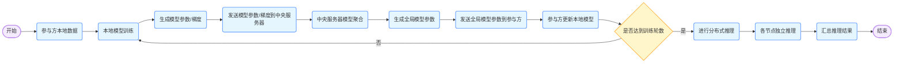

# 联邦学习在分布式推理任务中的应用

> 关键词：联邦学习、分布式推理、隐私保护、模型聚合、应用场景

> 摘要：本文深入探讨了联邦学习在分布式推理任务中的应用。首先介绍了联邦学习和分布式推理的背景知识，包括目的、预期读者、文档结构和相关术语。接着阐述了核心概念及其联系，给出了原理和架构的文本示意图与 Mermaid 流程图。详细讲解了核心算法原理，并用 Python 源代码进行了说明，同时介绍了相关的数学模型和公式。通过项目实战案例，展示了开发环境搭建、源代码实现及解读。分析了联邦学习在分布式推理任务中的实际应用场景，推荐了学习资源、开发工具框架和相关论文著作。最后总结了未来发展趋势与挑战，并提供了常见问题解答和扩展阅读参考资料。

## 1. 背景介绍 
### 1.1 目的和范围
联邦学习作为一种新兴的机器学习范式，旨在解决数据隐私和安全问题，同时实现多参与方之间的模型训练和共享。分布式推理任务则是指将推理过程分布在多个节点上进行，以提高推理效率和可扩展性。本文的目的是深入探讨联邦学习在分布式推理任务中的应用，包括其核心概念、算法原理、数学模型、实际应用场景等方面。范围涵盖了从理论到实践的多个层面，旨在为读者提供全面而深入的了解。

### 1.2 预期读者
本文预期读者包括机器学习研究者、数据科学家、人工智能工程师、软件开发人员以及对联邦学习和分布式推理感兴趣的技术爱好者。对于有一定机器学习基础的读者，本文可以帮助他们深入理解联邦学习在分布式推理中的应用；对于初学者，本文也提供了详细的背景知识和逐步的讲解，有助于他们快速入门。

### 1.3 文档结构概述
本文共分为十个部分。第一部分为背景介绍，包括目的和范围、预期读者、文档结构概述和术语表。第二部分阐述核心概念与联系，给出原理和架构的文本示意图与 Mermaid 流程图。第三部分讲解核心算法原理，并使用 Python 源代码进行详细阐述。第四部分介绍数学模型和公式，并进行详细讲解和举例说明。第五部分通过项目实战案例，展示开发环境搭建、源代码实现及解读。第六部分分析实际应用场景。第七部分推荐学习资源、开发工具框架和相关论文著作。第八部分总结未来发展趋势与挑战。第九部分提供常见问题解答。第十部分给出扩展阅读和参考资料。

### 1.4 术语表
#### 1.4.1 核心术语定义
- **联邦学习**：一种机器学习技术，允许多个参与方在不共享原始数据的情况下合作训练模型。每个参与方在本地数据上进行模型训练，然后将模型参数或梯度发送到中央服务器进行聚合，最终得到一个全局模型。
- **分布式推理**：将推理任务分布在多个计算节点上进行，以提高推理效率和可扩展性。每个节点可以独立进行部分推理任务，然后将结果汇总得到最终的推理结果。
- **模型聚合**：在联邦学习中，将各个参与方发送的模型参数或梯度进行合并，得到一个全局模型的过程。
- **隐私保护**：在联邦学习和分布式推理中，采取措施确保参与方的原始数据不被泄露，保护数据隐私。

#### 1.4.2 相关概念解释
- **同态加密**：一种加密技术，允许在加密数据上进行特定的计算，而无需先解密数据。在联邦学习中，同态加密可以用于保护模型参数在传输和聚合过程中的隐私。
- **差分隐私**：一种隐私保护技术，通过在数据中添加噪声来保护数据的隐私。在联邦学习中，差分隐私可以用于保护参与方的本地数据在模型训练过程中的隐私。
- **区块链**：一种分布式账本技术，具有去中心化、不可篡改、可追溯等特点。在联邦学习中，区块链可以用于记录模型训练和推理的过程，确保数据的安全性和可信度。

#### 1.4.3 缩略词列表
- **FL**：联邦学习（Federated Learning）
- **DI**：分布式推理（Distributed Inference）
- **SGD**：随机梯度下降（Stochastic Gradient Descent）
- **DP**：差分隐私（Differential Privacy）
- **HE**：同态加密（Homomorphic Encryption）

## 2. 核心概念与联系 

### 核心概念原理
联邦学习的核心原理是在不共享原始数据的情况下，多个参与方合作训练一个全局模型。每个参与方在本地数据上进行模型训练，得到本地模型参数或梯度，然后将其发送到中央服务器。中央服务器对这些参数或梯度进行聚合，得到全局模型参数，并将其发送回各个参与方。参与方使用全局模型参数更新本地模型，继续进行下一轮训练。

分布式推理的核心原理是将推理任务分布在多个计算节点上进行。每个节点可以独立进行部分推理任务，然后将结果汇总得到最终的推理结果。分布式推理可以提高推理效率和可扩展性，特别是在处理大规模数据和复杂模型时。

### 架构的文本示意图
```
+----------------------+
| 中央服务器           |
|                      |
| - 模型聚合           |
| - 全局模型管理       |
+----------------------+
         |
         | 模型参数/梯度
         |
+----------------------+
| 参与方 1             |
|                      |
| - 本地数据           |
| - 本地模型训练       |
| - 模型参数/梯度发送  |
+----------------------+
         |
         | 模型参数/梯度
         |
+----------------------+
| 参与方 2             |
|                      |
| - 本地数据           |
| - 本地模型训练       |
| - 模型参数/梯度发送  |
+----------------------+
         |
         | ......
         |
+----------------------+
| 参与方 n             |
|                      |
| - 本地数据           |
| - 本地模型训练       |
| - 模型参数/梯度发送  |
+----------------------+
```

### Mermaid 流程图


## 3. 核心算法原理 & 具体操作步骤 

### 联邦学习算法原理
联邦学习中最常用的算法是联邦平均算法（Federated Averaging，FedAvg）。其基本思想是在每个参与方本地进行多次随机梯度下降（SGD）迭代，然后将本地模型参数发送到中央服务器进行平均，得到全局模型参数。

以下是 FedAvg 算法的 Python 代码实现：

```python
import numpy as np

# 定义本地模型训练函数
def local_train(model, local_data, num_local_epochs, learning_rate):
    for epoch in range(num_local_epochs):
        for data, label in local_data:
            # 计算梯度
            gradient = compute_gradient(model, data, label)
            # 更新模型参数
            model = model - learning_rate * gradient
    return model

# 定义模型聚合函数
def model_aggregation(local_models, weights):
    global_model = np.zeros_like(local_models[0])
    total_weight = sum(weights)
    for i in range(len(local_models)):
        global_model += (weights[i] / total_weight) * local_models[i]
    return global_model

# 定义计算梯度函数（示例）
def compute_gradient(model, data, label):
    # 这里简单模拟梯度计算
    gradient = np.random.randn(*model.shape)
    return gradient

# 模拟参与方和数据
num_parties = 3
local_datas = [np.random.randn(10, 5) for _ in range(num_parties)]
weights = [1] * num_parties

# 初始化全局模型
global_model = np.random.randn(5)

# 训练轮数
num_rounds = 5
num_local_epochs = 2
learning_rate = 0.1

for round in range(num_rounds):
    local_models = []
    for i in range(num_parties):
        # 本地模型训练
        local_model = local_train(global_model.copy(), local_datas[i], num_local_epochs, learning_rate)
        local_models.append(local_model)
    
    # 模型聚合
    global_model = model_aggregation(local_models, weights)

print("最终全局模型:", global_model)
```

### 具体操作步骤
1. **初始化全局模型**：中央服务器初始化一个全局模型。
2. **分发全局模型**：中央服务器将全局模型分发给各个参与方。
3. **本地模型训练**：每个参与方在本地数据上进行多次 SGD 迭代，更新本地模型参数。
4. **发送本地模型参数**：参与方将本地模型参数发送到中央服务器。
5. **模型聚合**：中央服务器对各个参与方的本地模型参数进行平均，得到全局模型参数。
6. **更新全局模型**：中央服务器将全局模型参数分发给各个参与方，参与方使用全局模型参数更新本地模型。
7. **重复步骤 3 - 6**：直到达到预定的训练轮数。
8. **分布式推理**：使用训练好的全局模型进行分布式推理，各个节点独立进行部分推理任务，然后将结果汇总得到最终的推理结果。

## 4. 数学模型和公式 & 详细讲解 & 举例说明 

### 联邦平均算法的数学模型
设 $w$ 为模型参数，$D_i$ 为第 $i$ 个参与方的本地数据集，$N$ 为参与方的数量，$K$ 为本地训练的迭代次数，$\eta$ 为学习率。

在第 $t$ 轮训练中，第 $i$ 个参与方的本地模型训练过程可以表示为：

$$
w_{i}^{t+1} = w^{t} - \eta \sum_{k=1}^{K} \nabla L(w_{i}^{k}, D_i)
$$

其中，$\nabla L(w_{i}^{k}, D_i)$ 是第 $i$ 个参与方在第 $k$ 次迭代时的梯度。

中央服务器的模型聚合过程可以表示为：

$$
w^{t+1} = \frac{1}{N} \sum_{i=1}^{N} w_{i}^{t+1}
$$

### 详细讲解
在本地模型训练阶段，每个参与方使用本地数据集 $D_i$ 对全局模型参数 $w^{t}$ 进行多次 SGD 迭代，得到本地模型参数 $w_{i}^{t+1}$。在模型聚合阶段，中央服务器对各个参与方的本地模型参数进行平均，得到新的全局模型参数 $w^{t+1}$。

### 举例说明
假设我们有两个参与方，每个参与方的本地数据集分别为 $D_1$ 和 $D_2$，初始全局模型参数为 $w^{0} = [0.1, 0.2]$。

在第一轮训练中，参与方 1 在本地数据集 $D_1$ 上进行 2 次 SGD 迭代，得到本地模型参数 $w_{1}^{1} = [0.05, 0.15]$；参与方 2 在本地数据集 $D_2$ 上进行 2 次 SGD 迭代，得到本地模型参数 $w_{2}^{1} = [0.12, 0.22]$。

中央服务器进行模型聚合，得到新的全局模型参数：

$$
w^{1} = \frac{1}{2} (w_{1}^{1} + w_{2}^{1}) = \frac{1}{2} ([0.05, 0.15] + [0.12, 0.22]) = [0.085, 0.185]
$$

## 5. 项目实战：代码实际案例和详细解释说明 

### 5.1  开发环境搭建
1. **安装 Python**：建议使用 Python 3.7 及以上版本。可以从 Python 官方网站（https://www.python.org/downloads/）下载并安装。
2. **安装必要的库**：使用以下命令安装所需的库：
```sh
pip install numpy torch
```
其中，`numpy` 用于数值计算，`torch` 用于深度学习模型的构建和训练。

### 5.2  源代码详细实现和代码解读
以下是一个使用 PyTorch 实现的联邦学习在分布式推理任务中的项目实战代码：

```python
import torch
import torch.nn as nn
import torch.optim as optim
from torch.utils.data import DataLoader, Dataset

# 定义简单的神经网络模型
class SimpleModel(nn.Module):
    def __init__(self):
        super(SimpleModel, self).__init__()
        self.fc1 = nn.Linear(10, 20)
        self.relu = nn.ReLU()
        self.fc2 = nn.Linear(20, 1)

    def forward(self, x):
        x = self.fc1(x)
        x = self.relu(x)
        x = self.fc2(x)
        return x

# 定义本地数据集类
class LocalDataset(Dataset):
    def __init__(self, data):
        self.data = data

    def __len__(self):
        return len(self.data)

    def __getitem__(self, idx):
        return self.data[idx][0], self.data[idx][1]

# 定义本地模型训练函数
def local_train(model, local_data, num_local_epochs, learning_rate):
    criterion = nn.MSELoss()
    optimizer = optim.SGD(model.parameters(), lr=learning_rate)
    for epoch in range(num_local_epochs):
        for data, label in local_data:
            optimizer.zero_grad()
            output = model(data)
            loss = criterion(output, label)
            loss.backward()
            optimizer.step()
    return model

# 定义模型聚合函数
def model_aggregation(local_models):
    global_model = SimpleModel()
    num_models = len(local_models)
    with torch.no_grad():
        for param in global_model.parameters():
            param.data.zero_()
        for local_model in local_models:
            for global_param, local_param in zip(global_model.parameters(), local_model.parameters()):
                global_param.data += local_param.data / num_models
    return global_model

# 模拟参与方和数据
num_parties = 3
local_datas = [
    [(torch.randn(10), torch.randn(1)) for _ in range(10)] for _ in range(num_parties)
]

# 初始化全局模型
global_model = SimpleModel()

# 训练轮数
num_rounds = 5
num_local_epochs = 2
learning_rate = 0.1

for round in range(num_rounds):
    local_models = []
    for i in range(num_parties):
        local_dataset = LocalDataset(local_datas[i])
        local_dataloader = DataLoader(local_dataset, batch_size=1)
        local_model = local_train(global_model.clone(), local_dataloader, num_local_epochs, learning_rate)
        local_models.append(local_model)
    
    # 模型聚合
    global_model = model_aggregation(local_models)

# 分布式推理
test_data = [(torch.randn(10), torch.randn(1)) for _ in range(5)]
test_dataset = LocalDataset(test_data)
test_dataloader = DataLoader(test_dataset, batch_size=1)
total_loss = 0
criterion = nn.MSELoss()
with torch.no_grad():
    for data, label in test_dataloader:
        output = global_model(data)
        loss = criterion(output, label)
        total_loss += loss.item()

print("测试集平均损失:", total_loss / len(test_dataloader))
```

### 5.3  代码解读与分析
1. **模型定义**：定义了一个简单的神经网络模型 `SimpleModel`，包含两个全连接层和一个 ReLU 激活函数。
2. **本地数据集类**：定义了 `LocalDataset` 类，用于封装本地数据集。
3. **本地模型训练函数**：`local_train` 函数使用 SGD 优化器和均方误差损失函数对本地模型进行训练。
4. **模型聚合函数**：`model_aggregation` 函数对各个参与方的本地模型参数进行平均，得到全局模型。
5. **训练过程**：模拟了多个参与方的训练过程，每个参与方在本地数据上进行多次训练，然后将本地模型参数发送到中央服务器进行聚合。
6. **分布式推理**：使用训练好的全局模型对测试集进行推理，计算测试集的平均损失。

## 6. 实际应用场景 
### 医疗领域
在医疗领域，不同医院拥有大量的患者数据，但由于数据隐私和安全问题，这些数据不能直接共享。联邦学习可以让各个医院在不共享原始数据的情况下合作训练一个疾病诊断模型。在分布式推理阶段，各个医院可以使用训练好的全局模型对本地患者数据进行诊断，提高诊断的准确性和效率。

### 金融领域
在金融领域，银行、证券等机构拥有大量的客户数据。联邦学习可以用于风险评估、欺诈检测等任务。各个机构在本地数据上进行模型训练，然后将模型参数发送到中央服务器进行聚合。在分布式推理阶段，各个机构可以使用全局模型对本地客户数据进行风险评估和欺诈检测，保护客户数据的隐私。

### 物联网领域
在物联网领域，大量的设备产生了海量的数据。由于数据传输和存储的限制，这些数据不能全部上传到云端进行处理。联邦学习可以让各个设备在本地进行模型训练，然后将模型参数发送到云端进行聚合。在分布式推理阶段，各个设备可以使用全局模型对本地数据进行实时处理，提高物联网系统的响应速度和效率。

## 7. 工具和资源推荐
### 7.1 学习资源推荐
#### 7.1.1 书籍推荐
- 《Federated Learning: Foundations and Trends in Machine Learning》：全面介绍了联邦学习的理论和实践，是联邦学习领域的经典著作。
- 《Deep Learning》：深度学习领域的权威书籍，对于理解联邦学习中的模型训练和优化有很大帮助。

#### 7.1.2 在线课程
- Coursera 上的 “Federated Learning for Data Privacy and Confidentiality”：由知名专家授课，系统讲解了联邦学习的原理和应用。
- edX 上的 “Introduction to Artificial Intelligence”：涵盖了人工智能的基础知识，为学习联邦学习打下坚实的基础。

#### 7.1.3 技术博客和网站
- TensorFlow Federated 官方博客：提供了联邦学习的最新技术和实践案例。
- Medium 上的 “Federated Learning” 专题：汇集了众多专家和从业者的文章，分享了联邦学习的经验和见解。

### 7.2 开发工具框架推荐
#### 7.2.1 IDE和编辑器
- PyCharm：功能强大的 Python 集成开发环境，支持代码调试、版本控制等功能。
- Visual Studio Code：轻量级的代码编辑器，具有丰富的插件生态系统，适合快速开发和调试。

#### 7.2.2 调试和性能分析工具
- TensorBoard：用于可视化深度学习模型的训练过程和性能指标，方便调试和优化。
- PyTorch Profiler：用于分析 PyTorch 模型的性能瓶颈，提高模型的训练和推理效率。

#### 7.2.3 相关框架和库
- TensorFlow Federated：由 Google 开发的联邦学习框架，提供了丰富的工具和接口，方便开发者实现联邦学习算法。
- PySyft：用于隐私保护深度学习的 Python 库，支持联邦学习和差分隐私等技术。

### 7.3 相关论文著作推荐
#### 7.3.1 经典论文
- 《Communication-Efficient Learning of Deep Networks from Decentralized Data》：提出了联邦平均算法（FedAvg），是联邦学习领域的经典论文。
- 《Privacy-Preserving Deep Learning》：介绍了隐私保护深度学习的基本概念和方法，为联邦学习的隐私保护提供了理论基础。

#### 7.3.2 最新研究成果
- 《Federated Learning with Non-IID Data》：研究了联邦学习在非独立同分布（Non-IID）数据下的性能和优化方法。
- 《Secure Aggregation for Privacy-Preserving Machine Learning》：提出了一种安全聚合算法，用于保护联邦学习中模型参数的隐私。

#### 7.3.3 应用案例分析
- 《Federated Learning in Healthcare: A Systematic Review》：对联邦学习在医疗领域的应用进行了系统的综述和分析。
- 《Federated Learning for Financial Services: Opportunities and Challenges》：探讨了联邦学习在金融服务领域的应用机会和挑战。

## 8. 总结：未来发展趋势与挑战
### 未来发展趋势
- **与其他技术的融合**：联邦学习将与区块链、同态加密、差分隐私等技术深度融合，进一步提高数据隐私和安全保护水平。
- **应用领域的拓展**：联邦学习将在更多领域得到应用，如教育、交通、能源等，为各行业的数字化转型提供支持。
- **算法和模型的优化**：不断优化联邦学习算法和模型，提高训练效率和推理精度，降低通信开销和计算成本。

### 挑战
- **数据异构性**：不同参与方的数据可能存在异构性，如数据分布不同、数据质量不同等，这会影响联邦学习的性能和效果。
- **通信开销**：在联邦学习中，模型参数的传输需要大量的通信开销，特别是在大规模分布式系统中，通信开销会成为瓶颈。
- **隐私保护与性能的平衡**：在保证数据隐私的前提下，如何提高联邦学习的性能和效率是一个亟待解决的问题。

## 9. 附录：常见问题与解答
### 问题 1：联邦学习和传统机器学习有什么区别？
**解答**：传统机器学习通常需要将所有数据集中到一个地方进行训练，而联邦学习允许多个参与方在不共享原始数据的情况下合作训练模型。联邦学习更注重数据隐私和安全保护，适用于数据分散、隐私要求高的场景。

### 问题 2：联邦学习在分布式推理中有哪些优势？
**解答**：联邦学习在分布式推理中具有以下优势：1. 保护数据隐私：各个参与方不需要共享原始数据，只需要共享模型参数，从而保护了数据隐私。2. 提高推理效率：分布式推理可以将推理任务分布在多个节点上进行，提高了推理效率和可扩展性。3. 充分利用本地资源：各个节点可以利用本地的计算资源进行推理，减少了数据传输和存储的压力。

### 问题 3：如何解决联邦学习中的数据异构性问题？
**解答**：可以采用以下方法解决联邦学习中的数据异构性问题：1. 数据预处理：对不同参与方的数据进行预处理，如归一化、特征选择等，使数据具有相似的分布。2. 个性化模型：为不同参与方训练个性化的模型，以适应其本地数据的特点。3. 自适应聚合算法：设计自适应的模型聚合算法，根据不同参与方的数据质量和贡献程度进行加权聚合。

## 10. 扩展阅读 & 参考资料
- McMahan, H. B., Moore, E., Ramage, D., Hampson, S., & Arcas, B. A. (2017). Communication-efficient learning of deep networks from decentralized data. arXiv preprint arXiv:1702.07080.
- Abadi, M., Chu, A., Goodfellow, I., McMahan, H. B., Mironov, I., Talwar, K., & Zhang, L. (2016). Deep learning with differential privacy. In Proceedings of the 2016 ACM SIGSAC conference on computer and communications security (pp. 308-318).
- TensorFlow Federated 官方文档：https://www.tensorflow.org/federated
- PySyft 官方文档：https://github.com/OpenMined/PySyft

作者：AI天才研究院/AI Genius Institute & 禅与计算机程序设计艺术 /Zen And The Art of Computer Programming