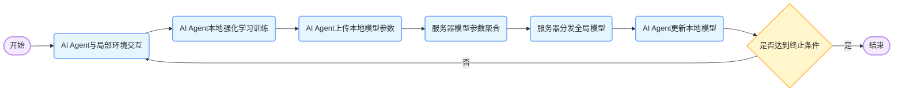

# 联邦强化学习在分布式AI Agent控制优化中的应用

> 关键词：联邦强化学习、分布式AI Agent、控制优化、隐私保护、多智能体系统

> 摘要：本文聚焦于联邦强化学习在分布式AI Agent控制优化中的应用。首先介绍了联邦强化学习和分布式AI Agent的相关背景知识，深入剖析了联邦强化学习的核心概念与原理架构。接着详细阐述了其核心算法原理，并给出Python代码示例。通过数学模型和公式对联邦强化学习的理论基础进行了严谨推导和说明。在项目实战部分，提供了开发环境搭建、源代码实现与解读等内容。探讨了联邦强化学习在多个实际场景中的应用，推荐了相关的学习资源、开发工具框架和论文著作。最后对联邦强化学习在分布式AI Agent控制优化领域的未来发展趋势与挑战进行了总结，并提供了常见问题解答和扩展阅读参考资料，旨在为相关领域的研究者和开发者提供全面而深入的技术参考。

## 1. 背景介绍 
### 1.1 目的和范围
随着人工智能技术的飞速发展，分布式AI Agent系统在众多领域得到了广泛应用，如智能交通、工业自动化、物联网等。在这些系统中，每个AI Agent通常拥有自己的局部数据和计算资源，并且可能处于不同的地理位置或组织中。然而，传统的集中式学习方法在处理分布式数据时面临着数据隐私、通信带宽限制等诸多问题。联邦强化学习作为一种新兴的技术，结合了联邦学习和强化学习的优势，为解决分布式AI Agent控制优化问题提供了新的思路。本文的目的在于深入探讨联邦强化学习在分布式AI Agent控制优化中的应用，涵盖其原理、算法、数学模型、实际案例以及未来发展趋势等方面，旨在为相关领域的研究和实践提供全面的参考。

### 1.2 预期读者
本文预期读者包括但不限于人工智能领域的研究者、机器学习工程师、分布式系统开发者、对强化学习和联邦学习感兴趣的技术爱好者以及相关专业的学生。无论是希望深入了解联邦强化学习理论的学术研究人员，还是致力于将其应用于实际项目的工程技术人员，都能从本文中获取有价值的信息。

### 1.3 文档结构概述
本文共分为十个部分。第一部分为背景介绍，阐述了文章的目的、预期读者和文档结构概述，并给出了相关术语的定义和解释。第二部分详细介绍了联邦强化学习和分布式AI Agent的核心概念与联系，包括原理和架构的文本示意图以及Mermaid流程图。第三部分讲解了联邦强化学习的核心算法原理，并通过Python源代码进行详细阐述。第四部分介绍了联邦强化学习的数学模型和公式，并进行详细讲解和举例说明。第五部分是项目实战，包括开发环境搭建、源代码详细实现和代码解读。第六部分探讨了联邦强化学习在分布式AI Agent控制优化中的实际应用场景。第七部分推荐了相关的学习资源、开发工具框架和论文著作。第八部分总结了联邦强化学习在该领域的未来发展趋势与挑战。第九部分是附录，提供了常见问题与解答。第十部分给出了扩展阅读和参考资料。

### 1.4 术语表
#### 1.4.1 核心术语定义
- **联邦强化学习（Federated Reinforcement Learning）**：一种结合了联邦学习和强化学习的技术，旨在让多个分布式的AI Agent在不共享原始数据的情况下，通过协作学习来优化其策略。
- **分布式AI Agent（Distributed AI Agent）**：在分布式系统中独立运行的智能体，具有自己的感知、决策和执行能力，能够与环境进行交互并根据环境反馈调整自身行为。
- **强化学习（Reinforcement Learning）**：一种机器学习范式，智能体通过与环境进行交互，根据环境反馈的奖励信号来学习最优策略，以最大化长期累积奖励。
- **联邦学习（Federated Learning）**：一种在保护数据隐私的前提下，让多个参与方协作训练模型的机器学习技术。各个参与方在本地训练模型，然后将模型参数上传到服务器进行聚合，而不直接共享原始数据。
- **策略（Policy）**：智能体在给定状态下选择动作的规则，通常用 $\pi(a|s)$ 表示，其中 $s$ 表示状态，$a$ 表示动作。
- **奖励（Reward）**：环境在智能体执行动作后返回的标量值，用于表示该动作的好坏程度，智能体的目标是最大化长期累积奖励。

#### 1.4.2 相关概念解释
- **多智能体系统（Multi - Agent System）**：由多个智能体组成的系统，这些智能体之间可以进行协作、竞争或其他形式的交互。在分布式AI Agent系统中，多个智能体通常需要共同完成一个或多个任务。
- **数据隐私（Data Privacy）**：指保护数据所有者的个人信息、商业机密等不被泄露的特性。在联邦学习中，数据隐私是一个重要的考虑因素，通过不直接共享原始数据来保护数据隐私。
- **模型聚合（Model Aggregation）**：在联邦学习中，服务器将各个参与方上传的模型参数进行聚合，得到一个全局模型的过程。常见的聚合方法包括加权平均等。

#### 1.4.3 缩略词列表
- **FL**：Federated Learning（联邦学习）
- **RL**：Reinforcement Learning（强化学习）
- **FRL**：Federated Reinforcement Learning（联邦强化学习）
- **AI**：Artificial Intelligence（人工智能）

## 2. 核心概念与联系 

### 2.1 联邦强化学习原理
联邦强化学习结合了联邦学习和强化学习的优势，旨在解决分布式AI Agent控制优化问题。在传统的强化学习中，智能体通过与环境进行交互，根据环境反馈的奖励信号来学习最优策略。然而，在分布式系统中，每个AI Agent可能拥有自己的局部环境和数据，并且由于数据隐私和通信带宽等限制，不能直接共享原始数据。联邦强化学习的核心思想是让多个AI Agent在本地进行强化学习训练，然后将训练得到的模型参数上传到服务器进行聚合，得到一个全局模型。各个AI Agent再根据全局模型更新自己的本地模型，从而实现协作学习。

### 2.2 分布式AI Agent架构
分布式AI Agent系统通常由多个独立的AI Agent组成，每个AI Agent具有自己的感知、决策和执行能力。这些AI Agent可以分布在不同的地理位置或组织中，通过网络进行通信和协作。每个AI Agent与自己的局部环境进行交互，获取状态信息和奖励信号，并根据自己的策略选择动作。同时，AI Agent之间可以通过服务器进行信息共享和协作，以实现共同的目标。

### 2.3 核心概念联系示意图
以下是联邦强化学习在分布式AI Agent控制优化中的原理和架构的文本示意图：

分布式AI Agent系统包含多个AI Agent，每个AI Agent与自己的局部环境进行交互，获取状态信息和奖励信号。AI Agent在本地进行强化学习训练，得到本地模型。然后，各个AI Agent将本地模型参数上传到服务器。服务器对上传的模型参数进行聚合，得到全局模型。最后，服务器将全局模型分发给各个AI Agent，AI Agent根据全局模型更新自己的本地模型。

### 2.4 Mermaid流程图


## 3. 核心算法原理 & 具体操作步骤 

### 3.1 核心算法原理
联邦强化学习的核心算法通常基于传统的强化学习算法，如Q - learning、Deep Q - Network（DQN）等，并结合了联邦学习的模型聚合方法。以基于DQN的联邦强化学习为例，其基本思想是每个AI Agent在本地使用DQN算法进行训练，得到本地的Q网络。然后，各个AI Agent将本地Q网络的参数上传到服务器。服务器对上传的参数进行聚合，得到全局Q网络的参数。最后，服务器将全局Q网络的参数分发给各个AI Agent，AI Agent根据全局Q网络的参数更新自己的本地Q网络。

### 3.2 具体操作步骤
1. **初始化**：各个AI Agent初始化自己的本地Q网络参数 $\theta_i$，服务器初始化全局Q网络参数 $\theta_g$。
2. **本地训练**：每个AI Agent在本地使用DQN算法进行训练，更新本地Q网络参数 $\theta_i$。
3. **参数上传**：各个AI Agent将本地Q网络参数 $\theta_i$ 上传到服务器。
4. **模型聚合**：服务器对上传的本地Q网络参数进行聚合，得到全局Q网络参数 $\theta_g$。常见的聚合方法是加权平均，即 $\theta_g=\frac{1}{N}\sum_{i = 1}^{N}\theta_i$，其中 $N$ 是AI Agent的数量。
5. **参数分发**：服务器将全局Q网络参数 $\theta_g$ 分发给各个AI Agent。
6. **模型更新**：各个AI Agent根据全局Q网络参数 $\theta_g$ 更新自己的本地Q网络参数 $\theta_i$。
7. **重复步骤2 - 6**：直到满足终止条件，如达到最大训练步数或收敛。

### 3.3 Python源代码详细阐述
```python
import torch
import torch.nn as nn
import torch.optim as optim
import numpy as np

# 定义DQN网络
class DQN(nn.Module):
    def __init__(self, input_dim, output_dim):
        super(DQN, self).__init__()
        self.fc1 = nn.Linear(input_dim, 64)
        self.fc2 = nn.Linear(64, 64)
        self.fc3 = nn.Linear(64, output_dim)

    def forward(self, x):
        x = torch.relu(self.fc1(x))
        x = torch.relu(self.fc2(x))
        return self.fc3(x)

# 定义AI Agent类
class AI_Agent:
    def __init__(self, input_dim, output_dim, lr):
        self.q_network = DQN(input_dim, output_dim)
        self.optimizer = optim.Adam(self.q_network.parameters(), lr=lr)

    def train_local(self, states, actions, rewards, next_states, dones):
        states = torch.FloatTensor(states)
        actions = torch.LongTensor(actions)
        rewards = torch.FloatTensor(rewards)
        next_states = torch.FloatTensor(next_states)
        dones = torch.FloatTensor(dones)

        q_values = self.q_network(states).gather(1, actions.unsqueeze(1)).squeeze(1)
        next_q_values = self.q_network(next_states).max(1)[0]
        target_q_values = rewards + (1 - dones) * 0.99 * next_q_values

        loss = nn.MSELoss()(q_values, target_q_values)
        self.optimizer.zero_grad()
        loss.backward()
        self.optimizer.step()

    def get_model_params(self):
        return self.q_network.state_dict()

    def set_model_params(self, params):
        self.q_network.load_state_dict(params)

# 定义服务器类
class Server:
    def __init__(self, input_dim, output_dim):
        self.global_q_network = DQN(input_dim, output_dim)

    def aggregate_params(self, agent_params_list):
        num_agents = len(agent_params_list)
        global_params = {}
        for key in agent_params_list[0].keys():
            global_params[key] = sum([agent_params[key] for agent_params in agent_params_list]) / num_agents
        self.global_q_network.load_state_dict(global_params)
        return global_params

# 主函数
if __name__ == "__main__":
    input_dim = 4
    output_dim = 2
    lr = 0.001
    num_agents = 3
    num_episodes = 100

    agents = [AI_Agent(input_dim, output_dim, lr) for _ in range(num_agents)]
    server = Server(input_dim, output_dim)

    for episode in range(num_episodes):
        # 本地训练
        for agent in agents:
            states = np.random.rand(10, input_dim)
            actions = np.random.randint(0, output_dim, 10)
            rewards = np.random.rand(10)
            next_states = np.random.rand(10, input_dim)
            dones = np.random.randint(0, 2, 10)
            agent.train_local(states, actions, rewards, next_states, dones)

        # 参数上传
        agent_params_list = [agent.get_model_params() for agent in agents]

        # 模型聚合
        global_params = server.aggregate_params(agent_params_list)

        # 参数分发和模型更新
        for agent in agents:
            agent.set_model_params(global_params)
```

## 4. 数学模型和公式 & 详细讲解 & 举例说明 

### 4.1 强化学习基础数学模型
在强化学习中，智能体与环境的交互过程可以用马尔可夫决策过程（Markov Decision Process，MDP）来描述。一个MDP可以表示为一个五元组 $(S, A, P, R, \gamma)$，其中：
- $S$ 是状态空间，表示智能体可能处于的所有状态的集合。
- $A$ 是动作空间，表示智能体可以执行的所有动作的集合。
- $P(s'|s, a)$ 是状态转移概率，表示智能体在状态 $s$ 执行动作 $a$ 后转移到状态 $s'$ 的概率。
- $R(s, a, s')$ 是奖励函数，表示智能体在状态 $s$ 执行动作 $a$ 后转移到状态 $s'$ 所获得的奖励。
- $\gamma \in [0, 1]$ 是折扣因子，用于衡量未来奖励的重要性。

智能体的目标是学习一个最优策略 $\pi^*(a|s)$，使得长期累积奖励最大化。长期累积奖励可以表示为：
$$G_t=\sum_{k = 0}^{\infty}\gamma^kR_{t + k + 1}$$
其中 $R_{t + k + 1}$ 是在时间步 $t + k + 1$ 获得的奖励。

### 4.2 Q - learning算法数学模型
Q - learning是一种基于值函数的强化学习算法，其核心是学习一个动作价值函数 $Q(s, a)$，表示在状态 $s$ 执行动作 $a$ 后所能获得的长期累积奖励的期望。Q - learning的更新公式为：
$$Q(s_t, a_t) \leftarrow Q(s_t, a_t)+\alpha[R_{t + 1}+\gamma\max_{a}Q(s_{t + 1}, a)-Q(s_t, a_t)]$$
其中 $\alpha$ 是学习率，$R_{t + 1}$ 是在时间步 $t + 1$ 获得的奖励，$s_{t + 1}$ 是在时间步 $t + 1$ 的状态。

### 4.3 联邦强化学习模型聚合公式
在联邦强化学习中，服务器对各个AI Agent上传的模型参数进行聚合。假设每个AI Agent的本地模型参数为 $\theta_i$，服务器聚合得到的全局模型参数为 $\theta_g$，常见的聚合方法是加权平均，即：
$$\theta_g=\frac{1}{N}\sum_{i = 1}^{N}\theta_i$$
其中 $N$ 是AI Agent的数量。

### 4.4 举例说明
假设有两个AI Agent，它们的本地Q网络参数分别为：
$$\theta_1=\begin{bmatrix}1 & 2\\3 & 4\end{bmatrix}$$
$$\theta_2=\begin{bmatrix}5 & 6\\7 & 8\end{bmatrix}$$
服务器对这两个参数进行聚合，得到全局Q网络参数：
$$\theta_g=\frac{1}{2}(\theta_1+\theta_2)=\frac{1}{2}\left(\begin{bmatrix}1 & 2\\3 & 4\end{bmatrix}+\begin{bmatrix}5 & 6\\7 & 8\end{bmatrix}\right)=\begin{bmatrix}3 & 4\\5 & 6\end{bmatrix}$$

## 5. 项目实战：代码实际案例和详细解释说明 

### 5.1  开发环境搭建
#### 5.1.1 操作系统
推荐使用Linux或macOS系统，因为这些系统对Python和深度学习框架的支持较好。Windows系统也可以使用，但可能会遇到一些兼容性问题。

#### 5.1.2 Python环境
安装Python 3.6及以上版本。可以使用Anaconda来管理Python环境，具体步骤如下：
1. 下载并安装Anaconda：从Anaconda官方网站（https://www.anaconda.com/products/individual）下载适合自己操作系统的Anaconda安装包，并按照安装向导进行安装。
2. 创建虚拟环境：打开终端或命令提示符，输入以下命令创建一个新的虚拟环境：
```sh
conda create -n federated_rl python=3.8
```
3. 激活虚拟环境：输入以下命令激活虚拟环境：
```sh
conda activate federated_rl
```

#### 5.1.3 安装依赖库
在激活的虚拟环境中，安装以下依赖库：
```sh
pip install torch numpy
```

### 5.2  源代码详细实现和代码解读
以下是对上述Python代码的详细实现和解读：

#### 5.2.1 DQN网络定义
```python
class DQN(nn.Module):
    def __init__(self, input_dim, output_dim):
        super(DQN, self).__init__()
        self.fc1 = nn.Linear(input_dim, 64)
        self.fc2 = nn.Linear(64, 64)
        self.fc3 = nn.Linear(64, output_dim)

    def forward(self, x):
        x = torch.relu(self.fc1(x))
        x = torch.relu(self.fc2(x))
        return self.fc3(x)
```
这段代码定义了一个简单的三层全连接神经网络作为DQN网络。输入层的维度为 `input_dim`，输出层的维度为 `output_dim`，中间有两个隐藏层，每个隐藏层有64个神经元。`forward` 方法定义了网络的前向传播过程，使用ReLU激活函数。

#### 5.2.2 AI Agent类定义
```python
class AI_Agent:
    def __init__(self, input_dim, output_dim, lr):
        self.q_network = DQN(input_dim, output_dim)
        self.optimizer = optim.Adam(self.q_network.parameters(), lr=lr)

    def train_local(self, states, actions, rewards, next_states, dones):
        states = torch.FloatTensor(states)
        actions = torch.LongTensor(actions)
        rewards = torch.FloatTensor(rewards)
        next_states = torch.FloatTensor(next_states)
        dones = torch.FloatTensor(dones)

        q_values = self.q_network(states).gather(1, actions.unsqueeze(1)).squeeze(1)
        next_q_values = self.q_network(next_states).max(1)[0]
        target_q_values = rewards + (1 - dones) * 0.99 * next_q_values

        loss = nn.MSELoss()(q_values, target_q_values)
        self.optimizer.zero_grad()
        loss.backward()
        self.optimizer.step()

    def get_model_params(self):
        return self.q_network.state_dict()

    def set_model_params(self, params):
        self.q_network.load_state_dict(params)
```
`AI_Agent` 类表示一个AI Agent，包含一个DQN网络和一个优化器。`train_local` 方法实现了本地训练过程，根据输入的状态、动作、奖励、下一个状态和终止标志计算损失并更新网络参数。`get_model_params` 方法用于获取本地网络的参数，`set_model_params` 方法用于设置本地网络的参数。

#### 5.2.3 服务器类定义
```python
class Server:
    def __init__(self, input_dim, output_dim):
        self.global_q_network = DQN(input_dim, output_dim)

    def aggregate_params(self, agent_params_list):
        num_agents = len(agent_params_list)
        global_params = {}
        for key in agent_params_list[0].keys():
            global_params[key] = sum([agent_params[key] for agent_params in agent_params_list]) / num_agents
        self.global_q_network.load_state_dict(global_params)
        return global_params
```
`Server` 类表示服务器，包含一个全局DQN网络。`aggregate_params` 方法实现了模型聚合过程，将各个AI Agent上传的本地网络参数进行加权平均，得到全局网络参数。

#### 5.2.4 主函数
```python
if __name__ == "__main__":
    input_dim = 4
    output_dim = 2
    lr = 0.001
    num_agents = 3
    num_episodes = 100

    agents = [AI_Agent(input_dim, output_dim, lr) for _ in range(num_agents)]
    server = Server(input_dim, output_dim)

    for episode in range(num_episodes):
        # 本地训练
        for agent in agents:
            states = np.random.rand(10, input_dim)
            actions = np.random.randint(0, output_dim, 10)
            rewards = np.random.rand(10)
            next_states = np.random.rand(10, input_dim)
            dones = np.random.randint(0, 2, 10)
            agent.train_local(states, actions, rewards, next_states, dones)

        # 参数上传
        agent_params_list = [agent.get_model_params() for agent in agents]

        # 模型聚合
        global_params = server.aggregate_params(agent_params_list)

        # 参数分发和模型更新
        for agent in agents:
            agent.set_model_params(global_params)
```
主函数中，首先定义了输入维度、输出维度、学习率、AI Agent数量和训练轮数。然后创建了多个AI Agent和一个服务器。在每一轮训练中，各个AI Agent进行本地训练，上传本地网络参数，服务器进行模型聚合，最后将全局网络参数分发给各个AI Agent进行模型更新。

### 5.3  代码解读与分析
#### 5.3.1 优点
- **模块化设计**：代码采用了模块化设计，将AI Agent和服务器分别封装成类，提高了代码的可维护性和可扩展性。
- **易于理解**：代码结构清晰，注释详细，易于理解和学习。
- **支持联邦学习**：实现了联邦强化学习的基本流程，包括本地训练、参数上传、模型聚合和参数分发。

#### 5.3.2 缺点
- **数据模拟**：代码中使用了随机生成的数据进行训练，没有使用真实的环境和数据，实际应用中需要替换为真实数据。
- **缺乏优化**：代码中没有使用一些优化技巧，如经验回放、目标网络等，可能会影响训练效果。
- **安全性考虑不足**：代码中没有考虑数据隐私和安全问题，实际应用中需要采用一些加密和安全机制来保护数据。

## 6. 实际应用场景 
### 6.1 智能交通
在智能交通系统中，分布式AI Agent可以代表不同的车辆或交通设施。每个AI Agent可以根据自己的局部环境信息（如车辆速度、位置、周围车辆信息等）进行决策，如加速、减速、转弯等。通过联邦强化学习，各个AI Agent可以在不共享原始数据的情况下进行协作学习，优化交通流量，减少拥堵，提高交通安全。例如，在一个城市的交通网络中，各个路口的交通信号灯可以作为AI Agent，通过联邦强化学习来优化信号灯的配时方案，以提高整体交通效率。

### 6.2 工业自动化
在工业自动化领域，分布式AI Agent可以代表不同的机器人或生产设备。每个AI Agent可以根据自己的局部任务和环境信息进行操作，如搬运、装配、加工等。通过联邦强化学习，各个AI Agent可以协作学习，优化生产流程，提高生产效率和质量。例如，在一个工厂的生产线中，多个机器人可以作为AI Agent，通过联邦强化学习来协调它们的动作，以实现高效的生产作业。

### 6.3 物联网
在物联网系统中，分布式AI Agent可以代表不同的传感器或智能设备。每个AI Agent可以根据自己的局部感知信息进行决策，如调节温度、湿度、亮度等。通过联邦强化学习，各个AI Agent可以在不共享原始数据的情况下进行协作学习，优化物联网系统的性能，提高能源效率。例如，在一个智能家居系统中，多个智能设备（如空调、灯光、窗帘等）可以作为AI Agent，通过联邦强化学习来根据用户的习惯和环境条件自动调节设备的状态，以提供舒适和节能的居住环境。

### 6.4 金融领域
在金融领域，分布式AI Agent可以代表不同的金融机构或交易员。每个AI Agent可以根据自己的局部市场信息和风险偏好进行交易决策。通过联邦强化学习，各个AI Agent可以在不共享原始数据的情况下进行协作学习，优化交易策略，降低风险，提高收益。例如，在股票市场中，多个投资机构可以作为AI Agent，通过联邦强化学习来学习市场趋势和其他机构的行为，以制定更合理的投资策略。

## 7. 工具和资源推荐
### 7.1 学习资源推荐
#### 7.1.1 书籍推荐
- 《强化学习：原理与Python实现》：这本书系统地介绍了强化学习的基本原理、算法和应用，并提供了大量的Python代码示例，适合初学者入门。
- 《联邦学习》：全面介绍了联邦学习的理论、技术和应用，对联邦强化学习的研究也有一定的参考价值。
- 《深度学习》：深度学习是强化学习和联邦学习的重要基础，这本书对深度学习的理论和实践进行了深入的讲解。

#### 7.1.2 在线课程
- Coursera上的“Reinforcement Learning Specialization”：由美国斯坦福大学的教授授课，系统地介绍了强化学习的基本原理、算法和应用。
- edX上的“Federated Learning Fundamentals”：介绍了联邦学习的基本概念、算法和应用，对联邦强化学习的学习有一定的帮助。
- 哔哩哔哩上的“动手学深度学习”：由李沐老师主讲，详细介绍了深度学习的理论和实践，对理解强化学习和联邦学习的基础有很大的帮助。

#### 7.1.3 技术博客和网站
- OpenAI Blog：OpenAI官方博客，经常发布关于强化学习和人工智能的最新研究成果和技术进展。
- Google AI Blog：Google官方博客，分享了许多关于联邦学习和人工智能的研究成果和应用案例。
- Towards Data Science：一个专注于数据科学和人工智能的技术博客平台，有很多关于强化学习和联邦学习的优质文章。

### 7.2 开发工具框架推荐
#### 7.2.1 IDE和编辑器
- PyCharm：一款功能强大的Python集成开发环境，提供了代码编辑、调试、版本控制等功能，适合开发Python项目。
- Visual Studio Code：一款轻量级的代码编辑器，支持多种编程语言和插件扩展，对Python开发也有很好的支持。
- Jupyter Notebook：一个交互式的开发环境，适合进行数据分析、模型训练和实验验证。

#### 7.2.2 调试和性能分析工具
- PyTorch Profiler：PyTorch提供的性能分析工具，可以帮助开发者分析模型训练和推理的性能瓶颈。
- TensorBoard：TensorFlow提供的可视化工具，也可以用于PyTorch项目，用于可视化模型训练过程中的各种指标和参数。
- cProfile：Python标准库中的性能分析工具，可以帮助开发者分析Python代码的性能瓶颈。

#### 7.2.3 相关框架和库
- PyTorch：一个开源的深度学习框架，提供了丰富的神经网络模块和优化算法，适合实现强化学习和联邦学习算法。
- TensorFlow：另一个广泛使用的深度学习框架，也提供了联邦学习的相关工具和库。
- Ray：一个开源的分布式计算框架，提供了多智能体强化学习和联邦学习的相关工具和库，方便开发者进行分布式训练和实验。

### 7.3 相关论文著作推荐
#### 7.3.1 经典论文
- “Playing Atari with Deep Reinforcement Learning”：这篇论文首次提出了Deep Q - Network（DQN）算法，开启了深度强化学习的时代。
- “Communication - Efficient Learning of Deep Networks from Decentralized Data”：这篇论文首次提出了联邦学习的概念，为联邦学习的研究奠定了基础。
- “Federated Reinforcement Learning for Multi - Agent Systems”：这篇论文介绍了联邦强化学习在多智能体系统中的应用，对联邦强化学习的研究有重要的参考价值。

#### 7.3.2 最新研究成果
- 关注NeurIPS、ICML、AAAI等顶级人工智能会议的最新论文，这些会议上经常会发布关于强化学习和联邦学习的最新研究成果。
- 关注arXiv预印本平台，许多研究者会在该平台上发布自己的最新研究成果。

#### 7.3.3 应用案例分析
- 关注各大科技公司的技术博客和研究报告，如Google、Facebook、Microsoft等，这些公司经常会分享他们在强化学习和联邦学习领域的应用案例和实践经验。
- 关注一些行业报告和研究机构的研究成果，如Gartner、IDC等，这些报告可以帮助开发者了解强化学习和联邦学习在不同行业的应用现状和发展趋势。

## 8. 总结：未来发展趋势与挑战
### 8.1 未来发展趋势
#### 8.1.1 与其他技术的融合
联邦强化学习将与其他技术，如区块链、边缘计算、量子计算等进行融合。例如，区块链技术可以提供安全可信的分布式计算环境，增强联邦强化学习的安全性和可信度；边缘计算可以将计算任务和数据处理推向网络边缘，减少数据传输延迟，提高联邦强化学习的效率；量子计算可以提供更强大的计算能力，加速联邦强化学习的训练过程。

#### 8.1.2 应用领域的拓展
联邦强化学习将在更多的领域得到应用，如医疗保健、教育、农业等。在医疗保健领域，联邦强化学习可以用于优化医疗资源分配、疾病诊断和治疗方案推荐等；在教育领域，联邦强化学习可以用于个性化学习路径规划、智能教学评估等；在农业领域，联邦强化学习可以用于农作物种植管理、农业机器人控制等。

#### 8.1.3 算法和模型的优化
未来，研究者将不断优化联邦强化学习的算法和模型，提高其性能和效率。例如，开发更高效的模型聚合方法、探索更适合联邦强化学习的强化学习算法、研究更有效的隐私保护机制等。

### 8.2 挑战
#### 8.2.1 数据隐私和安全
虽然联邦强化学习通过不直接共享原始数据来保护数据隐私，但仍然面临着一些安全挑战，如模型参数泄露、恶意攻击等。如何在保证数据隐私和安全的前提下，实现高效的联邦强化学习是一个亟待解决的问题。

#### 8.2.2 通信带宽限制
在分布式系统中，各个AI Agent与服务器之间的通信带宽是有限的。频繁的模型参数上传和分发会占用大量的通信带宽，影响联邦强化学习的效率。如何减少通信量，提高通信效率是一个需要解决的问题。

#### 8.2.3 系统异构性
分布式AI Agent系统中的各个AI Agent可能具有不同的硬件资源、计算能力和数据分布。如何处理系统异构性，确保联邦强化学习在不同的AI Agent上都能取得良好的效果是一个挑战。

#### 8.2.4 算法收敛性
联邦强化学习的算法收敛性是一个复杂的问题。由于各个AI Agent的本地数据和训练过程不同，可能会导致模型聚合后的全局模型收敛缓慢或不收敛。如何保证联邦强化学习算法的收敛性是一个需要深入研究的问题。

## 9. 附录：常见问题与解答
### 9.1 联邦强化学习与传统强化学习有什么区别？
传统强化学习通常是在集中式环境下进行的，智能体可以直接访问所有的数据。而联邦强化学习是在分布式环境下进行的，各个AI Agent拥有自己的局部数据，并且由于数据隐私和通信带宽等限制，不能直接共享原始数据。联邦强化学习通过让各个AI Agent在本地进行强化学习训练，然后将训练得到的模型参数上传到服务器进行聚合，实现协作学习。

### 9.2 联邦强化学习如何保护数据隐私？
联邦强化学习通过不直接共享原始数据来保护数据隐私。各个AI Agent在本地进行强化学习训练，只将训练得到的模型参数上传到服务器。服务器对上传的模型参数进行聚合，得到全局模型，而不接触各个AI Agent的原始数据。此外，还可以采用一些加密和安全机制，如差分隐私、同态加密等，进一步增强数据隐私保护。

### 9.3 联邦强化学习的模型聚合方法有哪些？
常见的联邦强化学习的模型聚合方法包括加权平均、联邦Adam、联邦SGD等。加权平均是最常用的方法，即将各个AI Agent上传的模型参数进行加权平均，得到全局模型参数。联邦Adam和联邦SGD是在传统的Adam和SGD优化算法的基础上进行改进，用于联邦强化学习的模型聚合。

### 9.4 联邦强化学习在实际应用中可能会遇到哪些问题？
联邦强化学习在实际应用中可能会遇到数据隐私和安全问题、通信带宽限制问题、系统异构性问题、算法收敛性问题等。需要采取相应的措施来解决这些问题，如采用加密和安全机制保护数据隐私、优化通信协议减少通信量、处理系统异构性、研究更有效的算法保证收敛性等。

## 10. 扩展阅读 & 参考资料
### 10.1 扩展阅读
- “Federated Learning: Challenges, Methods, and Future Directions”：深入探讨了联邦学习的挑战、方法和未来发展方向，对联邦强化学习的研究有一定的参考价值。
- “Deep Reinforcement Learning Hands - On”：详细介绍了深度强化学习的实践方法和应用案例，对理解联邦强化学习的强化学习基础有帮助。
- “The Handbook of Brain Theory and Neural Networks”：介绍了神经网络和脑理论的相关知识，对理解深度学习和强化学习的原理有一定的帮助。

### 10.2 参考资料
- [OpenAI Gym官方文档](https://gym.openai.com/docs/)：OpenAI Gym是一个用于开发和比较强化学习算法的工具包，其官方文档提供了详细的使用说明和示例代码。
- [PyTorch官方文档](https://pytorch.org/docs/stable/index.html)：PyTorch是一个广泛使用的深度学习框架，其官方文档提供了详细的API文档和教程。
- [TensorFlow官方文档](https://www.tensorflow.org/api_docs)：TensorFlow是另一个重要的深度学习框架，其官方文档提供了丰富的学习资源和开发指南。

作者：AI天才研究院/AI Genius Institute & 禅与计算机程序设计艺术 /Zen And The Art of Computer Programming