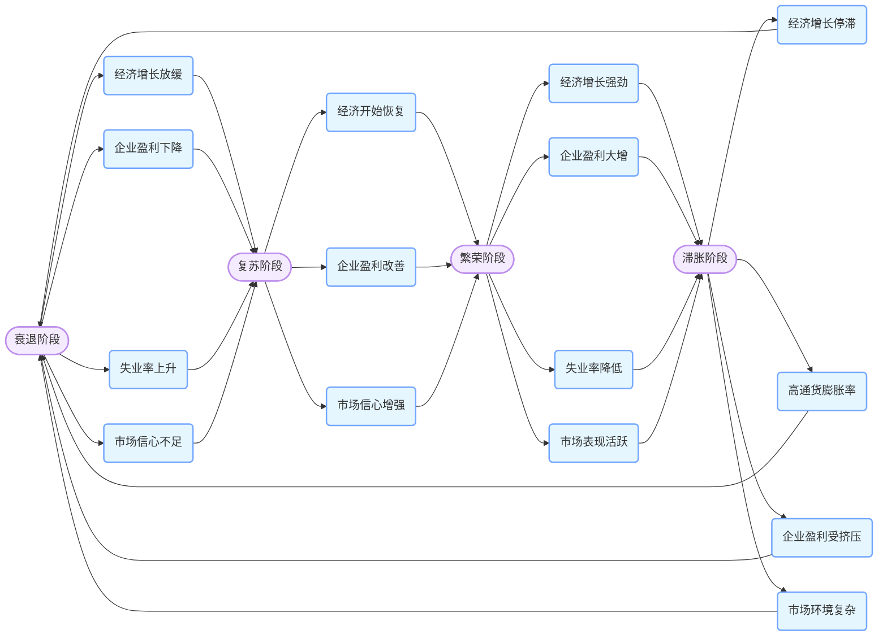

# 股市估值在不同经济周期阶段的表现

> 关键词：股市估值、经济周期、估值指标、市场表现、宏观经济

> 摘要：本文旨在深入探讨股市估值在不同经济周期阶段的表现。通过对经济周期各阶段的特征分析，结合常见的股市估值指标，阐述股市估值在不同阶段的变化规律。文章详细介绍了核心概念、算法原理，并通过数学模型和公式进行理论支撑，还给出了项目实战案例和实际应用场景。同时，推荐了相关的学习资源、开发工具和研究论文，最后总结了未来发展趋势与挑战，并对常见问题进行了解答。

## 1. 背景介绍 
### 1.1 目的和范围
本研究的目的是全面理解股市估值在不同经济周期阶段的表现，揭示其内在规律和影响因素。范围涵盖了经济周期的四个主要阶段：衰退、复苏、繁荣和滞胀，以及常用的股市估值指标，如市盈率（P/E）、市净率（P/B）等。通过对这些内容的研究，为投资者、分析师和政策制定者提供有价值的参考。

### 1.2 预期读者
本文的预期读者包括金融投资者、证券分析师、经济研究人员、金融从业者以及对股市和经济周期感兴趣的爱好者。他们可以从本文中获取关于股市估值与经济周期关系的深入知识，为投资决策、研究分析和政策制定提供依据。

### 1.3 文档结构概述
本文将按照以下结构进行阐述：首先介绍核心概念与联系，包括经济周期和股市估值的定义、分类以及它们之间的关系；接着讲解核心算法原理和具体操作步骤，通过 Python 代码实现对估值指标的计算；然后给出数学模型和公式，并进行详细讲解和举例说明；之后通过项目实战，展示代码的实际应用和解读；再探讨实际应用场景；推荐相关的工具和资源；最后总结未来发展趋势与挑战，解答常见问题，并提供扩展阅读和参考资料。

### 1.4 术语表
#### 1.4.1 核心术语定义
- **经济周期**：指经济活动沿着经济发展的总体趋势所经历的有规律的扩张和收缩。一般分为衰退、复苏、繁荣和滞胀四个阶段。
- **股市估值**：对股票市场整体或个别股票的价值进行评估的过程，常用的指标有市盈率、市净率、股息率等。
- **市盈率（P/E）**：指股票价格除以每股收益（EPS）的比率，反映了投资者为获得公司每一元盈利所愿意支付的价格。
- **市净率（P/B）**：指股票价格与每股净资产的比率，用于衡量股票的市场价值相对于其账面价值的高低。

#### 1.4.2 相关概念解释
- **衰退阶段**：经济增长放缓，企业盈利下降，失业率上升，市场信心不足。
- **复苏阶段**：经济开始从衰退中恢复，企业盈利逐渐改善，市场信心增强。
- **繁荣阶段**：经济增长强劲，企业盈利大幅增加，失业率降低，市场表现活跃。
- **滞胀阶段**：经济增长停滞，同时伴随着高通货膨胀率，企业盈利受到挤压，市场环境复杂。

#### 1.4.3 缩略词列表
- **P/E**：市盈率（Price-to-Earnings Ratio）
- **P/B**：市净率（Price-to-Book Ratio）
- **EPS**：每股收益（Earnings Per Share）

## 2. 核心概念与联系 

### 经济周期的划分与特征
经济周期通常可以划分为四个阶段，每个阶段都有其独特的经济特征和市场表现。下面是经济周期各阶段的特征示意图：



### 股市估值指标及其意义
常见的股市估值指标有市盈率（P/E）、市净率（P/B）和股息率等。这些指标从不同角度反映了股票的价值和市场的估值水平。

- **市盈率（P/E）**：市盈率是衡量股票相对价值的重要指标。较高的市盈率可能表示市场对该股票的未来盈利增长预期较高，或者股票被高估；较低的市盈率则可能表示股票被低估或市场对其未来盈利增长预期较低。
- **市净率（P/B）**：市净率反映了股票价格与每股净资产的关系。市净率较低的股票可能具有较高的投资价值，因为其市场价格相对账面价值较低；市净率较高的股票可能存在泡沫风险。
- **股息率**：股息率是指股息与股票价格的比率，反映了股票的分红能力。较高的股息率通常表示股票具有较好的现金回报能力。

### 经济周期与股市估值的联系
经济周期的不同阶段会对股市估值产生显著影响。在衰退阶段，由于企业盈利下降，市场信心不足，股市估值通常较低；在复苏阶段，随着经济的恢复和企业盈利的改善，股市估值开始上升；在繁荣阶段，经济增长强劲，企业盈利大增，市场情绪乐观，股市估值往往达到较高水平；在滞胀阶段，由于经济增长停滞和高通货膨胀率，企业盈利受到挤压，股市估值可能会下降或维持在较低水平。

## 3. 核心算法原理 & 具体操作步骤 

### 市盈率（P/E）的计算
市盈率的计算公式为：$P/E = \frac{股价}{每股收益}$

以下是使用 Python 代码计算市盈率的示例：

```python
def calculate_pe(stock_price, eps):
    """
    计算市盈率
    :param stock_price: 股票价格
    :param eps: 每股收益
    :return: 市盈率
    """
    if eps == 0:
        return float('inf')  # 避免除零错误
    return stock_price / eps

# 示例数据
stock_price = 50
eps = 2

pe_ratio = calculate_pe(stock_price, eps)
print(f"市盈率: {pe_ratio}")
```

### 市净率（P/B）的计算
市净率的计算公式为：$P/B = \frac{股价}{每股净资产}$

以下是使用 Python 代码计算市净率的示例：

```python
def calculate_pb(stock_price, book_value_per_share):
    """
    计算市净率
    :param stock_price: 股票价格
    :param book_value_per_share: 每股净资产
    :return: 市净率
    """
    if book_value_per_share == 0:
        return float('inf')  # 避免除零错误
    return stock_price / book_value_per_share

# 示例数据
stock_price = 50
book_value_per_share = 10

pb_ratio = calculate_pb(stock_price, book_value_per_share)
print(f"市净率: {pb_ratio}")
```

### 股息率的计算
股息率的计算公式为：$股息率 = \frac{每股股息}{股价} \times 100\%$

以下是使用 Python 代码计算股息率的示例：

```python
def calculate_dividend_yield(dividend_per_share, stock_price):
    """
    计算股息率
    :param dividend_per_share: 每股股息
    :param stock_price: 股票价格
    :return: 股息率
    """
    if stock_price == 0:
        return 0  # 避免除零错误
    return (dividend_per_share / stock_price) * 100

# 示例数据
dividend_per_share = 1
stock_price = 50

dividend_yield = calculate_dividend_yield(dividend_per_share, stock_price)
print(f"股息率: {dividend_yield}%")
```

## 4. 数学模型和公式 & 详细讲解 & 举例说明 

### 市盈率（P/E）模型
市盈率模型是基于企业未来盈利的预期来评估股票价值的一种方法。其基本公式为：$P = EPS \times P/E$，其中 $P$ 表示股票价格，$EPS$ 表示每股收益，$P/E$ 表示市盈率。

例如，假设某公司的每股收益为 $2$ 元，市场平均市盈率为 $20$ 倍，则该公司的股票合理价格为：$P = 2 \times 20 = 40$ 元。

### 市净率（P/B）模型
市净率模型是通过比较股票价格与每股净资产来评估股票价值的方法。其公式为：$P = B \times P/B$，其中 $P$ 表示股票价格，$B$ 表示每股净资产，$P/B$ 表示市净率。

例如，某公司的每股净资产为 $10$ 元，市净率为 $2$ 倍，则该公司的股票合理价格为：$P = 10 \times 2 = 20$ 元。

### 股息折现模型（DDM）
股息折现模型是基于股票未来股息的现值来评估股票价值的方法。其基本公式为：$P = \sum_{t=1}^{\infty} \frac{D_t}{(1 + r)^t}$，其中 $P$ 表示股票价格，$D_t$ 表示第 $t$ 期的股息，$r$ 表示折现率。

在实际应用中，通常会采用简化的股息折现模型，如固定增长股息折现模型：$P = \frac{D_1}{r - g}$，其中 $D_1$ 表示下一期的股息，$r$ 表示折现率，$g$ 表示股息的固定增长率。

例如，某公司下一期的股息为 $1$ 元，股息的固定增长率为 $5\%$，折现率为 $10\%$，则该公司的股票价值为：$P = \frac{1}{0.1 - 0.05} = 20$ 元。

## 5. 项目实战：代码实际案例和详细解释说明 

### 5.1  开发环境搭建
为了实现本项目，我们需要搭建以下开发环境：

- **Python 环境**：建议使用 Python 3.7 及以上版本。
- **相关库**：需要安装 `pandas`、`numpy` 等库，用于数据处理和分析。可以使用以下命令进行安装：
```sh
pip install pandas numpy
```

### 5.2  源代码详细实现和代码解读
以下是一个完整的 Python 代码示例，用于计算某只股票在不同经济周期阶段的估值指标，并进行可视化展示：

```python
import pandas as pd
import numpy as np
import matplotlib.pyplot as plt

# 示例数据：模拟某只股票在不同经济周期阶段的股价、每股收益和每股净资产
data = {
    '经济周期阶段': ['衰退', '复苏', '繁荣', '滞胀'],
    '股价': [20, 30, 50, 25],
    '每股收益': [1, 2, 3, 1.5],
    '每股净资产': [10, 15, 20, 12]
}

df = pd.DataFrame(data)

# 计算市盈率和市净率
df['市盈率'] = df['股价'] / df['每股收益']
df['市净率'] = df['股价'] / df['每股净资产']

# 打印计算结果
print(df)

# 可视化展示
plt.figure(figsize=(10, 6))

plt.subplot(2, 1, 1)
plt.bar(df['经济周期阶段'], df['市盈率'])
plt.title('不同经济周期阶段的市盈率')
plt.ylabel('市盈率')

plt.subplot(2, 1, 2)
plt.bar(df['经济周期阶段'], df['市净率'])
plt.title('不同经济周期阶段的市净率')
plt.ylabel('市净率')
plt.xlabel('经济周期阶段')

plt.tight_layout()
plt.show()
```

### 5.3  代码解读与分析
- **数据准备**：首先，我们创建了一个包含不同经济周期阶段的股价、每股收益和每股净资产的示例数据字典，并将其转换为 Pandas 数据框。
- **指标计算**：使用数据框的列运算功能，计算了市盈率和市净率，并将结果添加到数据框中。
- **结果展示**：打印计算结果，并使用 Matplotlib 库进行可视化展示，分别绘制了不同经济周期阶段的市盈率和市净率柱状图。

通过这个示例，我们可以直观地看到某只股票在不同经济周期阶段的估值指标变化情况。

## 6. 实际应用场景 
### 投资决策
投资者可以根据股市估值在不同经济周期阶段的表现，制定合理的投资策略。在衰退阶段，由于股市估值较低，投资者可以寻找被低估的股票进行长期投资；在复苏阶段，随着股市估值的上升，投资者可以适当增加股票投资比例；在繁荣阶段，股市估值较高，投资者需要警惕市场泡沫，适时减仓；在滞胀阶段，由于市场环境复杂，投资者可以选择防御性较强的股票或其他投资品种。

### 风险管理
金融机构和投资者可以通过分析股市估值与经济周期的关系，评估投资组合的风险。在经济周期的不同阶段，股市估值的波动可能会对投资组合的价值产生影响。通过合理调整投资组合的资产配置，可以降低风险，提高投资组合的稳定性。

### 政策制定
政府和监管机构可以根据股市估值在不同经济周期阶段的表现，制定相应的宏观经济政策和金融监管政策。在经济衰退阶段，政府可以采取宽松的货币政策和财政政策，刺激经济增长，提高股市估值；在经济繁荣阶段，政府可以采取紧缩的货币政策和财政政策，防止经济过热和股市泡沫。

## 7. 工具和资源推荐
### 7.1 学习资源推荐
#### 7.1.1 书籍推荐
- 《证券分析》（本杰明·格雷厄姆）：被誉为投资界的圣经，详细介绍了股票估值的基本方法和原则。
- 《聪明的投资者》（本杰明·格雷厄姆）：为普通投资者提供了实用的投资建议和方法。
- 《金融炼金术》（乔治·索罗斯）：阐述了金融市场的运行规律和投资者的心理因素。

#### 7.1.2 在线课程
- Coursera 上的“投资学原理”：由知名高校教授授课，系统介绍了投资学的基本理论和方法。
- edX 上的“金融市场”：涵盖了金融市场的各个方面，包括股票市场、债券市场等。

#### 7.1.3 技术博客和网站
- 雪球网：国内知名的财经社区，提供股票行情、分析报告、投资策略等信息。
- 东方财富网：提供全面的金融资讯和数据服务，包括股票、基金、债券等市场的实时行情和分析。

### 7.2 开发工具框架推荐
#### 7.2.1 IDE和编辑器
- PyCharm：功能强大的 Python 集成开发环境，提供代码编辑、调试、版本控制等功能。
- Jupyter Notebook：交互式的开发环境，适合进行数据探索和分析。

#### 7.2.2 调试和性能分析工具
- pdb：Python 内置的调试器，可用于调试 Python 代码。
- cProfile：Python 标准库中的性能分析工具，可用于分析代码的性能瓶颈。

#### 7.2.3 相关框架和库
- Pandas：用于数据处理和分析的 Python 库，提供了高效的数据结构和数据操作方法。
- NumPy：用于科学计算的 Python 库，提供了多维数组和数学函数等功能。
- Matplotlib：用于数据可视化的 Python 库，可绘制各种类型的图表。

### 7.3 相关论文著作推荐
#### 7.3.1 经典论文
- Fama, E. F., & French, K. R. (1992). The cross-section of expected stock returns. The Journal of Finance, 47(2), 427-465.
- Shiller, R. J. (1981). Do stock prices move too much to be justified by subsequent changes in dividends? The American Economic Review, 71(3), 421-436.

#### 7.3.2 最新研究成果
- Baker, M., & Wurgler, J. (2006). Investor sentiment and the cross-section of stock returns. The Journal of Finance, 61(4), 1645-1680.
- Cochrane, J. H. (2017). Asset pricing: Revised edition. Princeton University Press.

#### 7.3.3 应用案例分析
- Damodaran, A. (2012). The little book of valuation: How to value a company, pick a stock and profit. FT Press.
- Aswath Damodaran 的个人网站：提供了大量的股票估值案例和分析报告。

## 8. 总结：未来发展趋势与挑战
### 未来发展趋势
- **智能化估值方法**：随着人工智能和机器学习技术的发展，未来股市估值可能会采用更加智能化的方法。例如，利用深度学习算法对大量的市场数据和企业财务数据进行分析，提高估值的准确性和效率。
- **全球化视角**：随着全球经济一体化的加深，股市估值需要考虑全球经济周期的影响。投资者和分析师需要从全球化的视角来评估股票的价值，关注国际市场的动态和变化。
- **绿色金融与可持续发展**：随着社会对环境保护和可持续发展的关注度不断提高，绿色金融和可持续发展将成为未来股市估值的重要因素。投资者将更加关注企业的环境、社会和治理（ESG）表现，将其纳入估值模型中。

### 挑战
- **数据质量和可靠性**：股市估值需要大量的市场数据和企业财务数据，数据的质量和可靠性直接影响估值的准确性。然而，现实中数据可能存在误差、缺失或滞后等问题，给估值带来挑战。
- **经济不确定性**：经济周期的变化受到多种因素的影响，如宏观经济政策、地缘政治风险、自然灾害等，这些因素增加了经济的不确定性，使得股市估值更加困难。
- **市场情绪和非理性行为**：股票市场受到投资者情绪和非理性行为的影响较大，市场情绪的波动可能导致股票价格偏离其内在价值。如何准确评估市场情绪和非理性行为对股市估值的影响，是未来需要解决的挑战之一。

## 9. 附录：常见问题与解答
### 问题 1：如何判断当前经济处于哪个周期阶段？
解答：可以通过观察宏观经济指标，如 GDP 增长率、通货膨胀率、失业率、利率等，结合经济政策的变化和市场表现，来判断当前经济处于哪个周期阶段。例如，当 GDP 增长率下降、通货膨胀率降低、失业率上升时，经济可能处于衰退阶段；当 GDP 增长率上升、通货膨胀率温和、失业率下降时，经济可能处于复苏阶段。

### 问题 2：股市估值指标的局限性有哪些？
解答：股市估值指标存在一定的局限性。例如，市盈率指标没有考虑企业的未来增长潜力和风险因素；市净率指标没有考虑企业的无形资产价值；股息率指标没有考虑股息的稳定性和可持续性。因此，在使用估值指标时，需要结合其他因素进行综合分析。

### 问题 3：如何选择合适的估值方法？
解答：选择合适的估值方法需要考虑多个因素，如企业的行业特点、发展阶段、财务状况、市场环境等。对于成熟的传统行业企业，可以采用市盈率、市净率等相对估值方法；对于高成长的新兴行业企业，可以采用股息折现模型、自由现金流折现模型等绝对估值方法。同时，也可以结合多种估值方法进行综合评估，以提高估值的准确性。

## 10. 扩展阅读 & 参考资料
- 格雷厄姆, B., & 多德, D. L. (2009). 证券分析. 海南出版社.
- 希勒, R. J. (2014). 非理性繁荣. 中国人民大学出版社.
- Fama, E. F., & French, K. R. (2015). A five-factor asset pricing model. Journal of Financial Economics, 116(1), 1-22.
- 雪球网：https://xueqiu.com/
- 东方财富网：https://www.eastmoney.com/

作者：AI天才研究院/AI Genius Institute & 禅与计算机程序设计艺术 /Zen And The Art of Computer Programming