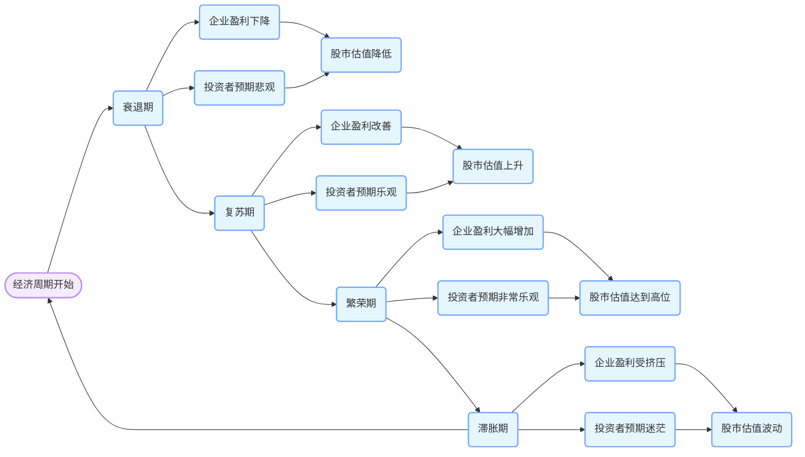

# 股市估值在不同经济周期阶段的表现

> 关键词：股市估值、经济周期、表现特征、估值方法、投资策略

> 摘要：本文深入探讨了股市估值在不同经济周期阶段的表现。首先介绍了相关背景，包括目的、预期读者、文档结构和术语表。接着阐述了股市估值和经济周期的核心概念及联系，给出了原理和架构的示意图与流程图。详细讲解了用于分析的核心算法原理及具体操作步骤，结合数学模型和公式进行说明。通过项目实战案例展示代码实现和解读。分析了股市估值在不同经济周期阶段的实际应用场景，推荐了学习资源、开发工具框架和相关论文著作。最后总结了未来发展趋势与挑战，提供常见问题解答和扩展阅读参考资料，旨在帮助投资者更好地理解股市估值与经济周期的关系，制定合理的投资策略。

## 1. 背景介绍 
### 1.1 目的和范围
本研究的主要目的是深入探究股市估值在不同经济周期阶段的具体表现，分析两者之间的内在联系和规律。通过对这一问题的研究，为投资者提供更准确的市场判断依据，帮助他们在不同的经济环境下制定合理的投资策略。研究范围涵盖了不同类型的经济周期，如衰退期、复苏期、繁荣期和滞胀期，以及常见的股市估值指标，如市盈率（P/E）、市净率（P/B）等。

### 1.2 预期读者
本文的预期读者主要包括股票投资者、金融分析师、投资顾问以及对金融市场和经济周期感兴趣的研究人员。对于投资者来说，了解股市估值在不同经济周期阶段的表现有助于他们把握投资时机，降低投资风险，提高投资收益。金融分析师和投资顾问可以将本文的研究成果应用于实际工作中，为客户提供更专业的投资建议。研究人员则可以从本文中获取相关的研究思路和数据，进一步深入研究股市估值和经济周期的关系。

### 1.3 文档结构概述
本文共分为十个部分。第一部分为背景介绍，阐述了研究的目的、范围、预期读者和文档结构。第二部分介绍了股市估值和经济周期的核心概念与联系，包括相关原理和架构的示意图与流程图。第三部分详细讲解了核心算法原理及具体操作步骤，并使用Python源代码进行阐述。第四部分给出了数学模型和公式，并进行详细讲解和举例说明。第五部分通过项目实战，展示了代码的实际案例和详细解释。第六部分分析了股市估值在不同经济周期阶段的实际应用场景。第七部分推荐了学习资源、开发工具框架和相关论文著作。第八部分总结了未来发展趋势与挑战。第九部分为附录，提供常见问题与解答。第十部分给出了扩展阅读和参考资料。

### 1.4 术语表
#### 1.4.1 核心术语定义
- **股市估值**：是指对股票的内在价值进行评估的过程和方法，通过一定的指标和模型来衡量股票价格是否合理。常见的估值指标有市盈率、市净率、市销率等。
- **经济周期**：也称为商业周期，是指经济活动沿着经济发展的总体趋势所经历的有规律的扩张和收缩。一般分为衰退、复苏、繁荣和滞胀四个阶段。
- **市盈率（P/E）**：是指股票价格除以每股收益的比率，反映了投资者为获得公司每一元盈利所愿意支付的价格。
- **市净率（P/B）**：是指股票价格除以每股净资产的比率，用于衡量股票的市场价值相对于其账面价值的倍数。

#### 1.4.2 相关概念解释
- **内在价值**：是指股票所代表的公司的真实价值，它基于公司的基本面因素，如盈利能力、资产状况、行业前景等。
- **市场价值**：是指股票在证券市场上的交易价格，它受到供求关系、投资者情绪等多种因素的影响。
- **经济衰退**：是指经济活动普遍放缓、国民生产总值（GDP）连续两个季度或以上下降的时期，通常伴随着失业率上升、企业盈利下降等现象。
- **经济复苏**：是指经济从衰退中逐渐恢复，GDP开始增长，企业盈利改善，就业市场逐渐好转的时期。
- **经济繁荣**：是指经济处于高速增长阶段，GDP增长率较高，企业盈利大幅增加，就业充分，市场信心高涨的时期。
- **经济滞胀**：是指经济增长停滞与通货膨胀并存的现象，即GDP增长缓慢甚至停滞，而物价水平却持续上涨。

#### 1.4.3 缩略词列表
- **P/E**：市盈率（Price-to-Earnings Ratio）
- **P/B**：市净率（Price-to-Book Ratio）
- **GDP**：国内生产总值（Gross Domestic Product）

## 2. 核心概念与联系 

### 2.1 股市估值的核心概念
股市估值是投资者判断股票投资价值的重要依据。其基本原理是通过对公司的财务数据、行业前景等因素进行分析，估算出股票的内在价值，然后与当前的市场价格进行比较。如果市场价格低于内在价值，则认为股票被低估，具有投资价值；反之，则认为股票被高估，投资风险较大。

常见的股市估值方法有绝对估值法和相对估值法。绝对估值法是通过对公司未来现金流的折现来计算股票的内在价值，如现金流折现模型（DCF）。相对估值法是通过与同行业其他公司或市场平均水平进行比较来评估股票的价值，如市盈率法、市净率法等。

### 2.2 经济周期的核心概念
经济周期是经济活动的周期性波动，它反映了经济增长的阶段性变化。经济周期的形成是由多种因素共同作用的结果，包括宏观经济政策、技术创新、市场供求关系等。

经济周期一般分为四个阶段：衰退期、复苏期、繁荣期和滞胀期。在衰退期，经济增长放缓，企业盈利下降，失业率上升，市场信心低迷。在复苏期，经济开始逐渐恢复，企业盈利改善，就业市场逐渐好转，市场信心逐渐增强。在繁荣期，经济处于高速增长阶段，企业盈利大幅增加，就业充分，市场信心高涨。在滞胀期，经济增长停滞，物价水平持续上涨，企业盈利受到挤压，市场信心受到打击。

### 2.3 股市估值与经济周期的联系
股市估值与经济周期密切相关。在不同的经济周期阶段，股市估值会呈现出不同的表现特征。

在衰退期，由于经济增长放缓，企业盈利下降，投资者对未来的预期较为悲观，因此股市估值往往较低。市盈率和市净率等估值指标通常会下降，股票价格也会随之下跌。

在复苏期，随着经济的逐渐恢复，企业盈利开始改善，投资者对未来的预期逐渐乐观，股市估值也会逐渐上升。市盈率和市净率等估值指标会逐渐提高，股票价格也会随之上涨。

在繁荣期，经济处于高速增长阶段，企业盈利大幅增加，投资者对未来的预期非常乐观，股市估值会达到较高水平。市盈率和市净率等估值指标可能会远远高于历史平均水平，股票价格也会大幅上涨。

在滞胀期，由于经济增长停滞，物价水平持续上涨，企业盈利受到挤压，投资者对未来的预期较为迷茫，股市估值会出现波动。市盈率和市净率等估值指标可能会不稳定，股票价格也会出现较大的波动。

### 2.4 核心概念原理和架构的文本示意图
```plaintext
股市估值与经济周期关系架构

经济周期
|-- 衰退期
|   |-- 企业盈利下降
|   |-- 投资者预期悲观
|   |-- 股市估值降低
|-- 复苏期
|   |-- 企业盈利改善
|   |-- 投资者预期乐观
|   |-- 股市估值上升
|-- 繁荣期
|   |-- 企业盈利大幅增加
|   |-- 投资者预期非常乐观
|   |-- 股市估值达到高位
|-- 滞胀期
|   |-- 企业盈利受挤压
|   |-- 投资者预期迷茫
|   |-- 股市估值波动

股市估值方法
|-- 绝对估值法
|   |-- 现金流折现模型（DCF）
|-- 相对估值法
|   |-- 市盈率法（P/E）
|   |-- 市净率法（P/B）
```

### 2.5 Mermaid 流程图


## 3. 核心算法原理 & 具体操作步骤 

### 3.1 市盈率（P/E）计算原理及 Python 实现
市盈率（P/E）是最常用的股市估值指标之一，它反映了投资者为获得公司每一元盈利所愿意支付的价格。其计算公式为：

$$P/E = \frac{股票价格}{每股收益}$$

以下是使用 Python 计算市盈率的示例代码：
```python
def calculate_pe(stock_price, earnings_per_share):
    """
    计算市盈率
    :param stock_price: 股票价格
    :param earnings_per_share: 每股收益
    :return: 市盈率
    """
    if earnings_per_share == 0:
        return float('inf')  # 避免除零错误
    return stock_price / earnings_per_share

# 示例数据
stock_price = 50
earnings_per_share = 2

pe_ratio = calculate_pe(stock_price, earnings_per_share)
print(f"市盈率: {pe_ratio}")
```
### 3.2 市净率（P/B）计算原理及 Python 实现
市净率（P/B）是指股票价格除以每股净资产的比率，用于衡量股票的市场价值相对于其账面价值的倍数。其计算公式为：

$$P/B = \frac{股票价格}{每股净资产}$$

以下是使用 Python 计算市净率的示例代码：
```python
def calculate_pb(stock_price, book_value_per_share):
    """
    计算市净率
    :param stock_price: 股票价格
    :param book_value_per_share: 每股净资产
    :return: 市净率
    """
    if book_value_per_share == 0:
        return float('inf')  # 避免除零错误
    return stock_price / book_value_per_share

# 示例数据
stock_price = 50
book_value_per_share = 10

pb_ratio = calculate_pb(stock_price, book_value_per_share)
print(f"市净率: {pb_ratio}")
```
### 3.3 具体操作步骤
1. **数据收集**：收集股票的价格、每股收益和每股净资产等数据。这些数据可以从金融数据提供商（如东方财富、同花顺等）或公司的财务报表中获取。
2. **数据清洗**：对收集到的数据进行清洗，去除缺失值、异常值等，确保数据的准确性和可靠性。
3. **计算估值指标**：使用上述 Python 代码计算市盈率和市净率等估值指标。
4. **分析估值结果**：将计算得到的估值指标与同行业其他公司或市场平均水平进行比较，判断股票的估值是否合理。同时，结合经济周期的阶段，分析股市估值的变化趋势。

## 4. 数学模型和公式 & 详细讲解 & 举例说明 

### 4.1 现金流折现模型（DCF）
现金流折现模型（DCF）是一种常用的绝对估值方法，它通过对公司未来现金流的折现来计算股票的内在价值。其基本公式为：

$$V = \sum_{t=1}^{n} \frac{CF_t}{(1 + r)^t} + \frac{TV}{(1 + r)^n}$$

其中：
- $V$ 表示股票的内在价值
- $CF_t$ 表示第 $t$ 期的现金流
- $r$ 表示折现率
- $n$ 表示预测期数
- $TV$ 表示终值

#### 详细讲解
- **现金流预测**：首先需要对公司未来的现金流进行预测。这通常需要考虑公司的业务模式、市场前景、竞争优势等因素。可以采用历史数据分析法、行业比较法等方法进行预测。
- **折现率确定**：折现率反映了投资者对投资风险的要求。一般可以使用资本资产定价模型（CAPM）来确定折现率，其公式为：

$$r = R_f + \beta \times (R_m - R_f)$$

其中：
- $R_f$ 表示无风险利率
- $\beta$ 表示股票的贝塔系数
- $R_m$ 表示市场收益率

- **终值计算**：终值是指预测期结束后公司的价值。可以采用永续增长模型来计算终值，其公式为：

$$TV = \frac{CF_{n+1}}{r - g}$$

其中：
- $CF_{n+1}$ 表示预测期结束后下一期的现金流
- $g$ 表示永续增长率

#### 举例说明
假设某公司未来三年的现金流分别为 100 万元、120 万元和 150 万元，预测期结束后现金流的永续增长率为 3%，折现率为 10%。则该公司股票的内在价值计算如下：

1. 计算预测期内现金流的现值：
   - $PV_1 = \frac{100}{(1 + 0.1)^1} = 90.91$（万元）
   - $PV_2 = \frac{120}{(1 + 0.1)^2} = 99.17$（万元）
   - $PV_3 = \frac{150}{(1 + 0.1)^3} = 112.69$（万元）

2. 计算终值：
   - $CF_4 = 150 \times (1 + 0.03) = 154.5$（万元）
   - $TV = \frac{154.5}{0.1 - 0.03} = 2207.14$（万元）
   - $PV_{TV} = \frac{2207.14}{(1 + 0.1)^3} = 1657.94$（万元）

3. 计算股票的内在价值：
   - $V = PV_1 + PV_2 + PV_3 + PV_{TV} = 90.91 + 99.17 + 112.69 + 1657.94 = 1960.71$（万元）

### 4.2 相对估值法的数学原理
相对估值法是通过与同行业其他公司或市场平均水平进行比较来评估股票的价值。常见的相对估值指标有市盈率（P/E）、市净率（P/B）等。

#### 市盈率法
市盈率法的基本思想是，同行业的公司具有相似的盈利特征和风险水平，因此可以使用同行业的平均市盈率来评估目标公司的股票价值。其计算公式为：

$$股票价值 = 每股收益 \times 同行业平均市盈率$$

#### 市净率法
市净率法的基本思想是，同行业的公司具有相似的资产质量和盈利能力，因此可以使用同行业的平均市净率来评估目标公司的股票价值。其计算公式为：

$$股票价值 = 每股净资产 \times 同行业平均市净率$$

#### 举例说明
假设某行业的平均市盈率为 20 倍，某公司的每股收益为 2 元，则该公司股票的估值为：

$$股票价值 = 2 \times 20 = 40$$（元）

假设该行业的平均市净率为 3 倍，该公司的每股净资产为 10 元，则该公司股票的估值为：

$$股票价值 = 10 \times 3 = 30$$（元）

## 5. 项目实战：代码实际案例和详细解释说明 

### 5.1  开发环境搭建
为了实现对股市估值在不同经济周期阶段表现的分析，我们需要搭建一个开发环境。以下是具体的步骤：

1. **安装 Python**：Python 是一种广泛使用的编程语言，具有丰富的数据分析和机器学习库。可以从 Python 官方网站（https://www.python.org/downloads/）下载并安装最新版本的 Python。
2. **安装必要的库**：我们需要安装一些必要的 Python 库，如 Pandas、Numpy、Matplotlib 等。可以使用以下命令进行安装：
```sh
pip install pandas numpy matplotlib
```
3. **获取金融数据**：可以使用第三方金融数据接口（如 Tushare、BaoStock 等）获取股票的价格、每股收益、每股净资产等数据。需要注册并获取相应的 API 密钥。

### 5.2  源代码详细实现和代码解读
以下是一个使用 Python 分析股市估值在不同经济周期阶段表现的示例代码：
```python
import pandas as pd
import numpy as np
import matplotlib.pyplot as plt

# 模拟不同经济周期阶段的数据
# 衰退期
recession_data = {
    'stock_price': [50, 45, 40, 35, 30],
    'earnings_per_share': [2, 1.8, 1.5, 1.2, 1],
    'book_value_per_share': [10, 9, 8, 7, 6]
}
recession_df = pd.DataFrame(recession_data)

# 复苏期
recovery_data = {
    'stock_price': [30, 35, 40, 45, 50],
    'earnings_per_share': [1, 1.2, 1.5, 1.8, 2],
    'book_value_per_share': [6, 7, 8, 9, 10]
}
recovery_df = pd.DataFrame(recovery_data)

# 繁荣期
boom_data = {
    'stock_price': [50, 60, 70, 80, 90],
    'earnings_per_share': [2, 2.5, 3, 3.5, 4],
    'book_value_per_share': [10, 12, 14, 16, 18]
}
boom_df = pd.DataFrame(boom_data)

# 滞胀期
stagflation_data = {
    'stock_price': [90, 85, 95, 80, 90],
    'earnings_per_share': [4, 3.5, 3, 2.5, 2],
    'book_value_per_share': [18, 16, 14, 12, 10]
}
stagflation_df = pd.DataFrame(stagflation_data)

# 定义计算市盈率和市净率的函数
def calculate_pe(df):
    return df['stock_price'] / df['earnings_per_share']

def calculate_pb(df):
    return df['stock_price'] / df['book_value_per_share']

# 计算不同经济周期阶段的市盈率和市净率
recession_pe = calculate_pe(recession_df)
recession_pb = calculate_pb(recession_df)

recovery_pe = calculate_pe(recovery_df)
recovery_pb = calculate_pb(recovery_df)

boom_pe = calculate_pe(boom_df)
boom_pb = calculate_pb(boom_df)

stagflation_pe = calculate_pe(stagflation_df)
stagflation_pb = calculate_pb(stagflation_df)

# 绘制不同经济周期阶段的市盈率和市净率变化图
plt.figure(figsize=(12, 8))

plt.subplot(2, 1, 1)
plt.plot(recession_pe, label='衰退期市盈率')
plt.plot(recovery_pe, label='复苏期市盈率')
plt.plot(boom_pe, label='繁荣期市盈率')
plt.plot(stagflation_pe, label='滞胀期市盈率')
plt.title('不同经济周期阶段的市盈率变化')
plt.xlabel('时期')
plt.ylabel('市盈率')
plt.legend()

plt.subplot(2, 1, 2)
plt.plot(recession_pb, label='衰退期市净率')
plt.plot(recovery_pb, label='复苏期市净率')
plt.plot(boom_pb, label='繁荣期市净率')
plt.plot(stagflation_pb, label='滞胀期市净率')
plt.title('不同经济周期阶段的市净率变化')
plt.xlabel('时期')
plt.ylabel('市净率')
plt.legend()

plt.tight_layout()
plt.show()
```
### 5.3  代码解读与分析
1. **数据模拟**：使用字典和 Pandas 数据框模拟了不同经济周期阶段的股票价格、每股收益和每股净资产数据。
2. **函数定义**：定义了 `calculate_pe` 和 `calculate_pb` 函数，用于计算市盈率和市净率。
3. **计算估值指标**：分别计算了不同经济周期阶段的市盈率和市净率。
4. **可视化**：使用 Matplotlib 库绘制了不同经济周期阶段的市盈率和市净率变化图，直观地展示了股市估值在不同经济周期阶段的表现。

从代码运行结果可以看出，在衰退期，市盈率和市净率通常较低；在复苏期，市盈率和市净率逐渐上升；在繁荣期，市盈率和市净率达到较高水平；在滞胀期，市盈率和市净率会出现波动。

## 6. 实际应用场景 
### 6.1 投资者决策
投资者可以根据股市估值在不同经济周期阶段的表现来制定投资策略。在衰退期，由于股市估值较低，投资者可以寻找被低估的股票进行长期投资。在复苏期，随着股市估值的上升，投资者可以适当增加股票投资比例。在繁荣期，由于股市估值较高，投资者需要警惕市场风险，可以适当减少股票投资比例，增加现金或债券等安全资产的配置。在滞胀期，由于股市估值波动较大，投资者需要更加谨慎，选择具有抗通胀能力的股票进行投资。

### 6.2 金融机构资产配置
金融机构（如银行、基金公司等）可以根据股市估值和经济周期的变化来调整资产配置。在衰退期，金融机构可以减少股票投资，增加债券、现金等安全资产的配置。在复苏期，金融机构可以逐渐增加股票投资比例。在繁荣期，金融机构可以适当降低股票投资比例，防范市场风险。在滞胀期，金融机构可以选择投资一些与通胀挂钩的资产，如黄金、房地产等。

### 6.3 宏观经济政策制定
政府和央行可以根据股市估值和经济周期的变化来制定宏观经济政策。在衰退期，政府可以采取扩张性的财政政策和货币政策，刺激经济增长，提高股市估值。在复苏期，政府可以适当调整政策力度，保持经济的稳定增长。在繁荣期，政府可以采取紧缩性的财政政策和货币政策，防止经济过热，控制股市估值泡沫。在滞胀期，政府需要采取综合措施，既要控制通货膨胀，又要促进经济增长。

## 7. 工具和资源推荐
### 7.1 学习资源推荐
#### 7.1.1 书籍推荐
- 《证券分析》（本杰明·格雷厄姆著）：被誉为投资领域的圣经，详细介绍了股票估值的基本方法和原则。
- 《聪明的投资者》（本杰明·格雷厄姆著）：为普通投资者提供了实用的投资建议和方法。
- 《金融炼金术》（乔治·索罗斯著）：探讨了金融市场的运行规律和投资者的心理行为。
- 《周期》（霍华德·马克斯著）：深入分析了经济周期和市场周期的特点和规律。

#### 7.1.2 在线课程
- Coursera 上的“Financial Markets”课程：由耶鲁大学教授罗伯特·席勒（Robert Shiller）授课，介绍了金融市场的基本原理和投资策略。
- edX 上的“Investment Management”课程：由麻省理工学院（MIT）教授授课，涵盖了投资组合管理、资产定价等内容。
- 网易云课堂上的“股票投资入门与实战技巧”课程：适合初学者学习股票投资的基本知识和技巧。

#### 7.1.3 技术博客和网站
- 雪球网（https://xueqiu.com/）：提供股票行情、财经新闻、投资社区等服务，是投资者交流和学习的重要平台。
- 东方财富网（https://www.eastmoney.com/）：提供全面的金融信息和数据，包括股票、基金、债券等。
- 华尔街见闻（https://wallstreetcn.com/）：专注于全球金融市场的资讯和分析，提供及时的财经新闻和深度研究报告。

### 7.2 开发工具框架推荐
#### 7.2.1 IDE和编辑器
- PyCharm：是一款专业的 Python 集成开发环境（IDE），具有强大的代码编辑、调试和项目管理功能。
- Jupyter Notebook：是一种交互式的开发环境，适合进行数据分析和可视化。
- Visual Studio Code：是一款轻量级的代码编辑器，支持多种编程语言，具有丰富的插件扩展功能。

#### 7.2.2 调试和性能分析工具
- PDB：是 Python 内置的调试器，可以帮助开发者定位和解决代码中的问题。
- cProfile：是 Python 标准库中的性能分析工具，可以分析代码的运行时间和函数调用情况。
- Py-Spy：是一个轻量级的 Python 性能分析工具，可以实时监控 Python 程序的性能。

#### 7.2.3 相关框架和库
- Pandas：是一个强大的数据分析库，提供了高效的数据结构和数据处理工具。
- Numpy：是 Python 的科学计算基础库，提供了高效的数组操作和数学函数。
- Matplotlib：是一个用于数据可视化的库，可以绘制各种类型的图表和图形。
- Scikit-learn：是一个常用的机器学习库，提供了丰富的机器学习算法和工具。

### 7.3 相关论文著作推荐
#### 7.3.1 经典论文
- “The Dividend-Price Ratio and Expectations of Future Dividends and Discount Factors”（John Y. Campbell 和 Robert J. Shiller 著）：研究了股息 - 价格比率与未来股息和贴现因子预期之间的关系。
- “Efficient Capital Markets: A Review of Theory and Empirical Work”（Eugene F. Fama 著）：提出了有效市场假说，对金融市场的效率进行了深入探讨。
- “Capital Asset Prices: A Theory of Market Equilibrium Under Conditions of Risk”（William F. Sharpe 著）：提出了资本资产定价模型（CAPM），用于计算资产的预期收益率。

#### 7.3.2 最新研究成果
- “Stock Market Valuation and Macroeconomic Conditions”：研究了股市估值与宏观经济条件之间的关系，分析了不同经济周期阶段股市估值的变化特征。
- “The Impact of Economic Cycles on Stock Market Volatility”：探讨了经济周期对股市波动率的影响，提出了相应的风险管理策略。

#### 7.3.3 应用案例分析
- “Case Studies in Stock Market Valuation during Economic Recessions”：通过实际案例分析了衰退期股市估值的特点和投资策略。
- “Investment Strategies in Different Economic Cycle Phases: A Practical Guide”：结合实际案例，介绍了在不同经济周期阶段的投资策略和资产配置方法。

## 8. 总结：未来发展趋势与挑战
### 8.1 未来发展趋势
- **量化分析的应用更加广泛**：随着大数据和人工智能技术的发展，量化分析在股市估值和投资决策中的应用将更加广泛。投资者可以利用量化模型和算法，对股市估值和经济周期进行更加准确的分析和预测。
- **跨市场和跨资产类别的研究增加**：未来的研究将不仅仅局限于股票市场，还将涉及债券市场、外汇市场、商品市场等多个市场，以及股票、债券、基金、期货等多种资产类别。投资者需要综合考虑不同市场和资产类别的相互关系，制定更加合理的投资策略。
- **环境、社会和治理（ESG）因素的影响加大**：随着社会对可持续发展的关注度不断提高，环境、社会和治理（ESG）因素将对股市估值产生越来越大的影响。投资者在进行股市估值和投资决策时，需要考虑公司的 ESG 表现。

### 8.2 挑战
- **经济周期的不确定性增加**：随着全球经济的复杂性和不确定性不断增加，经济周期的预测难度也越来越大。投资者需要更加灵活地应对经济周期的变化，及时调整投资策略。
- **市场情绪和投资者行为的影响**：市场情绪和投资者行为对股市估值的影响越来越大，而且难以预测和控制。投资者需要具备较强的心理素质和风险意识，避免受到市场情绪的影响。
- **数据质量和隐私问题**：量化分析需要大量的高质量数据支持，但是数据质量和隐私问题也日益突出。投资者需要选择可靠的数据来源，并加强数据安全和隐私保护。

## 9. 附录：常见问题与解答
### 9.1 如何判断当前处于经济周期的哪个阶段？
可以通过分析宏观经济指标（如 GDP 增长率、通货膨胀率、失业率等）、行业数据和市场情绪等因素来判断当前处于经济周期的哪个阶段。此外，还可以参考专业机构的研究报告和分析意见。

### 9.2 股市估值指标是否适用于所有行业？
不同行业的特点和盈利模式不同，因此股市估值指标的适用性也有所不同。例如，对于一些新兴行业（如科技行业），由于其盈利增长较快，市盈率可能会较高；而对于一些传统行业（如制造业），市盈率可能会相对较低。在使用股市估值指标时，需要结合行业特点进行分析。

### 9.3 如何选择合适的估值方法？
选择合适的估值方法需要考虑多个因素，如公司的行业特点、盈利模式、发展阶段等。一般来说，对于成熟稳定的公司，可以使用相对估值法；对于成长型公司，可以使用绝对估值法。同时，也可以结合多种估值方法进行综合分析。

### 9.4 股市估值与股票价格有什么关系？
股市估值是对股票内在价值的评估，而股票价格是市场供求关系决定的。当股票价格低于估值时，股票被低估，具有投资价值；当股票价格高于估值时，股票被高估，投资风险较大。但是，股票价格并不总是与估值一致，市场情绪、投资者预期等因素也会影响股票价格。

## 10. 扩展阅读 & 参考资料
### 扩展阅读
- 《漫步华尔街》（伯顿·马尔基尔著）：介绍了股票投资的基本原理和方法，以及如何在市场中进行有效的投资。
- 《投资最重要的事》（霍华德·马克斯著）：分享了作者多年的投资经验和心得，强调了投资中的风险控制和逆向思维。
- 《穷查理宝典》（彼得·考夫曼编著）：收录了查理·芒格的演讲和文章，介绍了他的投资理念和思维方式。

### 参考资料
- 金融数据提供商（如东方财富、同花顺等）的官方网站
- 各国央行和政府部门发布的宏观经济数据和政策报告
- 学术期刊（如《金融研究》、《经济研究》等）上发表的相关研究论文

作者：AI天才研究院/AI Genius Institute & 禅与计算机程序设计艺术 /Zen And The Art of Computer Programming