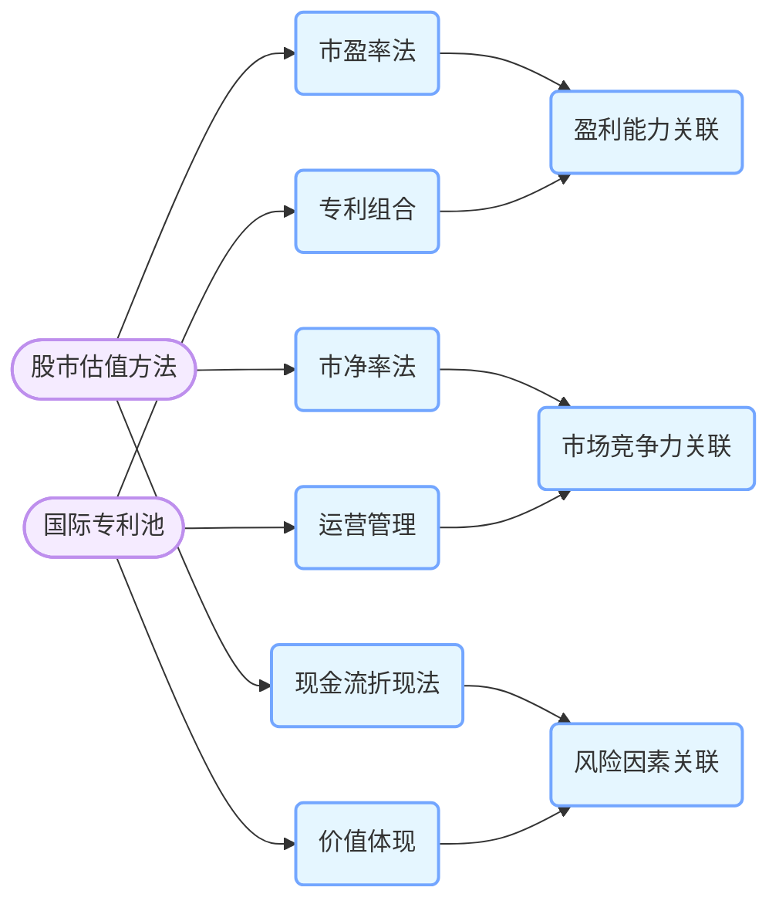

# 股市估值在国际专利池价值评估中的应用

> 关键词：股市估值、国际专利池、价值评估、金融模型、知识产权

> 摘要：本文深入探讨了股市估值在国际专利池价值评估中的应用。首先介绍了研究的背景、目的、预期读者等内容，接着阐述了股市估值和国际专利池的核心概念及两者之间的联系。详细讲解了相关核心算法原理，包括使用Python代码实现，以及对应的数学模型和公式，并通过举例进行说明。在项目实战部分，给出了开发环境搭建、源代码实现和解读。分析了股市估值在国际专利池价值评估中的实际应用场景，推荐了相关的学习资源、开发工具框架和论文著作。最后总结了未来发展趋势与挑战，提供了常见问题解答和扩展阅读参考资料，旨在为相关领域的研究者和从业者提供全面且深入的技术和理论支持。

## 1. 背景介绍 
### 1.1 目的和范围
本研究的主要目的是探索如何将股市估值方法有效地应用于国际专利池的价值评估中。国际专利池作为一种集合多个专利所有者的专利形成的知识产权集合体，其价值评估一直是一个具有挑战性的问题。股市估值方法经过长期的发展和实践，已经形成了一套较为成熟的理论和方法体系。通过研究两者之间的联系和应用途径，旨在为国际专利池的价值评估提供新的思路和方法，提高评估的准确性和可靠性。

本研究的范围涵盖了常见的股市估值方法，如市盈率法、市净率法、现金流折现法等，并分析这些方法在国际专利池价值评估中的适用性和局限性。同时，研究将结合实际案例，探讨如何将这些方法应用于具体的国际专利池价值评估项目中。

### 1.2 预期读者
本文的预期读者主要包括知识产权评估机构的专业评估人员、金融分析师、专利池运营管理机构的工作人员、科研机构从事知识产权研究的学者以及对知识产权金融领域感兴趣的投资者等。这些读者可能需要了解股市估值方法在国际专利池价值评估中的应用原理和具体操作步骤，以便更好地进行相关的评估工作、投资决策或学术研究。

### 1.3 文档结构概述
本文将按照以下结构进行组织：首先介绍背景信息，包括研究的目的、预期读者和文档结构概述等。接着阐述股市估值和国际专利池的核心概念及两者之间的联系，并通过文本示意图和Mermaid流程图进行直观展示。然后详细讲解核心算法原理，使用Python源代码进行说明，同时介绍相关的数学模型和公式，并举例进行解释。在项目实战部分，将给出开发环境搭建的步骤、源代码的详细实现和解读。分析股市估值在国际专利池价值评估中的实际应用场景。推荐相关的学习资源、开发工具框架和论文著作。最后总结未来发展趋势与挑战，提供常见问题解答和扩展阅读参考资料。

### 1.4 术语表
#### 1.4.1 核心术语定义
- **股市估值**：是指对股票的内在价值进行评估的过程和方法，通过分析公司的财务状况、盈利能力、市场前景等因素，确定股票的合理价格。
- **国际专利池**：是指由多个不同国家的专利所有者将其拥有的专利组合在一起，形成一个集合体，并通过一定的机制进行管理和运营，以实现专利的共享和商业化利用。
- **价值评估**：是指对资产、项目或企业等的经济价值进行评估和确定的过程，通常采用一定的评估方法和模型。

#### 1.4.2 相关概念解释
- **知识产权**：是指人们对其智力劳动成果所享有的法定权利，包括专利权、商标权、著作权等。专利是知识产权的一种重要形式，是指国家授予发明人或设计人在一定期限内对其发明创造享有的独占权。
- **金融模型**：是指用于描述和分析金融市场现象和资产价值的数学模型，如股票定价模型、期权定价模型等。

#### 1.4.3 缩略词列表
- **PE**：市盈率（Price - Earnings Ratio），是指股票价格与每股收益的比率。
- **PB**：市净率（Price - Book Ratio），是指股票价格与每股净资产的比率。
- **DCF**：现金流折现法（Discounted Cash Flow），是一种通过预测未来现金流并将其折现到当前的估值方法。

## 2. 核心概念与联系 
### 核心概念原理
#### 股市估值原理
股市估值的核心原理是基于公司的基本面和市场预期来确定股票的内在价值。常见的股市估值方法有以下几种：
- **市盈率法**：市盈率（PE）是衡量股票相对估值的重要指标。其计算公式为 $PE=\frac{P}{E}$，其中 $P$ 为股票价格，$E$ 为每股收益。市盈率法通过将目标公司的市盈率与同行业平均市盈率或可比公司的市盈率进行比较，来判断股票的估值水平。如果目标公司的市盈率低于同行业平均水平，则可能被认为是低估的；反之，则可能被高估。
- **市净率法**：市净率（PB）反映了股票价格与每股净资产的关系。计算公式为 $PB=\frac{P}{B}$，其中 $P$ 为股票价格，$B$ 为每股净资产。市净率法适用于那些资产价值相对稳定的公司，如金融行业。较低的市净率可能意味着股票被低估，具有投资价值。
- **现金流折现法**：现金流折现法（DCF）是一种基于未来现金流的估值方法。其基本思想是将公司未来的自由现金流折现到当前，以确定公司的内在价值。计算公式为 $V=\sum_{t = 1}^{n}\frac{FCF_t}{(1 + r)^t}$，其中 $V$ 为公司的内在价值，$FCF_t$ 为第 $t$ 期的自由现金流，$r$ 为折现率，$n$ 为预测期数。

#### 国际专利池原理
国际专利池是多个专利所有者为了实现专利的共享和商业化利用而组成的合作组织。专利池的形成可以带来以下好处：
- **降低专利许可成本**：通过将多个相关专利组合在一起，专利池可以为使用者提供一站式的专利许可服务，降低了使用者获取多个专利许可的成本和交易难度。
- **促进技术创新和应用**：专利池可以促进不同专利所有者之间的技术交流和合作，加速技术的推广和应用，推动行业的发展。
- **提高专利的市场价值**：通过专利池的运营和管理，可以提高专利的知名度和市场认可度，从而提升专利的市场价值。

### 核心概念联系
股市估值方法可以为国际专利池的价值评估提供重要的参考和借鉴。具体来说，两者之间的联系体现在以下几个方面：
- **盈利能力关联**：股市估值方法通常会考虑公司的盈利能力，而国际专利池的价值也与专利池所产生的收益密切相关。如果专利池中的专利能够为使用者带来显著的经济效益，那么专利池的价值也会相应提高。因此，可以通过分析专利池的预期收益，借鉴股市估值中的现金流折现法来评估专利池的价值。
- **市场竞争力关联**：股市估值会关注公司的市场竞争力和行业地位，国际专利池的价值也与其在市场中的竞争力密切相关。一个拥有核心专利和广泛市场覆盖的专利池，其市场竞争力较强，价值也相对较高。可以通过比较不同专利池的市场份额、技术领先程度等指标，借鉴股市估值中的相对估值法（如市盈率法、市净率法）来评估专利池的相对价值。
- **风险因素关联**：股市估值会考虑公司面临的各种风险因素，如市场风险、技术风险等。国际专利池也面临着类似的风险，如专利有效性风险、侵权风险等。在评估专利池价值时，可以借鉴股市估值中对风险的评估方法，对专利池的风险进行量化和分析，从而调整专利池的估值结果。

### 文本示意图
```plaintext
股市估值
|-- 市盈率法
|   |-- 比较目标公司与同行业市盈率
|-- 市净率法
|   |-- 比较股票价格与每股净资产
|-- 现金流折现法
|   |-- 预测未来现金流并折现

国际专利池
|-- 专利组合
|   |-- 多个专利所有者的专利集合
|-- 运营管理
|   |-- 专利许可、技术合作等
|-- 价值体现
|   |-- 经济效益、市场竞争力

联系
|-- 盈利能力
|   |-- 专利池收益与现金流折现法
|-- 市场竞争力
|   |-- 专利池市场份额与相对估值法
|-- 风险因素
|   |-- 专利池风险与风险评估调整
```

### Mermaid流程图


## 3. 核心算法原理 & 具体操作步骤 
### 核心算法原理
#### 市盈率法在国际专利池价值评估中的应用
在国际专利池价值评估中，市盈率法可以通过以下步骤应用：
1. **确定可比公司或行业平均市盈率**：选择与国际专利池相关的行业中的可比公司，计算这些公司的平均市盈率。可比公司的选择应考虑行业相关性、业务模式相似性等因素。
2. **预测专利池的预期收益**：通过分析专利池中的专利技术、市场需求、竞争情况等因素，预测专利池在未来一定时期内的预期收益。预期收益可以是专利许可收入、技术合作收入等。
3. **计算专利池的价值**：根据市盈率法的公式 $V = PE\times E$，其中 $V$ 为专利池的价值，$PE$ 为可比公司或行业平均市盈率，$E$ 为专利池的预期收益。

#### 现金流折现法在国际专利池价值评估中的应用
现金流折现法在国际专利池价值评估中的应用步骤如下：
1. **预测专利池的未来现金流**：分析专利池中的专利技术的生命周期、市场发展趋势等因素，预测专利池在未来各期的自由现金流。自由现金流可以通过专利池的收入减去运营成本、税费等得到。
2. **确定折现率**：折现率反映了投资者对专利池投资的预期回报率，考虑了市场风险、专利池的风险等因素。折现率可以通过资本资产定价模型（CAPM）等方法确定。
3. **计算专利池的价值**：根据现金流折现法的公式 $V=\sum_{t = 1}^{n}\frac{FCF_t}{(1 + r)^t}$，其中 $V$ 为专利池的价值，$FCF_t$ 为第 $t$ 期的自由现金流，$r$ 为折现率，$n$ 为预测期数。

### 具体操作步骤
#### 市盈率法操作步骤
```python
# 步骤 1: 确定可比公司或行业平均市盈率
comparable_pe = 20  # 假设可比公司或行业平均市盈率为 20

# 步骤 2: 预测专利池的预期收益
expected_earnings = 1000000  # 假设专利池的预期收益为 1000000 元

# 步骤 3: 计算专利池的价值
patent_pool_value = comparable_pe * expected_earnings

print(f"专利池的价值为: {patent_pool_value} 元")
```

#### 现金流折现法操作步骤
```python
import numpy as np

# 步骤 1: 预测专利池的未来现金流
fcfs = [200000, 300000, 400000, 500000, 600000]  # 假设未来 5 年的自由现金流

# 步骤 2: 确定折现率
discount_rate = 0.1  # 假设折现率为 10%

# 步骤 3: 计算专利池的价值
n = len(fcfs)
years = np.arange(1, n + 1)
discounted_fcfs = [fcfs[i] / ((1 + discount_rate) ** years[i]) for i in range(n)]
patent_pool_value = sum(discounted_fcfs)

print(f"专利池的价值为: {patent_pool_value} 元")
```

## 4. 数学模型和公式 & 详细讲解 & 举例说明 
### 市盈率法数学模型和公式
#### 公式
市盈率法的基本公式为：
$$V = PE\times E$$
其中，$V$ 表示国际专利池的价值，$PE$ 表示可比公司或行业平均市盈率，$E$ 表示专利池的预期收益。

#### 详细讲解
市盈率是衡量股票相对估值的重要指标，在国际专利池价值评估中，通过将专利池的预期收益与可比公司或行业平均市盈率相乘，可以得到专利池的大致价值。可比公司或行业平均市盈率反映了市场对该行业或类似业务的估值水平，预期收益则是专利池未来可能产生的经济效益。

#### 举例说明
假设某国际专利池主要涉及电子通信领域的专利技术，经过分析，该领域可比公司的平均市盈率为 25。通过市场调研和技术评估，预测该专利池在未来一年的预期收益为 800000 元。则根据市盈率法，该专利池的价值为：
$$V = 25\times800000 = 20000000$$（元）

### 现金流折现法数学模型和公式
#### 公式
现金流折现法的基本公式为：
$$V=\sum_{t = 1}^{n}\frac{FCF_t}{(1 + r)^t}$$
其中，$V$ 表示国际专利池的价值，$FCF_t$ 表示第 $t$ 期的自由现金流，$r$ 表示折现率，$n$ 表示预测期数。

#### 详细讲解
现金流折现法的核心思想是将未来的现金流折现到当前，以反映资金的时间价值。自由现金流是指专利池在扣除运营成本、税费等必要支出后剩余的现金流量，折现率则反映了投资者对该投资的预期回报率。通过将各期的自由现金流按照折现率进行折现，并求和，得到专利池的当前价值。

#### 举例说明
假设某国际专利池未来 3 年的自由现金流分别为 100000 元、150000 元和 200000 元，折现率为 12%。则该专利池的价值计算如下：
第 1 年自由现金流的折现值为：$\frac{100000}{(1 + 0.12)^1}\approx89285.71$（元）
第 2 年自由现金流的折现值为：$\frac{150000}{(1 + 0.12)^2}\approx119579.08$（元）
第 3 年自由现金流的折现值为：$\frac{200000}{(1 + 0.12)^3}\approx142356.05$（元）
专利池的价值为：$V = 89285.71+119579.08 + 142356.05 = 351220.84$（元）

## 5. 项目实战：代码实际案例和详细解释说明 
### 5.1  开发环境搭建
#### 操作系统
可以选择常见的操作系统，如 Windows、Linux 或 macOS。本案例以 Windows 10 为例进行说明。

#### 编程语言和开发工具
- **Python**：Python 是一种广泛使用的编程语言，具有丰富的科学计算库和数据分析工具，适合用于实现股市估值和专利池价值评估的算法。建议安装 Python 3.7 及以上版本。
- **Anaconda**：Anaconda 是一个集成了 Python 解释器、常用科学计算库和开发环境的发行版，方便用户进行 Python 开发。可以从 Anaconda 官方网站（https://www.anaconda.com/products/individual）下载并安装。

#### 安装必要的库
在安装好 Anaconda 后，打开 Anaconda Prompt（Windows）或终端（Linux/macOS），使用以下命令安装必要的库：
```bash
pip install numpy pandas matplotlib
```
- **numpy**：用于进行数值计算和数组操作。
- **pandas**：用于数据处理和分析。
- **matplotlib**：用于数据可视化。

### 5.2  源代码详细实现和代码解读
#### 市盈率法实现
```python
import pandas as pd

# 步骤 1: 确定可比公司或行业平均市盈率
# 假设我们从 CSV 文件中读取可比公司的市盈率数据
comparable_pe_data = pd.read_csv('comparable_pe.csv')
comparable_pe = comparable_pe_data['PE'].mean()

# 步骤 2: 预测专利池的预期收益
# 假设我们从 CSV 文件中读取专利池的预期收益数据
expected_earnings_data = pd.read_csv('expected_earnings.csv')
expected_earnings = expected_earnings_data['Earnings'].sum()

# 步骤 3: 计算专利池的价值
patent_pool_value = comparable_pe * expected_earnings

print(f"专利池的价值为: {patent_pool_value} 元")
```
**代码解读**：
- 首先，使用 `pandas` 库的 `read_csv` 函数从 CSV 文件中读取可比公司的市盈率数据，并计算其平均值。
- 然后，同样使用 `read_csv` 函数从 CSV 文件中读取专利池的预期收益数据，并将其求和得到总预期收益。
- 最后，根据市盈率法的公式计算专利池的价值并输出结果。

#### 现金流折现法实现
```python
import numpy as np
import pandas as pd

# 步骤 1: 预测专利池的未来现金流
# 假设我们从 CSV 文件中读取专利池的未来现金流数据
fcfs_data = pd.read_csv('fcfs.csv')
fcfs = fcfs_data['FCF'].values

# 步骤 2: 确定折现率
discount_rate = 0.1  # 假设折现率为 10%

# 步骤 3: 计算专利池的价值
n = len(fcfs)
years = np.arange(1, n + 1)
discounted_fcfs = [fcfs[i] / ((1 + discount_rate) ** years[i]) for i in range(n)]
patent_pool_value = sum(discounted_fcfs)

print(f"专利池的价值为: {patent_pool_value} 元")
```
**代码解读**：
- 使用 `pandas` 库的 `read_csv` 函数从 CSV 文件中读取专利池的未来现金流数据，并将其转换为 `numpy` 数组。
- 假设折现率为 10%。
- 通过循环计算各期自由现金流的折现值，并求和得到专利池的价值，最后输出结果。

### 5.3  代码解读与分析
#### 代码的优点
- **模块化和可扩展性**：代码将不同的步骤封装成独立的模块，便于修改和扩展。例如，如果需要调整可比公司的选择标准或改变现金流预测方法，只需要修改相应的代码部分即可。
- **数据驱动**：代码使用 CSV 文件来存储和读取数据，使得数据的管理和更新更加方便。可以根据实际情况更新可比公司的市盈率数据、专利池的预期收益数据和未来现金流数据等。
- **可读性和可维护性**：代码使用了清晰的变量名和注释，提高了代码的可读性和可维护性。即使是其他开发者也能容易理解代码的功能和实现逻辑。

#### 代码的局限性
- **数据准确性依赖**：代码的计算结果高度依赖于输入数据的准确性。如果可比公司的市盈率数据不准确或专利池的预期收益和未来现金流预测存在偏差，将导致计算结果的误差。
- **模型简化**：代码中使用的市盈率法和现金流折现法是较为简化的模型，没有考虑到更多复杂的因素，如专利池的技术更新风险、市场竞争变化等。在实际应用中，可能需要对模型进行进一步的改进和完善。

## 6. 实际应用场景 
### 专利池交易
在国际专利池的交易过程中，买卖双方需要确定专利池的合理价格。股市估值方法可以为双方提供一个客观的参考依据。例如，使用市盈率法或现金流折现法评估专利池的价值，有助于双方在谈判中达成公平合理的交易价格。

### 专利池融资
当专利池运营管理机构需要进行融资时，投资者通常会关注专利池的价值和潜在收益。通过运用股市估值方法对专利池进行价值评估，可以向投资者展示专利池的投资价值，提高融资的成功率。同时，合理的估值结果也有助于确定融资的额度和融资成本。

### 专利池战略决策
对于专利池的运营管理机构来说，需要制定合理的战略决策，如是否扩大专利池规模、是否与其他专利池进行合作等。股市估值方法可以帮助评估不同战略决策对专利池价值的影响。例如，通过预测新专利加入专利池后对预期收益的影响，使用现金流折现法评估专利池的价值变化，从而为战略决策提供支持。

### 知识产权诉讼
在知识产权诉讼中，涉及到专利侵权赔偿等问题时，需要确定专利的价值。国际专利池的价值评估可以作为确定赔偿金额的参考依据。股市估值方法可以为法院或仲裁机构提供一种科学合理的评估方法，有助于公正地解决知识产权纠纷。

## 7. 工具和资源推荐
### 7.1 学习资源推荐
#### 7.1.1 书籍推荐
- 《估值：难点、解决方案及相关案例》：本书详细介绍了各种估值方法和技术，包括股市估值和知识产权估值，通过大量的案例分析帮助读者理解和应用估值方法。
- 《知识产权经济学》：从经济学的角度深入探讨了知识产权的价值评估、交易和管理等问题，对于理解国际专利池的价值评估具有重要的参考价值。
- 《金融建模与分析》：介绍了金融模型的构建和分析方法，包括现金流折现模型、市盈率模型等，对于掌握股市估值方法在国际专利池价值评估中的应用具有重要的帮助。

#### 7.1.2 在线课程
- Coursera 上的“Financial Markets”：由耶鲁大学教授罗伯特·席勒（Robert Shiller）授课，课程涵盖了金融市场的基本原理、资产估值等内容，有助于深入理解股市估值的理论和方法。
- edX 上的“Intellectual Property: Patents, Trademarks and Copyrights”：该课程介绍了知识产权的基本概念、法律规定和商业应用，对于了解国际专利池的相关知识具有重要的作用。

#### 7.1.3 技术博客和网站
- Seeking Alpha：一个提供金融市场分析和投资建议的网站，上面有很多关于股市估值和公司分析的文章，可以帮助读者了解最新的估值方法和市场动态。
- IPWatchdog：专注于知识产权领域的新闻和分析，提供了大量关于专利池、知识产权交易等方面的信息和观点。

### 7.2 开发工具框架推荐
#### 7.2.1 IDE和编辑器
- PyCharm：是一款专门为 Python 开发设计的集成开发环境（IDE），具有代码自动补全、调试、版本控制等功能，适合用于开发股市估值和专利池价值评估的 Python 代码。
- Jupyter Notebook：是一个交互式的开发环境，支持 Python、R 等多种编程语言。可以方便地进行数据探索、代码编写和可视化展示，非常适合用于数据分析和模型开发。

#### 7.2.2 调试和性能分析工具
- PDB：Python 自带的调试器，可以帮助开发者在代码执行过程中进行调试，定位和解决问题。
- cProfile：Python 的性能分析工具，可以分析代码的运行时间和函数调用情况，帮助开发者优化代码性能。

#### 7.2.3 相关框架和库
- Scikit-learn：是一个用于机器学习的 Python 库，提供了丰富的机器学习算法和工具，如回归分析、聚类分析等，可以用于预测专利池的预期收益和未来现金流。
- TensorFlow：是一个开源的机器学习框架，广泛应用于深度学习领域。可以用于构建复杂的预测模型，提高专利池价值评估的准确性。

### 7.3 相关论文著作推荐
#### 7.3.1 经典论文
- “Valuation of Intellectual Property: A Review of the Literature”：该论文对知识产权估值的相关文献进行了综述，分析了不同估值方法的优缺点和适用范围，为国际专利池价值评估提供了理论基础。
- “The Economics of Patent Pools”：从经济学的角度分析了专利池的形成、运营和价值创造机制，对于理解国际专利池的本质和价值具有重要的参考意义。

#### 7.3.2 最新研究成果
- 关注顶级学术期刊，如《Journal of Financial Economics》、《Review of Financial Studies》等，这些期刊上经常发表关于金融估值和知识产权研究的最新成果。
- 参加国际学术会议，如美国金融协会（AFA）年会、国际知识产权研究协会（IIPR）年会等，与同行交流最新的研究进展。

#### 7.3.3 应用案例分析
- 可以查阅专业的知识产权评估报告和案例分析，了解股市估值方法在实际国际专利池价值评估项目中的应用情况和效果。例如，一些知名的知识产权评估机构会发布相关的案例研究报告，供业界参考。

## 8. 总结：未来发展趋势与挑战
### 未来发展趋势
#### 多方法融合
未来，股市估值方法在国际专利池价值评估中的应用将更加注重多方法的融合。单一的估值方法可能无法全面准确地评估专利池的价值，因此将市盈率法、现金流折现法、实物期权法等多种方法结合使用，综合考虑专利池的盈利能力、市场竞争力、风险因素等多个方面，将成为未来的发展趋势。

#### 智能化和自动化
随着人工智能和大数据技术的发展，股市估值和国际专利池价值评估将朝着智能化和自动化的方向发展。利用机器学习算法和自然语言处理技术，可以自动收集和分析大量的市场数据、专利信息和财务数据，提高估值的效率和准确性。同时，智能化的估值模型可以根据市场变化和新的信息自动调整估值结果，为决策者提供及时准确的参考。

#### 国际化和标准化
随着全球经济一体化的发展，国际专利池的交易和合作越来越频繁。为了促进国际专利池市场的健康发展，未来将需要建立更加国际化和标准化的估值方法和体系。国际组织和行业协会可能会制定统一的估值标准和规范，提高不同国家和地区之间专利池价值评估的可比性和透明度。

### 挑战
#### 数据质量和获取难度
股市估值和国际专利池价值评估需要大量准确的市场数据、专利信息和财务数据。然而，目前数据的质量和获取难度仍然是一个挑战。一方面，部分数据可能存在不准确、不完整的问题，影响估值结果的可靠性；另一方面，一些关键数据可能由于商业机密、隐私保护等原因难以获取，限制了估值方法的应用。

#### 技术复杂性和不确定性
国际专利池涉及到复杂的技术和法律问题，专利的有效性、侵权风险、技术更新换代等因素都增加了估值的复杂性和不确定性。股市估值方法在处理这些复杂因素时可能存在一定的局限性，需要不断改进和完善估值模型，以提高对技术复杂性和不确定性的应对能力。

#### 市场波动和政策变化
股市估值和国际专利池价值评估受到市场波动和政策变化的影响较大。市场的不确定性和政策的调整可能导致估值结果的大幅波动，给投资者和决策者带来风险。因此，需要建立有效的风险预警机制，及时应对市场波动和政策变化对估值结果的影响。

## 9. 附录：常见问题与解答
### 问题 1：股市估值方法是否适用于所有类型的国际专利池？
解答：股市估值方法并不适用于所有类型的国际专利池。对于那些具有稳定收益、市场竞争相对成熟的专利池，市盈率法和现金流折现法等股市估值方法可能较为适用。但对于一些新兴技术领域的专利池，由于其未来收益的不确定性较大，传统的股市估值方法可能无法准确评估其价值，需要结合其他方法，如实物期权法等进行综合评估。

### 问题 2：如何确定可比公司或行业平均市盈率？
解答：确定可比公司或行业平均市盈率可以通过以下步骤进行：首先，选择与国际专利池相关的行业，并筛选出具有代表性的可比公司。可比公司的选择应考虑行业相关性、业务模式相似性、规模相近等因素。然后，收集这些可比公司的财务数据，计算它们的市盈率。最后，将这些可比公司的市盈率进行平均，得到行业平均市盈率。可以从金融数据提供商（如 Bloomberg、Wind 等）获取可比公司的财务数据。

### 问题 3：现金流折现法中的折现率如何确定？
解答：现金流折现法中的折现率反映了投资者对专利池投资的预期回报率，考虑了市场风险、专利池的风险等因素。折现率的确定方法有多种，常见的方法是使用资本资产定价模型（CAPM）。CAPM 的公式为 $r = R_f+\beta\times (R_m - R_f)$，其中 $r$ 为折现率，$R_f$ 为无风险利率（如国债收益率），$\beta$ 为专利池的系统性风险系数，$R_m$ 为市场平均收益率。$\beta$ 值可以通过回归分析等方法估计。此外，还可以结合专家判断和市场经验，对计算得到的折现率进行适当调整。

### 问题 4：股市估值方法在国际专利池价值评估中的局限性有哪些？
解答：股市估值方法在国际专利池价值评估中的局限性主要包括以下几个方面：
- **数据依赖**：估值结果高度依赖于输入数据的准确性，如可比公司的市盈率数据、专利池的预期收益和未来现金流数据等。如果数据不准确或不完整，将导致估值结果的误差。
- **模型简化**：传统的股市估值方法是基于一些假设和简化的模型，没有考虑到国际专利池的复杂特性，如专利的技术更新风险、侵权风险、市场竞争变化等。这些因素可能对专利池的价值产生重要影响，但在估值模型中难以充分体现。
- **市场波动影响**：股市估值方法通常基于市场数据和市场预期，市场的波动和不确定性可能导致估值结果的不稳定。在市场行情发生变化时，估值结果可能需要及时调整。

## 10. 扩展阅读 & 参考资料
### 扩展阅读
- 《专利运营实战手册》：详细介绍了专利运营的各个环节，包括专利池的构建、管理和运营等，对于深入了解国际专利池的实际操作具有重要的参考价值。
- 《金融科技前沿》：关注金融科技领域的最新发展动态，介绍了人工智能、大数据等技术在金融估值和风险管理中的应用，为股市估值和国际专利池价值评估提供了新的思路和方法。

### 参考资料
- Bloomberg 金融数据库：提供全球金融市场的实时数据和历史数据，包括股票价格、财务报表等，可用于获取可比公司的市盈率数据和其他财务信息。
- USPTO（美国专利商标局）网站：提供美国专利的相关信息，包括专利申请、授权和法律状态等，可用于了解国际专利池中的专利情况。
- 国际知识产权研究协会（IIPR）官方网站：发布知识产权领域的最新研究成果和行业动态，是了解国际专利池研究和实践的重要资源。

作者：AI天才研究院/AI Genius Institute & 禅与计算机程序设计艺术 /Zen And The Art of Computer Programming