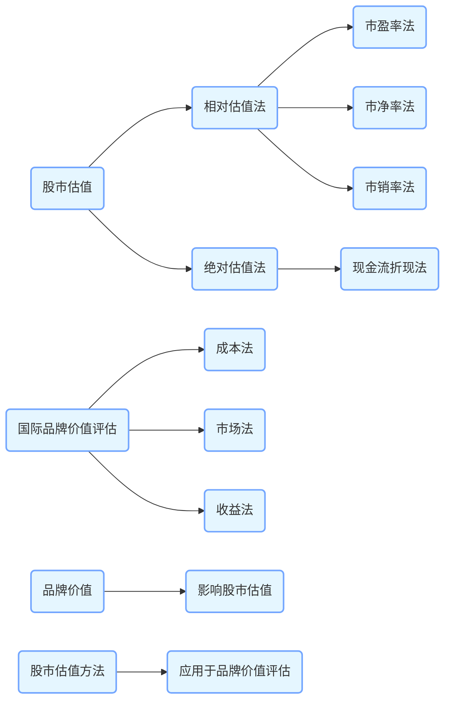

# 股市估值在国际品牌价值评估中的应用

> 关键词：股市估值、国际品牌价值评估、估值模型、品牌溢价、市场预期

> 摘要：本文深入探讨了股市估值在国际品牌价值评估中的应用。首先介绍了研究的背景、目的、预期读者等内容，接着阐述了股市估值和国际品牌价值评估的核心概念及联系，详细讲解了相关核心算法原理和操作步骤，分析了其中涉及的数学模型和公式，并结合实际案例进行说明。通过项目实战，展示了如何运用相关知识进行实际操作。同时探讨了股市估值在国际品牌价值评估中的实际应用场景，推荐了学习所需的工具和资源，最后总结了未来发展趋势与挑战，还设置了常见问题解答和扩展阅读部分，旨在为相关领域的研究者和从业者提供全面而深入的参考。

## 1. 背景介绍 
### 1.1 目的和范围
本研究的目的在于深入探究股市估值方法在国际品牌价值评估中的具体应用。随着全球经济一体化的发展，品牌已经成为企业核心竞争力的重要组成部分，准确评估国际品牌价值对于企业的战略决策、投资者的投资决策以及市场的资源配置都具有重要意义。股市作为企业价值的重要反映场所，其估值方法蕴含着市场对企业未来盈利能力和发展前景的预期，将其应用于国际品牌价值评估中，有望为品牌价值评估提供新的视角和更准确的结果。

本研究的范围涵盖了常见的股市估值方法，如市盈率法、市净率法、现金流折现法等，以及国际品牌价值评估的主要理论和方法。通过分析两者之间的联系，探讨如何将股市估值的思想和方法引入到国际品牌价值评估中，同时结合实际案例进行验证和分析。

### 1.2 预期读者
本文预期读者包括企业管理人员、市场营销人员、投资者、金融分析师、品牌研究学者以及对品牌价值评估和股市估值感兴趣的专业人士。企业管理人员可以通过本文了解如何利用股市估值方法更准确地评估自身品牌价值，从而制定更合理的品牌战略；市场营销人员可以借助品牌价值评估结果更好地开展品牌推广和营销活动；投资者可以根据品牌价值评估结果做出更明智的投资决策；金融分析师可以将股市估值和品牌价值评估相结合，提供更全面的企业分析报告；品牌研究学者可以从理论和实践的角度深入研究品牌价值评估的新方法和新思路。

### 1.3 文档结构概述
本文将按照以下结构展开：首先介绍核心概念，包括股市估值和国际品牌价值评估的定义、原理和相互关系；接着详细讲解核心算法原理和具体操作步骤，结合 Python 代码进行阐述；然后分析其中涉及的数学模型和公式，并举例说明；通过项目实战展示如何在实际中运用这些方法进行品牌价值评估；探讨股市估值在国际品牌价值评估中的实际应用场景；推荐相关的学习工具和资源；最后总结未来发展趋势与挑战，设置常见问题解答和扩展阅读部分。

### 1.4 术语表
#### 1.4.1 核心术语定义
- **股市估值**：是指对上市公司股票价值的评估，通过一定的方法和模型，结合公司的财务数据、市场表现、行业前景等因素，估算出股票的合理价格。
- **国际品牌价值评估**：是指对具有国际影响力的品牌的经济价值进行评估，考虑品牌的市场份额、品牌忠诚度、品牌形象、品牌创新能力等多方面因素，确定品牌在市场中的价值。
- **品牌溢价**：是指消费者由于对品牌的信任和偏好，愿意为该品牌产品支付高于同类非品牌产品的价格部分，它是品牌价值的重要体现。
- **现金流折现法（DCF）**：是一种基于未来现金流预测的估值方法，通过将企业未来各期的现金流按照一定的折现率折现到当前时刻，从而得到企业的内在价值。
- **市盈率（P/E）**：是指股票价格与每股收益的比率，反映了市场对公司盈利的预期和估值水平。

#### 1.4.2 相关概念解释
- **市场预期**：是指市场参与者对未来经济、行业和企业发展的预期，它会影响股市估值和品牌价值评估。例如，当市场预期某品牌未来市场份额将扩大、盈利能力将增强时，其股市估值和品牌价值都会相应提高。
- **品牌资产**：是指品牌所拥有的各种资产，包括品牌知名度、美誉度、忠诚度、专利、商标等，这些资产构成了品牌价值的基础。
- **可比公司分析**：是一种常用的估值方法，通过选取与目标公司具有相似业务、规模、财务状况等特征的可比公司，参考可比公司的估值倍数来估算目标公司的价值。

#### 1.4.3 缩略词列表
- **DCF**：现金流折现法（Discounted Cash Flow）
- **P/E**：市盈率（Price-to-Earnings Ratio）
- **P/B**：市净率（Price-to-Book Ratio）

## 2. 核心概念与联系 
### 2.1 股市估值的核心概念
股市估值是金融领域的重要研究内容，其目的是确定股票的合理价值，为投资者提供投资决策的依据。常见的股市估值方法包括相对估值法和绝对估值法。

相对估值法是通过比较目标公司与可比公司的某些财务指标来估算目标公司的价值。常用的相对估值指标有市盈率（P/E）、市净率（P/B）、市销率（P/S）等。例如，市盈率法是用目标公司的每股收益乘以可比公司的平均市盈率来得到目标公司的股票价值。

绝对估值法是通过对公司未来现金流的预测和折现来计算公司的内在价值。其中最常用的是现金流折现法（DCF），其基本原理是将公司未来各期的自由现金流按照一定的折现率折现到当前时刻，得到公司的现值。

### 2.2 国际品牌价值评估的核心概念
国际品牌价值评估是一个复杂的过程，需要综合考虑多个因素。品牌价值不仅包括品牌的财务价值，还包括品牌的市场价值、社会价值等。常见的品牌价值评估方法有成本法、市场法和收益法。

成本法是通过计算创建和维护品牌所花费的成本来评估品牌价值，包括品牌的研发成本、营销成本、广告成本等。市场法是通过比较目标品牌与市场上类似品牌的交易价格来估算目标品牌的价值。收益法是通过预测品牌未来的收益，并将其折现到当前时刻来计算品牌价值。

### 2.3 股市估值与国际品牌价值评估的联系
股市估值和国际品牌价值评估之间存在着密切的联系。一方面，品牌价值是企业价值的重要组成部分，一个具有高品牌价值的企业往往在市场上具有更强的竞争力和盈利能力，其股市估值也会相应较高。例如，苹果公司凭借其强大的品牌影响力，在全球市场上占据了较高的份额，其股票价格也一直处于较高水平。

另一方面，股市估值的方法和思想可以应用于国际品牌价值评估中。股市估值中对企业未来现金流的预测和折现的方法，与品牌价值评估中收益法的原理相似。通过分析股市估值中市场对企业的预期和评价，可以更好地理解品牌在市场中的地位和价值。

### 2.4 核心概念原理和架构的文本示意图
```plaintext
股市估值
├── 相对估值法
│   ├── 市盈率法
│   ├── 市净率法
│   └── 市销率法
└── 绝对估值法
    └── 现金流折现法

国际品牌价值评估
├── 成本法
├── 市场法
└── 收益法

联系
├── 品牌价值影响股市估值
└── 股市估值方法应用于品牌价值评估
```

### 2.5 Mermaid 流程图


## 3. 核心算法原理 & 具体操作步骤 
### 3.1 市盈率法
#### 3.1.1 算法原理
市盈率法是一种相对估值方法，其基本原理是通过比较目标公司与可比公司的市盈率来估算目标公司的股票价值。市盈率（P/E）是指股票价格与每股收益的比率，反映了市场对公司盈利的预期和估值水平。计算公式为：

$$P = EPS \times P/E$$

其中，$P$ 表示股票价格，$EPS$ 表示每股收益，$P/E$ 表示市盈率。

#### 3.1.2 具体操作步骤
1. **选择可比公司**：选择与目标公司具有相似业务、规模、财务状况等特征的可比公司。
2. **计算可比公司的平均市盈率**：收集可比公司的股票价格和每股收益数据，计算它们的市盈率，并取平均值。
3. **确定目标公司的每股收益**：获取目标公司的财务报表，计算其每股收益。
4. **计算目标公司的股票价值**：将目标公司的每股收益乘以可比公司的平均市盈率，得到目标公司的股票价值。

#### 3.1.3 Python 代码实现
```python
# 可比公司的股票价格和每股收益数据
comparable_prices = [50, 60, 70]
comparable_eps = [2, 3, 4]

# 计算可比公司的市盈率
comparable_pe_ratios = [price / eps for price, eps in zip(comparable_prices, comparable_eps)]

# 计算可比公司的平均市盈率
average_pe_ratio = sum(comparable_pe_ratios) / len(comparable_pe_ratios)

# 目标公司的每股收益
target_eps = 3

# 计算目标公司的股票价值
target_price = target_eps * average_pe_ratio

print(f"目标公司的股票价值为: {target_price}")
```

### 3.2 现金流折现法
#### 3.2.1 算法原理
现金流折现法（DCF）是一种绝对估值方法，其基本原理是将公司未来各期的自由现金流按照一定的折现率折现到当前时刻，得到公司的内在价值。计算公式为：

$$V = \sum_{t=1}^{n} \frac{FCF_t}{(1 + r)^t} + \frac{TV}{(1 + r)^n}$$

其中，$V$ 表示公司的内在价值，$FCF_t$ 表示第 $t$ 期的自由现金流，$r$ 表示折现率，$n$ 表示预测期数，$TV$ 表示终值。

#### 3.2.2 具体操作步骤
1. **预测未来自由现金流**：根据公司的历史财务数据和业务发展前景，预测公司未来各期的自由现金流。
2. **确定折现率**：折现率反映了投资者对投资风险的要求，通常可以采用加权平均资本成本（WACC）作为折现率。
3. **计算终值**：终值是指预测期结束后公司的价值，通常可以采用永续增长模型来计算。
4. **折现现金流和终值**：将预测的未来自由现金流和终值按照折现率折现到当前时刻，得到公司的内在价值。

#### 3.2.3 Python 代码实现
```python
import numpy as np

# 预测未来自由现金流
fcf = [100, 120, 140, 160, 180]

# 折现率
discount_rate = 0.1

# 预测期数
n = len(fcf)

# 终值增长率
terminal_growth_rate = 0.03

# 计算终值
terminal_value = fcf[-1] * (1 + terminal_growth_rate) / (discount_rate - terminal_growth_rate)

# 折现现金流和终值
discounted_fcf = [fcf[i] / (1 + discount_rate)**(i + 1) for i in range(n)]
discounted_terminal_value = terminal_value / (1 + discount_rate)**n

# 计算公司的内在价值
intrinsic_value = sum(discounted_fcf) + discounted_terminal_value

print(f"公司的内在价值为: {intrinsic_value}")
```

## 4. 数学模型和公式 & 详细讲解 & 举例说明 
### 4.1 市盈率法的数学模型和公式
市盈率法的数学模型为：

$$P = EPS \times P/E$$

其中，$P$ 表示股票价格，$EPS$ 表示每股收益，$P/E$ 表示市盈率。

详细讲解：市盈率反映了市场对公司盈利的预期和估值水平。如果市场对公司未来的盈利增长预期较高，市盈率会相应较高；反之，如果市场对公司未来的盈利增长预期较低，市盈率会相应较低。每股收益是公司净利润除以总股本得到的，反映了公司每股股票的盈利能力。

举例说明：假设可比公司的平均市盈率为 20，目标公司的每股收益为 3 元，则目标公司的股票价值为：

$$P = 3 \times 20 = 60$$（元）

### 4.2 现金流折现法的数学模型和公式
现金流折现法的数学模型为：

$$V = \sum_{t=1}^{n} \frac{FCF_t}{(1 + r)^t} + \frac{TV}{(1 + r)^n}$$

其中，$V$ 表示公司的内在价值，$FCF_t$ 表示第 $t$ 期的自由现金流，$r$ 表示折现率，$n$ 表示预测期数，$TV$ 表示终值。

详细讲解：自由现金流是指公司在满足了所有必要的资本支出和营运资金需求后，剩余的可用于分配给股东和债权人的现金流量。折现率反映了投资者对投资风险的要求，风险越高，折现率越高。终值是指预测期结束后公司的价值，通常采用永续增长模型来计算，公式为：

$$TV = \frac{FCF_{n+1}}{r - g}$$

其中，$FCF_{n+1}$ 表示预测期结束后下一期的自由现金流，$g$ 表示永续增长率。

举例说明：假设公司未来 5 年的自由现金流分别为 100 万元、120 万元、140 万元、160 万元、180 万元，折现率为 10%，终值增长率为 3%。则公司的内在价值计算如下：

1. 计算终值：

$$FCF_{6} = 180 \times (1 + 0.03) = 185.4$$（万元）

$$TV = \frac{185.4}{0.1 - 0.03} = 2648.57$$（万元）

2. 折现现金流和终值：

$$V = \frac{100}{(1 + 0.1)^1} + \frac{120}{(1 + 0.1)^2} + \frac{140}{(1 + 0.1)^3} + \frac{160}{(1 + 0.1)^4} + \frac{180}{(1 + 0.1)^5} + \frac{2648.57}{(1 + 0.1)^5}$$

$$V = 90.91 + 99.17 + 105.18 + 109.28 + 111.74 + 1636.36$$

$$V = 2152.64$$（万元）

### 4.3 品牌溢价的数学模型和公式
品牌溢价可以通过以下公式计算：

$$BP = P_{brand} - P_{non - brand}$$

其中，$BP$ 表示品牌溢价，$P_{brand}$ 表示品牌产品的价格，$P_{non - brand}$ 表示非品牌产品的价格。

详细讲解：品牌溢价反映了消费者由于对品牌的信任和偏好，愿意为该品牌产品支付高于同类非品牌产品的价格部分。品牌溢价越高，说明品牌的价值越高。

举例说明：假设某品牌手机的价格为 5000 元，同类非品牌手机的价格为 3000 元，则该品牌手机的品牌溢价为：

$$BP = 5000 - 3000 = 2000$$（元）

## 5. 项目实战：代码实际案例和详细解释说明 
### 5.1  开发环境搭建
#### 5.1.1 安装 Python
首先需要安装 Python 编程语言，建议安装 Python 3.7 及以上版本。可以从 Python 官方网站（https://www.python.org/downloads/）下载适合自己操作系统的安装包，按照安装向导进行安装。

#### 5.1.2 安装必要的库
在进行股市估值和品牌价值评估的项目实战中，需要使用一些 Python 库，如 Pandas、Numpy、Matplotlib 等。可以使用以下命令进行安装：

```sh
pip install pandas numpy matplotlib
```

### 5.2  源代码详细实现和代码解读
#### 5.2.1 市盈率法的代码实现和解读
```python
import pandas as pd

# 可比公司数据
comparable_data = {
    'Company': ['Company A', 'Company B', 'Company C'],
    'Stock Price': [50, 60, 70],
    'EPS': [2, 3, 4]
}

# 创建 DataFrame
comparable_df = pd.DataFrame(comparable_data)

# 计算可比公司的市盈率
comparable_df['P/E'] = comparable_df['Stock Price'] / comparable_df['EPS']

# 计算可比公司的平均市盈率
average_pe_ratio = comparable_df['P/E'].mean()

# 目标公司的每股收益
target_eps = 3

# 计算目标公司的股票价值
target_price = target_eps * average_pe_ratio

print(f"可比公司数据:")
print(comparable_df)
print(f"可比公司的平均市盈率: {average_pe_ratio}")
print(f"目标公司的股票价值: {target_price}")
```

代码解读：
1. 首先，定义了可比公司的数据，包括公司名称、股票价格和每股收益。
2. 使用 Pandas 库创建了一个 DataFrame 对象，方便数据的处理和分析。
3. 计算了可比公司的市盈率，并将结果添加到 DataFrame 中。
4. 计算了可比公司的平均市盈率。
5. 定义了目标公司的每股收益，并计算了目标公司的股票价值。
6. 最后，打印出可比公司的数据、平均市盈率和目标公司的股票价值。

#### 5.2.2 现金流折现法的代码实现和解读
```python
import numpy as np
import matplotlib.pyplot as plt

# 预测未来自由现金流
fcf = [100, 120, 140, 160, 180]

# 折现率
discount_rate = 0.1

# 预测期数
n = len(fcf)

# 终值增长率
terminal_growth_rate = 0.03

# 计算终值
terminal_value = fcf[-1] * (1 + terminal_growth_rate) / (discount_rate - terminal_growth_rate)

# 折现现金流和终值
discounted_fcf = [fcf[i] / (1 + discount_rate)**(i + 1) for i in range(n)]
discounted_terminal_value = terminal_value / (1 + discount_rate)**n

# 计算公司的内在价值
intrinsic_value = sum(discounted_fcf) + discounted_terminal_value

# 绘制现金流折现图
years = np.arange(1, n + 1)
plt.plot(years, discounted_fcf, label='Discounted FCF')
plt.axhline(y=discounted_terminal_value, color='r', linestyle='--', label='Discounted Terminal Value')
plt.xlabel('Year')
plt.ylabel('Discounted Cash Flow')
plt.title('Discounted Cash Flow Diagram')
plt.legend()
plt.show()

print(f"公司的内在价值为: {intrinsic_value}")
```

代码解读：
1. 定义了预测的未来自由现金流、折现率、预测期数和终值增长率。
2. 计算了终值。
3. 对未来自由现金流和终值进行折现。
4. 计算了公司的内在价值。
5. 使用 Matplotlib 库绘制了现金流折现图，直观地展示了各期自由现金流的折现值和终值的折现值。
6. 最后，打印出公司的内在价值。

### 5.3  代码解读与分析
#### 5.3.1 市盈率法代码分析
市盈率法的代码主要实现了根据可比公司的市盈率来估算目标公司的股票价值。代码的优点是简单易懂，计算方便，适合快速估算股票价值。但是，市盈率法也存在一些局限性，如可比公司的选择具有主观性，市场环境的变化可能导致市盈率的波动等。

#### 5.3.2 现金流折现法代码分析
现金流折现法的代码实现了对公司内在价值的计算，并通过绘制现金流折现图直观地展示了计算过程。现金流折现法的优点是考虑了公司未来的现金流和时间价值，能够更准确地反映公司的内在价值。但是，现金流折现法也存在一些挑战，如未来现金流的预测具有不确定性，折现率的确定也比较困难等。

## 6. 实际应用场景 
### 6.1 企业战略决策
企业在制定战略决策时，需要准确评估自身品牌价值。通过运用股市估值方法进行品牌价值评估，企业可以了解市场对自身品牌的认可度和预期，从而制定更合理的品牌战略。例如，如果品牌价值评估结果显示品牌具有较高的市场潜力，企业可以加大品牌推广和研发投入，进一步提升品牌价值；如果品牌价值评估结果不理想，企业可以分析原因，调整品牌策略，如优化品牌形象、提高产品质量等。

### 6.2 投资者投资决策
投资者在进行投资决策时，会关注企业的品牌价值。股市估值方法在品牌价值评估中的应用可以为投资者提供更全面的信息。投资者可以通过分析品牌价值与股市估值之间的关系，判断企业的投资价值。例如，如果一个企业的品牌价值较高，但股市估值相对较低，可能存在投资机会；反之，如果品牌价值较低，而股市估值过高，投资者需要谨慎投资。

### 6.3 品牌并购与重组
在品牌并购与重组过程中，准确评估品牌价值至关重要。股市估值方法可以为品牌交易提供参考价格。并购方可以通过对目标品牌的价值评估，确定合理的收购价格；被并购方也可以根据品牌价值评估结果，争取更有利的交易条件。同时，在品牌重组过程中，通过评估不同品牌的价值，可以合理配置资源，实现品牌的协同效应。

### 6.4 品牌授权与合作
品牌授权和合作是企业拓展市场、提升品牌影响力的重要方式。在品牌授权和合作中，需要确定合理的授权费用和合作分成比例。股市估值方法在品牌价值评估中的应用可以为品牌授权和合作提供依据。授权方可以根据品牌价值评估结果，确定合理的授权费用；合作方也可以根据品牌价值评估结果，判断合作的可行性和预期收益。

## 7. 工具和资源推荐
### 7.1 学习资源推荐
#### 7.1.1 书籍推荐
- 《证券分析》（Security Analysis）：由本杰明·格雷厄姆（Benjamin Graham）和戴维·多德（David Dodd）所著，是价值投资领域的经典著作，详细介绍了股票估值的基本方法和理论。
- 《品牌资产管理》（Managing Brand Equity）：作者为大卫·艾克（David Aaker），该书系统地阐述了品牌价值评估和管理的方法和策略，对品牌研究和实践具有重要的指导意义。
- 《财务估值：建模与实例》（Financial Valuation: Applications and Models）：由詹姆斯·R· Hitchner 所著，全面介绍了企业估值的各种方法和模型，包括现金流折现法、相对估值法等，并结合实际案例进行了详细讲解。

#### 7.1.2 在线课程
- Coursera 平台上的“Corporate Finance”课程：由宾夕法尼亚大学的教授授课，深入讲解了公司金融的基本原理和方法，包括股票估值、资本预算等内容。
- edX 平台上的“Valuation: Measuring and Managing the Value of Companies”课程：由麦肯锡公司的专家授课，介绍了企业估值的最新方法和实践经验，对股市估值和品牌价值评估具有重要的参考价值。
- 中国大学 MOOC 平台上的“财务管理”课程：由国内知名高校的教授授课，系统地介绍了财务管理的基本理论和方法，包括股票估值、财务分析等内容。

#### 7.1.3 技术博客和网站
- Seeking Alpha：是一个知名的金融投资博客平台，提供了大量的股票分析和估值文章，投资者和分析师可以在上面分享自己的观点和研究成果。
- Brand Finance：是一家专业的品牌价值评估机构，其官方网站提供了丰富的品牌价值评估报告和研究成果，对品牌价值评估的理论和实践具有重要的参考价值。
- 雪球网：是国内知名的投资交流社区，汇聚了众多投资者和分析师，用户可以在上面获取股票估值和品牌分析的相关信息。

### 7.2 开发工具框架推荐
#### 7.2.1 IDE和编辑器
- PyCharm：是一款专门为 Python 开发设计的集成开发环境（IDE），具有强大的代码编辑、调试、自动补全和代码分析等功能，适合进行股市估值和品牌价值评估的代码开发。
- Jupyter Notebook：是一个基于网页的交互式开发环境，支持 Python、R 等多种编程语言，适合进行数据分析和模型验证。在股市估值和品牌价值评估中，可以使用 Jupyter Notebook 进行数据处理、模型构建和可视化展示。
- Visual Studio Code：是一款轻量级的代码编辑器，具有丰富的插件和扩展功能，支持多种编程语言。可以通过安装 Python 插件来进行 Python 代码的开发和调试。

#### 7.2.2 调试和性能分析工具
- PDB：是 Python 自带的调试工具，可以在代码中设置断点，逐步执行代码，查看变量的值和程序的执行流程，方便调试代码中的错误。
- cProfile：是 Python 的性能分析工具，可以统计代码中各个函数的执行时间和调用次数，帮助开发者找出代码中的性能瓶颈。
- Py-Spy：是一个轻量级的 Python 性能分析工具，可以实时监控 Python 程序的运行状态，分析函数的调用栈和执行时间，无需修改代码。

#### 7.2.3 相关框架和库
- Pandas：是一个强大的数据分析库，提供了高效的数据结构和数据处理工具，适合进行股市数据和品牌财务数据的处理和分析。
- Numpy：是 Python 的数值计算库，提供了高效的多维数组对象和数学函数，在股市估值和品牌价值评估的模型计算中具有重要的应用。
- Scikit-learn：是一个机器学习库，提供了丰富的机器学习算法和工具，可用于股市估值和品牌价值评估中的预测和建模。

### 7.3 相关论文著作推荐
#### 7.3.1 经典论文
- “The Capital Asset Pricing Model: Theory and Evidence”：由 Eugene F. Fama 和 Kenneth R. French 所著，该论文对资本资产定价模型进行了深入的研究和实证分析，为股市估值提供了重要的理论基础。
- “Brand Equity and Advertising: An Empirical Investigation of the Effects of Advertising on Consumer-Based Brand Equity”：作者为 David A. Aaker 和 Kevin Lane Keller，该论文探讨了广告对品牌资产的影响，对品牌价值评估具有重要的参考意义。
- “Valuation of Intangible Assets”：由 Baruch Lev 所著，该论文系统地介绍了无形资产估值的方法和理论，包括品牌价值评估，为品牌价值评估的研究提供了重要的思路。

#### 7.3.2 最新研究成果
- 在《Journal of Financial Economics》《Marketing Science》等顶级学术期刊上，经常发表关于股市估值和品牌价值评估的最新研究成果。这些研究成果涵盖了新的估值方法、模型改进、实证分析等方面，对相关领域的研究和实践具有重要的指导作用。
- 一些国际知名的研究机构，如麦肯锡、波士顿咨询集团等，也会定期发布关于企业估值和品牌价值评估的研究报告，这些报告结合了实际案例和市场数据，具有较高的参考价值。

#### 7.3.3 应用案例分析
- 《The 100 Best Stocks to Own in America》：该书通过实际案例分析了美国市场上一些优秀企业的股票估值和投资价值，对投资者和分析师具有重要的参考意义。
- 《BrandZ Top 100 Most Valuable Global Brands》：是由 Kantar 集团发布的全球最具价值品牌报告，该报告对全球 100 个最有价值的品牌进行了评估和分析，并提供了详细的品牌价值排名和案例分析，对品牌价值评估的实践具有重要的参考价值。

## 8. 总结：未来发展趋势与挑战
### 8.1 未来发展趋势
#### 8.1.1 多维度数据融合
随着信息技术的发展，可用于股市估值和品牌价值评估的数据越来越丰富。未来，将融合更多维度的数据，如社交媒体数据、消费者行为数据、行业大数据等，以更全面地反映品牌的市场表现和价值。例如，通过分析社交媒体上消费者对品牌的评价和讨论，可以了解品牌的口碑和影响力，从而更准确地评估品牌价值。

#### 8.1.2 人工智能和机器学习的应用
人工智能和机器学习技术将在股市估值和品牌价值评估中得到更广泛的应用。这些技术可以处理复杂的数据和非线性关系，提高估值的准确性和效率。例如，使用深度学习模型对股市数据和品牌相关数据进行分析和预测，可以发现传统方法难以发现的规律和模式。

#### 8.1.3 国际化和跨文化评估
随着全球经济一体化的发展，品牌的国际化程度越来越高。未来，股市估值在国际品牌价值评估中的应用将更加注重国际化和跨文化因素。需要考虑不同国家和地区的市场环境、文化差异、法律法规等因素，以实现更准确的国际品牌价值评估。

### 8.2 挑战
#### 8.2.1 数据质量和可靠性
多维度数据的融合带来了数据量的大幅增加，但同时也面临数据质量和可靠性的问题。一些数据可能存在噪声、缺失值或错误，需要进行有效的数据清洗和预处理。此外，数据的来源和真实性也需要进行严格的审核和验证。

#### 8.2.2 模型的解释性和可解释性
人工智能和机器学习模型在提高估值准确性的同时，也面临模型解释性和可解释性的挑战。这些模型通常是黑箱模型，难以理解其决策过程和依据。在股市估值和品牌价值评估中，决策者需要了解模型的输出结果是如何得出的，以便做出合理的决策。

#### 8.2.3 市场不确定性和风险
股市和品牌市场都存在着不确定性和风险，如宏观经济环境的变化、行业竞争的加剧、消费者偏好的改变等。这些因素会影响股市估值和品牌价值评估的结果，增加了评估的难度和风险。需要建立有效的风险管理机制，对市场不确定性和风险进行评估和应对。

## 9. 附录：常见问题与解答
### 9.1 股市估值方法在品牌价值评估中的准确性如何？
股市估值方法在品牌价值评估中具有一定的参考价值，但准确性受到多种因素的影响。一方面，股市估值方法本身存在一定的局限性，如市盈率法中可比公司的选择具有主观性，现金流折现法中未来现金流的预测和折现率的确定具有不确定性。另一方面，品牌价值评估是一个复杂的过程，除了财务因素外，还需要考虑品牌的市场份额、品牌忠诚度、品牌形象等非财务因素。因此，在使用股市估值方法进行品牌价值评估时，需要结合其他方法和因素进行综合分析，以提高评估的准确性。

### 9.2 如何选择合适的可比公司进行市盈率法估值？
选择合适的可比公司是市盈率法估值的关键。一般来说，可以从以下几个方面考虑：
1. **业务相似性**：选择与目标公司具有相似业务和产品的可比公司，这样可以保证它们在市场竞争环境、盈利模式等方面具有较高的相似性。
2. **规模相似性**：选择与目标公司规模相近的可比公司，包括资产规模、营业收入、市场份额等方面。规模相似的公司在成本结构、运营效率等方面可能具有相似性。
3. **财务状况相似性**：选择与目标公司财务状况相近的可比公司，如盈利能力、偿债能力、成长能力等方面。财务状况相似的公司在估值水平上可能具有可比性。
4. **行业地位相似性**：选择与目标公司在行业中地位相近的可比公司，如市场领导者、追随者等。行业地位相似的公司在市场竞争优势和品牌影响力等方面可能具有相似性。

### 9.3 现金流折现法中折现率如何确定？
现金流折现法中折现率的确定是一个关键问题，通常可以采用加权平均资本成本（WACC）作为折现率。加权平均资本成本是指企业以各种资本在企业全部资本中所占的比重为权数，对各种长期资金的资本成本加权平均计算出来的资本总成本。计算公式为：

$$WACC = w_d \times r_d \times (1 - T) + w_e \times r_e$$

其中，$w_d$ 表示债务资本的权重，$r_d$ 表示债务资本成本，$T$ 表示企业所得税税率，$w_e$ 表示股权资本的权重，$r_e$ 表示股权资本成本。

债务资本成本可以根据企业的债务利率来确定；股权资本成本可以采用资本资产定价模型（CAPM）来计算，公式为：

$$r_e = R_f + \beta \times (R_m - R_f)$$

其中，$R_f$ 表示无风险利率，$\beta$ 表示股票的贝塔系数，$R_m$ 表示市场组合的收益率。

### 9.4 品牌价值评估结果在企业决策中有哪些应用？
品牌价值评估结果在企业决策中具有重要的应用，主要包括以下几个方面：
1. **品牌战略决策**：企业可以根据品牌价值评估结果，制定更合理的品牌战略。如果品牌价值较高，可以加大品牌推广和研发投入，进一步提升品牌价值；如果品牌价值较低，可以分析原因，调整品牌策略，如优化品牌形象、提高产品质量等。
2. **投资决策**：企业在进行投资决策时，可以参考品牌价值评估结果。如果一个品牌具有较高的市场潜力和价值，企业可以考虑对该品牌进行投资或并购；反之，如果品牌价值较低，企业需要谨慎投资。
3. **融资决策**：品牌价值评估结果可以作为企业融资的重要依据。金融机构在评估企业的信用风险和融资能力时，会考虑企业的品牌价值。品牌价值较高的企业在融资时可能更容易获得资金支持，并且融资成本可能较低。
4. **品牌授权和合作决策**：在品牌授权和合作中，品牌价值评估结果可以为授权费用和合作分成比例的确定提供依据。授权方可以根据品牌价值评估结果，确定合理的授权费用；合作方也可以根据品牌价值评估结果，判断合作的可行性和预期收益。

## 10. 扩展阅读 & 参考资料
### 10.1 扩展阅读
- 《投资最重要的事》（The Most Important Thing Illuminated）：作者为霍华德·马克斯（Howard Marks），该书介绍了投资的基本原则和方法，对股市估值和投资决策具有重要的启示作用。
- 《品牌的起源》（The Origin of Brands）：由艾·里斯（Al Ries）和劳拉·里斯（Laura Ries）所著，该书从营销和战略的角度探讨了品牌的起源和发展，对品牌价值评估和品牌战略制定具有重要的参考价值。
- 《金融炼金术》（The Alchemy of Finance）：作者为乔治·索罗斯（George Soros），该书介绍了索罗斯的投资哲学和方法，对股市估值和市场分析具有重要的参考意义。

### 10.2 参考资料
- 上市公司的财务报表和公告，可从证券交易所官方网站获取。
- 专业的金融数据提供商，如 Bloomberg、Wind 等，提供了丰富的股市数据和财务信息。
- 国际品牌价值评估机构的报告，如 Brand Finance、Interbrand 等，提供了全球知名品牌的价值评估数据和分析报告。

作者：AI天才研究院/AI Genius Institute & 禅与计算机程序设计艺术 /Zen And The Art of Computer Programming