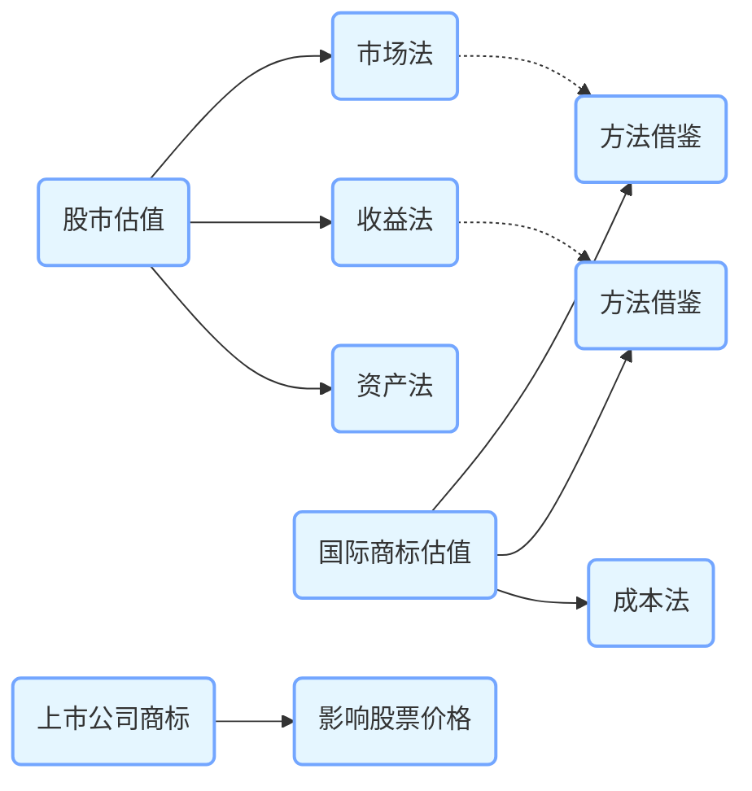

# 股市估值在国际商标估值中的应用

> 关键词：股市估值、国际商标估值、估值模型、市场法、收益法

> 摘要：本文深入探讨了股市估值在国际商标估值中的应用。首先介绍了研究的背景、目的、预期读者和文档结构等内容。接着阐述了股市估值和国际商标估值的核心概念及其联系，并给出了相应的文本示意图和Mermaid流程图。详细讲解了相关的核心算法原理，通过Python代码进行说明，同时给出了数学模型和公式并举例分析。通过项目实战展示了如何将相关理论应用到实际代码中。分析了股市估值在国际商标估值中的实际应用场景，推荐了学习资源、开发工具框架和相关论文著作。最后总结了未来发展趋势与挑战，解答了常见问题，并提供了扩展阅读和参考资料。

## 1. 背景介绍 
### 1.1 目的和范围
在当今全球化的经济环境下，商标作为企业重要的无形资产，其价值评估变得愈发重要。股市估值作为一种成熟的资产估值方法，有着丰富的理论和实践经验。本研究的目的在于探索如何将股市估值的方法和理念应用到国际商标估值中，以提高商标估值的准确性和可靠性。研究范围涵盖了常见的股市估值方法，如市场法、收益法等在国际商标估值中的具体应用，以及相关模型的构建和优化。

### 1.2 预期读者
本文预期读者包括资产评估师、商标代理人、金融分析师、企业管理人员以及对知识产权估值和金融市场感兴趣的研究人员。对于资产评估师和商标代理人，本文提供了新的估值思路和方法；金融分析师可以从中了解商标估值与股市估值之间的联系，为投资决策提供参考；企业管理人员能够通过本文更好地认识商标的价值，从而制定合理的品牌战略；研究人员则可以将其作为进一步深入研究的基础。

### 1.3 文档结构概述
本文将按照以下结构展开：首先介绍股市估值和国际商标估值的核心概念及其联系，包括原理和架构的文本示意图以及Mermaid流程图；接着详细讲解核心算法原理和具体操作步骤，并使用Python源代码进行阐述；然后给出数学模型和公式，并举例说明；通过项目实战展示代码实际案例和详细解释；分析实际应用场景；推荐相关的工具和资源；最后总结未来发展趋势与挑战，解答常见问题，并提供扩展阅读和参考资料。

### 1.4 术语表
#### 1.4.1 核心术语定义
- **股市估值**：指对上市公司的股票价值进行评估的过程，通过分析公司的财务状况、市场表现等因素，确定股票的合理价格。
- **国际商标估值**：对在国际市场上具有一定影响力的商标的价值进行评估，考虑商标的知名度、市场份额、品牌忠诚度等因素。
- **市场法**：一种估值方法，通过比较被评估资产与市场上类似资产的交易价格来确定其价值。
- **收益法**：基于资产未来预期收益的现值来评估资产价值的方法。

#### 1.4.2 相关概念解释
- **商标的市场影响力**：指商标在市场上的知名度、美誉度和市场份额等，反映了商标对消费者的吸引力和市场竞争力。
- **股票的市盈率**：股票价格与每股收益的比率，是股市估值中常用的指标之一，反映了市场对公司未来盈利的预期。

#### 1.4.3 缩略词列表
- **P/E**：市盈率（Price-to-Earnings Ratio）

## 2. 核心概念与联系 

### 股市估值的核心概念
股市估值是金融领域的重要内容，其主要目的是确定股票的内在价值，为投资者提供投资决策的依据。常见的股市估值方法包括市场法、收益法和资产法等。

- **市场法**：通过比较被评估股票与市场上类似股票的价格来确定其价值。例如，选取同行业、规模相近的上市公司作为参照，比较它们的市盈率、市净率等指标。
- **收益法**：基于股票未来预期收益的现值来评估其价值。该方法需要预测公司未来的盈利情况，并选择合适的折现率将未来收益折现到当前。
- **资产法**：根据公司的净资产价值来评估股票的价值，即公司的总资产减去总负债。

### 国际商标估值的核心概念
国际商标估值是对商标在国际市场上的价值进行评估，其核心在于考虑商标的市场影响力、品牌忠诚度、商标所带来的未来收益等因素。常见的国际商标估值方法也包括市场法、收益法和成本法等。

- **市场法**：寻找国际市场上类似商标的交易案例，通过比较交易价格来确定被评估商标的价值。
- **收益法**：预测商标在未来一定时期内所能带来的收益，并将其折现到当前，以此作为商标的价值。
- **成本法**：计算创建和维护该商标所发生的成本，包括商标注册费用、广告宣传费用等。

### 股市估值与国际商标估值的联系
股市估值和国际商标估值之间存在着密切的联系。一方面，上市公司的商标作为其重要的无形资产，会影响公司的市场价值和股票价格。一个具有高价值商标的公司，往往在市场上具有更强的竞争力，其股票价格也可能更高。另一方面，股市估值的方法和理念可以为国际商标估值提供借鉴。例如，市场法中比较类似资产的思路，在两种估值中都可以应用；收益法中对未来收益的预测和折现的方法，也可以用于商标估值。

### 文本示意图
```plaintext
股市估值
|-- 市场法
|   |-- 比较类似股票价格
|-- 收益法
|   |-- 预测未来收益并折现
|-- 资产法
|   |-- 基于净资产价值

国际商标估值
|-- 市场法
|   |-- 比较类似商标交易价格
|-- 收益法
|   |-- 预测商标未来收益并折现
|-- 成本法
|   |-- 计算创建和维护成本

联系：上市公司商标影响股票价格，股市估值方法可用于商标估值
```

### Mermaid流程图


## 3. 核心算法原理 & 具体操作步骤 

### 市场法在国际商标估值中的应用
#### 算法原理
市场法在国际商标估值中的核心思想是通过比较被评估商标与市场上类似商标的交易价格来确定其价值。具体来说，需要找到与被评估商标在行业、知名度、市场份额等方面相似的商标交易案例，然后根据这些案例的交易价格进行调整，以得到被评估商标的价值。

#### 具体操作步骤
1. **案例筛选**：在国际市场上收集与被评估商标类似的商标交易案例，要求案例中的商标在行业、产品类型、市场定位等方面与被评估商标相似。
2. **因素分析**：分析每个案例中商标的特点和影响其交易价格的因素，如商标的知名度、市场份额、品牌忠诚度等。
3. **调整系数确定**：根据被评估商标与案例商标在各因素上的差异，确定相应的调整系数。例如，如果被评估商标的知名度高于案例商标，可以适当提高调整系数。
4. **价值计算**：将案例商标的交易价格乘以相应的调整系数，得到被评估商标的初步价值。然后对多个案例的结果进行综合分析，确定最终的估值结果。

#### Python代码实现
```python
# 定义商标交易案例类
class TrademarkCase:
    def __init__(self, price, popularity, market_share, loyalty):
        self.price = price
        self.popularity = popularity
        self.market_share = market_share
        self.loyalty = loyalty

# 定义被评估商标类
class EvaluatedTrademark:
    def __init__(self, popularity, market_share, loyalty):
        self.popularity = popularity
        self.market_share = market_share
        self.loyalty = loyalty

# 计算调整系数
def calculate_adjustment_factor(case, evaluated_trademark):
    popularity_factor = evaluated_trademark.popularity / case.popularity
    market_share_factor = evaluated_trademark.market_share / case.market_share
    loyalty_factor = evaluated_trademark.loyalty / case.loyalty
    return (popularity_factor + market_share_factor + loyalty_factor) / 3

# 市场法估值函数
def market_method_valuation(cases, evaluated_trademark):
    values = []
    for case in cases:
        adjustment_factor = calculate_adjustment_factor(case, evaluated_trademark)
        value = case.price * adjustment_factor
        values.append(value)
    return sum(values) / len(values)

# 示例数据
case1 = TrademarkCase(1000000, 80, 20, 70)
case2 = TrademarkCase(1200000, 90, 25, 80)
evaluated_trademark = EvaluatedTrademark(85, 22, 75)

cases = [case1, case2]

# 进行估值
valuation_result = market_method_valuation(cases, evaluated_trademark)
print(f"市场法估值结果: {valuation_result}")
```

### 收益法在国际商标估值中的应用
#### 算法原理
收益法在国际商标估值中的基本原理是基于商标未来预期收益的现值来评估其价值。首先需要预测商标在未来一定时期内所能带来的收益，然后选择合适的折现率将这些未来收益折现到当前，最后将各期折现后的收益相加，得到商标的价值。

#### 具体操作步骤
1. **收益预测**：分析商标的市场前景、竞争状况等因素，预测商标在未来一定时期内（如5 - 10年）每年的预期收益。
2. **折现率确定**：根据市场利率、商标的风险程度等因素，确定合适的折现率。折现率反映了资金的时间价值和投资风险。
3. **现值计算**：使用折现率将各期的预期收益折现到当前。现值计算公式为：$PV = \frac{CF}{(1 + r)^n}$，其中 $PV$ 为现值，$CF$ 为未来现金流量，$r$ 为折现率，$n$ 为期数。
4. **价值汇总**：将各期折现后的收益相加，得到商标的价值。

#### Python代码实现
```python
# 收益法估值函数
def income_method_valuation(expected_income, discount_rate, years):
    present_values = []
    for i in range(1, years + 1):
        present_value = expected_income[i - 1] / ((1 + discount_rate) ** i)
        present_values.append(present_value)
    return sum(present_values)

# 示例数据
expected_income = [200000, 220000, 240000, 260000, 280000]
discount_rate = 0.1
years = 5

# 进行估值
valuation_result = income_method_valuation(expected_income, discount_rate, years)
print(f"收益法估值结果: {valuation_result}")
```

## 4. 数学模型和公式 & 详细讲解 & 举例说明 

### 市场法数学模型和公式
#### 数学模型
市场法的数学模型可以表示为：$V = \sum_{i = 1}^{n} V_i \times k_i$，其中 $V$ 为被评估商标的价值，$V_i$ 为第 $i$ 个案例商标的交易价格，$k_i$ 为第 $i$ 个案例的调整系数，$n$ 为案例的数量。

#### 详细讲解
调整系数 $k_i$ 是根据被评估商标与案例商标在各影响因素上的差异确定的。例如，假设影响商标价值的因素有知名度 $P$、市场份额 $S$ 和品牌忠诚度 $L$，则调整系数可以表示为：$k_i = \frac{(P_{评估} / P_{案例}) + (S_{评估} / S_{案例}) + (L_{评估} / L_{案例})}{3}$。

#### 举例说明
假设有两个类似商标交易案例，案例1的交易价格为 $V_1 = 100$ 万元，其知名度 $P_1 = 80$，市场份额 $S_1 = 20\%$，品牌忠诚度 $L_1 = 70$；案例2的交易价格为 $V_2 = 120$ 万元，其知名度 $P_2 = 90$，市场份额 $S_2 = 25\%$，品牌忠诚度 $L_2 = 80$。被评估商标的知名度 $P_{评估} = 85$，市场份额 $S_{评估} = 22\%$，品牌忠诚度 $L_{评估} = 75$。

首先计算案例1的调整系数：
$k_1 = \frac{(85 / 80) + (0.22 / 0.2) + (75 / 70)}{3} \approx 1.07$

案例2的调整系数：
$k_2 = \frac{(85 / 90) + (0.22 / 0.25) + (75 / 80)}{3} \approx 0.98$

则被评估商标的价值为：
$V = 100 \times 1.07 + 120 \times 0.98 = 107 + 117.6 = 224.6$（万元）

### 收益法数学模型和公式
#### 数学模型
收益法的数学模型为：$V = \sum_{t = 1}^{n} \frac{CF_t}{(1 + r)^t}$，其中 $V$ 为商标的价值，$CF_t$ 为第 $t$ 期的预期收益，$r$ 为折现率，$n$ 为预测期数。

#### 详细讲解
该公式的核心是将未来各期的预期收益按照折现率折现到当前。折现率 $r$ 反映了资金的时间价值和投资风险，折现率越高，未来收益的现值越低。预测期数 $n$ 通常根据商标的使用寿命、市场前景等因素确定。

#### 举例说明
假设某商标未来5年的预期收益分别为 $CF_1 = 20$ 万元，$CF_2 = 22$ 万元，$CF_3 = 24$ 万元，$CF_4 = 26$ 万元，$CF_5 = 28$ 万元，折现率 $r = 10\%$。

则各期收益的现值分别为：
$PV_1 = \frac{20}{(1 + 0.1)^1} \approx 18.18$（万元）
$PV_2 = \frac{22}{(1 + 0.1)^2} \approx 18.18$（万元）
$PV_3 = \frac{24}{(1 + 0.1)^3} \approx 18.03$（万元）
$PV_4 = \frac{26}{(1 + 0.1)^4} \approx 17.75$（万元）
$PV_5 = \frac{28}{(1 + 0.1)^5} \approx 17.36$（万元）

商标的价值为：
$V = 18.18 + 18.18 + 18.03 + 17.75 + 17.36 = 89.5$（万元）

## 5. 项目实战：代码实际案例和详细解释说明 

### 5.1  开发环境搭建
#### 操作系统
本项目可以在常见的操作系统上进行开发，如Windows、Linux（如Ubuntu）或macOS。

#### Python环境
建议使用Python 3.7及以上版本。可以从Python官方网站（https://www.python.org/downloads/）下载并安装Python。

#### 开发工具
可以使用以下开发工具：
- **PyCharm**：一款功能强大的Python集成开发环境（IDE），提供代码编辑、调试、版本控制等功能。
- **Jupyter Notebook**：一种交互式的开发环境，适合进行数据探索和代码演示。

#### 安装依赖库
本项目主要使用Python的标准库，无需额外安装依赖库。

### 5.2  源代码详细实现和代码解读
#### 市场法代码实现
```python
# 定义商标交易案例类
class TrademarkCase:
    def __init__(self, price, popularity, market_share, loyalty):
        # 初始化案例商标的交易价格
        self.price = price
        # 初始化案例商标的知名度
        self.popularity = popularity
        # 初始化案例商标的市场份额
        self.market_share = market_share
        # 初始化案例商标的品牌忠诚度
        self.loyalty = loyalty

# 定义被评估商标类
class EvaluatedTrademark:
    def __init__(self, popularity, market_share, loyalty):
        # 初始化被评估商标的知名度
        self.popularity = popularity
        # 初始化被评估商标的市场份额
        self.market_share = market_share
        # 初始化被评估商标的品牌忠诚度
        self.loyalty = loyalty

# 计算调整系数
def calculate_adjustment_factor(case, evaluated_trademark):
    # 计算知名度调整系数
    popularity_factor = evaluated_trademark.popularity / case.popularity
    # 计算市场份额调整系数
    market_share_factor = evaluated_trademark.market_share / case.market_share
    # 计算品牌忠诚度调整系数
    loyalty_factor = evaluated_trademark.loyalty / case.loyalty
    # 计算综合调整系数
    return (popularity_factor + market_share_factor + loyalty_factor) / 3

# 市场法估值函数
def market_method_valuation(cases, evaluated_trademark):
    values = []
    for case in cases:
        # 计算每个案例的调整系数
        adjustment_factor = calculate_adjustment_factor(case, evaluated_trademark)
        # 计算每个案例调整后的价值
        value = case.price * adjustment_factor
        values.append(value)
    # 计算多个案例的平均价值
    return sum(values) / len(values)

# 示例数据
case1 = TrademarkCase(1000000, 80, 20, 70)
case2 = TrademarkCase(1200000, 90, 25, 80)
evaluated_trademark = EvaluatedTrademark(85, 22, 75)

cases = [case1, case2]

# 进行估值
valuation_result = market_method_valuation(cases, evaluated_trademark)
print(f"市场法估值结果: {valuation_result}")
```
#### 代码解读
- **TrademarkCase类**：用于表示商标交易案例，包含交易价格、知名度、市场份额和品牌忠诚度等属性。
- **EvaluatedTrademark类**：用于表示被评估商标，包含知名度、市场份额和品牌忠诚度等属性。
- **calculate_adjustment_factor函数**：根据被评估商标和案例商标在各因素上的差异，计算调整系数。
- **market_method_valuation函数**：遍历所有案例，计算每个案例调整后的价值，然后取平均值作为被评估商标的价值。

#### 收益法代码实现
```python
# 收益法估值函数
def income_method_valuation(expected_income, discount_rate, years):
    present_values = []
    for i in range(1, years + 1):
        # 计算每期收益的现值
        present_value = expected_income[i - 1] / ((1 + discount_rate) ** i)
        present_values.append(present_value)
    # 计算各期现值的总和
    return sum(present_values)

# 示例数据
expected_income = [200000, 220000, 240000, 260000, 280000]
discount_rate = 0.1
years = 5

# 进行估值
valuation_result = income_method_valuation(expected_income, discount_rate, years)
print(f"收益法估值结果: {valuation_result}")
```
#### 代码解读
- **income_method_valuation函数**：根据输入的预期收益列表、折现率和预测期数，计算各期收益的现值，并将其相加得到商标的价值。

### 5.3  代码解读与分析
#### 市场法代码分析
市场法代码的核心在于通过比较被评估商标和案例商标的各项指标，计算调整系数，从而得到被评估商标的价值。该方法的优点是简单直观，基于市场实际交易案例，具有一定的可靠性。但缺点是需要找到足够多且相似的交易案例，否则可能导致估值不准确。

#### 收益法代码分析
收益法代码的核心是将未来预期收益折现到当前，考虑了资金的时间价值和投资风险。该方法的优点是能够反映商标的未来盈利能力，但缺点是对未来收益的预测具有一定的不确定性，折现率的选择也会对估值结果产生较大影响。

## 6. 实际应用场景 
### 企业并购
在企业并购过程中，商标作为企业的重要无形资产，其价值评估至关重要。股市估值中的市场法和收益法可以应用到国际商标估值中，帮助收购方确定合理的收购价格。例如，收购方可以通过比较目标企业商标与市场上类似商标的交易价格，或者预测目标企业商标未来的收益，来评估商标的价值，从而为并购决策提供依据。

### 商标授权许可
当企业进行商标授权许可时，需要确定合理的授权费用。通过对商标进行估值，可以为授权费用的确定提供参考。股市估值方法可以帮助企业评估商标在国际市场上的价值，从而制定合理的授权价格。例如，使用收益法预测商标在授权期间所能带来的收益，以此为基础确定授权费用。

### 品牌战略规划
企业在制定品牌战略时，需要了解自身商标的价值。通过将股市估值方法应用到国际商标估值中，企业可以准确评估商标的市场价值和潜力，从而制定相应的品牌发展战略。例如，如果商标估值较高，企业可以加大品牌推广力度，进一步提升品牌价值；如果估值较低，企业可以分析原因，采取措施进行品牌改进。

### 知识产权融资
企业可以将商标作为知识产权进行融资，如商标质押贷款。在进行融资时，金融机构需要对商标的价值进行评估。股市估值方法可以为商标质押融资提供科学的估值依据，帮助金融机构确定合理的贷款额度。例如，使用市场法或收益法评估商标的价值，金融机构可以根据估值结果决定是否给予贷款以及贷款的金额。

## 7. 工具和资源推荐
### 7.1 学习资源推荐
#### 7.1.1 书籍推荐
- 《资产评估学》：全面介绍了资产评估的基本理论、方法和应用，包括商标估值等无形资产评估的内容。
- 《金融市场与金融机构》：讲解了金融市场的基本原理和金融机构的运作，有助于了解股市估值的背景知识。
- 《品牌管理》：深入探讨了品牌的建设、维护和价值评估等方面的内容，对国际商标估值有重要的参考价值。

#### 7.1.2 在线课程
- Coursera上的“Financial Markets”课程：由耶鲁大学教授授课，介绍了金融市场的基本概念和估值方法。
- edX上的“Valuation for Mergers, Buyouts and Restructuring”课程：详细讲解了企业估值的方法和应用，包括商标等无形资产的估值。
- 中国大学MOOC上的“资产评估”课程：系统介绍了资产评估的理论和实践，适合初学者学习。

#### 7.1.3 技术博客和网站
- Seeking Alpha：提供金融市场分析和股票估值的文章和观点。
- Brand Finance：专注于品牌估值和品牌战略研究，发布有关商标估值的报告和研究成果。
- 中国资产评估协会官网：提供资产评估行业的政策法规、标准规范和行业动态等信息。

### 7.2 开发工具框架推荐
#### 7.2.1 IDE和编辑器
- PyCharm：功能强大的Python IDE，提供代码编辑、调试、自动补全、版本控制等功能，适合专业开发者使用。
- Jupyter Notebook：交互式的开发环境，支持代码、文本、图表等多种形式的展示，适合数据探索和代码演示。
- Visual Studio Code：轻量级的代码编辑器，支持多种编程语言，具有丰富的插件扩展功能。

#### 7.2.2 调试和性能分析工具
- PyCharm自带的调试工具：可以方便地设置断点、单步执行代码、查看变量值等，帮助开发者调试Python代码。
- cProfile：Python标准库中的性能分析工具，可以统计代码的运行时间和函数调用次数，帮助开发者优化代码性能。
- Py-Spy：一个轻量级的Python性能分析工具，可以实时分析Python程序的性能，找出性能瓶颈。

#### 7.2.3 相关框架和库
- NumPy：用于科学计算的Python库，提供高效的数组操作和数学函数，可用于数据处理和计算。
- Pandas：用于数据处理和分析的Python库，提供数据结构和数据分析工具，方便处理商标估值中的数据。
- Scikit-learn：用于机器学习的Python库，提供各种机器学习算法和工具，可用于构建商标估值模型。

### 7.3 相关论文著作推荐
#### 7.3.1 经典论文
- “The Theory of Value-Based Brand Management”：提出了基于价值的品牌管理理论，对商标估值有重要的理论指导意义。
- “Valuation of Intangible Assets: A Review of the Literature”：对无形资产估值的相关文献进行了综述，包括商标估值的方法和研究进展。
- “The Role of Brand Equity in Consumer Choice”：研究了品牌资产在消费者选择中的作用，为商标估值提供了消费者行为学的理论基础。

#### 7.3.2 最新研究成果
- 近年来，随着人工智能和大数据技术的发展，一些研究开始将这些技术应用到商标估值中。例如，使用机器学习算法预测商标的未来收益，提高估值的准确性。
- 关于商标估值的国际标准和规范也在不断完善，相关研究关注如何提高商标估值的一致性和可比性。

#### 7.3.3 应用案例分析
- 一些知名企业的商标估值案例，如苹果、可口可乐等，可以作为学习和参考的对象。分析这些案例可以了解不同行业、不同规模企业的商标估值方法和实践经验。
- 国际上一些商标交易和授权许可的案例，也可以为商标估值提供实际操作的参考。

## 8. 总结：未来发展趋势与挑战
### 未来发展趋势
#### 技术融合
随着人工智能、大数据、区块链等技术的不断发展，这些技术将与股市估值和国际商标估值方法深度融合。例如，利用人工智能算法可以更准确地预测商标的未来收益，大数据技术可以提供更丰富的市场数据和案例信息，区块链技术可以保证商标估值数据的真实性和不可篡改。

#### 国际化标准统一
随着全球经济一体化的发展，国际商标估值的标准和规范将逐渐统一。各国将加强在商标估值领域的合作与交流，制定更加科学、合理、统一的估值标准和方法，提高商标估值的国际可比性。

#### 多元化估值方法
除了传统的市场法、收益法和成本法，未来可能会出现更多多元化的商标估值方法。例如，考虑商标的社交媒体影响力、用户口碑等因素的新型估值方法。

### 挑战
#### 数据质量和可靠性
商标估值需要大量的市场数据和企业信息，但这些数据的质量和可靠性可能存在问题。例如，市场交易数据可能不完整、不准确，企业财务数据可能存在造假等情况。如何保证数据的质量和可靠性是商标估值面临的一个重要挑战。

#### 不确定性和风险评估
商标的未来收益受到市场竞争、消费者偏好、技术创新等多种因素的影响，具有很大的不确定性。如何准确评估这些不确定性和风险，并将其纳入商标估值模型中，是一个亟待解决的问题。

#### 专业人才短缺
商标估值需要具备金融、法律、市场营销等多方面知识的专业人才。目前，这类专业人才相对短缺，制约了商标估值行业的发展。如何培养和吸引更多的专业人才是商标估值领域面临的挑战之一。

## 9. 附录：常见问题与解答
### 问题1：股市估值方法在国际商标估值中的应用有哪些局限性？
解答：股市估值方法在国际商标估值中的应用存在一些局限性。例如，市场法需要找到足够多且相似的交易案例，但在国际商标市场上，类似商标的交易案例可能较少，导致估值结果不准确。收益法对未来收益的预测具有一定的不确定性，折现率的选择也会对估值结果产生较大影响。此外，股市估值方法主要关注财务指标，可能忽略了商标的文化、历史等非财务因素对其价值的影响。

### 问题2：如何选择合适的折现率进行商标估值？
解答：选择合适的折现率需要考虑多个因素。首先，要考虑市场利率水平，市场利率是资金的基本成本，折现率应不低于市场利率。其次，要考虑商标的风险程度，风险越高，折现率应越高。可以参考同行业类似商标的风险水平和折现率。此外，还可以考虑企业的资本成本、投资回报率等因素。在实际操作中，可以采用加权平均资本成本（WACC）等方法来确定折现率。

### 问题3：商标估值结果的准确性如何保证？
解答：要保证商标估值结果的准确性，需要从多个方面入手。首先，要收集准确、完整的市场数据和企业信息，包括商标的历史交易记录、市场份额、财务报表等。其次，要选择合适的估值方法，并根据商标的特点和市场情况进行调整。在使用收益法时，要合理预测未来收益和选择折现率；在使用市场法时，要确保案例的相似性和调整系数的合理性。此外，还可以邀请专业的资产评估机构和专家进行评估，提高估值结果的可靠性。

## 10. 扩展阅读 & 参考资料
### 扩展阅读
- 《商标战略与企业发展》：深入探讨了商标战略对企业发展的重要性，以及如何通过商标估值制定合理的商标战略。
- 《金融科技在资产评估中的应用》：介绍了金融科技在资产评估领域的应用现状和发展趋势，包括在商标估值中的应用。
- 《国际知识产权保护与贸易》：讲解了国际知识产权保护的相关法律和政策，以及知识产权贸易中的商标估值问题。

### 参考资料
- 中国资产评估协会发布的《资产评估准则》
- 国际评估准则理事会（IVSC）发布的《国际评估准则》
- 相关学术期刊，如《金融研究》、《会计研究》、《知识产权》等发表的关于股市估值和商标估值的研究论文。

作者：AI天才研究院/AI Genius Institute & 禅与计算机程序设计艺术 /Zen And The Art of Computer Programming