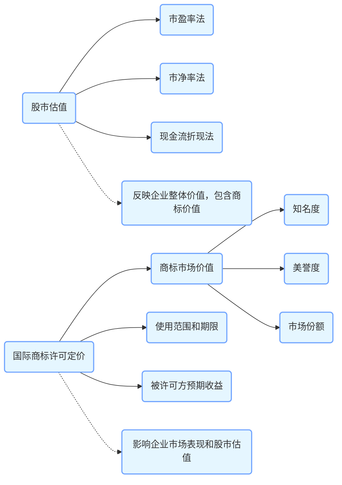

# 股市估值在国际商标许可定价中的应用

> 关键词：股市估值、国际商标许可定价、估值模型、市场分析、风险评估

> 摘要：本文聚焦于股市估值在国际商标许可定价中的应用。首先介绍了研究的背景、目的、预期读者以及文档结构等内容。详细阐述了股市估值和国际商标许可定价的核心概念及其联系，并通过文本示意图和Mermaid流程图进行直观展示。深入探讨了核心算法原理，运用Python源代码进行详细说明，同时给出了相关的数学模型和公式，并举例讲解。通过项目实战，从开发环境搭建到源代码实现及解读，全面分析了如何将股市估值应用于国际商标许可定价。接着探讨了其实际应用场景，推荐了相关的学习资源、开发工具框架和论文著作。最后总结了未来发展趋势与挑战，并对常见问题进行解答，提供扩展阅读和参考资料。

## 1. 背景介绍 
### 1.1 目的和范围
在全球经济一体化的大背景下，国际商标许可交易日益频繁。商标作为企业重要的无形资产，其许可定价一直是交易双方关注的核心问题。合理的商标许可定价不仅关系到交易双方的利益分配，还影响着企业的市场竞争力和品牌战略布局。股市估值作为一种成熟的企业价值评估方法，蕴含了市场对企业未来盈利能力和风险水平的预期。将股市估值应用于国际商标许可定价，旨在为商标许可定价提供更科学、合理的参考依据，提高定价的准确性和公正性。

本研究的范围涵盖了常见的股市估值方法和国际商标许可定价的主要模式，分析了股市估值与国际商标许可定价之间的内在联系和应用机制。通过理论分析和实际案例相结合的方式，探讨如何运用股市估值来优化国际商标许可定价决策。

### 1.2 预期读者
本文的预期读者主要包括从事国际商标许可交易的企业管理人员、知识产权律师、商标评估师、金融分析师以及对商标价值评估和金融市场有研究兴趣的学者和专业人士。企业管理人员可以从中获取科学的商标许可定价方法，优化企业的商标战略和许可交易决策；知识产权律师和商标评估师能够丰富其专业知识和评估手段，提高服务质量；金融分析师可以拓展对企业无形资产价值评估的视角；学者则可以为进一步的学术研究提供参考。

### 1.3 文档结构概述
本文将按照以下结构展开：首先介绍相关背景知识，包括研究目的、预期读者和文档结构等；接着阐述股市估值和国际商标许可定价的核心概念及其联系，通过文本示意图和Mermaid流程图进行直观呈现；然后详细讲解核心算法原理，结合Python源代码进行说明，并给出相关的数学模型和公式及实例；通过项目实战展示如何将股市估值应用于国际商标许可定价，包括开发环境搭建、源代码实现和代码解读；探讨实际应用场景；推荐相关的学习资源、开发工具框架和论文著作；最后总结未来发展趋势与挑战，解答常见问题，并提供扩展阅读和参考资料。

### 1.4 术语表
#### 1.4.1 核心术语定义
- **股市估值**：是指通过一定的方法和模型，对上市公司的股票价值进行评估，以确定其是否被低估、高估或合理定价。常见的股市估值方法包括市盈率法、市净率法、现金流折现法等。
- **国际商标许可**：是指商标所有者将其商标在国际范围内许可给其他企业使用的一种商业行为。许可方通过收取许可费用获得经济收益，被许可方则获得使用商标的权利，以提升自身产品或服务的市场竞争力。
- **商标许可定价**：是指确定商标许可使用费用的过程。合理的商标许可定价需要综合考虑商标的知名度、市场价值、使用范围、许可期限等多种因素。

#### 1.4.2 相关概念解释
- **无形资产**：是指企业拥有或者控制的没有实物形态的可辨认非货币性资产，如商标、专利、版权等。商标作为一种重要的无形资产，具有识别商品或服务来源、积累品牌价值、促进市场竞争等功能。
- **市场价值**：是指在公平交易中，熟悉情况的交易双方自愿进行资产交换或者债务清偿的金额。商标的市场价值反映了市场对该商标的认可程度和预期收益。

#### 1.4.3 缩略词列表
- **PE**：市盈率（Price Earnings Ratio），是指股票价格除以每股收益的比率，用于衡量股票的估值水平。
- **PB**：市净率（Price to Book Ratio），是指股票价格与每股净资产的比率，反映了市场对企业净资产的估值。
- **DCF**：现金流折现法（Discounted Cash Flow），是一种通过预测企业未来现金流并将其折现到当前价值的估值方法。

## 2. 核心概念与联系 
### 核心概念原理
#### 股市估值原理
股市估值的核心是基于企业的财务数据和市场预期，运用一定的估值模型来评估企业的内在价值。不同的估值方法基于不同的假设和原理：
- **市盈率法（PE）**：市盈率反映了投资者为获取企业每股收益所愿意支付的价格倍数。其计算公式为 $PE = \frac{P}{EPS}$，其中 $P$ 为股票价格，$EPS$ 为每股收益。市盈率法假设同行业的企业具有相似的盈利增长前景和风险水平，通过比较目标企业与同行业其他企业的市盈率，来判断目标企业的股票是否被合理定价。
- **市净率法（PB）**：市净率反映了股票价格与每股净资产的关系。其计算公式为 $PB = \frac{P}{BVPS}$，其中 $P$ 为股票价格，$BVPS$ 为每股净资产。市净率法适用于那些资产规模较大、净资产相对稳定的企业，它假设企业的净资产能够在一定程度上反映企业的价值。
- **现金流折现法（DCF）**：现金流折现法是一种基于企业未来现金流的估值方法。其基本原理是将企业未来各期的现金流按照一定的折现率折现到当前时刻，得到企业的内在价值。计算公式为 $V = \sum_{t=1}^{n} \frac{CF_t}{(1 + r)^t}$，其中 $V$ 为企业的内在价值，$CF_t$ 为第 $t$ 期的现金流，$r$ 为折现率，$n$ 为预测期数。

#### 国际商标许可定价原理
国际商标许可定价的核心是确定商标许可使用的合理费用。其定价需要考虑多个因素：
- **商标的市场价值**：包括商标的知名度、美誉度、市场份额等。知名度高、美誉度好、市场份额大的商标通常具有较高的市场价值，其许可费用也相对较高。
- **使用范围和期限**：商标的使用范围包括地域范围、产品或服务类别等。使用范围越广、期限越长，许可费用通常越高。
- **被许可方的预期收益**：被许可方使用商标后预期能够获得的收益也是定价的重要考虑因素。如果被许可方能够通过使用商标获得较高的收益，那么其愿意支付的许可费用也会相应提高。

### 核心概念联系
股市估值与国际商标许可定价之间存在着密切的联系。一方面，股市估值反映了市场对企业整体价值的评估，而商标作为企业的重要无形资产，其价值也包含在企业的整体价值之中。通过分析股市估值，可以了解企业商标的市场认可度和潜在价值。另一方面，国际商标许可定价的合理性也会影响企业的市场表现和股市估值。如果商标许可定价合理，能够为企业带来稳定的收益，那么将有助于提升企业的市场竞争力和股市估值；反之，如果定价不合理，可能会导致企业利益受损，影响企业的市场形象和股市表现。

### 文本示意图
```plaintext
股市估值
|-- 市盈率法
|-- 市净率法
|-- 现金流折现法

国际商标许可定价
|-- 商标市场价值
|   |-- 知名度
|   |-- 美誉度
|   |-- 市场份额
|-- 使用范围和期限
|-- 被许可方预期收益

联系：股市估值反映企业整体价值，包含商标价值；商标许可定价影响企业市场表现和股市估值
```

### Mermaid流程图


## 3. 核心算法原理 & 具体操作步骤 
### 核心算法原理
#### 基于市盈率法的商标价值估算
市盈率法可以用于估算包含商标价值在内的企业整体价值，进而通过一定的方法分离出商标的价值。假设目标企业的每股收益为 $EPS$，同行业平均市盈率为 $PE_{avg}$，则企业的股票价值 $P$ 可以估算为 $P = PE_{avg} \times EPS$。企业的整体价值 $V_{total}$ 可以通过股票价值乘以总股本 $N$ 得到，即 $V_{total} = P \times N$。

为了分离出商标的价值 $V_{trademark}$，可以采用以下步骤：首先，估算企业除商标外的其他资产价值 $V_{other}$，可以通过分析企业的财务报表，将固定资产、流动资产等价值相加得到。然后，用企业的整体价值减去其他资产价值，得到商标的大致价值，即 $V_{trademark} = V_{total} - V_{other}$。

#### 基于现金流折现法的商标许可定价
现金流折现法在商标许可定价中的应用是通过预测被许可方使用商标后未来各期的现金流，并将其折现到当前时刻，得到商标许可的价值。具体步骤如下：
1. **预测现金流**：分析被许可方使用商标后在不同时间段内的预期收益，扣除相应的成本和费用，得到各期的净现金流 $CF_t$。
2. **确定折现率**：折现率 $r$ 反映了资金的时间价值和投资风险。可以根据市场利率、行业平均收益率等因素确定折现率。
3. **计算商标许可价值**：根据现金流折现公式 $V = \sum_{t=1}^{n} \frac{CF_t}{(1 + r)^t}$ 计算商标许可的价值。

### 具体操作步骤
#### 基于市盈率法的商标价值估算步骤
1. **收集数据**：收集目标企业的每股收益数据和同行业平均市盈率数据。可以通过金融数据提供商、证券交易所等渠道获取相关数据。
2. **计算企业股票价值**：根据市盈率公式计算目标企业的股票价值。
3. **估算企业总股本**：通过查阅企业的财务报表或相关公告，获取企业的总股本信息。
4. **计算企业整体价值**：用股票价值乘以总股本得到企业的整体价值。
5. **估算其他资产价值**：分析企业的财务报表，对固定资产、流动资产等进行估值，得到企业除商标外的其他资产价值。
6. **计算商标价值**：用企业的整体价值减去其他资产价值，得到商标的大致价值。

#### 基于现金流折现法的商标许可定价步骤
1. **市场调研**：对被许可方所处的市场环境进行调研，了解市场规模、竞争状况、消费者需求等信息，为预测现金流提供依据。
2. **预测现金流**：结合市场调研结果和被许可方的经营计划，预测被许可方使用商标后未来各期的净现金流。
3. **确定折现率**：综合考虑市场利率、行业风险等因素，确定合适的折现率。
4. **计算商标许可价值**：将预测的各期现金流按照折现率折现到当前时刻，求和得到商标许可的价值。

### Python源代码实现
```python
# 基于市盈率法的商标价值估算
def pe_based_trademark_value(eps, pe_avg, total_shares, other_assets_value):
    # 计算股票价值
    stock_price = pe_avg * eps
    # 计算企业整体价值
    total_value = stock_price * total_shares
    # 计算商标价值
    trademark_value = total_value - other_assets_value
    return trademark_value

# 基于现金流折现法的商标许可定价
def dcf_based_trademark_license_price(cash_flows, discount_rate):
    present_value = 0
    for t, cf in enumerate(cash_flows, start=1):
        # 计算各期现金流的现值
        pv = cf / ((1 + discount_rate) ** t)
        present_value += pv
    return present_value

# 示例数据
eps = 2.0  # 每股收益
pe_avg = 15  # 同行业平均市盈率
total_shares = 1000000  # 总股本
other_assets_value = 10000000  # 其他资产价值
cash_flows = [100000, 120000, 150000, 180000, 200000]  # 未来各期现金流
discount_rate = 0.1  # 折现率

# 计算商标价值
trademark_value = pe_based_trademark_value(eps, pe_avg, total_shares, other_assets_value)
print(f"基于市盈率法估算的商标价值: {trademark_value}")

# 计算商标许可价值
trademark_license_price = dcf_based_trademark_license_price(cash_flows, discount_rate)
print(f"基于现金流折现法估算的商标许可价值: {trademark_license_price}")
```

## 4. 数学模型和公式 & 详细讲解 & 举例说明 
### 市盈率法相关公式及讲解
#### 公式
- 市盈率计算公式：$PE = \frac{P}{EPS}$，其中 $PE$ 为市盈率，$P$ 为股票价格，$EPS$ 为每股收益。
- 股票价值计算公式：$P = PE_{avg} \times EPS$，其中 $PE_{avg}$ 为同行业平均市盈率。
- 企业整体价值计算公式：$V_{total} = P \times N$，其中 $N$ 为总股本。
- 商标价值计算公式：$V_{trademark} = V_{total} - V_{other}$，其中 $V_{other}$ 为企业除商标外的其他资产价值。

#### 详细讲解
市盈率反映了投资者对企业盈利的预期。同行业平均市盈率是一个重要的参考指标，它代表了市场对该行业企业的平均估值水平。通过将目标企业的每股收益乘以同行业平均市盈率，可以估算出目标企业的股票价值。企业的整体价值则是股票价值与总股本的乘积。最后，通过减去其他资产价值，得到商标的大致价值。

#### 举例说明
假设某企业的每股收益为 $3$ 元，同行业平均市盈率为 $20$，总股本为 $500$ 万股，企业除商标外的其他资产价值为 $2000$ 万元。
1. 计算股票价值：$P = 20 \times 3 = 60$（元）
2. 计算企业整体价值：$V_{total} = 60 \times 5000000 = 300000000$（元）$= 3$ 亿元
3. 计算商标价值：$V_{trademark} = 300000000 - 20000000 = 280000000$（元）$= 2.8$ 亿元

### 现金流折现法相关公式及讲解
#### 公式
- 现金流折现公式：$V = \sum_{t=1}^{n} \frac{CF_t}{(1 + r)^t}$，其中 $V$ 为商标许可价值，$CF_t$ 为第 $t$ 期的现金流，$r$ 为折现率，$n$ 为预测期数。

#### 详细讲解
现金流折现法的核心思想是将未来的现金流按照一定的折现率折现到当前时刻，以反映资金的时间价值和投资风险。折现率越高，说明投资者对风险的要求越高，未来现金流的现值就越低。预测期数 $n$ 通常根据被许可方的经营计划和市场情况确定。

#### 举例说明
假设某商标许可项目的未来 $5$ 年现金流分别为 $10$ 万元、$12$ 万元、$15$ 万元、$18$ 万元、$20$ 万元，折现率为 $10\%$。
1. 计算各期现金流的现值：
    - 第 1 期：$PV_1 = \frac{100000}{(1 + 0.1)^1} \approx 90909.09$（元）
    - 第 2 期：$PV_2 = \frac{120000}{(1 + 0.1)^2} \approx 99173.55$（元）
    - 第 3 期：$PV_3 = \frac{150000}{(1 + 0.1)^3} \approx 112697.22$（元）
    - 第 4 期：$PV_4 = \frac{180000}{(1 + 0.1)^4} \approx 122942.43$（元）
    - 第 5 期：$PV_5 = \frac{200000}{(1 + 0.1)^5} \approx 124184.26$（元）
2. 计算商标许可价值：
$V = PV_1 + PV_2 + PV_3 + PV_4 + PV_5 \approx 90909.09 + 99173.55 + 112697.22 + 122942.43 + 124184.26 = 549906.55$（元）

## 5. 项目实战：代码实际案例和详细解释说明 
### 5.1  开发环境搭建
#### 安装Python
首先，需要安装Python开发环境。可以从Python官方网站（https://www.python.org/downloads/）下载适合自己操作系统的Python版本。安装过程中，建议勾选“Add Python to PATH”选项，以便在命令行中可以直接使用Python命令。

#### 安装必要的库
本项目需要使用一些Python库，如 `pandas` 用于数据处理，`numpy` 用于数值计算。可以使用以下命令进行安装：
```sh
pip install pandas numpy
```

### 5.2  源代码详细实现和代码解读
```python
import pandas as pd
import numpy as np

# 基于市盈率法的商标价值估算
def pe_based_trademark_value(eps, pe_avg, total_shares, other_assets_value):
    # 计算股票价值
    stock_price = pe_avg * eps
    # 计算企业整体价值
    total_value = stock_price * total_shares
    # 计算商标价值
    trademark_value = total_value - other_assets_value
    return trademark_value

# 基于现金流折现法的商标许可定价
def dcf_based_trademark_license_price(cash_flows, discount_rate):
    present_value = 0
    for t, cf in enumerate(cash_flows, start=1):
        # 计算各期现金流的现值
        pv = cf / ((1 + discount_rate) ** t)
        present_value += pv
    return present_value

# 示例数据
eps = 2.5  # 每股收益
pe_avg = 18  # 同行业平均市盈率
total_shares = 800000  # 总股本
other_assets_value = 12000000  # 其他资产价值
cash_flows = [110000, 130000, 160000, 190000, 220000]  # 未来各期现金流
discount_rate = 0.12  # 折现率

# 计算商标价值
trademark_value = pe_based_trademark_value(eps, pe_avg, total_shares, other_assets_value)
print(f"基于市盈率法估算的商标价值: {trademark_value}")

# 计算商标许可价值
trademark_license_price = dcf_based_trademark_license_price(cash_flows, discount_rate)
print(f"基于现金流折现法估算的商标许可价值: {trademark_license_price}")

# 模拟数据生成
def generate_sample_data(num_samples):
    eps_list = np.random.uniform(1, 5, num_samples)
    pe_avg_list = np.random.uniform(10, 25, num_samples)
    total_shares_list = np.random.randint(100000, 1000000, num_samples)
    other_assets_value_list = np.random.randint(5000000, 20000000, num_samples)
    cash_flows_list = []
    for _ in range(num_samples):
        cash_flows = np.random.randint(50000, 250000, 5)
        cash_flows_list.append(cash_flows.tolist())
    discount_rate_list = np.random.uniform(0.08, 0.15, num_samples)

    data = {
        'EPS': eps_list,
        'PE_avg': pe_avg_list,
        'Total_shares': total_shares_list,
        'Other_assets_value': other_assets_value_list,
        'Cash_flows': cash_flows_list,
        'Discount_rate': discount_rate_list
    }
    df = pd.DataFrame(data)
    return df

# 生成模拟数据
sample_data = generate_sample_data(10)

# 计算模拟数据中的商标价值和商标许可价值
trademark_values = []
trademark_license_prices = []
for index, row in sample_data.iterrows():
    eps = row['EPS']
    pe_avg = row['PE_avg']
    total_shares = row['Total_shares']
    other_assets_value = row['Other_assets_value']
    cash_flows = row['Cash_flows']
    discount_rate = row['Discount_rate']

    trademark_value = pe_based_trademark_value(eps, pe_avg, total_shares, other_assets_value)
    trademark_license_price = dcf_based_trademark_license_price(cash_flows, discount_rate)

    trademark_values.append(trademark_value)
    trademark_license_prices.append(trademark_license_price)

# 将计算结果添加到数据框中
sample_data['Trademark_value'] = trademark_values
sample_data['Trademark_license_price'] = trademark_license_prices

# 保存数据到CSV文件
sample_data.to_csv('trademark_valuation_data.csv', index=False)
```

### 5.3  代码解读与分析
#### 函数功能
- `pe_based_trademark_value` 函数：根据市盈率法估算商标价值。首先计算股票价值，然后计算企业整体价值，最后用企业整体价值减去其他资产价值得到商标价值。
- `dcf_based_trademark_license_price` 函数：根据现金流折现法计算商标许可价值。通过遍历各期现金流，将其折现到当前时刻并求和得到商标许可价值。
- `generate_sample_data` 函数：生成模拟数据，包括每股收益、同行业平均市盈率、总股本、其他资产价值、未来各期现金流和折现率等。

#### 代码执行流程
1. 定义示例数据，调用 `pe_based_trademark_value` 和 `dcf_based_trademark_license_price` 函数计算商标价值和商标许可价值，并打印结果。
2. 调用 `generate_sample_data` 函数生成模拟数据，存储在 `pandas` 数据框中。
3. 遍历模拟数据，对每一组数据计算商标价值和商标许可价值，并将结果添加到数据框中。
4. 将包含计算结果的数据框保存到CSV文件中。

#### 代码分析
通过模拟数据的生成和计算，可以批量测试不同参数下的商标价值和商标许可价值，为实际应用提供更多的参考。同时，将计算结果保存到CSV文件中，方便后续的数据分析和可视化。

## 6. 实际应用场景 
### 企业商标许可交易
在企业进行国际商标许可交易时，股市估值可以为商标许可定价提供重要的参考依据。许可方可以通过分析自身企业的股市估值，了解商标在市场中的潜在价值，从而在许可交易中制定合理的许可费用。被许可方也可以通过研究许可方的股市估值和市场表现，评估商标的市场认可度和潜在收益，决定是否接受许可条件以及愿意支付的许可费用。

### 商标权投资
投资者在进行商标权投资时，可以运用股市估值方法评估目标商标的价值。通过分析相关企业的股市估值和财务数据，了解商标所在企业的盈利能力和发展前景，从而判断商标的投资价值。例如，如果一家企业的股市估值较高，且其商标在市场上具有较高的知名度和美誉度，那么该商标可能具有较大的投资潜力。

### 企业并购中的商标估值
在企业并购过程中，商标作为重要的无形资产，需要进行合理的估值。股市估值方法可以帮助并购方评估被并购企业商标的价值，确定合理的并购价格。同时，对于被并购方来说，通过股市估值可以更好地展示商标的价值，争取更有利的并购条件。

### 商标战略规划
企业在制定商标战略时，可以参考股市估值的结果。如果企业的股市估值较低，可能需要重新审视商标的市场定位和营销策略，加大品牌推广力度，提升商标的市场价值。反之，如果股市估值较高，企业可以考虑进一步拓展商标的使用范围，开展国际商标许可等业务，实现商标价值的最大化。

## 7. 工具和资源推荐
### 7.1 学习资源推荐
#### 7.1.1 书籍推荐
- 《估值：难点、解决方案及相关案例》：本书全面介绍了各种估值方法和技术，包括股市估值和无形资产估值，通过丰富的案例分析，帮助读者掌握估值的实际应用。
- 《商标价值评估》：专门针对商标价值评估进行深入探讨，介绍了商标价值评估的理论、方法和实践，对国际商标许可定价具有重要的参考价值。
- 《金融市场与金融机构》：帮助读者了解金融市场的基本原理和运行机制，为理解股市估值和商标许可定价的金融背景提供基础。

#### 7.1.2 在线课程
- Coursera平台上的“企业估值与建模”课程：由知名高校教授授课，系统讲解企业估值的方法和模型，包括市盈率法、现金流折现法等。
- edX平台上的“知识产权管理与评估”课程：重点介绍知识产权的管理和评估方法，其中涉及商标价值评估和许可定价的内容。
- 中国大学MOOC平台上的“金融市场与证券投资”课程：对金融市场和证券投资进行全面介绍，有助于理解股市估值的基本概念和方法。

#### 7.1.3 技术博客和网站
- 东方财富网：提供丰富的金融数据和市场分析报告，包括股票行情、财务报表等，有助于进行股市估值分析。
- 知识产权资讯网：专注于知识产权领域的资讯和研究，发布商标价值评估、许可交易等方面的最新动态和研究成果。
- Seeking Alpha：一个知名的金融投资博客平台，有许多专业的分析师和投资者分享股市估值和企业分析的文章和观点。

### 7.2 开发工具框架推荐
#### 7.2.1 IDE和编辑器
- PyCharm：一款专业的Python集成开发环境，提供代码编辑、调试、代码分析等功能，适合Python开发和数据处理。
- Jupyter Notebook：一种交互式的开发环境，支持Python代码的编写和运行，方便进行数据探索和可视化分析。
- Visual Studio Code：一款轻量级的代码编辑器，支持多种编程语言，具有丰富的插件扩展功能，可用于Python开发和项目管理。

#### 7.2.2 调试和性能分析工具
- PDB：Python自带的调试器，可以帮助开发者在代码执行过程中进行调试和定位问题。
- cProfile：Python标准库中的性能分析工具，用于分析代码的执行时间和函数调用情况，帮助优化代码性能。
- Py-Spy：一个简单易用的Python性能分析工具，可以实时监控Python程序的性能，找出性能瓶颈。

#### 7.2.3 相关框架和库
- Pandas：一个强大的数据处理和分析库，提供了丰富的数据结构和函数，方便进行数据清洗、转换和分析。
- NumPy：用于科学计算的基础库，提供了高效的数组操作和数学函数，支持大规模数据的处理和计算。
- Scikit-learn：一个常用的机器学习库，提供了多种机器学习算法和工具，可用于构建预测模型和进行数据分析。

### 7.3 相关论文著作推荐
#### 7.3.1 经典论文
- "Valuation of Intangible Assets: A Review of the Literature"：对无形资产估值的相关文献进行了全面综述，包括商标、专利等无形资产的估值方法和理论。
- "The Role of Brand Equity in Financial Markets"：探讨了品牌权益在金融市场中的作用，分析了品牌价值与企业股市表现之间的关系。
- "Trademark Licensing: An Empirical Analysis"：通过实证研究的方法，分析了商标许可交易的影响因素和定价机制。

#### 7.3.2 最新研究成果
- 近年来，一些学者开始运用机器学习和人工智能技术进行商标价值评估和许可定价研究，相关论文在国际学术期刊上不断发表，如《Journal of Financial Economics》《Management Science》等。
- 关于区块链技术在商标许可交易中的应用研究也逐渐兴起，探讨如何利用区块链的特性提高商标许可交易的透明度和安全性。

#### 7.3.3 应用案例分析
- 《国际知名品牌商标许可案例集》：收集了多个国际知名品牌的商标许可案例，详细分析了每个案例的背景、许可条款、定价策略和实施效果，为实际的商标许可交易提供了参考。
- 一些咨询公司和研究机构发布的行业研究报告中，也包含了大量的商标许可定价案例分析，可通过相关渠道获取。

## 8. 总结：未来发展趋势与挑战
### 未来发展趋势
#### 技术融合趋势
随着人工智能、大数据、区块链等技术的不断发展，这些技术将与股市估值和国际商标许可定价深度融合。人工智能可以通过分析大量的市场数据和企业财务数据，提高股市估值和商标价值评估的准确性和效率；大数据技术可以为商标许可定价提供更全面、准确的市场信息和消费者行为数据；区块链技术可以为商标许可交易提供安全、透明的交易环境，保障交易双方的权益。

#### 国际化趋势
在全球经济一体化的背景下，国际商标许可交易将更加频繁，股市估值在国际商标许可定价中的应用也将更加广泛。不同国家和地区的股市估值方法和商标许可定价规则将逐渐趋于统一，跨国企业在进行商标许可交易时将更加注重全球市场的整体评估和战略布局。

#### 多元化趋势
未来，国际商标许可定价将不再仅仅依赖于传统的股市估值方法，而是会结合更多的因素进行综合评估。例如，考虑商标的社交媒体影响力、品牌文化价值、可持续发展等因素，使商标许可定价更加全面、合理。

### 挑战
#### 数据质量和可用性挑战
股市估值和商标许可定价需要大量准确、可靠的数据支持。然而，在实际应用中，数据质量和可用性可能存在问题。例如，部分企业的财务数据可能存在造假或不完整的情况，市场数据的获取也可能受到限制。这将影响股市估值和商标许可定价的准确性和可靠性。

#### 技术应用挑战
虽然人工智能、大数据等技术为股市估值和商标许可定价带来了新的机遇，但技术的应用也面临着一些挑战。例如，如何选择合适的技术和算法，如何处理数据隐私和安全问题，如何对技术模型进行有效的解释和验证等，都是需要解决的问题。

#### 法律法规和政策挑战
不同国家和地区的法律法规和政策对商标许可交易和股市估值有不同的规定和要求。在进行国际商标许可交易时，需要考虑不同国家和地区的法律法规差异，遵守相关的政策规定。同时，随着技术的不断发展，相关的法律法规和政策也需要不断完善和更新，以适应新的市场环境和交易模式。

## 9. 附录：常见问题与解答
### 股市估值方法是否适用于所有企业的商标价值评估？
不是所有企业都适合使用股市估值方法进行商标价值评估。股市估值方法主要适用于上市公司，因为上市公司有公开的股票价格和财务数据，便于进行估值分析。对于非上市公司，由于缺乏公开的市场数据，股市估值方法的应用受到限制。此时，可以采用其他方法，如成本法、市场法等进行商标价值评估。

### 现金流折现法中的折现率如何确定？
折现率的确定需要综合考虑多个因素，包括市场利率、行业平均收益率、投资风险等。一般来说，可以参考市场上同类型投资的收益率作为基础，再根据目标项目的风险程度进行调整。例如，如果目标项目的风险较高，可以适当提高折现率；如果风险较低，则可以降低折现率。此外，还可以采用资本资产定价模型（CAPM）等方法来计算折现率。

### 商标许可定价除了考虑股市估值和现金流折现法，还需要考虑哪些因素？
除了股市估值和现金流折现法，商标许可定价还需要考虑以下因素：
- 商标的知名度和美誉度：知名度高、美誉度好的商标通常具有较高的价值，许可费用也相对较高。
- 市场竞争状况：如果市场竞争激烈，商标的市场份额和盈利能力可能受到影响，许可费用也会相应降低。
- 被许可方的经营能力和市场资源：被许可方的经营能力和市场资源越强，使用商标后获得收益的可能性就越大，许可方可以适当提高许可费用。
- 许可期限和使用范围：许可期限越长、使用范围越广，许可费用通常越高。

### 如何验证股市估值和商标许可定价的准确性？
可以通过以下方法验证股市估值和商标许可定价的准确性：
- 与市场交易案例进行对比：收集类似商标许可交易的案例，比较其定价与自己的估值结果，分析差异原因。
- 进行敏感性分析：对估值模型中的关键参数进行敏感性分析，观察参数变化对估值结果的影响程度，评估估值结果的稳定性。
- 邀请专业机构进行评估：可以邀请专业的商标评估机构或金融咨询公司对商标价值和许可定价进行评估，与自己的结果进行对比和验证。

## 10. 扩展阅读 & 参考资料
### 扩展阅读
- 《品牌资产管理》：深入探讨品牌资产的管理和提升方法，对理解商标价值的形成和维护具有重要意义。
- 《金融估值建模：投资银行和私募股权投资实践指南》：详细介绍金融估值建模的方法和技巧，包括股市估值和企业估值的实际应用。
- 《知识产权战略与管理》：介绍企业知识产权战略的制定和实施方法，对商标战略规划和许可交易具有指导作用。

### 参考资料
- 中国证券监督管理委员会官方网站：获取上市公司的财务报表和相关信息。
- 世界知识产权组织（WIPO）官方网站：提供国际商标许可交易的相关法规和政策信息。
- 金融数据提供商（如Wind、Bloomberg等）：获取金融市场数据和股市估值指标。

作者：AI天才研究院/AI Genius Institute & 禅与计算机程序设计艺术 /Zen And The Art of Computer Programming