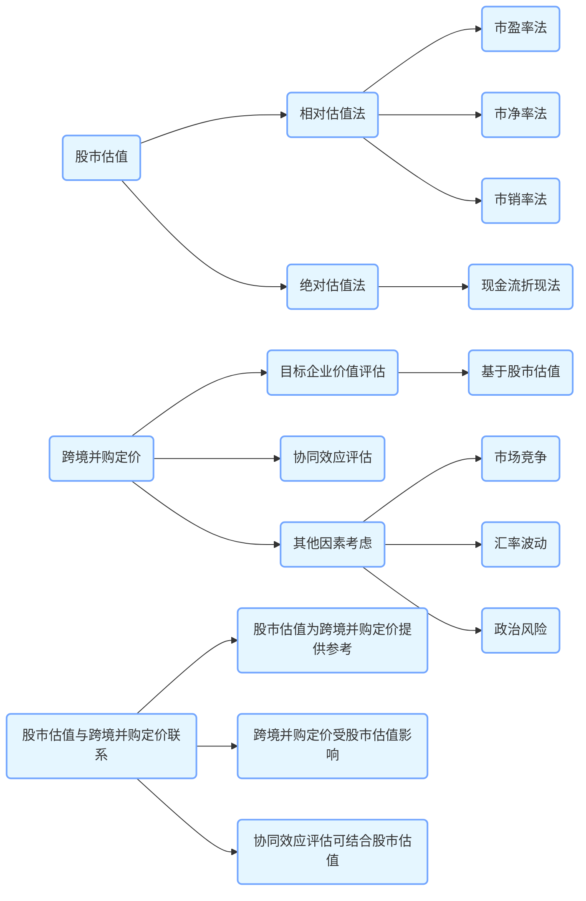

# 股市估值在跨境并购定价中的应用

> 关键词：股市估值、跨境并购定价、估值方法、定价模型、协同效应

> 摘要：本文聚焦于股市估值在跨境并购定价中的应用。首先介绍了相关背景，包括研究目的、预期读者、文档结构和术语表。接着阐述了股市估值和跨境并购定价的核心概念及联系，详细讲解了核心算法原理和具体操作步骤，并通过Python代码进行示例。还给出了相关数学模型和公式，结合实例进行说明。在项目实战部分，介绍了开发环境搭建、源代码实现与解读。分析了股市估值在跨境并购定价中的实际应用场景，推荐了学习资源、开发工具框架和相关论文著作。最后总结了未来发展趋势与挑战，提供了常见问题解答和扩展阅读参考资料，旨在为理解和应用股市估值进行跨境并购定价提供全面而深入的指导。

## 1. 背景介绍 
### 1.1 目的和范围
在经济全球化的背景下，跨境并购活动日益频繁。跨境并购定价是一个复杂且关键的过程，合理的定价对于并购双方的利益至关重要。股市估值作为一种重要的企业价值评估手段，能够为跨境并购定价提供重要的参考依据。本文的目的在于深入探讨股市估值在跨境并购定价中的应用，详细介绍各种股市估值方法及其在跨境并购场景下的具体应用方式，分析其优势和局限性，为企业在跨境并购活动中进行合理定价提供理论支持和实践指导。范围涵盖了常见的股市估值方法，如市盈率法、市净率法、现金流折现法等，以及这些方法在不同行业、不同类型跨境并购中的应用情况。

### 1.2 预期读者
本文的预期读者主要包括企业的高层管理人员、投资银行家、财务分析师、并购顾问等参与跨境并购活动的专业人士，他们需要了解股市估值在跨境并购定价中的具体应用，以制定合理的并购策略和定价方案。同时，也适合对金融、投资领域感兴趣的学者和学生阅读，帮助他们深入理解跨境并购定价的理论和实践。

### 1.3 文档结构概述
本文将按照以下结构进行阐述：首先介绍股市估值和跨境并购定价的核心概念及它们之间的联系，通过文本示意图和Mermaid流程图进行清晰展示；接着详细讲解核心算法原理和具体操作步骤，并结合Python代码进行说明；然后给出相关的数学模型和公式，并举例进行详细讲解；在项目实战部分，介绍开发环境搭建、源代码实现和代码解读；分析股市估值在跨境并购定价中的实际应用场景；推荐学习资源、开发工具框架和相关论文著作；最后总结未来发展趋势与挑战，提供常见问题解答和扩展阅读参考资料。

### 1.4 术语表
#### 1.4.1 核心术语定义
- **股市估值**：是指对上市公司的价值进行评估的过程和方法，通过分析公司的财务状况、经营业绩、行业前景等因素，确定公司股票的合理价值。
- **跨境并购**：指一国企业为了达到某种目标，通过一定的渠道和支付手段，将另一国企业的整个资产或足以行使经营控制权的股份收买下来的经济行为。
- **并购定价**：在并购活动中，确定目标企业的交易价格的过程，需要综合考虑多种因素，如目标企业的价值、协同效应、市场竞争等。
- **协同效应**：指并购后企业整体价值大于并购前两个企业价值之和的效应，包括经营协同效应、财务协同效应和管理协同效应等。

#### 1.4.2 相关概念解释
- **可比公司**：在股市估值中，选择与目标公司在业务、规模、行业等方面具有相似特征的公司作为参考，通过分析可比公司的估值指标来评估目标公司的价值。
- **折现率**：在现金流折现法中，用于将未来的现金流量折算为现值的比率，反映了资金的时间价值和投资风险。
- **控制权溢价**：在并购中，收购方为了获得目标公司的控制权而愿意支付的超过市场价格的额外费用。

#### 1.4.3 缩略词列表
- **P/E**：市盈率（Price-to-Earnings Ratio），是指股票价格除以每股收益的比率，用于衡量股票的估值水平。
- **P/B**：市净率（Price-to-Book Ratio），是指股票价格除以每股净资产的比率，反映了股票价格相对于每股净资产的倍数。
- **DCF**：现金流折现法（Discounted Cash Flow），是一种通过预测企业未来的现金流量，并将其折现到当前时刻来评估企业价值的方法。

## 2. 核心概念与联系 

### 股市估值核心概念
股市估值是基于对上市公司的财务数据、经营状况、行业前景等多方面因素的分析，来确定公司股票的合理价值。常见的股市估值方法有相对估值法和绝对估值法。

#### 相对估值法
相对估值法是通过比较目标公司与可比公司的某些财务指标，来评估目标公司的价值。常用的相对估值指标有市盈率（P/E）、市净率（P/B）、市销率（P/S）等。例如，市盈率法是用目标公司的每股收益乘以可比公司的平均市盈率来估算目标公司的股票价格。

#### 绝对估值法
绝对估值法是通过预测公司未来的现金流量，并将其折现到当前时刻来评估公司的价值。现金流折现法（DCF）是最常用的绝对估值方法，其基本思想是公司的价值等于其未来所有现金流量的现值之和。

### 跨境并购定价核心概念
跨境并购定价是在跨境并购活动中，确定目标企业交易价格的过程。跨境并购定价需要考虑多种因素，包括目标企业的价值、协同效应、市场竞争、汇率波动、政治风险等。目标企业的价值是跨境并购定价的基础，而协同效应则是影响并购定价的重要因素之一。

### 核心概念联系
股市估值为跨境并购定价提供了重要的参考依据。在跨境并购中，收购方可以通过股市估值方法评估目标企业的价值，从而确定合理的并购价格。同时，跨境并购定价也会受到股市估值的影响，如果股市对目标企业的估值较高，收购方可能需要支付更高的价格来完成并购。此外，协同效应的评估也可以结合股市估值方法进行，通过比较并购前后企业的股市估值变化来衡量协同效应的大小。

### 文本示意图
```plaintext
股市估值
|-- 相对估值法
|   |-- 市盈率法
|   |-- 市净率法
|   |-- 市销率法
|-- 绝对估值法
|   |-- 现金流折现法

跨境并购定价
|-- 目标企业价值评估
|   |-- 基于股市估值
|-- 协同效应评估
|-- 其他因素考虑
|   |-- 市场竞争
|   |-- 汇率波动
|   |-- 政治风险

股市估值与跨境并购定价联系
|-- 股市估值为跨境并购定价提供参考
|-- 跨境并购定价受股市估值影响
|-- 协同效应评估可结合股市估值
```

### Mermaid流程图


## 3. 核心算法原理 & 具体操作步骤 

### 市盈率法
#### 算法原理
市盈率（P/E）是指股票价格除以每股收益的比率，反映了市场对公司盈利的预期。市盈率法的基本思想是通过比较目标公司与可比公司的市盈率，来估算目标公司的股票价格。公式为：

$P = EPS \times P/E$

其中，$P$ 为目标公司的股票价格，$EPS$ 为目标公司的每股收益，$P/E$ 为可比公司的平均市盈率。

#### 具体操作步骤
1. **选择可比公司**：选择与目标公司在业务、规模、行业等方面具有相似特征的公司作为可比公司。
2. **计算可比公司的平均市盈率**：收集可比公司的股票价格和每股收益数据，计算它们的市盈率，并取平均值。
3. **确定目标公司的每股收益**：获取目标公司的财务报表，计算其每股收益。
4. **估算目标公司的股票价格**：将目标公司的每股收益乘以可比公司的平均市盈率，得到目标公司的股票价格。

#### Python代码实现
```python
# 可比公司数据
comparable_companies = [
    {'price': 50, 'eps': 2},
    {'price': 60, 'eps': 3},
    {'price': 40, 'eps': 1.5}
]

# 计算可比公司的平均市盈率
pe_ratios = [company['price'] / company['eps'] for company in comparable_companies]
average_pe = sum(pe_ratios) / len(pe_ratios)

# 目标公司的每股收益
target_eps = 2.5

# 估算目标公司的股票价格
target_price = target_eps * average_pe

print(f"目标公司的估算股票价格为: {target_price}")
```

### 现金流折现法
#### 算法原理
现金流折现法（DCF）是通过预测公司未来的现金流量，并将其折现到当前时刻来评估公司的价值。基本公式为：

$V = \sum_{t=1}^{n} \frac{FCF_t}{(1 + r)^t} + \frac{TV}{(1 + r)^n}$

其中，$V$ 为公司的价值，$FCF_t$ 为第 $t$ 期的自由现金流量，$r$ 为折现率，$n$ 为预测期数，$TV$ 为终值。

#### 具体操作步骤
1. **预测未来现金流量**：根据公司的历史财务数据和业务发展前景，预测公司未来 $n$ 期的自由现金流量。
2. **确定折现率**：折现率反映了资金的时间价值和投资风险，通常可以使用加权平均资本成本（WACC）作为折现率。
3. **计算终值**：终值是指预测期结束后公司的持续价值，可以使用永续增长模型等方法进行计算。
4. **折现现金流量和终值**：将预测的现金流量和终值分别折现到当前时刻，并求和得到公司的价值。

#### Python代码实现
```python
import numpy as np

# 预测的自由现金流量
fcf = [100, 120, 150, 180, 200]
# 折现率
discount_rate = 0.1
# 预测期数
n = len(fcf)

# 计算终值（假设永续增长率为 3%）
terminal_growth_rate = 0.03
terminal_value = fcf[-1] * (1 + terminal_growth_rate) / (discount_rate - terminal_growth_rate)

# 折现现金流量
discounted_fcf = [fcf[i] / (1 + discount_rate)**(i + 1) for i in range(n)]

# 折现终值
discounted_terminal_value = terminal_value / (1 + discount_rate)**n

# 计算公司价值
company_value = sum(discounted_fcf) + discounted_terminal_value

print(f"公司的价值为: {company_value}")
```

## 4. 数学模型和公式 & 详细讲解 & 举例说明 

### 市盈率法数学模型和公式
#### 公式
$P = EPS \times P/E$

#### 详细讲解
市盈率法的核心思想是基于市场对可比公司的估值来推断目标公司的价值。市盈率反映了市场对公司盈利的预期，较高的市盈率意味着市场对公司未来的盈利增长有较高的期望。通过将目标公司的每股收益乘以可比公司的平均市盈率，可以得到目标公司的估算股票价格。

#### 举例说明
假设目标公司的每股收益为 $3$ 元，可比公司的平均市盈率为 $20$ 倍。则目标公司的估算股票价格为：

$P = 3 \times 20 = 60$（元）

### 现金流折现法数学模型和公式
#### 公式
$V = \sum_{t=1}^{n} \frac{FCF_t}{(1 + r)^t} + \frac{TV}{(1 + r)^n}$

#### 详细讲解
现金流折现法的基本原理是资金具有时间价值，未来的现金流量需要折现到当前时刻才能反映其真实价值。公式中，$\sum_{t=1}^{n} \frac{FCF_t}{(1 + r)^t}$ 表示预测期内各期自由现金流量的现值之和，$\frac{TV}{(1 + r)^n}$ 表示终值的现值。折现率 $r$ 反映了资金的时间价值和投资风险，终值 $TV$ 表示预测期结束后公司的持续价值。

#### 举例说明
假设某公司未来 $5$ 年的自由现金流量分别为 $100$ 万元、$120$ 万元、$150$ 万元、$180$ 万元和 $200$ 万元，折现率为 $10\%$，预测期结束后的永续增长率为 $3\%$。

首先计算终值：

$TV = \frac{200 \times (1 + 0.03)}{0.1 - 0.03} = \frac{206}{0.07} \approx 2942.86$（万元）

然后计算各期自由现金流量的现值：

$PV_{FCF1} = \frac{100}{(1 + 0.1)^1} \approx 90.91$（万元）

$PV_{FCF2} = \frac{120}{(1 + 0.1)^2} \approx 99.17$（万元）

$PV_{FCF3} = \frac{150}{(1 + 0.1)^3} \approx 112.70$（万元）

$PV_{FCF4} = \frac{180}{(1 + 0.1)^4} \approx 122.94$（万元）

$PV_{FCF5} = \frac{200}{(1 + 0.1)^5} \approx 124.18$（万元）

终值的现值：

$PV_{TV} = \frac{2942.86}{(1 + 0.1)^5} \approx 1822.37$（万元）

公司的价值为：

$V = 90.91 + 99.17 + 112.70 + 122.94 + 124.18 + 1822.37 = 2372.27$（万元）

## 5. 项目实战：代码实际案例和详细解释说明 

### 5.1  开发环境搭建
#### 操作系统
可以选择Windows、Linux或Mac OS等常见的操作系统。

#### 编程语言和开发工具
使用Python作为编程语言，推荐使用Anaconda作为Python的发行版，它包含了许多常用的科学计算库。可以使用Jupyter Notebook或PyCharm作为开发工具。

#### 安装必要的库
在命令行中使用以下命令安装必要的库：
```sh
pip install numpy pandas matplotlib
```

### 5.2  源代码详细实现和代码解读
#### 项目需求
假设我们要对一家目标公司进行估值，并将其应用于跨境并购定价。我们将使用市盈率法和现金流折现法进行估值。

#### 源代码实现
```python
import numpy as np
import pandas as pd
import matplotlib.pyplot as plt

# 可比公司数据
comparable_companies = pd.DataFrame({
    'price': [50, 60, 40],
    'eps': [2, 3, 1.5]
})

# 计算可比公司的平均市盈率
comparable_companies['pe'] = comparable_companies['price'] / comparable_companies['eps']
average_pe = comparable_companies['pe'].mean()

# 目标公司的每股收益
target_eps = 2.5

# 市盈率法估算目标公司的股票价格
target_price_pe = target_eps * average_pe

# 现金流折现法数据
fcf = np.array([100, 120, 150, 180, 200])
discount_rate = 0.1
n = len(fcf)
terminal_growth_rate = 0.03

# 计算终值
terminal_value = fcf[-1] * (1 + terminal_growth_rate) / (discount_rate - terminal_growth_rate)

# 折现现金流量
discounted_fcf = fcf / (1 + discount_rate)**np.arange(1, n + 1)

# 折现终值
discounted_terminal_value = terminal_value / (1 + discount_rate)**n

# 计算公司价值
company_value_dcf = discounted_fcf.sum() + discounted_terminal_value

# 输出结果
print(f"市盈率法估算目标公司的股票价格为: {target_price_pe}")
print(f"现金流折现法估算公司的价值为: {company_value_dcf}")

# 可视化现金流量折现过程
plt.plot(np.arange(1, n + 1), discounted_fcf, label='Discounted FCF')
plt.axhline(y=discounted_terminal_value, color='r', linestyle='--', label='Discounted Terminal Value')
plt.xlabel('Year')
plt.ylabel('Discounted Cash Flow')
plt.title('Discounted Cash Flow Analysis')
plt.legend()
plt.show()
```

#### 代码解读
1. **数据准备**：使用 `pandas` 库创建可比公司的数据框，并计算可比公司的市盈率和平均市盈率。同时，定义目标公司的每股收益和现金流折现法所需的数据。
2. **市盈率法估值**：将目标公司的每股收益乘以可比公司的平均市盈率，得到目标公司的估算股票价格。
3. **现金流折现法估值**：首先计算终值，然后将各期自由现金流量和终值分别折现到当前时刻，并求和得到公司的价值。
4. **结果输出**：打印市盈率法和现金流折现法的估值结果。
5. **可视化**：使用 `matplotlib` 库绘制现金流量折现过程的可视化图表，帮助理解折现过程。

### 5.3  代码解读与分析
#### 市盈率法
市盈率法的优点是简单易懂，计算方便，能够反映市场对公司盈利的预期。但是，市盈率法的局限性在于它依赖于可比公司的选择，不同的可比公司可能会得到不同的估值结果。此外，市盈率法没有考虑公司的未来增长潜力和风险。

#### 现金流折现法
现金流折现法的优点是考虑了公司的未来现金流量和资金的时间价值，能够更准确地评估公司的内在价值。但是，现金流折现法的缺点是需要对未来现金流量和折现率进行预测，预测的准确性会影响估值结果的可靠性。此外，现金流折现法的计算过程相对复杂，需要较多的专业知识和数据支持。

## 6. 实际应用场景 
### 战略并购
在战略并购中，收购方通常希望通过并购目标公司来实现业务扩张、资源整合、技术共享等战略目标。股市估值可以帮助收购方评估目标公司的价值，确定合理的并购价格。例如，一家科技公司计划收购一家具有先进技术的初创企业，通过股市估值可以了解初创企业的市场价值，为并购谈判提供参考。

### 财务并购
财务并购的目的主要是获取投资回报，收购方通常会关注目标公司的财务状况和盈利能力。股市估值方法如市盈率法和现金流折现法可以帮助收购方评估目标公司的投资价值，判断是否值得进行并购。例如，一家投资公司计划收购一家上市公司，通过股市估值可以分析该公司的估值水平，评估并购后的潜在收益。

### 跨境行业整合
在跨境行业整合中，企业通过并购来实现行业内的资源优化配置和市场份额扩大。股市估值可以用于比较不同国家和地区同行业企业的价值，帮助企业选择合适的并购目标和确定合理的并购价格。例如，一家汽车制造企业计划在全球范围内进行行业整合，通过股市估值可以了解不同国家汽车企业的估值情况，制定并购战略。

## 7. 工具和资源推荐
### 7.1 学习资源推荐
#### 7.1.1 书籍推荐
- 《投资估值手册》：全面介绍了各种估值方法和技术，包括股市估值和并购估值，是一本非常实用的估值工具书。
- 《并购创造价值》：深入探讨了并购的理论和实践，包括并购定价、协同效应评估等内容，对理解跨境并购定价有很大帮助。
- 《财务报表分析与证券定价》：讲解了如何通过分析财务报表来进行企业估值，为股市估值提供了重要的理论基础。

#### 7.1.2 在线课程
- Coursera上的“企业估值与财务建模”课程：由知名教授授课，系统介绍了企业估值的方法和财务建模技巧。
- edX上的“并购与私募股权”课程：涵盖了并购的各个方面，包括并购定价、交易结构设计等内容。

#### 7.1.3 技术博客和网站
- Seeking Alpha：提供了大量的股票分析和估值报告，对学习股市估值和了解市场动态有很大帮助。
- Bloomberg：全球知名的金融信息服务提供商，提供丰富的金融数据和分析工具，可用于股市估值和跨境并购研究。

### 7.2 开发工具框架推荐
#### 7.2.1 IDE和编辑器
- PyCharm：功能强大的Python集成开发环境，提供代码编辑、调试、版本控制等功能，适合开发股市估值和并购定价相关的Python程序。
- Jupyter Notebook：交互式的开发环境，支持代码、文本、图表等多种形式的展示，方便进行数据分析和可视化，常用于估值模型的开发和验证。

#### 7.2.2 调试和性能分析工具
- pdb：Python自带的调试工具，可用于调试Python代码，帮助查找代码中的错误。
- cProfile：Python的性能分析工具，可用于分析代码的运行时间和性能瓶颈，优化代码性能。

#### 7.2.3 相关框架和库
- numpy：用于科学计算的Python库，提供了高效的数组操作和数学函数，在股市估值和现金流折现计算中经常使用。
- pandas：用于数据处理和分析的Python库，提供了数据结构和数据操作方法，方便处理和分析财务数据。
- matplotlib：用于数据可视化的Python库，可绘制各种图表，帮助直观展示估值结果和数据趋势。

### 7.3 相关论文著作推荐
#### 7.3.1 经典论文
- "Valuation of High - Tech Firms: A Review of the State - of - the - Art"：对高科技企业的估值方法进行了综述和分析，探讨了不同估值方法在高科技企业中的应用。
- "The Market for Corporate Control: The Scientific Evidence"：研究了企业控制权市场的相关问题，包括并购定价、协同效应等，为跨境并购定价提供了理论支持。

#### 7.3.2 最新研究成果
- 关注顶尖学术期刊如《Journal of Finance》、《Review of Financial Studies》等，这些期刊会发表关于股市估值和并购定价的最新研究成果。

#### 7.3.3 应用案例分析
- 一些知名咨询公司如麦肯锡、贝恩等会发布跨境并购的案例分析报告，通过实际案例了解股市估值在跨境并购定价中的应用和实践经验。

## 8. 总结：未来发展趋势与挑战
### 未来发展趋势
#### 数字化和智能化
随着信息技术的发展，股市估值和跨境并购定价将越来越多地采用数字化和智能化的方法。例如，利用大数据和人工智能技术可以更准确地预测企业的未来现金流量和估值，提高并购定价的准确性和效率。

#### 国际化和多元化
跨境并购活动将继续增加，涉及的国家和行业将更加多元化。股市估值需要考虑不同国家的经济环境、法律法规、文化差异等因素，以适应国际化和多元化的发展趋势。

#### 协同效应的深入挖掘
未来，企业在跨境并购中将更加注重协同效应的挖掘和实现。股市估值方法将不断完善，以更好地评估协同效应的价值，为并购定价提供更合理的依据。

### 挑战
#### 数据质量和可靠性
股市估值和跨境并购定价需要大量的财务数据和市场信息，数据的质量和可靠性直接影响估值结果的准确性。然而，不同国家和地区的数据标准和披露要求存在差异，获取准确可靠的数据面临一定的挑战。

#### 市场不确定性
跨境并购活动受到宏观经济环境、政治局势、汇率波动等多种因素的影响，市场不确定性增加。在这种情况下，准确预测企业的未来业绩和现金流变得更加困难，给股市估值和并购定价带来了挑战。

#### 文化和法律差异
不同国家和地区的文化和法律差异较大，在跨境并购中需要考虑这些差异对并购定价的影响。例如，不同国家的会计准则和税收政策不同，可能会导致财务数据的可比性降低，增加了估值的难度。

## 9. 附录：常见问题与解答
### 问题1：如何选择合适的可比公司进行市盈率法估值？
解答：选择可比公司时，需要考虑公司的业务、规模、行业、财务状况等因素。一般来说，可比公司应与目标公司在这些方面具有相似特征，以确保估值结果的准确性。可以通过行业分类标准、财务指标筛选等方法来选择可比公司。

### 问题2：现金流折现法中的折现率如何确定？
解答：折现率通常可以使用加权平均资本成本（WACC）来确定。WACC是企业各种资本来源的成本加权平均值，反映了企业的融资成本和投资风险。计算WACC需要考虑企业的股权成本、债务成本、股权和债务的比例等因素。

### 问题3：股市估值结果与实际并购价格之间可能存在哪些差异？
解答：股市估值结果是基于一定的假设和模型得出的，而实际并购价格还受到多种因素的影响，如协同效应、市场竞争、谈判技巧等。因此，股市估值结果与实际并购价格之间可能存在差异。在实际并购中，需要综合考虑各种因素，对估值结果进行调整，以确定合理的并购价格。

## 10. 扩展阅读 & 参考资料
### 扩展阅读
- 《金融炼金术》：乔治·索罗斯的经典著作，探讨了金融市场的运行规律和投资者的行为，对理解股市估值和并购定价有一定的启示。
- 《聪明的投资者》：本杰明·格雷厄姆的投资经典，介绍了价值投资的理念和方法，对股市估值和投资决策有重要的指导意义。

### 参考资料
- 相关上市公司的财务报表和年报
- 金融数据库如Wind、Bloomberg等提供的数据和报告
- 学术期刊上发表的关于股市估值和跨境并购定价的研究论文

作者：AI天才研究院/AI Genius Institute & 禅与计算机程序设计艺术 /Zen And The Art of Computer Programming