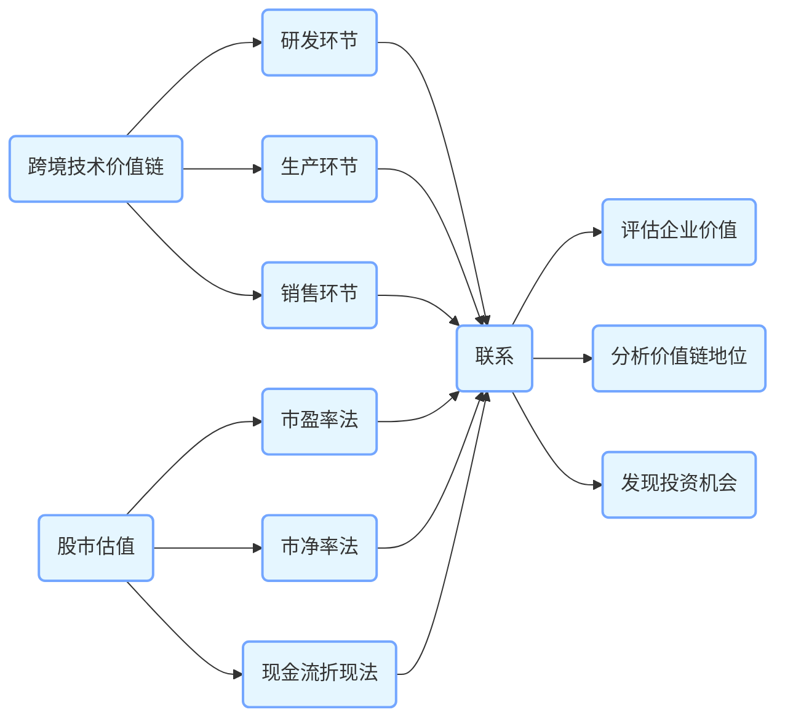

# 股市估值在跨境技术价值链分析中的应用

> 关键词：股市估值、跨境技术价值链、价值评估、投资决策、市场分析

> 摘要：本文深入探讨了股市估值在跨境技术价值链分析中的应用。首先介绍了研究的背景、目的、预期读者和文档结构等内容。接着阐述了股市估值和跨境技术价值链的核心概念及其联系，包括原理和架构的文本示意图与 Mermaid 流程图。详细讲解了相关核心算法原理及具体操作步骤，结合 Python 源代码进行说明。分析了其中涉及的数学模型和公式，并举例阐释。通过项目实战，展示了代码的实际案例并进行详细解读。探讨了股市估值在跨境技术价值链分析中的实际应用场景，推荐了学习资源、开发工具框架以及相关论文著作。最后总结了未来发展趋势与挑战，还给出了常见问题的解答和扩展阅读参考资料，旨在为投资者、分析师等提供全面且深入的指导，助力在跨境技术领域做出更明智的决策。

## 1. 背景介绍 
### 1.1 目的和范围
在全球化的今天，跨境技术合作与贸易日益频繁，形成了复杂的跨境技术价值链。股市估值作为评估企业价值的重要手段，对于理解跨境技术价值链上各环节企业的价值具有重要意义。本文的目的在于探讨如何运用股市估值方法来分析跨境技术价值链，为投资者、企业管理者和政策制定者提供决策依据。研究范围涵盖了常见的股市估值方法，如市盈率法、市净率法、现金流折现法等在跨境技术价值链不同环节（研发、生产、销售等）企业中的应用。

### 1.2 预期读者
本文的预期读者包括金融投资者，他们希望通过股市估值分析跨境技术企业的投资价值；企业管理者，有助于他们了解自身在跨境技术价值链中的地位和价值，制定合理的战略；政策制定者，为其制定相关产业政策提供参考；以及对跨境技术和金融市场感兴趣的研究人员和学生。

### 1.3 文档结构概述
本文首先介绍核心概念，包括股市估值和跨境技术价值链的定义、原理和相互联系，并给出相应的示意图和流程图。接着详细讲解核心算法原理和具体操作步骤，结合 Python 代码实现。然后分析涉及的数学模型和公式，并举例说明。通过项目实战展示代码的实际应用和解读。探讨股市估值在跨境技术价值链分析中的实际应用场景。推荐相关的学习资源、开发工具框架和论文著作。最后总结未来发展趋势与挑战，提供常见问题解答和扩展阅读参考资料。

### 1.4 术语表
#### 1.4.1 核心术语定义
- **股市估值**：指对上市公司的价值进行评估，通过一定的方法和模型计算出公司股票的内在价值，以判断其市场价格是否合理。
- **跨境技术价值链**：涉及不同国家和地区的技术研发、生产、销售等环节，形成的一个完整的价值创造链条，每个环节都为最终产品或服务增加价值。
- **市盈率（P/E）**：股票价格与每股收益的比率，反映了市场对公司盈利的预期和估值水平。
- **市净率（P/B）**：股票价格与每股净资产的比率，用于衡量公司的市场价值相对于其账面价值的高低。
- **现金流折现法（DCF）**：通过预测公司未来的现金流，并将其折现到当前时点，以计算公司的内在价值。

#### 1.4.2 相关概念解释
- **技术溢出效应**：在跨境技术价值链中，一个企业或地区的技术进步可能会对其他企业或地区产生积极的影响，促进整个价值链的技术提升。
- **产业集群**：在跨境技术领域，相关企业和机构在一定地理区域内集聚，形成产业集群，通过共享资源、技术和信息，提高整个集群的竞争力。
- **全球供应链**：跨境技术产品的生产往往涉及全球范围内的原材料采购、零部件制造和产品组装等环节，形成了复杂的全球供应链。

#### 1.4.3 缩略词列表
- **P/E**：市盈率（Price-to-Earnings Ratio）
- **P/B**：市净率（Price-to-Book Ratio）
- **DCF**：现金流折现法（Discounted Cash Flow）
- **ROE**：净资产收益率（Return on Equity）

## 2. 核心概念与联系 

### 2.1 股市估值原理
股市估值的核心目标是确定上市公司的内在价值，以便投资者判断股票价格是否被高估或低估。常见的估值方法基于不同的假设和理论，以下是几种主要方法的原理：

- **市盈率法**：市盈率是最常用的估值指标之一。其原理是市场对公司未来盈利的预期反映在股票价格中，通过将公司的每股收益乘以同行业或市场平均市盈率，得到公司的估计价值。公式为：$P = EPS \times P/E$，其中 $P$ 为股票价格，$EPS$ 为每股收益，$P/E$ 为市盈率。

- **市净率法**：市净率反映了市场对公司净资产的估值。其原理是公司的净资产是其价值的基础，通过将公司的每股净资产乘以同行业或市场平均市净率，得到公司的估计价值。公式为：$P = BVPS \times P/B$，其中 $P$ 为股票价格，$BVPS$ 为每股净资产，$P/B$ 为市净率。

- **现金流折现法**：现金流折现法基于货币的时间价值原理，认为公司的价值等于其未来所有现金流的现值之和。通过预测公司未来的自由现金流，并选择合适的折现率将其折现到当前时点，得到公司的内在价值。公式为：$V = \sum_{t=1}^{n} \frac{FCF_t}{(1 + r)^t}$，其中 $V$ 为公司价值，$FCF_t$ 为第 $t$ 期的自由现金流，$r$ 为折现率，$n$ 为预测期数。

### 2.2 跨境技术价值链架构
跨境技术价值链涵盖了从技术研发、产品生产到市场销售的整个过程，通常可以分为以下几个环节：

- **研发环节**：是跨境技术价值链的起点，主要包括基础研究、应用研究和产品开发等活动。研发环节的企业通常具有较高的技术含量和创新能力，是推动技术进步的关键力量。

- **生产环节**：根据研发成果进行产品的制造和组装。生产环节需要考虑成本控制、质量保证和生产效率等因素，不同国家和地区的生产优势不同，形成了全球范围内的产业分工。

- **销售环节**：将产品推向市场，实现价值的转化。销售环节需要考虑市场需求、营销策略和品牌建设等因素，不同国家和地区的市场环境和消费习惯存在差异，对销售策略的制定提出了挑战。

### 2.3 股市估值与跨境技术价值链的联系
股市估值在跨境技术价值链分析中具有重要作用，主要体现在以下几个方面：

- **评估企业价值**：通过股市估值方法，可以对跨境技术价值链上各环节的企业进行价值评估，帮助投资者了解企业的真实价值，做出合理的投资决策。

- **分析价值链地位**：不同环节的企业在跨境技术价值链中的地位和作用不同，其盈利能力和成长潜力也存在差异。通过股市估值指标的比较，可以分析企业在价值链中的地位，判断其竞争优势和发展前景。

- **发现投资机会**：股市估值可以帮助投资者发现跨境技术价值链中的投资机会。例如，当某个环节的企业估值被低估时，可能存在投资价值；而当某个环节的企业估值过高时，可能存在投资风险。

### 2.4 文本示意图
```plaintext
跨境技术价值链
|-- 研发环节
|   |-- 基础研究
|   |-- 应用研究
|   |-- 产品开发
|-- 生产环节
|   |-- 原材料采购
|   |-- 零部件制造
|   |-- 产品组装
|-- 销售环节
|   |-- 市场调研
|   |-- 营销策略制定
|   |-- 产品销售
|   |-- 售后服务

股市估值
|-- 市盈率法
|-- 市净率法
|-- 现金流折现法

联系：股市估值用于评估跨境技术价值链各环节企业的价值，辅助投资决策和价值链分析
```

### 2.5 Mermaid 流程图


## 3. 核心算法原理 & 具体操作步骤 

### 3.1 市盈率法
#### 3.1.1 算法原理
市盈率法的核心思想是通过比较目标公司与同行业或市场平均市盈率，来评估目标公司的股票价值。市盈率反映了市场对公司盈利的预期，较高的市盈率通常意味着市场对公司未来盈利增长的预期较高。

#### 3.1.2 具体操作步骤
1. **确定目标公司的每股收益（EPS）**：可以从公司的财务报表中获取最近一期的净利润，并除以总股本得到每股收益。
2. **选择合适的市盈率（P/E）**：可以选择同行业的平均市盈率或市场的平均市盈率作为参考。同行业平均市盈率可以通过收集同行业上市公司的市盈率数据并计算平均值得到。
3. **计算目标公司的估计价值**：将目标公司的每股收益乘以所选的市盈率，得到目标公司的估计价值。公式为：$P = EPS \times P/E$。

#### 3.1.3 Python 代码实现
```python
# 假设目标公司的每股收益为 2 元，同行业平均市盈率为 20
eps = 2
pe = 20

# 计算目标公司的估计价值
estimated_value = eps * pe

print(f"目标公司的估计价值为: {estimated_value} 元")
```

### 3.2 市净率法
#### 3.2.1 算法原理
市净率法的原理是基于公司的净资产是其价值的基础，通过比较目标公司与同行业或市场平均市净率，来评估目标公司的股票价值。市净率较低的公司可能被低估，具有投资价值。

#### 3.2.2 具体操作步骤
1. **确定目标公司的每股净资产（BVPS）**：可以从公司的财务报表中获取净资产，并除以总股本得到每股净资产。
2. **选择合适的市净率（P/B）**：可以选择同行业的平均市净率或市场的平均市净率作为参考。同行业平均市净率可以通过收集同行业上市公司的市净率数据并计算平均值得到。
3. **计算目标公司的估计价值**：将目标公司的每股净资产乘以所选的市净率，得到目标公司的估计价值。公式为：$P = BVPS \times P/B$。

#### 3.2.3 Python 代码实现
```python
# 假设目标公司的每股净资产为 5 元，同行业平均市净率为 1.5
bvps = 5
pb = 1.5

# 计算目标公司的估计价值
estimated_value = bvps * pb

print(f"目标公司的估计价值为: {estimated_value} 元")
```

### 3.3 现金流折现法
#### 3.3.1 算法原理
现金流折现法基于货币的时间价值原理，认为公司的价值等于其未来所有现金流的现值之和。通过预测公司未来的自由现金流，并选择合适的折现率将其折现到当前时点，得到公司的内在价值。

#### 3.3.2 具体操作步骤
1. **预测未来自由现金流（FCF）**：需要对公司的业务进行分析和预测，考虑市场需求、竞争状况、成本结构等因素，预测未来若干年的自由现金流。
2. **确定折现率（r）**：折现率反映了投资者对投资风险的要求，通常可以使用加权平均资本成本（WACC）作为折现率。WACC 的计算需要考虑公司的股权成本和债务成本。
3. **计算未来现金流的现值**：将预测的未来自由现金流按照折现率折现到当前时点。公式为：$PV = \frac{FCF}{(1 + r)^t}$，其中 $PV$ 为现值，$FCF$ 为未来现金流，$r$ 为折现率，$t$ 为时间期数。
4. **计算公司的内在价值**：将未来各期现金流的现值相加，得到公司的内在价值。公式为：$V = \sum_{t=1}^{n} \frac{FCF_t}{(1 + r)^t}$。

#### 3.3.3 Python 代码实现
```python
import numpy as np

# 预测未来 5 年的自由现金流（单位：万元）
fcf = np.array([100, 120, 150, 180, 200])

# 折现率
r = 0.1

# 计算未来现金流的现值
present_values = fcf / (1 + r) ** np.arange(1, len(fcf) + 1)

# 计算公司的内在价值
intrinsic_value = present_values.sum()

print(f"公司的内在价值为: {intrinsic_value} 万元")
```

## 4. 数学模型和公式 & 详细讲解 & 举例说明 

### 4.1 市盈率法
#### 4.1.1 数学模型和公式
市盈率法的基本公式为：$P = EPS \times P/E$，其中 $P$ 为股票价格，$EPS$ 为每股收益，$P/E$ 为市盈率。

#### 4.1.2 详细讲解
市盈率反映了市场对公司盈利的预期。如果一家公司的市盈率高于同行业平均水平，可能意味着市场对该公司的未来盈利增长预期较高；反之，如果市盈率低于同行业平均水平，可能意味着市场对该公司的未来盈利增长预期较低。

#### 4.1.3 举例说明
假设 A 公司的每股收益为 3 元，同行业平均市盈率为 18。则 A 公司的估计价值为：$P = 3 \times 18 = 54$ 元。如果 A 公司当前的股票价格为 60 元，则可能被高估；如果股票价格为 50 元，则可能被低估。

### 4.2 市净率法
#### 4.2.1 数学模型和公式
市净率法的基本公式为：$P = BVPS \times P/B$，其中 $P$ 为股票价格，$BVPS$ 为每股净资产，$P/B$ 为市净率。

#### 4.2.2 详细讲解
市净率反映了市场对公司净资产的估值。一般来说，市净率较低的公司可能被低估，具有投资价值；市净率较高的公司可能被高估，存在投资风险。但市净率也受到行业特点、公司盈利能力等因素的影响。

#### 4.2.3 举例说明
假设 B 公司的每股净资产为 4 元，同行业平均市净率为 1.2。则 B 公司的估计价值为：$P = 4 \times 1.2 = 4.8$ 元。如果 B 公司当前的股票价格为 5 元，则相对较为合理；如果股票价格为 6 元，则可能被高估。

### 4.3 现金流折现法
#### 4.3.1 数学模型和公式
现金流折现法的基本公式为：$V = \sum_{t=1}^{n} \frac{FCF_t}{(1 + r)^t}$，其中 $V$ 为公司价值，$FCF_t$ 为第 $t$ 期的自由现金流，$r$ 为折现率，$n$ 为预测期数。

#### 4.3.2 详细讲解
现金流折现法考虑了货币的时间价值，通过预测公司未来的现金流并折现到当前时点，得到公司的内在价值。折现率的选择非常关键，它反映了投资者对投资风险的要求。预测期数的确定也需要根据公司的实际情况进行合理估计。

#### 4.3.3 举例说明
假设 C 公司未来 3 年的自由现金流分别为 200 万元、250 万元和 300 万元，折现率为 10%。则 C 公司的内在价值为：

$V = \frac{200}{(1 + 0.1)^1} + \frac{250}{(1 + 0.1)^2} + \frac{300}{(1 + 0.1)^3}$

$V = \frac{200}{1.1} + \frac{250}{1.21} + \frac{300}{1.331}$

$V \approx 181.82 + 206.61 + 225.39$

$V \approx 613.82$ 万元

如果 C 公司的市场价值高于 613.82 万元，则可能被高估；如果市场价值低于 613.82 万元，则可能被低估。

## 5. 项目实战：代码实际案例和详细解释说明 

### 5.1  开发环境搭建
为了实现股市估值在跨境技术价值链分析中的应用，我们可以使用 Python 进行开发。以下是开发环境的搭建步骤：

1. **安装 Python**：可以从 Python 官方网站（https://www.python.org/downloads/）下载并安装 Python 3.x 版本。
2. **安装必要的库**：我们需要安装一些常用的 Python 库，如 `pandas`、`numpy` 等。可以使用以下命令进行安装：
```sh
pip install pandas numpy
```

### 5.2  源代码详细实现和代码解读
以下是一个综合使用市盈率法、市净率法和现金流折现法进行股市估值的 Python 代码示例：

```python
import pandas as pd
import numpy as np

# 定义市盈率法函数
def pe_valuation(eps, pe):
    """
    市盈率法估值
    :param eps: 每股收益
    :param pe: 市盈率
    :return: 估计价值
    """
    return eps * pe

# 定义市净率法函数
def pb_valuation(bvps, pb):
    """
    市净率法估值
    :param bvps: 每股净资产
    :param pb: 市净率
    :return: 估计价值
    """
    return bvps * pb

# 定义现金流折现法函数
def dcf_valuation(fcf, r):
    """
    现金流折现法估值
    :param fcf: 未来自由现金流数组
    :param r: 折现率
    :return: 内在价值
    """
    n = len(fcf)
    present_values = fcf / (1 + r) ** np.arange(1, n + 1)
    return present_values.sum()

# 示例数据
eps = 2.5  # 每股收益
pe = 22    # 市盈率
bvps = 6   # 每股净资产
pb = 1.6   # 市净率
fcf = np.array([150, 180, 220, 250, 280])  # 未来 5 年自由现金流
r = 0.1    # 折现率

# 进行估值计算
pe_value = pe_valuation(eps, pe)
pb_value = pb_valuation(bvps, pb)
dcf_value = dcf_valuation(fcf, r)

# 输出结果
print(f"市盈率法估计价值: {pe_value} 元")
print(f"市净率法估计价值: {pb_value} 元")
print(f"现金流折现法内在价值: {dcf_value} 万元")
```

### 5.3  代码解读与分析
- **市盈率法函数 `pe_valuation`**：接受每股收益 `eps` 和市盈率 `pe` 作为输入，返回根据市盈率法计算的估计价值。
- **市净率法函数 `pb_valuation`**：接受每股净资产 `bvps` 和市净率 `pb` 作为输入，返回根据市净率法计算的估计价值。
- **现金流折现法函数 `dcf_valuation`**：接受未来自由现金流数组 `fcf` 和折现率 `r` 作为输入，通过计算未来现金流的现值之和得到公司的内在价值。
- **示例数据**：定义了每股收益、市盈率、每股净资产、市净率、未来 5 年自由现金流和折现率等示例数据。
- **估值计算**：调用三个估值函数进行计算，并输出结果。

通过比较不同估值方法的结果，可以更全面地评估公司的价值。不同估值方法可能会得出不同的结果，这是因为它们基于不同的假设和考虑因素。在实际应用中，可以综合使用多种估值方法，结合行业特点和公司实际情况进行分析。

## 6. 实际应用场景 

### 6.1 投资决策
在跨境技术领域，投资者可以利用股市估值方法评估不同企业的价值，从而做出投资决策。例如，通过比较同行业跨境技术企业的市盈率和市净率，选择估值相对较低的企业进行投资。对于具有高成长潜力的研发型企业，可以使用现金流折现法评估其未来的价值，判断是否值得长期投资。

### 6.2 企业战略规划
企业管理者可以运用股市估值分析自身在跨境技术价值链中的地位和价值。如果企业的估值较低，可能需要分析原因，如技术创新不足、市场份额下降等，并制定相应的战略来提升企业价值。例如，加大研发投入、拓展市场渠道等。同时，企业在进行跨境并购、合作等战略决策时，也可以通过股市估值评估目标企业的价值，避免过高的收购成本。

### 6.3 政策制定
政策制定者可以通过分析跨境技术价值链上企业的股市估值情况，了解产业发展的态势和问题。例如，如果某个环节的企业估值普遍较低，可能意味着该环节存在发展瓶颈，政策制定者可以出台相关政策来支持该环节的发展，如提供研发补贴、税收优惠等。此外，政策制定者还可以通过股市估值指标监测跨境技术产业的风险，及时采取措施防范系统性风险。

### 6.4 行业分析
分析师可以利用股市估值方法对跨境技术行业进行分析，了解行业的整体估值水平和发展趋势。通过比较不同国家和地区跨境技术企业的估值差异，分析其背后的原因，如市场环境、政策支持、技术水平等。同时，分析师还可以通过跟踪企业的估值变化，预测行业的发展动态，为投资者和企业提供参考。

## 7. 工具和资源推荐
### 7.1 学习资源推荐
#### 7.1.1 书籍推荐
- 《证券分析》（Security Analysis）：由本杰明·格雷厄姆（Benjamin Graham）和戴维·多德（David Dodd）所著，是价值投资领域的经典著作，详细介绍了股市估值的基本原理和方法。
- 《估值：难点、解决方案及相关案例》（Valuation: Measuring and Managing the Value of Companies）：由蒂姆·科勒（Tim Koller）、马克·戈德哈特（Marc Goedhart）和戴维·威塞尔斯（David Wessels）所著，全面阐述了企业估值的理论和实践，包括现金流折现法、相对估值法等。
- 《技术创新的战略管理》（Strategic Management of Technological Innovation）：由克里斯托弗·弗里曼（Christopher Freeman）和卢西恩·苏特（Luc Soete）所著，介绍了技术创新在企业和产业发展中的作用，以及如何进行技术创新的战略管理，对于理解跨境技术价值链具有重要意义。

#### 7.1.2 在线课程
- Coursera 上的“Financial Markets”：由耶鲁大学教授罗伯特·席勒（Robert Shiller）授课，课程涵盖了金融市场的基本概念、投资策略和估值方法等内容。
- edX 上的“Valuation for Mergers, Acquisitions, and Restructuring”：由纽约大学斯特恩商学院教授阿斯沃思·达摩达兰（Aswath Damodaran）授课，深入讲解了企业估值在并购、重组等场景中的应用。
- Udemy 上的“Artificial Intelligence and Machine Learning for Business”：介绍了人工智能和机器学习在商业领域的应用，包括如何利用这些技术进行股市估值和市场分析。

#### 7.1.3 技术博客和网站
- Seeking Alpha：提供了大量的股票分析和投资建议，包括对跨境技术企业的估值分析和研究报告。
- Bloomberg：全球知名的财经媒体，提供实时的金融市场数据、新闻和分析，对于了解跨境技术企业的市场表现和估值情况具有重要参考价值。
- TechCrunch：专注于科技行业的新闻和分析，报道了跨境技术领域的最新动态和创新企业，有助于了解行业发展趋势。

### 7.2 开发工具框架推荐
#### 7.2.1 IDE和编辑器
- PyCharm：一款专业的 Python 集成开发环境，提供了丰富的代码编辑、调试和项目管理功能，适合进行股市估值和数据分析的 Python 开发。
- Jupyter Notebook：一种交互式的开发环境，支持 Python、R 等多种编程语言，方便进行数据探索、可视化和代码演示，对于股市估值的实验和分析非常有用。
- Visual Studio Code：一款轻量级的代码编辑器，支持多种编程语言和插件扩展，具有良好的开发体验和社区支持。

#### 7.2.2 调试和性能分析工具
- pdb：Python 自带的调试器，可以帮助开发者逐行调试代码，查找和解决程序中的错误。
- cProfile：Python 的性能分析工具，可以分析代码的执行时间和函数调用情况，帮助开发者优化代码性能。
- Spyder：一款专门为科学计算和数据分析设计的 Python IDE，集成了调试和性能分析功能，方便开发者进行股市估值和数据分析的开发和优化。

#### 7.2.3 相关框架和库
- pandas：一个强大的数据分析库，提供了数据结构和数据处理工具，方便进行财务数据的读取、清洗和分析。
- numpy：Python 的数值计算库，提供了高效的数组和矩阵运算功能，对于现金流折现法等复杂计算非常有用。
- scikit-learn：一个机器学习库，提供了多种机器学习算法和工具，可用于股市估值的预测和分析。

### 7.3 相关论文著作推荐
#### 7.3.1 经典论文
- “The Theory of Investment Value” by John Burr Williams：提出了现金流折现法的基本理论，为企业估值提供了重要的理论基础。
- “Capital Asset Pricing Model: Theory and Evidence” by Eugene F. Fama and Kenneth R. French：介绍了资本资产定价模型（CAPM），该模型在股市估值和投资决策中具有广泛的应用。
- “Market Efficiency: The Joint Hypothesis Problem” by Sanford J. Grossman and Joseph E. Stiglitz：讨论了市场效率的概念和问题，对于理解股市估值的有效性和局限性具有重要意义。

#### 7.3.2 最新研究成果
- 关注顶级学术期刊如 Journal of Finance、Journal of Financial Economics 和 Review of Financial Studies 上关于股市估值和跨境技术产业的最新研究论文，了解该领域的前沿动态和研究成果。
- 参加国际学术会议如 American Finance Association Annual Meeting 和 Western Finance Association Annual Meeting，与同行交流最新的研究进展和想法。

#### 7.3.3 应用案例分析
- 研究一些知名的跨境技术企业的估值案例，如苹果、谷歌、华为等，分析它们在不同发展阶段的估值方法和影响因素，以及估值对企业战略和投资决策的影响。
- 关注一些专业的金融研究机构和咨询公司发布的跨境技术产业估值报告和案例分析，了解实际应用中的经验和教训。

## 8. 总结：未来发展趋势与挑战

### 8.1 未来发展趋势
- **技术创新推动估值方法创新**：随着人工智能、大数据、区块链等技术的不断发展，股市估值方法将不断创新。例如，利用人工智能算法进行财务数据的分析和预测，提高估值的准确性和效率；利用区块链技术实现财务数据的可信共享，增强估值的可靠性。
- **跨境技术合作加强**：全球化的趋势将促使跨境技术合作更加频繁，跨境技术价值链将不断延伸和拓展。股市估值需要考虑跨境技术合作带来的协同效应和风险，更加注重对跨境技术企业的综合评估。
- **绿色和可持续发展因素纳入估值**：随着社会对环境保护和可持续发展的关注度不断提高，绿色和可持续发展因素将越来越多地纳入股市估值体系。例如，评估企业的环境、社会和治理（ESG）表现，将其作为影响企业价值的重要因素。

### 8.2 挑战
- **数据质量和可得性**：股市估值需要大量的财务数据和市场数据，但在跨境技术领域，数据的质量和可得性可能存在问题。不同国家和地区的会计准则、数据披露要求不同，可能导致数据的可比性和准确性受到影响。
- **不确定性和风险评估**：跨境技术产业面临着技术创新风险、市场竞争风险、政策法规风险等多种不确定性因素。准确评估这些不确定性和风险对企业价值的影响是股市估值的一大挑战。
- **文化和制度差异**：不同国家和地区的文化和制度差异可能影响跨境技术企业的经营和发展，进而影响其估值。例如，不同国家的知识产权保护制度、商业习惯等不同，需要在估值中充分考虑这些因素。

## 9. 附录：常见问题与解答

### 9.1 不同估值方法得出的结果差异较大怎么办？
不同估值方法基于不同的假设和考虑因素，得出的结果可能存在差异。在这种情况下，可以综合考虑多种估值方法的结果，并结合行业特点、公司实际情况和市场环境进行分析。例如，如果市盈率法和市净率法得出的结果差异较大，可以进一步分析公司的盈利能力、资产质量等因素，判断哪种方法更适合该公司。

### 9.2 如何选择合适的折现率进行现金流折现法估值？
折现率的选择需要考虑投资的风险水平。一般可以使用加权平均资本成本（WACC）作为折现率。WACC 的计算需要考虑公司的股权成本和债务成本，可以通过资本资产定价模型（CAPM）计算股权成本，根据公司的债务利率计算债务成本。同时，还需要考虑行业的风险特征和市场环境等因素，对 WACC 进行适当调整。

### 9.3 股市估值在跨境技术价值链分析中存在哪些局限性？
股市估值在跨境技术价值链分析中存在一定的局限性。首先，估值方法基于历史数据和假设进行预测，未来的不确定性可能导致估值结果与实际情况存在偏差。其次，不同国家和地区的市场环境、政策法规和文化差异可能影响企业的价值，但估值方法可能难以完全考虑这些因素。此外，股市估值主要关注企业的财务指标，可能忽略了企业的技术创新能力、品牌价值等非财务因素。

## 10. 扩展阅读 & 参考资料
- Damodaran, A. (2012). The Dark Side of Valuation: Valuing Young, Distressed, and Complex Businesses. Pearson Education.
- Brealey, R. A., Myers, S. C., & Allen, F. (2020). Principles of Corporate Finance. McGraw-Hill Education.
- Porter, M. E. (1998). Competitive Advantage: Creating and Sustaining Superior Performance. Free Press.
- World Bank. (2021). World Development Indicators. World Bank Publications.
- International Monetary Fund. (2021). World Economic Outlook. International Monetary Fund.

作者：AI天才研究院/AI Genius Institute & 禅与计算机程序设计艺术 /Zen And The Art of Computer Programming