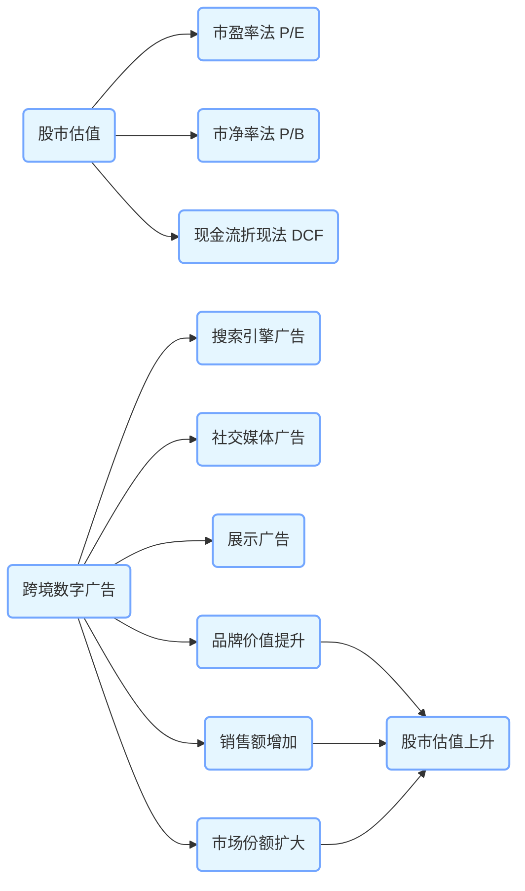

# 股市估值在跨境数字广告效果评估中的应用

> 关键词：股市估值、跨境数字广告、效果评估、金融指标、营销分析

> 摘要：本文深入探讨了股市估值在跨境数字广告效果评估中的应用。随着全球数字化营销的快速发展，跨境数字广告的规模不断扩大，如何准确评估其效果成为了企业关注的重点。股市估值作为金融领域的重要指标，蕴含着市场对企业价值的综合判断，将其引入跨境数字广告效果评估中，能够从更宏观和综合的角度衡量广告活动对企业的长期影响。文章首先介绍了相关背景知识，包括研究目的、预期读者等；接着阐述了股市估值和跨境数字广告的核心概念及其联系；详细讲解了涉及的核心算法原理和操作步骤，并结合数学模型进行分析；通过实际项目案例展示了如何运用这些方法进行评估；最后探讨了其实际应用场景、推荐了相关工具和资源，总结了未来发展趋势与挑战，并提供了常见问题解答和扩展阅读参考资料。

## 1. 背景介绍 
### 1.1 目的和范围
在当今全球化的商业环境中，跨境数字广告已经成为企业拓展国际市场的重要手段。然而，准确评估跨境数字广告的效果并非易事。传统的广告效果评估指标，如点击率、转化率等，往往只能反映广告的短期表现，无法全面衡量广告对企业整体价值的长期影响。股市估值作为反映企业市场价值的重要指标，能够综合考虑市场对企业未来盈利能力、增长潜力等多方面的预期。本研究的目的在于探讨如何将股市估值应用于跨境数字广告效果评估中，为企业提供更全面、准确的评估方法，帮助企业优化广告策略，提高广告投资回报率。

本研究的范围涵盖了各种类型的跨境数字广告平台和广告形式，包括搜索引擎广告、社交媒体广告、展示广告等。同时，研究对象包括不同行业、不同规模的跨境企业，旨在为广泛的企业提供具有普遍适用性的评估方法。

### 1.2 预期读者
本文的预期读者主要包括以下几类人群：
1. **跨境企业营销人员**：帮助他们更好地理解如何利用股市估值来评估跨境数字广告效果，从而优化广告策略，提高营销效果。
2. **金融分析师**：为他们提供从营销角度分析企业股市估值变化的新视角，有助于更全面地评估企业价值。
3. **学术研究人员**：为相关领域的学术研究提供参考，促进跨学科研究的发展。
4. **广告平台运营者**：了解如何结合股市估值指标来改进广告效果评估体系，提升平台服务质量。

### 1.3 文档结构概述
本文将按照以下结构进行阐述：
1. **核心概念与联系**：介绍股市估值和跨境数字广告的核心概念，以及它们之间的内在联系。
2. **核心算法原理 & 具体操作步骤**：详细讲解将股市估值应用于跨境数字广告效果评估的核心算法原理，并给出具体的操作步骤。
3. **数学模型和公式 & 详细讲解 & 举例说明**：运用数学模型和公式对评估方法进行深入分析，并通过具体例子进行说明。
4. **项目实战：代码实际案例和详细解释说明**：通过实际项目案例，展示如何使用Python代码实现评估过程，并对代码进行详细解读。
5. **实际应用场景**：探讨股市估值在跨境数字广告效果评估中的实际应用场景。
6. **工具和资源推荐**：推荐相关的学习资源、开发工具框架和论文著作。
7. **总结：未来发展趋势与挑战**：总结研究成果，分析未来发展趋势和面临的挑战。
8. **附录：常见问题与解答**：解答读者可能遇到的常见问题。
9. **扩展阅读 & 参考资料**：提供相关的扩展阅读材料和参考资料。

### 1.4 术语表
#### 1.4.1 核心术语定义
1. **股市估值**：指对上市公司的市场价值进行评估的过程和结果，常用的估值方法包括市盈率（P/E）、市净率（P/B）、现金流折现法（DCF）等。
2. **跨境数字广告**：指企业通过互联网平台，向其他国家或地区的目标受众投放的广告活动，包括搜索引擎广告、社交媒体广告、展示广告等多种形式。
3. **广告效果评估**：指对广告活动的效果进行测量、分析和评价的过程，旨在了解广告对企业目标的影响，如提高品牌知名度、增加销售额等。
4. **投资回报率（ROI）**：指投资所获得的收益与投资成本之间的比率，用于衡量投资的效益。

#### 1.4.2 相关概念解释
1. **市盈率（P/E）**：指股票价格与每股收益的比率，反映了市场对企业未来盈利能力的预期。
2. **市净率（P/B）**：指股票价格与每股净资产的比率，反映了市场对企业资产价值的评估。
3. **现金流折现法（DCF）**：指通过预测企业未来的现金流，并将其折现到当前时点，来评估企业的内在价值。

#### 1.4.3 缩略词列表
1. **P/E**：市盈率（Price-to-Earnings Ratio）
2. **P/B**：市净率（Price-to-Book Ratio）
3. **DCF**：现金流折现法（Discounted Cash Flow）
4. **ROI**：投资回报率（Return on Investment）

## 2. 核心概念与联系 
### 2.1 股市估值的核心概念
股市估值是金融领域中一个重要的概念，它是对上市公司市场价值的评估。股市估值的方法有很多种，常见的包括市盈率法、市净率法、现金流折现法等。

#### 2.1.1 市盈率法（P/E）
市盈率是指股票价格与每股收益的比率，计算公式为：
$$P/E = \frac{股价}{每股收益}$$
市盈率反映了市场对企业未来盈利能力的预期。一般来说，市盈率越高，说明市场对企业未来的盈利增长预期越高；反之，市盈率越低，说明市场对企业未来的盈利增长预期越低。

#### 2.1.2 市净率法（P/B）
市净率是指股票价格与每股净资产的比率，计算公式为：
$$P/B = \frac{股价}{每股净资产}$$
市净率反映了市场对企业资产价值的评估。一般来说，市净率越高，说明市场对企业的资产质量和未来发展前景越看好；反之，市净率越低，说明市场对企业的资产质量和未来发展前景越不看好。

#### 2.1.3 现金流折现法（DCF）
现金流折现法是一种基于企业未来现金流的估值方法。它的基本思想是将企业未来的现金流折现到当前时点，来评估企业的内在价值。具体步骤如下：
1. 预测企业未来的现金流。
2. 确定折现率。折现率反映了投资者对投资风险的要求，一般可以采用资本资产定价模型（CAPM）来确定。
3. 将未来的现金流按照折现率折现到当前时点。
4. 将折现后的现金流相加，得到企业的内在价值。

### 2.2 跨境数字广告的核心概念
跨境数字广告是指企业通过互联网平台，向其他国家或地区的目标受众投放的广告活动。跨境数字广告具有以下特点：
1. **全球化覆盖**：可以突破地域限制，将广告信息传递到全球范围内的目标受众。
2. **精准投放**：可以根据目标受众的特征和行为，进行精准的广告投放，提高广告效果。
3. **实时监测**：可以实时监测广告的投放效果，及时调整广告策略。

跨境数字广告的形式主要包括搜索引擎广告、社交媒体广告、展示广告等。

### 2.3 股市估值与跨境数字广告的联系
股市估值与跨境数字广告之间存在着密切的联系。跨境数字广告的目的是提高企业的品牌知名度、增加销售额和市场份额，从而提升企业的价值。而股市估值反映了市场对企业价值的综合判断，因此跨境数字广告的效果会直接或间接地影响股市估值。

具体来说，跨境数字广告对股市估值的影响主要体现在以下几个方面：
1. **品牌价值提升**：有效的跨境数字广告可以提高企业的品牌知名度和美誉度，从而提升企业的品牌价值。品牌价值的提升会反映在股市估值上，使企业的股价上涨。
2. **销售额增加**：跨境数字广告可以吸引更多的目标受众，增加企业的销售额。销售额的增加会提高企业的盈利能力，从而提升股市估值。
3. **市场份额扩大**：通过跨境数字广告，企业可以扩大在国际市场上的份额，提高市场竞争力。市场份额的扩大也会对股市估值产生积极影响。

### 2.4 核心概念原理和架构的文本示意图
```plaintext
股市估值
├── 市盈率法（P/E）
│   └── 反映市场对企业未来盈利能力的预期
├── 市净率法（P/B）
│   └── 反映市场对企业资产价值的评估
└── 现金流折现法（DCF）
    └── 基于企业未来现金流评估内在价值

跨境数字广告
├── 搜索引擎广告
├── 社交媒体广告
└── 展示广告

联系
├── 跨境数字广告 -> 品牌价值提升 -> 股市估值上升
├── 跨境数字广告 -> 销售额增加 -> 股市估值上升
└── 跨境数字广告 -> 市场份额扩大 -> 股市估值上升
```

### 2.5 Mermaid 流程图


## 3. 核心算法原理 & 具体操作步骤 
### 3.1 核心算法原理
将股市估值应用于跨境数字广告效果评估的核心算法原理是通过分析跨境数字广告投放前后企业股市估值的变化，来评估广告的效果。具体来说，可以采用以下步骤：
1. **确定评估指标**：选择合适的股市估值指标，如市盈率、市净率、现金流折现法等，作为评估跨境数字广告效果的依据。
2. **收集数据**：收集跨境数字广告投放前后企业的股市估值数据，以及相关的财务数据和市场数据。
3. **计算估值变化**：计算跨境数字广告投放前后企业股市估值的变化，如市盈率的变化、市净率的变化等。
4. **分析影响因素**：分析跨境数字广告投放对企业股市估值变化的影响因素，如品牌价值提升、销售额增加、市场份额扩大等。
5. **评估广告效果**：根据股市估值的变化和影响因素，评估跨境数字广告的效果，如广告是否提高了企业的品牌价值、增加了销售额等。

### 3.2 具体操作步骤
以下是将股市估值应用于跨境数字广告效果评估的具体操作步骤：

#### 3.2.1 步骤 1：确定评估指标
根据企业的特点和评估目的，选择合适的股市估值指标。一般来说，如果企业的盈利稳定，可以选择市盈率作为评估指标；如果企业的资产价值较高，可以选择市净率作为评估指标；如果企业的未来现金流较为明确，可以选择现金流折现法作为评估指标。

#### 3.2.2 步骤 2：收集数据
收集跨境数字广告投放前后企业的股市估值数据，以及相关的财务数据和市场数据。具体数据包括：
1. **股市估值数据**：如股价、每股收益、每股净资产等。
2. **财务数据**：如营业收入、净利润、资产负债表等。
3. **市场数据**：如行业平均市盈率、市净率等。

可以通过金融数据提供商、证券交易所网站等渠道收集数据。

#### 3.2.3 步骤 3：计算估值变化
根据收集到的数据，计算跨境数字广告投放前后企业股市估值的变化。以市盈率为例，计算公式为：
$$\Delta P/E = P/E_{post} - P/E_{pre}$$
其中，$\Delta P/E$ 表示市盈率的变化，$P/E_{post}$ 表示跨境数字广告投放后的市盈率，$P/E_{pre}$ 表示跨境数字广告投放前的市盈率。

#### 3.2.4 步骤 4：分析影响因素
分析跨境数字广告投放对企业股市估值变化的影响因素。可以采用以下方法：
1. **回归分析**：通过建立回归模型，分析跨境数字广告投放与企业股市估值变化之间的关系。
2. **案例分析**：通过分析具体的案例，了解跨境数字广告投放对企业股市估值变化的影响。

#### 3.2.5 步骤 5：评估广告效果
根据股市估值的变化和影响因素，评估跨境数字广告的效果。如果股市估值上升，且分析表明是由于跨境数字广告投放导致的品牌价值提升、销售额增加等因素引起的，则说明广告效果良好；反之，则说明广告效果不佳。

### 3.3 Python 源代码实现
以下是一个使用 Python 实现将股市估值应用于跨境数字广告效果评估的示例代码：

```python
import pandas as pd

# 步骤 1：确定评估指标（这里选择市盈率）
# 步骤 2：收集数据
# 假设已经收集到了跨境数字广告投放前后的股价和每股收益数据
pre_stock_price = 50
pre_eps = 2
post_stock_price = 60
post_eps = 2.5

# 步骤 3：计算估值变化
pre_pe = pre_stock_price / pre_eps
post_pe = post_stock_price / post_eps
delta_pe = post_pe - pre_pe

# 步骤 4：分析影响因素（这里简单假设影响因素为销售额增加）
# 假设已经收集到了跨境数字广告投放前后的销售额数据
pre_sales = 1000000
post_sales = 1200000
sales_increase = post_sales - pre_sales

# 步骤 5：评估广告效果
if delta_pe > 0 and sales_increase > 0:
    print("跨境数字广告效果良好，市盈率上升，销售额增加。")
else:
    print("跨境数字广告效果不佳。")

# 输出结果
print(f"跨境数字广告投放前的市盈率: {pre_pe}")
print(f"跨境数字广告投放后的市盈率: {post_pe}")
print(f"市盈率的变化: {delta_pe}")
print(f"销售额的增加: {sales_increase}")
```

### 3.4 代码解释
1. **步骤 1**：确定评估指标为市盈率。
2. **步骤 2**：收集跨境数字广告投放前后的股价和每股收益数据。
3. **步骤 3**：计算跨境数字广告投放前后的市盈率，并计算市盈率的变化。
4. **步骤 4**：分析影响因素，这里简单假设影响因素为销售额增加，收集跨境数字广告投放前后的销售额数据，并计算销售额的增加。
5. **步骤 5**：根据市盈率的变化和销售额的增加情况，评估跨境数字广告的效果。
6. **输出结果**：输出跨境数字广告投放前后的市盈率、市盈率的变化和销售额的增加情况。

## 4. 数学模型和公式 & 详细讲解 & 举例说明 
### 4.1 市盈率法数学模型和公式
#### 4.1.1 基本公式
市盈率（P/E）的计算公式为：
$$P/E = \frac{股价}{每股收益}$$
其中，股价是指股票的市场价格，每股收益是指企业每股普通股所获得的净利润。

#### 4.1.2 跨境数字广告效果评估公式
在跨境数字广告效果评估中，我们可以通过计算跨境数字广告投放前后市盈率的变化来评估广告效果。计算公式为：
$$\Delta P/E = P/E_{post} - P/E_{pre}$$
其中，$\Delta P/E$ 表示市盈率的变化，$P/E_{post}$ 表示跨境数字广告投放后的市盈率，$P/E_{pre}$ 表示跨境数字广告投放前的市盈率。

#### 4.1.3 举例说明
假设一家跨境企业在跨境数字广告投放前的股价为 50 元，每股收益为 2 元，则投放前的市盈率为：
$$P/E_{pre} = \frac{50}{2} = 25$$
在跨境数字广告投放后，股价上涨到 60 元，每股收益提高到 2.5 元，则投放后的市盈率为：
$$P/E_{post} = \frac{60}{2.5} = 24$$
市盈率的变化为：
$$\Delta P/E = 24 - 25 = -1$$
这表明跨境数字广告投放后，企业的市盈率有所下降。需要进一步分析下降的原因，可能是由于市场对企业未来盈利增长的预期降低，或者是其他因素导致的。

### 4.2 市净率法数学模型和公式
#### 4.2.1 基本公式
市净率（P/B）的计算公式为：
$$P/B = \frac{股价}{每股净资产}$$
其中，股价是指股票的市场价格，每股净资产是指企业每股普通股所拥有的净资产。

#### 4.2.2 跨境数字广告效果评估公式
在跨境数字广告效果评估中，我们可以通过计算跨境数字广告投放前后市净率的变化来评估广告效果。计算公式为：
$$\Delta P/B = P/B_{post} - P/B_{pre}$$
其中，$\Delta P/B$ 表示市净率的变化，$P/B_{post}$ 表示跨境数字广告投放后的市净率，$P/B_{pre}$ 表示跨境数字广告投放前的市净率。

#### 4.2.3 举例说明
假设一家跨境企业在跨境数字广告投放前的股价为 50 元，每股净资产为 10 元，则投放前的市净率为：
$$P/B_{pre} = \frac{50}{10} = 5$$
在跨境数字广告投放后，股价上涨到 60 元，每股净资产提高到 12 元，则投放后的市净率为：
$$P/B_{post} = \frac{60}{12} = 5$$
市净率的变化为：
$$\Delta P/B = 5 - 5 = 0$$
这表明跨境数字广告投放后，企业的市净率没有变化。需要进一步分析其他因素，如企业的盈利能力、市场竞争力等，来评估广告效果。

### 4.3 现金流折现法数学模型和公式
#### 4.3.1 基本公式
现金流折现法（DCF）的基本公式为：
$$V = \sum_{t=1}^{n} \frac{CF_t}{(1 + r)^t}$$
其中，$V$ 表示企业的内在价值，$CF_t$ 表示第 $t$ 期的现金流，$r$ 表示折现率，$n$ 表示预测期数。

#### 4.3.2 跨境数字广告效果评估公式
在跨境数字广告效果评估中，我们可以通过计算跨境数字广告投放前后企业内在价值的变化来评估广告效果。计算公式为：
$$\Delta V = V_{post} - V_{pre}$$
其中，$\Delta V$ 表示企业内在价值的变化，$V_{post}$ 表示跨境数字广告投放后的企业内在价值，$V_{pre}$ 表示跨境数字广告投放前的企业内在价值。

#### 4.3.3 举例说明
假设一家跨境企业在跨境数字广告投放前的预测现金流如下：
| 年份 | 现金流（万元） |
| ---- | -------------- |
| 1    | 100            |
| 2    | 120            |
| 3    | 150            |

折现率为 10%，则投放前的企业内在价值为：
$$V_{pre} = \frac{100}{(1 + 0.1)^1} + \frac{120}{(1 + 0.1)^2} + \frac{150}{(1 + 0.1)^3} \approx 303.98$$（万元）

在跨境数字广告投放后，预测现金流如下：
| 年份 | 现金流（万元） |
| ---- | -------------- |
| 1    | 120            |
| 2    | 150            |
| 3    | 180            |

则投放后的企业内在价值为：
$$V_{post} = \frac{120}{(1 + 0.1)^1} + \frac{150}{(1 + 0.1)^2} + \frac{180}{(1 + 0.1)^3} \approx 367.73$$（万元）

企业内在价值的变化为：
$$\Delta V = 367.73 - 303.98 = 63.75$$（万元）
这表明跨境数字广告投放后，企业的内在价值有所增加，说明广告效果良好。

## 5. 项目实战：代码实际案例和详细解释说明 
### 5.1 开发环境搭建
为了实现将股市估值应用于跨境数字广告效果评估的项目，我们需要搭建以下开发环境：
1. **Python 环境**：建议使用 Python 3.7 及以上版本。可以从 Python 官方网站（https://www.python.org/downloads/）下载并安装。
2. **开发工具**：可以使用 PyCharm、Jupyter Notebook 等开发工具。PyCharm 是一款专业的 Python 集成开发环境，功能强大；Jupyter Notebook 是一个交互式的开发环境，适合进行数据分析和代码演示。
3. **相关库**：需要安装 pandas、numpy 等库，用于数据处理和分析。可以使用以下命令进行安装：
```sh
pip install pandas numpy
```

### 5.2 源代码详细实现和代码解读
以下是一个完整的 Python 代码示例，用于将股市估值应用于跨境数字广告效果评估：

```python
import pandas as pd
import numpy as np

# 步骤 1：收集数据
# 假设已经收集到了跨境数字广告投放前后的股价、每股收益、每股净资产和销售额数据
data = {
    '阶段': ['投放前', '投放后'],
    '股价': [50, 60],
    '每股收益': [2, 2.5],
    '每股净资产': [10, 12],
    '销售额': [1000000, 1200000]
}
df = pd.DataFrame(data)

# 步骤 2：计算估值指标
df['市盈率'] = df['股价'] / df['每股收益']
df['市净率'] = df['股价'] / df['每股净资产']

# 步骤 3：计算估值变化
delta_pe = df.loc[1, '市盈率'] - df.loc[0, '市盈率']
delta_pb = df.loc[1, '市净率'] - df.loc[0, '市净率']
sales_increase = df.loc[1, '销售额'] - df.loc[0, '销售额']

# 步骤 4：评估广告效果
if delta_pe > 0 and delta_pb > 0 and sales_increase > 0:
    print("跨境数字广告效果良好，市盈率、市净率上升，销售额增加。")
elif delta_pe > 0 or delta_pb > 0 or sales_increase > 0:
    print("跨境数字广告有一定效果，但部分指标表现不佳。")
else:
    print("跨境数字广告效果不佳。")

# 输出结果
print(df)
print(f"市盈率的变化: {delta_pe}")
print(f"市净率的变化: {delta_pb}")
print(f"销售额的增加: {sales_increase}")
```

### 5.3 代码解读与分析
1. **步骤 1：收集数据**：使用 pandas 库创建一个 DataFrame 对象，存储跨境数字广告投放前后的股价、每股收益、每股净资产和销售额数据。
2. **步骤 2：计算估值指标**：根据市盈率和市净率的计算公式，计算跨境数字广告投放前后的市盈率和市净率，并将结果添加到 DataFrame 中。
3. **步骤 3：计算估值变化**：计算跨境数字广告投放前后市盈率、市净率的变化，以及销售额的增加。
4. **步骤 4：评估广告效果**：根据市盈率、市净率的变化和销售额的增加情况，评估跨境数字广告的效果。如果市盈率、市净率上升，且销售额增加，则说明广告效果良好；如果部分指标表现不佳，则说明广告有一定效果；如果所有指标都不佳，则说明广告效果不佳。
5. **输出结果**：输出 DataFrame、市盈率的变化、市净率的变化和销售额的增加情况。

## 6. 实际应用场景 
### 6.1 企业营销决策
企业在制定跨境数字广告策略时，可以使用股市估值来评估不同广告方案的效果。通过比较不同广告方案投放前后企业股市估值的变化，选择能够带来最大股市估值提升的广告方案。例如，一家跨境电商企业计划在两个不同的社交媒体平台上投放广告，可以分别计算在两个平台上投放广告前后企业的市盈率变化，选择市盈率提升较大的平台进行广告投放。

### 6.2 广告效果监测
在跨境数字广告投放过程中，企业可以实时监测股市估值的变化，及时评估广告效果。如果发现股市估值没有按照预期上升，或者出现下降的情况，企业可以及时调整广告策略，如更换广告内容、调整广告投放时间等。例如，一家跨境化妆品企业在投放广告一段时间后，发现股市估值没有明显变化，经过分析发现广告内容没有突出产品的特点，于是及时更换了广告内容，重新投放后股市估值有所上升。

### 6.3 投资者决策
投资者在进行跨境企业投资时，可以参考企业的股市估值和跨境数字广告效果评估结果。如果一家企业的跨境数字广告效果良好，股市估值呈现上升趋势，说明该企业具有较好的发展前景，投资者可以考虑增加对该企业的投资。例如，一位投资者在研究一家跨境科技企业时，发现该企业通过有效的跨境数字广告提升了品牌知名度和销售额，股市估值也随之上升，于是决定买入该企业的股票。

### 6.4 行业竞争分析
通过比较不同企业在跨境数字广告效果评估方面的表现，可以分析行业内的竞争态势。如果一家企业的跨境数字广告效果明显优于竞争对手，说明该企业在市场竞争中具有优势。例如，在跨境服装行业中，一家企业通过创新的跨境数字广告策略，提高了品牌的国际知名度和市场份额，股市估值也高于同行业其他企业，这表明该企业在行业竞争中处于领先地位。

## 7. 工具和资源推荐
### 7.1 学习资源推荐
#### 7.1.1 书籍推荐
1. 《金融市场与金融机构》：这本书系统介绍了金融市场和金融机构的基本概念、运作机制和分析方法，对于理解股市估值有很大帮助。
2. 《数字营销：从策略到执行》：详细讲解了数字营销的策略制定、渠道选择和效果评估等方面的内容，对跨境数字广告的学习很有价值。
3. 《财务报表分析》：帮助读者掌握财务报表的分析方法，能够从财务数据中挖掘出有价值的信息，为股市估值和广告效果评估提供支持。

#### 7.1.2 在线课程
1. Coursera 上的“Financial Markets”课程：由耶鲁大学教授罗伯特·席勒（Robert Shiller）授课，深入讲解了金融市场的理论和实践。
2. edX 上的“Digital Marketing Analytics”课程：介绍了数字营销分析的方法和工具，对于跨境数字广告效果评估有很好的指导作用。
3. Udemy 上的“Stock Valuation and Analysis”课程：专门讲解股票估值的方法和技巧，适合初学者学习。

#### 7.1.3 技术博客和网站
1. Seeking Alpha：提供专业的金融分析和投资建议，有很多关于股市估值和企业分析的文章。
2. Marketing Land：专注于数字营销领域的新闻和分析，能够及时了解跨境数字广告的最新动态。
3. Investopedia：一个权威的金融教育网站，提供各种金融术语的解释和投资知识的学习资源。

### 7.2 开发工具框架推荐
#### 7.2.1 IDE和编辑器
1. PyCharm：一款功能强大的 Python 集成开发环境，具有代码编辑、调试、版本控制等功能，适合开发复杂的 Python 项目。
2. Jupyter Notebook：一个交互式的开发环境，支持代码、文本、图表等多种形式的展示，适合进行数据分析和代码演示。
3. Visual Studio Code：一款轻量级的代码编辑器，支持多种编程语言，具有丰富的插件扩展功能，可用于 Python 开发。

#### 7.2.2 调试和性能分析工具
1. pdb：Python 自带的调试器，可以帮助开发者定位代码中的错误。
2. cProfile：Python 标准库中的性能分析工具，用于分析代码的运行时间和性能瓶颈。
3. Py-Spy：一个轻量级的 Python 性能分析工具，可以实时监控 Python 程序的性能。

#### 7.2.3 相关框架和库
1. pandas：一个强大的数据处理和分析库，提供了 DataFrame 等数据结构，方便进行数据清洗、转换和分析。
2. numpy：Python 的数值计算库，提供了高效的数组和矩阵运算功能，是很多数据分析和机器学习库的基础。
3. matplotlib：一个用于数据可视化的库，可以绘制各种类型的图表，如折线图、柱状图、散点图等。

### 7.3 相关论文著作推荐
#### 7.3.1 经典论文
1. “The Capital Asset Pricing Model: Theory and Evidence”：该论文介绍了资本资产定价模型（CAPM）的理论和实证研究，对于理解股市估值中的折现率确定有重要意义。
2. “Advertising and Brand Equity: A Conceptual Framework and Empirical Evidence”：探讨了广告与品牌资产之间的关系，为将股市估值应用于跨境数字广告效果评估提供了理论支持。
3. “The Impact of Digital Advertising on Firm Value: Evidence from the U.S. Stock Market”：通过实证研究分析了数字广告对企业股市价值的影响，具有较高的参考价值。

#### 7.3.2 最新研究成果
可以关注金融和营销领域的顶级学术期刊，如《Journal of Financial Economics》、《Journal of Marketing》等，了解关于股市估值和跨境数字广告效果评估的最新研究成果。

#### 7.3.3 应用案例分析
一些咨询公司和研究机构会发布关于跨境数字广告效果评估的应用案例分析报告，可以从中学习实际应用中的经验和方法。例如，麦肯锡公司、波士顿咨询集团等发布的相关报告。

## 8. 总结：未来发展趋势与挑战
### 8.1 未来发展趋势
#### 8.1.1 数据融合与智能化评估
随着大数据、人工智能等技术的发展，未来股市估值和跨境数字广告效果评估将更加注重数据的融合和智能化分析。通过整合金融数据、营销数据、消费者行为数据等多源数据，利用机器学习和深度学习算法构建更准确的评估模型，实现对广告效果的实时、精准评估。

#### 8.1.2 跨学科研究与应用
股市估值和跨境数字广告效果评估涉及金融、营销、计算机科学等多个学科领域。未来，跨学科研究将不断深入，不同学科的理论和方法将相互融合，为评估提供更全面、深入的视角。例如，结合金融工程的方法设计更合理的评估指标，运用营销心理学的理论分析广告对消费者心理和行为的影响。

#### 8.1.3 全球化与本地化结合
在全球化的背景下，跨境数字广告的规模将不断扩大。未来的评估方法将更加注重全球化与本地化的结合，既要考虑不同国家和地区的市场差异、文化差异，又要从全球市场的角度综合评估广告效果。例如，针对不同国家的消费者特点制定个性化的广告策略，并通过统一的评估框架进行效果评估。

### 8.2 挑战
#### 8.2.1 数据质量和隐私问题
准确的评估依赖于高质量的数据。然而，在实际应用中，数据质量可能受到多种因素的影响，如数据缺失、数据错误、数据不一致等。此外，随着数据隐私法规的日益严格，如何在保护用户隐私的前提下收集和使用数据也是一个挑战。

#### 8.2.2 市场不确定性
股市估值受到市场多种因素的影响，如宏观经济环境、政策变化、行业竞争等，具有较高的不确定性。跨境数字广告效果也受到目标市场的政治、经济、文化等因素的影响。如何在不确定性的环境中准确评估广告效果是一个难题。

#### 8.2.3 模型的复杂性和可解释性
为了提高评估的准确性，可能会构建复杂的评估模型。然而，复杂的模型往往难以理解和解释，这给企业的决策和应用带来了困难。如何在保证模型准确性的同时，提高模型的可解释性是未来需要解决的问题。

## 9. 附录：常见问题与解答
### 9.1 股市估值指标选择的依据是什么？
选择股市估值指标的依据主要包括企业的特点和评估目的。如果企业的盈利稳定，可以选择市盈率作为评估指标；如果企业的资产价值较高，可以选择市净率作为评估指标；如果企业的未来现金流较为明确，可以选择现金流折现法作为评估指标。

### 9.2 如何收集跨境数字广告投放前后的股市估值数据和相关财务数据？
可以通过金融数据提供商、证券交易所网站等渠道收集股市估值数据和相关财务数据。常见的金融数据提供商有 Bloomberg、Wind 等，证券交易所网站如上海证券交易所、深圳证券交易所、纽约证券交易所等。

### 9.3 股市估值的变化一定是由跨境数字广告投放引起的吗？
不一定。股市估值受到多种因素的影响，如宏观经济环境、政策变化、行业竞争等。跨境数字广告投放只是其中一个可能的影响因素。在评估广告效果时，需要综合考虑其他因素的影响，通过合理的分析方法来确定广告投放对股市估值变化的贡献。

### 9.4 如何提高跨境数字广告效果评估的准确性？
可以从以下几个方面提高评估的准确性：
1. 收集高质量的数据，确保数据的准确性和完整性。
2. 选择合适的评估指标和方法，根据企业的特点和评估目的进行合理选择。
3. 综合考虑多种因素的影响，不仅要考虑股市估值的变化，还要分析广告对品牌价值、销售额、市场份额等方面的影响。
4. 运用先进的数据分析技术，如机器学习、深度学习等，构建更准确的评估模型。

## 10. 扩展阅读 & 参考资料
### 10.1 扩展阅读
1. 《营销管理》：菲利普·科特勒（Philip Kotler）的经典著作，系统介绍了营销管理的理论和方法，对于理解跨境数字广告的营销策略有很大帮助。
2. 《聪明的投资者》：本杰明·格雷厄姆（Benjamin Graham）的投资经典，讲解了价值投资的理念和方法，有助于深入理解股市估值的原理。
3. 《大数据时代》：维克托·迈尔 - 舍恩伯格（Viktor Mayer - Schönberger）的著作，介绍了大数据的概念、特点和应用，对于了解数据在跨境数字广告效果评估中的作用有启示意义。

### 10.2 参考资料
1. 相关金融和营销学术期刊的论文，如《Journal of Financial Economics》、《Journal of Marketing》等。
2. 金融数据提供商的报告和研究成果，如 Bloomberg、Wind 等发布的市场分析报告。
3. 咨询公司和研究机构的研究报告，如麦肯锡公司、波士顿咨询集团等发布的关于跨境数字营销和企业估值的报告。

作者：AI天才研究院/AI Genius Institute & 禅与计算机程序设计艺术 /Zen And The Art of Computer Programming