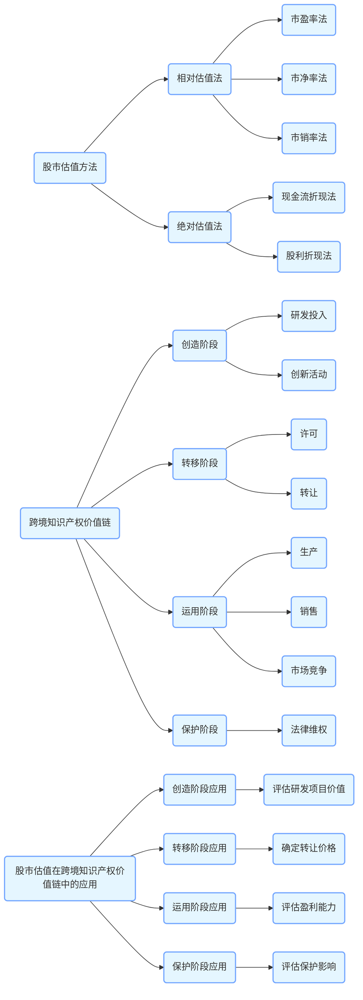

# 股市估值在跨境知识产权价值链分析中的应用

> 关键词：股市估值、跨境知识产权、价值链分析、金融与知识产权融合、估值模型应用

> 摘要：本文深入探讨了股市估值在跨境知识产权价值链分析中的应用。首先介绍了相关背景，包括研究目的、预期读者、文档结构和术语表。接着阐述了核心概念及其联系，构建了相应的原理和架构示意图与流程图。详细讲解了核心算法原理及操作步骤，结合 Python 代码进行说明。通过数学模型和公式对相关理论进行了深入剖析，并举例说明。以实际项目为例，展示了代码实现和解读过程。分析了股市估值在跨境知识产权价值链分析中的实际应用场景，推荐了学习资源、开发工具框架和相关论文著作。最后总结了未来发展趋势与挑战，解答了常见问题，并提供了扩展阅读和参考资料，旨在为金融与知识产权领域的研究和实践提供有价值的参考。

## 1. 背景介绍 
### 1.1 目的和范围
在全球化的背景下，跨境知识产权交易日益频繁，知识产权价值链的复杂性也不断增加。股市估值作为金融领域的重要工具，其在跨境知识产权价值链分析中的应用具有重要的理论和实践意义。本研究的目的在于深入探讨股市估值方法如何应用于跨境知识产权价值链的评估、分析和决策过程，以提高跨境知识产权交易的效率和准确性，为企业和投资者提供更科学的决策依据。

研究范围涵盖了常见的股市估值方法，如市盈率法、市净率法、现金流折现法等，以及这些方法在跨境知识产权的创造、转移、运用和保护等各个环节的应用。同时，还将考虑不同国家和地区的法律、政策、文化等因素对跨境知识产权价值链分析的影响。

### 1.2 预期读者
本文的预期读者包括金融领域的专业人士，如投资银行家、基金经理、分析师等，他们可以通过了解股市估值在跨境知识产权价值链分析中的应用，拓展投资视野，发现新的投资机会。知识产权领域的从业者，如专利代理人、商标律师、知识产权咨询师等，能够借助股市估值方法更好地评估知识产权的价值，为客户提供更全面的服务。此外，企业的管理人员和战略规划者也可以从本文中获得启示，优化企业的知识产权战略，提升企业的核心竞争力。

### 1.3 文档结构概述
本文将按照以下结构展开：首先介绍核心概念与联系，通过文本示意图和 Mermaid 流程图清晰展示股市估值和跨境知识产权价值链的关系。接着详细阐述核心算法原理和具体操作步骤，并使用 Python 代码进行实现。然后通过数学模型和公式对相关理论进行深入分析，并举例说明。在项目实战部分，提供实际的代码案例并进行详细解读。之后分析股市估值在跨境知识产权价值链分析中的实际应用场景。推荐相关的学习资源、开发工具框架和论文著作。最后总结未来发展趋势与挑战，解答常见问题，并提供扩展阅读和参考资料。

### 1.4 术语表
#### 1.4.1 核心术语定义
- **股市估值**：指对股票的内在价值进行评估的过程，通过各种方法和模型计算出股票的合理价格，为投资决策提供参考。
- **跨境知识产权**：指跨越国界的知识产权，包括专利、商标、著作权等，涉及不同国家和地区的法律、政策和文化背景。
- **价值链分析**：一种分析企业活动和价值创造过程的方法，通过识别企业的主要活动和支持活动，确定各个环节的价值贡献，以优化企业的运营和战略。
- **知识产权价值链**：从知识产权的创造、转移、运用到保护的整个过程，涉及多个主体和环节，每个环节都对知识产权的价值产生影响。

#### 1.4.2 相关概念解释
- **市盈率（P/E）**：指股票价格与每股收益的比率，反映了市场对公司未来盈利的预期。市盈率越高，说明市场对公司的前景越看好，但也可能意味着股票被高估。
- **市净率（P/B）**：指股票价格与每股净资产的比率，反映了股票的市场价格相对于公司净资产的倍数。市净率越低，说明股票的估值越低，但也可能意味着公司的盈利能力较弱。
- **现金流折现法（DCF）**：一种基于未来现金流预测的估值方法，通过将未来的现金流折现到当前时刻，计算出企业的内在价值。现金流折现法考虑了货币的时间价值和风险因素，是一种较为科学的估值方法。

#### 1.4.3 缩略词列表
- **P/E**：市盈率（Price-to-Earnings Ratio）
- **P/B**：市净率（Price-to-Book Ratio）
- **DCF**：现金流折现法（Discounted Cash Flow）

## 2. 核心概念与联系 
### 核心概念原理
股市估值是基于对企业未来盈利和现金流的预期，通过一定的方法和模型计算出股票的内在价值。常见的股市估值方法包括相对估值法和绝对估值法。相对估值法通过比较同行业或类似企业的估值指标，如市盈率、市净率等，来评估目标企业的价值。绝对估值法通过预测企业未来的现金流，并将其折现到当前时刻，计算出企业的内在价值。

跨境知识产权价值链是指从知识产权的创造、转移、运用到保护的整个过程，涉及多个主体和环节。在跨境知识产权的创造阶段，企业通过研发投入和创新活动，产生新的知识产权。在转移阶段，企业可以通过许可、转让等方式将知识产权转移给其他企业。在运用阶段，企业可以利用知识产权进行生产、销售和市场竞争。在保护阶段，企业需要通过法律手段维护知识产权的权益。

### 架构的文本示意图
```plaintext
股市估值与跨境知识产权价值链的关系

股市估值方法
|-- 相对估值法
|   |-- 市盈率法
|   |-- 市净率法
|   |-- 市销率法
|-- 绝对估值法
|   |-- 现金流折现法
|   |-- 股利折现法

跨境知识产权价值链
|-- 创造阶段
|   |-- 研发投入
|   |-- 创新活动
|-- 转移阶段
|   |-- 许可
|   |-- 转让
|-- 运用阶段
|   |-- 生产
|   |-- 销售
|   |-- 市场竞争
|-- 保护阶段
|   |-- 法律维权

股市估值在跨境知识产权价值链中的应用
|-- 创造阶段
|   |-- 评估研发项目的价值
|-- 转移阶段
|   |-- 确定知识产权的转让价格
|-- 运用阶段
|   |-- 评估企业利用知识产权的盈利能力
|-- 保护阶段
|   |-- 评估知识产权保护对企业价值的影响
```

### Mermaid 流程图


从上述示意图和流程图可以看出，股市估值方法和跨境知识产权价值链之间存在着密切的联系。股市估值方法可以应用于跨境知识产权价值链的各个环节，为知识产权的评估、交易和决策提供支持。

## 3. 核心算法原理 & 具体操作步骤 
### 市盈率法（P/E 法）
#### 算法原理
市盈率法是一种相对估值法，通过比较目标企业的市盈率与同行业或类似企业的市盈率，来评估目标企业的价值。市盈率的计算公式为：

$$P/E = \frac{股票价格}{每股收益}$$

其中，股票价格是指当前股票的市场价格，每股收益是指企业每股普通股的盈利。通过已知的每股收益和可比企业的市盈率，可以计算出目标企业的股票价格：

$$股票价格 = 每股收益 \times 市盈率$$

#### Python 代码实现
```python
def pe_valuation(eps, pe_ratio):
    """
    市盈率法估值函数
    :param eps: 每股收益
    :param pe_ratio: 市盈率
    :return: 股票价格
    """
    return eps * pe_ratio

# 示例
eps = 2.0  # 每股收益为 2 元
pe_ratio = 15  # 可比企业的市盈率为 15
stock_price = pe_valuation(eps, pe_ratio)
print(f"根据市盈率法计算的股票价格为: {stock_price} 元")
```

#### 具体操作步骤
1. 确定目标企业的每股收益（EPS），可以通过企业的财务报表获得。
2. 选择可比企业或行业平均市盈率作为参考。可比企业应与目标企业在业务、规模、成长阶段等方面具有相似性。
3. 将每股收益乘以可比企业的市盈率，得到目标企业的股票价格。

### 市净率法（P/B 法）
#### 算法原理
市净率法也是一种相对估值法，通过比较目标企业的市净率与同行业或类似企业的市净率，来评估目标企业的价值。市净率的计算公式为：

$$P/B = \frac{股票价格}{每股净资产}$$

其中，股票价格是指当前股票的市场价格，每股净资产是指企业每股普通股的净资产。通过已知的每股净资产和可比企业的市净率，可以计算出目标企业的股票价格：

$$股票价格 = 每股净资产 \times 市净率$$

#### Python 代码实现
```python
def pb_valuation(bvps, pb_ratio):
    """
    市净率法估值函数
    :param bvps: 每股净资产
    :param pb_ratio: 市净率
    :return: 股票价格
    """
    return bvps * pb_ratio

# 示例
bvps = 10.0  # 每股净资产为 10 元
pb_ratio = 1.5  # 可比企业的市净率为 1.5
stock_price = pb_valuation(bvps, pb_ratio)
print(f"根据市净率法计算的股票价格为: {stock_price} 元")
```

#### 具体操作步骤
1. 确定目标企业的每股净资产（BVPS），可以通过企业的财务报表获得。
2. 选择可比企业或行业平均市净率作为参考。可比企业应与目标企业在业务、规模、资产质量等方面具有相似性。
3. 将每股净资产乘以可比企业的市净率，得到目标企业的股票价格。

### 现金流折现法（DCF 法）
#### 算法原理
现金流折现法是一种绝对估值法，通过预测企业未来的现金流，并将其折现到当前时刻，计算出企业的内在价值。现金流折现法的基本公式为：

$$V = \sum_{t=1}^{n} \frac{FCF_t}{(1 + r)^t} + \frac{TV}{(1 + r)^n}$$

其中，$V$ 是企业的内在价值，$FCF_t$ 是第 $t$ 年的自由现金流，$r$ 是折现率，$n$ 是预测期数，$TV$ 是终值。

自由现金流（FCF）的计算公式为：

$$FCF = EBIT \times (1 - T) + Depreciation - Capex - \Delta NWC$$

其中，$EBIT$ 是息税前利润，$T$ 是税率，$Depreciation$ 是折旧，$Capex$ 是资本支出，$\Delta NWC$ 是净营运资本的变化。

终值（TV）的计算公式通常采用永续增长模型：

$$TV = \frac{FCF_{n+1}}{r - g}$$

其中，$FCF_{n+1}$ 是预测期最后一年的下一年的自由现金流，$g$ 是永续增长率。

#### Python 代码实现
```python
def dcf_valuation(fcf_list, r, g):
    """
    现金流折现法估值函数
    :param fcf_list: 未来各年的自由现金流列表
    :param r: 折现率
    :param g: 永续增长率
    :return: 企业的内在价值
    """
    n = len(fcf_list)
    present_value = 0
    # 计算预测期内现金流的现值
    for t in range(n):
        present_value += fcf_list[t] / ((1 + r) ** (t + 1))
    # 计算终值
    fcf_n_plus_1 = fcf_list[-1] * (1 + g)
    tv = fcf_n_plus_1 / (r - g)
    # 计算终值的现值
    tv_present_value = tv / ((1 + r) ** n)
    # 计算企业的内在价值
    value = present_value + tv_present_value
    return value

# 示例
fcf_list = [100, 120, 140, 160, 180]  # 未来 5 年的自由现金流
r = 0.1  # 折现率为 10%
g = 0.03  # 永续增长率为 3%
enterprise_value = dcf_valuation(fcf_list, r, g)
print(f"根据现金流折现法计算的企业内在价值为: {enterprise_value} 元")
```

#### 具体操作步骤
1. 预测企业未来的自由现金流（FCF），通常需要对企业的收入、成本、折旧、资本支出等进行详细的预测。
2. 确定折现率（r），折现率反映了投资者对企业未来现金流的风险预期，通常可以采用加权平均资本成本（WACC）作为折现率。
3. 确定永续增长率（g），永续增长率是指企业在预测期结束后长期保持的增长率，通常取值在 2% - 5% 之间。
4. 计算预测期内现金流的现值和终值的现值，将两者相加得到企业的内在价值。

## 4. 数学模型和公式 & 详细讲解 & 举例说明 
### 市盈率法（P/E 法）
#### 数学公式
$$P/E = \frac{P}{EPS}$$

其中，$P$ 是股票价格，$EPS$ 是每股收益。

变形可得：

$$P = P/E \times EPS$$

#### 详细讲解
市盈率法的核心思想是通过比较目标企业和可比企业的盈利倍数来评估目标企业的价值。市盈率反映了市场对企业未来盈利的预期，市盈率越高，说明市场对企业的前景越看好。但是，市盈率法也存在一定的局限性，例如不同行业的市盈率水平可能差异较大，而且市盈率容易受到市场情绪的影响。

#### 举例说明
假设一家科技公司 A 的每股收益为 2 元，同行业可比公司的平均市盈率为 20 倍。则根据市盈率法，公司 A 的股票价格为：

$$P = 20 \times 2 = 40$$（元）

这意味着，如果市场对公司 A 的预期与同行业可比公司相似，那么公司 A 的股票价格应该为 40 元。

### 市净率法（P/B 法）
#### 数学公式
$$P/B = \frac{P}{BVPS}$$

其中，$P$ 是股票价格，$BVPS$ 是每股净资产。

变形可得：

$$P = P/B \times BVPS$$

#### 详细讲解
市净率法的核心思想是通过比较目标企业和可比企业的净资产倍数来评估目标企业的价值。市净率反映了股票的市场价格相对于公司净资产的倍数，市净率越低，说明股票的估值越低。市净率法适用于资产规模较大、净资产相对稳定的企业，如银行、钢铁等行业。

#### 举例说明
假设一家银行 B 的每股净资产为 15 元，同行业可比银行的平均市净率为 1.2 倍。则根据市净率法，银行 B 的股票价格为：

$$P = 1.2 \times 15 = 18$$（元）

这意味着，如果市场对银行 B 的预期与同行业可比银行相似，那么银行 B 的股票价格应该为 18 元。

### 现金流折现法（DCF 法）
#### 数学公式
$$V = \sum_{t=1}^{n} \frac{FCF_t}{(1 + r)^t} + \frac{TV}{(1 + r)^n}$$

其中，$V$ 是企业的内在价值，$FCF_t$ 是第 $t$ 年的自由现金流，$r$ 是折现率，$n$ 是预测期数，$TV$ 是终值。

自由现金流（FCF）的计算公式为：

$$FCF = EBIT \times (1 - T) + Depreciation - Capex - \Delta NWC$$

终值（TV）的计算公式通常采用永续增长模型：

$$TV = \frac{FCF_{n+1}}{r - g}$$

#### 详细讲解
现金流折现法的核心思想是将企业未来的现金流折现到当前时刻，以反映货币的时间价值和风险因素。该方法考虑了企业的长期盈利能力和现金流状况，是一种较为科学的估值方法。但是，现金流折现法的计算过程较为复杂，需要对企业的未来现金流、折现率和永续增长率进行准确的预测。

#### 举例说明
假设一家企业 C 未来 5 年的自由现金流分别为 100 万元、120 万元、140 万元、160 万元和 180 万元，折现率为 10%，永续增长率为 3%。

首先，计算预测期内现金流的现值：

$$PV_1 = \frac{100}{(1 + 0.1)^1} = 90.91$$（万元）

$$PV_2 = \frac{120}{(1 + 0.1)^2} = 99.17$$（万元）

$$PV_3 = \frac{140}{(1 + 0.1)^3} = 105.18$$（万元）

$$PV_4 = \frac{160}{(1 + 0.1)^4} = 109.28$$（万元）

$$PV_5 = \frac{180}{(1 + 0.1)^5} = 111.72$$（万元）

预测期内现金流的现值总和为：

$$PV_{total} = 90.91 + 99.17 + 105.18 + 109.28 + 111.72 = 516.26$$（万元）

然后，计算终值：

$$FCF_6 = 180 \times (1 + 0.03) = 185.4$$（万元）

$$TV = \frac{185.4}{0.1 - 0.03} = 2648.57$$（万元）

终值的现值为：

$$PV_{TV} = \frac{2648.57}{(1 + 0.1)^5} = 1647.74$$（万元）

最后，计算企业的内在价值：

$$V = 516.26 + 1647.74 = 2164$$（万元）

这意味着，根据现金流折现法，企业 C 的内在价值为 2164 万元。

## 5. 项目实战：代码实际案例和详细解释说明 
### 5.1  开发环境搭建
#### 操作系统
可以选择 Windows、Linux 或 macOS 操作系统，本项目在 Windows 10 操作系统上进行开发和测试。

#### Python 版本
建议使用 Python 3.7 及以上版本，本项目使用 Python 3.9 进行开发。

#### 开发工具
可以使用 PyCharm、Jupyter Notebook 等开发工具，本项目使用 PyCharm 作为开发工具。

#### 安装必要的库
在命令行中执行以下命令安装必要的库：

```sh
pip install pandas numpy matplotlib
```

### 5.2  源代码详细实现和代码解读
```python
import pandas as pd
import numpy as np
import matplotlib.pyplot as plt

# 模拟一家企业的财务数据
data = {
    'Year': [2020, 2021, 2022, 2023, 2024],
    'EPS': [1.0, 1.2, 1.4, 1.6, 1.8],  # 每股收益
    'BVPS': [10.0, 11.0, 12.0, 13.0, 14.0],  # 每股净资产
    'FCF': [100, 120, 140, 160, 180]  # 自由现金流
}

df = pd.DataFrame(data)

# 市盈率法估值
pe_ratio = 15  # 假设可比企业的市盈率为 15
df['PE_Valuation'] = df['EPS'] * pe_ratio

# 市净率法估值
pb_ratio = 1.2  # 假设可比企业的市净率为 1.2
df['PB_Valuation'] = df['BVPS'] * pb_ratio

# 现金流折现法估值
r = 0.1  # 折现率为 10%
g = 0.03  # 永续增长率为 3%
fcf_list = df['FCF'].tolist()
enterprise_value = 0
n = len(fcf_list)
# 计算预测期内现金流的现值
for t in range(n):
    enterprise_value += fcf_list[t] / ((1 + r) ** (t + 1))
# 计算终值
fcf_n_plus_1 = fcf_list[-1] * (1 + g)
tv = fcf_n_plus_1 / (r - g)
# 计算终值的现值
tv_present_value = tv / ((1 + r) ** n)
# 计算企业的内在价值
enterprise_value += tv_present_value
# 假设企业发行了 100 万股股票，计算每股价值
shares_outstanding = 100
df['DCF_Valuation'] = enterprise_value / shares_outstanding

print(df)

# 可视化估值结果
plt.figure(figsize=(10, 6))
plt.plot(df['Year'], df['PE_Valuation'], label='PE Valuation')
plt.plot(df['Year'], df['PB_Valuation'], label='PB Valuation')
plt.plot(df['Year'], df['DCF_Valuation'], label='DCF Valuation')
plt.xlabel('Year')
plt.ylabel('Stock Price')
plt.title('Stock Valuation Comparison')
plt.legend()
plt.grid(True)
plt.show()
```

### 5.3  代码解读与分析
#### 数据模拟
首先，使用 `pandas` 库创建一个包含企业财务数据的 DataFrame，包括年份、每股收益（EPS）、每股净资产（BVPS）和自由现金流（FCF）。

#### 市盈率法估值
假设可比企业的市盈率为 15，通过将每股收益乘以市盈率，计算出每年的市盈率估值，并将结果添加到 DataFrame 中。

#### 市净率法估值
假设可比企业的市净率为 1.2，通过将每股净资产乘以市净率，计算出每年的市净率估值，并将结果添加到 DataFrame 中。

#### 现金流折现法估值
假设折现率为 10%，永续增长率为 3%，通过预测期内现金流的现值和终值的现值，计算出企业的内在价值。假设企业发行了 100 万股股票，将企业的内在价值除以股票数量，得到每股价值，并将结果添加到 DataFrame 中。

#### 可视化结果
使用 `matplotlib` 库将三种估值方法的结果进行可视化，方便比较和分析。

通过这个项目实战，我们可以看到如何使用 Python 代码实现股市估值方法，并将其应用于企业的财务数据，为企业的估值提供参考。

## 6. 实际应用场景 
### 跨境知识产权转让定价
在跨境知识产权转让过程中，准确评估知识产权的价值是确定转让价格的关键。股市估值方法可以为知识产权的转让定价提供参考。例如，通过市盈率法或市净率法，可以比较拥有类似知识产权的企业的估值，从而确定目标知识产权的合理价格。现金流折现法可以考虑知识产权未来的收益和成本，更准确地评估其内在价值。

### 跨境知识产权投资决策
对于投资者来说，在进行跨境知识产权投资时，需要评估投资项目的潜在价值和风险。股市估值方法可以帮助投资者分析知识产权投资项目的预期收益和回报。例如，通过现金流折现法，可以预测知识产权在未来的现金流，并将其折现到当前时刻，计算出投资项目的净现值（NPV）。如果净现值为正，说明投资项目具有投资价值；如果净现值为负，则说明投资项目可能不值得投资。

### 跨境知识产权许可谈判
在跨境知识产权许可谈判中，许可方和被许可方需要就许可费用达成一致。股市估值方法可以为许可费用的确定提供依据。例如，通过市盈率法或市净率法，可以评估被许可方利用知识产权所能获得的额外收益，从而确定合理的许可费用。现金流折现法可以考虑知识产权在许可期限内的现金流，更准确地评估许可费用的合理性。

### 企业跨境知识产权战略规划
企业在制定跨境知识产权战略时，需要评估知识产权对企业价值的贡献。股市估值方法可以帮助企业分析不同知识产权战略的潜在收益和风险。例如，通过现金流折现法，可以预测企业在不同知识产权战略下的未来现金流，并计算出企业的内在价值。企业可以根据估值结果选择最优的知识产权战略，以提升企业的核心竞争力。

## 7. 工具和资源推荐
### 7.1 学习资源推荐
#### 7.1.1 书籍推荐
- 《估值：难点、解决方案及相关案例》（Valuation: Measuring and Managing the Value of Companies）：本书是估值领域的经典著作，详细介绍了各种估值方法和技巧，并通过大量的案例进行说明。
- 《投资中最简单的事》：作者从投资实践的角度出发，阐述了投资的基本原理和方法，对股市估值有深入的讲解。
- 《知识产权价值评估》：本书专门介绍了知识产权价值评估的理论和方法，包括股市估值方法在知识产权评估中的应用。

#### 7.1.2 在线课程
- Coursera 上的“Financial Markets”课程：由耶鲁大学教授罗伯特·席勒（Robert Shiller）主讲，课程涵盖了金融市场的基本原理和估值方法。
- edX 上的“Valuation for Mergers, Buyouts and Restructuring”课程：该课程详细介绍了企业估值的方法和应用，包括现金流折现法、相对估值法等。
- 中国大学 MOOC 上的“知识产权评估”课程：该课程介绍了知识产权评估的基本理论和方法，适合对知识产权估值感兴趣的学习者。

#### 7.1.3 技术博客和网站
- Seeking Alpha：一个专业的金融投资博客平台，提供了大量的股票分析和估值报告。
- Bloomberg：全球知名的金融信息服务提供商，提供了丰富的金融数据和市场分析。
- IPWatchdog：专注于知识产权领域的新闻和分析，提供了有关知识产权估值和交易的最新动态。

### 7.2 开发工具框架推荐
#### 7.2.1 IDE和编辑器
- PyCharm：一款专业的 Python 集成开发环境，提供了丰富的代码编辑、调试和分析功能。
- Jupyter Notebook：一个交互式的编程环境，适合进行数据分析和可视化，方便代码的展示和分享。
- Visual Studio Code：一款轻量级的代码编辑器，支持多种编程语言，具有丰富的插件扩展功能。

#### 7.2.2 调试和性能分析工具
- pdb：Python 自带的调试工具，可以帮助开发者定位代码中的错误。
- cProfile：Python 标准库中的性能分析工具，可以分析代码的运行时间和函数调用情况。
- Py-Spy：一个轻量级的 Python 性能分析工具，可以实时监控 Python 程序的性能。

#### 7.2.3 相关框架和库
- pandas：一个强大的数据分析库，提供了高效的数据结构和数据处理功能，适合处理和分析财务数据。
- numpy：一个用于科学计算的 Python 库，提供了高效的数组操作和数学函数，在估值计算中经常使用。
- matplotlib：一个用于数据可视化的 Python 库，可以绘制各种类型的图表，方便展示估值结果。

### 7.3 相关论文著作推荐
#### 7.3.1 经典论文
- “The Capital Asset Pricing Model: Theory and Evidence”（资本资产定价模型：理论与证据）：该论文是资本资产定价模型（CAPM）的经典文献，对股市估值中的风险评估有重要的影响。
- “Valuation of Intellectual Property and Intangible Assets”（知识产权和无形资产估值）：该论文系统地介绍了知识产权估值的方法和理论，对股市估值在知识产权领域的应用有重要的参考价值。
- “Discounted Cash Flow Valuation: A Practical Guide”（现金流折现估值：实用指南）：该论文详细介绍了现金流折现法的原理和应用，是估值领域的重要文献。

#### 7.3.2 最新研究成果
- 关注顶级金融期刊，如《Journal of Finance》（金融期刊）、《Review of Financial Studies》（金融研究评论）等，这些期刊经常发表关于股市估值和知识产权估值的最新研究成果。
- 参加国际金融和知识产权领域的学术会议，如美国金融协会年会（AFA Annual Meeting）、国际知识产权研究协会年会（AIPPI Annual Congress）等，了解最新的研究动态和前沿技术。

#### 7.3.3 应用案例分析
- 可以参考一些知名企业的跨境知识产权交易案例，如苹果公司与三星公司的专利诉讼和许可协议，分析股市估值方法在这些案例中的应用和作用。
- 关注一些专业的知识产权咨询公司和投资银行发布的研究报告，了解他们在跨境知识产权估值和交易中的实践经验和案例分析。

## 8. 总结：未来发展趋势与挑战
### 未来发展趋势
#### 金融与知识产权深度融合
随着全球经济的发展和科技的进步，金融与知识产权的融合将越来越深入。股市估值方法将在跨境知识产权价值链分析中发挥更加重要的作用，为知识产权的交易、投资和战略规划提供更加科学的决策依据。

#### 大数据和人工智能的应用
大数据和人工智能技术的发展将为股市估值和跨境知识产权价值链分析带来新的机遇。通过大数据分析，可以获取更丰富的市场信息和企业数据，提高估值的准确性和可靠性。人工智能算法可以自动识别和分析知识产权的价值驱动因素，为估值提供更加智能的决策支持。

#### 国际合作与标准化
在跨境知识产权交易中，不同国家和地区的法律、政策和文化差异给估值带来了一定的困难。未来，国际合作和标准化将成为发展的趋势。各国将加强在知识产权估值领域的交流与合作，制定统一的估值标准和规范，提高跨境知识产权交易的效率和透明度。

### 挑战
#### 数据质量和可靠性
股市估值和跨境知识产权价值链分析需要大量的数据支持，数据的质量和可靠性直接影响估值的准确性。然而，目前知识产权数据的收集和整理存在一定的困难，数据的完整性和准确性有待提高。此外，不同国家和地区的数据标准和统计方法也存在差异，增加了数据整合和分析的难度。

#### 估值方法的局限性
目前的股市估值方法存在一定的局限性，如市盈率法和市净率法容易受到市场情绪的影响，现金流折现法对未来现金流的预测存在较大的不确定性。在跨境知识产权价值链分析中，由于知识产权的特殊性，如创新性、排他性和不确定性等，传统的估值方法可能无法准确评估其价值。

#### 法律和政策风险
跨境知识产权交易涉及不同国家和地区的法律、政策和文化背景，法律和政策风险是不可忽视的因素。不同国家和地区的知识产权保护力度、税收政策和外汇管理规定等存在差异，可能会对知识产权的估值和交易产生影响。此外，知识产权的法律纠纷和诉讼也会增加交易的风险和成本。

## 9. 附录：常见问题与解答
### 1. 股市估值方法在跨境知识产权价值链分析中的准确性如何？
股市估值方法在跨境知识产权价值链分析中的准确性受到多种因素的影响，如数据质量、估值方法的选择、市场环境等。虽然这些方法可以为知识产权的估值提供参考，但由于知识产权的特殊性，如创新性、排他性和不确定性等，估值结果可能存在一定的误差。在实际应用中，需要结合多种方法进行综合评估，并考虑知识产权的具体情况和市场环境。

### 2. 如何选择合适的股市估值方法？
选择合适的股市估值方法需要考虑多个因素，如企业的行业特点、发展阶段、财务状况等。一般来说，对于盈利稳定、资产规模较大的企业，可以采用市盈率法或市净率法；对于具有较高增长潜力的企业，可以采用现金流折现法。在跨境知识产权价值链分析中，还需要考虑知识产权的类型、生命周期、市场需求等因素，选择最适合的估值方法。

### 3. 跨境知识产权估值与国内知识产权估值有什么区别？
跨境知识产权估值与国内知识产权估值的主要区别在于考虑的因素不同。跨境知识产权估值需要考虑不同国家和地区的法律、政策、文化等因素，以及汇率波动、政治风险等国际因素。此外，跨境知识产权交易的市场环境和交易规则也与国内有所不同，需要更加谨慎地进行估值和决策。

### 4. 如何获取跨境知识产权的相关数据？
获取跨境知识产权的相关数据可以通过多种途径，如企业的财务报表、专利数据库、商标数据库、行业研究报告等。此外，还可以咨询专业的知识产权咨询公司、投资银行和律师事务所，获取更详细和准确的信息。在获取数据时，需要注意数据的来源和可靠性，确保数据的质量。

## 10. 扩展阅读 & 参考资料
### 扩展阅读
- 《金融炼金术》（The Alchemy of Finance）：作者乔治·索罗斯（George Soros）通过自己的投资实践，阐述了金融市场的运行规律和投资哲学，对股市估值有深刻的启示。
- 《创新者的窘境》（The Innovator's Dilemma）：本书探讨了企业在创新过程中面临的挑战和困境，对理解知识产权的价值和创新的重要性有很大的帮助。
- 《知识产权经济学》（The Economics of Intellectual Property）：该书从经济学的角度分析了知识产权的产生、保护和利用，为跨境知识产权价值链分析提供了理论基础。

### 参考资料
- Damodaran, A. (2012). Damodaran on Valuation: Security Analysis for Investment and Corporate Finance. Wiley.
- Grimaldi, R., & Cricelli, L. (2016). Intellectual Capital Valuation: A New Approach. Springer.
- Koller, T., Goedhart, M., & Wessels, D. (2015). Valuation: Measuring and Managing the Value of Companies. Wiley.

作者：AI天才研究院/AI Genius Institute & 禅与计算机程序设计艺术 /Zen And The Art of Computer Programming