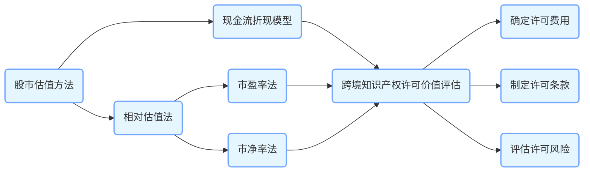

# 股市估值在跨境知识产权许可中的应用

> 关键词：股市估值、跨境知识产权许可、知识产权价值评估、现金流折现模型、市场比较法

> 摘要：本文深入探讨了股市估值在跨境知识产权许可中的应用。首先介绍了相关背景，包括研究目的、预期读者、文档结构和术语定义。接着阐述了股市估值与跨境知识产权许可的核心概念及联系，通过示意图和流程图进行清晰展示。详细讲解了核心算法原理，用 Python 代码实现具体操作步骤。引入数学模型和公式并举例说明。结合项目实战，从开发环境搭建到源代码实现与解读进行了详细说明。分析了实际应用场景，推荐了相关的学习资源、开发工具框架和论文著作。最后总结了未来发展趋势与挑战，解答了常见问题，并提供了扩展阅读和参考资料，旨在为跨境知识产权许可中运用股市估值提供全面的理论和实践指导。

## 1. 背景介绍 
### 1.1 目的和范围
随着经济全球化的深入发展，跨境知识产权许可活动日益频繁。知识产权作为企业重要的无形资产，其价值评估在许可交易中至关重要。股市估值作为一种成熟的企业价值评估方法，其理念和技术可以为跨境知识产权许可中的价值评估提供新的思路和方法。本文章的目的在于深入探讨股市估值在跨境知识产权许可中的应用，包括相关概念、算法原理、实际操作以及应用场景等方面。范围涵盖了股市估值的主要方法、跨境知识产权许可的流程和特点，以及如何将股市估值方法应用到跨境知识产权许可的价值评估中。

### 1.2 预期读者
本文预期读者包括从事跨境知识产权许可业务的律师、知识产权代理人、企业管理人员、投资银行家、财务分析师等专业人士，以及对知识产权价值评估和股市估值感兴趣的学者和研究人员。通过阅读本文，读者可以了解股市估值在跨境知识产权许可中的应用原理和方法，为实际工作和研究提供参考。

### 1.3 文档结构概述
本文将按照以下结构进行组织：首先介绍相关背景知识，包括目的、预期读者、文档结构和术语表；接着阐述股市估值与跨境知识产权许可的核心概念及联系，通过示意图和流程图进行清晰展示；详细讲解核心算法原理，并用 Python 代码实现具体操作步骤；引入数学模型和公式并举例说明；结合项目实战，从开发环境搭建到源代码实现与解读进行详细说明；分析实际应用场景；推荐相关的学习资源、开发工具框架和论文著作；最后总结未来发展趋势与挑战，解答常见问题，并提供扩展阅读和参考资料。

### 1.4 术语表
#### 1.4.1 核心术语定义
- **股市估值**：是指对上市公司的股票价值进行评估的过程和方法，常用的方法包括现金流折现模型、市盈率法、市净率法等。
- **跨境知识产权许可**：是指知识产权所有者将其知识产权在不同国家或地区许可给他人使用的商业行为，涉及到不同国家的法律、文化和市场环境。
- **知识产权价值评估**：是指对知识产权的经济价值进行评估的过程，旨在确定知识产权在市场上的合理价格。

#### 1.4.2 相关概念解释
- **现金流折现模型**：是一种基于未来现金流预测的估值方法，通过将未来的现金流折现到当前时点，来计算资产的价值。
- **市盈率**：是指股票价格与每股收益的比率，反映了市场对公司盈利能力的预期。
- **市净率**：是指股票价格与每股净资产的比率，反映了市场对公司净资产的估值。

#### 1.4.3 缩略词列表
- **DCF**：现金流折现模型（Discounted Cash Flow）
- **PE**：市盈率（Price-to-Earnings Ratio）
- **PB**：市净率（Price-to-Book Ratio）

## 2. 核心概念与联系 

### 核心概念原理
股市估值是基于企业的财务数据、市场前景、行业竞争等因素，对企业的股票价值进行评估。常见的股市估值方法包括现金流折现模型、相对估值法（如市盈率法、市净率法）等。现金流折现模型认为企业的价值等于其未来现金流的现值之和，通过预测企业未来的自由现金流，并选择合适的折现率将其折现到当前时点，从而得到企业的内在价值。相对估值法则是通过比较同行业或类似企业的估值指标，来确定目标企业的价值。

跨境知识产权许可则是知识产权所有者将其拥有的知识产权（如专利、商标、著作权等）在不同国家或地区许可给他人使用的行为。在许可过程中，需要对知识产权的价值进行评估，以确定合理的许可费用和许可条款。知识产权的价值受到多种因素的影响，如知识产权的类型、有效期、市场需求、技术创新性等。

### 架构的文本示意图
```plaintext
              股市估值方法
           ┌───────────────┐
           │  现金流折现模型  │
           │  相对估值法      │
           │  （市盈率、市净率） │
           └───────────────┘
                   │
                   │ 应用于
                   ▼
      跨境知识产权许可价值评估
           ┌───────────────┐
           │  确定许可费用    │
           │  制定许可条款    │
           │  评估许可风险    │
           └───────────────┘
```

### Mermaid 流程图


从流程图可以看出，股市估值的不同方法可以应用到跨境知识产权许可价值评估中，进而影响到许可费用的确定、许可条款的制定以及许可风险的评估。

## 3. 核心算法原理 & 具体操作步骤 

### 现金流折现模型原理
现金流折现模型（DCF）的核心思想是企业的价值等于其未来自由现金流的现值之和。自由现金流是指企业在满足了所有运营成本和资本支出后，可用于分配给投资者的现金流量。其基本公式为：

$$V = \sum_{t=1}^{n} \frac{FCF_t}{(1 + r)^t} + \frac{TV}{(1 + r)^n}$$

其中：
- $V$ 表示企业的价值
- $FCF_t$ 表示第 $t$ 期的自由现金流
- $r$ 表示折现率
- $n$ 表示预测期数
- $TV$ 表示终值

### Python 代码实现
```python
import numpy as np

def dcf_valuation(fcf, growth_rate, discount_rate, years):
    """
    现金流折现模型估值函数
    :param fcf: 初始自由现金流
    :param growth_rate: 自由现金流增长率
    :param discount_rate: 折现率
    :param years: 预测期数
    :return: 企业价值
    """
    cash_flows = []
    for i in range(years):
        if i == 0:
            cash_flows.append(fcf)
        else:
            cash_flows.append(cash_flows[i - 1] * (1 + growth_rate))
    
    discounted_cash_flows = []
    for i in range(years):
        discounted_cash_flows.append(cash_flows[i] / ((1 + discount_rate) ** (i + 1)))
    
    # 假设终值为最后一年现金流的 10 倍
    terminal_value = cash_flows[-1] * 10
    discounted_terminal_value = terminal_value / ((1 + discount_rate) ** years)
    
    total_value = np.sum(discounted_cash_flows) + discounted_terminal_value
    return total_value

# 示例参数
initial_fcf = 100  # 初始自由现金流为 100
growth_rate = 0.05  # 增长率为 5%
discount_rate = 0.1  # 折现率为 10%
years = 5  # 预测期为 5 年

value = dcf_valuation(initial_fcf, growth_rate, discount_rate, years)
print(f"企业价值: {value}")
```

### 相对估值法原理
相对估值法通过比较同行业或类似企业的估值指标来确定目标企业的价值。以市盈率法为例，其公式为：

$$V = EPS \times PE$$

其中：
- $V$ 表示企业的价值
- $EPS$ 表示每股收益
- $PE$ 表示市盈率

### Python 代码实现
```python
def pe_valuation(eps, pe_ratio):
    """
    市盈率法估值函数
    :param eps: 每股收益
    :param pe_ratio: 市盈率
    :return: 企业价值
    """
    value = eps * pe_ratio
    return value

# 示例参数
eps = 5  # 每股收益为 5
pe_ratio = 20  # 市盈率为 20

value = pe_valuation(eps, pe_ratio)
print(f"企业价值: {value}")
```

### 具体操作步骤
1. **数据收集**：收集目标企业或类似企业的财务数据，包括自由现金流、每股收益、市盈率、市净率等。
2. **参数确定**：根据历史数据和市场情况，确定增长率、折现率等参数。
3. **模型选择**：根据企业的特点和数据的可用性，选择合适的估值模型，如现金流折现模型或相对估值法。
4. **计算价值**：使用选定的模型和参数，计算目标企业的价值。
5. **调整和验证**：根据实际情况对计算结果进行调整，并与市场价格或其他估值方法进行验证。

## 4. 数学模型和公式 & 详细讲解 & 举例说明 

### 现金流折现模型公式详解
现金流折现模型的基本公式为：

$$V = \sum_{t=1}^{n} \frac{FCF_t}{(1 + r)^t} + \frac{TV}{(1 + r)^n}$$

- **自由现金流 $FCF_t$**：是指企业在第 $t$ 期可用于分配给投资者的现金流量，通常可以通过净利润、折旧与摊销、营运资本变动和资本支出等项目计算得出。例如，某企业第 1 年的净利润为 100 万元，折旧与摊销为 20 万元，营运资本增加 10 万元，资本支出为 30 万元，则第 1 年的自由现金流为：

$$FCF_1 = 100 + 20 - 10 - 30 = 80 \text{（万元）}$$

- **折现率 $r$**：反映了投资者对投资风险的要求，通常可以使用加权平均资本成本（WACC）来计算。假设某企业的股权资本成本为 12%，债务资本成本为 6%，股权比例为 70%，债务比例为 30%，则加权平均资本成本为：

$$WACC = 0.7 \times 12\% + 0.3 \times 6\% = 10.2\%$$

- **预测期数 $n$**：是指对企业未来现金流进行预测的期限，通常根据企业的行业特点和发展阶段来确定。一般来说，预测期为 5 - 10 年。
- **终值 $TV$**：是指预测期结束后企业的价值，通常可以使用永续增长模型来计算。假设预测期结束后企业的自由现金流以固定增长率 $g$ 永续增长，则终值为：

$$TV = \frac{FCF_{n+1}}{r - g}$$

其中，$FCF_{n+1}$ 是预测期结束后第 1 年的自由现金流。

### 相对估值法公式详解
#### 市盈率法
市盈率法的公式为：

$$V = EPS \times PE$$

- **每股收益 $EPS$**：是指企业每股股票的盈利，计算公式为：

$$EPS = \frac{净利润}{总股本}$$

例如，某企业的净利润为 1000 万元，总股本为 500 万股，则每股收益为：

$$EPS = \frac{1000}{500} = 2 \text{（元/股）}$$

- **市盈率 $PE$**：是指股票价格与每股收益的比率，可以通过同行业或类似企业的平均市盈率来确定。假设同行业类似企业的平均市盈率为 20，则该企业的价值为：

$$V = 2 \times 20 = 40 \text{（元/股）}$$

#### 市净率法
市净率法的公式为：

$$V = BVPS \times PB$$

其中：
- $BVPS$ 表示每股净资产，计算公式为：

$$BVPS = \frac{净资产}{总股本}$$

- $PB$ 表示市净率，同样可以通过同行业或类似企业的平均市净率来确定。

### 举例说明
假设某企业的初始自由现金流为 200 万元，预计未来 5 年的自由现金流增长率为 8%，5 年后的终值为 3000 万元，折现率为 12%。则使用现金流折现模型计算该企业的价值如下：

首先，计算未来 5 年的自由现金流：

| 年份 | 自由现金流（万元） |
|------|--------------------|
| 1    | $200 \times (1 + 8\%) = 216$ |
| 2    | $216 \times (1 + 8\%) = 233.28$ |
| 3    | $233.28 \times (1 + 8\%) = 251.94$ |
| 4    | $251.94 \times (1 + 8\%) = 272.10$ |
| 5    | $272.10 \times (1 + 8\%) = 293.87$ |

然后，计算各年自由现金流的现值：

| 年份 | 自由现金流（万元） | 现值（万元） |
|------|--------------------|--------------|
| 1    | 216                | $\frac{216}{(1 + 12\%)^1} = 192.86$ |
| 2    | 233.28             | $\frac{233.28}{(1 + 12\%)^2} = 186.34$ |
| 3    | 251.94             | $\frac{251.94}{(1 + 12\%)^3} = 179.74$ |
| 4    | 272.10             | $\frac{272.10}{(1 + 12\%)^4} = 173.07$ |
| 5    | 293.87             | $\frac{293.87}{(1 + 12\%)^5} = 166.34$ |

最后，计算企业的价值：

$$V = 192.86 + 186.34 + 179.74 + 173.07 + 166.34 + \frac{3000}{(1 + 12\%)^5} \approx 2347.75 \text{（万元）}$$

## 5. 项目实战：代码实际案例和详细解释说明 

### 5.1  开发环境搭建
#### 安装 Python
首先，需要安装 Python 编程语言。可以从 Python 官方网站（https://www.python.org/downloads/）下载适合自己操作系统的 Python 安装包，并按照安装向导进行安装。

#### 安装必要的库
在本项目中，需要使用 `numpy` 库进行数值计算。可以使用以下命令安装 `numpy` 库：

```sh
pip install numpy
```

### 5.2  源代码详细实现和代码解读
#### 现金流折现模型代码
```python
import numpy as np

def dcf_valuation(fcf, growth_rate, discount_rate, years):
    """
    现金流折现模型估值函数
    :param fcf: 初始自由现金流
    :param growth_rate: 自由现金流增长率
    :param discount_rate: 折现率
    :param years: 预测期数
    :return: 企业价值
    """
    cash_flows = []
    for i in range(years):
        if i == 0:
            cash_flows.append(fcf)
        else:
            cash_flows.append(cash_flows[i - 1] * (1 + growth_rate))
    
    discounted_cash_flows = []
    for i in range(years):
        discounted_cash_flows.append(cash_flows[i] / ((1 + discount_rate) ** (i + 1)))
    
    # 假设终值为最后一年现金流的 10 倍
    terminal_value = cash_flows[-1] * 10
    discounted_terminal_value = terminal_value / ((1 + discount_rate) ** years)
    
    total_value = np.sum(discounted_cash_flows) + discounted_terminal_value
    return total_value

# 示例参数
initial_fcf = 100  # 初始自由现金流为 100
growth_rate = 0.05  # 增长率为 5%
discount_rate = 0.1  # 折现率为 10%
years = 5  # 预测期为 5 年

value = dcf_valuation(initial_fcf, growth_rate, discount_rate, years)
print(f"企业价值: {value}")
```

**代码解读**：
- 定义了 `dcf_valuation` 函数，该函数接受初始自由现金流、增长率、折现率和预测期数作为参数。
- 在函数内部，首先计算未来各年的自由现金流，并将其存储在 `cash_flows` 列表中。
- 然后，将各年的自由现金流折现到当前时点，并存储在 `discounted_cash_flows` 列表中。
- 假设终值为最后一年现金流的 10 倍，计算终值并将其折现到当前时点。
- 最后，将各年折现后的自由现金流和折现后的终值相加，得到企业的价值。

#### 相对估值法（市盈率法）代码
```python
def pe_valuation(eps, pe_ratio):
    """
    市盈率法估值函数
    :param eps: 每股收益
    :param pe_ratio: 市盈率
    :return: 企业价值
    """
    value = eps * pe_ratio
    return value

# 示例参数
eps = 5  # 每股收益为 5
pe_ratio = 20  # 市盈率为 20

value = pe_valuation(eps, pe_ratio)
print(f"企业价值: {value}")
```

**代码解读**：
- 定义了 `pe_valuation` 函数，该函数接受每股收益和市盈率作为参数。
- 在函数内部，将每股收益乘以市盈率，得到企业的价值。

### 5.3  代码解读与分析
#### 现金流折现模型
现金流折现模型的优点是考虑了企业未来的现金流和时间价值，能够较为准确地反映企业的内在价值。但该模型也存在一些局限性，例如对未来现金流的预测具有不确定性，折现率的选择也会对结果产生较大影响。在实际应用中，需要对未来现金流进行合理的预测，并选择合适的折现率。

#### 相对估值法
相对估值法的优点是简单易懂，计算方便，能够快速得到企业的大致价值。但该方法也存在一些缺点，例如依赖于同行业或类似企业的估值指标，可能会受到市场情绪和行业波动的影响。在使用相对估值法时，需要选择合适的可比企业，并对估值指标进行合理的调整。

## 6. 实际应用场景 
### 确定许可费用
在跨境知识产权许可中，股市估值方法可以用于确定合理的许可费用。通过对拥有知识产权的企业进行估值，可以了解该知识产权对企业价值的贡献程度，从而为许可费用的确定提供参考。例如，如果使用现金流折现模型计算出拥有某专利的企业因该专利带来的额外现金流，那么可以根据这部分额外现金流的现值来确定专利许可费用。

### 制定许可条款
股市估值还可以帮助制定合理的许可条款。例如，根据估值结果可以确定许可的期限、地域范围、使用方式等。如果估值显示该知识产权具有较高的价值和较长的市场生命周期，那么可以适当延长许可期限；如果估值表明该知识产权在某些地区具有更大的市场潜力，那么可以在许可条款中明确规定使用的地域范围。

### 评估许可风险
在跨境知识产权许可中，存在一定的风险，如知识产权侵权、市场需求变化等。股市估值方法可以用于评估这些风险对许可价值的影响。例如，通过敏感性分析，研究折现率、增长率等参数的变化对估值结果的影响，从而评估不同风险因素下许可的价值。如果折现率上升或增长率下降导致估值大幅降低，那么说明该许可存在较高的风险。

### 战略决策
对于知识产权所有者和被许可方来说，股市估值可以为战略决策提供依据。知识产权所有者可以根据估值结果决定是否进行许可、选择合适的被许可方；被许可方可以根据估值判断是否值得获得许可，以及如何利用许可的知识产权实现自身的战略目标。例如，如果估值显示某知识产权的价值较高且增长潜力大，被许可方可能会加大在相关领域的投资和研发力度。

## 7. 工具和资源推荐
### 7.1 学习资源推荐
#### 7.1.1 书籍推荐
- 《估值：难点、解决方案及相关案例》（Valuation: Measuring and Managing the Value of Companies）：这本书由麦肯锡公司的专家撰写，详细介绍了企业估值的各种方法和技巧，包括现金流折现模型、相对估值法等，并通过大量案例进行说明。
- 《投资中最简单的事》：作者邱国鹭从投资的角度出发，讲解了如何对企业进行估值和分析，对于理解股市估值的基本原理和应用有很大帮助。
- 《知识产权价值评估》：专门介绍知识产权价值评估的方法和实践，对于跨境知识产权许可中的价值评估具有重要的参考价值。

#### 7.1.2 在线课程
- Coursera 上的“Corporate Finance”课程：由宾夕法尼亚大学的教授授课，涵盖了企业财务和估值的相关知识，包括现金流折现模型、资本预算等内容。
- edX 上的“Valuation for Mergers, Buyouts and Restructuring”课程：介绍了企业估值在并购、收购和重组等场景中的应用，对于理解股市估值在跨境知识产权许可中的应用也有一定的借鉴意义。

#### 7.1.3 技术博客和网站
- Seeking Alpha：提供股票分析、估值和投资建议的网站，上面有很多关于股市估值的文章和研究报告。
- 知识产权学术网：专注于知识产权领域的学术研究和实践交流，上面有关于知识产权价值评估的最新研究成果和案例分析。

### 7.2 开发工具框架推荐
#### 7.2.1 IDE和编辑器
- PyCharm：一款专业的 Python 集成开发环境，具有代码编辑、调试、自动补全、版本控制等功能，适合用于开发和调试股市估值相关的 Python 代码。
- Jupyter Notebook：一个交互式的开发环境，支持 Python 等多种编程语言，可以方便地进行数据处理、可视化和代码演示，对于验证股市估值算法和分析数据非常有用。

#### 7.2.2 调试和性能分析工具
- PDB：Python 自带的调试工具，可以在代码中设置断点，逐步执行代码，查看变量的值和程序的执行流程，帮助调试股市估值代码。
- cProfile：Python 标准库中的性能分析工具，可以统计代码的运行时间和函数调用次数，帮助找出代码中的性能瓶颈。

#### 7.2.3 相关框架和库
- NumPy：用于数值计算的 Python 库，提供了高效的数组操作和数学函数，在股市估值的代码实现中经常用于处理现金流数据和进行数值计算。
- Pandas：用于数据处理和分析的 Python 库，可以方便地读取、处理和分析财务数据，如自由现金流、每股收益等。

### 7.3 相关论文著作推荐
#### 7.3.1 经典论文
- “The Theory of Value Based on Capital Budgeting” by Joel Dean：该论文奠定了现金流折现模型在企业估值中的理论基础，对于理解现金流折现模型的原理和应用具有重要意义。
- “Ratio Analysis of Financial Statements” by Benjamin Graham and David L. Dodd：介绍了相对估值法的基本原理和应用，是相对估值法领域的经典论文。

#### 7.3.2 最新研究成果
- 近年来，随着人工智能和机器学习技术的发展，一些学者开始将这些技术应用到股市估值和知识产权价值评估中。例如，使用深度学习模型预测企业的未来现金流，提高估值的准确性。可以关注《Journal of Financial Economics》《Review of Financial Studies》等金融领域的顶级期刊，获取最新的研究成果。

#### 7.3.3 应用案例分析
- 《Mergers, Acquisitions, and Other Restructuring Activities: An Integrated Approach to Process, Tools, Cases, and Solutions》：这本书包含了大量企业并购、重组等活动中的估值案例分析，对于理解股市估值在跨境知识产权许可中的应用场景和实践方法有很大帮助。

## 8. 总结：未来发展趋势与挑战
### 未来发展趋势
#### 技术融合
随着人工智能、大数据、区块链等技术的不断发展，这些技术将与股市估值和跨境知识产权许可更加深度融合。例如，利用人工智能和大数据技术可以更准确地预测企业的未来现金流和市场需求，提高估值的准确性；区块链技术可以用于知识产权的登记、交易和监管，提高跨境知识产权许可的安全性和透明度。

#### 国际化标准
跨境知识产权许可涉及到不同国家的法律、文化和市场环境，未来可能会出现更加统一的国际化标准和规范。这将有助于减少跨境知识产权许可中的障碍和风险，提高交易效率和质量。

#### 多元化应用
股市估值方法在跨境知识产权许可中的应用将更加多元化。除了确定许可费用、制定许可条款和评估许可风险外，还可能应用于知识产权证券化、知识产权投资等领域。

### 挑战
#### 数据质量和可用性
股市估值和跨境知识产权许可都需要大量的财务数据和市场信息，但在实际应用中，数据的质量和可用性可能存在问题。例如，不同国家的财务报表标准不同，数据的准确性和可比性受到影响；知识产权的相关数据可能难以获取和量化。

#### 法律法规差异
不同国家的法律法规对知识产权的保护和许可有不同的规定，这给跨境知识产权许可带来了一定的挑战。在进行跨境知识产权许可时，需要了解和遵守不同国家的法律法规，避免法律风险。

#### 市场不确定性
股市估值和跨境知识产权许可都受到市场不确定性的影响，如宏观经济环境变化、行业竞争加剧、技术创新等。这些因素可能导致估值结果的不准确和许可交易的风险增加。

## 9. 附录：常见问题与解答
### 1. 股市估值方法是否适用于所有类型的知识产权？
不是所有类型的知识产权都适合使用股市估值方法。股市估值方法主要基于企业的财务数据和市场表现，对于那些与企业经营密切相关、能够带来明确现金流的知识产权，如专利、商标等，比较适用。而对于一些难以量化现金流的知识产权，如商业秘密、非专利技术等，可能需要采用其他估值方法。

### 2. 如何确定折现率和增长率等参数？
折现率和增长率等参数的确定需要综合考虑多种因素。折现率通常可以使用加权平均资本成本（WACC）来计算，需要考虑企业的股权资本成本、债务资本成本、股权比例和债务比例等因素。增长率可以根据企业的历史数据、行业发展趋势和市场预测等进行估计。在实际应用中，还可以采用敏感性分析的方法，研究不同参数取值对估值结果的影响。

### 3. 跨境知识产权许可中如何处理不同国家的法律法规差异？
在跨境知识产权许可中，需要了解和遵守不同国家的法律法规。可以聘请专业的律师团队，对不同国家的知识产权法律进行研究和分析，制定合理的许可条款和协议。同时，还可以通过国际知识产权组织等平台，获取相关的法律信息和指导。

### 4. 股市估值结果与实际交易价格可能存在差异，如何解释这种差异？
股市估值结果是基于一定的假设和模型计算得出的，而实际交易价格受到市场供求关系、谈判技巧、交易双方的战略目标等多种因素的影响。因此，估值结果与实际交易价格可能存在差异。在实际交易中，需要综合考虑各种因素，对估值结果进行适当的调整。

## 10. 扩展阅读 & 参考资料
### 扩展阅读
- 《金融市场与金融机构》：帮助读者了解金融市场的运作机制和金融机构的功能，对于理解股市估值的市场环境有很大帮助。
- 《创新与企业家精神》：介绍了创新和企业家精神在企业发展中的重要作用，对于理解知识产权的价值和跨境知识产权许可的战略意义有一定的启示。

### 参考资料
- 相关的财务报表和市场数据可以从证券交易所、金融数据提供商等渠道获取。
- 知识产权相关的法律法规可以查阅各国的知识产权局网站和国际知识产权组织的官方网站。
- 本文中引用的论文和书籍可以通过学术数据库和图书馆进行查找。

作者：AI天才研究院/AI Genius Institute & 禅与计算机程序设计艺术 /Zen And The Art of Computer Programming