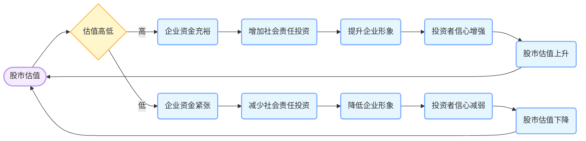

# 股市估值对企业社会责任投资的影响

> 关键词：股市估值、企业社会责任投资、财务绩效、市场预期、可持续发展

> 摘要：本文深入探讨了股市估值对企业社会责任投资的影响。首先介绍了研究的背景、目的、预期读者等内容。接着阐述了股市估值和企业社会责任投资的核心概念及其联系，通过数学模型和公式分析两者之间的理论关系，并结合实际案例进行说明。详细讲解了相关的核心算法原理和具体操作步骤，还进行了项目实战，包括开发环境搭建、源代码实现与解读。探讨了股市估值对企业社会责任投资在不同场景下的实际应用，推荐了学习相关知识的工具和资源，最后总结了未来的发展趋势与挑战，并对常见问题进行了解答，提供了扩展阅读和参考资料，旨在为企业和投资者在社会责任投资决策中提供有价值的参考。

## 1. 背景介绍 
### 1.1 目的和范围
本研究的主要目的是全面分析股市估值对企业社会责任投资的影响。具体来说，我们将探究股市估值如何通过市场预期、投资者偏好等因素影响企业在社会责任投资方面的决策和实践；同时研究企业的社会责任投资行为又如何反馈到股市估值上，形成两者之间的动态关系。研究范围涵盖了不同行业、不同规模的企业，通过对大量实际数据的分析和案例研究，力求揭示股市估值与企业社会责任投资之间的普遍规律和特殊情况。

### 1.2 预期读者
本文的预期读者主要包括企业管理者、投资者、金融分析师以及对企业社会责任和金融市场感兴趣的研究人员。企业管理者可以从本文中了解股市估值对企业社会责任投资的影响，从而更好地制定企业战略和投资决策；投资者可以借助研究结果评估企业的投资价值和可持续发展能力；金融分析师能够运用相关理论和方法进行更准确的市场分析和预测；研究人员则可以在此基础上开展进一步的学术研究。

### 1.3 文档结构概述
本文将按照以下结构进行阐述：首先介绍相关的背景信息，包括研究目的、预期读者和文档结构概述等。接着详细解释股市估值和企业社会责任投资的核心概念及其联系，通过示意图和流程图直观展示两者之间的关系。然后深入分析核心算法原理和具体操作步骤，使用Python代码进行详细说明。运用数学模型和公式对两者的关系进行量化分析，并结合实际案例进行讲解。通过项目实战，展示如何在实际中应用相关理论和方法。探讨股市估值对企业社会责任投资的实际应用场景，为读者提供实际操作的参考。推荐相关的学习工具和资源，帮助读者进一步深入学习。最后总结未来的发展趋势与挑战，解答常见问题，并提供扩展阅读和参考资料。

### 1.4 术语表
#### 1.4.1 核心术语定义
- **股市估值**：是指对上市公司的股票价值进行评估，通常基于公司的财务状况、盈利能力、市场竞争力等因素，通过一定的估值方法（如市盈率法、市净率法等）来确定股票的合理价格范围。
- **企业社会责任投资**：是指投资者在选择投资对象时，不仅考虑财务回报，还考虑企业在社会责任方面的表现，如环境保护、社会公益、员工权益等。企业进行社会责任投资旨在实现经济、社会和环境的可持续发展。

#### 1.4.2 相关概念解释
- **市场预期**：是指投资者对未来市场走势和企业业绩的预期。市场预期会影响股市估值，同时也会影响企业的社会责任投资决策。例如，如果投资者预期企业在未来能够通过社会责任投资获得更好的市场形象和竞争优势，那么他们可能会对企业的股票给予更高的估值。
- **可持续发展**：是指既满足当代人的需求，又不损害后代人满足其需求的能力的发展。企业社会责任投资是实现可持续发展的重要途径之一，通过关注环境、社会和治理（ESG）等方面的问题，企业可以提高自身的可持续发展能力。

#### 1.4.3 缩略词列表
- **ESG**：环境（Environment）、社会（Social）和治理（Governance）的缩写，是衡量企业社会责任表现的重要指标。
- **PE**：市盈率（Price-to-Earnings Ratio），是指股票价格与每股收益的比率，是常用的股市估值指标之一。
- **PB**：市净率（Price-to-Book Ratio），是指股票价格与每股净资产的比率，也是常用的股市估值指标之一。

## 2. 核心概念与联系 
### 2.1 股市估值的原理和方法
股市估值是金融领域中的一个重要概念，它旨在确定上市公司股票的合理价值。常见的股市估值方法包括市盈率法、市净率法、现金流折现法等。

- **市盈率法**：市盈率（PE）是指股票价格与每股收益的比率，计算公式为 $PE=\frac{P}{EPS}$，其中 $P$ 为股票价格，$EPS$ 为每股收益。市盈率法通过将目标公司的市盈率与同行业其他公司的市盈率进行比较，来评估目标公司股票的估值水平。如果目标公司的市盈率低于同行业平均水平，可能意味着该股票被低估，具有投资价值；反之，则可能被高估。

- **市净率法**：市净率（PB）是指股票价格与每股净资产的比率，计算公式为 $PB=\frac{P}{BVPS}$，其中 $P$ 为股票价格，$BVPS$ 为每股净资产。市净率法主要用于评估那些资产主要由有形资产构成的公司的股票价值。一般来说，市净率较低的股票可能具有较高的投资安全性。

- **现金流折现法**：现金流折现法是一种基于未来现金流预测的估值方法。该方法通过预测公司未来的自由现金流，并将其折现到当前时刻，得到公司的内在价值。具体计算公式为 $V=\sum_{t=1}^{n}\frac{FCF_t}{(1+r)^t}$，其中 $V$ 为公司的内在价值，$FCF_t$ 为第 $t$ 期的自由现金流，$r$ 为折现率，$n$ 为预测期数。

### 2.2 企业社会责任投资的内涵和意义
企业社会责任投资是指投资者在选择投资对象时，不仅关注企业的财务绩效，还关注企业在社会责任方面的表现。企业社会责任投资的内涵包括以下几个方面：

- **环境保护**：企业通过采取节能减排、资源回收利用等措施，减少对环境的负面影响，实现可持续发展。
- **社会公益**：企业积极参与社会公益活动，如扶贫、教育、医疗等，为社会做出贡献。
- **员工权益**：企业关注员工的权益和福利，提供良好的工作环境和发展机会，促进员工的身心健康和职业发展。

企业社会责任投资的意义在于：一方面，它有助于企业树立良好的社会形象，提高企业的品牌价值和市场竞争力；另一方面，它可以促进社会的可持续发展，实现经济、社会和环境的协调发展。

### 2.3 股市估值与企业社会责任投资的联系
股市估值与企业社会责任投资之间存在着密切的联系。一方面，企业的社会责任投资行为可能会影响股市估值。例如，企业积极开展社会责任投资，可能会提高企业的社会形象和声誉，增强投资者对企业的信心，从而导致股市估值上升。另一方面，股市估值也会影响企业的社会责任投资决策。如果股市估值较高，企业可能会有更多的资金和动力进行社会责任投资；反之，如果股市估值较低，企业可能会减少社会责任投资的投入。

下面是股市估值与企业社会责任投资关系的 Mermaid 流程图：


该流程图展示了股市估值与企业社会责任投资之间的动态循环关系。股市估值的高低影响企业的资金状况，进而影响企业的社会责任投资决策；企业的社会责任投资行为又会影响企业的形象和投资者信心，最终反馈到股市估值上。

## 3. 核心算法原理 & 具体操作步骤 
### 3.1 基于机器学习的股市估值预测算法
在本部分，我们将使用支持向量回归（SVR）算法来预测股市估值。支持向量回归是一种常用的机器学习算法，它可以通过寻找一个最优的超平面来拟合数据，从而实现对连续变量的预测。

#### 3.1.1 算法原理
支持向量回归的目标是找到一个函数 $f(x)=w^T\phi(x)+b$，使得对于所有的训练数据 $(x_i,y_i)$，都有 $|y_i - f(x_i)| \leq \epsilon$，其中 $\epsilon$ 是一个预先设定的误差容忍度。同时，我们希望 $w$ 的范数尽可能小，以保证模型的泛化能力。具体来说，支持向量回归的优化问题可以表示为：

$$
\begin{align*}
\min_{w,b,\xi,\xi^*}&\frac{1}{2}w^Tw + C\sum_{i=1}^{n}(\xi_i + \xi_i^*)\\
\text{s.t.}&\quad y_i - w^T\phi(x_i) - b \leq \epsilon + \xi_i\\
&\quad w^T\phi(x_i) + b - y_i \leq \epsilon + \xi_i^*\\
&\quad \xi_i, \xi_i^* \geq 0, \quad i = 1,2,\cdots,n
\end{align*}
$$

其中，$C$ 是一个惩罚参数，用于控制模型的复杂度和误差之间的平衡；$\xi_i$ 和 $\xi_i^*$ 是松弛变量，用于处理那些不满足误差容忍度的样本。

#### 3.1.2 具体操作步骤
下面是使用 Python 实现支持向量回归进行股市估值预测的具体步骤：

```python
import numpy as np
from sklearn.svm import SVR
from sklearn.model_selection import train_test_split
from sklearn.preprocessing import StandardScaler
import pandas as pd

# 1. 数据加载
data = pd.read_csv('stock_data.csv')  # 假设数据存储在 stock_data.csv 文件中
X = data.drop('stock_valuation', axis=1).values  # 特征矩阵
y = data['stock_valuation'].values  # 目标变量

# 2. 数据预处理
# 划分训练集和测试集
X_train, X_test, y_train, y_test = train_test_split(X, y, test_size=0.2, random_state=42)

# 数据标准化
scaler = StandardScaler()
X_train = scaler.fit_transform(X_train)
X_test = scaler.transform(X_test)

# 3. 模型训练
model = SVR(kernel='rbf', C=100, gamma=0.1)  # 创建 SVR 模型
model.fit(X_train, y_train)  # 训练模型

# 4. 模型预测
y_pred = model.predict(X_test)  # 预测测试集

# 5. 模型评估
from sklearn.metrics import mean_squared_error
mse = mean_squared_error(y_test, y_pred)
print(f"均方误差: {mse}")
```

### 3.2 企业社会责任投资决策算法
企业社会责任投资决策是一个复杂的过程，需要综合考虑多个因素，如企业的财务状况、市场预期、社会影响等。在本部分，我们将使用多目标决策算法来进行企业社会责任投资决策。

#### 3.2.1 算法原理
多目标决策算法的目标是在多个相互冲突的目标之间找到一个最优的解决方案。在企业社会责任投资决策中，我们可以将财务回报、社会影响和环境影响作为三个目标，通过构建一个多目标优化模型来确定最优的投资方案。

假设我们有 $n$ 个投资项目，每个项目有 $m$ 个目标指标，分别用 $f_1(x), f_2(x), \cdots, f_m(x)$ 表示。多目标优化问题可以表示为：

$$
\begin{align*}
\min_{x}&\quad [f_1(x), f_2(x), \cdots, f_m(x)]\\
\text{s.t.}&\quad g_j(x) \leq 0, \quad j = 1,2,\cdots,p\\
&\quad h_k(x) = 0, \quad k = 1,2,\cdots,q
\end{align*}
$$

其中，$x$ 是决策变量，表示投资项目的选择；$g_j(x)$ 和 $h_k(x)$ 分别是不等式约束和等式约束。

#### 3.2.2 具体操作步骤
下面是使用 Python 实现多目标决策算法进行企业社会责任投资决策的具体步骤：

```python
from pymoo.algorithms.moo.nsga2 import NSGA2
from pymoo.factory import get_problem
from pymoo.optimize import minimize

# 1. 定义多目标优化问题
class CSRInvestmentProblem(get_problem("zdt1")):
    def __init__(self):
        super().__init__(n_var=5)  # 假设我们有 5 个投资项目

    def _evaluate(self, x, out, *args, **kwargs):
        # 这里需要根据具体的目标函数进行实现
        # 假设我们有三个目标：财务回报、社会影响和环境影响
        f1 = np.sum(x)  # 简单示例：财务回报
        f2 = np.sum(1 - x)  # 简单示例：社会影响
        f3 = np.sum(x ** 2)  # 简单示例：环境影响
        out["F"] = np.column_stack([f1, f2, f3])

# 2. 定义算法
algorithm = NSGA2(pop_size=100)

# 3. 进行优化
problem = CSRInvestmentProblem()
res = minimize(problem, algorithm, ('n_gen', 50), seed=1, verbose=False)

# 4. 输出结果
print("最优解: ", res.X)
print("最优目标值: ", res.F)
```

## 4. 数学模型和公式 & 详细讲解 & 举例说明 
### 4.1 股市估值与企业社会责任投资的线性回归模型
为了量化股市估值与企业社会责任投资之间的关系，我们可以建立一个线性回归模型。假设股市估值用 $y$ 表示，企业社会责任投资用 $x$ 表示，线性回归模型可以表示为：

$$y = \beta_0 + \beta_1x + \epsilon$$

其中，$\beta_0$ 是截距项，$\beta_1$ 是斜率项，表示企业社会责任投资对股市估值的影响程度；$\epsilon$ 是误差项，服从均值为 0、方差为 $\sigma^2$ 的正态分布。

#### 4.1.1 模型参数估计
我们可以使用最小二乘法来估计线性回归模型的参数 $\beta_0$ 和 $\beta_1$。最小二乘法的目标是使残差平方和最小，即：

$$\min_{\beta_0,\beta_1}\sum_{i=1}^{n}(y_i - \beta_0 - \beta_1x_i)^2$$

对上述目标函数分别求关于 $\beta_0$ 和 $\beta_1$ 的偏导数，并令其等于 0，得到：

$$
\begin{align*}
\frac{\partial}{\partial\beta_0}\sum_{i=1}^{n}(y_i - \beta_0 - \beta_1x_i)^2 &= -2\sum_{i=1}^{n}(y_i - \beta_0 - \beta_1x_i) = 0\\
\frac{\partial}{\partial\beta_1}\sum_{i=1}^{n}(y_i - \beta_0 - \beta_1x_i)^2 &= -2\sum_{i=1}^{n}(y_i - \beta_0 - \beta_1x_i)x_i = 0
\end{align*}
$$

解上述方程组，得到参数的估计值：

$$
\begin{align*}
\hat{\beta}_1 &= \frac{\sum_{i=1}^{n}(x_i - \bar{x})(y_i - \bar{y})}{\sum_{i=1}^{n}(x_i - \bar{x})^2}\\
\hat{\beta}_0 &= \bar{y} - \hat{\beta}_1\bar{x}
\end{align*}
$$

其中，$\bar{x}$ 和 $\bar{y}$ 分别是 $x$ 和 $y$ 的样本均值。

#### 4.1.2 举例说明
假设我们收集了 10 家企业的股市估值和企业社会责任投资数据，如下表所示：

| 企业编号 | 股市估值 ($y$) | 企业社会责任投资 ($x$) |
| ---- | ---- | ---- |
| 1 | 100 | 10 |
| 2 | 120 | 12 |
| 3 | 130 | 13 |
| 4 | 140 | 14 |
| 5 | 150 | 15 |
| 6 | 160 | 16 |
| 7 | 170 | 17 |
| 8 | 180 | 18 |
| 9 | 190 | 19 |
| 10 | 200 | 20 |

首先，计算样本均值：

$$
\begin{align*}
\bar{x} &= \frac{1}{n}\sum_{i=1}^{n}x_i = \frac{10 + 12 + \cdots + 20}{10} = 15\\
\bar{y} &= \frac{1}{n}\sum_{i=1}^{n}y_i = \frac{100 + 120 + \cdots + 200}{10} = 150
\end{align*}
$$

然后，计算 $\hat{\beta}_1$：

$$
\begin{align*}
\hat{\beta}_1 &= \frac{\sum_{i=1}^{n}(x_i - \bar{x})(y_i - \bar{y})}{\sum_{i=1}^{n}(x_i - \bar{x})^2}\\
&= \frac{(10 - 15)(100 - 150) + (12 - 15)(120 - 150) + \cdots + (20 - 15)(200 - 150)}{(10 - 15)^2 + (12 - 15)^2 + \cdots + (20 - 15)^2}\\
&= 10
\end{align*}
$$

最后，计算 $\hat{\beta}_0$：

$$\hat{\beta}_0 = \bar{y} - \hat{\beta}_1\bar{x} = 150 - 10\times15 = 0$$

因此，线性回归模型为 $y = 10x$，这表明企业社会责任投资每增加 1 个单位，股市估值将增加 10 个单位。

### 4.2 基于风险调整的企业社会责任投资收益模型
在实际投资中，我们不仅要考虑投资收益，还要考虑投资风险。因此，我们可以建立一个基于风险调整的企业社会责任投资收益模型。

假设企业社会责任投资的预期收益为 $E(R)$，风险为 $\sigma$，无风险利率为 $r_f$，则风险调整后的投资收益可以用夏普比率（Sharpe Ratio）来衡量，计算公式为：

$$SR = \frac{E(R) - r_f}{\sigma}$$

其中，$SR$ 表示夏普比率，它反映了单位风险所获得的超额收益。夏普比率越高，说明投资的风险调整后收益越好。

#### 4.2.1 举例说明
假设某企业社会责任投资项目的预期收益率为 15%，风险（标准差）为 20%，无风险利率为 5%。则该项目的夏普比率为：

$$SR = \frac{0.15 - 0.05}{0.2} = 0.5$$

这意味着该项目每承担 1 个单位的风险，可以获得 0.5 个单位的超额收益。

## 5. 项目实战：代码实际案例和详细解释说明 
### 5.1  开发环境搭建
在进行股市估值和企业社会责任投资相关的项目实战时，我们需要搭建相应的开发环境。以下是具体的搭建步骤：

#### 5.1.1 安装 Python
Python 是一种广泛使用的编程语言，在数据处理、机器学习等领域有着丰富的库和工具。我们可以从 Python 官方网站（https://www.python.org/downloads/）下载并安装 Python 3.x 版本。

#### 5.1.2 安装必要的库
在本项目中，我们需要使用以下几个重要的 Python 库：

- **pandas**：用于数据处理和分析。
- **numpy**：用于数值计算。
- **scikit-learn**：用于机器学习算法的实现。
- **pymoo**：用于多目标优化问题的求解。

可以使用以下命令来安装这些库：

```sh
pip install pandas numpy scikit-learn pymoo
```

### 5.2  源代码详细实现和代码解读
#### 5.2.1 股市估值预测代码实现
```python
import numpy as np
import pandas as pd
from sklearn.svm import SVR
from sklearn.model_selection import train_test_split
from sklearn.preprocessing import StandardScaler
from sklearn.metrics import mean_squared_error

# 1. 数据加载
data = pd.read_csv('stock_data.csv')  # 假设数据存储在 stock_data.csv 文件中
X = data.drop('stock_valuation', axis=1).values  # 特征矩阵
y = data['stock_valuation'].values  # 目标变量

# 2. 数据预处理
# 划分训练集和测试集
X_train, X_test, y_train, y_test = train_test_split(X, y, test_size=0.2, random_state=42)

# 数据标准化
scaler = StandardScaler()
X_train = scaler.fit_transform(X_train)
X_test = scaler.transform(X_test)

# 3. 模型训练
model = SVR(kernel='rbf', C=100, gamma=0.1)  # 创建 SVR 模型
model.fit(X_train, y_train)  # 训练模型

# 4. 模型预测
y_pred = model.predict(X_test)  # 预测测试集

# 5. 模型评估
mse = mean_squared_error(y_test, y_pred)
print(f"均方误差: {mse}")
```

**代码解读**：
- **数据加载**：使用 `pandas` 库的 `read_csv` 函数加载存储在 `stock_data.csv` 文件中的数据。
- **数据预处理**：使用 `train_test_split` 函数将数据划分为训练集和测试集，比例为 8:2。使用 `StandardScaler` 对数据进行标准化处理，以提高模型的训练效果。
- **模型训练**：创建一个支持向量回归（SVR）模型，使用径向基函数（RBF）作为核函数，并设置惩罚参数 `C` 和核系数 `gamma`。使用训练集对模型进行训练。
- **模型预测**：使用训练好的模型对测试集进行预测。
- **模型评估**：使用均方误差（MSE）来评估模型的预测性能。

#### 5.2.2 企业社会责任投资决策代码实现
```python
from pymoo.algorithms.moo.nsga2 import NSGA2
from pymoo.factory import get_problem
from pymoo.optimize import minimize

# 1. 定义多目标优化问题
class CSRInvestmentProblem(get_problem("zdt1")):
    def __init__(self):
        super().__init__(n_var=5)  # 假设我们有 5 个投资项目

    def _evaluate(self, x, out, *args, **kwargs):
        # 这里需要根据具体的目标函数进行实现
        # 假设我们有三个目标：财务回报、社会影响和环境影响
        f1 = np.sum(x)  # 简单示例：财务回报
        f2 = np.sum(1 - x)  # 简单示例：社会影响
        f3 = np.sum(x ** 2)  # 简单示例：环境影响
        out["F"] = np.column_stack([f1, f2, f3])

# 2. 定义算法
algorithm = NSGA2(pop_size=100)

# 3. 进行优化
problem = CSRInvestmentProblem()
res = minimize(problem, algorithm, ('n_gen', 50), seed=1, verbose=False)

# 4. 输出结果
print("最优解: ", res.X)
print("最优目标值: ", res.F)
```

**代码解读**：
- **定义多目标优化问题**：创建一个自定义的多目标优化问题类 `CSRInvestmentProblem`，继承自 `get_problem("zdt1")`。在 `_evaluate` 方法中，定义了三个目标函数：财务回报、社会影响和环境影响。
- **定义算法**：使用 NSGA2 算法进行多目标优化，设置种群大小为 100。
- **进行优化**：创建问题实例和算法实例，调用 `minimize` 函数进行优化，设置迭代次数为 50。
- **输出结果**：输出最优解和最优目标值。

### 5.3  代码解读与分析
#### 5.3.1 股市估值预测代码分析
- **优点**：使用支持向量回归算法可以处理非线性关系，具有较好的泛化能力。数据预处理步骤（如标准化）可以提高模型的训练效果。使用均方误差作为评估指标，可以直观地反映模型的预测性能。
- **缺点**：支持向量回归算法的参数（如 `C` 和 `gamma`）需要手动调整，可能需要进行多次试验才能找到最优参数。模型的解释性较差，难以直观地理解模型的决策过程。

#### 5.3.2 企业社会责任投资决策代码分析
- **优点**：使用多目标优化算法可以同时考虑多个目标，找到最优的投资方案。NSGA2 算法是一种经典的多目标优化算法，具有较好的性能和收敛性。
- **缺点**：目标函数的定义比较简单，实际应用中需要根据具体情况进行更复杂的定义。多目标优化问题的求解通常比较耗时，尤其是当问题规模较大时。

## 6. 实际应用场景 
### 6.1 企业战略决策
企业在制定战略决策时，需要考虑股市估值和企业社会责任投资的关系。如果企业的股市估值较高，说明市场对企业的未来发展前景持乐观态度，企业可以适当增加社会责任投资，以进一步提升企业的社会形象和声誉，增强投资者的信心，从而维持或提高股市估值。例如，一家科技企业在股市估值较高时，可以加大对环保技术研发的投入，开展公益活动，提高员工福利等，以实现企业的可持续发展。

### 6.2 投资者投资决策
投资者在进行投资决策时，不仅要关注企业的财务指标，还要关注企业的社会责任表现。股市估值可以作为一个参考指标，帮助投资者评估企业的投资价值。如果一家企业的股市估值较低，但在社会责任方面表现出色，可能意味着该企业被市场低估，具有投资潜力。投资者可以通过分析企业的社会责任报告、ESG 评级等信息，选择那些既具有良好财务状况又积极履行社会责任的企业进行投资。

### 6.3 政府监管和政策制定
政府在制定监管政策和产业政策时，也可以考虑股市估值和企业社会责任投资的关系。政府可以通过出台相关政策，鼓励企业增加社会责任投资，提高企业的社会责任感和可持续发展能力。例如，政府可以给予那些积极履行社会责任的企业税收优惠、财政补贴等支持，同时加强对企业社会责任信息披露的监管，提高市场的透明度。

## 7. 工具和资源推荐
### 7.1 学习资源推荐
#### 7.1.1 书籍推荐
- 《金融市场学》：全面介绍了金融市场的基本概念、理论和实践，对于理解股市估值和企业社会责任投资的金融背景有很大帮助。
- 《企业社会责任：理论与实践》：深入探讨了企业社会责任的内涵、意义和实践方法，为企业社会责任投资提供了理论支持。
- 《机器学习》：详细介绍了机器学习的基本算法和应用，对于理解股市估值预测和企业社会责任投资决策中的算法原理有很大帮助。

#### 7.1.2 在线课程
- Coursera 上的“Financial Markets”课程：由耶鲁大学教授 Robert Shiller 主讲，介绍了金融市场的基本原理和投资策略。
- edX 上的“Corporate Social Responsibility”课程：由哈佛大学教授 Michael Porter 主讲，探讨了企业社会责任的战略意义和实践方法。
- 吴恩达的“Machine Learning”课程：经典的机器学习课程，涵盖了机器学习的基本算法和应用。

#### 7.1.3 技术博客和网站
- Seeking Alpha：提供了丰富的股市分析和投资建议，对于了解股市估值和市场动态有很大帮助。
- CSRwire：专注于企业社会责任领域的新闻和资讯，为企业社会责任投资提供了最新的信息。
- Towards Data Science：一个专注于数据科学和机器学习的技术博客，提供了很多实用的算法和代码示例。

### 7.2 开发工具框架推荐
#### 7.2.1 IDE和编辑器
- PyCharm：一款专业的 Python 集成开发环境，具有强大的代码编辑、调试和项目管理功能。
- Jupyter Notebook：一个交互式的开发环境，适合进行数据分析和模型开发，支持 Python、R 等多种编程语言。

#### 7.2.2 调试和性能分析工具
- Py-Spy：一个轻量级的 Python 性能分析工具，可以帮助我们找出代码中的性能瓶颈。
- PDB：Python 内置的调试器，可以帮助我们调试代码中的错误。

#### 7.2.3 相关框架和库
- TensorFlow：一个开源的机器学习框架，提供了丰富的深度学习算法和工具，可用于股市估值预测等任务。
- PyTorch：另一个流行的深度学习框架，具有简洁易用的特点，适合初学者和研究人员使用。

### 7.3 相关论文著作推荐
#### 7.3.1 经典论文
- “The Capital Asset Pricing Model: Theory and Evidence”：由 Eugene F. Fama 和 Kenneth R. French 撰写，介绍了资本资产定价模型（CAPM）的理论和实证研究。
- “Corporate Social Responsibility and Financial Performance: A Meta-Analysis”：由 Margarita Orlitzky、Frank L. Schmidt 和 Sara L. Rynes 撰写，对企业社会责任和财务绩效之间的关系进行了元分析。

#### 7.3.2 最新研究成果
- 《Journal of Financial Economics》：发表了很多关于金融市场和投资的最新研究成果，包括股市估值和企业社会责任投资方面的研究。
- 《Academy of Management Journal》：专注于管理学领域的研究，发表了很多关于企业战略和社会责任的最新研究成果。

#### 7.3.3 应用案例分析
- 《Harvard Business Review》：提供了很多企业管理和战略方面的应用案例分析，对于理解股市估值和企业社会责任投资的实际应用有很大帮助。
- 《MIT Sloan Management Review》：发表了很多关于创新和可持续发展的应用案例分析，为企业社会责任投资提供了实践参考。

## 8. 总结：未来发展趋势与挑战
### 8.1 未来发展趋势
- **融合发展**：股市估值和企业社会责任投资将越来越融合，投资者将更加关注企业的社会责任表现，企业也将更加注重通过社会责任投资来提升股市估值。
- **技术驱动**：随着人工智能、大数据等技术的不断发展，股市估值预测和企业社会责任投资决策将更加精准和高效。例如，利用机器学习算法可以更准确地预测股市估值，利用区块链技术可以提高企业社会责任信息披露的透明度。
- **国际化趋势**：企业社会责任投资将越来越国际化，国际投资者将更加关注全球企业的社会责任表现。同时，各国政府也将加强在企业社会责任领域的合作，共同推动全球可持续发展。

### 8.2 挑战
- **数据质量和可得性**：股市估值和企业社会责任投资的分析需要大量的数据支持，但目前数据质量和可得性仍然是一个挑战。例如，企业社会责任信息披露的标准和规范还不够统一，导致数据的可比性较差。
- **模型复杂度和解释性**：为了提高股市估值预测和企业社会责任投资决策的准确性，需要使用更复杂的模型，但这些模型的解释性较差，难以理解和应用。
- **市场不确定性**：股市估值和企业社会责任投资受到市场不确定性的影响较大，如宏观经济环境、政策变化等。如何在不确定性环境下做出准确的决策是一个挑战。

## 9. 附录：常见问题与解答
### 9.1 股市估值和企业社会责任投资之间的关系一定是正相关吗？
不一定。虽然从理论上讲，企业积极履行社会责任可能会提高企业的社会形象和声誉，从而提升股市估值，但在实际情况中，两者之间的关系可能受到多种因素的影响，如市场环境、行业竞争等。例如，在某些行业中，企业过度关注社会责任投资可能会导致成本增加，从而影响企业的财务绩效和股市估值。

### 9.2 如何衡量企业社会责任投资的效果？
可以从多个方面来衡量企业社会责任投资的效果，如社会影响、环境影响、财务回报等。常用的指标包括 ESG 评级、社会影响力评估、投资回报率等。此外，还可以通过问卷调查、案例分析等方法来评估企业社会责任投资对利益相关者的影响。

### 9.3 企业社会责任投资是否会影响企业的短期财务绩效？
企业社会责任投资可能会在短期内对企业的财务绩效产生一定的影响。一方面，社会责任投资需要投入一定的资金和资源，可能会增加企业的成本；另一方面，社会责任投资也可能会带来一些短期的收益，如提高企业的品牌价值、增强客户忠诚度等。但从长期来看，企业社会责任投资有助于提高企业的可持续发展能力，从而为企业带来更好的财务绩效。

## 10. 扩展阅读 & 参考资料
### 10.1 扩展阅读
- 《可持续金融与投资》：深入探讨了可持续金融的理论和实践，包括企业社会责任投资、绿色金融等领域。
- 《金融科技与金融创新》：介绍了金融科技的发展趋势和应用场景，对于理解股市估值和企业社会责任投资中的技术应用有很大帮助。

### 10.2 参考资料
- 上市公司的年报和社会责任报告：可以获取企业的财务信息和社会责任表现信息。
- 金融数据提供商：如 Bloomberg、Wind 等，提供了丰富的股市数据和金融分析工具。
- 相关学术期刊和会议论文：如《Journal of Financial Economics》、《Academy of Management Journal》等，发表了很多关于股市估值和企业社会责任投资的最新研究成果。

作者：AI天才研究院/AI Genius Institute & 禅与计算机程序设计艺术 /Zen And The Art of Computer Programming