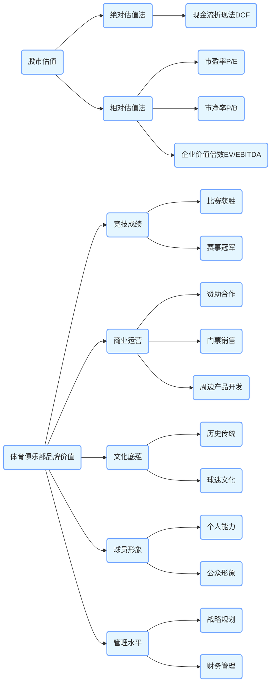

# 股市估值对国际体育俱乐部品牌价值的影响

> 关键词：股市估值、国际体育俱乐部、品牌价值、金融市场、体育经济

> 摘要：本文深入探讨了股市估值对国际体育俱乐部品牌价值的影响。首先介绍了研究的背景、目的、预期读者和文档结构，对相关术语进行了清晰定义。接着阐述了股市估值和体育俱乐部品牌价值的核心概念及两者之间的联系，并通过文本示意图和Mermaid流程图进行直观展示。详细讲解了相关核心算法原理，用Python代码进行了说明，同时给出了数学模型和公式，并举例解释。通过项目实战，展示了如何搭建开发环境、实现源代码并进行解读。分析了股市估值对国际体育俱乐部品牌价值影响的实际应用场景，推荐了学习资源、开发工具框架和相关论文著作。最后总结了未来发展趋势与挑战，解答了常见问题，并提供了扩展阅读和参考资料，旨在为理解这一复杂的经济现象提供全面且深入的视角。

## 1. 背景介绍 
### 1.1 目的和范围
本研究旨在深入探究股市估值与国际体育俱乐部品牌价值之间的内在联系和相互影响机制。通过对相关理论和实际案例的分析，揭示股市估值因素如何作用于体育俱乐部品牌价值的提升或降低，以及品牌价值的变化又如何反馈到股市估值上。研究范围涵盖了全球知名的上市体育俱乐部，包括足球、篮球、棒球等不同体育项目的俱乐部，分析它们在金融市场中的表现和品牌价值的动态变化。

### 1.2 预期读者
本文预期读者包括金融领域的投资者、分析师，体育产业的从业者、管理者，以及对体育经济和金融市场交叉领域感兴趣的学者和研究人员。对于投资者来说，可以从本文中获取关于体育俱乐部投资的决策依据；体育产业从业者能了解如何通过金融手段提升俱乐部的品牌价值；学者和研究人员则可以将本文作为进一步研究的参考资料。

### 1.3 文档结构概述
本文将按照以下结构展开：首先介绍核心概念，包括股市估值和体育俱乐部品牌价值的定义和内涵，以及它们之间的联系；接着阐述核心算法原理和具体操作步骤，并用Python代码进行详细说明；然后给出相关的数学模型和公式，并举例进行解释；通过项目实战展示如何在实际中应用这些理论和方法；分析股市估值对国际体育俱乐部品牌价值影响的实际应用场景；推荐相关的学习资源、开发工具框架和论文著作；最后总结未来发展趋势与挑战，解答常见问题，并提供扩展阅读和参考资料。

### 1.4 术语表
#### 1.4.1 核心术语定义
- **股市估值**：指对上市公司股票的价值进行评估的过程和结果。它是基于公司的财务状况、经营业绩、行业前景等多种因素，通过一定的估值方法来确定股票的合理价格或价值区间。
- **国际体育俱乐部**：具有广泛国际影响力的体育组织，参与各类体育赛事，拥有自己的球员、教练团队和管理体系，通过比赛、商业活动等获取收入。
- **品牌价值**：品牌在市场中所具有的价值，是品牌的知名度、美誉度、忠诚度等多种因素综合作用的结果。对于体育俱乐部来说，品牌价值体现了俱乐部在球迷、赞助商、媒体等方面的影响力和吸引力。

#### 1.4.2 相关概念解释
- **市盈率（P/E）**：是股市估值中常用的指标之一，等于股票价格除以每股收益。它反映了市场对公司未来盈利的预期，较高的市盈率通常意味着市场对公司的增长前景较为乐观。
- **市净率（P/B）**：股票价格与每股净资产的比率，用于衡量股票的估值水平。市净率较低可能表示股票被低估，具有投资价值。
- **品牌资产**：品牌所拥有的各种资产的总和，包括品牌名称、标志、声誉、客户关系等，是品牌价值的物质基础。

#### 1.4.3 缩略词列表
- **P/E**：市盈率（Price-to-Earnings Ratio）
- **P/B**：市净率（Price-to-Book Ratio）
- **EV/EBITDA**：企业价值倍数（Enterprise Value to Earnings Before Interest, Taxes, Depreciation and Amortization）

## 2. 核心概念与联系 

### 核心概念原理
#### 股市估值原理
股市估值是一个复杂的过程，涉及到对公司基本面、行业环境、宏观经济等多方面因素的分析。常用的估值方法包括绝对估值法和相对估值法。绝对估值法如现金流折现法（DCF），通过预测公司未来的现金流，并将其折现到当前时刻，来确定公司的内在价值。相对估值法则是通过与同行业其他公司进行比较，如使用市盈率、市净率等指标来评估公司股票的价值。

#### 体育俱乐部品牌价值原理
体育俱乐部的品牌价值来源于多个方面。首先是竞技成绩，俱乐部在比赛中的优异表现能够吸引更多的球迷关注，提高品牌知名度和美誉度。其次是商业运营，包括赞助合作、门票销售、周边产品开发等，这些活动不仅能为俱乐部带来收入，还能增强品牌的影响力。此外，俱乐部的文化底蕴、球员形象、管理水平等也会对品牌价值产生重要影响。

### 核心概念架构的文本示意图
```plaintext
股市估值
|-- 绝对估值法
|   |-- 现金流折现法（DCF）
|-- 相对估值法
|   |-- 市盈率（P/E）
|   |-- 市净率（P/B）
|   |-- 企业价值倍数（EV/EBITDA）

体育俱乐部品牌价值
|-- 竞技成绩
|   |-- 比赛获胜
|   |-- 赛事冠军
|-- 商业运营
|   |-- 赞助合作
|   |-- 门票销售
|   |-- 周边产品开发
|-- 文化底蕴
|   |-- 历史传统
|   |-- 球迷文化
|-- 球员形象
|   |-- 个人能力
|   |-- 公众形象
|-- 管理水平
|   |-- 战略规划
|   |-- 财务管理
```

### Mermaid流程图


### 股市估值与体育俱乐部品牌价值的联系
股市估值与体育俱乐部品牌价值之间存在着密切的联系。一方面，体育俱乐部品牌价值的提升通常会对股市估值产生积极影响。当俱乐部品牌价值提高时，意味着俱乐部在市场上具有更强的竞争力和盈利能力，这会吸引更多的投资者关注，从而推动股票价格上涨，提高股市估值。例如，一家俱乐部获得了重要赛事的冠军，其品牌知名度和美誉度大幅提升，赞助商纷纷增加合作，门票销售和周边产品收入也随之增加，这些都会反映在公司的财务报表上，进而提高股市对该俱乐部的估值。

另一方面，股市估值也会影响体育俱乐部的品牌价值。较高的股市估值可以为俱乐部提供更多的资金支持，用于引进优秀球员、改善训练设施、拓展商业运营等，从而进一步提升俱乐部的品牌价值。相反，如果股市估值较低，俱乐部可能面临融资困难，影响其发展和品牌建设。

## 3. 核心算法原理 & 具体操作步骤 

### 核心算法原理
#### 现金流折现法（DCF）
现金流折现法是一种常用的绝对估值方法，其基本原理是将公司未来的现金流折现到当前时刻，以确定公司的内在价值。具体公式为：
$$V = \sum_{t=1}^{n} \frac{CF_t}{(1 + r)^t}$$
其中，$V$ 表示公司的内在价值，$CF_t$ 表示第 $t$ 期的现金流，$r$ 表示折现率，$n$ 表示预测期数。

#### 市盈率法（P/E）
市盈率法是一种相对估值方法，通过比较目标公司与同行业其他公司的市盈率来评估目标公司的股票价值。计算公式为：
$$P = EPS \times P/E$$
其中，$P$ 表示股票价格，$EPS$ 表示每股收益，$P/E$ 表示市盈率。

### 具体操作步骤

#### 现金流折现法操作步骤
1. **预测未来现金流**：分析体育俱乐部的历史财务数据、经营状况和市场前景，预测未来各期的现金流。这需要考虑俱乐部的比赛收入、商业收入、成本支出等因素。
2. **确定折现率**：折现率反映了投资的风险和预期回报率。通常可以使用资本资产定价模型（CAPM）来确定折现率：
$$r = R_f + \beta \times (R_m - R_f)$$
其中，$R_f$ 表示无风险利率，$\beta$ 表示股票的贝塔系数，$R_m$ 表示市场平均收益率。
3. **计算内在价值**：将预测的未来现金流按照确定的折现率折现到当前时刻，求和得到俱乐部的内在价值。

#### 市盈率法操作步骤
1. **计算每股收益（EPS）**：根据俱乐部的财务报表，计算每股收益。公式为：
$$EPS = \frac{净利润}{总股本}$$
2. **选择可比公司**：选择同行业中具有相似经营状况和财务指标的公司作为可比公司。
3. **计算可比公司的平均市盈率**：收集可比公司的市盈率数据，计算其平均值。
4. **计算目标公司的股票价格**：将目标公司的每股收益乘以可比公司的平均市盈率，得到目标公司的股票价格。

### Python源代码详细阐述
```python
import numpy as np

# 现金流折现法实现
def dcf_valuation(cash_flows, discount_rate):
    """
    计算现金流折现法下的公司内在价值
    :param cash_flows: 未来各期现金流列表
    :param discount_rate: 折现率
    :return: 公司内在价值
    """
    n = len(cash_flows)
    present_values = []
    for t in range(n):
        present_value = cash_flows[t] / ((1 + discount_rate) ** (t + 1))
        present_values.append(present_value)
    return sum(present_values)

# 示例数据
cash_flows = [100, 120, 150, 180, 200]
discount_rate = 0.1

# 计算内在价值
intrinsic_value = dcf_valuation(cash_flows, discount_rate)
print(f"现金流折现法下的公司内在价值: {intrinsic_value}")

# 市盈率法实现
def pe_valuation(eps, pe_ratio):
    """
    计算市盈率法下的股票价格
    :param eps: 每股收益
    :param pe_ratio: 市盈率
    :return: 股票价格
    """
    return eps * pe_ratio

# 示例数据
eps = 5
pe_ratio = 20

# 计算股票价格
stock_price = pe_valuation(eps, pe_ratio)
print(f"市盈率法下的股票价格: {stock_price}")
```

## 4. 数学模型和公式 & 详细讲解 & 举例说明 

### 现金流折现法（DCF）
#### 公式
$$V = \sum_{t=1}^{n} \frac{CF_t}{(1 + r)^t}$$
#### 详细讲解
在这个公式中，$V$ 是公司的内在价值，也就是我们要计算的结果。$CF_t$ 表示第 $t$ 期的现金流，它反映了公司在该时期内的现金流入和流出情况。$(1 + r)^t$ 是折现因子，$r$ 是折现率，它考虑了资金的时间价值和投资的风险。随着时间 $t$ 的增加，折现因子会逐渐变小，这意味着未来的现金流在当前时刻的价值会逐渐降低。

#### 举例说明
假设一家体育俱乐部未来 5 年的现金流分别为 100 万元、120 万元、150 万元、180 万元和 200 万元，折现率为 10%。则该俱乐部的内在价值计算如下：

第 1 年现金流的现值：$PV_1 = \frac{100}{(1 + 0.1)^1} \approx 90.91$（万元）

第 2 年现金流的现值：$PV_2 = \frac{120}{(1 + 0.1)^2} \approx 99.17$（万元）

第 3 年现金流的现值：$PV_3 = \frac{150}{(1 + 0.1)^3} \approx 112.70$（万元）

第 4 年现金流的现值：$PV_4 = \frac{180}{(1 + 0.1)^4} \approx 122.94$（万元）

第 5 年现金流的现值：$PV_5 = \frac{200}{(1 + 0.1)^5} \approx 124.18$（万元）

俱乐部的内在价值：$V = PV_1 + PV_2 + PV_3 + PV_4 + PV_5 \approx 90.91 + 99.17 + 112.70 + 122.94 + 124.18 = 549.90$（万元）

### 市盈率法（P/E）
#### 公式
$$P = EPS \times P/E$$
#### 详细讲解
在这个公式中，$P$ 是股票价格，$EPS$ 是每股收益，它是公司净利润除以总股本得到的结果，反映了每股股票所对应的盈利水平。$P/E$ 是市盈率，它是市场对公司未来盈利预期的一种体现。较高的市盈率通常表示市场对公司的增长前景较为乐观，愿意为每股盈利支付更高的价格。

#### 举例说明
假设一家体育俱乐部的每股收益为 5 元，同行业可比公司的平均市盈率为 20 倍。则该俱乐部的股票价格计算如下：

$P = 5 \times 20 = 100$（元）

### 资本资产定价模型（CAPM）
#### 公式
$$r = R_f + \beta \times (R_m - R_f)$$
#### 详细讲解
在这个公式中，$r$ 是折现率，也就是投资者要求的预期回报率。$R_f$ 是无风险利率，通常可以用国债收益率来近似表示，它代表了投资者在没有风险的情况下所能获得的回报率。$\beta$ 是股票的贝塔系数，它衡量了股票价格相对于市场整体波动的敏感性。如果 $\beta > 1$，说明股票的波动幅度大于市场平均水平；如果 $\beta < 1$，则说明股票的波动幅度小于市场平均水平。$R_m$ 是市场平均收益率，它反映了市场整体的投资回报率。

#### 举例说明
假设无风险利率 $R_f = 3\%$，市场平均收益率 $R_m = 10\%$，某体育俱乐部股票的贝塔系数 $\beta = 1.2$。则该股票的折现率计算如下：

$r = 0.03 + 1.2 \times (0.1 - 0.03) = 0.03 + 1.2 \times 0.07 = 0.03 + 0.084 = 0.114$，即 11.4%

## 5. 项目实战：代码实际案例和详细解释说明 

### 5.1  开发环境搭建
#### 操作系统
可以选择 Windows、Linux 或 macOS 操作系统，建议使用较新的版本以确保兼容性和性能。

#### Python 环境
安装 Python 3.7 及以上版本。可以从 Python 官方网站（https://www.python.org/downloads/）下载安装包，按照安装向导进行安装。安装完成后，确保 Python 解释器的路径已添加到系统环境变量中。

#### 第三方库安装
本项目需要使用以下第三方库：
- `numpy`：用于数值计算。
- `pandas`：用于数据处理和分析。
- `matplotlib`：用于数据可视化。

可以使用 `pip` 命令进行安装：
```sh
pip install numpy pandas matplotlib
```

### 5.2  源代码详细实现和代码解读
```python
import numpy as np
import pandas as pd
import matplotlib.pyplot as plt

# 模拟体育俱乐部的财务数据
np.random.seed(42)
years = np.arange(2020, 2026)
revenues = np.random.randint(500, 1000, size=len(years))
expenses = np.random.randint(300, 700, size=len(years))
net_income = revenues - expenses
shares_outstanding = 100

# 计算每股收益（EPS）
eps = net_income / shares_outstanding

# 假设可比公司的平均市盈率为 15
pe_ratio = 15

# 计算股票价格
stock_prices = eps * pe_ratio

# 创建 DataFrame 存储数据
data = {
    'Year': years,
    'Revenue': revenues,
    'Expense': expenses,
    'Net Income': net_income,
    'EPS': eps,
    'Stock Price': stock_prices
}
df = pd.DataFrame(data)

# 打印财务数据
print(df)

# 绘制股票价格走势图
plt.figure(figsize=(10, 6))
plt.plot(df['Year'], df['Stock Price'], marker='o')
plt.title('Stock Price Trend of Sports Club')
plt.xlabel('Year')
plt.ylabel('Stock Price')
plt.grid(True)
plt.show()
```

### 代码解读与分析
#### 数据模拟
```python
np.random.seed(42)
years = np.arange(2020, 2026)
revenues = np.random.randint(500, 1000, size=len(years))
expenses = np.random.randint(300, 700, size=len(years))
net_income = revenues - expenses
shares_outstanding = 100
```
这段代码使用 `numpy` 库模拟了体育俱乐部从 2020 年到 2025 年的财务数据，包括收入、支出、净利润和总股本。通过 `np.random.seed(42)` 确保每次运行代码时生成的随机数相同，方便结果的复现。

#### 计算每股收益和股票价格
```python
eps = net_income / shares_outstanding
pe_ratio = 15
stock_prices = eps * pe_ratio
```
根据净利润和总股本计算每股收益（EPS），假设可比公司的平均市盈率为 15，使用市盈率法计算股票价格。

#### 数据存储和展示
```python
data = {
    'Year': years,
    'Revenue': revenues,
    'Expense': expenses,
    'Net Income': net_income,
    'EPS': eps,
    'Stock Price': stock_prices
}
df = pd.DataFrame(data)
print(df)
```
将模拟的数据存储在 `pandas` 的 `DataFrame` 中，并打印出来，方便查看和分析。

#### 数据可视化
```python
plt.figure(figsize=(10, 6))
plt.plot(df['Year'], df['Stock Price'], marker='o')
plt.title('Stock Price Trend of Sports Club')
plt.xlabel('Year')
plt.ylabel('Stock Price')
plt.grid(True)
plt.show()
```
使用 `matplotlib` 库绘制股票价格的走势图，直观地展示体育俱乐部股票价格随时间的变化趋势。

## 6. 实际应用场景 
### 投资决策
对于投资者来说，股市估值和体育俱乐部品牌价值的分析可以帮助他们做出更明智的投资决策。如果一家体育俱乐部的品牌价值不断提升，但股市估值相对较低，可能意味着该股票被低估，具有投资价值。相反，如果品牌价值下降而股市估值仍然较高，投资者可能需要谨慎考虑是否投资该股票。

### 俱乐部战略规划
体育俱乐部管理者可以通过关注股市估值和品牌价值的变化，制定合理的战略规划。例如，如果股市估值较低，俱乐部可以考虑采取措施提升品牌价值，如引进优秀球员、加强商业运营等，以提高股市对俱乐部的认可度，从而获得更多的融资支持。同时，俱乐部也可以根据股市估值的变化，调整股权结构和融资策略。

### 赞助商合作
赞助商在选择合作的体育俱乐部时，会考虑俱乐部的品牌价值和股市表现。较高的品牌价值和良好的股市估值意味着俱乐部具有更大的市场影响力和商业潜力，能够为赞助商带来更多的曝光和回报。因此，俱乐部可以通过提升品牌价值和股市估值来吸引更多优质的赞助商合作。

### 行业竞争分析
分析股市估值和品牌价值可以帮助体育行业的从业者了解各俱乐部之间的竞争态势。通过比较不同俱乐部的股市估值和品牌价值指标，可以发现行业内的领先者和潜在的竞争对手，从而制定相应的竞争策略。

## 7. 工具和资源推荐
### 7.1 学习资源推荐
#### 7.1.1 书籍推荐
- 《金融市场与金融机构》：全面介绍了金融市场的基本原理和金融机构的运作机制，对于理解股市估值有很大帮助。
- 《品牌管理》：详细阐述了品牌价值的概念、评估方法和品牌建设的策略，适合深入学习体育俱乐部品牌价值相关知识。
- 《体育经济学》：结合体育产业的特点，分析了体育市场的供求关系、赛事运营、俱乐部管理等方面的经济问题。

#### 7.1.2 在线课程
- Coursera 上的“Financial Markets”：由耶鲁大学教授罗伯特·席勒（Robert Shiller）授课，讲解了金融市场的基本理论和实践应用。
- edX 上的“Brand Strategy and Management”：提供了品牌战略规划和管理的系统知识和案例分析。
- Udemy 上的“Sports Analytics: Data Science in Sports”：介绍了如何运用数据分析方法解决体育领域的实际问题。

#### 7.1.3 技术博客和网站
- Seeking Alpha：提供了丰富的金融市场分析和股票估值报告，包括体育俱乐部相关的内容。
- Brand Finance：专注于品牌价值评估和研究，发布了全球体育品牌价值排行榜等重要报告。
- ESPN 财经板块：结合体育赛事和商业报道，分析体育俱乐部的财务状况和市场表现。

### 7.2 开发工具框架推荐
#### 7.2.1 IDE和编辑器
- PyCharm：功能强大的 Python 集成开发环境，提供了代码编辑、调试、版本控制等一系列功能，适合 Python 项目开发。
- Jupyter Notebook：交互式的开发环境，支持代码、文本、图表等多种元素的混合展示，方便进行数据探索和分析。

#### 7.2.2 调试和性能分析工具
- `pdb`：Python 内置的调试工具，可以帮助开发者逐步执行代码，检查变量值和程序执行流程。
- `cProfile`：用于分析 Python 程序的性能，找出程序中的瓶颈和耗时操作。

#### 7.2.3 相关框架和库
- `scikit-learn`：强大的机器学习库，提供了各种机器学习算法和工具，可用于股市估值预测和品牌价值评估模型的构建。
- `TensorFlow` 和 `PyTorch`：深度学习框架，适用于处理复杂的数据分析和预测任务。

### 7.3 相关论文著作推荐
#### 7.3.1 经典论文
- “The Capital Asset Pricing Model: Theory and Evidence”：详细介绍了资本资产定价模型（CAPM）的理论基础和实证研究结果。
- “Brand Equity: Building, Measuring, Managing”：对品牌资产的概念、测量方法和管理策略进行了深入探讨。
- “The Economics of Professional Team Sports: An Analytical Review”：对职业体育团队的经济现象进行了系统的分析和总结。

#### 7.3.2 最新研究成果
- 关注《Journal of Sports Economics》《Journal of Brand Management》等学术期刊，获取关于体育经济和品牌管理领域的最新研究成果。
- 参加国际体育经济学会（International Association of Sports Economics）等学术组织的会议，了解行业前沿动态。

#### 7.3.3 应用案例分析
- 分析知名体育俱乐部如曼联、皇马等的财务报告和品牌发展案例，学习它们在股市估值和品牌价值提升方面的成功经验。
- 研究体育产业并购和重组案例，了解股市估值和品牌价值在企业战略决策中的作用。

## 8. 总结：未来发展趋势与挑战
### 未来发展趋势
#### 数字化转型加速
随着信息技术的不断发展，体育俱乐部将更加注重数字化转型。通过大数据分析、人工智能等技术，俱乐部可以更好地了解球迷需求，精准营销，提升品牌价值。同时，数字化技术也将为股市估值提供更丰富的数据和更精准的模型。

#### 跨界融合加深
体育与金融、娱乐、科技等行业的跨界融合将更加深入。例如，体育俱乐部可以与金融机构合作推出创新的金融产品，与娱乐公司合作开展多元化的商业活动，这些都将为俱乐部的品牌价值和股市估值带来新的增长点。

#### 国际市场拓展
国际体育俱乐部将进一步拓展全球市场，提高品牌的国际影响力。随着全球化的推进，越来越多的球迷关注国际体育赛事，俱乐部可以通过拓展海外市场、举办国际赛事等方式，吸引更多的国际赞助商和投资者，提升股市估值。

### 挑战
#### 市场波动风险
股市估值容易受到宏观经济环境、政策变化等因素的影响，市场波动较大。体育俱乐部的品牌价值也可能受到赛事成绩、球员伤病等不确定因素的影响。因此，如何应对市场波动风险，保持股市估值和品牌价值的稳定是俱乐部面临的重要挑战。

#### 数据安全和隐私问题
在数字化转型过程中，体育俱乐部需要收集和处理大量的球迷数据和财务数据。如何保障数据的安全和隐私，防止数据泄露和滥用，是俱乐部需要解决的重要问题。否则，数据安全问题可能会损害俱乐部的品牌形象，影响股市估值。

#### 竞争加剧
随着体育产业的发展，国际体育俱乐部之间的竞争将更加激烈。如何在激烈的竞争中脱颖而出，提升品牌价值和股市估值，需要俱乐部不断创新经营模式，提高管理水平，加强品牌建设。

## 9. 附录：常见问题与解答
### 1. 股市估值的准确性如何保证？
股市估值是一个复杂的过程，受到多种因素的影响，很难做到完全准确。为了提高估值的准确性，可以采用多种估值方法进行综合分析，同时充分考虑公司的基本面、行业前景、宏观经济环境等因素。此外，还可以参考同行业其他公司的估值情况，进行比较和调整。

### 2. 体育俱乐部品牌价值评估有哪些方法？
体育俱乐部品牌价值评估方法主要包括市场法、收益法和成本法。市场法是通过比较类似品牌的市场交易价格来评估品牌价值；收益法是通过预测品牌未来的收益，并将其折现到当前时刻来确定品牌价值；成本法是通过计算创建和维护品牌所需的成本来评估品牌价值。在实际应用中，通常会综合使用多种方法进行评估。

### 3. 股市估值对体育俱乐部的融资有什么影响？
较高的股市估值意味着俱乐部的股票价格较高，能够吸引更多的投资者，从而为俱乐部提供更多的融资渠道和资金支持。俱乐部可以通过发行新股、债券等方式进行融资，用于引进球员、改善设施、拓展业务等。相反，如果股市估值较低，俱乐部的融资难度可能会增加，融资成本也可能会提高。

### 4. 体育俱乐部的品牌价值和赛事成绩有什么关系？
体育俱乐部的赛事成绩对品牌价值有着重要的影响。优异的赛事成绩能够吸引更多的球迷关注，提高品牌知名度和美誉度，从而增加赞助商的合作意愿和球迷的消费热情，提升品牌价值。相反，如果赛事成绩不佳，可能会导致球迷流失，赞助商减少合作，品牌价值下降。

## 10. 扩展阅读 & 参考资料
### 扩展阅读
- 《财富》杂志关于体育产业的相关报道，深入分析了体育俱乐部的商业运营和市场趋势。
- 《福布斯》发布的全球体育品牌价值排行榜，提供了不同体育俱乐部品牌价值的比较和分析。
- 体育行业的专业书籍和研究报告，如《体育营销》《体育产业发展战略》等，进一步探讨了体育俱乐部品牌建设和市场竞争的策略。

### 参考资料
- 上市公司的财务报表和年报，获取关于体育俱乐部财务状况和经营业绩的详细信息。
- 金融数据库，如 Bloomberg、Wind 等，提供了股市估值数据和相关分析工具。
- 学术期刊和会议论文，如《Journal of Financial Economics》《International Journal of Sports Marketing and Sponsorship》等，为研究股市估值和体育俱乐部品牌价值提供了理论支持和实证研究案例。

作者：AI天才研究院/AI Genius Institute & 禅与计算机程序设计艺术 /Zen And The Art of Computer Programming