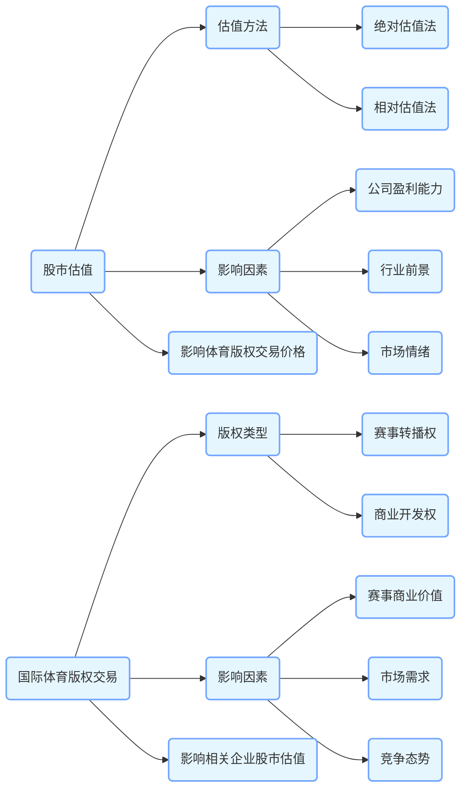

# 股市估值对国际体育版权交易的影响

> 关键词：股市估值、国际体育版权交易、市场机制、经济影响、行业趋势

> 摘要：本文深入探讨了股市估值对国际体育版权交易的影响。通过对股市估值的原理、国际体育版权交易的特点进行分析，阐述了两者之间的内在联系和相互作用机制。从核心概念、算法原理、数学模型等方面进行了理论剖析，并结合实际案例展示了股市估值如何在不同层面影响国际体育版权交易。同时，介绍了相关的工具和资源，最后对未来的发展趋势和挑战进行了总结，旨在为体育产业从业者、投资者以及相关研究人员提供全面且深入的参考。

## 1. 背景介绍 
### 1.1 目的和范围
本研究旨在全面探究股市估值与国际体育版权交易之间的关系，明确股市估值对国际体育版权交易在价格、交易活跃度、市场格局等方面的具体影响。研究范围涵盖全球主要的股市和国际体育版权交易市场，包括但不限于足球、篮球、网球等主流体育项目的版权交易。

### 1.2 预期读者
本文预期读者包括体育产业从业者，如体育赛事运营方、版权代理机构人员等；金融投资领域人士，如股票投资者、基金经理等；以及对体育经济、金融市场感兴趣的研究人员和学者。

### 1.3 文档结构概述
本文首先介绍相关背景知识，包括目的、读者群体和文档结构等。接着阐述核心概念及它们之间的联系，通过文本示意图和Mermaid流程图展示。然后详细讲解核心算法原理和具体操作步骤，结合Python代码进行说明。再介绍相关数学模型和公式，并举例说明。之后通过实际案例分析股市估值对国际体育版权交易的影响，包括开发环境搭建、源代码实现和解读。随后探讨实际应用场景，推荐相关工具和资源，最后总结未来发展趋势与挑战，并提供常见问题解答和扩展阅读参考资料。

### 1.4 术语表
#### 1.4.1 核心术语定义
- **股市估值**：是指对股票市场中上市公司的价值进行评估的过程和结果，通常通过各种估值方法来确定股票的合理价格范围。
- **国际体育版权交易**：指跨越国界的体育赛事转播权、商业开发权等相关权益的买卖活动。
- **市盈率（P/E）**：是最常用的估值指标之一，计算公式为公司市值除以净利润，反映了投资者为获取公司每一元盈利所愿意支付的价格。
- **市净率（P/B）**：公司市值与净资产的比率，用于衡量公司的市场价值相对于其账面价值的高低。

#### 1.4.2 相关概念解释
- **体育版权**：体育版权是体育赛事相关的知识产权，包括赛事转播权、赛事品牌使用权、运动员肖像权等多种权益，是体育产业商业化的核心要素。
- **市场情绪**：投资者对市场的整体信心和预期，会影响股市估值和投资决策，进而对国际体育版权交易产生间接影响。

#### 1.4.3 缩略词列表
- **P/E**：Price-to-Earnings Ratio，市盈率
- **P/B**：Price-to-Book Ratio，市净率

## 2. 核心概念与联系 
### 核心概念原理
#### 股市估值原理
股市估值是基于对上市公司未来盈利能力、资产质量、行业前景等多方面因素的综合评估。常见的估值方法有绝对估值法和相对估值法。绝对估值法如现金流折现模型（DCF），通过预测公司未来的现金流并折现到当前来确定公司的内在价值；相对估值法如市盈率法、市净率法等，通过与同行业其他公司或市场平均水平进行比较来评估公司的价值。

#### 国际体育版权交易原理
国际体育版权交易的核心是体育赛事的商业价值。赛事的商业价值取决于赛事的知名度、观赏性、竞技水平、观众数量等因素。版权交易双方通过谈判和协商，根据赛事的预期收益和市场需求来确定版权的价格和交易条款。

### 核心概念架构的文本示意图
```plaintext
股市估值
|-- 估值方法
|   |-- 绝对估值法（DCF等）
|   |-- 相对估值法（P/E、P/B等）
|-- 影响因素
|   |-- 公司盈利能力
|   |-- 行业前景
|   |-- 市场情绪
|
国际体育版权交易
|-- 版权类型
|   |-- 赛事转播权
|   |-- 商业开发权
|-- 影响因素
|   |-- 赛事商业价值
|   |-- 市场需求
|   |-- 竞争态势
|
联系
|-- 股市估值影响体育版权交易价格
|-- 体育版权交易影响相关企业股市估值
```

### Mermaid流程图


## 3. 核心算法原理 & 具体操作步骤 
### 股市估值算法原理及Python实现
#### 市盈率估值法
市盈率估值法的原理是通过选取同行业可比公司的平均市盈率，乘以目标公司的净利润来估算目标公司的市值。公式为：$市值 = 净利润 \times 市盈率$。

以下是使用Python实现市盈率估值法的代码示例：
```python
# 假设同行业平均市盈率为20，目标公司净利润为1000万元
average_pe = 20
net_profit = 1000

# 计算市值
market_value = net_profit * average_pe

print(f"目标公司的估算市值为: {market_value} 万元")
```
#### 现金流折现模型（DCF）
现金流折现模型的原理是将公司未来各期的现金流按照一定的折现率折现到当前，求和得到公司的内在价值。公式为：$V = \sum_{t=1}^{n} \frac{CF_t}{(1 + r)^t}$，其中 $V$ 是公司的内在价值，$CF_t$ 是第 $t$ 期的现金流，$r$ 是折现率，$n$ 是预测期数。

以下是使用Python实现现金流折现模型的代码示例：
```python
import numpy as np

# 假设预测期为5年，每年的现金流分别为100、120、150、180、200万元，折现率为10%
cash_flows = np.array([100, 120, 150, 180, 200])
discount_rate = 0.1
years = np.arange(1, len(cash_flows) + 1)

# 计算折现后的现金流
discounted_cash_flows = cash_flows / (1 + discount_rate) ** years

# 计算公司内在价值
intrinsic_value = np.sum(discounted_cash_flows)

print(f"公司的内在价值为: {intrinsic_value} 万元")
```

### 体育版权估值算法原理及Python实现
体育版权估值通常基于赛事的预期收益和市场需求。一种简单的方法是通过预测赛事的转播收入、赞助收入等，然后进行折现得到版权的现值。

以下是一个简单的体育版权估值的Python代码示例：
```python
# 假设赛事未来3年的预期收入分别为500、600、700万元，折现率为8%
expected_income = np.array([500, 600, 700])
discount_rate = 0.08
years = np.arange(1, len(expected_income) + 1)

# 计算折现后的收入
discounted_income = expected_income / (1 + discount_rate) ** years

# 计算版权现值
copyright_value = np.sum(discounted_income)

print(f"体育版权的现值为: {copyright_value} 万元")
```

## 4. 数学模型和公式 & 详细讲解 & 举例说明 
### 股市估值数学模型和公式
#### 市盈率估值模型
公式：$V = EPS \times P/E$，其中 $V$ 是公司的市值，$EPS$ 是每股收益，$P/E$ 是市盈率。

举例说明：假设某公司每股收益为2元，同行业平均市盈率为15，则该公司的估算市值为 $2 \times 15 = 30$ 元/股。如果该公司发行了1000万股股票，则公司的总市值为 $30 \times 1000 = 30000$ 万元。

#### 现金流折现模型（DCF）
公式：$V = \sum_{t=1}^{n} \frac{CF_t}{(1 + r)^t}$，其中 $V$ 是公司的内在价值，$CF_t$ 是第 $t$ 期的现金流，$r$ 是折现率，$n$ 是预测期数。

举例说明：假设某公司未来3年的现金流分别为100万元、120万元、150万元，折现率为10%。则该公司的内在价值为：
$$
\begin{align*}
V &= \frac{100}{(1 + 0.1)^1} + \frac{120}{(1 + 0.1)^2} + \frac{150}{(1 + 0.1)^3}\\
&= \frac{100}{1.1} + \frac{120}{1.21} + \frac{150}{1.331}\\
&\approx 90.91 + 99.17 + 112.69\\
&= 302.77 \text{（万元）}
\end{align*}
$$

### 体育版权估值数学模型和公式
#### 收益现值模型
公式：$PV = \sum_{t=1}^{n} \frac{R_t}{(1 + r)^t}$，其中 $PV$ 是版权的现值，$R_t$ 是第 $t$ 期的预期收益，$r$ 是折现率，$n$ 是预测期数。

举例说明：假设某体育赛事未来2年的预期收益分别为300万元、400万元，折现率为8%。则该赛事版权的现值为：
$$
\begin{align*}
PV &= \frac{300}{(1 + 0.08)^1} + \frac{400}{(1 + 0.08)^2}\\
&= \frac{300}{1.08} + \frac{400}{1.1664}\\
&\approx 277.78 + 342.94\\
&= 620.72 \text{（万元）}
\end{align*}
$$

## 5. 项目实战：代码实际案例和详细解释说明 
### 5.1  开发环境搭建
为了实现上述的股市估值和体育版权估值代码，我们可以使用Python语言进行开发。以下是搭建开发环境的步骤：
1. **安装Python**：从Python官方网站（https://www.python.org/downloads/）下载并安装适合你操作系统的Python版本。建议安装Python 3.7及以上版本。
2. **安装必要的库**：我们需要使用 `numpy` 库进行数值计算。可以使用以下命令进行安装：
```sh
pip install numpy
```
3. **选择开发工具**：可以使用Jupyter Notebook、PyCharm等开发工具进行代码编写和调试。

### 5.2  源代码详细实现和代码解读
#### 股市估值代码实现
```python
import numpy as np

# 定义市盈率估值函数
def pe_valuation(eps, pe):
    """
    使用市盈率估值法计算公司市值
    :param eps: 每股收益
    :param pe: 市盈率
    :return: 公司市值
    """
    return eps * pe

# 定义现金流折现模型估值函数
def dcf_valuation(cash_flows, discount_rate):
    """
    使用现金流折现模型计算公司内在价值
    :param cash_flows: 未来各期现金流列表
    :param discount_rate: 折现率
    :return: 公司内在价值
    """
    years = np.arange(1, len(cash_flows) + 1)
    discounted_cash_flows = cash_flows / (1 + discount_rate) ** years
    return np.sum(discounted_cash_flows)

# 示例数据
eps = 2
pe = 15
cash_flows = np.array([100, 120, 150])
discount_rate = 0.1

# 计算市盈率估值结果
pe_value = pe_valuation(eps, pe)
print(f"市盈率估值结果: {pe_value} 元/股")

# 计算现金流折现模型估值结果
dcf_value = dcf_valuation(cash_flows, discount_rate)
print(f"现金流折现模型估值结果: {dcf_value} 万元")
```
代码解读：
- `pe_valuation` 函数接受每股收益和市盈率作为参数，返回公司的市值。
- `dcf_valuation` 函数接受未来各期现金流列表和折现率作为参数，使用现金流折现模型计算公司的内在价值。
- 示例数据部分定义了每股收益、市盈率、未来现金流和折现率，然后分别调用两个估值函数计算估值结果并输出。

#### 体育版权估值代码实现
```python
import numpy as np

# 定义体育版权估值函数
def sports_copyright_valuation(expected_income, discount_rate):
    """
    计算体育版权的现值
    :param expected_income: 未来各期预期收入列表
    :param discount_rate: 折现率
    :return: 体育版权现值
    """
    years = np.arange(1, len(expected_income) + 1)
    discounted_income = expected_income / (1 + discount_rate) ** years
    return np.sum(discounted_income)

# 示例数据
expected_income = np.array([300, 400])
discount_rate = 0.08

# 计算体育版权现值
copyright_value = sports_copyright_valuation(expected_income, discount_rate)
print(f"体育版权现值: {copyright_value} 万元")
```
代码解读：
- `sports_copyright_valuation` 函数接受未来各期预期收入列表和折现率作为参数，使用收益现值模型计算体育版权的现值。
- 示例数据部分定义了未来预期收入和折现率，调用估值函数计算版权现值并输出。

### 5.3  代码解读与分析
#### 股市估值代码分析
- **市盈率估值法**：该方法简单易懂，通过选取合适的市盈率可以快速估算公司的市值。但该方法的局限性在于市盈率的选取可能存在主观性，且没有考虑公司的未来增长潜力。
- **现金流折现模型**：该模型考虑了公司未来的现金流情况，更能反映公司的内在价值。但该模型需要准确预测未来现金流和折现率，预测的准确性对估值结果影响较大。

#### 体育版权估值代码分析
- **收益现值模型**：该模型通过预测赛事的未来收益并折现，能够合理评估体育版权的价值。但该模型同样依赖于对未来收益的准确预测，且市场环境的变化可能导致预测结果与实际情况存在偏差。

## 6. 实际应用场景 
### 体育赛事运营方
对于体育赛事运营方来说，股市估值可以影响其体育版权的交易价格。当股市处于牛市，相关体育企业的股市估值较高时，赛事运营方可以获得更高的版权交易价格。例如，一家足球俱乐部在股市表现良好时，可以以更高的价格出售其赛事转播权。同时，股市估值也可以为赛事运营方提供融资渠道。如果俱乐部的股市估值较高，可以通过增发股票等方式筹集资金，用于提升赛事的质量和商业价值，进一步提高版权的交易价格。

### 版权代理机构
版权代理机构在国际体育版权交易中起着重要的中介作用。股市估值可以帮助版权代理机构评估市场行情，制定合理的版权营销策略。当股市估值上升时，市场对体育版权的需求可能增加，版权代理机构可以加大推广力度，提高版权的交易成功率。同时，版权代理机构也可以根据股市估值的变化，调整版权的收购和出售策略，以获取更高的利润。

### 投资者
投资者可以通过关注股市估值和体育版权交易市场的动态，寻找投资机会。当股市估值较低，而体育版权市场存在潜在增长空间时，投资者可以投资相关的体育企业或直接参与体育版权交易。例如，投资者可以购买体育传媒公司的股票，或者参与体育赛事版权的竞拍，等待股市估值上升和版权价值提升后获得收益。

## 7. 工具和资源推荐
### 7.1 学习资源推荐
#### 7.1.1 书籍推荐
- 《证券分析》（Security Analysis）：由本杰明·格雷厄姆（Benjamin Graham）和戴维·多德（David Dodd）所著，是价值投资领域的经典著作，详细介绍了股市估值的方法和理论。
- 《体育经济学》（Sports Economics）：全面介绍了体育产业的经济原理和市场机制，包括体育版权交易的相关内容。

#### 7.1.2 在线课程
- Coursera上的“Financial Markets”课程：由耶鲁大学教授罗伯特·席勒（Robert Shiller）授课，讲解了金融市场的基本原理和估值方法。
- edX上的“Sports Analytics”课程：介绍了体育数据分析和决策的方法，对理解体育版权交易有一定的帮助。

#### 7.1.3 技术博客和网站
- Seeking Alpha：提供了丰富的股市分析和估值报告，涵盖了各个行业的上市公司。
- SportsBusiness Journal：专注于体育产业的新闻和分析，包括体育版权交易的最新动态。

### 7.2 开发工具框架推荐
#### 7.2.1 IDE和编辑器
- PyCharm：一款专业的Python集成开发环境，提供了丰富的代码编辑、调试和版本控制功能。
- Jupyter Notebook：交互式的开发环境，适合进行数据分析和代码演示。

#### 7.2.2 调试和性能分析工具
- pdb：Python自带的调试工具，可以帮助开发者定位代码中的问题。
- cProfile：Python的性能分析工具，可以分析代码的运行时间和资源消耗情况。

#### 7.2.3 相关框架和库
- Pandas：用于数据处理和分析的Python库，提供了高效的数据结构和数据操作方法。
- Scikit-learn：机器学习库，可用于构建股市估值和体育版权估值的预测模型。

### 7.3 相关论文著作推荐
#### 7.3.1 经典论文
- “The Capital Asset Pricing Model: Theory and Evidence”：介绍了资本资产定价模型（CAPM），是股市估值的重要理论基础。
- “The Economics of Sports Broadcasting Rights”：深入分析了体育转播权的经济原理和市场机制。

#### 7.3.2 最新研究成果
- 可以关注《Journal of Sports Economics》《Review of Financial Studies》等学术期刊，获取关于股市估值和体育版权交易的最新研究成果。

#### 7.3.3 应用案例分析
- 可以查阅相关的商业案例研究报告，了解不同企业在股市估值和体育版权交易方面的实践经验和策略。

## 8. 总结：未来发展趋势与挑战
### 未来发展趋势
#### 数字化和智能化
随着科技的不断发展，股市估值和国际体育版权交易将越来越数字化和智能化。人工智能和大数据技术将被广泛应用于股市估值模型的构建和体育版权价值的评估，提高估值的准确性和效率。

#### 全球化和多元化
国际体育版权交易市场将进一步全球化和多元化。更多的体育项目和赛事将进入国际市场，版权交易的形式和渠道也将更加多样化。同时，股市估值也将受到全球经济和政治环境的影响，更加复杂和多变。

#### 跨界融合
股市估值和体育版权交易将与其他行业进行更深入的跨界融合。例如，体育与科技、娱乐、金融等行业的融合将创造出更多的商业机会和价值增长点。

### 挑战
#### 数据质量和隐私问题
数字化和智能化的发展依赖于大量的数据，但数据质量和隐私问题可能成为制约因素。不准确或不完整的数据可能导致估值结果的偏差，而数据隐私问题可能引发法律和道德风险。

#### 市场波动和不确定性
股市估值和体育版权交易市场都具有较大的波动性和不确定性。全球经济形势、政策法规的变化、突发事件等都可能对市场产生重大影响，增加了投资和交易的风险。

#### 竞争加剧
随着市场的发展，股市估值和体育版权交易领域的竞争将日益加剧。企业需要不断提升自身的核心竞争力，才能在激烈的市场竞争中脱颖而出。

## 9. 附录：常见问题与解答
### 股市估值的准确性如何保证？
股市估值的准确性受到多种因素的影响，如数据质量、估值方法的选择、市场环境等。为了提高估值的准确性，需要尽可能收集准确和全面的数据，选择合适的估值方法，并结合市场实际情况进行分析和调整。同时，也可以参考多个估值指标和方法，综合评估公司的价值。

### 体育版权的价值如何评估？
体育版权的价值评估通常基于赛事的商业价值、预期收益、市场需求等因素。可以使用收益现值模型、市场比较法等方法进行评估。在评估过程中，需要考虑赛事的知名度、竞技水平、观众数量、转播渠道等因素，并对未来的收益进行合理预测。

### 股市估值对体育版权交易价格的影响有多大？
股市估值对体育版权交易价格的影响程度取决于多种因素，如市场情绪、行业发展趋势、赛事的商业价值等。一般来说，当股市估值较高时，市场对体育版权的需求可能增加，版权交易价格也可能相应提高。但具体的影响程度需要结合实际情况进行分析。

## 10. 扩展阅读 & 参考资料
### 扩展阅读
- 《金融炼金术》（The Alchemy of Finance）：乔治·索罗斯（George Soros）的著作，探讨了金融市场的运行规律和投资者的心理因素。
- 《体育产业概论》：系统介绍了体育产业的发展现状、市场结构和商业模式。

### 参考资料
- 相关上市公司的财务报表和公告
- 体育赛事组织和版权交易机构发布的统计数据和报告
- 学术期刊和研究机构发表的相关论文

作者：AI天才研究院/AI Genius Institute & 禅与计算机程序设计艺术 /Zen And The Art of Computer Programming