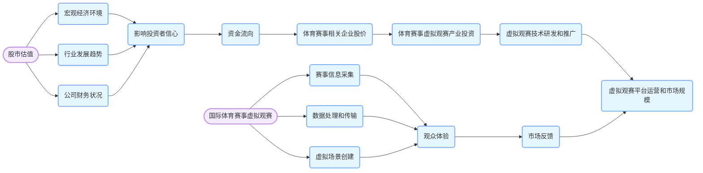

# 股市估值对国际体育赛事虚拟观赛的影响

> 关键词：股市估值、国际体育赛事、虚拟观赛、金融市场、体育科技

> 摘要：本文深入探讨了股市估值对国际体育赛事虚拟观赛的影响。首先介绍了研究的背景、目的、预期读者等信息，接着阐述了股市估值和国际体育赛事虚拟观赛的核心概念及联系。通过详细的算法原理和数学模型，分析两者之间可能存在的量化关系。结合项目实战案例，展示了如何从实际数据中分析这种影响。探讨了实际应用场景，并推荐了相关的学习资源、开发工具和研究论文。最后总结了未来发展趋势与挑战，解答了常见问题并提供了扩展阅读和参考资料，旨在为理解金融市场与体育科技领域的交叉影响提供全面而深入的视角。

## 1. 背景介绍 
### 1.1 目的和范围
本研究的主要目的是深入剖析股市估值与国际体育赛事虚拟观赛之间的内在联系，探究股市估值的波动如何影响国际体育赛事虚拟观赛的参与度、市场规模以及相关技术的发展。研究范围涵盖了全球主要金融市场的股市估值数据，以及各类国际知名体育赛事的虚拟观赛情况，包括虚拟观赛平台的用户数量、用户活跃度、市场收入等方面。

### 1.2 预期读者
本文预期读者包括金融领域的投资者、分析师，体育赛事运营方、虚拟观赛技术开发者，以及对金融与体育交叉领域感兴趣的学者和研究人员。金融投资者可以通过了解两者关系，为投资决策提供参考；体育赛事运营方可以根据股市估值变化调整虚拟观赛营销策略；虚拟观赛技术开发者则能更好地把握市场需求和发展方向。

### 1.3 文档结构概述
本文首先介绍研究背景相关信息，包括目的、读者和结构概述等。接着阐述股市估值和国际体育赛事虚拟观赛的核心概念，以及它们之间的联系，并通过流程图展示。然后详细讲解核心算法原理和具体操作步骤，给出数学模型和公式，并举例说明。之后通过项目实战案例，展示从开发环境搭建到代码实现和解读的全过程。探讨实际应用场景，推荐相关工具和资源。最后总结未来发展趋势与挑战，解答常见问题并提供扩展阅读和参考资料。

### 1.4 术语表
#### 1.4.1 核心术语定义
- **股市估值**：指对股票市场中上市公司价值的评估，通常通过市盈率（P/E）、市净率（P/B）等指标来衡量。它反映了市场对公司未来盈利和资产价值的预期。
- **国际体育赛事**：指在全球范围内具有广泛影响力的体育比赛，如奥运会、世界杯足球赛、NBA总决赛等。这些赛事吸引了大量观众和赞助商。
- **虚拟观赛**：利用虚拟现实（VR）、增强现实（AR）、3D直播等技术，让观众无需亲临现场，即可在虚拟环境中观看体育赛事的一种观赛方式。

#### 1.4.2 相关概念解释
- **市盈率（P/E）**：是指股票价格除以每股收益（EPS）的比率，反映了投资者为获取公司每一元盈利所愿意支付的价格。较高的市盈率通常意味着市场对公司未来盈利增长有较高预期。
- **市净率（P/B）**：是指股票价格与每股净资产的比率，用于衡量股票的估值是否合理。较低的市净率可能表示股票被低估。
- **虚拟现实（VR）**：通过计算机技术创建一个模拟的三维环境，让用户产生身临其境的感觉，常用于虚拟观赛中提供沉浸式的观赛体验。
- **增强现实（AR）**：将虚拟信息与现实场景相结合，在现实世界的基础上叠加虚拟元素，为用户提供更丰富的观赛体验。

#### 1.4.3 缩略词列表
- **P/E**：Price-to-Earnings Ratio，市盈率
- **P/B**：Price-to-Book Ratio，市净率
- **VR**：Virtual Reality，虚拟现实
- **AR**：Augmented Reality，增强现实

## 2. 核心概念与联系 

### 核心概念原理
#### 股市估值原理
股市估值是基于对上市公司的财务状况、行业前景、宏观经济环境等多方面因素的综合评估。市盈率（P/E）是最常用的估值指标之一，其计算公式为 $P/E=\frac{股价}{每股收益}$。市净率（P/B）则是用股价除以每股净资产，即 $P/B=\frac{股价}{每股净资产}$。这些指标反映了市场对公司未来盈利能力和资产价值的预期。当市场对公司前景乐观时，股价往往会上涨，市盈率和市净率也会相应提高；反之，当市场预期不佳时，估值指标会下降。

#### 国际体育赛事虚拟观赛原理
国际体育赛事虚拟观赛借助先进的信息技术，如VR、AR和3D直播等，将体育赛事的现场画面和相关信息进行采集、处理和传输，然后通过特定的设备（如VR头盔、手机APP等）呈现给观众。观众可以在虚拟环境中自由选择观赛视角、获取实时数据和互动体验，仿佛置身于现场。虚拟观赛不仅突破了时间和空间的限制，还为观众提供了更加个性化和丰富的观赛体验。

### 架构的文本示意图
```plaintext
股市估值
|
|--宏观经济环境（GDP、利率等）
|--行业发展趋势（体育产业、科技产业）
|--公司财务状况（盈利、资产等）
|
|--影响投资者信心和资金流向
|
|--影响体育赛事相关企业股价
|
|--影响体育赛事虚拟观赛产业投资
|
|--影响虚拟观赛技术研发和推广
|
|--影响虚拟观赛平台运营和市场规模
|
国际体育赛事虚拟观赛
|
|--赛事信息采集（摄像机、传感器等）
|--数据处理和传输（云计算、5G等）
|--虚拟场景创建（VR、AR技术）
|
|--观众体验（视角选择、互动等）
|
|--市场反馈（用户数量、收入等）
```

### Mermaid 流程图


## 3. 核心算法原理 & 具体操作步骤 

### 核心算法原理
我们可以使用线性回归算法来分析股市估值与国际体育赛事虚拟观赛市场规模之间的关系。线性回归是一种用于建立自变量和因变量之间线性关系的统计方法。假设股市估值指标（如市盈率、市净率）为自变量 $x$，虚拟观赛市场规模（如用户数量、收入）为因变量 $y$，则线性回归模型可以表示为 $y = \beta_0 + \beta_1x + \epsilon$，其中 $\beta_0$ 是截距，$\beta_1$ 是斜率，$\epsilon$ 是误差项。

### 具体操作步骤
#### 步骤 1：数据收集
收集全球主要金融市场的股市估值数据，包括市盈率、市净率等指标，以及国际体育赛事虚拟观赛的相关数据，如用户数量、市场收入等。数据可以从金融数据库（如 Bloomberg、Wind）、体育赛事官方网站和市场研究机构获取。

#### 步骤 2：数据预处理
对收集到的数据进行清洗和整理，去除缺失值和异常值。将数据按照时间序列进行排序，并进行标准化处理，以消除不同变量之间的量纲差异。

#### 步骤 3：模型训练
使用 Python 的 `scikit-learn` 库来实现线性回归模型。将处理后的数据分为训练集和测试集，一般按照 80:20 的比例进行划分。使用训练集数据来训练线性回归模型，得到模型的参数 $\beta_0$ 和 $\beta_1$。

#### 步骤 4：模型评估
使用测试集数据对训练好的模型进行评估，计算模型的均方误差（MSE）、决定系数（$R^2$）等指标，以评估模型的拟合效果和预测能力。

#### 步骤 5：结果分析
根据模型的参数和评估指标，分析股市估值与国际体育赛事虚拟观赛市场规模之间的关系。如果 $\beta_1$ 为正，则说明股市估值的提高与虚拟观赛市场规模的增长呈正相关；反之，则呈负相关。

### Python 源代码实现
```python
import numpy as np
from sklearn.linear_model import LinearRegression
from sklearn.model_selection import train_test_split
from sklearn.metrics import mean_squared_error, r2_score

# 示例数据
# 假设 x 是股市估值指标（市盈率），y 是虚拟观赛市场收入
x = np.array([10, 12, 15, 18, 20, 22, 25, 28, 30, 32]).reshape(-1, 1)
y = np.array([100, 120, 150, 180, 200, 220, 250, 280, 300, 320])

# 划分训练集和测试集
x_train, x_test, y_train, y_test = train_test_split(x, y, test_size=0.2, random_state=42)

# 创建线性回归模型
model = LinearRegression()

# 训练模型
model.fit(x_train, y_train)

# 预测测试集数据
y_pred = model.predict(x_test)

# 评估模型
mse = mean_squared_error(y_test, y_pred)
r2 = r2_score(y_test, y_pred)

# 输出结果
print(f"模型截距: {model.intercept_}")
print(f"模型斜率: {model.coef_[0]}")
print(f"均方误差: {mse}")
print(f"决定系数: {r2}")
```

## 4. 数学模型和公式 & 详细讲解 & 举例说明 

### 线性回归模型公式
线性回归模型的一般形式为 $y = \beta_0 + \beta_1x_1 + \beta_2x_2 + \cdots + \beta_nx_n + \epsilon$，其中 $y$ 是因变量，$x_1, x_2, \cdots, x_n$ 是自变量，$\beta_0, \beta_1, \cdots, \beta_n$ 是模型的参数，$\epsilon$ 是误差项。在我们的例子中，只有一个自变量 $x$（股市估值指标），所以模型简化为 $y = \beta_0 + \beta_1x + \epsilon$。

### 参数估计
线性回归模型的参数 $\beta_0$ 和 $\beta_1$ 可以通过最小二乘法来估计。最小二乘法的目标是使观测值 $y_i$ 与模型预测值 $\hat{y}_i = \beta_0 + \beta_1x_i$ 之间的误差平方和最小，即 $S(\beta_0, \beta_1) = \sum_{i=1}^{n}(y_i - \hat{y}_i)^2 = \sum_{i=1}^{n}(y_i - \beta_0 - \beta_1x_i)^2$ 最小。

对 $S(\beta_0, \beta_1)$ 分别求关于 $\beta_0$ 和 $\beta_1$ 的偏导数，并令其等于 0，可以得到以下方程组：
$$
\begin{cases}
\frac{\partial S}{\partial \beta_0} = -2\sum_{i=1}^{n}(y_i - \beta_0 - \beta_1x_i) = 0 \\
\frac{\partial S}{\partial \beta_1} = -2\sum_{i=1}^{n}(y_i - \beta_0 - \beta_1x_i)x_i = 0
\end{cases}
$$
解这个方程组，可以得到 $\beta_0$ 和 $\beta_1$ 的估计值：
$$
\hat{\beta}_1 = \frac{\sum_{i=1}^{n}(x_i - \bar{x})(y_i - \bar{y})}{\sum_{i=1}^{n}(x_i - \bar{x})^2}
$$
$$
\hat{\beta}_0 = \bar{y} - \hat{\beta}_1\bar{x}
$$
其中 $\bar{x}$ 和 $\bar{y}$ 分别是 $x$ 和 $y$ 的样本均值。

### 模型评估指标
#### 均方误差（MSE）
均方误差是预测值与真实值之间误差平方的平均值，计算公式为 $MSE = \frac{1}{n}\sum_{i=1}^{n}(y_i - \hat{y}_i)^2$。MSE 越小，说明模型的预测效果越好。

#### 决定系数（$R^2$）
决定系数表示模型对数据的拟合程度，取值范围在 0 到 1 之间。$R^2$ 越接近 1，说明模型对数据的拟合效果越好。计算公式为 $R^2 = 1 - \frac{\sum_{i=1}^{n}(y_i - \hat{y}_i)^2}{\sum_{i=1}^{n}(y_i - \bar{y})^2}$。

### 举例说明
假设我们收集了 10 个时期的股市市盈率数据 $x$ 和虚拟观赛市场收入数据 $y$，如下表所示：

| 时期 | 股市市盈率 ($x$) | 虚拟观赛市场收入 ($y$) |
|------|------------------|------------------------|
| 1    | 10               | 100                    |
| 2    | 12               | 120                    |
| 3    | 15               | 150                    |
| 4    | 18               | 180                    |
| 5    | 20               | 200                    |
| 6    | 22               | 220                    |
| 7    | 25               | 250                    |
| 8    | 28               | 280                    |
| 9    | 30               | 300                    |
| 10   | 32               | 320                    |

首先计算 $x$ 和 $y$ 的样本均值：
$$
\bar{x} = \frac{1}{10}(10 + 12 + 15 + 18 + 20 + 22 + 25 + 28 + 30 + 32) = 20
$$
$$
\bar{y} = \frac{1}{10}(100 + 120 + 150 + 180 + 200 + 220 + 250 + 280 + 300 + 320) = 200
$$

然后计算 $\hat{\beta}_1$：
$$
\sum_{i=1}^{10}(x_i - \bar{x})(y_i - \bar{y}) = (10 - 20)(100 - 200) + (12 - 20)(120 - 200) + \cdots + (32 - 20)(320 - 200) = 2000
$$
$$
\sum_{i=1}^{10}(x_i - \bar{x})^2 = (10 - 20)^2 + (12 - 20)^2 + \cdots + (32 - 20)^2 = 200
$$
$$
\hat{\beta}_1 = \frac{2000}{200} = 10
$$

再计算 $\hat{\beta}_0$：
$$
\hat{\beta}_0 = \bar{y} - \hat{\beta}_1\bar{x} = 200 - 10\times20 = 0
$$

所以线性回归模型为 $y = 0 + 10x$。

假设我们要预测当股市市盈率为 35 时的虚拟观赛市场收入，将 $x = 35$ 代入模型，得到 $\hat{y} = 10\times35 = 350$。

接下来计算模型的评估指标。假设我们将数据分为训练集和测试集，使用测试集数据计算得到预测值 $\hat{y}_i$，真实值为 $y_i$。假设测试集有 2 个数据点，$y_1 = 280$，$\hat{y}_1 = 285$，$y_2 = 320$，$\hat{y}_2 = 325$。

均方误差：
$$
MSE = \frac{1}{2}[(280 - 285)^2 + (320 - 325)^2] = 25
$$

决定系数：
首先计算 $\sum_{i=1}^{2}(y_i - \bar{y})^2 = (280 - 200)^2 + (320 - 200)^2 = 20800$，$\sum_{i=1}^{2}(y_i - \hat{y}_i)^2 = (280 - 285)^2 + (320 - 325)^2 = 50$。
$$
R^2 = 1 - \frac{50}{20800} \approx 0.9976
$$

这表明模型的拟合效果非常好，股市市盈率与虚拟观赛市场收入之间存在很强的线性关系。

## 5. 项目实战：代码实际案例和详细解释说明 

### 5.1  开发环境搭建
#### 操作系统
可以选择 Windows、Linux 或 macOS 操作系统，这里以 Windows 10 为例进行说明。

#### Python 安装
从 Python 官方网站（https://www.python.org/downloads/）下载 Python 3.8 或更高版本，并按照安装向导进行安装。安装过程中记得勾选 “Add Python to PATH” 选项，以便在命令行中可以直接使用 Python 命令。

#### 虚拟环境创建
为了避免不同项目之间的依赖冲突，建议使用虚拟环境。可以使用 `venv` 模块来创建虚拟环境。打开命令提示符，输入以下命令：
```sh
python -m venv stock_sports_env
```
这将在当前目录下创建一个名为 `stock_sports_env` 的虚拟环境。

#### 激活虚拟环境
在命令提示符中输入以下命令来激活虚拟环境：
```sh
stock_sports_env\Scripts\activate
```

#### 安装所需库
使用 `pip` 命令安装所需的库，包括 `numpy`、`pandas`、`scikit-learn`、`matplotlib` 等。输入以下命令：
```sh
pip install numpy pandas scikit-learn matplotlib
```

### 5.2  源代码详细实现和代码解读
```python
import numpy as np
import pandas as pd
from sklearn.linear_model import LinearRegression
from sklearn.model_selection import train_test_split
from sklearn.metrics import mean_squared_error, r2_score
import matplotlib.pyplot as plt

# 读取数据
data = pd.read_csv('stock_sports_data.csv')

# 提取自变量和因变量
x = data['stock_pe_ratio'].values.reshape(-1, 1)
y = data['virtual_viewing_revenue'].values

# 划分训练集和测试集
x_train, x_test, y_train, y_test = train_test_split(x, y, test_size=0.2, random_state=42)

# 创建线性回归模型
model = LinearRegression()

# 训练模型
model.fit(x_train, y_train)

# 预测测试集数据
y_pred = model.predict(x_test)

# 评估模型
mse = mean_squared_error(y_test, y_pred)
r2 = r2_score(y_test, y_pred)

# 输出结果
print(f"模型截距: {model.intercept_}")
print(f"模型斜率: {model.coef_[0]}")
print(f"均方误差: {mse}")
print(f"决定系数: {r2}")

# 可视化结果
plt.scatter(x_test, y_test, color='blue', label='Actual')
plt.plot(x_test, y_pred, color='red', linewidth=2, label='Predicted')
plt.xlabel('Stock P/E Ratio')
plt.ylabel('Virtual Viewing Revenue')
plt.title('Linear Regression: Stock P/E Ratio vs Virtual Viewing Revenue')
plt.legend()
plt.show()
```

### 代码解读与分析
#### 数据读取
```python
data = pd.read_csv('stock_sports_data.csv')
```
使用 `pandas` 库的 `read_csv` 函数读取存储股市估值和虚拟观赛市场收入数据的 CSV 文件。

#### 数据提取
```python
x = data['stock_pe_ratio'].values.reshape(-1, 1)
y = data['virtual_viewing_revenue'].values
```
从数据中提取自变量（股市市盈率）和因变量（虚拟观赛市场收入），并将自变量转换为二维数组，以满足 `scikit-learn` 模型的输入要求。

#### 数据划分
```python
x_train, x_test, y_train, y_test = train_test_split(x, y, test_size=0.2, random_state=42)
```
使用 `train_test_split` 函数将数据分为训练集和测试集，测试集占总数据的 20%。`random_state` 参数用于确保每次划分的结果一致。

#### 模型创建和训练
```python
model = LinearRegression()
model.fit(x_train, y_train)
```
创建线性回归模型，并使用训练集数据对模型进行训练。

#### 模型预测和评估
```python
y_pred = model.predict(x_test)
mse = mean_squared_error(y_test, y_pred)
r2 = r2_score(y_test, y_pred)
```
使用训练好的模型对测试集数据进行预测，并计算均方误差和决定系数来评估模型的性能。

#### 结果可视化
```python
plt.scatter(x_test, y_test, color='blue', label='Actual')
plt.plot(x_test, y_pred, color='red', linewidth=2, label='Predicted')
plt.xlabel('Stock P/E Ratio')
plt.ylabel('Virtual Viewing Revenue')
plt.title('Linear Regression: Stock P/E Ratio vs Virtual Viewing Revenue')
plt.legend()
plt.show()
```
使用 `matplotlib` 库绘制散点图和拟合直线，直观展示实际值和预测值之间的关系。

## 6. 实际应用场景 
### 金融投资决策
金融投资者可以根据股市估值与国际体育赛事虚拟观赛之间的关系，调整投资组合。当股市估值上升，预示着虚拟观赛产业可能有较好的发展前景时，投资者可以增加对相关企业的投资，如虚拟观赛技术开发商、体育赛事运营方等。相反，当股市估值下降时，可以减少相关投资，降低风险。

### 体育赛事运营策略制定
体育赛事运营方可以根据股市估值的变化，调整虚拟观赛的营销策略。在股市估值较高时，市场对体育赛事和虚拟观赛的关注度可能较高，运营方可以加大推广力度，推出更多的虚拟观赛套餐和优惠活动，吸引更多观众。在股市估值较低时，可以优化成本，提高虚拟观赛的性价比，以维持市场份额。

### 虚拟观赛技术研发方向调整
虚拟观赛技术开发者可以根据股市估值和市场反馈，调整技术研发方向。当股市估值上升，市场对虚拟观赛的需求增加时，开发者可以加大对新技术的研发投入，如更逼真的 VR 场景、更流畅的 3D 直播技术等。当股市估值下降时，可以注重现有技术的优化和成本控制，提高产品的竞争力。

### 政策制定参考
政府和相关监管部门可以参考股市估值与国际体育赛事虚拟观赛的关系，制定相关政策。例如，在股市估值较高，虚拟观赛产业发展迅速时，出台鼓励创新和规范市场的政策，促进产业的健康发展。在股市估值较低，产业面临困境时，提供扶持政策，帮助企业度过难关。

## 7. 工具和资源推荐
### 7.1 学习资源推荐
#### 7.1.1 书籍推荐
- 《金融市场与金融机构》：全面介绍了金融市场的基本概念、运作机制和金融机构的职能，有助于读者了解股市估值的背景和原理。
- 《体育经济学》：探讨了体育产业的经济规律和市场机制，对于理解体育赛事和虚拟观赛产业的经济现象有很大帮助。
- 《Python 数据分析实战》：详细介绍了使用 Python 进行数据分析的方法和技巧，包括数据处理、模型建立和可视化等方面，适合用于处理股市估值和虚拟观赛相关数据。

#### 7.1.2 在线课程
- Coursera 上的 “金融市场” 课程：由知名大学教授授课，深入讲解金融市场的理论和实践，包括股市估值的方法和应用。
- edX 上的 “体育管理与经济学” 课程：介绍了体育产业的管理和经济原理，以及如何在体育赛事中应用经济分析。
- 网易云课堂上的 “Python 数据分析入门” 课程：从基础开始，逐步引导学员掌握 Python 数据分析的技能，为分析股市估值和虚拟观赛数据提供技术支持。

#### 7.1.3 技术博客和网站
- 金融界（https://www.jrj.com.cn/）：提供丰富的金融市场资讯和数据分析，包括股市估值指标的实时更新和解读。
- 体育产业生态圈（https://www.ecosports.cn/）：专注于体育产业的新闻和分析，涵盖了国际体育赛事和虚拟观赛的最新动态。
- 开源中国（https://www.oschina.net/）：提供大量的技术文章和开源项目，对于学习 Python 数据分析和虚拟观赛技术有很大帮助。

### 7.2 开发工具框架推荐
#### 7.2.1 IDE和编辑器
- PyCharm：一款专业的 Python 集成开发环境，具有代码编辑、调试、自动补全、版本控制等功能，适合开发 Python 数据分析和机器学习项目。
- Jupyter Notebook：一个交互式的编程环境，支持 Python、R 等多种编程语言，方便进行数据探索、模型建立和可视化。
- Visual Studio Code：一款轻量级的代码编辑器，支持多种编程语言和插件扩展，可用于编写 Python 代码和进行数据分析。

#### 7.2.2 调试和性能分析工具
- Py-Spy：一个用于分析 Python 程序性能的工具，可以实时监控程序的 CPU 使用情况和函数调用时间，帮助开发者找出性能瓶颈。
- PDB：Python 自带的调试器，可以在代码中设置断点，逐步执行代码，查看变量的值和程序的执行流程。
- Memory Profiler：用于分析 Python 程序的内存使用情况，帮助开发者优化内存占用。

#### 7.2.3 相关框架和库
- Pandas：一个强大的数据处理和分析库，提供了丰富的数据结构和函数，方便进行数据清洗、整理和分析。
- NumPy：用于科学计算的基础库，提供了高效的多维数组对象和数学函数，是许多数据分析和机器学习库的基础。
- Scikit-learn：一个常用的机器学习库，提供了各种机器学习算法和工具，包括线性回归、决策树、聚类等，可用于建立股市估值和虚拟观赛关系的模型。

### 7.3 相关论文著作推荐
#### 7.3.1 经典论文
- “The Pricing of Options and Corporate Liabilities”（Black 和 Scholes，1973）：提出了著名的 Black-Scholes 期权定价模型，为金融市场的估值和风险管理提供了重要的理论基础。
- “The Economics of Professional Team Sports: A Survey of Theory and Evidence”（Fort 和 Quirk，1995）：对职业体育团队的经济理论和实证研究进行了全面的综述，为理解体育产业的经济现象提供了重要的参考。
- “A Mathematical Theory of Communication”（Shannon，1948）：奠定了信息论的基础，对于理解数据处理和传输在虚拟观赛中的应用有重要意义。

#### 7.3.2 最新研究成果
- 可以通过学术数据库（如 IEEE Xplore、ACM Digital Library、ScienceDirect 等）搜索关于股市估值、体育赛事和虚拟观赛的最新研究论文，了解该领域的前沿动态和研究方法。

#### 7.3.3 应用案例分析
- 一些知名的咨询公司（如麦肯锡、波士顿咨询集团等）会发布关于体育产业和金融市场的研究报告和应用案例分析，可以从中了解实际项目中如何应用相关理论和技术。

## 8. 总结：未来发展趋势与挑战
### 未来发展趋势
#### 技术融合加速
随着虚拟现实、增强现实、5G 通信、人工智能等技术的不断发展，国际体育赛事虚拟观赛将与这些技术深度融合，为观众带来更加沉浸式、个性化和互动性强的观赛体验。例如，通过 AI 技术实现实时的赛事数据统计和分析，并以可视化的方式呈现给观众；利用 5G 网络的高速低延迟特性，实现高清、流畅的 3D 直播。

#### 市场规模扩大
随着股市估值的波动和投资者对体育科技领域的关注度不断提高，国际体育赛事虚拟观赛市场将吸引更多的资金投入，推动市场规模不断扩大。同时，随着全球互联网普及率的提高和消费者对新型观赛方式的接受度增加，虚拟观赛的用户群体也将不断扩大。

#### 产业生态完善
国际体育赛事虚拟观赛产业将形成一个更加完善的生态系统，包括赛事运营方、技术开发商、内容提供商、平台运营商、观众等多个环节。各环节之间的合作将更加紧密，形成互利共赢的局面。例如，赛事运营方可以与技术开发商合作，共同开发更加先进的虚拟观赛技术；内容提供商可以为平台运营商提供丰富的赛事内容，吸引更多观众。

### 挑战
#### 技术瓶颈
尽管相关技术取得了很大进展，但在虚拟观赛的实际应用中，仍然存在一些技术瓶颈。例如，虚拟现实设备的佩戴舒适度、视觉效果和延迟问题，以及 3D 直播的画质和稳定性等问题，都需要进一步解决。

#### 市场竞争激烈
随着国际体育赛事虚拟观赛市场的发展，市场竞争将越来越激烈。不同的平台和企业需要不断创新和提高服务质量，以吸引更多的用户。同时，市场竞争也可能导致行业整合和洗牌，一些竞争力较弱的企业可能会被淘汰。

#### 法律法规不完善
国际体育赛事虚拟观赛涉及到版权保护、数据安全、用户隐私等多个方面的问题，目前相关的法律法规还不够完善。这可能会导致一些侵权和违法现象的发生，影响市场的健康发展。

#### 用户接受度差异
不同地区、不同年龄段和不同文化背景的用户对国际体育赛事虚拟观赛的接受度存在差异。一些用户可能习惯传统的观赛方式，对虚拟观赛的接受度较低。因此，如何提高用户对虚拟观赛的接受度，是一个需要解决的问题。

## 9. 附录：常见问题与解答
### 问题 1：股市估值与国际体育赛事虚拟观赛之间的关系一定是线性的吗？
不一定。虽然我们在本文中使用线性回归模型来分析两者之间的关系，但实际上这种关系可能是非线性的。股市估值对国际体育赛事虚拟观赛的影响可能受到多种因素的综合作用，如宏观经济环境、政策法规、技术创新等。在实际分析中，可以尝试使用非线性模型（如多项式回归、神经网络等）来更好地拟合数据。

### 问题 2：如何获取准确的股市估值和国际体育赛事虚拟观赛数据？
股市估值数据可以从金融数据库（如 Bloomberg、Wind、Yahoo Finance 等）获取，这些数据库提供了上市公司的财务报表、股价信息和估值指标等数据。国际体育赛事虚拟观赛数据可以从体育赛事官方网站、市场研究机构（如 Statista、Grand View Research 等）和相关的行业报告中获取。在获取数据时，需要注意数据的准确性和可靠性，对数据进行必要的清洗和预处理。

### 问题 3：虚拟观赛技术的发展会对传统体育赛事门票销售产生影响吗？
会有一定的影响。虚拟观赛技术的发展为观众提供了一种新的观赛方式，一些观众可能会选择在家中通过虚拟观赛的方式观看体育赛事，而不是前往现场购买门票。然而，传统体育赛事门票销售仍然具有不可替代的优势，如现场的氛围、与其他观众的互动等。因此，虚拟观赛技术的发展不会完全取代传统体育赛事门票销售，但可能会对门票销售的数量和价格产生一定的影响。

### 问题 4：如何评估虚拟观赛平台的用户体验？
可以从多个方面评估虚拟观赛平台的用户体验，包括画面质量、流畅度、操作便捷性、互动性、内容丰富度等。可以通过用户调查、用户反馈和数据分析等方式来收集用户的意见和建议，了解用户在使用过程中遇到的问题和满意度。同时，也可以参考一些专业的评测机构和媒体对虚拟观赛平台的评价。

### 问题 5：国际体育赛事虚拟观赛产业的发展对就业市场有什么影响？
国际体育赛事虚拟观赛产业的发展将创造更多的就业机会。一方面，技术研发领域需要大量的专业人才，如软件开发工程师、虚拟现实工程师、数据分析师等；另一方面，内容制作、运营管理、市场营销等领域也需要相应的人才。同时，虚拟观赛产业的发展还将带动相关产业链的发展，如硬件设备制造、通信服务等，进一步扩大就业市场。

## 10. 扩展阅读 & 参考资料
### 扩展阅读
- 《金融科技前沿：理论与实务》：深入探讨了金融科技领域的最新发展和应用，包括金融市场的数字化转型和创新，对于理解股市估值与科技产业的融合有很大帮助。
- 《体育科技前沿：创新与应用》：介绍了体育领域中各种科技的应用和发展趋势，如体育赛事的数字化运营、虚拟观赛技术的创新等，为进一步研究国际体育赛事虚拟观赛提供了更多的视角。
- 《大数据时代的金融风险管理》：阐述了在大数据背景下金融风险管理的方法和技术，对于分析股市估值波动对体育赛事虚拟观赛产业的风险影响有一定的参考价值。

### 参考资料
- Bloomberg 金融数据库：提供全球金融市场的实时数据和分析工具，包括股市估值指标、上市公司财务报表等。
- Statista 市场研究机构：提供各种行业的市场数据和研究报告，包括体育产业和虚拟观赛市场的相关数据。
- IEEE Xplore 学术数据库：收录了大量关于信息技术、通信技术和计算机科学的学术论文，对于研究虚拟观赛技术的发展有重要的参考价值。
- 国际体育赛事官方网站：如国际奥委会（https://olympics.com/）、国际足联（https://www.fifa.com/）等，提供了国际体育赛事的最新信息和相关数据。

作者：AI天才研究院/AI Genius Institute & 禅与计算机程序设计艺术 /Zen And The Art of Computer Programming