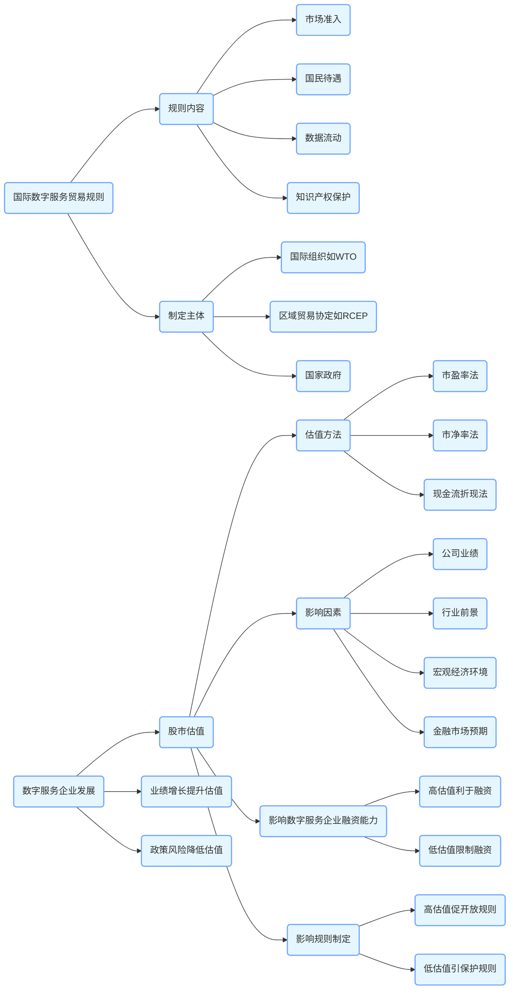

# 股市估值对国际数字服务贸易规则的影响

> 关键词：股市估值、国际数字服务贸易规则、金融市场、数字经济、贸易政策

> 摘要：本文深入探讨了股市估值对国际数字服务贸易规则的影响。通过对股市估值和国际数字服务贸易规则核心概念的剖析，阐述了两者之间的内在联系。详细讲解了相关的算法原理和数学模型，并结合实际案例分析了股市估值如何作用于国际数字服务贸易规则的制定与调整。同时，探讨了其在不同实际应用场景中的表现，推荐了相关的学习资源、开发工具和研究论文。最后，总结了未来的发展趋势与挑战，并对常见问题进行了解答。旨在为理解金融市场与数字服务贸易之间的复杂关系提供全面的视角。

## 1. 背景介绍 
### 1.1 目的和范围
本研究的目的在于深入探究股市估值与国际数字服务贸易规则之间的内在联系和相互影响机制。随着全球经济的数字化转型加速，数字服务贸易在国际贸易中的地位日益重要，而股市作为金融市场的核心组成部分，其估值变化反映了市场对企业和行业的预期。了解股市估值如何影响国际数字服务贸易规则，有助于政府、企业和投资者更好地把握数字服务贸易的发展趋势，制定合理的政策和战略。

本研究的范围涵盖了全球主要金融市场的股市估值情况，以及国际上主要的数字服务贸易规则制定机构和协议，如世界贸易组织（WTO）的相关协定、区域全面经济伙伴关系协定（RCEP）中的数字贸易章节等。同时，还将分析不同国家和地区在数字服务贸易规则制定中的差异和特点。

### 1.2 预期读者
本文预期读者包括金融市场从业者，如股票分析师、投资者等，他们可以通过了解股市估值与数字服务贸易规则的关系，更好地评估数字服务企业的投资价值和风险。国际贸易政策制定者能够从本文中获取关于金融市场因素对数字服务贸易规则影响的信息，为制定更合理的贸易政策提供参考。数字服务企业管理者可以借助本文的研究成果，更好地理解市场环境和政策动态，制定企业发展战略。此外，对数字经济和国际贸易领域感兴趣的学者和研究人员也可以从本文中获得有价值的研究思路和实证分析。

### 1.3 文档结构概述
本文将按照以下结构展开：首先介绍核心概念，包括股市估值和国际数字服务贸易规则的定义、特点和相互联系；接着阐述核心算法原理和具体操作步骤，通过Python代码详细说明如何进行相关分析；然后介绍数学模型和公式，并结合实际案例进行详细讲解；在项目实战部分，给出代码实际案例和详细解释说明，包括开发环境搭建、源代码实现和代码解读；之后探讨实际应用场景，分析股市估值对国际数字服务贸易规则在不同场景下的影响；推荐相关的工具和资源，包括学习资源、开发工具框架和研究论文；最后总结未来发展趋势与挑战，解答常见问题，并提供扩展阅读和参考资料。

### 1.4 术语表
#### 1.4.1 核心术语定义
- **股市估值**：指对股票市场中上市公司的价值进行评估的过程和结果。常用的估值方法包括市盈率（P/E）、市净率（P/B）、现金流折现法（DCF）等。股市估值反映了市场参与者对上市公司未来盈利能力、成长潜力和风险水平的预期。
- **国际数字服务贸易规则**：是指规范国际间数字服务贸易活动的一系列规则和制度安排。这些规则涉及数字服务的市场准入、国民待遇、数据流动、知识产权保护等方面，旨在促进数字服务贸易的自由化、便利化和公平竞争。

#### 1.4.2 相关概念解释
- **数字服务贸易**：是指通过信息通信技术（ICT）实现的服务贸易活动，包括软件服务、云计算服务、电子商务、数字内容服务等。数字服务贸易具有无形性、可远程交付、快速迭代等特点，与传统服务贸易和货物贸易存在明显差异。
- **金融市场预期**：是指市场参与者对未来金融市场走势、经济形势和企业业绩的预测和判断。金融市场预期会影响投资者的决策和资产价格的波动，进而对股市估值产生重要影响。

#### 1.4.3 缩略词列表
- **P/E**：市盈率（Price-to-Earnings Ratio）
- **P/B**：市净率（Price-to-Book Ratio）
- **DCF**：现金流折现法（Discounted Cash Flow）
- **WTO**：世界贸易组织（World Trade Organization）
- **RCEP**：区域全面经济伙伴关系协定（Regional Comprehensive Economic Partnership）

## 2. 核心概念与联系 
### 核心概念原理
#### 股市估值原理
股市估值的核心是确定上市公司的内在价值。不同的估值方法基于不同的原理：
- **市盈率（P/E）法**：市盈率是指股票价格与每股收益的比率。其原理是通过比较不同公司或同一公司在不同时期的市盈率，来评估股票的相对价值。一般来说，市盈率较高的股票可能被市场认为具有较高的成长潜力，但也可能存在估值过高的风险；反之，市盈率较低的股票可能被低估。
- **市净率（P/B）法**：市净率是指股票价格与每股净资产的比率。该方法的原理是认为股票的价值应该与其净资产相关。市净率较低的股票可能具有一定的投资价值，因为其价格相对净资产较低；但市净率也受到行业特点和公司资产质量的影响。
- **现金流折现法（DCF）**：现金流折现法是一种基于未来现金流的估值方法。其原理是将公司未来的预期现金流按照一定的折现率折现到当前时刻，得到公司的内在价值。该方法考虑了货币的时间价值和公司的长期发展前景，但对未来现金流的预测和折现率的选择具有一定的主观性。

#### 国际数字服务贸易规则原理
国际数字服务贸易规则的制定旨在平衡不同国家和地区的利益，促进数字服务贸易的健康发展。其原理主要包括以下几个方面：
- **市场准入原则**：确保各国开放数字服务市场，允许外国数字服务提供者进入本国市场，促进竞争和资源优化配置。
- **国民待遇原则**：要求各国给予外国数字服务提供者与本国服务提供者相同的待遇，避免歧视性政策。
- **数据流动规则**：规范数据的跨境流动，保障数据安全和隐私，同时促进数据的合理利用和共享。
- **知识产权保护规则**：保护数字服务领域的知识产权，鼓励创新和技术进步。

### 架构的文本示意图
```plaintext
股市估值
|-- 估值方法
|   |-- 市盈率法
|   |-- 市净率法
|   |-- 现金流折现法
|-- 影响因素
|   |-- 公司业绩
|   |-- 行业前景
|   |-- 宏观经济环境
|   |-- 金融市场预期

国际数字服务贸易规则
|-- 规则内容
|   |-- 市场准入
|   |-- 国民待遇
|   |-- 数据流动
|   |-- 知识产权保护
|-- 制定主体
|   |-- 国际组织（如WTO）
|   |-- 区域贸易协定（如RCEP）
|   |-- 国家政府

股市估值与国际数字服务贸易规则的联系
|-- 股市估值影响数字服务企业的融资能力
|   |-- 高估值利于企业融资，推动创新和扩张
|   |-- 低估值限制企业融资，影响发展战略
|-- 数字服务企业的发展影响股市估值
|   |-- 企业业绩增长提升股市估值
|   |-- 企业面临政策风险降低股市估值
|-- 股市估值影响国际数字服务贸易规则的制定
|   |-- 高估值促使规则更加开放和自由化
|   |-- 低估值引发保护主义规则的出台
```

### Mermaid 流程图


## 3. 核心算法原理 & 具体操作步骤 
### 市盈率法估值算法原理
市盈率法的基本公式为：

$$P = E \times P/E$$

其中，$P$ 表示股票价格，$E$ 表示每股收益，$P/E$ 表示市盈率。

具体操作步骤如下：
1. **获取每股收益（E）**：可以从上市公司的财务报表中获取每股收益数据。财务报表通常按季度或年度发布，需要根据研究目的选择合适的时间段。
2. **确定市盈率（P/E）**：市盈率可以参考同行业其他公司的平均市盈率，或者根据市场对该公司的预期进行调整。一般来说，可以通过金融数据提供商或证券分析软件获取同行业的平均市盈率数据。
3. **计算股票价格（P）**：将每股收益和市盈率代入公式，计算出股票的估值价格。

### Python 代码实现
```python
# 假设已知每股收益和同行业平均市盈率
earnings_per_share = 2.5  # 每股收益
industry_pe_ratio = 20    # 同行业平均市盈率

# 计算股票估值价格
stock_price = earnings_per_share * industry_pe_ratio

print(f"股票估值价格为: {stock_price} 元")
```

### 市净率法估值算法原理
市净率法的基本公式为：

$$P = B \times P/B$$

其中，$P$ 表示股票价格，$B$ 表示每股净资产，$P/B$ 表示市净率。

具体操作步骤如下：
1. **获取每股净资产（B）**：每股净资产可以从上市公司的资产负债表中获取。同样，需要根据研究目的选择合适的时间段。
2. **确定市净率（P/B）**：市净率可以参考同行业其他公司的平均市净率，或者根据公司的资产质量和市场预期进行调整。可以通过金融数据提供商或证券分析软件获取同行业的平均市净率数据。
3. **计算股票价格（P）**：将每股净资产和市净率代入公式，计算出股票的估值价格。

### Python 代码实现
```python
# 假设已知每股净资产和同行业平均市净率
book_value_per_share = 10  # 每股净资产
industry_pb_ratio = 1.5    # 同行业平均市净率

# 计算股票估值价格
stock_price = book_value_per_share * industry_pb_ratio

print(f"股票估值价格为: {stock_price} 元")
```

### 现金流折现法估值算法原理
现金流折现法的基本公式为：

$$V = \sum_{t=1}^{n} \frac{CF_t}{(1 + r)^t} + \frac{TV}{(1 + r)^n}$$

其中，$V$ 表示公司的内在价值，$CF_t$ 表示第 $t$ 期的预期现金流，$r$ 表示折现率，$n$ 表示预测期数，$TV$ 表示终值。

具体操作步骤如下：
1. **预测未来现金流（$CF_t$）**：需要对公司未来的经营情况进行分析和预测，确定每一期的预期现金流。这通常需要考虑公司的业务模式、市场需求、竞争态势等因素。
2. **确定折现率（$r$）**：折现率反映了投资者对资金时间价值和投资风险的要求。可以使用资本资产定价模型（CAPM）等方法来确定折现率。
3. **确定预测期数（$n$）**：预测期数的选择取决于公司的发展阶段和行业特点。一般来说，可以选择 5 - 10 年作为预测期。
4. **计算终值（$TV$）**：终值表示预测期结束后公司的价值。可以使用永续增长模型等方法来计算终值。
5. **计算公司内在价值（$V$）**：将各期现金流和终值按照折现率折现到当前时刻，求和得到公司的内在价值。

### Python 代码实现
```python
import numpy as np

# 假设已知未来 5 年的预期现金流、折现率和终值
cash_flows = [100, 120, 140, 160, 180]  # 未来 5 年的预期现金流
discount_rate = 0.1  # 折现率
terminal_value = 2000  # 终值

# 计算各期现金流的现值
present_values = []
for t, cf in enumerate(cash_flows, start=1):
    pv = cf / (1 + discount_rate) ** t
    present_values.append(pv)

# 计算终值的现值
terminal_value_pv = terminal_value / (1 + discount_rate) ** len(cash_flows)

# 计算公司内在价值
company_value = np.sum(present_values) + terminal_value_pv

print(f"公司内在价值为: {company_value} 元")
```

## 4. 数学模型和公式 & 详细讲解 & 举例说明 
### 市盈率法数学模型
市盈率法的数学模型为：

$$P = E \times P/E$$

详细讲解：
- $P$ 表示股票的估值价格，它是我们最终要计算的结果。
- $E$ 表示每股收益，是公司净利润除以总股本得到的值。每股收益反映了公司的盈利能力，是衡量公司业绩的重要指标之一。
- $P/E$ 表示市盈率，它是市场对公司盈利能力的预期。市盈率越高，说明市场对公司未来的盈利增长预期越高；反之，市盈率越低，说明市场对公司的预期较低。

举例说明：
假设某公司的每股收益为 3 元，同行业的平均市盈率为 25 倍。则该公司股票的估值价格为：

$$P = 3 \times 25 = 75 \text{ 元}$$

这意味着根据市盈率法，该公司股票的合理价格应该为 75 元。

### 市净率法数学模型
市净率法的数学模型为：

$$P = B \times P/B$$

详细讲解：
- $P$ 表示股票的估值价格。
- $B$ 表示每股净资产，是公司净资产除以总股本得到的值。每股净资产反映了公司的资产实力和股东权益。
- $P/B$ 表示市净率，它反映了市场对公司资产质量和未来发展潜力的预期。市净率大于 1 表示市场对公司的估值高于其净资产；市净率小于 1 表示市场对公司的估值低于其净资产。

举例说明：
假设某公司的每股净资产为 15 元，同行业的平均市净率为 1.8 倍。则该公司股票的估值价格为：

$$P = 15 \times 1.8 = 27 \text{ 元}$$

即根据市净率法，该公司股票的合理价格为 27 元。

### 现金流折现法数学模型
现金流折现法的数学模型为：

$$V = \sum_{t=1}^{n} \frac{CF_t}{(1 + r)^t} + \frac{TV}{(1 + r)^n}$$

详细讲解：
- $V$ 表示公司的内在价值，即公司未来现金流的现值总和。
- $\sum_{t=1}^{n} \frac{CF_t}{(1 + r)^t}$ 表示预测期内各期现金流的现值之和。其中，$CF_t$ 表示第 $t$ 期的预期现金流，$r$ 表示折现率，$n$ 表示预测期数。
- $\frac{TV}{(1 + r)^n}$ 表示终值的现值。终值是指预测期结束后公司的价值，通常使用永续增长模型等方法计算。

举例说明：
假设某公司未来 5 年的预期现金流分别为 100 万元、120 万元、140 万元、160 万元和 180 万元，折现率为 10%，预测期结束后的终值为 2000 万元。则该公司的内在价值计算如下：

首先，计算各期现金流的现值：

- 第 1 年：$PV_1 = \frac{100}{(1 + 0.1)^1} \approx 90.91$ 万元
- 第 2 年：$PV_2 = \frac{120}{(1 + 0.1)^2} \approx 99.17$ 万元
- 第 3 年：$PV_3 = \frac{140}{(1 + 0.1)^3} \approx 105.18$ 万元
- 第 4 年：$PV_4 = \frac{160}{(1 + 0.1)^4} \approx 109.28$ 万元
- 第 5 年：$PV_5 = \frac{180}{(1 + 0.1)^5} \approx 111.77$ 万元

然后，计算终值的现值：

$PV_{TV} = \frac{2000}{(1 + 0.1)^5} \approx 1241.84$ 万元

最后，计算公司的内在价值：

$V = 90.91 + 99.17 + 105.18 + 109.28 + 111.77 + 1241.84 = 1758.15$ 万元

即根据现金流折现法，该公司的内在价值约为 1758.15 万元。

## 5. 项目实战：代码实际案例和详细解释说明 
### 5.1  开发环境搭建
#### 操作系统
本项目可以在 Windows、Linux 或 macOS 操作系统上进行开发。建议使用较新的操作系统版本，以确保兼容性和稳定性。

#### Python 环境
需要安装 Python 3.x 版本。可以从 Python 官方网站（https://www.python.org/downloads/）下载并安装适合自己操作系统的 Python 版本。安装完成后，建议使用虚拟环境来管理项目的依赖包，避免不同项目之间的包冲突。可以使用 `venv` 模块来创建虚拟环境，具体命令如下：

```bash
# 创建虚拟环境
python -m venv myenv

# 激活虚拟环境
# Windows
myenv\Scripts\activate
# Linux/macOS
source myenv/bin/activate
```

#### 依赖包安装
本项目需要使用一些 Python 库，如 `numpy`、`pandas` 等。可以使用 `pip` 命令来安装这些依赖包：

```bash
pip install numpy pandas
```

### 5.2  源代码详细实现和代码解读
#### 数据获取
假设我们从一个 CSV 文件中获取某公司的财务数据，包括每股收益、每股净资产等信息。以下是获取数据的代码：

```python
import pandas as pd

# 读取 CSV 文件
data = pd.read_csv('financial_data.csv')

# 提取每股收益和每股净资产数据
earnings_per_share = data['earnings_per_share'].values
book_value_per_share = data['book_value_per_share'].values

print("每股收益数据:", earnings_per_share)
print("每股净资产数据:", book_value_per_share)
```

代码解读：
- `pd.read_csv('financial_data.csv')`：使用 `pandas` 库的 `read_csv` 函数读取 CSV 文件，并将数据存储在 `data` 变量中。
- `data['earnings_per_share'].values` 和 `data['book_value_per_share'].values`：从数据中提取每股收益和每股净资产列，并将其转换为 `numpy` 数组。

#### 市盈率法估值计算
```python
# 假设同行业平均市盈率为 20
industry_pe_ratio = 20

# 计算股票估值价格
stock_prices_pe = earnings_per_share * industry_pe_ratio

print("市盈率法计算的股票估值价格:", stock_prices_pe)
```

代码解读：
- `industry_pe_ratio = 20`：设定同行业平均市盈率为 20。
- `earnings_per_share * industry_pe_ratio`：将每股收益乘以市盈率，计算出股票的估值价格。

#### 市净率法估值计算
```python
# 假设同行业平均市净率为 1.5
industry_pb_ratio = 1.5

# 计算股票估值价格
stock_prices_pb = book_value_per_share * industry_pb_ratio

print("市净率法计算的股票估值价格:", stock_prices_pb)
```

代码解读：
- `industry_pb_ratio = 1.5`：设定同行业平均市净率为 1.5。
- `book_value_per_share * industry_pb_ratio`：将每股净资产乘以市净率，计算出股票的估值价格。

### 5.3  代码解读与分析
通过以上代码，我们实现了从数据获取到股票估值计算的整个流程。首先，使用 `pandas` 库读取 CSV 文件，获取公司的财务数据。然后，分别使用市盈率法和市净率法计算股票的估值价格。

在实际应用中，需要注意以下几点：
- **数据质量**：财务数据的准确性和可靠性对估值结果有重要影响。因此，需要确保数据来源的可靠性，并对数据进行清洗和预处理。
- **行业平均比率的选择**：同行业平均市盈率和市净率是估值计算的重要参数。需要选择合适的行业范围和时间区间来确定这些比率，以反映市场的真实情况。
- **多种估值方法结合**：单一的估值方法可能存在局限性，建议结合多种估值方法进行综合分析，以提高估值的准确性。

## 6. 实际应用场景 
### 企业融资决策
股市估值对数字服务企业的融资决策具有重要影响。当股市估值较高时，数字服务企业可以通过发行股票等方式以较高的价格筹集资金，从而获得更多的资金用于研发、扩张和市场推广等活动。例如，一家新兴的数字服务企业在股市估值较高的情况下，成功发行了新股，筹集了大量资金，用于开发新的数字服务产品和拓展国际市场。相反，当股市估值较低时，企业的融资成本会增加，融资难度也会加大，可能会影响企业的发展战略和扩张计划。

### 国际数字服务贸易规则制定
股市估值的变化会影响国际数字服务贸易规则的制定。当数字服务企业的股市估值普遍较高时，说明市场对数字服务行业的发展前景看好，这会促使各国政府和国际组织制定更加开放和自由化的数字服务贸易规则，以促进数字服务贸易的发展。例如，一些国家会降低数字服务市场的准入门槛，放宽数据流动限制等。反之，当股市估值较低时，可能会引发保护主义情绪，各国政府可能会出台一些保护本国数字服务企业的贸易规则，如提高关税、设置贸易壁垒等。

### 投资者决策
投资者在进行数字服务企业的投资决策时，会参考股市估值情况。高估值的数字服务企业可能具有较高的成长潜力，但也伴随着较高的风险；低估值的企业可能被市场低估，但也可能存在业绩不佳等问题。投资者需要综合考虑股市估值、企业基本面、行业前景等因素，做出合理的投资决策。例如，投资者在分析一家数字服务企业的股票时，会结合市盈率、市净率等估值指标，以及企业的市场份额、技术实力、管理团队等因素，判断该股票是否具有投资价值。

### 行业竞争格局调整
股市估值的变化会影响数字服务行业的竞争格局。高估值的企业更容易获得资金支持，从而加大研发投入和市场推广力度，进一步扩大市场份额，增强竞争力。而低估值的企业可能面临资金短缺的问题，发展受到限制，甚至可能被市场淘汰。例如，在数字服务行业中，一些高估值的头部企业通过不断创新和扩张，逐渐占据了市场的主导地位；而一些低估值的中小企业则面临着生存压力，需要寻找差异化的发展路径。

## 7. 工具和资源推荐
### 7.1 学习资源推荐
#### 7.1.1 书籍推荐
- 《金融市场与金融机构》：本书全面介绍了金融市场和金融机构的基本概念、运作机制和发展趋势，对于理解股市估值和金融市场有很大帮助。
- 《数字经济：新经济时代的变革与机遇》：深入探讨了数字经济的发展现状、技术应用和政策环境，有助于了解数字服务贸易的相关知识。
- 《投资学》：详细讲解了投资的基本理论、方法和策略，对于投资者进行数字服务企业的投资决策具有重要指导意义。

#### 7.1.2 在线课程
- Coursera 上的“金融市场”课程：由知名大学教授授课，系统介绍了金融市场的基础知识和分析方法。
- edX 上的“数字经济与创新”课程：聚焦数字经济领域，探讨数字服务贸易的发展趋势和创新模式。
- Udemy 上的“股票估值与投资分析”课程：提供了实用的股票估值方法和投资分析技巧。

#### 7.1.3 技术博客和网站
- 雪球网：国内知名的财经社区，提供丰富的股票分析和投资讨论内容。
- 东方财富网：提供全面的金融市场数据和资讯，包括股市行情、公司财报等。
- 艾瑞咨询：专注于互联网和数字经济领域的研究，发布了大量关于数字服务贸易的研究报告和分析文章。

### 7.2 开发工具框架推荐
#### 7.2.1 IDE和编辑器
- PyCharm：专业的 Python 集成开发环境，具有代码编辑、调试、版本控制等功能，适合开发股票估值和数据分析相关的 Python 程序。
- Jupyter Notebook：交互式的开发环境，支持 Python 代码的编写、运行和可视化展示，方便进行数据探索和分析。

#### 7.2.2 调试和性能分析工具
- pdb：Python 自带的调试工具，可以帮助开发者定位代码中的错误和问题。
- cProfile：Python 的性能分析工具，可以分析代码的运行时间和资源消耗情况，优化代码性能。

#### 7.2.3 相关框架和库
- pandas：强大的数据处理和分析库，提供了丰富的数据结构和函数，方便进行财务数据的处理和分析。
- numpy：用于科学计算的基础库，提供了高效的数组操作和数学函数，在股票估值计算中经常使用。
- matplotlib：常用的绘图库，可以绘制各种类型的图表，直观展示数据和分析结果。

### 7.3 相关论文著作推荐
#### 7.3.1 经典论文
- “The Capital Asset Pricing Model: Theory and Evidence”：该论文详细阐述了资本资产定价模型（CAPM）的理论和实证研究，对于理解股票估值中的折现率确定具有重要意义。
- “Digital Trade and Development: A Roadmap for Developing Countries”：探讨了数字贸易对发展中国家的影响和发展路径，为研究国际数字服务贸易规则提供了理论基础。

#### 7.3.2 最新研究成果
- 国际货币基金组织（IMF）发布的关于数字经济和金融市场的研究报告，反映了最新的研究动态和政策建议。
- 世界银行关于数字服务贸易的研究成果，分析了数字服务贸易的发展趋势和政策挑战。

#### 7.3.3 应用案例分析
- 一些知名咨询公司发布的关于数字服务企业的案例分析报告，如麦肯锡、波士顿咨询等，提供了实际企业在股市估值和国际数字服务贸易中的经验和教训。

## 8. 总结：未来发展趋势与挑战
### 未来发展趋势
#### 数字化转型加速
随着信息技术的不断发展和普及，全球经济的数字化转型将进一步加速。数字服务贸易在国际贸易中的比重将继续上升，股市对数字服务企业的估值也将更加关注其数字化创新能力和技术实力。

#### 规则协调与统一
为了促进数字服务贸易的健康发展，各国政府和国际组织将加强在数字服务贸易规则制定方面的协调与合作，推动规则的统一和标准化。这将有助于降低贸易壁垒，提高数字服务贸易的效率和便利性。

#### 金融科技融合
金融科技的发展将为股市估值和数字服务贸易带来新的机遇和挑战。例如，区块链技术可以提高金融交易的透明度和安全性，人工智能和大数据分析可以为股市估值和贸易决策提供更准确的信息和预测。

### 挑战
#### 数据安全和隐私保护
数字服务贸易涉及大量的数据流动和存储，数据安全和隐私保护成为重要的挑战。各国政府和企业需要加强数据安全管理和隐私保护措施，制定相关的法律法规和标准，以应对日益增长的数据安全威胁。

#### 贸易保护主义抬头
在全球经济不确定性增加的背景下，贸易保护主义可能会抬头。一些国家可能会出台更多的保护主义政策，限制数字服务贸易的发展，这将对股市估值和数字服务企业的发展带来不利影响。

#### 技术创新和人才短缺
数字服务行业的快速发展需要不断的技术创新和高素质的人才支持。然而，目前技术创新的速度和人才培养的规模可能无法满足行业的需求，这将成为制约数字服务贸易和股市估值发展的瓶颈。

## 9. 附录：常见问题与解答
### 问题 1：股市估值对国际数字服务贸易规则的影响是直接的还是间接的？
解答：股市估值对国际数字服务贸易规则的影响既有直接的也有间接的。直接影响体现在当股市估值较高时，数字服务企业的实力和影响力增强，会促使政府和国际组织制定更加有利于数字服务贸易发展的规则；反之，低估值可能引发保护主义规则的出台。间接影响则通过影响数字服务企业的融资、发展和竞争格局，进而影响政府和国际组织对数字服务贸易规则的制定决策。

### 问题 2：如何准确计算股市估值？
解答：股市估值的计算方法有多种，如市盈率法、市净率法、现金流折现法等。但每种方法都有其局限性，且受到多种因素的影响，如公司业绩、行业前景、宏观经济环境等。为了准确计算股市估值，需要综合运用多种方法，并结合对公司基本面和市场环境的深入分析。同时，还需要及时更新数据和调整参数，以反映市场的变化。

### 问题 3：国际数字服务贸易规则的变化会对股市估值产生什么影响？
解答：国际数字服务贸易规则的变化会对数字服务企业的经营环境和发展前景产生影响，从而影响股市估值。如果规则更加开放和自由化，有利于数字服务企业拓展国际市场，提高业绩和竞争力，进而提升股市估值；反之，如果规则趋于保护主义，企业的市场空间和发展机会受到限制，股市估值可能会下降。

### 问题 4：在实际应用中，如何平衡股市估值和国际数字服务贸易规则的关系？
解答：在实际应用中，需要政府、企业和投资者共同努力来平衡股市估值和国际数字服务贸易规则的关系。政府应制定合理的贸易政策和监管措施，促进数字服务贸易的健康发展，同时关注股市的稳定运行。企业应加强自身的核心竞争力，适应国际数字服务贸易规则的变化，提高股市估值。投资者应理性看待股市估值，结合国际数字服务贸易规则的变化进行投资决策。

## 10. 扩展阅读 & 参考资料
### 扩展阅读
- 《区块链与数字经济》：探讨了区块链技术在数字经济中的应用和发展前景，与数字服务贸易和股市估值有一定的关联。
- 《人工智能时代的金融创新》：介绍了人工智能技术在金融领域的应用，包括股市估值和投资分析等方面。

### 参考资料
- World Trade Organization. World Trade Report 2021: Economic Resilience and Trade.
- International Monetary Fund. Global Financial Stability Report.
- McKinsey Global Institute. Digital globalization: The new era of global flows.

作者：AI天才研究院/AI Genius Institute & 禅与计算机程序设计艺术 /Zen And The Art of Computer Programming