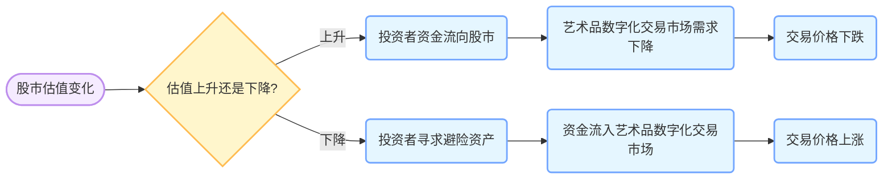

# 股市估值对国际艺术品数字化交易的影响

> 关键词：股市估值、国际艺术品数字化交易、市场关联、投资决策、经济周期

> 摘要：本文旨在深入探讨股市估值对国际艺术品数字化交易的影响。通过对相关核心概念的剖析，明确股市估值与艺术品数字化交易的内在联系。运用数学模型和算法原理，分析两者之间的量化关系。结合实际案例，详细阐述在不同股市估值环境下艺术品数字化交易的表现。同时，介绍相关工具和资源，为从业者和研究者提供参考。最后，总结未来发展趋势与挑战，为该领域的进一步发展提供方向。

## 1. 背景介绍 
### 1.1 目的和范围
本研究的目的在于全面揭示股市估值与国际艺术品数字化交易之间的关系。具体范围涵盖了不同国家和地区的股市估值情况，以及国际艺术品数字化交易市场的各个环节，包括艺术品的数字化展示、交易平台的运作、投资者的参与等。通过对这些方面的研究，为投资者、艺术品交易平台和监管机构提供决策依据。

### 1.2 预期读者
本文预期读者包括金融投资者、艺术品交易从业者、学术研究人员以及对金融市场和艺术品市场感兴趣的人士。对于投资者来说，了解股市估值对艺术品数字化交易的影响有助于优化投资组合；对于从业者而言，可据此调整经营策略；对于研究人员，能为相关学术研究提供参考。

### 1.3 文档结构概述
本文首先介绍相关背景知识，包括研究目的、预期读者和文档结构。接着阐述核心概念与联系，通过文本示意图和 Mermaid 流程图展示股市估值与艺术品数字化交易的关系。然后详细讲解核心算法原理和具体操作步骤，并给出 Python 代码示例。随后介绍数学模型和公式，结合实际例子进行说明。在项目实战部分，通过实际案例展示代码实现和解读。之后探讨实际应用场景，推荐相关工具和资源。最后总结未来发展趋势与挑战，提供常见问题解答和扩展阅读资料。

### 1.4 术语表
#### 1.4.1 核心术语定义
- **股市估值**：指对股票市场整体或个别股票的价值进行评估的过程和结果，常用的估值指标包括市盈率（P/E）、市净率（P/B）等。
- **国际艺术品数字化交易**：将艺术品以数字化形式进行展示、存储和交易的过程，借助互联网和区块链等技术，实现艺术品交易的全球化和高效化。
- **艺术品数字化**：通过扫描、摄影等技术手段，将艺术品转化为数字图像或数据的过程，以便于在网络上进行传播和交易。

#### 1.4.2 相关概念解释
- **区块链技术**：一种去中心化的分布式账本技术，具有不可篡改、可追溯等特点，在艺术品数字化交易中可用于确保艺术品的真伪和交易记录的安全性。
- **金融市场联动性**：不同金融市场之间存在的相互影响和关联关系，股市估值的变化可能会通过资金流动、投资者情绪等因素影响其他金融市场，包括艺术品数字化交易市场。

#### 1.4.3 缩略词列表
- **P/E**：市盈率（Price-to-Earnings Ratio）
- **P/B**：市净率（Price-to-Book Ratio）
- **NFT**：非同质化代币（Non-Fungible Token），用于表示数字资产的唯一所有权。

## 2. 核心概念与联系 

### 核心概念原理
股市估值反映了市场对股票未来盈利能力的预期，是投资者判断股票是否具有投资价值的重要依据。当股市估值较高时，意味着市场对股票的预期收益较高，投资者可能更倾向于将资金投入股市；反之，当股市估值较低时，投资者可能会寻找其他投资机会。

国际艺术品数字化交易则是艺术品市场与数字技术相结合的产物。数字化技术使得艺术品的展示和交易更加便捷，降低了交易成本，扩大了交易范围。同时，区块链技术的应用为艺术品的真伪鉴定和交易记录提供了保障。

### 架构的文本示意图
股市估值与国际艺术品数字化交易之间存在着复杂的联系。股市估值的变化会影响投资者的资金分配和投资偏好，进而影响艺术品数字化交易市场的资金流入和流出。具体来说，当股市估值上升时，投资者可能会将资金从艺术品市场转移到股市，导致艺术品数字化交易市场的需求下降；反之，当股市估值下降时，投资者可能会寻求避险资产，艺术品作为一种具有保值和增值潜力的资产，可能会吸引更多的资金流入，从而推动艺术品数字化交易市场的发展。

### Mermaid 流程图


## 3. 核心算法原理 & 具体操作步骤 

### 算法原理
为了分析股市估值对国际艺术品数字化交易的影响，我们可以采用回归分析的方法。回归分析是一种统计方法，用于研究自变量（股市估值）与因变量（艺术品数字化交易价格或交易量）之间的关系。具体来说，我们可以建立一个线性回归模型：

$$y = \beta_0 + \beta_1x + \epsilon$$

其中，$y$ 表示艺术品数字化交易的价格或交易量，$x$ 表示股市估值指标（如市盈率），$\beta_0$ 是截距项，$\beta_1$ 是斜率项，$\epsilon$ 是误差项。

### Python 代码实现
```python
import numpy as np
import pandas as pd
import statsmodels.api as sm

# 生成示例数据
np.random.seed(0)
n = 100
# 模拟股市估值数据
stock_valuation = np.random.randn(n)
# 模拟艺术品数字化交易价格数据
art_price = 2 + 1.5 * stock_valuation + np.random.randn(n)

# 构建数据框
data = pd.DataFrame({'StockValuation': stock_valuation, 'ArtPrice': art_price})

# 定义自变量和因变量
X = data['StockValuation']
y = data['ArtPrice']

# 添加常数项
X = sm.add_constant(X)

# 拟合线性回归模型
model = sm.OLS(y, X).fit()

# 打印回归结果
print(model.summary())
```

### 具体操作步骤
1. **数据收集**：收集股市估值指标（如市盈率、市净率等）和艺术品数字化交易的价格或交易量数据。数据可以从金融数据提供商、艺术品交易平台等渠道获取。
2. **数据预处理**：对收集到的数据进行清洗、整理和标准化处理，以确保数据的质量和一致性。
3. **模型构建**：根据上述算法原理，构建线性回归模型。
4. **模型拟合**：使用收集到的数据对模型进行拟合，估计模型的参数（截距项和斜率项）。
5. **模型评估**：评估模型的拟合优度、显著性等指标，判断模型的有效性。
6. **结果分析**：根据模型的参数估计结果，分析股市估值对艺术品数字化交易的影响程度和方向。

## 4. 数学模型和公式 & 详细讲解 & 举例说明 

### 线性回归模型
如前所述，线性回归模型的一般形式为：

$$y = \beta_0 + \beta_1x + \epsilon$$

其中，$y$ 是因变量，$x$ 是自变量，$\beta_0$ 是截距项，表示当自变量 $x$ 为 0 时，因变量 $y$ 的取值；$\beta_1$ 是斜率项，表示自变量 $x$ 每变化一个单位，因变量 $y$ 的平均变化量；$\epsilon$ 是误差项，表示模型无法解释的随机误差。

### 模型参数估计
为了估计模型的参数 $\beta_0$ 和 $\beta_1$，我们通常采用最小二乘法。最小二乘法的目标是使观测值与模型预测值之间的误差平方和最小，即：

$$\min_{\beta_0, \beta_1} \sum_{i=1}^{n} (y_i - \beta_0 - \beta_1x_i)^2$$

通过求解上述优化问题，可以得到参数的估计值：

$$\hat{\beta}_1 = \frac{\sum_{i=1}^{n} (x_i - \bar{x})(y_i - \bar{y})}{\sum_{i=1}^{n} (x_i - \bar{x})^2}$$

$$\hat{\beta}_0 = \bar{y} - \hat{\beta}_1\bar{x}$$

其中，$\bar{x}$ 和 $\bar{y}$ 分别是自变量和因变量的样本均值。

### 举例说明
假设我们收集了某段时间内的股市市盈率（$x$）和艺术品数字化交易价格（$y$）的数据，如下表所示：

| 股市市盈率（$x$） | 艺术品数字化交易价格（$y$） |
| --- | --- |
| 10 | 200 |
| 12 | 220 |
| 14 | 240 |
| 16 | 260 |
| 18 | 280 |

首先，计算样本均值：

$$\bar{x} = \frac{10 + 12 + 14 + 16 + 18}{5} = 14$$

$$\bar{y} = \frac{200 + 220 + 240 + 260 + 280}{5} = 240$$

然后，计算 $\hat{\beta}_1$：

$$\sum_{i=1}^{5} (x_i - \bar{x})(y_i - \bar{y}) = (10 - 14)(200 - 240) + (12 - 14)(220 - 240) + (14 - 14)(240 - 240) + (16 - 14)(260 - 240) + (18 - 14)(280 - 240) = 400$$

$$\sum_{i=1}^{5} (x_i - \bar{x})^2 = (10 - 14)^2 + (12 - 14)^2 + (14 - 14)^2 + (16 - 14)^2 + (18 - 14)^2 = 40$$

$$\hat{\beta}_1 = \frac{400}{40} = 10$$

最后，计算 $\hat{\beta}_0$：

$$\hat{\beta}_0 = \bar{y} - \hat{\beta}_1\bar{x} = 240 - 10 \times 14 = 100$$

因此，得到的线性回归模型为：

$$y = 100 + 10x$$

这意味着股市市盈率每增加 1，艺术品数字化交易价格平均增加 10。

## 5. 项目实战：代码实际案例和详细解释说明 

### 5.1  开发环境搭建
- **Python 安装**：确保已经安装了 Python 3.x 版本。可以从 Python 官方网站（https://www.python.org/downloads/）下载并安装。
- **必要库安装**：使用以下命令安装所需的库：
```sh
pip install numpy pandas statsmodels
```

### 5.2  源代码详细实现和代码解读
```python
import numpy as np
import pandas as pd
import statsmodels.api as sm

# 读取实际数据
# 假设数据文件名为 data.csv，包含两列：StockValuation 和 ArtPrice
data = pd.read_csv('data.csv')

# 定义自变量和因变量
X = data['StockValuation']
y = data['ArtPrice']

# 添加常数项
X = sm.add_constant(X)

# 拟合线性回归模型
model = sm.OLS(y, X).fit()

# 打印回归结果
print(model.summary())

# 预测新的艺术品数字化交易价格
new_stock_valuation = np.array([[1, 20]])  # 假设新的股市估值为 20
predicted_price = model.predict(new_stock_valuation)
print("预测的艺术品数字化交易价格：", predicted_price)
```

### 代码解读与分析
1. **数据读取**：使用 `pandas` 库的 `read_csv` 函数读取包含股市估值和艺术品数字化交易价格的数据文件。
2. **变量定义**：将股市估值数据作为自变量 $X$，艺术品数字化交易价格数据作为因变量 $y$。
3. **添加常数项**：使用 `sm.add_constant` 函数为自变量添加常数项，以便拟合包含截距项的线性回归模型。
4. **模型拟合**：使用 `statsmodels` 库的 `OLS` 类拟合线性回归模型，并调用 `fit` 方法进行参数估计。
5. **结果打印**：使用 `model.summary()` 方法打印回归结果，包括模型的拟合优度、参数估计值、显著性等信息。
6. **预测**：使用拟合好的模型对新的股市估值数据进行预测，得到相应的艺术品数字化交易价格预测值。

## 6. 实际应用场景 
### 投资者决策
投资者可以根据股市估值的变化来调整投资组合。当股市估值较高时，投资者可以适当减少股票投资，增加对艺术品数字化交易的投资；反之，当股市估值较低时，可以增加股票投资，减少艺术品投资。通过这种方式，投资者可以降低投资风险，提高投资收益。

### 艺术品交易平台运营
艺术品交易平台可以根据股市估值的变化来调整营销策略和服务内容。当股市估值下降时，平台可以加大宣传力度，吸引更多的投资者进入艺术品数字化交易市场；同时，提供更多的增值服务，如艺术品鉴定、保险等，提高投资者的满意度。

### 监管机构监管
监管机构可以通过监测股市估值和艺术品数字化交易市场的动态，及时发现潜在的风险和问题。当股市估值和艺术品数字化交易价格出现异常波动时，监管机构可以采取相应的措施，如加强市场监管、出台相关政策等，维护市场的稳定和健康发展。

## 7. 工具和资源推荐
### 7.1 学习资源推荐
#### 7.1.1 书籍推荐
- 《金融市场学》：全面介绍金融市场的基本概念、理论和实践，有助于读者了解股市估值和艺术品市场的金融背景。
- 《艺术品投资学》：系统阐述艺术品投资的理论和方法，包括艺术品估值、投资策略等内容。
- 《Python 数据分析实战》：介绍使用 Python 进行数据分析的方法和技巧，对于处理和分析股市估值和艺术品交易数据非常有帮助。

#### 7.1.2 在线课程
- Coursera 上的“金融市场分析”课程：提供金融市场分析的基础知识和方法，包括股市估值分析。
- edX 上的“艺术品市场与投资”课程：深入探讨艺术品市场的运作机制和投资策略。
- 网易云课堂上的“Python 数据分析入门”课程：帮助初学者快速掌握 Python 数据分析的基本技能。

#### 7.1.3 技术博客和网站
- 雪球网：提供股市估值数据和分析文章，是投资者获取股市信息的重要平台。
- Artnet：专注于艺术品市场的资讯和数据服务，提供艺术品价格指数、拍卖结果等信息。
- Medium 上的数据分析和金融科技相关博客：分享最新的数据分析技术和金融市场研究成果。

### 7.2 开发工具框架推荐
#### 7.2.1 IDE和编辑器
- PyCharm：一款专业的 Python 集成开发环境，提供代码编辑、调试、版本控制等功能，适合开发数据分析和机器学习项目。
- Jupyter Notebook：一种交互式的编程环境，支持 Python、R 等多种编程语言，方便进行数据探索和可视化。

#### 7.2.2 调试和性能分析工具
- PDB：Python 自带的调试工具，用于调试 Python 代码，定位和解决代码中的问题。
- cProfile：Python 标准库中的性能分析工具，用于分析代码的运行时间和性能瓶颈。

#### 7.2.3 相关框架和库
- NumPy：用于科学计算的 Python 库，提供高效的数组操作和数学函数。
- Pandas：用于数据处理和分析的 Python 库，提供数据结构和数据操作方法，方便处理和分析股市估值和艺术品交易数据。
- Statsmodels：用于统计建模和分析的 Python 库，提供线性回归、时间序列分析等多种统计模型。

### 7.3 相关论文著作推荐
#### 7.3.1 经典论文
- "The Relationship between Stock Market and Art Market: Evidence from the United States"：研究了美国股市和艺术品市场之间的关系，为后续的研究提供了重要的理论基础。
- "Art as an Investment: A Review of the Literature"：对艺术品投资的相关文献进行了综述，总结了艺术品投资的特点和风险。

#### 7.3.2 最新研究成果
- 一些学术期刊如《Journal of Financial Economics》《Journal of Cultural Economics》等经常发表关于金融市场和艺术品市场的最新研究成果，可以关注这些期刊获取最新信息。

#### 7.3.3 应用案例分析
- 一些金融机构和研究机构会发布关于股市估值和艺术品数字化交易的应用案例分析报告，可以通过这些报告了解实际应用中的经验和教训。

## 8. 总结：未来发展趋势与挑战
### 未来发展趋势
- **市场融合加深**：随着金融市场和艺术品市场的不断发展，股市估值与国际艺术品数字化交易之间的联系将更加紧密。投资者将更加注重资产配置的多元化，艺术品数字化交易市场将吸引更多的资金流入。
- **技术创新推动**：区块链、人工智能等技术的不断创新将为艺术品数字化交易带来更多的机遇。区块链技术将进一步提高艺术品交易的透明度和安全性，人工智能技术将为艺术品估值和投资决策提供更加精准的支持。
- **国际化程度提高**：随着全球化的发展，国际艺术品数字化交易市场将更加开放和活跃。不同国家和地区的投资者将更加便捷地参与到艺术品数字化交易中，市场规模将不断扩大。

### 挑战
- **市场不确定性**：股市估值和艺术品市场都受到宏观经济环境、政策变化等多种因素的影响，市场不确定性较大。投资者需要具备较强的风险意识和风险管理能力。
- **法律法规不完善**：目前，国际艺术品数字化交易市场的法律法规还不够完善，存在一些监管空白和漏洞。需要加强法律法规建设，规范市场秩序，保护投资者的合法权益。
- **技术应用难题**：虽然区块链、人工智能等技术为艺术品数字化交易带来了机遇，但在实际应用中还存在一些技术难题，如区块链的扩展性、人工智能的解释性等。需要不断推进技术创新，解决这些技术难题。

## 9. 附录：常见问题与解答
### 问题 1：股市估值对艺术品数字化交易的影响是长期的还是短期的？
解答：股市估值对艺术品数字化交易的影响既有长期的也有短期的。从长期来看，股市估值的变化会影响投资者的资产配置决策，从而影响艺术品数字化交易市场的资金流入和流出，对市场的发展产生长期影响。从短期来看，股市估值的波动可能会引发投资者的情绪变化，导致短期内艺术品数字化交易价格和交易量的波动。

### 问题 2：如何准确衡量股市估值对艺术品数字化交易的影响程度？
解答：可以通过建立数学模型，如线性回归模型、时间序列模型等，来量化股市估值与艺术品数字化交易之间的关系。同时，还可以结合定性分析，如市场调研、专家访谈等，综合评估股市估值对艺术品数字化交易的影响程度。

### 问题 3：艺术品数字化交易市场与传统艺术品市场有什么区别？
解答：艺术品数字化交易市场与传统艺术品市场的主要区别在于交易方式和技术应用。艺术品数字化交易市场借助互联网和区块链等技术，实现了艺术品的数字化展示、存储和交易，交易过程更加便捷、高效，交易范围更加广泛。而传统艺术品市场主要通过画廊、拍卖行等线下渠道进行交易，交易过程相对繁琐，交易范围也受到一定的限制。

## 10. 扩展阅读 & 参考资料
- 《金融经济学》
- 《艺术品市场的经济学分析》
- 《区块链技术在金融领域的应用》
- 相关金融和艺术品市场的研究报告和统计数据

作者：AI天才研究院/AI Genius Institute & 禅与计算机程序设计艺术 /Zen And The Art of Computer Programming