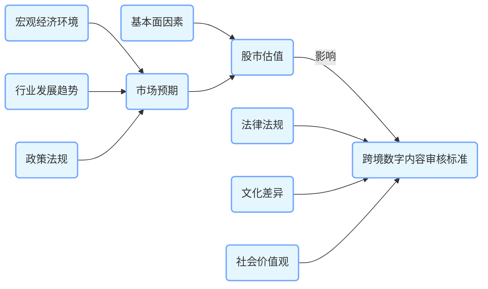

# 股市估值对跨境数字内容审核标准的影响

> 关键词：股市估值、跨境数字内容、审核标准、金融市场、内容监管

> 摘要：本文深入探讨了股市估值对跨境数字内容审核标准的影响。在全球化和数字化的背景下，跨境数字内容的传播日益广泛，而股市估值作为金融市场的重要指标，与数字内容产业的发展密切相关。文章首先介绍了研究的背景、目的、预期读者等内容，接着阐述了股市估值和跨境数字内容审核标准的核心概念及其联系，详细分析了相关的核心算法原理、数学模型，通过项目实战案例展示了两者之间的相互作用，探讨了实际应用场景，推荐了相关的工具和资源，最后总结了未来的发展趋势与挑战，并对常见问题进行了解答。

## 1. 背景介绍 
### 1.1 目的和范围
本研究的目的在于深入探究股市估值与跨境数字内容审核标准之间的内在联系和相互影响。随着全球数字经济的快速发展，跨境数字内容的传播规模不断扩大，其涉及的领域涵盖了社交媒体、视频分享、新闻资讯等多个方面。而股市估值作为衡量企业市场价值和发展潜力的重要指标，对于数字内容企业的经营和发展具有重要意义。同时，跨境数字内容的审核标准也受到多种因素的影响，包括法律法规、文化差异、社会价值观等。本研究将聚焦于股市估值这一因素，分析其对跨境数字内容审核标准的具体影响，旨在为数字内容企业的发展、监管部门的政策制定以及投资者的决策提供参考。

研究范围主要包括全球范围内的数字内容产业，重点关注在股票市场上市的数字内容企业。研究将涵盖不同国家和地区的股市估值情况以及相应的跨境数字内容审核标准，分析两者在不同市场环境下的相互关系。

### 1.2 预期读者
本文的预期读者包括数字内容产业的从业者，如内容创作者、平台运营者等，他们可以通过了解股市估值对审核标准的影响，更好地规划企业的发展战略和内容创作方向。监管部门的工作人员可以从本文中获取有关股市估值与审核标准关系的信息，为制定更加科学合理的监管政策提供依据。投资者可以通过本文分析股市估值与数字内容企业审核标准之间的关联，做出更明智的投资决策。此外，对数字经济、金融市场和内容监管等领域感兴趣的研究人员也可以从本文中获得有价值的研究思路和参考资料。

### 1.3 文档结构概述
本文将按照以下结构进行阐述：首先介绍研究的背景，包括目的、预期读者和文档结构概述等内容。接着详细阐述股市估值和跨境数字内容审核标准的核心概念及其联系，通过文本示意图和 Mermaid 流程图进行直观展示。然后分析核心算法原理和具体操作步骤，使用 Python 源代码进行详细说明。同时，介绍相关的数学模型和公式，并通过举例进行详细讲解。在项目实战部分，将给出代码实际案例并进行详细解释说明。之后探讨实际应用场景，推荐相关的工具和资源。最后总结未来的发展趋势与挑战，解答常见问题，并提供扩展阅读和参考资料。

### 1.4 术语表
#### 1.4.1 核心术语定义
- **股市估值**：指对上市公司的股票价值进行评估的过程和结果，通常通过各种估值方法，如市盈率法、市净率法等，来确定股票的合理价格区间，反映公司在市场中的价值和发展潜力。
- **跨境数字内容**：指跨越国家或地区边界进行传播的数字化内容，包括但不限于文字、图片、音频、视频等形式，常见于社交媒体平台、在线视频网站、新闻资讯平台等。
- **审核标准**：是指对跨境数字内容进行审查和评估时所依据的一系列规则和准则，旨在确保内容符合法律法规、社会道德规范、文化价值观等要求。

#### 1.4.2 相关概念解释
- **金融市场**：是指资金供应者和资金需求者双方通过信用工具进行交易而融通资金的市场，包括股票市场、债券市场、期货市场等。股市估值是金融市场中对股票价值的评估，反映了市场对企业未来盈利能力和发展前景的预期。
- **内容监管**：是指政府或相关机构对各类内容进行监督和管理的过程，旨在维护社会秩序、保护公众利益、促进文化健康发展等。跨境数字内容审核标准是内容监管在跨境数字领域的具体体现。

#### 1.4.3 缩略词列表
- **PE**：市盈率（Price Earnings Ratio），是指股票价格除以每股收益的比率，用于衡量股票的估值水平。
- **PB**：市净率（Price to Book Ratio），是指股票价格与每股净资产的比率，反映了市场对公司净资产的估值。

## 2. 核心概念与联系 
### 核心概念原理
#### 股市估值原理
股市估值是基于公司的基本面和市场预期来评估其股票价值的过程。基本面因素包括公司的盈利能力、资产状况、现金流等，而市场预期则受到宏观经济环境、行业发展趋势、政策法规等多种因素的影响。常见的估值方法有以下几种：
- **市盈率法**：市盈率是最常用的估值指标之一，计算公式为 $PE=\frac{P}{EPS}$，其中 $P$ 为股票价格，$EPS$ 为每股收益。通过比较同行业公司的市盈率，可以判断目标公司的估值水平是偏高还是偏低。
- **市净率法**：市净率反映了市场对公司净资产的估值，计算公式为 $PB=\frac{P}{BVPS}$，其中 $BVPS$ 为每股净资产。市净率较低的公司可能被认为具有较高的投资价值。

#### 跨境数字内容审核标准原理
跨境数字内容审核标准的制定主要基于法律法规、文化差异和社会价值观等因素。不同国家和地区的法律法规对数字内容的传播有不同的要求，例如，一些国家禁止传播色情、暴力、恐怖等有害内容，而另一些国家则对政治敏感内容有严格的限制。文化差异也会影响审核标准，不同文化背景下的人们对内容的接受程度和价值观不同。社会价值观则反映了一个社会的主流思想和道德观念，审核标准需要符合社会的公序良俗。

### 核心概念架构的文本示意图
```plaintext
股市估值
|-- 基本面因素
|   |-- 盈利能力
|   |-- 资产状况
|   |-- 现金流
|-- 市场预期
|   |-- 宏观经济环境
|   |-- 行业发展趋势
|   |-- 政策法规

跨境数字内容审核标准
|-- 法律法规
|   |-- 国内法律
|   |-- 国际条约
|-- 文化差异
|   |-- 价值观差异
|   |-- 审美差异
|-- 社会价值观
|   |-- 公序良俗
|   |-- 道德规范
```

### Mermaid 流程图


## 3. 核心算法原理 & 具体操作步骤 
### 股市估值算法原理及 Python 实现
#### 市盈率法
市盈率法的核心思想是通过比较目标公司的市盈率与同行业平均市盈率，来判断目标公司的估值水平。以下是使用 Python 实现市盈率法估值的代码示例：
```python
def pe_valuation(stock_price, eps, industry_pe):
    """
    市盈率法估值
    :param stock_price: 股票价格
    :param eps: 每股收益
    :param industry_pe: 行业平均市盈率
    :return: 估值结果
    """
    pe = stock_price / eps
    if pe > industry_pe:
        return "高估"
    elif pe < industry_pe:
        return "低估"
    else:
        return "合理"

# 示例数据
stock_price = 50
eps = 2
industry_pe = 20

result = pe_valuation(stock_price, eps, industry_pe)
print(f"该股票的估值情况为：{result}")
```
#### 操作步骤
1. 获取目标公司的股票价格和每股收益数据。
2. 收集同行业公司的市盈率数据，计算行业平均市盈率。
3. 使用上述代码进行市盈率计算和估值判断。

### 跨境数字内容审核算法原理及 Python 实现
跨境数字内容审核可以采用机器学习算法，如文本分类算法，来判断内容是否符合审核标准。以下是一个简单的基于朴素贝叶斯算法的文本分类示例：
```python
from sklearn.feature_extraction.text import CountVectorizer
from sklearn.naive_bayes import MultinomialNB
from sklearn.pipeline import Pipeline

# 训练数据
train_data = [
    ("这是一篇正常的新闻报道", "正常"),
    ("包含色情内容的文本", "违规"),
    ("宣传恐怖主义的文章", "违规")
]

X_train = [data[0] for data in train_data]
y_train = [data[1] for data in train_data]

# 创建分类器管道
text_clf = Pipeline([
    ('vect', CountVectorizer()),
    ('clf', MultinomialNB())
])

# 训练模型
text_clf.fit(X_train, y_train)

# 待审核内容
test_content = "这是一篇正常的科技文章"
predicted = text_clf.predict([test_content])
print(f"审核结果：{predicted[0]}")
```
#### 操作步骤
1. 收集训练数据，包括正常内容和违规内容，并进行标注。
2. 使用 `CountVectorizer` 将文本数据转换为向量表示。
3. 选择合适的分类算法，如朴素贝叶斯算法，进行模型训练。
4. 对待审核的内容进行预测，判断其是否符合审核标准。

## 4. 数学模型和公式 & 详细讲解 & 举例说明 
### 股市估值数学模型和公式
#### 市盈率法
市盈率法的基本公式为 $PE=\frac{P}{EPS}$，其中 $PE$ 表示市盈率，$P$ 表示股票价格，$EPS$ 表示每股收益。通过变形可以得到股票的理论价格公式：$P = PE\times EPS$。

例如，某公司的每股收益为 $3$ 元，同行业平均市盈率为 $25$，则该公司股票的理论价格为 $P = 25\times3 = 75$ 元。如果当前股票价格为 $80$ 元，则该股票可能被高估；如果当前股票价格为 $70$ 元，则该股票可能被低估。

#### 市净率法
市净率法的公式为 $PB=\frac{P}{BVPS}$，其中 $PB$ 表示市净率，$P$ 表示股票价格，$BVPS$ 表示每股净资产。同样可以变形得到股票的理论价格公式：$P = PB\times BVPS$。

假设某公司的每股净资产为 $10$ 元，行业平均市净率为 $2$，则该公司股票的理论价格为 $P = 2\times10 = 20$ 元。

### 跨境数字内容审核数学模型和公式
在文本分类中，朴素贝叶斯算法基于贝叶斯定理。贝叶斯定理的公式为：$P(C|X)=\frac{P(X|C)P(C)}{P(X)}$，其中 $P(C|X)$ 表示在给定特征 $X$ 的情况下，类别 $C$ 的概率；$P(X|C)$ 表示在类别 $C$ 下特征 $X$ 出现的概率；$P(C)$ 表示类别 $C$ 的先验概率；$P(X)$ 表示特征 $X$ 出现的概率。

在实际应用中，由于 $P(X)$ 对于所有类别都是相同的，因此可以忽略分母，只比较分子 $P(X|C)P(C)$ 的大小来确定类别。

例如，假设有两个类别：正常内容和违规内容。我们通过训练数据计算出 $P(正常)$、$P(违规)$、$P(X|正常)$ 和 $P(X|违规)$ 的值。对于待审核的内容 $X$，分别计算 $P(X|正常)P(正常)$ 和 $P(X|违规)P(违规)$，如果 $P(X|正常)P(正常) > P(X|违规)P(违规)$，则判断该内容为正常内容；反之，则判断为违规内容。

## 5. 项目实战：代码实际案例和详细解释说明 
### 5.1  开发环境搭建
#### 安装 Python
首先需要安装 Python 环境，建议使用 Python 3.7 及以上版本。可以从 Python 官方网站（https://www.python.org/downloads/）下载适合自己操作系统的安装包，并按照安装向导进行安装。

#### 安装必要的库
在命令行中使用以下命令安装所需的库：
```sh
pip install scikit-learn pandas numpy
```
`scikit-learn` 用于机器学习算法的实现，`pandas` 用于数据处理，`numpy` 用于数值计算。

### 5.2  源代码详细实现和代码解读
#### 股市估值项目
```python
import pandas as pd

# 模拟获取股票数据
stock_data = {
    '股票代码': ['000001', '000002'],
    '股票价格': [50, 60],
    '每股收益': [2, 3],
    '每股净资产': [10, 15]
}

df = pd.DataFrame(stock_data)

# 计算市盈率和市净率
df['市盈率'] = df['股票价格'] / df['每股收益']
df['市净率'] = df['股票价格'] / df['每股净资产']

# 假设行业平均市盈率为 20，行业平均市净率为 2
industry_pe = 20
industry_pb = 2

# 判断估值情况
df['市盈率估值'] = df['市盈率'].apply(lambda x: '高估' if x > industry_pe else ('低估' if x < industry_pe else '合理'))
df['市净率估值'] = df['市净率'].apply(lambda x: '高估' if x > industry_pb else ('低估' if x < industry_pb else '合理'))

print(df)
```
#### 代码解读
1. **数据模拟**：使用字典 `stock_data` 模拟获取股票的基本数据，包括股票代码、股票价格、每股收益和每股净资产，并将其转换为 `pandas` 的 `DataFrame` 对象。
2. **指标计算**：使用 `DataFrame` 的 `apply` 方法计算每只股票的市盈率和市净率。
3. **估值判断**：根据行业平均市盈率和市净率，使用 `apply` 方法判断每只股票的估值情况，并将结果添加到 `DataFrame` 中。
4. **结果输出**：打印包含估值信息的 `DataFrame`。

#### 跨境数字内容审核项目
```python
import pandas as pd
from sklearn.feature_extraction.text import TfidfVectorizer
from sklearn.svm import SVC
from sklearn.model_selection import train_test_split
from sklearn.metrics import accuracy_score

# 读取训练数据
data = pd.read_csv('content_data.csv')
X = data['内容']
y = data['标签']

# 划分训练集和测试集
X_train, X_test, y_train, y_test = train_test_split(X, y, test_size=0.2, random_state=42)

# 创建 TfidfVectorizer 对象
vectorizer = TfidfVectorizer()
X_train_vectorized = vectorizer.fit_transform(X_train)
X_test_vectorized = vectorizer.transform(X_test)

# 创建 SVM 分类器
clf = SVC()
clf.fit(X_train_vectorized, y_train)

# 预测测试集
y_pred = clf.predict(X_test_vectorized)

# 计算准确率
accuracy = accuracy_score(y_test, y_pred)
print(f"模型准确率：{accuracy}")
```
#### 代码解读
1. **数据读取**：使用 `pandas` 读取包含内容和标签的 CSV 文件，并将内容和标签分别存储在 `X` 和 `y` 中。
2. **数据划分**：使用 `train_test_split` 函数将数据划分为训练集和测试集，测试集占比为 20%。
3. **特征提取**：使用 `TfidfVectorizer` 将文本数据转换为 TF-IDF 特征向量。
4. **模型训练**：创建 SVM 分类器并使用训练集进行训练。
5. **模型预测**：使用训练好的模型对测试集进行预测。
6. **结果评估**：使用 `accuracy_score` 函数计算模型的准确率并输出。

### 5.3  代码解读与分析
#### 股市估值项目分析
该项目通过简单的计算和判断，对股票的估值情况进行了评估。使用 `pandas` 库可以方便地进行数据处理和计算，提高了代码的可读性和可维护性。然而，该项目的估值方法较为简单，仅考虑了市盈率和市净率两个指标，实际的股市估值还需要考虑更多的因素，如公司的成长潜力、行业竞争状况等。

#### 跨境数字内容审核项目分析
该项目使用了 SVM 分类器和 TF-IDF 特征提取方法，对跨境数字内容进行审核。通过划分训练集和测试集，可以评估模型的性能。但是，该项目的训练数据可能有限，模型的泛化能力可能受到影响。此外，文本分类的准确性还受到数据标注质量、特征提取方法等因素的影响。

## 6. 实际应用场景 
### 数字内容企业决策
数字内容企业在进行内容创作和传播时，需要考虑股市估值的影响。如果企业的股市估值较高，说明市场对其未来发展前景较为看好，企业可以适当放宽审核标准，推出更具创新性和个性化的内容，以吸引更多用户，进一步提升企业的市场价值。反之，如果企业的股市估值较低，为了避免因违规内容导致的负面影响，企业可能会收紧审核标准，确保内容符合主流价值观和法律法规要求。

### 监管部门政策制定
监管部门在制定跨境数字内容审核标准时，也需要考虑股市估值的因素。一方面，合理的审核标准可以促进数字内容产业的健康发展，提高企业的股市估值。另一方面，过于严格的审核标准可能会限制企业的创新和发展，导致股市估值下降。因此，监管部门需要在保障社会公共利益和促进产业发展之间找到平衡，根据股市估值的变化动态调整审核标准。

### 投资者决策
投资者在进行数字内容企业的投资决策时，会关注企业的股市估值和跨境数字内容审核标准。如果企业的审核标准严格，能够有效避免违规内容的传播，降低企业面临的法律风险和声誉风险，那么投资者可能更愿意投资该企业，从而推动企业的股市估值上升。反之，如果企业的审核标准宽松，存在较多违规内容的风险，投资者可能会谨慎投资，导致企业的股市估值下降。

## 7. 工具和资源推荐
### 7.1 学习资源推荐
#### 7.1.1 书籍推荐
- 《金融市场学》：全面介绍了金融市场的基本概念、运行机制和各种金融工具，对于理解股市估值的原理和方法有很大帮助。
- 《机器学习实战》：通过实际案例详细介绍了机器学习算法的实现和应用，对于学习跨境数字内容审核算法有很好的参考价值。
- 《数字内容产业研究》：深入探讨了数字内容产业的发展现状、趋势和相关政策，有助于了解跨境数字内容审核标准的背景和意义。

#### 7.1.2 在线课程
- Coursera 上的“金融市场分析”课程：由知名教授授课，系统讲解了金融市场的分析方法和工具，包括股市估值的相关内容。
- edX 上的“机器学习基础”课程：提供了丰富的机器学习理论和实践内容，适合初学者入门。
- 中国大学 MOOC 上的“数字内容创意与设计”课程：介绍了数字内容产业的创意设计理念和方法，以及相关的审核标准和政策。

#### 7.1.3 技术博客和网站
- 金融界（https://www.jrj.com.cn/）：提供了丰富的金融市场资讯和分析报告，包括股市估值的相关内容。
- 开源中国（https://www.oschina.net/）：汇集了大量的开源技术和项目，对于学习跨境数字内容审核的开源算法和工具很有帮助。
- 知乎（https://www.zhihu.com/）：有很多关于金融市场、数字内容产业和机器学习的讨论和分享，可以从中获取不同的观点和经验。

### 7.2 开发工具框架推荐
#### 7.2.1 IDE和编辑器
- PyCharm：是一款专业的 Python 集成开发环境，具有代码编辑、调试、自动补全、版本控制等功能，适合开发股市估值和跨境数字内容审核相关的 Python 项目。
- Jupyter Notebook：是一个交互式的开发环境，支持 Python、R 等多种编程语言，方便进行数据分析、模型训练和结果展示。

#### 7.2.2 调试和性能分析工具
- pdb：Python 内置的调试工具，可以帮助开发者在代码中设置断点、查看变量值，方便调试程序。
- cProfile：Python 标准库中的性能分析工具，可以统计代码的运行时间和函数调用次数，帮助开发者找出性能瓶颈。

#### 7.2.3 相关框架和库
- Scikit-learn：是一个强大的机器学习库，提供了各种机器学习算法和工具，如分类、回归、聚类等，可用于跨境数字内容审核的模型训练。
- Pandas：是一个用于数据处理和分析的库，提供了高效的数据结构和数据操作方法，适合处理股市估值和数字内容审核中的数据。
- Numpy：是一个用于科学计算的库，提供了高效的数组操作和数学函数，可用于机器学习算法的实现。

### 7.3 相关论文著作推荐
#### 7.3.1 经典论文
- Fama, E. F., & French, K. R. (1992). The cross-section of expected stock returns. The Journal of Finance, 47(2), 427-465. 该论文提出了著名的 Fama-French 三因子模型，对股市估值的研究产生了深远影响。
- Mitchell, T. M. (1997). Machine learning. McGraw-Hill. 这本书是机器学习领域的经典著作，系统介绍了机器学习的基本概念、算法和应用，对于理解跨境数字内容审核的算法原理有重要意义。

#### 7.3.2 最新研究成果
- 关注顶级学术期刊，如《Journal of Financial Economics》《Journal of Machine Learning Research》等，这些期刊会发表关于股市估值和机器学习的最新研究成果。
- 参加相关的学术会议，如 ACM SIGKDD、NeurIPS 等，了解行业内的前沿技术和研究动态。

#### 7.3.3 应用案例分析
- 可以通过查阅行业报告和企业案例，了解股市估值和跨境数字内容审核标准在实际应用中的情况和效果。例如，研究一些知名数字内容企业在不同股市估值下的审核策略调整，以及这些调整对企业发展的影响。

## 8. 总结：未来发展趋势与挑战
### 未来发展趋势
#### 智能化审核
随着人工智能技术的不断发展，跨境数字内容审核将越来越智能化。通过深度学习、自然语言处理等技术，可以实现对内容的自动识别、分类和审核，提高审核效率和准确性。例如，利用图像识别技术可以快速识别图片中的违规内容，利用语义分析技术可以理解文本的含义，判断其是否符合审核标准。

#### 国际化合作
在全球化的背景下，跨境数字内容的传播越来越广泛，各国之间的数字内容交流和合作也越来越频繁。因此，未来跨境数字内容审核标准将更加注重国际化合作，各国监管部门将加强沟通和协调，制定统一的审核标准和规范，以促进跨境数字内容的健康发展。

#### 数据驱动决策
股市估值和跨境数字内容审核都将越来越依赖数据驱动的决策。通过收集和分析大量的市场数据、用户数据和内容数据，可以更准确地评估企业的股市估值和内容审核效果，为企业决策和监管政策制定提供更科学的依据。

### 挑战
#### 技术挑战
虽然人工智能技术在跨境数字内容审核中取得了一定的进展，但仍然面临一些技术挑战。例如，对于一些复杂的内容，如隐喻、暗示等，机器很难准确理解其含义，容易出现误判。此外，随着技术的不断发展，违规内容的形式也越来越多样化，需要不断更新和改进审核技术。

#### 文化差异挑战
不同国家和地区的文化差异较大，对于数字内容的接受程度和价值观也不同。在制定跨境数字内容审核标准时，需要充分考虑文化差异的因素，避免因审核标准的不一致而导致的文化冲突。同时，如何在尊重文化差异的前提下，确保内容符合基本的道德和法律要求，也是一个亟待解决的问题。

#### 监管协调挑战
跨境数字内容的传播涉及多个国家和地区的监管部门，不同监管部门的职责和权限不同，审核标准也存在差异。因此，如何加强监管协调，实现信息共享和协同监管，是未来跨境数字内容审核面临的重要挑战。

## 9. 附录：常见问题与解答
### 股市估值的方法有哪些局限性？
股市估值的方法，如市盈率法和市净率法，虽然简单易懂，但存在一定的局限性。首先，这些方法主要基于历史数据，不能完全反映公司的未来发展潜力。其次，不同行业的公司具有不同的特点和估值水平，简单地使用行业平均指标进行比较可能会导致不准确的估值结果。此外，股市估值还受到市场情绪、宏观经济环境等多种因素的影响，这些因素很难通过数学模型进行准确预测。

### 跨境数字内容审核的准确率如何提高？
提高跨境数字内容审核的准确率可以从以下几个方面入手：一是增加训练数据的数量和质量，确保数据涵盖各种类型的内容和违规情况。二是选择合适的机器学习算法和特征提取方法，根据不同的应用场景进行优化和调整。三是结合人工审核，对于一些复杂和难以判断的内容，由专业人员进行审核，以提高审核的准确性。四是不断更新和改进审核模型，随着违规内容形式的变化，及时调整模型的参数和规则。

### 股市估值和跨境数字内容审核标准之间的关系是单向的还是双向的？
股市估值和跨境数字内容审核标准之间的关系是双向的。一方面，股市估值会影响跨境数字内容审核标准，当企业的股市估值较高时，可能会放宽审核标准以追求创新和发展；当股市估值较低时，可能会收紧审核标准以降低风险。另一方面，跨境数字内容审核标准也会影响股市估值，如果企业能够严格遵守审核标准，避免违规内容的传播，有助于提升企业的声誉和市场价值，从而推动股市估值上升；反之，如果企业存在较多违规内容的风险，可能会导致股市估值下降。

## 10. 扩展阅读 & 参考资料
### 扩展阅读
- 《金融科技前沿：理论与实务》：介绍了金融科技领域的最新发展和应用，包括股市估值的新技术和方法。
- 《数字文化产业创新发展研究》：深入探讨了数字文化产业的创新发展模式和趋势，对于理解跨境数字内容审核标准的演变有一定的帮助。

### 参考资料
- 相关的金融市场报告和统计数据，如《中国金融市场发展报告》《全球数字内容产业统计年鉴》等。
- 各国的法律法规和政策文件，如《中华人民共和国网络安全法》《欧盟通用数据保护条例》等，这些文件对于了解跨境数字内容审核的法律依据和要求非常重要。

作者：AI天才研究院/AI Genius Institute & 禅与计算机程序设计艺术 /Zen And The Art of Computer Programming