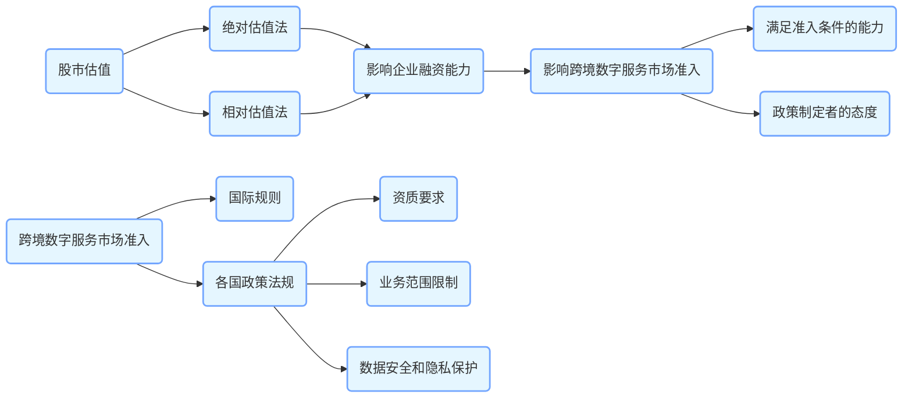

# 股市估值对跨境数字服务市场准入的影响

> 关键词：股市估值、跨境数字服务、市场准入、影响机制、经济分析

> 摘要：本文聚焦于股市估值对跨境数字服务市场准入的影响。通过深入剖析股市估值的内涵、跨境数字服务市场准入的相关概念，探讨两者之间的内在联系和作用机制。详细阐述股市估值影响跨境数字服务市场准入的核心算法原理和具体操作步骤，构建相应的数学模型并进行举例说明。结合实际案例，分析股市估值在跨境数字服务市场准入中的具体应用。同时，介绍相关的工具和资源，对未来发展趋势与挑战进行总结，旨在为相关领域的研究和实践提供全面而深入的参考。

## 1. 背景介绍 
### 1.1 目的和范围
本研究旨在全面探究股市估值对跨境数字服务市场准入的影响。具体范围涵盖股市估值的各种衡量指标和方法，跨境数字服务市场准入的政策、法规以及实际操作流程，分析两者之间的因果关系和相互作用机制。通过理论分析和实际案例研究，揭示股市估值如何影响企业进入跨境数字服务市场的决策、能力和实际效果，为企业、政策制定者和投资者提供有价值的参考。

### 1.2 预期读者
本文的预期读者包括金融领域的研究者和从业者，如股票分析师、投资经理等，他们可以从股市估值的角度深入了解跨境数字服务市场的投资机会和风险。跨境数字服务企业的管理者和决策者能够借助本文的研究成果，更好地评估自身的市场准入条件和策略。政策制定者可以根据研究结论，优化跨境数字服务市场准入的相关政策，促进市场的健康发展。此外，对数字经济和国际贸易感兴趣的学者和学生也可以从中获取有价值的知识和研究思路。

### 1.3 文档结构概述
本文首先介绍相关的背景知识，包括研究的目的、预期读者和文档结构。接着阐述核心概念，如股市估值和跨境数字服务市场准入，并分析它们之间的联系。在核心算法原理和具体操作步骤部分，通过 Python 代码详细讲解如何分析股市估值对跨境数字服务市场准入的影响。构建数学模型并进行详细讲解和举例说明。然后通过实际案例展示股市估值在跨境数字服务市场准入中的应用。介绍相关的工具和资源，包括学习资源、开发工具框架和相关论文著作。最后总结未来发展趋势与挑战，提供常见问题与解答，并列出扩展阅读和参考资料。

### 1.4 术语表
#### 1.4.1 核心术语定义
- **股市估值**：是指对股票市场中上市公司的价值进行评估的过程和结果。它通常基于公司的财务状况、盈利能力、市场前景等因素，通过各种估值方法（如市盈率法、市净率法等）来确定公司股票的合理价格或价值区间。
- **跨境数字服务**：是指通过互联网等数字技术手段，在不同国家或地区之间提供的各类服务，包括但不限于软件开发、数字营销、在线教育、远程医疗等。
- **市场准入**：是指允许企业或个人进入某个市场进行经营活动的条件和限制。在跨境数字服务领域，市场准入涉及到政策法规、技术标准、行业规范等多个方面的要求。

#### 1.4.2 相关概念解释
- **市盈率（P/E）**：是指股票价格与每股盈利的比率，反映了投资者为获取公司每一元盈利所愿意支付的价格。市盈率越高，通常意味着市场对该公司的未来盈利预期越高。
- **市净率（P/B）**：是指股票价格与每股净资产的比率，反映了市场对公司净资产的估值水平。市净率大于 1 表示市场对公司的估值高于其净资产，反之则低于净资产。
- **数字服务贸易壁垒**：是指在跨境数字服务贸易中，由于各国政策、法规、技术标准等差异而形成的阻碍数字服务自由流动的因素。

#### 1.4.3 缩略词列表
- **P/E**：市盈率（Price-to-Earnings Ratio）
- **P/B**：市净率（Price-to-Book Ratio）
- **WTO**：世界贸易组织（World Trade Organization）
- **GATS**：服务贸易总协定（General Agreement on Trade in Services）

## 2. 核心概念与联系 

### 2.1 股市估值的原理和方法
股市估值是金融领域的重要课题，其目的是确定上市公司股票的内在价值。常见的估值方法包括：
- **绝对估值法**：如现金流折现法（DCF），该方法基于公司未来的现金流量预测，通过一定的折现率将未来现金流量折现到当前时刻，从而得到公司的内在价值。其原理是认为公司的价值等于其未来所能产生的全部现金流量的现值之和。数学公式为：
$$V = \sum_{t=1}^{n} \frac{CF_t}{(1 + r)^t}$$
其中，$V$ 表示公司的内在价值，$CF_t$ 表示第 $t$ 期的现金流量，$r$ 表示折现率，$n$ 表示预测期数。
- **相对估值法**：如市盈率法和市净率法。市盈率法是通过比较同行业或类似公司的市盈率，来确定目标公司的合理估值。市净率法则是基于公司的净资产进行估值。

### 2.2 跨境数字服务市场准入的概念和政策框架
跨境数字服务市场准入涉及到多个层面的政策和法规。从国际层面来看，世界贸易组织（WTO）的服务贸易总协定（GATS）为跨境服务贸易提供了基本的规则和框架。各国也根据自身的利益和发展需求，制定了相应的跨境数字服务市场准入政策。这些政策可能包括对外国企业的资质要求、业务范围限制、数据安全和隐私保护等方面的规定。

### 2.3 股市估值与跨境数字服务市场准入的联系
股市估值可以反映市场对企业的信心和预期，从而影响企业进入跨境数字服务市场的能力和决策。高估值的企业通常具有更强的融资能力和市场竞争力，更容易满足跨境数字服务市场准入的条件。例如，高估值的企业可以通过发行股票筹集更多的资金，用于技术研发、市场拓展和满足相关的合规要求。同时，股市估值也可以作为一种信号，影响政策制定者对企业进入跨境数字服务市场的态度和决策。

### 2.4 核心概念原理和架构的文本示意图
```plaintext
股市估值
|-- 绝对估值法（如现金流折现法）
|-- 相对估值法（如市盈率法、市净率法）
|
|-- 影响企业融资能力
|-- 反映市场信心和预期
|
|-- 影响跨境数字服务市场准入
|   |-- 满足准入条件的能力
|   |-- 政策制定者的态度
|
跨境数字服务市场准入
|-- 国际规则（如 WTO、GATS）
|-- 各国政策法规
|   |-- 资质要求
|   |-- 业务范围限制
|   |-- 数据安全和隐私保护
```

### 2.5 Mermaid 流程图


## 3. 核心算法原理 & 具体操作步骤 

### 3.1 算法原理
我们可以通过建立一个基于多元线性回归的模型来分析股市估值对跨境数字服务市场准入的影响。假设我们用 $Y$ 表示企业进入跨境数字服务市场的可能性（可以用一个 0 - 1 之间的概率值来表示），$X_1$ 表示股市估值（如市盈率），$X_2$ 表示企业的财务状况（如资产负债率），$X_3$ 表示行业竞争程度等因素。则多元线性回归模型可以表示为：
$$Y = \beta_0 + \beta_1X_1 + \beta_2X_2 + \beta_3X_3 + \epsilon$$
其中，$\beta_0$ 是截距项，$\beta_1$、$\beta_2$、$\beta_3$ 是回归系数，$\epsilon$ 是误差项。

### 3.2 具体操作步骤
1. **数据收集**：收集相关企业的股市估值数据（如市盈率、市净率等）、财务数据（如资产负债率、净利润等）、行业竞争数据（如市场份额、行业增长率等）以及企业进入跨境数字服务市场的实际情况（是或否）。
2. **数据预处理**：对收集到的数据进行清洗、缺失值处理和标准化处理，以确保数据的质量和一致性。
3. **模型训练**：使用训练数据集对多元线性回归模型进行训练，估计回归系数 $\beta_0$、$\beta_1$、$\beta_2$、$\beta_3$。
4. **模型评估**：使用测试数据集对训练好的模型进行评估，计算模型的准确率、召回率等指标，评估模型的性能。
5. **结果分析**：分析回归系数的显著性和正负性，判断股市估值等因素对企业进入跨境数字服务市场的影响方向和程度。

### 3.3 Python 源代码实现
```python
import pandas as pd
from sklearn.model_selection import train_test_split
from sklearn.linear_model import LinearRegression
from sklearn.metrics import mean_squared_error
import numpy as np

# 假设我们已经收集到了相关数据，并存储在一个 CSV 文件中
data = pd.read_csv('data.csv')

# 提取特征和目标变量
X = data[['PE_ratio', 'Debt_ratio', 'Competition_index']]
y = data['Market_access']

# 数据标准化
X = (X - X.mean()) / X.std()

# 划分训练集和测试集
X_train, X_test, y_train, y_test = train_test_split(X, y, test_size=0.2, random_state=42)

# 创建线性回归模型
model = LinearRegression()

# 模型训练
model.fit(X_train, y_train)

# 模型预测
y_pred = model.predict(X_test)

# 模型评估
mse = mean_squared_error(y_test, y_pred)
rmse = np.sqrt(mse)

print(f"均方误差 (MSE): {mse}")
print(f"均方根误差 (RMSE): {rmse}")

# 分析回归系数
coefficients = model.coef_
intercept = model.intercept_

print(f"截距项: {intercept}")
print(f"回归系数 (PE_ratio, Debt_ratio, Competition_index): {coefficients}")
```

### 3.4 代码解释
1. **数据读取**：使用 `pandas` 库的 `read_csv` 函数读取存储在 CSV 文件中的数据。
2. **特征提取和标准化**：从数据中提取特征变量（股市估值、财务状况、行业竞争程度）和目标变量（企业进入跨境数字服务市场的可能性），并对特征变量进行标准化处理。
3. **数据划分**：使用 `train_test_split` 函数将数据划分为训练集和测试集，测试集占比为 20%。
4. **模型创建和训练**：创建一个线性回归模型，并使用训练集对模型进行训练。
5. **模型预测和评估**：使用训练好的模型对测试集进行预测，并计算均方误差（MSE）和均方根误差（RMSE）来评估模型的性能。
6. **结果分析**：输出回归系数和截距项，分析各个因素对企业进入跨境数字服务市场的影响。

## 4. 数学模型和公式 & 详细讲解 & 举例说明 

### 4.1 多元线性回归模型
如前所述，多元线性回归模型的一般形式为：
$$Y = \beta_0 + \beta_1X_1 + \beta_2X_2 + \beta_3X_3 + \epsilon$$
其中，$Y$ 是因变量（企业进入跨境数字服务市场的可能性），$X_1$、$X_2$、$X_3$ 是自变量（股市估值、企业财务状况、行业竞争程度等），$\beta_0$ 是截距项，$\beta_1$、$\beta_2$、$\beta_3$ 是回归系数，$\epsilon$ 是误差项。

回归系数 $\beta_i$ 表示在其他自变量保持不变的情况下，自变量 $X_i$ 每增加一个单位，因变量 $Y$ 的平均变化量。例如，如果 $\beta_1$ 为正且显著，则说明股市估值越高，企业进入跨境数字服务市场的可能性越大。

### 4.2 最小二乘法估计回归系数
为了估计回归系数 $\beta_0$、$\beta_1$、$\beta_2$、$\beta_3$，我们通常使用最小二乘法。最小二乘法的目标是使观测值 $Y_i$ 与模型预测值 $\hat{Y}_i$ 之间的误差平方和最小，即：
$$\min_{\beta_0, \beta_1, \beta_2, \beta_3} \sum_{i=1}^{n} (Y_i - \hat{Y}_i)^2 = \min_{\beta_0, \beta_1, \beta_2, \beta_3} \sum_{i=1}^{n} (Y_i - (\beta_0 + \beta_1X_{i1} + \beta_2X_{i2} + \beta_3X_{i3}))^2$$
通过求解上述优化问题，可以得到回归系数的估计值。在 Python 中，`sklearn` 库的 `LinearRegression` 类已经实现了最小二乘法的求解过程。

### 4.3 举例说明
假设我们有以下数据：
| 企业编号 | 市盈率 ($X_1$) | 资产负债率 ($X_2$) | 行业竞争指数 ($X_3$) | 进入跨境数字服务市场的可能性 ($Y$) |
|----------|----------------|---------------------|---------------------|------------------------------------|
| 1        | 20             | 0.4                 | 0.6                 | 0.8                                |
| 2        | 15             | 0.5                 | 0.7                 | 0.6                                |
| 3        | 25             | 0.3                 | 0.5                 | 0.9                                |
| 4        | 18             | 0.45                | 0.65                | 0.7                                |
| 5        | 22             | 0.35                | 0.55                | 0.85                               |

将这些数据代入上述的多元线性回归模型中，使用最小二乘法进行估计，得到回归系数的估计值。假设估计结果为 $\beta_0 = 0.2$，$\beta_1 = 0.02$，$\beta_2 = -0.1$，$\beta_3 = -0.05$。则模型可以表示为：
$$Y = 0.2 + 0.02X_1 - 0.1X_2 - 0.05X_3$$

这意味着，在其他因素不变的情况下，市盈率每增加 1 个单位，企业进入跨境数字服务市场的可能性将增加 0.02；资产负债率每增加 1 个单位，可能性将减少 0.1；行业竞争指数每增加 1 个单位，可能性将减少 0.05。

## 5. 项目实战：代码实际案例和详细解释说明 

### 5.1 开发环境搭建
#### 5.1.1 安装 Python
首先，需要安装 Python 编程语言。可以从 Python 官方网站（https://www.python.org/downloads/）下载适合自己操作系统的 Python 安装包，并按照安装向导进行安装。建议安装 Python 3.7 及以上版本。

#### 5.1.2 安装必要的库
使用 `pip` 包管理器安装所需的库，包括 `pandas`、`numpy`、`scikit-learn` 等。可以在命令行中运行以下命令进行安装：
```sh
pip install pandas numpy scikit-learn
```

### 5.2 源代码详细实现和代码解读
以下是一个完整的 Python 代码示例，用于分析股市估值对跨境数字服务市场准入的影响：
```python
import pandas as pd
from sklearn.model_selection import train_test_split
from sklearn.linear_model import LinearRegression
from sklearn.metrics import mean_squared_error
import numpy as np

# 读取数据
data = pd.read_csv('stock_valuation_data.csv')

# 数据探索
print("数据基本信息：")
data.info()

# 提取特征和目标变量
X = data[['PE_ratio', 'PB_ratio', 'Debt_ratio', 'ROE']]
y = data['Market_access']

# 数据标准化
X = (X - X.mean()) / X.std()

# 划分训练集和测试集
X_train, X_test, y_train, y_test = train_test_split(X, y, test_size=0.2, random_state=42)

# 创建线性回归模型
model = LinearRegression()

# 模型训练
model.fit(X_train, y_train)

# 模型预测
y_pred = model.predict(X_test)

# 模型评估
mse = mean_squared_error(y_test, y_pred)
rmse = np.sqrt(mse)

print(f"均方误差 (MSE): {mse}")
print(f"均方根误差 (RMSE): {rmse}")

# 分析回归系数
coefficients = model.coef_
intercept = model.intercept_

print(f"截距项: {intercept}")
print(f"回归系数 (PE_ratio, PB_ratio, Debt_ratio, ROE): {coefficients}")

# 可视化结果（可选）
import matplotlib.pyplot as plt

plt.scatter(y_test, y_pred)
plt.xlabel('实际值')
plt.ylabel('预测值')
plt.title('实际值 vs 预测值')
plt.show()
```

### 5.2.1 代码解读
1. **数据读取**：使用 `pandas` 库的 `read_csv` 函数读取存储在 CSV 文件中的数据。
2. **数据探索**：使用 `data.info()` 函数查看数据的基本信息，包括数据的行数、列数、数据类型等。
3. **特征提取和标准化**：从数据中提取特征变量（市盈率、市净率、资产负债率、净资产收益率）和目标变量（企业进入跨境数字服务市场的可能性），并对特征变量进行标准化处理。
4. **数据划分**：使用 `train_test_split` 函数将数据划分为训练集和测试集，测试集占比为 20%。
5. **模型创建和训练**：创建一个线性回归模型，并使用训练集对模型进行训练。
6. **模型预测和评估**：使用训练好的模型对测试集进行预测，并计算均方误差（MSE）和均方根误差（RMSE）来评估模型的性能。
7. **结果分析**：输出回归系数和截距项，分析各个因素对企业进入跨境数字服务市场的影响。
8. **可视化结果**：使用 `matplotlib` 库绘制实际值和预测值的散点图，直观地展示模型的预测效果。

### 5.3 代码解读与分析
#### 5.3.1 数据预处理的重要性
数据预处理是数据分析和建模的重要步骤。在本案例中，我们对特征变量进行了标准化处理，这有助于消除不同特征变量之间的量纲差异，提高模型的训练效果和稳定性。同时，数据清洗和缺失值处理也是必不可少的，以确保数据的质量和一致性。

#### 5.3.2 模型评估指标
均方误差（MSE）和均方根误差（RMSE）是常用的回归模型评估指标。MSE 表示预测值与实际值之间的误差平方的平均值，RMSE 是 MSE 的平方根。RMSE 更直观地反映了预测值与实际值之间的平均误差大小。在实际应用中，我们希望 RMSE 尽可能小，说明模型的预测效果越好。

#### 5.3.3 回归系数的意义
回归系数表示各个自变量对因变量的影响程度和方向。正的回归系数表示自变量与因变量呈正相关关系，即自变量增加时，因变量也会增加；负的回归系数表示自变量与因变量呈负相关关系，即自变量增加时，因变量会减少。通过分析回归系数，我们可以了解各个因素对企业进入跨境数字服务市场的影响程度和方向。

## 6. 实际应用场景 
### 6.1 企业决策
对于跨境数字服务企业来说，股市估值可以作为评估自身市场竞争力和进入国际市场能力的重要参考。高估值的企业可以利用其良好的市场形象和融资能力，加大在技术研发、市场拓展和合规建设方面的投入，提高进入跨境数字服务市场的成功率。例如，一家高估值的软件开发企业可以通过发行股票筹集资金，引进先进的技术和人才，满足不同国家和地区的市场需求和法规要求，从而顺利进入跨境数字服务市场。

### 6.2 投资者决策
投资者可以通过分析股市估值和跨境数字服务市场准入的关系，寻找具有投资价值的企业。如果一家企业的股市估值较高，且有望进入跨境数字服务市场，那么该企业可能具有较大的增长潜力。投资者可以根据相关的研究和分析，做出合理的投资决策。例如，投资者可以关注那些在新兴数字服务领域具有高估值的企业，这些企业可能在跨境市场上获得更大的发展空间。

### 6.3 政策制定
政策制定者可以根据股市估值和跨境数字服务市场准入的情况，制定更加合理的政策。对于高估值的企业，可以给予一定的政策支持，鼓励其进入跨境数字服务市场，促进数字服务贸易的发展。同时，也可以加强对跨境数字服务市场的监管，确保市场的公平竞争和数据安全。例如，政府可以出台税收优惠政策、提供资金支持等，帮助高估值的企业克服进入跨境市场的障碍。

### 6.4 行业发展
股市估值对跨境数字服务市场准入的影响也会对整个行业的发展产生作用。当更多高估值的企业进入跨境数字服务市场时，会带来更多的创新和竞争，推动行业的技术进步和服务质量提升。同时，也会促进跨境数字服务市场的整合和优化，提高行业的整体竞争力。例如，一些领先的数字营销企业进入国际市场后，会带来先进的营销理念和技术，带动整个行业的发展。

## 7. 工具和资源推荐
### 7.1 学习资源推荐
#### 7.1.1 书籍推荐
- 《金融市场与金融机构》：这本书全面介绍了金融市场的基本概念、运行机制和金融机构的业务活动，对于理解股市估值和金融市场的运作有很大帮助。
- 《计量经济学导论》：计量经济学是分析经济数据和建立经济模型的重要工具，这本书详细介绍了计量经济学的基本原理和方法，适合用于分析股市估值与跨境数字服务市场准入之间的关系。
- 《数字经济：新经济时代的商业模式与创新》：该书深入探讨了数字经济的发展趋势、商业模式和创新实践，对于了解跨境数字服务市场的特点和发展规律具有重要参考价值。

#### 7.1.2 在线课程
- Coursera 平台上的“金融市场”课程：由知名大学的教授授课，系统地介绍了金融市场的各个方面，包括股票市场、债券市场等。
- edX 平台上的“计量经济学基础”课程：提供了计量经济学的基础知识和实践操作，帮助学习者掌握数据分析和模型建立的技能。
- Udemy 平台上的“跨境电商与数字服务贸易”课程：聚焦于跨境数字服务贸易的实际操作和策略，适合想要了解跨境数字服务市场的学习者。

#### 7.1.3 技术博客和网站
- 雪球网：是国内知名的财经社区，提供丰富的股票分析和投资经验分享，对于了解股市估值和企业动态有很大帮助。
- 艾瑞咨询：专注于互联网和数字经济领域的研究，发布了大量关于跨境数字服务市场的研究报告和分析文章。
- 世界银行官网：提供了全球经济和贸易的相关数据和研究报告，对于了解跨境数字服务市场的宏观环境和政策动态有重要参考价值。

### 7.2 开发工具框架推荐
#### 7.2.1 IDE和编辑器
- PyCharm：是一款专门为 Python 开发设计的集成开发环境（IDE），具有强大的代码编辑、调试和项目管理功能，适合进行数据分析和机器学习项目的开发。
- Jupyter Notebook：是一个交互式的开发环境，支持 Python、R 等多种编程语言，方便进行数据探索、模型开发和结果展示。
- Visual Studio Code：是一款轻量级的代码编辑器，支持多种编程语言和插件扩展，具有丰富的功能和良好的用户体验。

#### 7.2.2 调试和性能分析工具
- pdb：是 Python 自带的调试器，可以帮助开发者在代码执行过程中进行调试和问题排查。
- cProfile：是 Python 的性能分析工具，可以分析代码的运行时间和函数调用情况，帮助开发者优化代码性能。
- TensorBoard：是 TensorFlow 提供的可视化工具，可以用于可视化机器学习模型的训练过程和结果，方便进行模型评估和优化。

#### 7.2.3 相关框架和库
- pandas：是 Python 中用于数据处理和分析的重要库，提供了丰富的数据结构和数据操作方法，方便进行数据清洗、转换和分析。
- numpy：是 Python 中用于科学计算的基础库，提供了高效的数组操作和数学函数，是很多数据分析和机器学习库的基础。
- scikit-learn：是 Python 中常用的机器学习库，提供了丰富的机器学习算法和工具，包括分类、回归、聚类等算法，方便进行模型开发和评估。

### 7.3 相关论文著作推荐
#### 7.3.1 经典论文
- "The Pricing of Options and Corporate Liabilities" by Fischer Black and Myron Scholes：这篇论文提出了著名的布莱克 - 斯科尔斯期权定价模型，为金融衍生品的定价和风险管理提供了重要的理论基础，对于理解股市估值有一定的参考价值。
- "A Contribution to the Theory of Economic Growth" by Robert M. Solow：该论文提出了索洛增长模型，对经济增长的因素和机制进行了深入分析，对于理解跨境数字服务市场的发展和经济增长的关系有一定的启示作用。
- "The Theory of Industrial Organization" by Jean Tirole：这本书是产业组织理论的经典著作，系统地介绍了产业组织的基本理论和分析方法，对于研究跨境数字服务市场的竞争格局和市场结构有重要的参考意义。

#### 7.3.2 最新研究成果
- 关注国际知名学术期刊，如《Journal of Financial Economics》、《The Quarterly Journal of Economics》、《Journal of International Economics》等，这些期刊经常发表关于金融市场、国际贸易和数字经济等领域的最新研究成果。
- 参加相关的学术会议和研讨会，如国际金融学会（AFA）年会、世界经济论坛（WEF）等，与国内外的专家学者交流和分享最新的研究动态。

#### 7.3.3 应用案例分析
- 可以参考一些知名企业的跨境数字服务市场拓展案例，如阿里巴巴、腾讯等企业在海外市场的发展经验。分析这些企业如何利用自身的优势和市场机会，克服各种障碍进入跨境数字服务市场，并取得成功。
- 研究咨询机构发布的跨境数字服务市场研究报告，如麦肯锡、波士顿咨询等机构的报告，这些报告通常包含了大量的实际案例和数据分析，对于了解行业发展趋势和市场动态有很大帮助。

## 8. 总结：未来发展趋势与挑战
### 8.1 未来发展趋势
#### 8.1.1 数字化转型加速
随着全球数字化进程的加速，跨境数字服务市场将迎来更大的发展机遇。越来越多的企业将加大在数字化技术研发和应用方面的投入，推动跨境数字服务的创新和升级。例如，人工智能、区块链、云计算等技术将在跨境数字服务领域得到更广泛的应用，提高服务的效率和质量。

#### 8.1.2 市场竞争加剧
随着跨境数字服务市场的不断扩大，市场竞争也将日益激烈。高估值的企业将面临更多的竞争对手，需要不断提升自身的核心竞争力。同时，新兴企业也将不断涌现，带来新的技术和商业模式，对传统企业构成挑战。

#### 8.1.3 政策环境优化
各国政府将越来越重视跨境数字服务贸易的发展，出台更多的政策支持和优惠措施，优化市场准入环境。例如，加强国际合作，推动数字服务贸易规则的制定和完善，降低贸易壁垒，促进跨境数字服务的自由流动。

#### 8.1.4 数据安全和隐私保护加强
随着跨境数字服务的发展，数据安全和隐私保护问题将越来越受到关注。各国政府将加强对数据安全和隐私保护的监管，企业需要加强自身的数据安全管理和技术防范能力，确保用户数据的安全和隐私。

### 8.2 挑战
#### 8.2.1 技术创新压力
跨境数字服务市场的发展需要不断的技术创新。企业需要投入大量的资金和人力进行技术研发，以满足市场的需求和竞争的压力。同时，技术创新也面临着不确定性和风险，企业需要具备较强的技术创新能力和风险管理能力。

#### 8.2.2 政策法规差异
不同国家和地区的政策法规存在差异，这给企业进入跨境数字服务市场带来了一定的障碍。企业需要了解和遵守不同国家和地区的政策法规，包括数据安全、隐私保护、市场准入等方面的要求，增加了企业的运营成本和合规风险。

#### 8.2.3 市场竞争风险
市场竞争的加剧使得企业面临着更大的市场风险。企业需要不断提升自身的核心竞争力，包括技术创新能力、服务质量、品牌影响力等方面。同时，企业还需要应对竞争对手的挑战，制定合理的市场竞争策略。

#### 8.2.4 数据安全和隐私保护挑战
数据安全和隐私保护是跨境数字服务市场面临的重要挑战。企业需要加强自身的数据安全管理和技术防范能力，防止数据泄露和滥用。同时，企业还需要遵守不同国家和地区的数据安全和隐私保护法规，增加了企业的运营成本和合规风险。

## 9. 附录：常见问题与解答
### 9.1 股市估值高的企业一定能成功进入跨境数字服务市场吗？
不一定。股市估值高只是反映了市场对企业的信心和预期，但进入跨境数字服务市场还需要考虑很多其他因素，如企业的技术实力、市场策略、合规能力等。高估值的企业可能具有更强的融资能力和市场竞争力，但如果在其他方面存在不足，也可能无法成功进入跨境数字服务市场。

### 9.2 如何选择合适的股市估值方法来分析跨境数字服务企业？
选择合适的股市估值方法需要考虑企业的特点和所处的行业环境。对于跨境数字服务企业，由于其具有较高的创新性和成长性，现金流折现法可能更适合用于评估其内在价值。同时，也可以结合市盈率法、市净率法等相对估值方法进行综合分析。

### 9.3 政策法规对跨境数字服务市场准入的影响有多大？
政策法规对跨境数字服务市场准入的影响非常大。不同国家和地区的政策法规存在差异，包括市场准入条件、数据安全和隐私保护要求、税收政策等方面。企业需要了解和遵守这些政策法规，否则可能无法进入跨境数字服务市场或面临严重的法律风险。

### 9.4 如何提高企业进入跨境数字服务市场的成功率？
企业可以从以下几个方面提高进入跨境数字服务市场的成功率：
- 加强技术研发，提升自身的核心竞争力。
- 制定合理的市场策略，了解目标市场的需求和竞争情况。
- 加强合规建设，了解和遵守不同国家和地区的政策法规。
- 利用股市估值的优势，筹集资金，加大在市场拓展和技术研发方面的投入。

## 10. 扩展阅读 & 参考资料
### 10.1 扩展阅读
- 《数字贸易：全球趋势与中国机遇》
- 《金融科技：变革与挑战》
- 《人工智能时代的跨境电商发展》

### 10.2 参考资料
- 世界贸易组织（WTO）官方网站：https://www.wto.org/
- 国际货币基金组织（IMF）官方网站：https://www.imf.org/
- 世界银行官方网站：https://www.worldbank.org/

作者：AI天才研究院/AI Genius Institute & 禅与计算机程序设计艺术 /Zen And The Art of Computer Programming