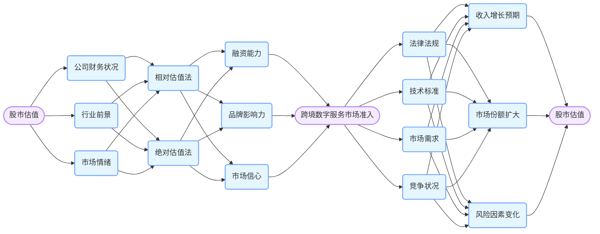

# 股市估值对跨境数字服务市场准入的影响

> 关键词：股市估值、跨境数字服务、市场准入、影响机制、经济关联

> 摘要：本文聚焦于股市估值对跨境数字服务市场准入的影响。在全球化和数字化快速发展的背景下，跨境数字服务市场日益重要。股市估值作为衡量企业价值和市场预期的重要指标，其波动和水平可能对跨境数字服务市场的准入产生多方面的影响。文章将深入剖析股市估值的概念、形成机制以及跨境数字服务市场准入的相关要素，探讨两者之间的内在联系和作用机制，并通过实际案例和理论分析来揭示这种影响的具体表现和潜在后果，为相关企业和政策制定者提供有价值的参考。

## 1. 背景介绍 
### 1.1 目的和范围
随着信息技术的飞速发展和全球经济一体化的推进，跨境数字服务市场呈现出蓬勃发展的态势。股市作为经济的重要组成部分，其估值情况反映了市场对企业未来盈利能力和发展前景的预期。本研究旨在深入探究股市估值与跨境数字服务市场准入之间的关系，明确股市估值如何影响企业进入跨境数字服务市场的决策、机会和条件。研究范围涵盖了不同国家和地区的股市以及跨境数字服务市场，包括软件服务、数字内容、电子商务等多个领域。

### 1.2 预期读者
本文的预期读者包括从事跨境数字服务业务的企业管理人员、投资者、政策制定者以及对金融市场和数字经济领域感兴趣的研究人员。企业管理人员可以从本文中了解股市估值对企业市场准入的影响，从而制定更加合理的发展战略；投资者可以根据股市估值和跨境数字服务市场的关系，做出更明智的投资决策；政策制定者可以依据研究结果，制定更有利于跨境数字服务市场发展的政策；研究人员则可以将本文作为进一步深入研究的参考。

### 1.3 文档结构概述
本文将首先介绍相关的背景知识，包括股市估值和跨境数字服务市场准入的基本概念和形成机制。接着，分析两者之间的核心联系，构建相应的理论模型和流程图。然后，阐述影响股市估值对跨境数字服务市场准入的核心算法原理，并给出具体的操作步骤，同时结合Python代码进行详细说明。之后，运用数学模型和公式对这种影响进行量化分析，并通过实际案例进行举例说明。在项目实战部分，将搭建开发环境，给出实际的代码案例并进行详细解读。随后，探讨股市估值对跨境数字服务市场准入的实际应用场景。再推荐相关的学习资源、开发工具框架和论文著作。最后，总结未来发展趋势与挑战，解答常见问题，并提供扩展阅读和参考资料。

### 1.4 术语表
#### 1.4.1 核心术语定义
- **股市估值**：指对股票市场中上市公司的价值进行评估的过程和结果，通常通过各种估值方法，如市盈率（P/E）、市净率（P/B）等，来衡量股票价格相对于公司盈利、净资产等指标的合理性。
- **跨境数字服务**：指通过互联网等数字技术，在不同国家和地区之间提供的各种服务，包括但不限于软件服务、数字娱乐、在线教育、金融科技服务等。
- **市场准入**：指企业进入某个市场所需要满足的条件和程序，包括法律法规要求、技术标准、资质认证等。

#### 1.4.2 相关概念解释
- **市盈率（P/E）**：是指股票价格与每股盈利的比率，反映了市场对公司未来盈利增长的预期。较高的市盈率通常表示市场对公司的前景较为乐观，愿意为其支付更高的价格。
- **市净率（P/B）**：是指股票价格与每股净资产的比率，衡量了股票价格相对于公司净资产的溢价程度。市净率较高可能意味着市场认为公司具有较高的无形资产价值或成长潜力。
- **数字服务贸易壁垒**：指在跨境数字服务贸易中，由于各国法律法规、政策措施、技术标准等方面的差异，对企业进入市场造成的障碍，如数据本地化要求、网络安全审查等。

#### 1.4.3 缩略词列表
- **P/E**：市盈率（Price-to-Earnings Ratio）
- **P/B**：市净率（Price-to-Book Ratio）
- **GDP**：国内生产总值（Gross Domestic Product）

## 2. 核心概念与联系 

### 2.1 股市估值的原理和机制
股市估值是一个复杂的过程，受到多种因素的影响。从基本原理来看，股票的价值取决于公司未来的现金流折现。市场参与者通过对公司的财务状况、行业前景、竞争优势等因素进行分析，来预测公司未来的盈利水平，并根据一定的折现率将未来现金流折现到当前，从而得出股票的内在价值。

在实际操作中，常用的估值方法包括相对估值法和绝对估值法。相对估值法是通过比较同行业或类似公司的估值指标，如市盈率、市净率等，来评估目标公司的价值。绝对估值法主要包括现金流折现模型（DCF）等，通过对公司未来自由现金流的预测和折现来计算股票的内在价值。

### 2.2 跨境数字服务市场准入的要素
跨境数字服务市场准入涉及多个方面的要素，主要包括法律法规、技术标准、市场需求和竞争状况等。

法律法规方面，不同国家和地区对跨境数字服务的监管政策存在差异，如数据保护法规、知识产权保护法规等。企业需要遵守目标市场的相关法律法规，才能合法进入市场。

技术标准方面，跨境数字服务需要满足一定的技术要求，如网络安全标准、数据传输标准等。企业需要具备相应的技术能力，以确保服务的质量和安全性。

市场需求和竞争状况也是影响市场准入的重要因素。企业需要了解目标市场的需求特点和竞争态势，制定合适的市场策略，才能在市场中立足。

### 2.3 股市估值与跨境数字服务市场准入的联系
股市估值与跨境数字服务市场准入之间存在着密切的联系。一方面，股市估值反映了市场对企业的信心和预期。如果企业的股市估值较高，说明市场对其未来发展前景较为乐观，企业在融资、品牌建设等方面将具有优势，从而更有能力进入跨境数字服务市场。例如，高估值的企业更容易获得投资者的资金支持，用于技术研发、市场拓展等方面。

另一方面，跨境数字服务市场准入的情况也会影响企业的股市估值。如果企业成功进入一个具有潜力的跨境数字服务市场，将有望获得新的收入来源和增长机会，从而提升市场对其的预期，推动股市估值上升。相反，如果企业在市场准入过程中遇到障碍，可能会影响其未来的发展前景，导致股市估值下降。

### 2.4 文本示意图
```plaintext
股市估值
├── 影响因素
│   ├── 公司财务状况
│   ├── 行业前景
│   ├── 市场情绪
├── 估值方法
│   ├── 相对估值法（P/E、P/B）
│   ├── 绝对估值法（DCF）
├── 对跨境数字服务市场准入的影响
│   ├── 融资能力
│   ├── 品牌影响力
│   ├── 市场信心

跨境数字服务市场准入
├── 要素
│   ├── 法律法规
│   ├── 技术标准
│   ├── 市场需求
│   ├── 竞争状况
├── 对股市估值的反馈
│   ├── 收入增长预期
│   ├── 市场份额扩大
│   ├── 风险因素变化
```

### 2.5 Mermaid流程图


## 3. 核心算法原理 & 具体操作步骤 

### 3.1 股市估值算法原理
#### 3.1.1 市盈率估值法
市盈率估值法是一种常用的相对估值方法，其基本原理是通过比较目标公司与同行业其他公司的市盈率，来评估目标公司的股票价值。计算公式为：

$$V = EPS \times P/E$$

其中，$V$ 表示股票的价值，$EPS$ 表示每股盈利，$P/E$ 表示市盈率。

#### 3.1.2 现金流折现模型（DCF）
现金流折现模型是一种绝对估值方法，其基本原理是将公司未来的自由现金流折现到当前，从而得出公司的内在价值。计算公式为：

$$V = \sum_{t=1}^{n} \frac{FCF_t}{(1 + r)^t} + \frac{TV}{(1 + r)^n}$$

其中，$V$ 表示公司的内在价值，$FCF_t$ 表示第 $t$ 年的自由现金流，$r$ 表示折现率，$n$ 表示预测期数，$TV$ 表示终值。

### 3.2 跨境数字服务市场准入评估算法原理
跨境数字服务市场准入评估可以采用综合评分法，通过对法律法规、技术标准、市场需求和竞争状况等多个因素进行评分，然后根据各因素的权重计算综合得分，从而评估企业进入市场的可行性。计算公式为：

$$S = \sum_{i=1}^{m} w_i \times s_i$$

其中，$S$ 表示综合得分，$w_i$ 表示第 $i$ 个因素的权重，$s_i$ 表示第 $i$ 个因素的得分，$m$ 表示因素的个数。

### 3.3 具体操作步骤
#### 3.3.1 股市估值计算步骤
1. **收集数据**：收集目标公司的财务报表，包括利润表、资产负债表等，获取每股盈利等相关数据。同时，收集同行业其他公司的市盈率数据，作为参考。
2. **计算市盈率**：根据目标公司的每股盈利和同行业平均市盈率，计算目标公司的股票价值。
3. **预测自由现金流**：根据目标公司的业务模式和发展规划，预测未来的自由现金流。
4. **确定折现率**：根据市场利率、公司风险等因素，确定合适的折现率。
5. **计算内在价值**：使用现金流折现模型，将预测的自由现金流折现到当前，计算公司的内在价值。

#### 3.3.2 跨境数字服务市场准入评估步骤
1. **确定评估因素**：明确法律法规、技术标准、市场需求和竞争状况等评估因素。
2. **确定因素权重**：根据各因素的重要程度，确定其权重。
3. **进行因素评分**：对每个评估因素进行评分，评分范围可以根据实际情况确定。
4. **计算综合得分**：根据综合评分法的公式，计算企业进入市场的综合得分。
5. **评估结果判断**：根据综合得分，判断企业进入市场的可行性。如果综合得分较高，说明企业进入市场的可行性较大；反之，则说明企业进入市场可能面临较大的困难。

### 3.4 Python代码实现
```python
# 市盈率估值法
def pe_valuation(eps, pe):
    """
    计算股票的市盈率估值
    :param eps: 每股盈利
    :param pe: 市盈率
    :return: 股票价值
    """
    return eps * pe

# 现金流折现模型
def dcf_valuation(fcf_list, r, tv):
    """
    计算公司的现金流折现估值
    :param fcf_list: 未来自由现金流列表
    :param r: 折现率
    :param tv: 终值
    :return: 公司内在价值
    """
    n = len(fcf_list)
    value = 0
    for t in range(n):
        value += fcf_list[t] / ((1 + r) ** (t + 1))
    value += tv / ((1 + r) ** n)
    return value

# 跨境数字服务市场准入评估
def market_access_evaluation(weights, scores):
    """
    计算跨境数字服务市场准入的综合得分
    :param weights: 各因素的权重列表
    :param scores: 各因素的得分列表
    :return: 综合得分
    """
    s = 0
    for i in range(len(weights)):
        s += weights[i] * scores[i]
    return s

# 示例数据
eps = 2.0  # 每股盈利
pe = 20    # 市盈率
fcf_list = [100, 120, 150, 180, 200]  # 未来自由现金流列表
r = 0.1    # 折现率
tv = 1000  # 终值
weights = [0.2, 0.2, 0.3, 0.3]  # 各因素的权重列表
scores = [80, 70, 90, 85]       # 各因素的得分列表

# 计算股市估值
pe_value = pe_valuation(eps, pe)
dcf_value = dcf_valuation(fcf_list, r, tv)

# 计算市场准入综合得分
access_score = market_access_evaluation(weights, scores)

print(f"市盈率估值: {pe_value}")
print(f"现金流折现估值: {dcf_value}")
print(f"市场准入综合得分: {access_score}")
```

## 4. 数学模型和公式 & 详细讲解 & 举例说明 

### 4.1 股市估值数学模型和公式
#### 4.1.1 市盈率估值法
市盈率估值法的数学模型为：

$$V = EPS \times P/E$$

其中，$V$ 表示股票的价值，$EPS$ 表示每股盈利，$P/E$ 表示市盈率。

详细讲解：市盈率估值法的核心思想是通过比较目标公司与同行业其他公司的市盈率，来评估目标公司的股票价值。市盈率反映了市场对公司未来盈利增长的预期，较高的市盈率通常表示市场对公司的前景较为乐观。

举例说明：假设某公司的每股盈利为 $2$ 元，同行业平均市盈率为 $20$ 倍，则该公司的股票价值为：

$$V = 2 \times 20 = 40$$（元）

#### 4.1.2 现金流折现模型（DCF）
现金流折现模型的数学模型为：

$$V = \sum_{t=1}^{n} \frac{FCF_t}{(1 + r)^t} + \frac{TV}{(1 + r)^n}$$

其中，$V$ 表示公司的内在价值，$FCF_t$ 表示第 $t$ 年的自由现金流，$r$ 表示折现率，$n$ 表示预测期数，$TV$ 表示终值。

详细讲解：现金流折现模型的核心思想是将公司未来的自由现金流折现到当前，从而得出公司的内在价值。自由现金流是指公司在满足了所有必要的资本支出后，剩余的可用于分配给股东和债权人的现金流量。折现率反映了投资者对资金时间价值和风险的要求，终值是指预测期结束后公司的持续价值。

举例说明：假设某公司未来 $5$ 年的自由现金流分别为 $100$ 万元、$120$ 万元、$150$ 万元、$180$ 万元和 $200$ 万元，折现率为 $10\%$，预测期结束后的终值为 $1000$ 万元，则该公司的内在价值为：

$$V = \frac{100}{(1 + 0.1)^1} + \frac{120}{(1 + 0.1)^2} + \frac{150}{(1 + 0.1)^3} + \frac{180}{(1 + 0.1)^4} + \frac{200}{(1 + 0.1)^5} + \frac{1000}{(1 + 0.1)^5}$$

```python
fcf_list = [100, 120, 150, 180, 200]
r = 0.1
tv = 1000
n = len(fcf_list)
value = 0
for t in range(n):
    value += fcf_list[t] / ((1 + r) ** (t + 1))
value += tv / ((1 + r) ** n)
print(f"公司内在价值: {value} 万元")
```

### 4.2 跨境数字服务市场准入评估数学模型和公式
跨境数字服务市场准入评估的数学模型为：

$$S = \sum_{i=1}^{m} w_i \times s_i$$

其中，$S$ 表示综合得分，$w_i$ 表示第 $i$ 个因素的权重，$s_i$ 表示第 $i$ 个因素的得分，$m$ 表示因素的个数。

详细讲解：跨境数字服务市场准入评估采用综合评分法，通过对法律法规、技术标准、市场需求和竞争状况等多个因素进行评分，然后根据各因素的权重计算综合得分，从而评估企业进入市场的可行性。权重反映了各因素在评估中的重要程度，得分则反映了企业在该因素上的表现。

举例说明：假设某企业在法律法规、技术标准、市场需求和竞争状况四个因素上的得分分别为 $80$ 分、$70$ 分、$90$ 分和 $85$ 分，各因素的权重分别为 $0.2$、$0.2$、$0.3$ 和 $0.3$，则该企业进入市场的综合得分为：

$$S = 0.2 \times 80 + 0.2 \times 70 + 0.3 \times 90 + 0.3 \times 85 = 82.5$$（分）

```python
weights = [0.2, 0.2, 0.3, 0.3]
scores = [80, 70, 90, 85]
s = 0
for i in range(len(weights)):
    s += weights[i] * scores[i]
print(f"市场准入综合得分: {s} 分")
```

### 4.3 股市估值与跨境数字服务市场准入关系的数学模型
为了进一步探究股市估值与跨境数字服务市场准入之间的关系，我们可以构建一个简单的线性回归模型：

$$S = \beta_0 + \beta_1 V + \epsilon$$

其中，$S$ 表示跨境数字服务市场准入的综合得分，$V$ 表示股市估值，$\beta_0$ 表示截距，$\beta_1$ 表示斜率，$\epsilon$ 表示误差项。

详细讲解：该模型假设跨境数字服务市场准入的综合得分与股市估值之间存在线性关系。斜率 $\beta_1$ 表示股市估值每增加一个单位，市场准入综合得分的变化量。误差项 $\epsilon$ 表示除了股市估值之外，其他因素对市场准入综合得分的影响。

举例说明：假设通过对多个企业的数据进行回归分析，得到 $\beta_0 = 50$，$\beta_1 = 0.1$，某企业的股市估值为 $500$，则该企业的市场准入综合得分预测值为：

$$S = 50 + 0.1 \times 500 = 100$$（分）

```python
beta_0 = 50
beta_1 = 0.1
V = 500
S = beta_0 + beta_1 * V
print(f"市场准入综合得分预测值: {S} 分")
```

## 5. 项目实战：代码实际案例和详细解释说明 

### 5.1  开发环境搭建
#### 5.1.1 安装Python
首先，需要安装Python编程语言。可以从Python官方网站（https://www.python.org/downloads/）下载适合自己操作系统的Python版本，并按照安装向导进行安装。

#### 5.1.2 安装必要的库
在本项目中，需要使用一些Python库，如`pandas`用于数据处理，`numpy`用于数值计算。可以使用以下命令进行安装：

```sh
pip install pandas numpy
```

### 5.2  源代码详细实现和代码解读
```python
import pandas as pd
import numpy as np

# 模拟股市估值数据
np.random.seed(0)
num_companies = 100
stock_valuations = np.random.randint(100, 1000, num_companies)

# 模拟跨境数字服务市场准入综合得分数据
# 假设市场准入综合得分与股市估值存在一定的线性关系，并添加一些随机噪声
noise = np.random.normal(0, 10, num_companies)
market_access_scores = 50 + 0.1 * stock_valuations + noise

# 创建DataFrame
data = pd.DataFrame({
    'StockValuation': stock_valuations,
    'MarketAccessScore': market_access_scores
})

# 保存数据到CSV文件
data.to_csv('stock_valuation_market_access.csv', index=False)

# 读取数据
data = pd.read_csv('stock_valuation_market_access.csv')

# 进行线性回归分析
from sklearn.linear_model import LinearRegression

X = data[['StockValuation']]
y = data['MarketAccessScore']

model = LinearRegression()
model.fit(X, y)

# 输出回归系数
print(f"截距: {model.intercept_}")
print(f"斜率: {model.coef_[0]}")

# 预测新的市场准入综合得分
new_stock_valuation = np.array([[500]])
predicted_score = model.predict(new_stock_valuation)
print(f"预测的市场准入综合得分: {predicted_score[0]}")
```

### 5.3  代码解读与分析
#### 5.3.1 数据模拟
首先，使用`numpy`库模拟了 $100$ 家企业的股市估值数据和跨境数字服务市场准入综合得分数据。假设市场准入综合得分与股市估值存在一定的线性关系，并添加了一些随机噪声，以模拟实际情况中的不确定性。

#### 5.3.2 数据保存和读取
将模拟的数据保存到CSV文件中，方便后续分析。然后，使用`pandas`库读取CSV文件，将数据加载到DataFrame中。

#### 5.3.3 线性回归分析
使用`sklearn`库中的`LinearRegression`类进行线性回归分析。将股市估值作为自变量，市场准入综合得分作为因变量，拟合线性回归模型。

#### 5.3.4 输出回归系数和预测结果
输出线性回归模型的截距和斜率，这些系数反映了股市估值与市场准入综合得分之间的关系。然后，使用拟合好的模型预测新的股市估值对应的市场准入综合得分。

通过这个项目实战，我们可以看到如何使用Python代码来模拟数据、进行线性回归分析，并预测股市估值对跨境数字服务市场准入的影响。

## 6. 实际应用场景 
### 6.1 企业决策
对于从事跨境数字服务业务的企业来说，股市估值可以作为评估自身实力和市场竞争力的重要指标。如果企业的股市估值较高，说明市场对其未来发展前景较为乐观，企业可以利用这一优势，加大在技术研发、市场拓展等方面的投入，积极进入跨境数字服务市场。例如，一家高估值的软件服务企业可以利用融资资金，在海外市场建立研发中心和销售团队，推广自己的产品和服务。

相反，如果企业的股市估值较低，可能需要重新审视自身的发展战略，寻找提升估值的途径。例如，企业可以加强与合作伙伴的合作，提高产品质量和服务水平，改善财务状况等，以增强市场对其的信心，为进入跨境数字服务市场创造条件。

### 6.2 投资者决策
投资者可以根据股市估值和跨境数字服务市场的发展趋势，做出更明智的投资决策。如果某家企业的股市估值较低，但具有进入跨境数字服务市场的潜力，投资者可以考虑在适当的时候买入该企业的股票，以期获得未来的增值收益。例如，一家新兴的数字娱乐企业，虽然目前股市估值不高，但如果其拥有独特的技术和创新的商业模式，有望在跨境数字服务市场中取得突破，投资者可以关注其发展动态，适时进行投资。

另一方面，如果某家企业的股市估值过高，而其在跨境数字服务市场的发展前景并不乐观，投资者则需要谨慎考虑是否继续持有该企业的股票。例如，一家传统的软件企业，虽然股市估值较高，但如果其在跨境数字服务领域的竞争力较弱，面临着激烈的市场竞争和技术变革的挑战，投资者可能需要考虑减持或卖出该企业的股票。

### 6.3 政策制定
政府部门可以根据股市估值和跨境数字服务市场的情况，制定相应的政策，促进跨境数字服务市场的健康发展。例如，如果发现股市估值较高的企业在进入跨境数字服务市场时遇到了一些障碍，政府可以出台相关政策，简化市场准入程序，降低市场准入门槛，为企业提供更好的政策环境。同时，政府还可以加大对跨境数字服务产业的扶持力度，鼓励企业进行技术创新和国际合作，提高产业的整体竞争力。

此外，政府还可以通过监管措施，规范跨境数字服务市场的秩序，防范金融风险。例如，加强对企业股市估值的监管，防止企业通过虚假宣传等手段抬高股市估值，误导投资者。同时，加强对跨境数字服务交易的监管，保障数据安全和消费者权益。

### 6.4 行业分析
行业分析师可以通过研究股市估值和跨境数字服务市场准入的关系，深入了解行业的发展趋势和竞争格局。例如，分析不同企业的股市估值变化情况，以及其在跨境数字服务市场的表现，可以找出行业的领先企业和潜在的竞争对手。同时，通过对股市估值和市场准入因素的综合分析，还可以预测行业的未来发展趋势，为企业和投资者提供决策参考。

## 7. 工具和资源推荐
### 7.1 学习资源推荐
#### 7.1.1 书籍推荐
- 《金融市场与金融机构》（Mishkin, Frederic S.）：这本书系统地介绍了金融市场的基本概念、运行机制和金融机构的业务活动，对于理解股市估值和金融市场的运作具有重要的参考价值。
- 《数字经济：新时代的新引擎》（蔡跃洲）：本书深入探讨了数字经济的发展趋势、技术应用和商业模式，有助于了解跨境数字服务市场的特点和发展规律。
- 《估值：难点、解决方案及相关案例》（Koller, Tim；Goedhart, Marc；Wessels, David）：详细介绍了各种估值方法和技巧，对于掌握股市估值的原理和实践具有很大的帮助。

#### 7.1.2 在线课程
- Coursera上的“金融市场”课程：由耶鲁大学的罗伯特·席勒教授授课，内容涵盖了金融市场的各个方面，包括股票市场、债券市场等，对于学习金融市场和股市估值非常有帮助。
- edX上的“数字经济与创新”课程：该课程介绍了数字经济的发展现状和未来趋势，以及数字技术在各个领域的应用，有助于了解跨境数字服务市场的相关知识。
- Udemy上的“Python数据分析实战”课程：通过实际案例，教授如何使用Python进行数据分析和处理，对于进行股市估值和市场准入分析的数据分析工作具有重要的指导作用。

#### 7.1.3 技术博客和网站
- 雪球网（https://xueqiu.com/）：是一个专业的财经社区，提供了丰富的股市资讯、研究报告和投资者交流平台，对于了解股市动态和企业估值情况非常有帮助。
- 艾瑞咨询（https://www.iresearch.com.cn/）：专注于互联网和数字经济领域的研究，发布了大量关于跨境数字服务市场的研究报告和分析文章，是获取行业信息的重要来源。
- 开源中国（https://www.oschina.net/）：提供了丰富的技术资源和开源项目，对于学习Python编程和数据分析相关技术非常有帮助。

### 7.2 开发工具框架推荐
#### 7.2.1 IDE和编辑器
- PyCharm：是一款专业的Python集成开发环境，具有强大的代码编辑、调试和项目管理功能，非常适合Python开发。
- Jupyter Notebook：是一个交互式的开发环境，支持Python等多种编程语言，方便进行数据分析和可视化展示。
- Visual Studio Code：是一款轻量级的代码编辑器，支持多种编程语言和插件扩展，具有丰富的功能和良好的用户体验。

#### 7.2.2 调试和性能分析工具
- PDB：是Python自带的调试工具，可以帮助开发者在代码中设置断点、单步执行等，方便进行调试和问题排查。
- cProfile：是Python的性能分析工具，可以统计代码的执行时间和函数调用次数，帮助开发者找出代码中的性能瓶颈。
- Py-Spy：是一个用于分析Python程序性能的工具，可以实时监测Python程序的CPU使用率和函数调用情况，帮助开发者优化代码性能。

#### 7.2.3 相关框架和库
- Pandas：是一个强大的数据分析库，提供了高效的数据结构和数据处理功能，方便进行数据清洗、分析和可视化。
- Numpy：是Python的数值计算库，提供了高效的多维数组对象和各种数学函数，是进行数据分析和科学计算的基础库。
- Scikit-learn：是一个常用的机器学习库，提供了各种机器学习算法和工具，方便进行数据建模和预测分析。

### 7.3 相关论文著作推荐
#### 7.3.1 经典论文
- Fama, Eugene F., and Kenneth R. French. "The Cross‐Section of Expected Stock Returns." The Journal of Finance 47.2 (1992): 427-465. 这篇论文提出了著名的Fama-French三因子模型，对于理解股票收益率的影响因素具有重要的理论意义。
- Porter, Michael E. "The Competitive Advantage of Nations." Harvard business review 68.2 (1990): 73-93. 该论文提出了国家竞争优势理论，对于分析企业在国际市场的竞争力和市场准入具有重要的指导作用。

#### 7.3.2 最新研究成果
- 关注顶级学术期刊如《Journal of Financial Economics》、《Review of Financial Studies》等，这些期刊会发表关于金融市场和企业估值的最新研究成果。
- 参加国际学术会议，如美国金融协会（AFA）年会等，了解该领域的前沿研究动态。

#### 7.3.3 应用案例分析
- 可以查阅一些咨询公司的研究报告，如麦肯锡、波士顿咨询等，这些报告通常会包含跨境数字服务市场的应用案例分析和行业趋势研究。
- 关注行业龙头企业的年报和公开资料，了解它们在跨境数字服务市场的发展战略和实践经验。

## 8. 总结：未来发展趋势与挑战
### 8.1 未来发展趋势
#### 8.1.1 股市估值与跨境数字服务市场的联系将更加紧密
随着全球经济一体化和数字化的深入发展，跨境数字服务市场将不断扩大，企业的国际化程度将不断提高。股市估值将更加准确地反映企业在跨境数字服务市场的竞争力和发展潜力，两者之间的联系将更加紧密。例如，一家在跨境数字服务领域具有领先技术和市场份额的企业，其股市估值可能会得到显著提升。

#### 8.1.2 技术创新将推动跨境数字服务市场的发展
新兴技术如人工智能、区块链、云计算等将不断应用于跨境数字服务领域，推动服务模式和商业模式的创新。这将为企业带来新的发展机遇，也将对股市估值产生影响。例如，一家利用人工智能技术提供个性化数字服务的企业，可能会在市场上获得更高的估值。

#### 8.1.3 政策环境将不断优化
各国政府将越来越重视跨境数字服务市场的发展，出台更多有利于市场准入和发展的政策。例如，降低关税、简化审批程序、加强知识产权保护等。这将为企业进入跨境数字服务市场提供更好的政策环境，促进市场的繁荣发展。

### 8.2 挑战
#### 8.2.1 数据安全和隐私问题
跨境数字服务涉及大量的数据传输和存储，数据安全和隐私问题成为了制约市场发展的重要因素。企业需要加强数据安全管理，遵守各国的数据保护法规，否则可能会面临法律风险和声誉损失。同时，数据安全问题也会影响投资者对企业的信心，进而影响股市估值。

#### 8.2.2 国际竞争加剧
随着跨境数字服务市场的扩大，国际竞争将日益激烈。企业需要不断提升自身的技术实力和服务水平，以应对来自全球的竞争对手。在激烈的竞争环境下，企业的市场份额和盈利能力可能会受到影响，从而对股市估值产生负面影响。

#### 8.2.3 政策不确定性
不同国家和地区的政策法规存在差异，且政策可能会随着时间的推移而发生变化。这给企业进入跨境数字服务市场带来了一定的不确定性。例如，某国可能会突然出台新的贸易保护政策，限制跨境数字服务的进口，这将对相关企业的市场准入和发展造成不利影响。

## 9. 附录：常见问题与解答
### 9.1 股市估值的准确性如何保证？
股市估值是一个复杂的过程，受到多种因素的影响，因此很难保证其绝对准确性。为了提高估值的准确性，可以采用多种估值方法进行综合评估，同时充分考虑宏观经济环境、行业发展趋势、企业自身的竞争优势等因素。此外，及时更新和分析相关数据，进行敏感性分析，也有助于提高估值的可靠性。

### 9.2 跨境数字服务市场准入的主要障碍有哪些？
跨境数字服务市场准入的主要障碍包括法律法规、技术标准、市场需求和竞争状况等方面。法律法规方面，不同国家和地区对跨境数字服务的监管政策存在差异，如数据保护法规、知识产权保护法规等。技术标准方面，需要满足一定的网络安全标准、数据传输标准等。市场需求和竞争状况方面，需要了解目标市场的需求特点和竞争态势，制定合适的市场策略。

### 9.3 股市估值对跨境数字服务市场准入的影响是单向的吗？
不是。股市估值与跨境数字服务市场准入之间存在相互影响的关系。一方面，股市估值较高的企业在融资、品牌建设等方面具有优势，更有能力进入跨境数字服务市场；另一方面，企业成功进入跨境数字服务市场并取得良好的业绩，将有望提升市场对其的预期，推动股市估值上升。

### 9.4 如何应对跨境数字服务市场准入的挑战？
企业可以通过加强技术研发，提高自身的技术实力和服务水平，以满足不同国家和地区的技术标准和市场需求。同时，加强与当地合作伙伴的合作，了解当地的法律法规和市场环境，制定合适的市场策略。此外，企业还需要加强数据安全管理，保护用户的隐私和数据安全，以应对数据安全和隐私问题带来的挑战。

## 10. 扩展阅读 & 参考资料
### 10.1 扩展阅读
- 《全球数字贸易发展报告》：详细介绍了全球数字贸易的发展现状、趋势和政策环境，对于了解跨境数字服务市场的宏观背景具有重要的参考价值。
- 《金融科技前沿：技术趋势与应用实践》：探讨了金融科技在跨境数字服务领域的应用和发展，对于关注金融科技与跨境数字服务融合的读者具有一定的启发作用。

### 10.2 参考资料
- 各国政府发布的关于跨境数字服务贸易的政策文件和统计数据。
- 国际组织如世界贸易组织（WTO）、国际货币基金组织（IMF）等发布的相关研究报告和统计数据。
- 专业财经媒体和行业研究机构发布的股市估值和跨境数字服务市场的分析报告和研究文章。

作者：AI天才研究院/AI Genius Institute & 禅与计算机程序设计艺术 /Zen And The Art of Computer Programming