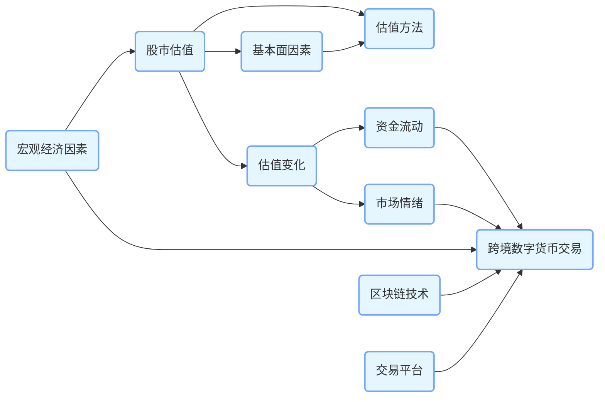

# 股市估值对跨境数字货币交易的影响

> 关键词：股市估值、跨境数字货币交易、金融市场联动、风险传导、市场情绪

> 摘要：本文深入探讨了股市估值对跨境数字货币交易的影响。通过对相关核心概念的阐述、算法原理的分析、数学模型的构建，结合实际案例进行研究。剖析了股市估值与跨境数字货币交易之间的内在联系和作用机制，探讨了其在不同市场环境下的表现及影响因素。同时，给出了实际应用场景、工具资源推荐等内容，并对未来发展趋势与挑战进行了总结，旨在为投资者和市场参与者提供全面深入的参考和指导。

## 1. 背景介绍 
### 1.1 目的和范围
随着全球金融市场的不断发展和融合，股市和数字货币市场都呈现出蓬勃的发展态势。股市估值作为衡量股票市场整体价值的重要指标，反映了市场对上市公司未来盈利能力的预期。而跨境数字货币交易则打破了传统货币和地域的限制，为投资者提供了新的投资渠道和交易方式。本研究的目的在于深入探究股市估值与跨境数字货币交易之间的相互关系和影响机制，分析股市估值的变化如何影响跨境数字货币交易的价格、交易量和市场情绪等方面。研究范围涵盖了全球主要股票市场和数字货币交易市场，包括美国、欧洲、亚洲等地区的股市以及比特币、以太坊等主流数字货币的跨境交易。

### 1.2 预期读者
本文的预期读者包括金融市场投资者、金融分析师、数字货币交易从业者、学术研究人员以及对金融市场和数字货币感兴趣的人士。对于投资者来说，了解股市估值对跨境数字货币交易的影响有助于优化投资组合，降低投资风险，提高投资收益。金融分析师可以通过本文的研究结果，为客户提供更准确的市场分析和投资建议。数字货币交易从业者能够更好地把握市场动态，制定合理的交易策略。学术研究人员可以在此基础上开展更深入的理论研究和实证分析。

### 1.3 文档结构概述
本文将按照以下结构进行阐述：首先介绍相关的核心概念和联系，包括股市估值和跨境数字货币交易的定义、特点以及两者之间的关联；接着详细讲解核心算法原理和具体操作步骤，通过Python代码进行示例；然后构建数学模型和公式，对两者之间的关系进行量化分析，并举例说明；之后通过实际案例展示股市估值对跨境数字货币交易的影响；再探讨实际应用场景，分析其在投资决策、风险管理等方面的应用；推荐相关的学习资源、开发工具框架和论文著作；最后总结未来发展趋势与挑战，并给出常见问题与解答以及扩展阅读和参考资料。

### 1.4 术语表
#### 1.4.1 核心术语定义
- **股市估值**：是指对股票市场中上市公司的价值进行评估的过程和结果。常见的估值方法包括市盈率（P/E）、市净率（P/B）、现金流折现法（DCF）等，用于衡量股票价格相对于公司盈利、净资产等指标的合理性。
- **跨境数字货币交易**：是指跨越不同国家或地区进行的数字货币买卖活动。数字货币是一种基于区块链技术的虚拟货币，具有去中心化、匿名性、全球流通等特点，跨境交易可以通过数字货币交易平台实现。
- **市场情绪**：是指投资者对金融市场的整体看法和心理预期，通常表现为乐观或悲观的情绪。市场情绪会影响投资者的决策和行为，进而对股市和数字货币市场的价格和交易量产生影响。

#### 1.4.2 相关概念解释
- **风险传导**：是指一个市场的风险因素通过各种渠道传递到其他市场的过程。在股市和数字货币市场中，风险传导可能表现为股市估值的下降导致投资者对整个金融市场的信心下降，进而引发对数字货币的抛售，导致数字货币价格下跌。
- **金融市场联动**：是指不同金融市场之间存在的相互影响和关联关系。股市和数字货币市场作为金融市场的重要组成部分，它们之间的联动关系可能受到宏观经济因素、政策法规、投资者行为等多种因素的影响。

#### 1.4.3 缩略词列表
- **P/E**：市盈率（Price-to-Earnings Ratio），是指股票价格与每股收益的比率，用于衡量股票的估值水平。
- **P/B**：市净率（Price-to-Book Ratio），是指股票价格与每股净资产的比率，反映了股票价格相对于公司净资产的倍数。
- **DCF**：现金流折现法（Discounted Cash Flow），是一种通过预测公司未来的现金流并将其折现到当前价值的估值方法。

## 2. 核心概念与联系 

### 股市估值的原理和架构
股市估值是基于对上市公司基本面和未来发展前景的评估。从基本面来看，公司的盈利能力、资产质量、负债水平等因素都会影响其估值。常见的估值方法及其原理如下：
- **市盈率法**：市盈率是股票价格与每股收益的比值。其原理是通过比较不同公司的市盈率，来判断股票的相对估值水平。一般来说，市盈率较低的股票可能被低估，具有投资价值；而市盈率较高的股票可能被高估，存在投资风险。
- **市净率法**：市净率是股票价格与每股净资产的比值。它反映了市场对公司净资产的定价。市净率较低的股票可能表示公司的资产被低估，具有一定的安全边际。
- **现金流折现法**：该方法通过预测公司未来的现金流，并将其折现到当前价值。其核心思想是公司的价值等于其未来产生的现金流的现值之和。

### 跨境数字货币交易的原理和架构
跨境数字货币交易基于区块链技术实现。区块链是一种去中心化的分布式账本，记录了所有数字货币的交易信息。数字货币交易平台作为中介，为投资者提供交易服务。投资者可以通过交易平台买卖数字货币，交易过程通过区块链网络进行验证和记录。

### 两者之间的联系
股市估值与跨境数字货币交易之间存在着多方面的联系：
- **资金流动**：当股市估值较高时，投资者可能认为股票市场存在泡沫，会将部分资金从股市转移到数字货币市场，导致数字货币市场的资金流入增加，价格上涨；反之，当股市估值较低时，投资者可能会将资金从数字货币市场撤回，投入股市，导致数字货币市场的资金流出增加，价格下跌。
- **市场情绪**：股市估值的变化会影响投资者的市场情绪。当股市估值上升时，投资者情绪乐观，对整个金融市场的信心增强，可能会增加对数字货币的投资；当股市估值下降时，投资者情绪悲观，可能会减少对数字货币的投资，甚至抛售数字货币。
- **宏观经济因素**：宏观经济因素如经济增长、通货膨胀、利率等会同时影响股市估值和跨境数字货币交易。例如，经济增长放缓可能导致股市估值下降，同时也会使投资者对数字货币的需求增加，因为数字货币被视为一种避险资产。

### 文本示意图
```plaintext
股市估值
|-- 基本面因素（盈利能力、资产质量等）
|   |-- 影响估值方法（市盈率、市净率、现金流折现法）
|-- 估值变化
    |-- 影响资金流动
    |   |-- 流入或流出数字货币市场
    |-- 影响市场情绪
    |   |-- 乐观或悲观情绪影响数字货币投资决策
    |-- 受宏观经济因素影响
        |-- 经济增长、通货膨胀、利率等

跨境数字货币交易
|-- 基于区块链技术
|   |-- 分布式账本记录交易信息
|-- 交易平台
|   |-- 提供交易服务
|-- 交易行为
    |-- 受股市估值影响（资金流动、市场情绪）
    |-- 受宏观经济因素影响
```

### Mermaid 流程图


## 3. 核心算法原理 & 具体操作步骤 

### 相关性分析算法原理
为了研究股市估值与跨境数字货币交易之间的关系，我们可以使用相关性分析算法。相关性分析是一种统计方法，用于衡量两个变量之间的线性关系强度和方向。常用的相关性系数包括皮尔逊相关系数（Pearson correlation coefficient），其计算公式为：

$$r = \frac{\sum_{i=1}^{n} (x_i - \bar{x})(y_i - \bar{y})}{\sqrt{\sum_{i=1}^{n} (x_i - \bar{x})^2 \sum_{i=1}^{n} (y_i - \bar{y})^2}}$$

其中，$x_i$ 和 $y_i$ 分别是两个变量的第 $i$ 个观测值，$\bar{x}$ 和 $\bar{y}$ 分别是两个变量的均值，$n$ 是观测值的数量。$r$ 的取值范围在 $-1$ 到 $1$ 之间，$r$ 越接近 $1$ 表示两个变量之间存在正相关关系，$r$ 越接近 $-1$ 表示两个变量之间存在负相关关系，$r$ 接近 $0$ 表示两个变量之间不存在线性相关关系。

### Python 代码实现
```python
import numpy as np
import pandas as pd
import yfinance as yf
import ccxt

# 获取股市估值数据（以标普 500 指数市盈率为例）
sp500 = yf.Ticker("^GSPC")
sp500_history = sp500.history(period="1y")
# 这里简化处理，假设市盈率数据可以从其他数据源获取，用随机数据代替
pe_ratio = np.random.rand(len(sp500_history))

# 获取跨境数字货币交易数据（以比特币为例）
exchange = ccxt.binance()
btc_ohlcv = exchange.fetch_ohlcv('BTC/USDT', '1d', limit=len(sp500_history))
btc_prices = [x[4] for x in btc_ohlcv]

# 计算皮尔逊相关系数
correlation = np.corrcoef(pe_ratio, btc_prices)[0, 1]

print(f"股市估值（标普 500 市盈率）与比特币价格的皮尔逊相关系数: {correlation}")
```

### 具体操作步骤
1. **数据获取**：使用金融数据接口（如 `yfinance` 库获取股市数据，`ccxt` 库获取数字货币交易数据）获取股市估值数据和跨境数字货币交易数据。
2. **数据预处理**：对获取的数据进行清洗、整理和标准化处理，确保数据的质量和一致性。
3. **计算相关性系数**：使用 `numpy` 库的 `corrcoef` 函数计算股市估值数据和跨境数字货币交易数据之间的皮尔逊相关系数。
4. **结果分析**：根据计算得到的相关性系数，分析股市估值与跨境数字货币交易之间的关系。如果相关性系数为正且接近 $1$，则说明两者之间存在较强的正相关关系；如果相关性系数为负且接近 $-1$，则说明两者之间存在较强的负相关关系；如果相关性系数接近 $0$，则说明两者之间不存在明显的线性相关关系。

## 4. 数学模型和公式 & 详细讲解 & 举例说明 

### 线性回归模型
线性回归模型是一种用于建立两个或多个变量之间线性关系的统计模型。假设股市估值为 $x$，跨境数字货币交易价格为 $y$，则线性回归模型可以表示为：

$$y = \beta_0 + \beta_1 x + \epsilon$$

其中，$\beta_0$ 是截距项，$\beta_1$ 是斜率项，$\epsilon$ 是误差项，服从均值为 $0$、方差为 $\sigma^2$ 的正态分布。

### 参数估计
为了估计线性回归模型的参数 $\beta_0$ 和 $\beta_1$，可以使用最小二乘法。最小二乘法的目标是使误差项的平方和最小，即：

$$\min_{\beta_0, \beta_1} \sum_{i=1}^{n} (y_i - \beta_0 - \beta_1 x_i)^2$$

通过对上述目标函数求偏导数并令其等于 $0$，可以得到参数的估计值：

$$\hat{\beta}_1 = \frac{\sum_{i=1}^{n} (x_i - \bar{x})(y_i - \bar{y})}{\sum_{i=1}^{n} (x_i - \bar{x})^2}$$

$$\hat{\beta}_0 = \bar{y} - \hat{\beta}_1 \bar{x}$$

其中，$\hat{\beta}_0$ 和 $\hat{\beta}_1$ 分别是 $\beta_0$ 和 $\beta_1$ 的估计值，$\bar{x}$ 和 $\bar{y}$ 分别是 $x$ 和 $y$ 的均值。

### 模型评估
可以使用决定系数 $R^2$ 来评估线性回归模型的拟合优度。$R^2$ 的计算公式为：

$$R^2 = 1 - \frac{\sum_{i=1}^{n} (y_i - \hat{y}_i)^2}{\sum_{i=1}^{n} (y_i - \bar{y})^2}$$

其中，$\hat{y}_i$ 是根据线性回归模型预测的 $y$ 值。$R^2$ 的取值范围在 $0$ 到 $1$ 之间，$R^2$ 越接近 $1$ 表示模型的拟合效果越好。

### 举例说明
假设我们有以下股市估值（$x$）和跨境数字货币交易价格（$y$）的数据：

| 股市估值 ($x$) | 跨境数字货币交易价格 ($y$) |
| --- | --- |
| 10 | 200 |
| 12 | 220 |
| 14 | 240 |
| 16 | 260 |
| 18 | 280 |

首先，计算 $x$ 和 $y$ 的均值：

$$\bar{x} = \frac{10 + 12 + 14 + 16 + 18}{5} = 14$$

$$\bar{y} = \frac{200 + 220 + 240 + 260 + 280}{5} = 240$$

然后，计算 $\hat{\beta}_1$ 和 $\hat{\beta}_0$：

$$\sum_{i=1}^{5} (x_i - \bar{x})(y_i - \bar{y}) = (10 - 14)(200 - 240) + (12 - 14)(220 - 240) + (14 - 14)(240 - 240) + (16 - 14)(260 - 240) + (18 - 14)(280 - 240) = 400$$

$$\sum_{i=1}^{5} (x_i - \bar{x})^2 = (10 - 14)^2 + (12 - 14)^2 + (14 - 14)^2 + (16 - 14)^2 + (18 - 14)^2 = 40$$

$$\hat{\beta}_1 = \frac{400}{40} = 10$$

$$\hat{\beta}_0 = 240 - 10 \times 14 = 100$$

所以，线性回归模型为 $y = 100 + 10x$。

最后，计算 $R^2$：

$$\hat{y}_1 = 100 + 10 \times 10 = 200$$
$$\hat{y}_2 = 100 + 10 \times 12 = 220$$
$$\hat{y}_3 = 100 + 10 \times 14 = 240$$
$$\hat{y}_4 = 100 + 10 \times 16 = 260$$
$$\hat{y}_5 = 100 + 10 \times 18 = 280$$

$$\sum_{i=1}^{5} (y_i - \hat{y}_i)^2 = 0$$

$$\sum_{i=1}^{5} (y_i - \bar{y})^2 = (200 - 240)^2 + (220 - 240)^2 + (240 - 240)^2 + (260 - 240)^2 + (280 - 240)^2 = 4000$$

$$R^2 = 1 - \frac{0}{4000} = 1$$

这说明该线性回归模型的拟合效果非常好。

## 5. 项目实战：代码实际案例和详细解释说明 

### 5.1 开发环境搭建
#### 安装 Python
首先，需要安装 Python 环境。可以从 Python 官方网站（https://www.python.org/downloads/）下载适合自己操作系统的 Python 版本，并按照安装向导进行安装。

#### 安装必要的库
使用 `pip` 命令安装所需的库：
```sh
pip install numpy pandas yfinance ccxt scikit-learn matplotlib
```

### 5.2 源代码详细实现和代码解读
```python
import numpy as np
import pandas as pd
import yfinance as yf
import ccxt
from sklearn.linear_model import LinearRegression
import matplotlib.pyplot as plt

# 获取股市估值数据（以标普 500 指数市盈率为例）
sp500 = yf.Ticker("^GSPC")
sp500_history = sp500.history(period="1y")
# 这里简化处理，假设市盈率数据可以从其他数据源获取，用随机数据代替
pe_ratio = np.random.rand(len(sp500_history))

# 获取跨境数字货币交易数据（以比特币为例）
exchange = ccxt.binance()
btc_ohlcv = exchange.fetch_ohlcv('BTC/USDT', '1d', limit=len(sp500_history))
btc_prices = [x[4] for x in btc_ohlcv]

# 数据预处理
X = np.array(pe_ratio).reshape(-1, 1)
y = np.array(btc_prices)

# 构建线性回归模型
model = LinearRegression()
model.fit(X, y)

# 预测
predictions = model.predict(X)

# 输出模型参数
print(f"截距项: {model.intercept_}")
print(f"斜率项: {model.coef_[0]}")

# 计算决定系数 R^2
r2 = model.score(X, y)
print(f"决定系数 R^2: {r2}")

# 可视化结果
plt.scatter(X, y, color='blue', label='Actual Data')
plt.plot(X, predictions, color='red', linewidth=2, label='Regression Line')
plt.xlabel('Stock Market Valuation (P/E Ratio)')
plt.ylabel('Bitcoin Price')
plt.title('Relationship between Stock Market Valuation and Bitcoin Price')
plt.legend()
plt.show()
```

### 代码解读与分析
1. **数据获取**：使用 `yfinance` 库获取标普 500 指数的历史数据，并使用随机数据代替市盈率数据；使用 `ccxt` 库获取比特币的历史交易数据。
2. **数据预处理**：将股市估值数据和比特币价格数据转换为 `numpy` 数组，并将股市估值数据调整为二维数组，以满足 `scikit-learn` 库中线性回归模型的输入要求。
3. **模型构建与训练**：使用 `scikit-learn` 库的 `LinearRegression` 类构建线性回归模型，并使用 `fit` 方法对模型进行训练。
4. **预测与评估**：使用训练好的模型对股市估值数据进行预测，并计算决定系数 $R^2$ 来评估模型的拟合效果。
5. **可视化**：使用 `matplotlib` 库绘制散点图和回归直线，直观展示股市估值与比特币价格之间的关系。

## 6. 实际应用场景 
### 投资决策
投资者可以根据股市估值的变化来调整对跨境数字货币的投资策略。当股市估值较高时，投资者可以适当增加对数字货币的投资比例，以分散投资风险；当股市估值较低时，投资者可以减少对数字货币的投资，增加对股票的投资。例如，在 2008 年金融危机期间，股市估值大幅下降，许多投资者将资金转移到黄金和数字货币等避险资产，导致比特币等数字货币价格上涨。

### 风险管理
金融机构和企业可以利用股市估值与跨境数字货币交易之间的关系进行风险管理。通过建立风险预警模型，监测股市估值和数字货币价格的变化，及时发现潜在的风险。当股市估值和数字货币价格出现异常波动时，金融机构可以采取相应的措施，如调整投资组合、增加保证金等，以降低风险损失。

### 市场监测
监管机构可以通过监测股市估值和跨境数字货币交易的情况，及时发现市场异常行为和潜在的金融风险。例如，当股市估值过高且数字货币市场出现异常的资金流入时，监管机构可以加强对数字货币市场的监管，防范金融泡沫的形成和破裂。

## 7. 工具和资源推荐
### 7.1 学习资源推荐
#### 7.1.1 书籍推荐
- 《金融市场与金融机构》：全面介绍了金融市场的各种组成部分和金融机构的运作原理，对于理解股市和数字货币市场的基本概念和机制非常有帮助。
- 《数字货币：从入门到精通》：详细介绍了数字货币的技术原理、交易机制和投资策略，适合初学者深入了解数字货币。
- 《量化投资：策略与技术》：介绍了量化投资的基本方法和技术，包括数据处理、模型构建和回测等，对于研究股市估值和数字货币交易之间的关系具有重要的参考价值。

#### 7.1.2 在线课程
- Coursera 上的“金融市场”课程：由知名大学教授授课，系统讲解了金融市场的理论和实践知识。
- Udemy 上的“数字货币投资与交易”课程：提供了数字货币投资的实用技巧和策略，适合想要参与数字货币交易的投资者。
- edX 上的“量化金融”课程：深入介绍了量化金融的方法和模型，对于进行股市估值和数字货币交易的量化分析有很大的帮助。

#### 7.1.3 技术博客和网站
- CoinDesk：是一家专注于数字货币和区块链技术的媒体网站，提供最新的行业新闻、分析和研究报告。
- Seeking Alpha：是一个金融市场分析和投资建议的平台，有许多专业的分析师分享对股市和数字货币市场的看法和研究成果。
- Medium 上的金融科技相关博客：有很多作者分享关于金融科技、数字货币和量化投资的技术文章和经验分享。

### 7.2 开发工具框架推荐
#### 7.2.1 IDE和编辑器
- PyCharm：是一款专业的 Python 集成开发环境，提供了丰富的代码编辑、调试和分析功能，适合开发和调试 Python 代码。
- Jupyter Notebook：是一个交互式的开发环境，支持多种编程语言，方便进行数据探索、模型构建和可视化展示。
- Visual Studio Code：是一款轻量级的代码编辑器，支持多种编程语言和插件扩展，适合快速开发和调试代码。

#### 7.2.2 调试和性能分析工具
- PDB：是 Python 自带的调试工具，可以帮助开发者定位和解决代码中的问题。
- cProfile：是 Python 标准库中的性能分析工具，可以分析代码的运行时间和函数调用情况，帮助开发者优化代码性能。
- TensorBoard：是 TensorFlow 提供的可视化工具，可以用于可视化模型训练过程和结果，方便开发者进行模型调优。

#### 7.2.3 相关框架和库
- NumPy：是 Python 中用于科学计算的基础库，提供了高效的数组操作和数学函数。
- Pandas：是 Python 中用于数据处理和分析的库，提供了数据结构和数据操作方法，方便进行数据清洗、整理和分析。
- Scikit-learn：是 Python 中用于机器学习的库，提供了各种机器学习算法和工具，适合进行模型构建和评估。
- Matplotlib：是 Python 中用于数据可视化的库，提供了丰富的绘图函数和工具，方便进行数据可视化展示。

### 7.3 相关论文著作推荐
#### 7.3.1 经典论文
- "Efficient Capital Markets: A Review of Theory and Empirical Work" by Eugene F. Fama：该论文提出了有效市场假说，对金融市场的研究产生了深远的影响。
- "The Pricing of Options and Corporate Liabilities" by Fischer Black and Myron Scholes：该论文提出了布莱克 - 斯科尔斯期权定价模型，为金融衍生品的定价提供了重要的理论基础。
- "Bitcoin: A Peer-to-Peer Electronic Cash System" by Satoshi Nakamoto：该论文是比特币的白皮书，详细介绍了比特币的技术原理和设计理念。

#### 7.3.2 最新研究成果
- 关注顶级金融学术期刊，如《Journal of Finance》、《Review of Financial Studies》等，这些期刊经常发表关于金融市场和数字货币的最新研究成果。
- 参加金融科技领域的学术会议，如 ACM SIGKDD、IEEE ICDM 等，了解最新的研究动态和技术发展趋势。

#### 7.3.3 应用案例分析
- 研究大型金融机构和企业在股市估值和数字货币交易方面的应用案例，了解他们的投资策略、风险管理方法和技术应用。
- 分析数字货币交易平台的运营模式和市场数据，了解数字货币市场的发展趋势和规律。

## 8. 总结：未来发展趋势与挑战
### 未来发展趋势
- **市场融合加深**：随着全球金融市场的不断发展和融合，股市和数字货币市场之间的联系将更加紧密。股市估值的变化将对跨境数字货币交易产生更大的影响，同时数字货币市场的发展也将对股市产生反馈作用。
- **技术创新推动**：区块链技术、人工智能、大数据等技术的不断创新将为股市估值和跨境数字货币交易带来新的机遇和挑战。例如，人工智能技术可以用于股市估值的预测和数字货币交易的策略优化，大数据技术可以用于市场监测和风险预警。
- **监管加强**：随着数字货币市场的不断发展，监管机构将加强对数字货币市场的监管。监管政策的变化将对股市估值和跨境数字货币交易产生重要的影响，投资者和市场参与者需要密切关注监管动态。

### 挑战
- **市场不确定性**：股市和数字货币市场都具有较高的不确定性，受到宏观经济因素、政策法规、市场情绪等多种因素的影响。准确预测股市估值和跨境数字货币交易的变化趋势非常困难，投资者需要承担较高的投资风险。
- **技术安全问题**：数字货币交易基于区块链技术，虽然区块链技术具有去中心化、不可篡改等优点，但也存在技术安全问题，如黑客攻击、智能合约漏洞等。保障数字货币交易的技术安全是一个重要的挑战。
- **监管协调难度大**：由于股市和数字货币市场具有全球性和跨境性的特点，监管协调难度较大。不同国家和地区的监管政策存在差异，如何实现全球范围内的监管协调是一个亟待解决的问题。

## 9. 附录：常见问题与解答
### 问题 1：股市估值和跨境数字货币交易之间的关系是否稳定？
解答：股市估值和跨境数字货币交易之间的关系并不是稳定不变的，它受到多种因素的影响，如宏观经济环境、政策法规、市场情绪等。在不同的市场环境下，两者之间的关系可能会发生变化。例如，在经济繁荣时期，股市估值和数字货币价格可能同时上涨；而在经济衰退时期，股市估值可能下降，数字货币价格可能受到避险需求的影响而上涨。

### 问题 2：如何利用股市估值来预测跨境数字货币交易的价格？
解答：可以通过建立数学模型，如线性回归模型、时间序列模型等，来分析股市估值和跨境数字货币交易价格之间的关系。根据历史数据对模型进行训练和验证，然后使用训练好的模型对未来的数字货币价格进行预测。需要注意的是，预测结果具有一定的不确定性，需要结合其他因素进行综合分析。

### 问题 3：跨境数字货币交易是否会受到股市估值波动的直接影响？
解答：跨境数字货币交易可能会受到股市估值波动的直接影响，也可能受到间接影响。直接影响表现为资金在股市和数字货币市场之间的流动，当股市估值波动导致投资者调整投资组合时，会直接影响数字货币市场的资金供求关系，从而影响数字货币价格。间接影响表现为股市估值波动影响市场情绪，投资者的市场情绪变化会影响他们对数字货币的投资决策，进而影响数字货币市场的交易情况。

## 10. 扩展阅读 & 参考资料
### 扩展阅读
- 《区块链革命：比特币底层技术如何改变货币、商业和世界》：深入介绍了区块链技术的原理和应用，对于理解数字货币的底层技术具有重要的帮助。
- 《金融科技：重构未来金融生态》：探讨了金融科技的发展趋势和应用场景，包括股市估值和数字货币交易等方面。
- 《人工智能时代的金融风险管理》：介绍了人工智能技术在金融风险管理中的应用，对于研究股市估值和跨境数字货币交易的风险具有参考价值。

### 参考资料
- Fama, Eugene F. "Efficient Capital Markets: A Review of Theory and Empirical Work." The Journal of Finance 25.2 (1970): 383-417.
- Black, Fischer, and Myron Scholes. "The Pricing of Options and Corporate Liabilities." Journal of Political Economy 81.3 (1973): 637-654.
- Nakamoto, Satoshi. "Bitcoin: A Peer-to-Peer Electronic Cash System." (2008).

作者：AI天才研究院/AI Genius Institute & 禅与计算机程序设计艺术 /Zen And The Art of Computer Programming