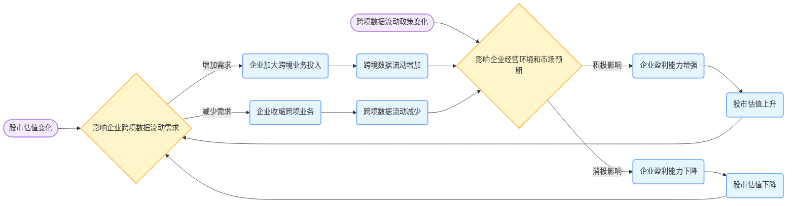

# 股市估值对跨境数据流动政策的影响

> 关键词：股市估值、跨境数据流动政策、金融市场、数据安全、经济影响

> 摘要：本文深入探讨了股市估值对跨境数据流动政策的影响。通过对股市估值和跨境数据流动政策的核心概念阐述，分析两者之间的内在联系。详细讲解了相关核心算法原理和数学模型，结合实际案例进行代码实现和解读。探讨了股市估值影响跨境数据流动政策的实际应用场景，推荐了学习和开发所需的工具与资源。最后总结了未来发展趋势与挑战，并对常见问题进行了解答。旨在为相关领域的研究者和从业者提供全面而深入的参考。

## 1. 背景介绍 
### 1.1 目的和范围
本研究旨在全面剖析股市估值对跨境数据流动政策的影响机制。随着全球经济一体化和数字化进程的加速，跨境数据流动在国际贸易、金融市场等领域发挥着愈发重要的作用。同时，股市作为经济的重要晴雨表，其估值变化不仅反映了市场对企业的预期，也可能对国家的政策制定产生影响。本研究将聚焦于股市估值与跨境数据流动政策之间的关联，分析股市估值如何通过多种途径影响跨境数据流动政策的制定和调整，以及这种政策变化又会如何反作用于股市和经济。研究范围涵盖了金融市场理论、数据安全法规、国际贸易政策等多个领域，旨在从多维度揭示两者之间的复杂关系。

### 1.2 预期读者
本文预期读者包括金融市场研究者、政策制定者、数据安全专家、企业高管以及对跨境数据流动和金融市场感兴趣的专业人士。对于金融市场研究者来说，本文可以为他们提供新的研究视角和思路；政策制定者可以从中了解股市估值对跨境数据流动政策的潜在影响，为政策的制定和调整提供参考；数据安全专家可以通过本文更好地理解金融市场因素在数据流动政策中的作用；企业高管可以根据研究结果制定更合理的跨境业务战略；而对相关领域感兴趣的专业人士则可以通过阅读本文拓宽知识面，加深对这一复杂议题的理解。

### 1.3 文档结构概述
本文将按照以下结构进行阐述：首先介绍核心概念，明确股市估值和跨境数据流动政策的定义、原理和架构，并通过文本示意图和 Mermaid 流程图展示两者之间的联系；接着讲解核心算法原理和具体操作步骤，运用 Python 代码详细阐述相关算法；然后介绍数学模型和公式，通过具体例子说明其应用；之后通过项目实战，展示代码实际案例并进行详细解释；再探讨实际应用场景，分析股市估值对跨境数据流动政策影响在不同场景下的体现；推荐相关的工具和资源，包括学习资源、开发工具框架和论文著作；最后总结未来发展趋势与挑战，解答常见问题，并提供扩展阅读和参考资料。

### 1.4 术语表
#### 1.4.1 核心术语定义
- **股市估值**：指对股票市场中上市公司的价值进行评估的过程和结果。通常通过各种估值方法，如市盈率（P/E）、市净率（P/B）等，来确定股票的合理价格，反映市场对企业未来盈利能力和发展前景的预期。
- **跨境数据流动政策**：国家或地区为了规范和管理跨境数据的传输、存储和使用而制定的一系列政策法规。这些政策旨在平衡数据的自由流动与数据安全、隐私保护等方面的需求，确保跨境数据流动在合法、安全的框架内进行。

#### 1.4.2 相关概念解释
- **数据主权**：指国家对本国境内的数据拥有最高权力，包括对数据的采集、存储、使用、传输等方面的管辖权。数据主权是跨境数据流动政策制定的重要考量因素之一，不同国家对数据主权的理解和重视程度可能会影响其跨境数据流动政策的制定。
- **金融市场传导机制**：指股市估值变化通过各种渠道影响实体经济和政策制定的过程。例如，股市估值上升可能会吸引更多的资金流入股市，进而影响企业的融资成本和投资决策，最终影响经济增长和政策制定。

#### 1.4.3 缩略词列表
- **P/E**：市盈率（Price-to-Earnings Ratio），是指股票价格除以每股收益的比率，用于衡量股票的估值水平。
- **P/B**：市净率（Price-to-Book Ratio），是指股票价格除以每股净资产的比率，反映了市场对企业净资产的估值。

## 2. 核心概念与联系 
### 2.1 股市估值的原理和架构
股市估值是一个复杂的过程，涉及到多个因素和方法。常见的估值方法包括相对估值法和绝对估值法。相对估值法是通过比较同行业或类似企业的估值指标，如市盈率、市净率等，来评估目标企业的价值。绝对估值法是通过预测企业未来的现金流，并将其折现到当前时点，来计算企业的内在价值。

股市估值的架构可以用以下文本示意图表示：
```plaintext
股市估值
|-- 相对估值法
|   |-- 市盈率（P/E）
|   |-- 市净率（P/B）
|   |-- 市销率（P/S）
|-- 绝对估值法
|   |-- 现金流折现模型（DCF）
|   |-- 股息折现模型（DDM）
```

### 2.2 跨境数据流动政策的原理和架构
跨境数据流动政策的制定旨在平衡数据的自由流动与数据安全、隐私保护等方面的需求。其原理基于国家的主权、经济利益和社会公共利益等多方面的考虑。跨境数据流动政策的架构通常包括数据分类分级管理、数据出境安全评估、数据保护义务等方面。

跨境数据流动政策的架构可以用以下文本示意图表示：
```plaintext
跨境数据流动政策
|-- 数据分类分级管理
|   |-- 敏感数据
|   |-- 重要数据
|   |-- 一般数据
|-- 数据出境安全评估
|   |-- 评估标准
|   |-- 评估流程
|-- 数据保护义务
|   |-- 企业责任
|   |-- 用户权利
```

### 2.3 股市估值与跨境数据流动政策的联系
股市估值与跨境数据流动政策之间存在着密切的联系。一方面，股市估值的变化可能会影响企业的跨境数据流动需求和能力。例如，当股市估值上升时，企业的融资能力增强，可能会加大对跨境业务的投入，从而增加跨境数据流动的需求。另一方面，跨境数据流动政策的变化也会影响企业的经营环境和市场预期，进而影响股市估值。例如，严格的跨境数据流动政策可能会增加企业的合规成本，降低企业的盈利能力，从而导致股市估值下降。

以下是两者联系的 Mermaid 流程图：


## 3. 核心算法原理 & 具体操作步骤 
### 3.1 股市估值算法原理
#### 3.1.1 市盈率估值法
市盈率估值法是一种常用的相对估值方法，其基本原理是通过比较目标企业与同行业或类似企业的市盈率，来评估目标企业的价值。市盈率的计算公式为：
$$P/E = \frac{股价}{每股收益}$$

通过已知的同行业平均市盈率和目标企业的每股收益，可以计算出目标企业的合理股价：
$$股价 = 每股收益 \times 同行业平均市盈率$$

以下是使用 Python 实现市盈率估值法的代码：
```python
def pe_valuation(eps, industry_pe):
    """
    市盈率估值法计算股价
    :param eps: 每股收益
    :param industry_pe: 同行业平均市盈率
    :return: 合理股价
    """
    return eps * industry_pe

# 示例数据
eps = 2.0
industry_pe = 15.0

# 计算合理股价
price = pe_valuation(eps, industry_pe)
print(f"目标企业的合理股价为: {price}")
```

#### 3.1.2 现金流折现模型
现金流折现模型是一种绝对估值方法，其基本原理是通过预测企业未来的现金流，并将其折现到当前时点，来计算企业的内在价值。现金流折现模型的计算公式为：
$$V = \sum_{t=1}^{n} \frac{CF_t}{(1 + r)^t}$$
其中，$V$ 表示企业的内在价值，$CF_t$ 表示第 $t$ 期的现金流，$r$ 表示折现率，$n$ 表示预测期数。

以下是使用 Python 实现现金流折现模型的代码：
```python
def dcf_valuation(cash_flows, discount_rate):
    """
    现金流折现模型计算企业内在价值
    :param cash_flows: 未来各期现金流列表
    :param discount_rate: 折现率
    :return: 企业内在价值
    """
    value = 0
    for t, cf in enumerate(cash_flows, start=1):
        value += cf / ((1 + discount_rate) ** t)
    return value

# 示例数据
cash_flows = [100, 120, 150, 180, 200]
discount_rate = 0.1

# 计算企业内在价值
value = dcf_valuation(cash_flows, discount_rate)
print(f"企业的内在价值为: {value}")
```

### 3.2 跨境数据流动政策影响评估算法原理
为了评估跨境数据流动政策对企业的影响，可以构建一个综合评估模型。该模型考虑了政策对企业合规成本、市场竞争力和业务拓展等方面的影响。具体步骤如下：
1. 确定评估指标：包括合规成本增加率、市场竞争力下降率、业务拓展受限率等。
2. 收集数据：通过问卷调查、专家评估等方式收集相关数据。
3. 计算综合影响得分：根据各评估指标的权重，计算综合影响得分。

以下是使用 Python 实现跨境数据流动政策影响评估的代码：
```python
def policy_impact_evaluation(compliance_cost_increase, competitiveness_decrease, business_expansion_limit, weights):
    """
    跨境数据流动政策影响评估
    :param compliance_cost_increase: 合规成本增加率
    :param competitiveness_decrease: 市场竞争力下降率
    :param business_expansion_limit: 业务拓展受限率
    :param weights: 各指标权重列表
    :return: 综合影响得分
    """
    scores = [compliance_cost_increase, competitiveness_decrease, business_expansion_limit]
    impact_score = sum([score * weight for score, weight in zip(scores, weights)])
    return impact_score

# 示例数据
compliance_cost_increase = 0.2
competitiveness_decrease = 0.1
business_expansion_limit = 0.15
weights = [0.4, 0.3, 0.3]

# 计算综合影响得分
impact_score = policy_impact_evaluation(compliance_cost_increase, competitiveness_decrease, business_expansion_limit, weights)
print(f"跨境数据流动政策的综合影响得分为: {impact_score}")
```

## 4. 数学模型和公式 & 详细讲解 & 举例说明 
### 4.1 股市估值的数学模型和公式
#### 4.1.1 市盈率估值模型
市盈率估值模型的基本公式为：
$$P = EPS \times PE$$
其中，$P$ 表示股票价格，$EPS$ 表示每股收益，$PE$ 表示市盈率。

例如，某公司的每股收益为 $2$ 元，同行业平均市盈率为 $15$ 倍，则该公司的合理股价为：
$$P = 2 \times 15 = 30$$（元）

#### 4.1.2 现金流折现模型
现金流折现模型的公式为：
$$V = \sum_{t=1}^{n} \frac{CF_t}{(1 + r)^t}$$
其中，$V$ 表示企业的内在价值，$CF_t$ 表示第 $t$ 期的现金流，$r$ 表示折现率，$n$ 表示预测期数。

假设某企业未来 $5$ 年的现金流分别为 $100$ 万元、$120$ 万元、$150$ 万元、$180$ 万元和 $200$ 万元，折现率为 $10\%$，则该企业的内在价值为：
$$
\begin{align*}
V &= \frac{100}{(1 + 0.1)^1} + \frac{120}{(1 + 0.1)^2} + \frac{150}{(1 + 0.1)^3} + \frac{180}{(1 + 0.1)^4} + \frac{200}{(1 + 0.1)^5}\\
&= \frac{100}{1.1} + \frac{120}{1.21} + \frac{150}{1.331} + \frac{180}{1.4641} + \frac{200}{1.61051}\\
&\approx 90.91 + 99.17 + 112.69 + 122.94 + 124.18\\
&= 549.89
\end{align*}
$$（万元）

### 4.2 跨境数据流动政策影响评估的数学模型和公式
跨境数据流动政策影响评估的综合得分计算公式为：
$$S = w_1 \times CCI + w_2 \times CD + w_3 \times BEL$$
其中，$S$ 表示综合影响得分，$w_1$、$w_2$、$w_3$ 分别表示合规成本增加率、市场竞争力下降率、业务拓展受限率的权重，$CCI$ 表示合规成本增加率，$CD$ 表示市场竞争力下降率，$BEL$ 表示业务拓展受限率。

假设合规成本增加率为 $20\%$，市场竞争力下降率为 $10\%$，业务拓展受限率为 $15\%$，各指标权重分别为 $0.4$、$0.3$、$0.3$，则综合影响得分为：
$$
\begin{align*}
S &= 0.4 \times 0.2 + 0.3 \times 0.1 + 0.3 \times 0.15\\
&= 0.08 + 0.03 + 0.045\\
&= 0.155
\end{align*}
$$

## 5. 项目实战：代码实际案例和详细解释说明 
### 5.1  开发环境搭建
本项目使用 Python 进行开发，需要安装以下库：
- `pandas`：用于数据处理和分析。
- `numpy`：用于数值计算。
- `matplotlib`：用于数据可视化。

可以使用以下命令安装这些库：
```sh
pip install pandas numpy matplotlib
```

### 5.2  源代码详细实现和代码解读
以下是一个完整的项目案例，用于分析股市估值变化对跨境数据流动政策影响的模拟。

```python
import pandas as pd
import numpy as np
import matplotlib.pyplot as plt

# 生成模拟数据
np.random.seed(42)
n = 100  # 数据点数量
stock_valuations = np.random.normal(100, 20, n)  # 股市估值数据
policy_impacts = []

# 定义政策影响评估函数
def policy_impact(stock_valuation):
    """
    根据股市估值计算跨境数据流动政策的影响得分
    :param stock_valuation: 股市估值
    :return: 政策影响得分
    """
    if stock_valuation > 120:
        # 股市估值高，企业有更多资源应对政策，影响较小
        return np.random.normal(0.1, 0.05)
    elif stock_valuation < 80:
        # 股市估值低，企业应对政策能力弱，影响较大
        return np.random.normal(0.3, 0.05)
    else:
        # 股市估值适中，影响适中
        return np.random.normal(0.2, 0.05)

# 计算政策影响得分
for valuation in stock_valuations:
    impact = policy_impact(valuation)
    policy_impacts.append(impact)

# 创建 DataFrame
data = pd.DataFrame({
    'Stock Valuation': stock_valuations,
    'Policy Impact': policy_impacts
})

# 绘制散点图
plt.scatter(data['Stock Valuation'], data['Policy Impact'])
plt.xlabel('Stock Valuation')
plt.ylabel('Policy Impact')
plt.title('Relationship between Stock Valuation and Policy Impact')
plt.show()
```

### 5.3  代码解读与分析
1. **数据生成**：使用 `numpy` 生成了 $100$ 个模拟的股市估值数据，这些数据服从均值为 $100$，标准差为 $20$ 的正态分布。
2. **政策影响评估函数**：定义了一个 `policy_impact` 函数，根据股市估值的不同范围，计算跨境数据流动政策的影响得分。当股市估值高于 $120$ 时，影响较小；当股市估值低于 $80$ 时，影响较大；当股市估值在 $80$ 到 $120$ 之间时，影响适中。
3. **计算政策影响得分**：遍历所有的股市估值数据，调用 `policy_impact` 函数计算对应的政策影响得分，并将结果存储在 `policy_impacts` 列表中。
4. **数据可视化**：使用 `pandas` 创建一个 DataFrame，将股市估值数据和政策影响得分存储在其中。然后使用 `matplotlib` 绘制散点图，展示股市估值和政策影响得分之间的关系。

通过这个项目案例，我们可以直观地看到股市估值和跨境数据流动政策影响之间的大致关系。

## 6. 实际应用场景 
### 6.1 金融市场监管
在金融市场监管中，股市估值的变化可以作为一个重要的参考指标，用于评估跨境数据流动政策的合理性和有效性。当股市估值出现大幅波动时，监管机构可以考虑调整跨境数据流动政策，以维护金融市场的稳定。例如，如果股市估值过高，可能意味着市场存在泡沫，监管机构可以加强对跨境数据流动的监管，防止热钱流入和数据泄露风险；如果股市估值过低，监管机构可以适当放宽跨境数据流动政策，吸引外资流入，促进市场复苏。

### 6.2 企业战略决策
企业在制定跨境业务战略时，需要考虑股市估值和跨境数据流动政策的影响。当股市估值较高时，企业可以利用良好的融资环境，加大对跨境业务的投入，同时积极应对跨境数据流动政策的要求，确保数据安全和合规。当股市估值较低时，企业可能需要收缩跨境业务，降低成本，同时密切关注政策变化，寻找新的发展机会。例如，一家互联网企业在股市估值较高时，可以通过跨境数据流动获取更多的用户数据和市场信息，拓展海外市场；而在股市估值较低时，可能会优先考虑国内市场，减少跨境数据流动的规模。

### 6.3 国际贸易谈判
在国际贸易谈判中，股市估值和跨境数据流动政策也是重要的议题。不同国家的股市估值水平和跨境数据流动政策存在差异，这些差异可能会影响到国际贸易的平衡和公平。例如，一些发达国家的股市估值较高，其企业在跨境数据流动方面具有更强的竞争力；而一些发展中国家可能会出于数据安全和产业保护的考虑，制定较为严格的跨境数据流动政策。在国际贸易谈判中，各方需要就股市估值和跨境数据流动政策进行协商，寻求平衡和共赢的解决方案。

## 7. 工具和资源推荐
### 7.1 学习资源推荐
#### 7.1.1 书籍推荐
- 《金融市场学》：全面介绍了金融市场的基本概念、理论和实践，包括股市估值的方法和原理。
- 《数据安全与隐私保护》：详细讲解了数据安全和隐私保护的相关知识，以及跨境数据流动政策的制定和实施。
- 《Python 数据分析实战》：通过实际案例介绍了 Python 在数据分析和建模中的应用，对于理解和实现本文中的算法和代码有很大帮助。

#### 7.1.2 在线课程
- Coursera 上的“金融市场分析”课程：由知名教授授课，系统讲解金融市场的分析方法和工具，包括股市估值的相关内容。
- edX 上的“数据安全与隐私”课程：深入探讨数据安全和隐私保护的技术和政策，对跨境数据流动政策有详细的介绍。
- 慕课网上的“Python 数据分析入门”课程：适合初学者学习 Python 数据分析的基础知识和技能。

#### 7.1.3 技术博客和网站
- 金融界网站：提供丰富的金融市场资讯和分析，包括股市估值的动态和研究报告。
- 数据安全联盟网站：专注于数据安全和隐私保护领域的研究和交流，发布跨境数据流动政策的最新动态和解读。
- 博客园和 CSDN：有很多技术博客分享数据分析和编程的经验和技巧，对于学习和实践本文中的代码有很大帮助。

### 7.2 开发工具框架推荐
#### 7.2.1 IDE和编辑器
- PyCharm：一款功能强大的 Python 集成开发环境，提供代码编辑、调试、版本控制等功能，适合专业开发者使用。
- Jupyter Notebook：一种交互式的开发环境，支持 Python 代码的编写、运行和可视化，适合数据分析和机器学习的实验和演示。
- Visual Studio Code：一款轻量级的代码编辑器，支持多种编程语言，通过安装相关插件可以实现 Python 开发的各种功能。

#### 7.2.2 调试和性能分析工具
- pdb：Python 自带的调试工具，可以帮助开发者定位和解决代码中的问题。
- cProfile：Python 的性能分析工具，可以分析代码的运行时间和资源消耗，帮助开发者优化代码性能。
- Py-Spy：一款跨平台的 Python 性能分析工具，可以实时监测 Python 程序的运行状态和性能瓶颈。

#### 7.2.3 相关框架和库
- Pandas：用于数据处理和分析的 Python 库，提供了高效的数据结构和数据操作方法。
- Numpy：用于数值计算的 Python 库，提供了多维数组和矩阵运算的功能。
- Matplotlib：用于数据可视化的 Python 库，可以绘制各种类型的图表和图形。

### 7.3 相关论文著作推荐
#### 7.3.1 经典论文
- “The Pricing of Options and Corporate Liabilities”：由 Fischer Black 和 Myron Scholes 发表的经典论文，提出了著名的 Black-Scholes 期权定价模型，对金融市场的估值理论产生了深远影响。
- “Data Sovereignty: A New Frontier in International Law”：探讨了数据主权的概念和法律框架，对于理解跨境数据流动政策的制定具有重要参考价值。

#### 7.3.2 最新研究成果
- 国际数据隐私与保护委员会（IDPP）发布的研究报告：关注全球数据隐私和保护的最新动态和趋势，包括跨境数据流动政策的研究和建议。
- 各大高校和研究机构发表的关于金融市场和数据安全的学术论文，反映了该领域的最新研究成果和前沿观点。

#### 7.3.3 应用案例分析
- 一些知名企业的跨境业务案例分析，如谷歌、亚马逊等公司在跨境数据流动方面的实践和经验，对于企业制定跨境业务战略具有借鉴意义。
- 各国政府在跨境数据流动政策实施过程中的案例分析，如欧盟的《通用数据保护条例》（GDPR）的实施效果和影响，为政策制定者提供了参考。

## 8. 总结：未来发展趋势与挑战
### 8.1 未来发展趋势
- **数字化转型加速**：随着全球数字化进程的加速，跨境数据流动将变得更加频繁和重要。企业将更加依赖跨境数据流动来拓展市场、提高效率和创新能力，这将促使各国政府进一步优化跨境数据流动政策，以适应数字化经济的发展需求。
- **数据安全和隐私保护加强**：在跨境数据流动过程中，数据安全和隐私保护问题将越来越受到关注。各国政府将加强对跨境数据流动的监管，制定更加严格的数据安全和隐私保护法规，企业也将加大在数据安全和隐私保护方面的投入。
- **国际合作与协调增加**：跨境数据流动是一个全球性的问题，需要各国政府和国际组织之间加强合作与协调。未来，国际社会将建立更加完善的跨境数据流动规则和机制，促进数据的自由、安全和有序流动。

### 8.2 挑战
- **政策差异和冲突**：不同国家和地区的跨境数据流动政策存在差异，这可能导致政策冲突和贸易壁垒。企业在开展跨境业务时，需要面对不同国家的政策要求，增加了合规成本和运营风险。
- **技术创新与监管滞后**：随着技术的不断创新，如人工智能、区块链等技术的应用，跨境数据流动的形式和方式也在不断变化。然而，监管政策的制定往往滞后于技术创新，这可能导致监管漏洞和风险。
- **数据主权和国家利益博弈**：数据主权是各国政府关注的重要问题，不同国家对数据主权的理解和主张存在差异。在跨境数据流动过程中，数据主权和国家利益的博弈将更加激烈，这可能影响跨境数据流动政策的制定和实施。

## 9. 附录：常见问题与解答
### 9.1 股市估值和跨境数据流动政策之间的关系是单向的还是双向的？
股市估值和跨境数据流动政策之间的关系是双向的。一方面，股市估值的变化会影响企业的跨境数据流动需求和能力，进而影响跨境数据流动政策的制定和调整；另一方面，跨境数据流动政策的变化也会影响企业的经营环境和市场预期，从而影响股市估值。

### 9.2 如何衡量跨境数据流动政策对企业的影响？
可以从多个方面衡量跨境数据流动政策对企业的影响，如合规成本增加、市场竞争力下降、业务拓展受限等。可以构建一个综合评估模型，考虑各方面的因素，并根据其重要性赋予相应的权重，计算综合影响得分。

### 9.3 企业在面对不同国家的跨境数据流动政策时，应该如何应对？
企业可以采取以下措施应对不同国家的跨境数据流动政策：
- 加强合规管理：建立健全的数据安全和合规管理制度，确保企业的跨境数据流动活动符合各国的政策要求。
- 技术创新：采用先进的技术手段，如数据加密、访问控制等，提高数据安全和隐私保护水平。
- 加强国际合作：与国际组织和其他企业合作，共同推动跨境数据流动规则的制定和完善，减少政策差异和冲突带来的影响。

## 10. 扩展阅读 & 参考资料
- 《金融市场理论与实践》
- 《数据治理与安全》
- 国际货币基金组织（IMF）发布的相关报告
- 世界贸易组织（WTO）关于跨境数据流动的相关文件

作者：AI天才研究院/AI Genius Institute & 禅与计算机程序设计艺术 /Zen And The Art of Computer Programming