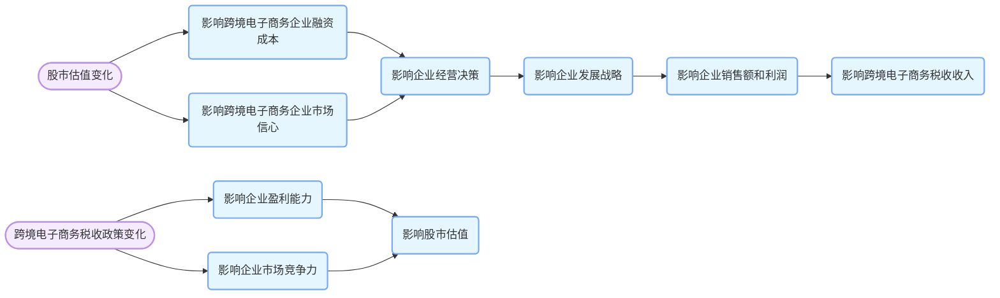

# 股市估值对跨境电子商务税收的影响

> 关键词：股市估值、跨境电子商务、税收、影响机制、经济效应

> 摘要：本文旨在深入探讨股市估值对跨境电子商务税收的影响。通过对股市估值和跨境电子商务税收相关概念的阐述，分析两者之间的内在联系和作用机制。从核心算法原理、数学模型等多个角度进行理论剖析，并结合项目实战案例进行详细解释。研究股市估值变化如何影响跨境电子商务企业的经营和税收情况，以及这种影响在实际应用场景中的表现。同时，为相关研究和实践提供工具、资源推荐，最后对未来发展趋势与挑战进行总结，以期为该领域的研究和决策提供参考。

## 1. 背景介绍 
### 1.1 目的和范围
本研究的目的在于全面、深入地探究股市估值对跨境电子商务税收的影响。范围涵盖了股市估值的基本概念、影响因素，跨境电子商务的发展现状、税收政策体系，以及两者之间相互作用的机制和经济效应。通过理论分析和实证研究，揭示这种影响的内在规律，为政府制定税收政策、企业进行战略决策提供理论支持和实践指导。

### 1.2 预期读者
本文预期读者包括从事跨境电子商务研究的学者、政府税收政策制定者、跨境电子商务企业管理人员、金融分析师以及对该领域感兴趣的投资者等。不同读者可以从本文中获取与自身需求相关的信息，如学者可以参考理论分析和研究方法，政策制定者可以借鉴政策建议，企业管理人员可以了解市场动态和应对策略，投资者可以评估投资风险和机会。

### 1.3 文档结构概述
本文首先介绍研究的背景和目的，明确预期读者和文档结构。接着阐述股市估值和跨境电子商务税收的核心概念及其联系，包括原理和架构的文本示意图与 Mermaid 流程图。然后详细讲解核心算法原理和具体操作步骤，并给出相应的 Python 源代码。之后介绍数学模型和公式，通过举例进行详细说明。再通过项目实战案例，包括开发环境搭建、源代码实现和代码解读，深入分析股市估值对跨境电子商务税收的影响。随后探讨实际应用场景，推荐相关的工具和资源。最后总结未来发展趋势与挑战，解答常见问题，并提供扩展阅读和参考资料。

### 1.4 术语表
#### 1.4.1 核心术语定义
- **股市估值**：是指对股票市场中上市公司的价值进行评估的过程和结果。通常通过各种估值方法，如市盈率法、市净率法、现金流折现法等，来确定股票的合理价格区间，反映市场对公司未来盈利能力和发展前景的预期。
- **跨境电子商务**：是指分属不同关境的交易主体，通过电子商务平台达成交易、进行电子支付结算，并通过跨境物流送达商品、完成交易的一种国际商业活动。它打破了传统贸易的地域限制，促进了全球商品和服务的流通。
- **跨境电子商务税收**：是指政府对跨境电子商务活动中涉及的商品交易、服务提供等行为征收的各种税费。包括进口关税、增值税、消费税等，旨在调节跨境电子商务市场，保障国家财政收入。

#### 1.4.2 相关概念解释
- **市盈率（P/E）**：是指股票价格除以每股收益（EPS）的比率。它反映了市场对公司盈利预期的高低，较高的市盈率通常意味着市场对公司未来盈利增长有较高的期望。
- **市净率（P/B）**：是指股票价格与每股净资产的比率。市净率可以反映股票的估值水平，较低的市净率可能表示股票被低估。
- **电子支付结算**：是指单位、个人直接或授权他人通过电子终端发出支付指令，实现货币支付与资金转移的行为。在跨境电子商务中，电子支付结算的便捷性和安全性对于交易的顺利进行至关重要。

#### 1.4.3 缩略词列表
- **P/E**：Price-to-Earnings Ratio，市盈率
- **P/B**：Price-to-Book Ratio，市净率
- **EPS**：Earnings Per Share，每股收益
- **VAT**：Value-Added Tax，增值税
- **GST**：Goods and Services Tax，商品及服务税

## 2. 核心概念与联系 

### 股市估值的原理和架构
股市估值是一个复杂的过程，其原理基于对公司基本面和市场预期的综合分析。公司的基本面包括财务状况、盈利能力、资产质量等，市场预期则受到宏观经济环境、行业发展趋势、政策变化等因素的影响。

股市估值的架构可以用以下文本示意图表示：

```plaintext
股市估值
|-- 基本面分析
|   |-- 财务报表分析
|   |   |-- 资产负债表
|   |   |-- 利润表
|   |   |-- 现金流量表
|   |-- 盈利能力分析
|   |   |-- 毛利率
|   |   |-- 净利率
|   |   |-- 净资产收益率
|   |-- 资产质量分析
|   |   |-- 资产负债率
|   |   |-- 流动比率
|   |   |-- 速动比率
|-- 市场预期分析
|   |-- 宏观经济环境
|   |   |-- GDP增长率
|   |   |-- 通货膨胀率
|   |   |-- 利率水平
|   |-- 行业发展趋势
|   |   |-- 市场规模增长
|   |   |-- 竞争格局变化
|   |   |-- 技术创新趋势
|   |-- 政策变化
|   |   |-- 税收政策
|   |   |-- 产业政策
|   |   |-- 监管政策
```

### 跨境电子商务税收的原理和架构
跨境电子商务税收的原理是基于国家的税收主权和税收政策目标，对跨境电子商务活动中的商品和服务交易进行征税。其目的是维护国家财政收入、调节市场竞争、保护国内产业等。

跨境电子商务税收的架构可以用以下文本示意图表示：

```plaintext
跨境电子商务税收
|-- 税收政策体系
|   |-- 进口关税
|   |   |-- 税则分类
|   |   |-- 税率设置
|   |-- 增值税
|   |   |-- 计税方法
|   |   |-- 税率调整
|   |-- 消费税
|   |   |-- 征收范围
|   |   |-- 税率标准
|-- 税收征管机制
|   |-- 海关监管
|   |   |-- 货物查验
|   |   |-- 通关流程
|   |-- 税务部门管理
|   |   |-- 纳税申报
|   |   |-- 税款征收
|   |-- 第三方支付机构协助
|   |   |-- 资金监管
|   |   |-- 数据共享
```

### 股市估值与跨境电子商务税收的联系
股市估值与跨境电子商务税收之间存在着密切的联系。一方面，股市估值的变化会影响跨境电子商务企业的融资成本和市场信心，进而影响企业的经营决策和发展战略。例如，当股市估值上升时，跨境电子商务企业的股价上涨，企业可以通过增发股票等方式获得更多的资金，用于扩大业务规模、进行技术创新等。这可能导致企业的销售额增加，从而影响税收收入。另一方面，跨境电子商务税收政策的变化也会影响企业的盈利能力和市场竞争力，进而影响股市估值。例如，税收政策的调整可能增加企业的成本，降低企业的利润，从而导致股市估值下降。

以下是用 Mermaid 绘制的股市估值与跨境电子商务税收联系的流程图：



## 3. 核心算法原理 & 具体操作步骤 

### 股市估值算法原理
股市估值的方法有很多种，这里以市盈率法为例进行讲解。市盈率法的基本原理是通过比较公司的市盈率与同行业平均市盈率或市场整体市盈率，来判断股票的估值水平。

市盈率的计算公式为：

$$P/E = \frac{股价}{每股收益}$$

其中，$P/E$ 表示市盈率，股价是指股票的市场价格，每股收益是指公司每股股票的盈利。

根据市盈率法，股票的合理价格可以通过以下公式计算：

$$合理股价 = 每股收益 \times 参考市盈率$$

参考市盈率可以是同行业平均市盈率、市场整体市盈率或公司历史平均市盈率等。

### Python 实现股市估值算法

```python
def stock_valuation(eps, reference_pe):
    """
    计算股票的合理价格
    :param eps: 每股收益
    :param reference_pe: 参考市盈率
    :return: 股票的合理价格
    """
    return eps * reference_pe

# 示例数据
eps = 2.0  # 每股收益为 2 元
reference_pe = 20  # 参考市盈率为 20

# 计算合理股价
fair_price = stock_valuation(eps, reference_pe)
print(f"股票的合理价格为: {fair_price} 元")
```

### 跨境电子商务税收计算算法原理
跨境电子商务税收的计算涉及到多个税种，这里以进口关税和增值税为例进行讲解。

进口关税的计算公式为：

$$进口关税 = 完税价格 \times 关税税率$$

其中，完税价格是指海关根据有关规定对进出口货物进行审定或估定后通过估价确定的价格，关税税率根据商品的税则分类确定。

增值税的计算公式为：

$$增值税 = (完税价格 + 进口关税) \times 增值税税率$$

### Python 实现跨境电子商务税收计算算法

```python
def calculate_import_tax(dutiable_value, tariff_rate):
    """
    计算进口关税
    :param dutiable_value: 完税价格
    :param tariff_rate: 关税税率
    :return: 进口关税
    """
    return dutiable_value * tariff_rate

def calculate_vat(dutiable_value, tariff_rate, vat_rate):
    """
    计算增值税
    :param dutiable_value: 完税价格
    :param tariff_rate: 关税税率
    :param vat_rate: 增值税税率
    :return: 增值税
    """
    import_tax = calculate_import_tax(dutiable_value, tariff_rate)
    return (dutiable_value + import_tax) * vat_rate

# 示例数据
dutiable_value = 1000  # 完税价格为 1000 元
tariff_rate = 0.1  # 关税税率为 10%
vat_rate = 0.13  # 增值税税率为 13%

# 计算进口关税和增值税
import_tax = calculate_import_tax(dutiable_value, tariff_rate)
vat = calculate_vat(dutiable_value, tariff_rate, vat_rate)

print(f"进口关税为: {import_tax} 元")
print(f"增值税为: {vat} 元")
```

## 4. 数学模型和公式 & 详细讲解 & 举例说明 

### 股市估值的数学模型和公式
除了市盈率法，现金流折现法也是一种常用的股市估值方法。现金流折现法的基本原理是将公司未来的现金流量折现到当前时点，以确定公司的内在价值。

现金流折现法的数学模型可以表示为：

$$V = \sum_{t=1}^{n} \frac{CF_t}{(1 + r)^t} + \frac{TV}{(1 + r)^n}$$

其中，$V$ 表示公司的内在价值，$CF_t$ 表示第 $t$ 期的现金流量，$r$ 表示折现率，$n$ 表示预测期数，$TV$ 表示终值。

终值的计算公式可以采用永续增长模型：

$$TV = \frac{CF_{n+1}}{r - g}$$

其中，$CF_{n+1}$ 表示预测期结束后下一期的现金流量，$g$ 表示永续增长率。

### 详细讲解
现金流折现法的核心思想是考虑了货币的时间价值和公司未来的盈利能力。通过预测公司未来的现金流量，并将其折现到当前时点，可以得到公司的内在价值。折现率反映了投资者对投资风险的要求，风险越高，折现率越高。预测期数和永续增长率的确定需要根据公司的实际情况和行业发展趋势进行合理估计。

### 举例说明
假设某跨境电子商务公司未来 5 年的现金流量分别为 100 万元、120 万元、150 万元、180 万元和 200 万元，预测期结束后下一期的现金流量为 220 万元，永续增长率为 3%，折现率为 10%。

首先，计算预测期内现金流量的现值：

$$PV_1 = \frac{100}{(1 + 0.1)^1} = 90.91 万元$$

$$PV_2 = \frac{120}{(1 + 0.1)^2} = 99.17 万元$$

$$PV_3 = \frac{150}{(1 + 0.1)^3} = 112.70 万元$$

$$PV_4 = \frac{180}{(1 + 0.1)^4} = 122.94 万元$$

$$PV_5 = \frac{200}{(1 + 0.1)^5} = 124.18 万元$$

然后，计算终值：

$$TV = \frac{220}{0.1 - 0.03} = 3142.86 万元$$

终值的现值为：

$$PV_{TV} = \frac{3142.86}{(1 + 0.1)^5} = 1958.41 万元$$

最后，计算公司的内在价值：

$$V = 90.91 + 99.17 + 112.70 + 122.94 + 124.18 + 1958.41 = 2408.31 万元$$

### 跨境电子商务税收的数学模型和公式
跨境电子商务税收的数学模型可以表示为：

$$T = T_{tariff} + T_{vat} + T_{consumption}$$

其中，$T$ 表示总税收，$T_{tariff}$ 表示进口关税，$T_{vat}$ 表示增值税，$T_{consumption}$ 表示消费税。

进口关税、增值税和消费税的计算公式前面已经介绍过，这里不再赘述。

### 详细讲解
跨境电子商务税收的数学模型综合考虑了不同税种的影响。在实际计算中，需要根据商品的具体情况和税收政策确定各个税种的税率和计税依据。

### 举例说明
假设某跨境电子商务企业进口一批商品，完税价格为 5000 元，关税税率为 15%，增值税税率为 13%，消费税税率为 10%。

首先，计算进口关税：

$$T_{tariff} = 5000 \times 0.15 = 750 元$$

然后，计算增值税：

$$T_{vat} = (5000 + 750) \times 0.13 = 747.5 元$$

最后，计算消费税：

$$T_{consumption} = \frac{5000 + 750}{1 - 0.1} \times 0.1 = 638.89 元$$

总税收为：

$$T = 750 + 747.5 + 638.89 = 2136.39 元$$

## 5. 项目实战：代码实际案例和详细解释说明 

### 5.1  开发环境搭建
本项目使用 Python 语言进行开发，开发环境搭建步骤如下：

1. **安装 Python**：从 Python 官方网站（https://www.python.org/downloads/）下载并安装 Python 3.x 版本。
2. **安装开发工具**：推荐使用 PyCharm 作为开发工具，从 JetBrains 官方网站（https://www.jetbrains.com/pycharm/download/）下载并安装 PyCharm 社区版或专业版。
3. **创建虚拟环境**：打开命令行工具，进入项目目录，使用以下命令创建虚拟环境：

```bash
python -m venv venv
```

4. **激活虚拟环境**：在 Windows 系统中，使用以下命令激活虚拟环境：

```bash
venv\Scripts\activate
```

在 Linux 或 macOS 系统中，使用以下命令激活虚拟环境：

```bash
source venv/bin/activate
```

5. **安装依赖库**：在虚拟环境中，使用以下命令安装所需的依赖库：

```bash
pip install pandas numpy matplotlib
```

### 5.2  源代码详细实现和代码解读

#### 数据获取与处理
首先，我们需要获取跨境电子商务企业的财务数据和股市数据。这里我们使用模拟数据进行演示。

```python
import pandas as pd
import numpy as np

# 模拟跨境电子商务