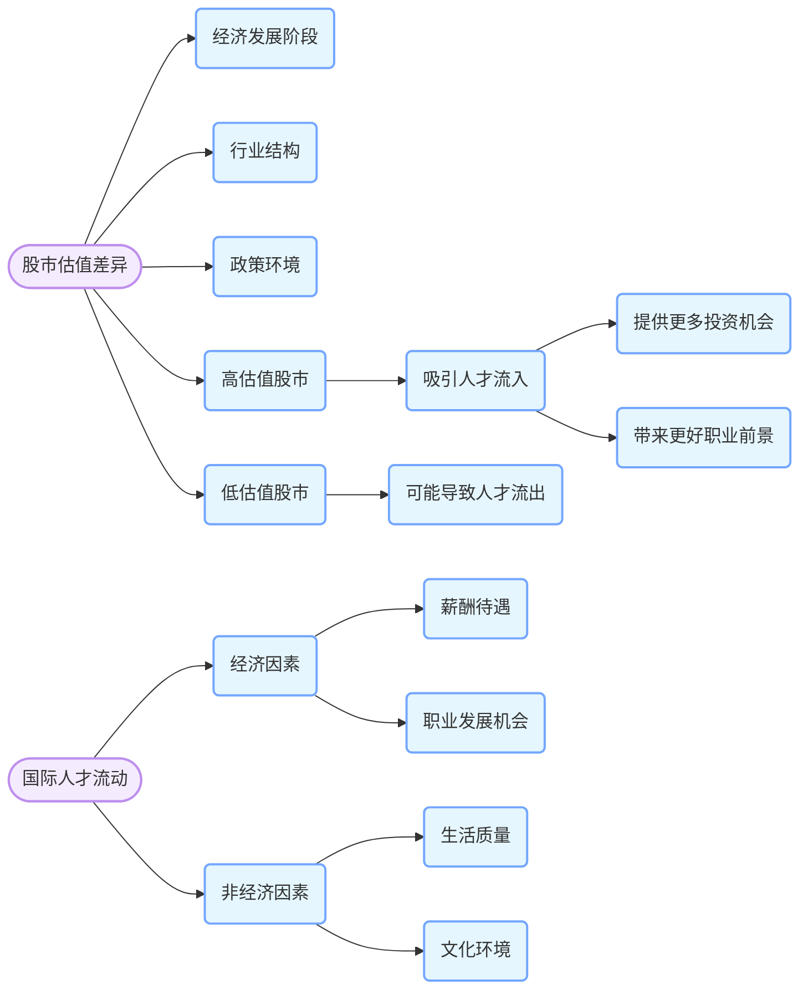

# 股市估值差异对国际人才流动的影响

> 关键词：股市估值差异、国际人才流动、经济因素、职业发展、金融市场

> 摘要：本文旨在深入探讨股市估值差异对国际人才流动的影响。通过分析股市估值差异背后的经济原理、与人才流动的内在联系，结合数学模型和实际案例，揭示这种差异如何影响人才在国际间的流动方向和规模。同时，探讨了在不同应用场景下这种影响的表现，推荐了相关的学习资源、开发工具和研究论文，最后对未来发展趋势与挑战进行总结，并解答常见问题。

## 1. 背景介绍 
### 1.1 目的和范围
随着经济全球化的加速，国际人才流动日益频繁。股市作为经济的重要组成部分，其估值差异在一定程度上反映了不同国家或地区的经济发展状况、市场活力和投资机会。本研究的目的是全面分析股市估值差异与国际人才流动之间的关系，明确这种差异如何影响人才的跨国流动决策。研究范围涵盖全球主要金融市场和人才流动活跃的国家和地区，通过对相关数据的分析和案例研究，深入剖析这种影响的机制和特点。

### 1.2 预期读者
本文预期读者包括金融领域的专业人士，如股票分析师、投资经理等，他们可以从股市估值的角度深入理解国际人才流动对金融市场的潜在影响；人力资源专家，有助于他们在制定国际人才战略时考虑股市估值等经济因素；科研人员，为相关领域的学术研究提供新的视角和思路；以及对国际经济和人才流动感兴趣的普通读者。

### 1.3 文档结构概述
本文首先介绍了股市估值差异和国际人才流动的相关背景知识，包括核心概念的定义和解释。接着分析了两者之间的内在联系，并通过流程图进行直观展示。然后详细阐述了核心算法原理和具体操作步骤，使用 Python 代码进行说明。随后引入数学模型和公式，通过举例进一步解释。在项目实战部分，给出了代码实际案例并进行详细解读。之后探讨了股市估值差异对国际人才流动的实际应用场景。推荐了相关的学习资源、开发工具和研究论文。最后对未来发展趋势与挑战进行总结，解答常见问题，并提供扩展阅读和参考资料。

### 1.4 术语表
#### 1.4.1 核心术语定义
- **股市估值**：是指对股票市场中上市公司的价值进行评估，常用的指标有市盈率（P/E）、市净率（P/B）等，反映了市场对公司未来盈利能力和资产价值的预期。
- **股市估值差异**：不同国家或地区股票市场在同一时期内，由于经济发展水平、行业结构、政策环境等因素的影响，导致股市整体或部分行业的估值水平存在差异。
- **国际人才流动**：指人才跨越国界，从一个国家或地区向另一个国家或地区迁移，以寻求更好的职业发展机会、生活环境或经济回报。

#### 1.4.2 相关概念解释
- **市盈率（P/E）**：是股票价格与每股收益的比率，反映了投资者为获取公司每一元盈利所愿意支付的价格。较高的市盈率通常意味着市场对公司未来盈利增长有较高的预期。
- **市净率（P/B）**：是股票价格与每股净资产的比率，体现了市场对公司资产价值的评估。市净率大于 1 表示市场对公司资产的估值高于其账面价值。
- **人才吸引力**：一个国家或地区吸引国际人才的综合能力，包括经济发展水平、就业机会、薪酬待遇、生活质量、文化环境等多个方面。

#### 1.4.3 缩略词列表
- **P/E**：Price-to-Earnings Ratio，市盈率
- **P/B**：Price-to-Book Ratio，市净率

## 2. 核心概念与联系 

### 核心概念原理
股市估值是基于市场对上市公司未来盈利和资产价值的预期，通过各种估值方法计算得出。不同国家或地区的股市估值差异主要源于以下几个方面：
- **经济发展阶段**：处于不同经济发展阶段的国家，其企业的盈利能力和增长潜力不同。发达国家的成熟企业可能具有稳定的盈利，但增长速度相对较慢；而新兴经济体的企业可能具有较高的增长潜力，但风险也相对较大，这会导致股市估值的差异。
- **行业结构**：不同国家的产业结构存在差异，某些国家可能在特定行业具有优势。例如，美国在科技行业领先，其科技股的估值往往较高；而一些资源型国家的股市估值可能更多地受到资源行业的影响。
- **政策环境**：各国的宏观经济政策、税收政策、金融监管政策等会影响企业的经营环境和市场预期，进而影响股市估值。

国际人才流动则受到多种因素的驱动，包括经济因素、职业发展机会、生活质量、文化环境等。经济因素是其中的重要因素之一，而股市估值差异与经济因素密切相关。高估值的股市往往意味着该地区的经济活力较强、投资机会较多，可能提供更高的薪酬待遇和更好的职业发展前景，从而吸引国际人才流入。

### 架构的文本示意图
```plaintext
股市估值差异
|-- 经济发展阶段
|-- 行业结构
|-- 政策环境

国际人才流动
|-- 经济因素
|   |-- 薪酬待遇
|   |-- 职业发展机会
|-- 非经济因素
|   |-- 生活质量
|   |-- 文化环境

股市估值差异与国际人才流动的联系
|-- 高估值股市吸引人才流入
|   |-- 提供更多投资机会
|   |-- 带来更好职业前景
|-- 低估值股市可能导致人才流出
```

### Mermaid 流程图


## 3. 核心算法原理 & 具体操作步骤 

### 核心算法原理
为了分析股市估值差异对国际人才流动的影响，我们可以构建一个基于多因素的回归模型。假设国际人才流动的规模（用 $Y$ 表示）受到股市估值差异（用 $X_1$ 表示）以及其他控制变量（如经济增长率 $X_2$、失业率 $X_3$、生活质量指数 $X_4$ 等）的影响。回归模型的一般形式如下：

$$Y = \beta_0 + \beta_1X_1 + \beta_2X_2 + \beta_3X_3 + \beta_4X_4 + \epsilon$$

其中，$\beta_0$ 是截距项，$\beta_1, \beta_2, \beta_3, \beta_4$ 是回归系数，$\epsilon$ 是误差项。

### 具体操作步骤
以下是使用 Python 实现上述回归模型的具体步骤：

```python
import pandas as pd
import numpy as np
import statsmodels.api as sm

# 步骤 1: 数据准备
# 假设我们有一个包含国际人才流动规模、股市估值差异、经济增长率、失业率和生活质量指数的数据集
data = {
    '人才流动规模': [100, 120, 130, 150, 160],
    '股市估值差异': [0.1, 0.2, 0.3, 0.4, 0.5],
    '经济增长率': [0.02, 0.03, 0.04, 0.05, 0.06],
    '失业率': [0.05, 0.04, 0.03, 0.02, 0.01],
    '生活质量指数': [70, 75, 80, 85, 90]
}
df = pd.DataFrame(data)

# 步骤 2: 定义自变量和因变量
X = df[['股市估值差异', '经济增长率', '失业率', '生活质量指数']]
y = df['人才流动规模']

# 步骤 3: 添加常数项
X = sm.add_constant(X)

# 步骤 4: 拟合回归模型
model = sm.OLS(y, X).fit()

# 步骤 5: 查看回归结果
print(model.summary())
```

### 代码解释
1. **数据准备**：创建一个包含相关变量的 DataFrame，模拟实际的数据集。
2. **定义自变量和因变量**：从 DataFrame 中提取自变量（$X$）和因变量（$Y$）。
3. **添加常数项**：在自变量矩阵中添加常数项，以便估计截距项 $\beta_0$。
4. **拟合回归模型**：使用 `statsmodels` 库中的 `OLS` 类进行普通最小二乘回归拟合。
5. **查看回归结果**：打印回归模型的摘要信息，包括回归系数、$R^2$ 值、$p$ 值等。

## 4. 数学模型和公式 & 详细讲解 & 举例说明 

### 数学模型
我们使用的线性回归模型为：

$$Y = \beta_0 + \beta_1X_1 + \beta_2X_2 + \beta_3X_3 + \beta_4X_4 + \epsilon$$

其中：
- $Y$ 是国际人才流动的规模，是我们要预测的因变量。
- $\beta_0$ 是截距项，表示当所有自变量都为 0 时，人才流动规模的预期值。
- $\beta_1, \beta_2, \beta_3, \beta_4$ 分别是股市估值差异、经济增长率、失业率和生活质量指数的回归系数，反映了每个自变量对人才流动规模的影响程度。
- $X_1, X_2, X_3, X_4$ 分别是股市估值差异、经济增长率、失业率和生活质量指数，是自变量。
- $\epsilon$ 是误差项，代表模型无法解释的随机因素。

### 详细讲解
- **回归系数的含义**：$\beta_1$ 表示在其他自变量保持不变的情况下，股市估值差异每增加一个单位，国际人才流动规模的平均变化量。如果 $\beta_1$ 为正，说明股市估值差异越大，人才流动规模越大，即高估值股市吸引更多人才流入；如果 $\beta_1$ 为负，则相反。
- **$R^2$ 值**：表示回归模型对数据的拟合优度，取值范围在 0 到 1 之间。$R^2$ 值越接近 1，说明模型对数据的拟合效果越好，即自变量能够解释因变量的大部分变化。
- **$p$ 值**：用于检验回归系数的显著性。通常，如果 $p$ 值小于 0.05，则认为该回归系数在统计上是显著的，即该自变量对因变量有显著影响。

### 举例说明
假设回归结果如下：

| 变量 | 系数 | $p$ 值 |
| ---- | ---- | ---- |
| 常数项 | 50 | 0.01 |
| 股市估值差异 | 200 | 0.02 |
| 经济增长率 | 1000 | 0.03 |
| 失业率 | -500 | 0.04 |
| 生活质量指数 | 1 | 0.05 |

这意味着：
- 当所有自变量都为 0 时，国际人才流动规模的预期值为 50。
- 在其他因素不变的情况下，股市估值差异每增加 1 个单位，国际人才流动规模平均增加 200 人。
- 经济增长率每增加 1 个百分点，国际人才流动规模平均增加 1000 人。
- 失业率每增加 1 个百分点，国际人才流动规模平均减少 500 人。
- 生活质量指数每增加 1 分，国际人才流动规模平均增加 1 人。

由于所有回归系数的 $p$ 值都小于 0.05，说明这些自变量对国际人才流动规模都有显著影响。

## 5. 项目实战：代码实际案例和详细解释说明 

### 5.1  开发环境搭建
为了运行上述代码，我们需要搭建以下开发环境：
1. **Python 安装**：建议安装 Python 3.7 及以上版本。可以从 Python 官方网站（https://www.python.org/downloads/）下载并安装。
2. **依赖库安装**：使用 `pip` 命令安装所需的依赖库，包括 `pandas`、`numpy` 和 `statsmodels`。

```bash
pip install pandas numpy statsmodels
```

### 5.2  源代码详细实现和代码解读
以下是完整的源代码及详细解读：

```python
import pandas as pd
import numpy as np
import statsmodels.api as sm

# 步骤 1: 数据准备
# 假设我们有一个包含国际人才流动规模、股市估值差异、经济增长率、失业率和生活质量指数的数据集
data = {
    '人才流动规模': [100, 120, 130, 150, 160],
    '股市估值差异': [0.1, 0.2, 0.3, 0.4, 0.5],
    '经济增长率': [0.02, 0.03, 0.04, 0.05, 0.06],
    '失业率': [0.05, 0.04, 0.03, 0.02, 0.01],
    '生活质量指数': [70, 75, 80, 85, 90]
}
df = pd.DataFrame(data)

# 代码解读：使用字典创建一个 DataFrame 对象，方便后续的数据处理和分析。

# 步骤 2: 定义自变量和因变量
X = df[['股市估值差异', '经济增长率', '失业率', '生活质量指数']]
y = df['人才流动规模']

# 代码解读：从 DataFrame 中提取自变量和因变量，分别存储在 X 和 y 中。

# 步骤 3: 添加常数项
X = sm.add_constant(X)

# 代码解读：在自变量矩阵 X 中添加常数项，以便在回归模型中估计截距项。

# 步骤 4: 拟合回归模型
model = sm.OLS(y, X).fit()

# 代码解读：使用 statsmodels 库中的 OLS 类进行普通最小二乘回归拟合，并调用 fit() 方法进行模型训练。

# 步骤 5: 查看回归结果
print(model.summary())

# 代码解读：打印回归模型的摘要信息，包括回归系数、R^2 值、p 值等，帮助我们分析模型的效果和自变量的显著性。
```

### 5.3  代码解读与分析
通过上述代码，我们实现了一个简单的线性回归模型，用于分析股市估值差异等因素对国际人才流动规模的影响。从代码中可以看出，使用 Python 进行数据分析和建模非常方便，借助 `pandas`、`numpy` 和 `statsmodels` 等库，我们可以快速完成数据处理、模型拟合和结果分析等任务。

在实际应用中，我们可以根据需要调整数据集，添加更多的自变量或使用更复杂的模型，以提高模型的准确性和解释力。同时，还可以对回归结果进行进一步的可视化分析，帮助我们更直观地理解各个因素之间的关系。

## 6. 实际应用场景 
### 企业人力资源战略制定
企业在制定国际人才战略时，可以考虑股市估值差异这一因素。如果某个国家或地区的股市估值较高，说明该地区的经济活力较强、投资机会较多，企业可以加大在该地区的人才招聘力度，吸引更多的国际人才加入。例如，科技企业可能会更倾向于在股市估值较高的美国硅谷地区设立研发中心，以获取当地丰富的科技人才资源。

### 政府人才引进政策调整
政府可以根据股市估值差异调整人才引进政策。对于股市估值较低的地区，政府可以出台更多的优惠政策，如税收减免、住房补贴等，以吸引国际人才流入，促进当地经济的发展。而对于股市估值较高的地区，政府可以加强对人才的培养和留用，提高当地的人才竞争力。

### 投资者决策参考
投资者在进行跨国投资时，可以将股市估值差异和国际人才流动情况作为参考因素。如果某个国家或地区的股市估值较高且人才流入趋势明显，说明该地区具有较好的发展前景，投资者可以考虑增加在该地区的投资。相反，如果股市估值较低且人才大量流出，投资者则需要谨慎考虑投资风险。

### 学术研究和政策评估
学术界可以通过研究股市估值差异对国际人才流动的影响，深入了解经济因素与人才流动之间的关系，为相关政策的制定提供理论支持。政府也可以通过评估股市估值差异和人才流动情况，调整宏观经济政策和人才政策，促进经济的可持续发展。

## 7. 工具和资源推荐
### 7.1 学习资源推荐
#### 7.1.1 书籍推荐
- 《金融学》（兹维·博迪等著）：全面介绍了金融学的基本概念、理论和方法，对于理解股市估值和金融市场有很大帮助。
- 《人力资源管理》（加里·德斯勒著）：系统阐述了人力资源管理的各个方面，包括人才招聘、培训、绩效管理等，有助于了解国际人才流动在企业中的应用。
- 《计量经济学基础》（达摩达尔·N·古扎拉蒂著）：详细讲解了计量经济学的基本原理和方法，对于构建和分析回归模型非常有用。

#### 7.1.2 在线课程
- Coursera 上的“Financial Markets”：由耶鲁大学教授罗伯特·席勒授课，深入探讨了金融市场的运行机制和投资策略。
- edX 上的“Human Resource Management”：提供了全面的人力资源管理知识和实践案例，帮助学习者了解国际人才流动的管理方法。
- 中国大学 MOOC 上的“计量经济学”：国内高校教授讲解计量经济学的基本理论和应用，适合初学者学习。

#### 7.1.3 技术博客和网站
- 雪球网：提供了丰富的股市资讯和分析文章，有助于了解股市估值的动态变化。
- 领英（LinkedIn）：是一个专业的社交网络平台，用户可以在上面了解国际人才流动的趋势和动态，还可以与行业专家进行交流。
- 国家统计局网站：提供了各国的经济数据和统计信息，为研究股市估值差异和国际人才流动提供了数据支持。

### 7.2 开发工具框架推荐
#### 7.2.1 IDE和编辑器
- PyCharm：是一款专业的 Python 集成开发环境，具有代码自动补全、调试、版本控制等功能，适合 Python 数据分析和建模。
- Jupyter Notebook：是一个交互式的编程环境，支持多种编程语言，方便进行数据探索、模型构建和结果展示。

#### 7.2.2 调试和性能分析工具
- `pdb`：是 Python 内置的调试工具，可以帮助开发者定位代码中的错误和问题。
- `cProfile`：用于分析 Python 代码的性能，找出代码中的瓶颈和耗时操作。

#### 7.2.3 相关框架和库
- `pandas`：是一个强大的数据处理和分析库，提供了高效的数据结构和数据操作方法。
- `numpy`：是 Python 的数值计算库，支持多维数组和矩阵运算，为数据分析和建模提供了基础。
- `statsmodels`：用于统计建模和计量分析，提供了多种回归模型和统计检验方法。

### 7.3 相关论文著作推荐
#### 7.3.1 经典论文
- “The Impact of Stock Market Valuation on Economic Growth”：研究了股市估值与经济增长之间的关系，为理解股市估值差异的经济影响提供了理论基础。
- “International Migration and Economic Development”：探讨了国际人才流动对经济发展的影响，分析了人才流动的原因和机制。

#### 7.3.2 最新研究成果
- 近年来，一些学者开始关注股市估值差异对特定行业人才流动的影响，如科技行业、金融行业等。相关研究成果可以在学术数据库如知网、万方、Web of Science 等上查找。

#### 7.3.3 应用案例分析
- 一些国际咨询公司如麦肯锡、波士顿咨询等会发布关于国际人才流动和金融市场的研究报告，其中包含了大量的应用案例分析，可以为实际应用提供参考。

## 8. 总结：未来发展趋势与挑战
### 未来发展趋势
- **数字化和科技化的影响**：随着数字化和科技化的快速发展，股市估值和国际人才流动都将受到深刻影响。科技行业的发展可能会导致股市估值差异进一步扩大，同时也会吸引更多的科技人才在国际间流动。例如，人工智能、大数据、区块链等新兴技术领域的发展，使得相关企业的股市估值大幅提升，也吸引了大量的专业人才从传统行业向这些领域转移。
- **区域经济一体化的推动**：区域经济一体化的趋势将促进人才在区域内的自由流动。例如，欧盟、东盟等区域经济合作组织的发展，为人才在区域内的流动提供了便利条件。同时，区域内的股市估值差异也可能会随着经济一体化的推进而逐渐缩小。
- **政策的引导和调控**：各国政府将更加重视国际人才流动对经济发展的作用，通过出台相关政策来引导和调控人才流动。例如，一些国家可能会放宽移民政策，吸引高端人才流入；而另一些国家则可能会加强对本国人才的保护和培养，提高人才的竞争力。

### 挑战
- **数据的准确性和完整性**：准确分析股市估值差异对国际人才流动的影响需要大量的、准确的数据支持。然而，目前相关数据的收集和整理存在一定的困难，数据的准确性和完整性也有待提高。例如，不同国家对人才的定义和统计标准可能存在差异，导致国际人才流动数据的可比性较差。
- **复杂的影响因素**：股市估值差异对国际人才流动的影响受到多种因素的综合作用，除了经济因素外，还包括政治、文化、社会等因素。这些因素之间相互交织、相互影响，使得准确评估股市估值差异的影响变得更加困难。例如，政治不稳定可能会导致人才外流，即使当地的股市估值较高；而文化差异可能会影响人才对不同国家或地区的选择。
- **人才竞争的加剧**：随着全球经济的发展和科技的进步，国际人才竞争将日益激烈。各国都在争夺高端人才，这可能会导致人才流动的不平衡加剧。一些发达国家和地区可能会吸引更多的优秀人才，而发展中国家和地区则可能面临人才流失的问题。

## 9. 附录：常见问题与解答
### 问题 1：股市估值差异是如何衡量的？
答：股市估值差异可以通过多种指标来衡量，常见的有市盈率（P/E）、市净率（P/B）等。不同国家或地区的股市在同一时期内的这些指标的差异，就反映了股市估值差异。例如，可以计算两个国家股市的平均市盈率，然后比较它们的差值。

### 问题 2：除了股市估值差异，还有哪些因素会影响国际人才流动？
答：除了股市估值差异外，影响国际人才流动的因素还包括经济增长率、失业率、薪酬待遇、职业发展机会、生活质量、文化环境、政治稳定性等。这些因素相互作用，共同影响人才的跨国流动决策。

### 问题 3：如何利用回归模型的结果来指导实际决策？
答：回归模型的结果可以为企业和政府的决策提供参考。如果回归结果显示股市估值差异对国际人才流动有显著影响，企业可以根据不同地区的股市估值情况调整人才招聘策略；政府可以根据股市估值差异调整人才引进政策，以吸引更多的国际人才。同时，还可以结合其他自变量的回归系数，综合考虑各种因素的影响。

### 问题 4：如何提高回归模型的准确性？
答：可以从以下几个方面提高回归模型的准确性：
- **增加样本量**：收集更多的数据，以提高模型的稳定性和可靠性。
- **选择合适的自变量**：根据研究目的和实际情况，选择与因变量相关性较强的自变量，避免引入无关或冗余的变量。
- **处理异常值**：对数据中的异常值进行处理，如删除、替换或进行数据转换，以减少异常值对模型的影响。
- **使用更复杂的模型**：如果线性回归模型不能很好地拟合数据，可以考虑使用非线性回归模型或其他更复杂的模型。

## 10. 扩展阅读 & 参考资料
### 扩展阅读
- 《全球金融市场的未来趋势》：深入探讨了全球金融市场的发展趋势和变化，有助于进一步理解股市估值差异的背景和影响。
- 《国际人才竞争与合作》：分析了国际人才竞争的现状和趋势，以及各国在人才合作方面的经验和做法。
- 《科技创新与人才流动》：研究了科技创新与人才流动之间的关系，为理解科技行业的人才流动提供了新的视角。

### 参考资料
- 各国证券交易所的官方网站，获取股市估值数据。
- 世界银行、国际货币基金组织等国际组织的统计数据库，获取经济数据和人才流动数据。
- 相关学术期刊，如《金融研究》、《人力资源管理学报》等，获取最新的研究成果和学术论文。

作者：AI天才研究院/AI Genius Institute & 禅与计算机程序设计艺术 /Zen And The Art of Computer Programming