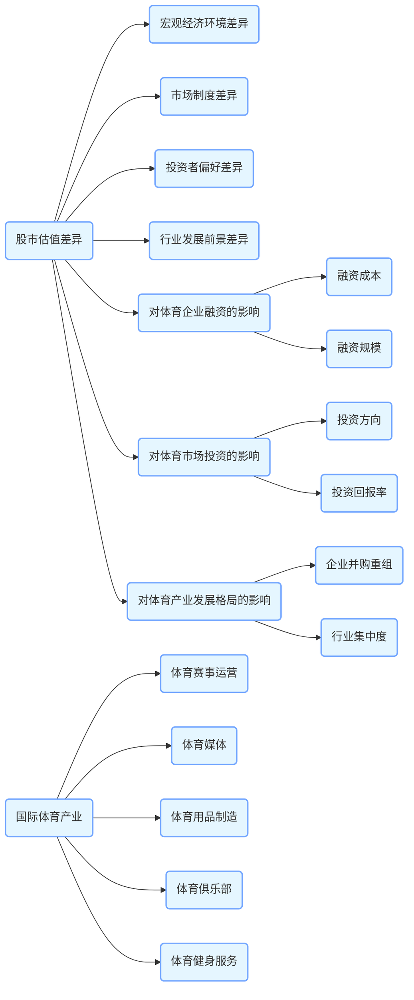

# 股市估值差异对国际体育产业的影响

> 关键词：股市估值差异、国际体育产业、体育企业融资、体育市场投资、产业发展格局

> 摘要：本文深入探讨了股市估值差异对国际体育产业的多方面影响。首先阐述了研究的背景、目的、预期读者和文档结构，对相关术语进行了清晰定义。接着剖析了股市估值差异和国际体育产业的核心概念及联系，介绍了核心算法原理和数学模型。通过项目实战案例展示了股市估值差异在体育产业中的实际体现和影响机制。分析了其在不同场景下的实际应用，推荐了学习、开发和研究所需的工具和资源。最后总结了未来发展趋势与挑战，并对常见问题进行了解答，为全面理解和应对股市估值差异对国际体育产业的影响提供了系统的参考。

## 1. 背景介绍 
### 1.1 目的和范围
本研究旨在全面分析股市估值差异对国际体育产业的影响，涵盖体育赛事运营、体育媒体、体育用品制造、体育俱乐部等多个体育产业细分领域。通过对不同国家和地区股市估值情况的研究，探讨其如何影响体育企业的融资、投资决策、市场竞争格局以及产业的整体发展态势，为体育产业从业者、投资者和政策制定者提供有价值的参考。

### 1.2 预期读者
本文预期读者包括体育产业的企业家、投资者、金融分析师、政策制定者、体育研究学者以及对体育产业和金融市场感兴趣的人士。他们可以从本文中获取关于股市估值差异与体育产业相互关系的深入知识，为自身的决策和研究提供依据。

### 1.3 文档结构概述
本文将首先介绍相关背景知识，包括研究目的、预期读者和文档结构。接着阐述股市估值差异和国际体育产业的核心概念及它们之间的联系，通过示意图和流程图进行直观展示。然后详细讲解核心算法原理和具体操作步骤，并给出数学模型和公式进行深入分析。通过项目实战案例展示股市估值差异在体育产业中的实际应用和影响。分析其在不同场景下的实际应用，为读者提供实际参考。推荐学习、开发和研究所需的工具和资源。最后总结未来发展趋势与挑战，解答常见问题，并提供扩展阅读和参考资料。

### 1.4 术语表
#### 1.4.1 核心术语定义
- **股市估值差异**：指不同国家或地区、不同行业板块之间，股票市场对企业价值评估的差异。这种差异可以体现在市盈率、市净率、市销率等估值指标上。
- **国际体育产业**：是指在全球范围内，围绕体育活动所形成的一系列经济活动的总和，包括体育赛事运营、体育媒体、体育用品制造、体育俱乐部、体育健身服务等多个领域。
- **体育企业融资**：体育企业通过发行股票、债券、银行贷款等方式筹集资金的行为，以满足企业的发展需求，如赛事举办、球队建设、设施升级等。
- **体育市场投资**：投资者将资金投入到体育产业的各个领域，包括购买体育企业股票、投资体育赛事、参与体育场馆建设等，以获取经济回报。

#### 1.4.2 相关概念解释
- **市盈率（P/E）**：是指股票价格除以每股收益的比率，反映了市场对企业盈利能力的预期。较高的市盈率通常意味着市场对企业未来的盈利增长有较高的期望。
- **市净率（P/B）**：是指股票价格除以每股净资产的比率，反映了市场对企业净资产价值的评估。市净率大于 1 表示市场对企业的估值高于其净资产价值。
- **市销率（P/S）**：是指股票价格除以每股销售收入的比率，用于评估企业销售收入的市场价值。

#### 1.4.3 缩略词列表
- **P/E**：Price-to-Earnings Ratio，市盈率
- **P/B**：Price-to-Book Ratio，市净率
- **P/S**：Price-to-Sales Ratio，市销率

## 2. 核心概念与联系 

### 核心概念原理
股市估值差异主要源于不同国家和地区的宏观经济环境、市场制度、投资者偏好、行业发展前景等因素。在国际体育产业中，不同细分领域的企业也会因为自身的商业模式、竞争优势、品牌影响力等因素而在股市上获得不同的估值。

例如，一些具有全球影响力的体育赛事运营企业，由于其拥有独家赛事资源、稳定的转播收入和赞助商支持，往往在股市上会获得较高的估值。而一些小型的体育用品制造企业，可能由于市场竞争激烈、品牌知名度较低，其股市估值相对较低。

### 架构的文本示意图
```plaintext
股市估值差异
|--宏观经济环境差异
|   |--经济增长率
|   |--利率水平
|   |--通货膨胀率
|--市场制度差异
|   |--上市规则
|   |--信息披露要求
|   |--交易机制
|--投资者偏好差异
|   |--风险偏好
|   |--投资期限
|   |--行业偏好
|--行业发展前景差异
|   |--市场规模增长潜力
|   |--技术创新能力
|   |--政策支持力度

国际体育产业
|--体育赛事运营
|   |--大型国际赛事
|   |--国内联赛赛事
|--体育媒体
|   |--电视转播
|   |--新媒体平台
|--体育用品制造
|   |--运动服装
|   |--体育器材
|--体育俱乐部
|   |--足球俱乐部
|   |--篮球俱乐部
|--体育健身服务
|   |--健身房
|   |--健身培训

股市估值差异对国际体育产业的影响
|--对体育企业融资的影响
|   |--融资成本
|   |--融资规模
|--对体育市场投资的影响
|   |--投资方向
|   |--投资回报率
|--对体育产业发展格局的影响
|   |--企业并购重组
|   |--行业集中度
```

### Mermaid 流程图


从流程图可以看出，股市估值差异由多个因素决定，而国际体育产业包含多个细分领域。股市估值差异会对体育企业融资、体育市场投资和体育产业发展格局产生影响，进而影响到体育产业各个细分领域的发展。

## 3. 核心算法原理 & 具体操作步骤 

### 核心算法原理
在分析股市估值差异对国际体育产业的影响时，我们可以使用一些基本的金融分析算法。以下以市盈率法为例，介绍如何评估体育企业的价值以及股市估值差异对其的影响。

市盈率法的基本原理是通过比较目标企业与同行业可比企业的市盈率，来评估目标企业的价值。公式如下：

$V = EPS \times P/E$

其中，$V$ 表示企业的价值，$EPS$ 表示每股收益，$P/E$ 表示市盈率。

### 具体操作步骤
#### 步骤 1：收集数据
收集目标体育企业和同行业可比企业的财务数据，包括每股收益和市盈率。这些数据可以从证券交易所、金融数据提供商等渠道获取。

#### 步骤 2：计算目标企业的理论价值
根据同行业可比企业的平均市盈率，结合目标企业的每股收益，计算目标企业的理论价值。

#### 步骤 3：分析股市估值差异
比较目标企业的实际市场价值与理论价值，分析两者之间的差异。如果实际市场价值高于理论价值，说明市场对该企业的估值较高；反之，则说明市场对该企业的估值较低。

#### 步骤 4：评估影响
分析股市估值差异对目标企业的融资、投资和发展的影响。例如，如果市场对某体育企业的估值较高，该企业可能更容易获得融资，吸引更多的投资者；反之，如果估值较低，企业的融资难度可能会增加。

### Python 源代码实现
```python
# 示例数据
# 目标企业每股收益
target_eps = 2.0
# 同行业可比企业平均市盈率
comparable_pe = 25

# 计算目标企业的理论价值
target_value = target_eps * comparable_pe

print(f"目标企业的理论价值为: {target_value}")

# 假设目标企业的实际市场价值
actual_value = 60

# 分析估值差异
if actual_value > target_value:
    print("市场对该企业的估值较高")
elif actual_value < target_value:
    print("市场对该企业的估值较低")
else:
    print("市场对该企业的估值合理")
```

在上述代码中，我们首先定义了目标企业的每股收益和同行业可比企业的平均市盈率，然后计算了目标企业的理论价值。接着，我们假设了目标企业的实际市场价值，并通过比较实际市场价值和理论价值，分析了市场对该企业的估值情况。

## 4. 数学模型和公式 & 详细讲解 & 举例说明 

### 数学模型和公式
#### 市盈率法
如前文所述，市盈率法的公式为：

$$V = EPS \times P/E$$

其中，$V$ 表示企业的价值，$EPS$ 表示每股收益，$P/E$ 表示市盈率。

#### 市净率法
市净率法的公式为：

$$V = BV \times P/B$$

其中，$V$ 表示企业的价值，$BV$ 表示每股净资产，$P/B$ 表示市净率。

#### 市销率法
市销率法的公式为：

$$V = Sales \times P/S$$

其中，$V$ 表示企业的价值，$Sales$ 表示每股销售收入，$P/S$ 表示市销率。

### 详细讲解
- **市盈率法**：市盈率反映了市场对企业盈利能力的预期。较高的市盈率意味着市场对企业未来的盈利增长有较高的期望。通过市盈率法，我们可以根据企业的每股收益和同行业的市盈率水平，估算企业的价值。
- **市净率法**：市净率反映了市场对企业净资产价值的评估。市净率大于 1 表示市场对企业的估值高于其净资产价值。市净率法适用于那些资产价值对企业价值影响较大的企业，如体育用品制造企业。
- **市销率法**：市销率用于评估企业销售收入的市场价值。市销率法适用于那些暂时没有盈利，但销售收入增长较快的企业，如一些新兴的体育媒体平台。

### 举例说明
假设一家体育俱乐部的每股收益为 1.5 元，同行业可比企业的平均市盈率为 20 倍。根据市盈率法，该体育俱乐部的理论价值为：

$$V = EPS \times P/E = 1.5 \times 20 = 30$$（元）

如果该体育俱乐部的实际市场价格为 35 元，说明市场对该俱乐部的估值较高，可能是因为市场对其未来的发展前景较为乐观，如预计该俱乐部将获得更多的赛事奖金、赞助商收入等。

再假设一家体育用品制造企业的每股净资产为 10 元，同行业可比企业的平均市净率为 1.5 倍。根据市净率法，该企业的理论价值为：

$$V = BV \times P/B = 10 \times 1.5 = 15$$（元）

如果该企业的实际市场价格为 12 元，说明市场对该企业的估值较低，可能是因为市场对其产品竞争力、市场份额等方面存在担忧。

## 5. 项目实战：代码实际案例和详细解释说明 

### 5.1  开发环境搭建
#### 安装 Python
首先，确保你已经安装了 Python 环境。可以从 Python 官方网站（https://www.python.org/downloads/）下载适合你操作系统的 Python 版本，并按照安装向导进行安装。

#### 安装必要的库
在分析股市估值差异对国际体育产业的影响时，我们需要使用一些 Python 库来获取和处理金融数据。以下是一些常用的库及其安装命令：
- **pandas**：用于数据处理和分析。安装命令：`pip install pandas`
- **yfinance**：用于获取股票市场数据。安装命令：`pip install yfinance`
- **matplotlib**：用于数据可视化。安装命令：`pip install matplotlib`

### 5.2  源代码详细实现和代码解读
```python
import yfinance as yf
import pandas as pd
import matplotlib.pyplot as plt

# 定义体育企业的股票代码
sports_stocks = ['NKE', 'UA', 'DIS']  # 耐克、安德玛、迪士尼（拥有体育业务）

# 获取股票数据
data = yf.download(sports_stocks, start='2020-01-01', end='2023-01-01')

# 提取收盘价数据
close_prices = data['Close']

# 计算每日收益率
returns = close_prices.pct_change()

# 计算市盈率数据（假设我们可以从其他数据源获取市盈率数据）
# 这里为了简化，我们使用随机数据作为示例
import numpy as np
pe_ratios = pd.DataFrame(np.random.rand(len(close_prices), len(sports_stocks)),
                         index=close_prices.index, columns=sports_stocks)

# 绘制收盘价走势图
plt.figure(figsize=(12, 6))
for stock in sports_stocks:
    plt.plot(close_prices.index, close_prices[stock], label=stock)
plt.title('Sports Stocks Closing Prices')
plt.xlabel('Date')
plt.ylabel('Closing Price')
plt.legend()
plt.show()

# 绘制市盈率走势图
plt.figure(figsize=(12, 6))
for stock in sports_stocks:
    plt.plot(pe_ratios.index, pe_ratios[stock], label=stock)
plt.title('Sports Stocks P/E Ratios')
plt.xlabel('Date')
plt.ylabel('P/E Ratio')
plt.legend()
plt.show()

# 分析股市估值差异对收益率的影响
for stock in sports_stocks:
    corr = returns[stock].corr(pe_ratios[stock])
    print(f'{stock} 收益率与市盈率的相关性: {corr}')
```

### 代码解读与分析
#### 数据获取
- 使用 `yfinance` 库的 `download` 函数获取耐克、安德玛和迪士尼三家体育相关企业的股票数据，时间范围为 2020 年 1 月 1 日至 2023 年 1 月 1 日。
- 提取收盘价数据，并计算每日收益率。

#### 市盈率数据
由于实际中获取市盈率数据需要更复杂的数据源，这里我们使用随机数据作为示例。在实际应用中，可以从金融数据提供商（如 Bloomberg、Wind 等）获取准确的市盈率数据。

#### 数据可视化
- 使用 `matplotlib` 库绘制收盘价走势图和市盈率走势图，直观展示股票价格和市盈率的变化情况。

#### 相关性分析
- 计算每家企业的收益率与市盈率之间的相关性，以分析股市估值差异对收益率的影响。相关性系数越接近 1 表示正相关越强，越接近 -1 表示负相关越强，接近 0 表示相关性较弱。

通过这个项目实战，我们可以初步了解股市估值差异（以市盈率为例）与体育企业股票收益率之间的关系，为进一步分析股市估值差异对国际体育产业的影响提供了数据支持。

## 6. 实际应用场景 
### 体育企业融资
股市估值差异对体育企业的融资具有重要影响。在估值较高的市场，体育企业可以以较低的成本发行股票或债券，筹集更多的资金用于企业的发展。例如，一家在高估值市场上市的体育赛事运营企业，可以通过增发股票获得大量资金，用于举办更多的国际赛事、引进优秀的赛事团队等。

相反，在估值较低的市场，体育企业的融资难度会增加，融资成本也会提高。企业可能需要付出更高的利息或出让更多的股权来获得资金，这会对企业的发展产生一定的制约。

### 体育市场投资
投资者在进行体育市场投资时，会考虑股市估值差异。在高估值市场，投资者可能更倾向于投资那些具有高增长潜力的体育企业，即使其当前的估值较高。例如，一些新兴的体育科技企业，虽然目前可能还没有盈利，但由于其创新性和市场前景，在高估值市场可能会吸引大量投资者。

在低估值市场，投资者可能会寻找那些被低估的体育企业进行投资，以获取潜在的投资回报。例如，一些传统的体育用品制造企业，由于市场竞争激烈，估值可能较低，但如果其具有较强的品牌和技术实力，投资者可能会认为其具有投资价值。

### 体育产业发展格局
股市估值差异还会影响体育产业的发展格局。高估值市场的体育企业更容易进行并购重组，扩大企业规模，提高市场竞争力。例如，一家高估值的体育媒体企业可以通过并购其他小型媒体企业，整合资源，提升自身的市场份额和影响力。

低估值市场的体育企业则可能面临被收购的风险，行业集中度可能会逐渐提高。同时，股市估值差异也会影响不同国家和地区体育产业的发展速度和规模，导致国际体育产业发展不平衡。

## 7. 工具和资源推荐
### 7.1 学习资源推荐
#### 7.1.1 书籍推荐
- 《金融市场与金融机构》：这本书全面介绍了金融市场的各种理论和实践知识，包括股票市场、债券市场、衍生品市场等，对于理解股市估值差异的形成机制和影响因素有很大帮助。
- 《体育经济学》：深入探讨了体育产业的经济规律和运行机制，分析了体育赛事、体育俱乐部、体育媒体等各个领域的经济现象，有助于了解国际体育产业的发展现状和趋势。
- 《投资学》：详细介绍了投资的基本理论和方法，包括股票投资、债券投资、基金投资等，为投资者提供了分析和决策的工具。

#### 7.1.2 在线课程
- Coursera 上的“金融市场”课程：由耶鲁大学教授罗伯特·席勒（Robert Shiller）授课，介绍了金融市场的基本原理和运行机制，以及金融市场对经济和社会的影响。
- edX 上的“体育管理与领导”课程：提供了体育产业管理的专业知识和技能，包括体育赛事运营、体育市场营销、体育人力资源管理等方面的内容。
- Udemy 上的“股票投资入门”课程：适合初学者学习股票投资的基本知识和技巧，包括如何分析股票基本面、技术面等。

#### 7.1.3 技术博客和网站
- 雪球网：一个专注于股票投资的社区，提供了丰富的股票分析、研究报告和投资者交流平台。
- 东方财富网：提供全面的金融信息和数据服务，包括股票行情、财经新闻、研究报告等，对于了解股市估值差异和体育企业的财务状况有很大帮助。
- 体育产业生态圈：专注于体育产业的资讯和研究，提供了国内外体育产业的最新动态、政策解读和行业分析报告。

### 7.2 开发工具框架推荐
#### 7.2.1 IDE和编辑器
- PyCharm：一款专业的 Python 集成开发环境，提供了丰富的代码编辑、调试、测试等功能，适合开发与股市估值和体育产业分析相关的 Python 程序。
- Jupyter Notebook：一种交互式的开发环境，支持多种编程语言，方便进行数据探索、分析和可视化。可以使用 Jupyter Notebook 进行股市数据的分析和建模。
- Visual Studio Code：一款轻量级的代码编辑器，支持多种编程语言和插件扩展，适合快速开发和调试小型的 Python 脚本。

#### 7.2.2 调试和性能分析工具
- pdb：Python 内置的调试器，可以帮助开发者在代码中设置断点、查看变量值等，进行代码调试。
- cProfile：Python 标准库中的性能分析工具，可以分析代码的执行时间和函数调用情况，帮助开发者优化代码性能。
- Py-Spy：一个轻量级的 Python 性能分析工具，可以实时监控 Python 程序的性能，找出性能瓶颈。

#### 7.2.3 相关框架和库
- pandas：用于数据处理和分析的 Python 库，提供了高效的数据结构和数据操作方法，适合处理股市和体育产业的相关数据。
- numpy：一个用于科学计算的 Python 库，提供了高效的数组操作和数学函数，是许多数据分析和机器学习库的基础。
- scikit-learn：一个用于机器学习的 Python 库，提供了丰富的机器学习算法和工具，可用于股市估值预测和体育产业数据分析。

### 7.3 相关论文著作推荐
#### 7.3.1 经典论文
- "Efficient Capital Markets: A Review of Theory and Empirical Work" by Eugene F. Fama：这篇论文提出了有效市场假说，对理解股票市场的定价机制和估值差异具有重要意义。
- "The Pricing of Options and Corporate Liabilities" by Fischer Black and Myron Scholes：这篇论文提出了著名的布莱克 - 斯科尔斯期权定价模型，为金融衍生品的定价和风险管理提供了理论基础。
- "The Cross - Section of Expected Stock Returns" by Eugene F. Fama and Kenneth R. French：这篇论文提出了 Fama - French 三因子模型，用于解释股票收益率的差异，对股票估值和投资组合管理有重要影响。

#### 7.3.2 最新研究成果
- 可以关注《Journal of Sports Economics》《Journal of Financial Economics》等学术期刊，这些期刊经常发表关于体育产业经济和金融市场的最新研究成果。
- 参加国际体育经济学会（International Association of Sports Economics）和金融研究协会（Western Finance Association）等学术组织的会议，了解最新的研究动态和前沿问题。

#### 7.3.3 应用案例分析
- 可以参考一些知名的商业咨询公司（如麦肯锡、波士顿咨询集团等）发布的关于体育产业的研究报告，这些报告通常包含了大量的实际案例分析，对于理解股市估值差异对国际体育产业的影响具有重要的参考价值。
- 关注一些成功的体育企业的上市招股说明书和年度报告，了解它们的融资策略、市场定位和发展规划，以及股市估值对其的影响。

## 8. 总结：未来发展趋势与挑战
### 未来发展趋势
- **全球化趋势加强**：随着全球经济一体化的发展，国际体育产业的全球化趋势将越来越明显。股市估值差异可能会促使体育企业进行跨国并购和扩张，进一步整合全球体育资源，推动国际体育产业的发展。
- **科技驱动创新**：科技的不断进步将为国际体育产业带来更多的创新机遇。例如，人工智能、大数据、区块链等技术的应用将改变体育赛事的运营模式、体育媒体的传播方式和体育市场的营销手段。股市估值差异可能会影响科技企业在体育产业的投资和布局，加速体育产业的科技化进程。
- **多元化发展**：国际体育产业将呈现多元化发展的趋势，除了传统的体育赛事、体育用品制造和体育媒体外，体育旅游、体育医疗、体育教育等新兴领域将不断涌现。股市估值差异可能会引导资本流向这些新兴领域，促进体育产业的多元化发展。

### 挑战
- **市场波动风险**：股市估值差异受多种因素影响，包括宏观经济环境、政策变化、市场情绪等，具有较大的不确定性。市场波动可能会导致体育企业的估值大幅波动，增加企业的融资难度和投资风险。
- **国际竞争加剧**：全球化趋势加强将导致国际体育产业的竞争更加激烈。不同国家和地区的体育企业将在全球市场上展开竞争，股市估值差异可能会影响企业的竞争力和市场份额。一些估值较低的企业可能面临被淘汰的风险。
- **监管政策差异**：不同国家和地区的监管政策存在差异，这可能会影响体育企业的上市融资和发展。例如，一些国家对体育博彩、运动员转会等方面的监管政策较为严格，可能会限制体育企业的业务拓展和创新。

## 9. 附录：常见问题与解答
### 问题 1：股市估值差异对体育企业的融资成本有多大影响？
解答：股市估值差异对体育企业的融资成本有显著影响。在高估值市场，体育企业可以以较低的成本发行股票或债券，因为投资者对企业的未来发展前景较为乐观，愿意接受较低的回报率。相反，在低估值市场，企业的融资成本会提高，可能需要付出更高的利息或出让更多的股权来获得资金。具体的影响程度取决于市场的估值水平、企业的信用状况和融资方式等因素。

### 问题 2：如何判断一家体育企业的估值是否合理？
解答：判断一家体育企业的估值是否合理可以从多个方面进行分析。首先，可以使用市盈率、市净率、市销率等估值指标，与同行业可比企业进行比较。如果企业的估值指标明显高于或低于同行业平均水平，需要进一步分析其原因。其次，可以考虑企业的基本面因素，如盈利能力、市场份额、品牌影响力、技术创新能力等。如果企业具有较强的基本面优势，但估值较低，可能存在被低估的情况；反之，如果企业的基本面较差，但估值较高，可能存在估值泡沫。此外，还可以关注市场的宏观环境和行业发展趋势，以及企业的未来发展规划和战略布局。

### 问题 3：股市估值差异会导致国际体育产业发展不平衡吗？
解答：股市估值差异可能会导致国际体育产业发展不平衡。在高估值市场，体育企业更容易获得融资，扩大规模，提升竞争力，从而推动当地体育产业的快速发展。而在低估值市场，体育企业的融资难度增加，发展受到限制，可能会导致当地体育产业发展相对滞后。此外，股市估值差异还会影响国际资本的流动，使得资本更多地流向高估值市场的体育产业，进一步加剧了发展不平衡的现象。然而，随着全球化的发展和市场的逐渐成熟，这种不平衡可能会在一定程度上得到缓解。

### 问题 4：科技对股市估值差异和国际体育产业的影响有哪些？
解答：科技对股市估值差异和国际体育产业都具有重要影响。从股市估值差异的角度来看，科技企业的创新能力和发展前景会影响其在股市上的估值。一些具有先进技术和创新模式的体育科技企业，可能会在股市上获得较高的估值，从而与传统体育企业形成估值差异。从国际体育产业的角度来看，科技的应用将改变体育产业的运营模式和商业模式。例如，人工智能和大数据技术可以用于体育赛事的预测和分析，提高赛事的观赏性和商业价值；区块链技术可以用于运动员转会和赛事票务管理，提高交易的透明度和安全性。科技的发展还将催生新的体育产业业态，如电子竞技、虚拟现实体育等，推动国际体育产业的多元化发展。

## 10. 扩展阅读 & 参考资料
### 扩展阅读
- 《体育产业战略管理》：深入探讨了体育产业的战略规划、组织管理和市场营销等方面的内容，对于理解体育企业的发展战略和市场竞争具有重要参考价值。
- 《金融科技与金融创新》：介绍了金融科技的发展现状和应用场景，以及其对金融市场和金融机构的影响，有助于了解科技在股市估值和体育产业融资中的应用。
- 《全球体育市场报告》：由专业的市场研究机构发布，提供了全球体育产业的市场规模、增长趋势、竞争格局等方面的详细数据和分析，为研究国际体育产业提供了全面的参考。

### 参考资料
- 证券交易所官方网站：如纽约证券交易所（NYSE）、纳斯达克证券交易所（NASDAQ）、上海证券交易所（SSE）等，提供了上市公司的财务报表、公告等信息，是获取股市数据的重要来源。
- 金融数据提供商：如 Bloomberg、Wind、Capital IQ 等，提供了丰富的金融数据和分析工具，可用于股市估值分析和体育企业财务分析。
- 体育产业协会和组织：如国际奥委会（IOC）、国际足联（FIFA）、中国体育产业协会等，发布了体育产业的相关政策、统计数据和研究报告，有助于了解体育产业的发展动态和趋势。

作者：AI天才研究院/AI Genius Institute & 禅与计算机程序设计艺术 /Zen And The Art of Computer Programming