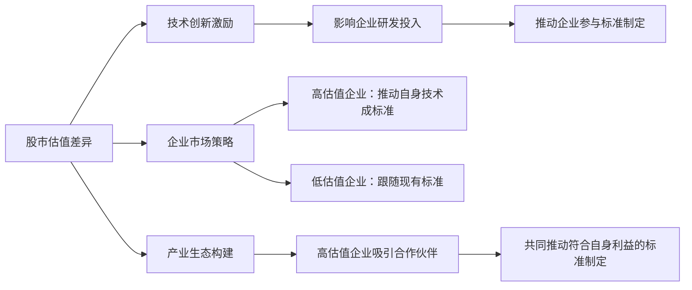

# 股市估值差异对国际技术标准制定的影响

> 关键词：股市估值差异、国际技术标准制定、技术创新、市场竞争、产业发展

> 摘要：本文深入探讨了股市估值差异对国际技术标准制定的影响。通过对股市估值的本质、国际技术标准制定的重要性及流程的介绍，分析了两者之间的内在联系。从技术创新激励、企业市场策略、产业生态构建等多个维度阐述了股市估值差异如何作用于国际技术标准制定。同时结合具体的数学模型和实际案例，展示了这种影响在现实中的体现。最后对未来的发展趋势和可能面临的挑战进行了总结，并提供了相关的学习资源、开发工具和研究论文等参考资料。

## 1. 背景介绍 
### 1.1 目的和范围
本研究旨在全面剖析股市估值差异与国际技术标准制定之间的关联和影响机制。具体范围涵盖了不同国家和地区股市估值的特点，以及这些特点如何在国际技术标准制定的各个环节中发挥作用。通过理论分析、数学建模和实际案例研究，揭示股市估值差异对国际技术标准制定的积极和消极影响，为企业、政府和相关机构在国际技术竞争中提供决策参考。

### 1.2 预期读者
本文的预期读者包括金融领域的投资者、分析师，技术产业的企业管理者、研发人员，以及关注国际技术标准制定和产业发展的政策制定者和研究人员。对于那些希望了解金融市场与技术标准之间相互关系的专业人士和爱好者也具有一定的参考价值。

### 1.3 文档结构概述
本文首先介绍相关背景知识，包括股市估值和国际技术标准制定的基本概念和术语。接着阐述核心概念之间的联系，并通过流程图展示其逻辑关系。然后详细讲解核心算法原理和具体操作步骤，运用数学模型和公式进行深入分析，并结合实际案例进行说明。之后介绍项目实战的开发环境搭建、源代码实现和代码解读。再探讨实际应用场景，推荐相关的学习资源、开发工具和研究论文。最后总结未来发展趋势与挑战，提供常见问题解答和扩展阅读参考资料。

### 1.4 术语表
#### 1.4.1 核心术语定义
- **股市估值**：指对上市公司的价值进行评估，通过各种方法和指标确定其股票的合理价格。常见的估值方法包括市盈率（P/E）、市净率（P/B）、现金流折现法（DCF）等。
- **国际技术标准**：是指在国际范围内被广泛认可和遵循的技术规范和准则，用于确保产品、服务和系统的质量、兼容性和互操作性。
- **技术标准制定**：是一个涉及多个利益相关者的过程，包括企业、行业协会、政府机构和国际组织等，旨在制定出符合各方利益和市场需求的技术标准。

#### 1.4.2 相关概念解释
- **技术创新**：指企业或个人通过研发和应用新技术、新方法，创造出具有创新性的产品、服务或工艺，从而提高竞争力和市场份额。
- **市场竞争**：指企业在市场中为了争夺客户、资源和利润而进行的竞争活动。市场竞争的激烈程度会影响企业的战略决策和技术创新投入。
- **产业生态**：指由相互关联的企业、供应商、客户和其他利益相关者组成的生态系统，它们通过合作和竞争共同推动产业的发展。

#### 1.4.3 缩略词列表
- **P/E**：市盈率（Price-to-Earnings Ratio）
- **P/B**：市净率（Price-to-Book Ratio）
- **DCF**：现金流折现法（Discounted Cash Flow）
- **ISO**：国际标准化组织（International Organization for Standardization）
- **IEC**：国际电工委员会（International Electrotechnical Commission）

## 2. 核心概念与联系 

### 2.1 股市估值的原理
股市估值是基于对上市公司未来盈利能力、资产价值和市场前景等因素的综合评估。常见的估值方法有以下几种：
- **市盈率法**：通过将公司的股价除以每股收益（EPS）得到市盈率。市盈率反映了市场对公司盈利预期的高低。公式为：$P/E=\frac{股价}{每股收益}$。
- **市净率法**：将公司的股价除以每股净资产（BVPS）得到市净率。市净率衡量了公司的市场价值与账面价值之间的关系。公式为：$P/B=\frac{股价}{每股净资产}$。
- **现金流折现法**：通过预测公司未来的现金流，并将其折现到当前时刻，得到公司的内在价值。公式为：$V=\sum_{t=1}^{n}\frac{CF_t}{(1+r)^t}$，其中$V$为公司的内在价值，$CF_t$为第$t$期的现金流，$r$为折现率，$n$为预测期数。

### 2.2 国际技术标准制定的流程
国际技术标准制定通常遵循以下流程：
1. **需求识别**：由企业、行业协会或政府机构等提出技术标准的需求，识别市场中存在的问题和需要规范的领域。
2. **提案提交**：相关利益方将技术标准提案提交给国际标准化组织或其他相关机构。
3. **工作组组建**：组织专家和代表组成工作组，对提案进行研究和讨论。
4. **标准起草**：工作组根据研究结果起草技术标准草案。
5. **征求意见**：将草案向全球范围内征求意见，收集各方反馈。
6. **修改完善**：根据反馈意见对草案进行修改和完善。
7. **投票表决**：经过多次修改后，提交给成员进行投票表决。
8. **发布实施**：如果表决通过，技术标准将正式发布并实施。

### 2.3 股市估值差异与国际技术标准制定的联系
股市估值差异会通过以下几个方面影响国际技术标准制定：
- **技术创新激励**：高估值的企业通常更容易获得资金支持，从而有更多的资源投入到技术研发中。这些企业可能会更积极地参与国际技术标准的制定，以将自己的技术优势转化为标准优势。
- **企业市场策略**：不同估值的企业在市场竞争中会采取不同的策略。高估值企业可能更倾向于推动自己的技术成为国际标准，以扩大市场份额和提高竞争力；而低估值企业可能更注重跟随现有标准，降低研发成本。
- **产业生态构建**：股市估值差异会影响产业内企业的发展格局。高估值企业的发展壮大可能会吸引更多的合作伙伴和供应商，形成以其为核心的产业生态。在这种产业生态中，企业可能会共同推动符合自身利益的国际技术标准的制定。

### 2.4 文本示意图
```plaintext
股市估值差异
├── 技术创新激励
│   └── 影响企业研发投入
│       └── 推动企业参与标准制定
├── 企业市场策略
│   ├── 高估值企业：推动自身技术成标准
│   └── 低估值企业：跟随现有标准
└── 产业生态构建
    ├── 高估值企业吸引合作伙伴
    └── 共同推动符合自身利益的标准制定
```

### 2.5 Mermaid 流程图


## 3. 核心算法原理 & 具体操作步骤 

### 3.1 股市估值算法原理
以下是使用 Python 实现市盈率和市净率计算的示例代码：
```python
def calculate_pe_ratio(stock_price, earnings_per_share):
    """
    计算市盈率
    :param stock_price: 股价
    :param earnings_per_share: 每股收益
    :return: 市盈率
    """
    if earnings_per_share == 0:
        return float('inf')
    return stock_price / earnings_per_share

def calculate_pb_ratio(stock_price, book_value_per_share):
    """
    计算市净率
    :param stock_price: 股价
    :param book_value_per_share: 每股净资产
    :return: 市净率
    """
    if book_value_per_share == 0:
        return float('inf')
    return stock_price / book_value_per_share

# 示例数据
stock_price = 50
earnings_per_share = 2
book_value_per_share = 10

# 计算市盈率和市净率
pe_ratio = calculate_pe_ratio(stock_price, earnings_per_share)
pb_ratio = calculate_pb_ratio(stock_price, book_value_per_share)

print(f"市盈率: {pe_ratio}")
print(f"市净率: {pb_ratio}")
```
### 3.2 操作步骤
1. **数据收集**：收集上市公司的股价、每股收益和每股净资产等数据。这些数据可以从金融数据库、证券交易所网站或专业金融服务机构获取。
2. **函数调用**：使用上述定义的函数，将收集到的数据作为参数传入，计算市盈率和市净率。
3. **结果分析**：根据计算结果，分析公司的估值水平。一般来说，较高的市盈率和市净率可能表示市场对公司的未来发展前景较为乐观，但也可能存在高估的风险；较低的市盈率和市净率可能表示公司被低估，但也可能反映出公司面临的一些问题。

### 3.3 对国际技术标准制定的影响分析算法
为了分析股市估值差异对国际技术标准制定的影响，我们可以构建一个简单的模型。假设存在两个企业 A 和 B，它们的股市估值分别为$V_A$和$V_B$，参与国际技术标准制定的意愿程度分别为$W_A$和$W_B$。我们可以使用以下公式来计算它们的意愿程度：
$W_i = \alpha \times V_i + \beta \times R_i$，其中$i = A, B$，$\alpha$和$\beta$为权重系数，$R_i$为企业的研发投入。

以下是使用 Python 实现该模型的示例代码：
```python
def calculate_willingness(valuation, r_d_investment, alpha=0.6, beta=0.4):
    """
    计算企业参与国际技术标准制定的意愿程度
    :param valuation: 股市估值
    :param r_d_investment: 研发投入
    :param alpha: 估值权重系数
    :param beta: 研发投入权重系数
    :return: 意愿程度
    """
    return alpha * valuation + beta * r_d_investment

# 示例数据
valuation_a = 1000
r_d_investment_a = 200
valuation_b = 500
r_d_investment_b = 100

# 计算意愿程度
willingness_a = calculate_willingness(valuation_a, r_d_investment_a)
willingness_b = calculate_willingness(valuation_b, r_d_investment_b)

print(f"企业 A 参与国际技术标准制定的意愿程度: {willingness_a}")
print(f"企业 B 参与国际技术标准制定的意愿程度: {willingness_b}")
```
### 3.4 操作步骤
1. **数据收集**：收集企业的股市估值和研发投入数据。
2. **参数设置**：根据实际情况设置权重系数$\alpha$和$\beta$。
3. **函数调用**：使用上述定义的函数，将企业的股市估值和研发投入数据作为参数传入，计算企业参与国际技术标准制定的意愿程度。
4. **结果分析**：比较不同企业的意愿程度，分析股市估值差异对企业参与国际技术标准制定的影响。

## 4. 数学模型和公式 & 详细讲解 & 举例说明 

### 4.1 股市估值模型
#### 4.1.1 市盈率模型
市盈率（P/E）模型是最常用的股市估值模型之一。其基本公式为：$P/E=\frac{股价}{每股收益}$。市盈率反映了市场对公司盈利预期的高低。例如，一家公司的股价为 50 元，每股收益为 2 元，则其市盈率为$50\div2 = 25$倍。一般来说，同行业中市盈率较高的公司可能被市场认为具有更好的发展前景，但也可能存在高估的风险。

#### 4.1.2 市净率模型
市净率（P/B）模型通过比较公司的市场价值与账面价值来评估公司的估值。公式为：$P/B=\frac{股价}{每股净资产}$。例如，一家公司的股价为 50 元，每股净资产为 10 元，则其市净率为$50\div10 = 5$倍。市净率较低的公司可能被认为具有较高的投资价值，但也可能反映出公司的资产质量或盈利能力存在问题。

#### 4.1.3 现金流折现模型
现金流折现（DCF）模型是一种基于公司未来现金流的估值方法。公式为：$V=\sum_{t=1}^{n}\frac{CF_t}{(1+r)^t}$，其中$V$为公司的内在价值，$CF_t$为第$t$期的现金流，$r$为折现率，$n$为预测期数。例如，假设一家公司未来 3 年的现金流分别为 100 万元、120 万元和 150 万元，折现率为 10%，则该公司的内在价值为：
\[
\begin{align*}
V&=\frac{100}{(1 + 0.1)^1}+\frac{120}{(1 + 0.1)^2}+\frac{150}{(1 + 0.1)^3}\\
&=\frac{100}{1.1}+\frac{120}{1.21}+\frac{150}{1.331}\\
&\approx90.91 + 99.17 + 112.69\\
&=302.77（万元）
\end{align*}
\]

### 4.2 股市估值差异对国际技术标准制定影响的数学模型
假设存在$n$个企业参与国际技术标准制定的竞争，第$i$个企业的股市估值为$V_i$，研发投入为$R_i$，参与标准制定的意愿程度为$W_i$。我们可以使用以下公式来计算$W_i$：
$W_i = \alpha \times V_i + \beta \times R_i + \gamma \times S_i$，其中$\alpha$、$\beta$和$\gamma$为权重系数，$S_i$为企业的市场份额。

例如，有 3 个企业 A、B、C，它们的相关数据如下表所示：
| 企业 | 股市估值（万元） | 研发投入（万元） | 市场份额 |
| ---- | ---- | ---- | ---- |
| A | 1000 | 200 | 0.3 |
| B | 500 | 100 | 0.2 |
| C | 800 | 150 | 0.25 |

假设$\alpha = 0.6$，$\beta = 0.3$，$\gamma = 0.1$，则各企业参与国际技术标准制定的意愿程度计算如下：
- 企业 A：$W_A = 0.6\times1000 + 0.3\times200 + 0.1\times0.3\times1000 = 600 + 60 + 30 = 690$
- 企业 B：$W_B = 0.6\times500 + 0.3\times100 + 0.1\times0.2\times1000 = 300 + 30 + 20 = 350$
- 企业 C：$W_C = 0.6\times800 + 0.3\times150 + 0.1\times0.25\times1000 = 480 + 45 + 25 = 550$

从计算结果可以看出，企业 A 的意愿程度最高，可能在国际技术标准制定中更具竞争力。

## 5. 项目实战：代码实际案例和详细解释说明 

### 5.1  开发环境搭建
#### 5.1.1 安装 Python
首先，需要安装 Python 编程语言。可以从 Python 官方网站（https://www.python.org/downloads/）下载适合自己操作系统的 Python 版本，并按照安装向导进行安装。

#### 5.1.2 安装必要的库
为了实现股市估值计算和数据分析，需要安装一些必要的 Python 库，如`pandas`、`numpy`等。可以使用以下命令进行安装：
```sh
pip install pandas numpy
```

### 5.2  源代码详细实现和代码解读
以下是一个完整的 Python 代码示例，用于计算多个企业的股市估值、研发投入和参与国际技术标准制定的意愿程度，并进行数据分析：
```python
import pandas as pd
import numpy as np

# 定义计算市盈率的函数
def calculate_pe_ratio(stock_price, earnings_per_share):
    if earnings_per_share == 0:
        return float('inf')
    return stock_price / earnings_per_share

# 定义计算市净率的函数
def calculate_pb_ratio(stock_price, book_value_per_share):
    if book_value_per_share == 0:
        return float('inf')
    return stock_price / book_value_per_share

# 定义计算参与国际技术标准制定意愿程度的函数
def calculate_willingness(valuation, r_d_investment, market_share, alpha=0.6, beta=0.3, gamma=0.1):
    return alpha * valuation + beta * r_d_investment + gamma * market_share * 1000

# 示例数据
data = {
    '企业名称': ['A', 'B', 'C'],
    '股价': [50, 30, 40],
    '每股收益': [2, 1, 1.5],
    '每股净资产': [10, 8, 12],
    '研发投入': [200, 100, 150],
    '市场份额': [0.3, 0.2, 0.25]
}

# 创建 DataFrame
df = pd.DataFrame(data)

# 计算市盈率和市净率
df['市盈率'] = df.apply(lambda row: calculate_pe_ratio(row['股价'], row['每股收益']), axis=1)
df['市净率'] = df.apply(lambda row: calculate_pb_ratio(row['股价'], row['每股净资产']), axis=1)

# 计算股市估值（假设简单以股价乘以总股本，这里简化总股本为 100）
df['股市估值'] = df['股价'] * 100

# 计算参与国际技术标准制定的意愿程度
df['意愿程度'] = df.apply(lambda row: calculate_willingness(row['股市估值'], row['研发投入'], row['市场份额']), axis=1)

# 输出结果
print(df)
```
### 5.3  代码解读与分析
1. **函数定义**：定义了`calculate_pe_ratio`、`calculate_pb_ratio`和`calculate_willingness`三个函数，分别用于计算市盈率、市净率和参与国际技术标准制定的意愿程度。
2. **数据准备**：使用字典`data`存储示例数据，并通过`pandas`的`DataFrame`将其转换为数据框。
3. **指标计算**：使用`apply`方法对数据框的每一行应用相应的函数，计算市盈率、市净率、股市估值和意愿程度。
4. **结果输出**：打印计算结果，方便观察和分析。

通过这个代码示例，我们可以清晰地看到不同企业的股市估值、研发投入和参与国际技术标准制定的意愿程度之间的关系，为进一步的决策提供参考。

## 6. 实际应用场景 
### 6.1 企业战略决策
企业可以根据自身和竞争对手的股市估值差异，制定参与国际技术标准制定的战略。高估值企业可以利用自身的资金和技术优势，积极推动自己的技术成为国际标准，以扩大市场份额和提高竞争力。低估值企业可以选择跟随现有标准，降低研发成本，或者与高估值企业合作，共同参与标准制定。

### 6.2 政府政策制定
政府可以通过观察股市估值差异对国际技术标准制定的影响，制定相应的政策来促进本国产业的发展。例如，政府可以出台扶持政策，鼓励高估值企业加大研发投入，参与国际技术标准制定；也可以加强对低估值企业的引导和支持，提高它们的技术水平和参与标准制定的能力。

### 6.3 投资者决策
投资者可以关注股市估值差异对国际技术标准制定的影响，作为投资决策的参考。参与国际技术标准制定的企业可能具有更好的发展前景和竞争力，其股票可能更具投资价值。投资者可以通过分析企业的股市估值、研发投入和参与标准制定的意愿程度，选择具有潜力的投资标的。

### 6.4 行业发展趋势预测
通过研究股市估值差异与国际技术标准制定的关系，可以预测行业的发展趋势。如果某个行业中高估值企业积极参与国际技术标准制定，可能预示着该行业将朝着这些企业所推动的技术方向发展。这对于行业内的企业和相关机构来说，可以提前做好战略规划和技术储备。

## 7. 工具和资源推荐
### 7.1 学习资源推荐
#### 7.1.1 书籍推荐
- 《金融市场学》：全面介绍金融市场的基本概念、理论和实践，对于理解股市估值有很大帮助。
- 《技术标准竞争战略》：深入探讨技术标准竞争的理论和策略，对国际技术标准制定有详细的分析。
- 《Python 数据分析实战》：介绍如何使用 Python 进行数据分析，对于处理股市估值和相关数据非常实用。

#### 7.1.2 在线课程
- Coursera 上的“金融市场”课程：由知名教授授课，系统讲解金融市场的知识和分析方法。
- edX 上的“技术标准与创新管理”课程：探讨技术标准在创新管理中的作用和影响。
- 慕课网上的“Python 数据分析入门”课程：适合初学者快速掌握 Python 数据分析的基本技能。

#### 7.1.3 技术博客和网站
- 雪球网：提供丰富的股市数据和分析文章，对于了解股市估值和企业动态有很大帮助。
- 国际标准化组织（ISO）官网：可以获取最新的国际技术标准信息和相关动态。
- 开源中国：有很多关于技术标准和软件开发的技术文章和讨论。

### 7.2 开发工具框架推荐
#### 7.2.1 IDE和编辑器
- PyCharm：功能强大的 Python 集成开发环境，提供代码编辑、调试、版本控制等一系列功能。
- Jupyter Notebook：交互式的开发环境，适合进行数据分析和模型验证，方便展示代码和结果。

#### 7.2.2 调试和性能分析工具
- Py-Spy：用于分析 Python 程序的性能瓶颈，找出耗时的代码段。
- PDB：Python 自带的调试器，可以帮助开发者定位和解决代码中的问题。

#### 7.2.3 相关框架和库
- Pandas：强大的数据分析库，提供数据结构和数据处理工具，方便处理股市估值和相关数据。
- Numpy：用于科学计算的基础库，提供高效的数组操作和数学函数。

### 7.3 相关论文著作推荐
#### 7.3.1 经典论文
- “The Role of Stock Market Valuation in Technological Standard Setting”：探讨了股市估值在技术标准制定中的作用和影响机制。
- “International Technology Standardization and Market Competition”：分析了国际技术标准制定与市场竞争之间的关系。

#### 7.3.2 最新研究成果
- 关注顶级学术期刊如《Management Science》、《Strategic Management Journal》等上发表的关于股市估值和技术标准的最新研究论文。

#### 7.3.3 应用案例分析
- 研究一些知名企业在国际技术标准制定中的成功案例，如华为在 5G 技术标准制定中的经验和策略。

## 8. 总结：未来发展趋势与挑战
### 8.1 未来发展趋势
- **股市估值与技术标准制定的关联更加紧密**：随着科技的快速发展和金融市场的全球化，股市估值将越来越受到企业技术创新能力和参与国际技术标准制定的影响。同时，国际技术标准制定也将更加注重企业的市场价值和发展潜力。
- **技术创新驱动标准制定**：高估值企业将继续加大技术研发投入，推动更多的新技术成为国际标准。新兴技术如人工智能、区块链、物联网等领域的标准制定将成为竞争的焦点。
- **国际合作与竞争并存**：在国际技术标准制定过程中，各国企业和组织将既加强合作，共同推动技术进步和标准统一，又面临激烈的竞争，争夺标准制定的主导权。

### 8.2 挑战
- **技术垄断和不公平竞争**：高估值企业可能利用自身的优势，通过控制国际技术标准制定来形成技术垄断，限制其他企业的发展。这可能导致市场竞争的不公平，阻碍技术创新和产业发展。
- **标准制定的复杂性和不确定性**：国际技术标准制定涉及多个利益相关者和复杂的技术问题，制定过程往往漫长而不确定。股市估值差异可能会加剧不同利益方之间的矛盾和冲突，增加标准制定的难度。
- **金融市场波动的影响**：股市估值容易受到金融市场波动的影响，如宏观经济形势、政策变化等。金融市场的不稳定可能导致企业的估值波动，从而影响它们参与国际技术标准制定的决策和能力。

## 9. 附录：常见问题与解答
### 9.1 股市估值差异是如何产生的？
股市估值差异主要由以下因素产生：
- **企业基本面差异**：不同企业的盈利能力、资产质量、市场份额等基本面因素不同，导致市场对它们的估值不同。
- **行业前景差异**：不同行业的发展前景和增长潜力不同，投资者对前景较好的行业给予更高的估值。
- **市场情绪和预期**：投资者的情绪和对未来的预期也会影响股市估值。当市场情绪乐观时，估值往往较高；反之则较低。

### 9.2 国际技术标准制定对企业有什么好处？
国际技术标准制定对企业有以下好处：
- **提高市场竞争力**：企业的技术成为国际标准后，可以获得更多的市场份额，提高品牌知名度和竞争力。
- **降低成本**：遵循国际标准可以减少企业的研发成本和生产过程中的不确定性。
- **促进技术创新**：参与标准制定可以促使企业加大研发投入，推动技术创新。

### 9.3 如何衡量企业参与国际技术标准制定的效果？
可以从以下几个方面衡量企业参与国际技术标准制定的效果：
- **标准采纳情况**：观察企业推动的技术标准在国际市场上的采纳程度和应用范围。
- **市场份额变化**：比较企业在标准制定前后的市场份额变化，评估其对市场竞争力的提升作用。
- **经济效益**：分析企业因参与标准制定而带来的经济效益，如销售收入、利润等的增长。

## 10. 扩展阅读 & 参考资料
### 10.1 扩展阅读
- 《全球产业链重塑与技术标准竞争》
- 《金融科技与股市估值新趋势》
- 《国际技术标准战略研究》

### 10.2 参考资料
- 国际标准化组织（ISO）官方文件
- 证券交易所发布的上市公司财务报告
- 相关学术期刊和研究报告

作者：AI天才研究院/AI Genius Institute & 禅与计算机程序设计艺术 /Zen And The Art of Computer Programming