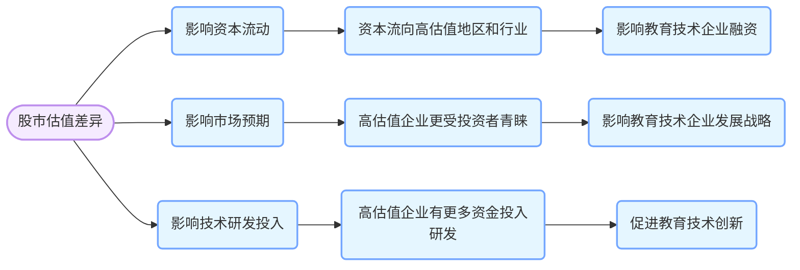

# 股市估值差异对国际教育技术创新的影响

> 关键词：股市估值差异、国际教育技术创新、资本流动、市场预期、技术研发投入

> 摘要：本文旨在深入探讨股市估值差异对国际教育技术创新的影响。通过对股市估值的基本原理、教育技术创新的特点进行分析，揭示两者之间的内在联系。研究发现，股市估值差异会通过资本流动、市场预期等途径对国际教育技术创新产生多方面的影响。同时，结合实际案例和相关数据，详细阐述了这种影响的具体表现和作用机制，并对未来的发展趋势和挑战进行了展望，为相关领域的研究和实践提供了有价值的参考。

## 1. 背景介绍 
### 1.1 目的和范围
本研究的主要目的是全面剖析股市估值差异对国际教育技术创新的影响。在当今全球化的经济环境下，股市作为重要的金融市场，其估值的波动和差异不仅反映了市场对企业的预期，还对企业的发展战略和创新能力产生深远影响。教育技术创新作为推动教育变革和发展的关键力量，受到多种因素的制约和促进。通过研究股市估值差异与国际教育技术创新之间的关系，我们可以更好地理解金融市场与实体经济之间的互动机制，为教育技术企业的发展、投资者的决策以及政策制定者的引导提供科学依据。

本研究的范围涵盖了国际范围内的教育技术行业，包括在线教育平台、教育科技硬件制造商、教育软件开发商等不同类型的企业。同时，我们将关注不同国家和地区的股市估值情况，分析其差异对教育技术创新的影响。

### 1.2 预期读者
本文的预期读者包括教育技术领域的从业者、投资者、研究人员以及政策制定者。对于教育技术从业者来说，了解股市估值差异对创新的影响有助于他们制定合理的发展战略，把握市场机遇，提高企业的创新能力和竞争力。投资者可以通过本文的研究，更好地评估教育技术企业的投资价值，做出明智的投资决策。研究人员可以将本文作为进一步研究的基础，深入探讨金融市场与教育技术创新之间的复杂关系。政策制定者可以根据本文的结论，制定相关政策，引导资本流向教育技术创新领域，促进教育技术的发展和普及。

### 1.3 文档结构概述
本文将按照以下结构进行组织：首先，介绍股市估值和教育技术创新的核心概念，并分析它们之间的联系，通过文本示意图和 Mermaid 流程图进行直观展示。接着，阐述股市估值差异影响教育技术创新的核心算法原理，并给出具体的操作步骤，同时使用 Python 源代码进行详细阐述。然后，建立数学模型和公式，对影响机制进行详细讲解，并通过举例说明。之后，通过项目实战案例，详细解释代码的实现和解读，分析股市估值差异对教育技术创新的实际影响。再探讨教育技术创新在不同场景下的实际应用，推荐相关的学习资源、开发工具框架和论文著作。最后，总结股市估值差异对国际教育技术创新的影响，展望未来的发展趋势和挑战，并对常见问题进行解答，提供扩展阅读和参考资料。

### 1.4 术语表
#### 1.4.1 核心术语定义
- **股市估值**：指对股票市场中上市公司的价值进行评估的过程和结果。通常采用多种方法，如市盈率（P/E）、市净率（P/B）、现金流折现法（DCF）等，来确定股票的合理价格。
- **股市估值差异**：指不同国家、地区或行业之间，由于经济发展水平、市场环境、投资者偏好等因素的影响，导致股票估值水平存在差异的现象。
- **教育技术创新**：指运用现代信息技术和教育理念，对教育教学过程进行创新和改进的活动。包括在线教育平台的开发、教育软件的研发、智能教育硬件的设计等方面。

#### 1.4.2 相关概念解释
- **资本流动**：指资金在不同地区、行业和企业之间的转移和配置。股市估值差异会影响资本的流动方向，资本往往会流向估值较高、发展潜力较大的地区和行业。
- **市场预期**：指投资者对股票市场未来走势和企业发展前景的预期。股市估值差异反映了市场对不同企业的预期差异，这种预期会影响企业的融资能力和发展战略。
- **技术研发投入**：指企业为了开展技术创新活动而投入的资金、人力和物力等资源。股市估值差异会影响企业的融资能力，进而影响企业的技术研发投入。

#### 1.4.3 缩略词列表
- **P/E**：市盈率（Price-to-Earnings Ratio）
- **P/B**：市净率（Price-to-Book Ratio）
- **DCF**：现金流折现法（Discounted Cash Flow）

## 2. 核心概念与联系 
### 核心概念原理
#### 股市估值原理
股市估值是一个复杂的过程，其核心原理是基于对企业未来盈利能力的预期。常用的估值方法有以下几种：
- **市盈率法**：市盈率是指股票价格与每股收益的比率，计算公式为 $P/E=\frac{P}{EPS}$，其中 $P$ 为股票价格，$EPS$ 为每股收益。市盈率反映了投资者为获取每股收益所愿意支付的价格，通常用于比较同行业不同企业的估值水平。
- **市净率法**：市净率是指股票价格与每股净资产的比率，计算公式为 $P/B=\frac{P}{BVPS}$，其中 $P$ 为股票价格，$BVPS$ 为每股净资产。市净率反映了股票价格相对于每股净资产的溢价程度，常用于评估企业的资产价值。
- **现金流折现法**：现金流折现法是一种基于企业未来现金流的估值方法，其基本原理是将企业未来的现金流按照一定的折现率折现到当前时点，得到企业的内在价值。计算公式为 $V=\sum_{t=1}^{n}\frac{CF_t}{(1+r)^t}$，其中 $V$ 为企业的内在价值，$CF_t$ 为第 $t$ 期的现金流，$r$ 为折现率，$n$ 为预测期数。

#### 教育技术创新原理
教育技术创新的核心原理是将现代信息技术与教育教学理论相结合，以提高教育教学的质量和效率。其主要包括以下几个方面：
- **技术驱动**：利用互联网、人工智能、大数据等现代信息技术，开发新的教育产品和服务，如在线教育平台、智能教学系统、虚拟实验室等。
- **用户需求导向**：深入了解教育用户的需求和痛点，设计出符合用户需求的教育技术解决方案，提高用户的学习体验和效果。
- **创新教学模式**：通过引入新的教学理念和方法，如翻转课堂、项目式学习、个性化学习等，改变传统的教学模式，提高教育教学的灵活性和适应性。

### 核心概念架构的文本示意图
```plaintext
股市估值差异
├── 影响资本流动
│   └── 资本流向高估值地区和行业
│       └── 影响教育技术企业融资
├── 影响市场预期
│   └── 高估值企业更受投资者青睐
│       └── 影响教育技术企业发展战略
└── 影响技术研发投入
    └── 高估值企业有更多资金投入研发
        └── 促进教育技术创新
```

### Mermaid 流程图


## 3. 核心算法原理 & 具体操作步骤 
### 核心算法原理
为了量化股市估值差异对教育技术创新的影响，我们可以构建一个基于多元线性回归的模型。假设我们用 $Y$ 表示教育技术创新水平，$X_1$ 表示股市估值差异，$X_2$ 表示资本流动，$X_3$ 表示市场预期，$X_4$ 表示技术研发投入，那么多元线性回归模型可以表示为：

$$Y = \beta_0 + \beta_1X_1 + \beta_2X_2 + \beta_3X_3 + \beta_4X_4 + \epsilon$$

其中，$\beta_0$ 为截距项，$\beta_1,\beta_2,\beta_3,\beta_4$ 为回归系数，$\epsilon$ 为误差项。

### 具体操作步骤
#### 数据收集
收集国际范围内不同国家和地区的股市估值数据、教育技术企业的创新数据、资本流动数据、市场预期数据和技术研发投入数据。可以从金融数据库、教育研究机构、政府统计部门等渠道获取相关数据。

#### 数据预处理
对收集到的数据进行清洗、整理和标准化处理，以消除数据中的噪声和异常值，确保数据的质量和可比性。

#### 模型建立
使用 Python 的 `statsmodels` 库建立多元线性回归模型，并对模型进行拟合和评估。

#### 结果分析
分析回归系数的显著性和大小，判断股市估值差异、资本流动、市场预期和技术研发投入对教育技术创新的影响程度和方向。

### Python 源代码详细阐述
```python
import pandas as pd
import statsmodels.api as sm

# 假设已经收集并整理好数据，存储在 CSV 文件中
data = pd.read_csv('data.csv')

# 定义自变量和因变量
X = data[['X1', 'X2', 'X3', 'X4']]
Y = data['Y']

# 添加常数项
X = sm.add_constant(X)

# 建立多元线性回归模型
model = sm.OLS(Y, X)

# 拟合模型
results = model.fit()

# 输出模型结果
print(results.summary())
```

## 4. 数学模型和公式 & 详细讲解 & 举例说明 
### 数学模型和公式
我们在前面已经介绍了多元线性回归模型：

$$Y = \beta_0 + \beta_1X_1 + \beta_2X_2 + \beta_3X_3 + \beta_4X_4 + \epsilon$$

其中，$Y$ 表示教育技术创新水平，可以用专利申请数量、新产品研发数量等指标来衡量；$X_1$ 表示股市估值差异，可以用不同国家或地区的平均市盈率之差来表示；$X_2$ 表示资本流动，可以用教育技术企业的融资额来表示；$X_3$ 表示市场预期，可以用投资者对教育技术企业的评级来表示；$X_4$ 表示技术研发投入，可以用企业的研发费用来表示。

### 详细讲解
- **截距项 $\beta_0$**：表示当所有自变量都为 0 时，教育技术创新水平的预期值。在实际应用中，截距项可能没有实际的经济意义，但它是模型的一部分，用于调整模型的拟合效果。
- **回归系数 $\beta_1,\beta_2,\beta_3,\beta_4$**：表示自变量对因变量的影响程度和方向。例如，$\beta_1$ 表示股市估值差异对教育技术创新水平的影响，如果 $\beta_1$ 为正，说明股市估值差异越大，教育技术创新水平越高；如果 $\beta_1$ 为负，说明股市估值差异越大，教育技术创新水平越低。
- **误差项 $\epsilon$**：表示模型无法解释的随机误差，它反映了除自变量之外其他因素对因变量的影响。误差项通常假设服从正态分布，其均值为 0，方差为常数。

### 举例说明
假设我们通过数据分析得到以下回归结果：

| 自变量 | 回归系数 | 标准误差 | t 值 | P 值 |
| ---- | ---- | ---- | ---- | ---- |
| 常数项 | 10 | 2 | 5 | 0.000 |
| $X_1$ | 0.5 | 0.1 | 5 | 0.000 |
| $X_2$ | 0.3 | 0.05 | 6 | 0.000 |
| $X_3$ | 0.2 | 0.03 | 6.67 | 0.000 |
| $X_4$ | 0.4 | 0.06 | 6.67 | 0.000 |

从上述结果可以看出，所有自变量的回归系数都为正，且 P 值都小于 0.05，说明这些自变量对教育技术创新水平都有显著的正向影响。具体来说，股市估值差异每增加 1 个单位，教育技术创新水平预计将增加 0.5 个单位；资本流动每增加 1 个单位，教育技术创新水平预计将增加 0.3 个单位；市场预期每增加 1 个单位，教育技术创新水平预计将增加 0.2 个单位；技术研发投入每增加 1 个单位，教育技术创新水平预计将增加 0.4 个单位。

## 5. 项目实战：代码实际案例和详细解释说明 
### 5.1  开发环境搭建
#### 安装 Python
首先，需要安装 Python 编程语言。可以从 Python 官方网站（https://www.python.org/downloads/）下载适合自己操作系统的 Python 安装包，并按照安装向导进行安装。

#### 安装必要的库
在安装好 Python 后，需要安装一些必要的库，如 `pandas`、`statsmodels` 等。可以使用以下命令进行安装：

```sh
pip install pandas statsmodels
```

### 5.2  源代码详细实现和代码解读
```python
import pandas as pd
import statsmodels.api as sm

# 读取数据
data = pd.read_csv('education_tech_data.csv')

# 提取自变量和因变量
X = data[['stock_valuation_difference', 'capital_flow', 'market_expectation', 'R&D_investment']]
Y = data['innovation_level']

# 添加常数项
X = sm.add_constant(X)

# 建立多元线性回归模型
model = sm.OLS(Y, X)

# 拟合模型
results = model.fit()

# 输出模型结果
print(results.summary())

# 预测新数据
new_data = pd.DataFrame({
    'const': [1],
    'stock_valuation_difference': [10],
    'capital_flow': [20],
    'market_expectation': [30],
    'R&D_investment': [40]
})

prediction = results.predict(new_data)
print(f"预测的教育技术创新水平: {prediction[0]}")
```

### 代码解读与分析
#### 数据读取
```python
data = pd.read_csv('education_tech_data.csv')
```
使用 `pandas` 库的 `read_csv` 函数读取存储在 CSV 文件中的数据。

#### 提取自变量和因变量
```python
X = data[['stock_valuation_difference', 'capital_flow', 'market_expectation', 'R&D_investment']]
Y = data['innovation_level']
```
从数据中提取自变量和因变量，分别存储在 `X` 和 `Y` 中。

#### 添加常数项
```python
X = sm.add_constant(X)
```
使用 `statsmodels` 库的 `add_constant` 函数为自变量添加常数项，以便进行多元线性回归分析。

#### 建立多元线性回归模型
```python
model = sm.OLS(Y, X)
```
使用 `statsmodels` 库的 `OLS` 函数建立多元线性回归模型。

#### 拟合模型
```python
results = model.fit()
```
使用 `fit` 方法对模型进行拟合，得到回归结果。

#### 输出模型结果
```python
print(results.summary())
```
使用 `summary` 方法输出模型的详细结果，包括回归系数、标准误差、t 值、P 值等。

#### 预测新数据
```python
new_data = pd.DataFrame({
    'const': [1],
    'stock_valuation_difference': [10],
    'capital_flow': [20],
    'market_expectation': [30],
    'R&D_investment': [40]
})

prediction = results.predict(new_data)
print(f"预测的教育技术创新水平: {prediction[0]}")
```
创建一个新的数据框 `new_data`，包含自变量的值，然后使用 `predict` 方法对新数据进行预测，并输出预测结果。

## 6. 实际应用场景 
### 企业战略决策
对于教育技术企业来说，了解股市估值差异对创新的影响可以帮助它们制定合理的发展战略。如果企业所在地区的股市估值较低，企业可以考虑通过拓展海外市场、与高估值地区的企业合作等方式，吸引更多的资本和资源，加大技术研发投入，提高创新能力。相反，如果企业所在地区的股市估值较高，企业可以利用这一优势，通过上市融资等方式获取更多的资金，加速技术创新和业务扩张。

### 投资者决策
投资者在进行教育技术企业的投资决策时，需要考虑股市估值差异对企业创新能力和发展前景的影响。高估值的教育技术企业通常具有较强的创新能力和发展潜力，但也可能存在估值泡沫的风险。投资者可以通过分析股市估值差异、企业的技术研发投入、市场预期等因素，评估企业的投资价值，做出明智的投资决策。

### 政策制定
政策制定者可以根据股市估值差异对教育技术创新的影响，制定相关政策，引导资本流向教育技术创新领域。例如，政府可以通过税收优惠、财政补贴等方式，鼓励企业加大技术研发投入，提高创新能力。同时，政府还可以加强对股市的监管，规范市场秩序，防范估值泡沫的风险，为教育技术创新创造良好的金融环境。

## 7. 工具和资源推荐
### 7.1 学习资源推荐
#### 7.1.1 书籍推荐
- 《金融市场学》：介绍了金融市场的基本原理、运行机制和投资策略，对于理解股市估值和资本流动具有重要的参考价值。
- 《教育技术学》：系统阐述了教育技术的基本概念、理论和方法，有助于了解教育技术创新的本质和发展趋势。
- 《多元统计分析》：讲解了多元线性回归等统计方法的原理和应用，为量化分析股市估值差异对教育技术创新的影响提供了理论支持。

#### 7.1.2 在线课程
- Coursera 上的“金融市场”课程：由知名教授授课，深入讲解金融市场的各种理论和实践知识。
- edX 上的“教育技术创新”课程：介绍了教育技术创新的最新理念和方法，以及如何将其应用于实际教学中。
- 中国大学 MOOC 上的“多元统计分析”课程：结合实际案例，详细讲解多元统计分析的方法和应用。

#### 7.1.3 技术博客和网站
- 金融界网站：提供丰富的金融市场资讯和数据分析工具，有助于了解股市估值和资本流动的动态。
- 教育技术前沿网：关注教育技术创新的最新趋势和实践案例，为教育技术从业者提供有价值的参考。
- 统计之都：专注于统计学和数据分析领域，分享统计方法的应用案例和代码实现。

### 7.2 开发工具框架推荐
#### 7.2.1 IDE和编辑器
- PyCharm：一款功能强大的 Python 集成开发环境，提供代码编辑、调试、版本控制等多种功能，适合开发数据分析和机器学习项目。
- Jupyter Notebook：一种交互式的开发环境，支持 Python、R 等多种编程语言，方便进行数据探索和模型验证。
- Visual Studio Code：一款轻量级的代码编辑器，具有丰富的插件生态系统，可用于开发各种类型的项目。

#### 7.2.2 调试和性能分析工具
- PDB：Python 自带的调试工具，可以帮助开发者定位代码中的错误和问题。
- cProfile：Python 标准库中的性能分析工具，可以分析代码的运行时间和函数调用情况，帮助开发者优化代码性能。
- Py-Spy：一款轻量级的 Python 性能分析工具，可以实时监控 Python 进程的 CPU 使用率和函数调用情况。

#### 7.2.3 相关框架和库
- Pandas：一个强大的数据处理和分析库，提供了高效的数据结构和数据操作方法，适合处理和分析金融和教育数据。
- Statsmodels：一个用于统计建模和计量经济学分析的 Python 库，支持多种统计模型的建立和拟合，如线性回归、逻辑回归等。
- Scikit-learn：一个广泛使用的机器学习库，提供了各种机器学习算法和工具，可用于数据挖掘、预测分析等任务。

### 7.3 相关论文著作推荐
#### 7.3.1 经典论文
- 《The Capital Asset Pricing Model: Theory and Evidence》：该论文介绍了资本资产定价模型（CAPM）的基本原理和实证研究，对于理解股市估值和资本流动具有重要的理论意义。
- 《The Economics of Education Technology Innovation》：探讨了教育技术创新的经济原理和影响因素，为研究股市估值差异对教育技术创新的影响提供了理论基础。
- 《Multivariate Regression Analysis: Theory and Applications》：详细阐述了多元线性回归分析的理论和应用，是多元统计分析领域的经典论文之一。

#### 7.3.2 最新研究成果
- 《The Impact of Stock Market Valuation on Technological Innovation in the Education Sector》：该研究通过实证分析，探讨了股市估值差异对教育技术创新的影响机制和效果。
- 《Financing Education Technology Innovation: The Role of Stock Market Valuation》：研究了股市估值在教育技术创新融资中的作用和影响，为教育技术企业的融资决策提供了参考。
- 《Market Expectations and Education Technology Innovation: Evidence from the Stock Market》：分析了市场预期对教育技术创新的影响，以及股市估值如何反映市场预期。

#### 7.3.3 应用案例分析
- 《Case Studies in Education Technology Innovation: Lessons from the Stock Market》：通过实际案例分析，介绍了股市估值差异对教育技术创新的影响在不同企业和地区的具体表现和应对策略。
- 《Investing in Education Technology: Insights from Stock Market Valuation》：结合投资案例，探讨了如何根据股市估值差异进行教育技术企业的投资决策。
- 《Policy Implications of Stock Market Valuation for Education Technology Innovation》：分析了股市估值差异对教育技术创新政策制定的影响和启示。

## 8. 总结：未来发展趋势与挑战
### 未来发展趋势
- **全球化趋势加强**：随着全球经济一体化的发展，股市估值差异对国际教育技术创新的影响将更加显著。教育技术企业将更加注重拓展海外市场，利用全球资源进行技术创新和业务扩张。
- **技术融合加速**：人工智能、大数据、区块链等新兴技术将与教育技术深度融合，推动教育技术创新的不断发展。股市估值差异将促使资本流向这些具有创新潜力的领域，加速技术融合的进程。
- **个性化教育需求增加**：随着人们对教育质量和个性化的要求不断提高，教育技术创新将更加注重满足个性化教育需求。股市估值差异将引导企业加大在个性化教育技术研发方面的投入，推动个性化教育的普及和发展。

### 挑战
- **估值泡沫风险**：股市估值差异可能导致部分教育技术企业出现估值泡沫，一旦泡沫破裂，将对企业的发展和投资者的利益造成严重影响。因此，需要加强对股市的监管，防范估值泡沫的风险。
- **技术创新难度加大**：随着教育技术的不断发展，技术创新的难度也在不断加大。教育技术企业需要投入更多的资金和人力进行技术研发，同时还需要面对技术更新换代快、知识产权保护等问题。
- **政策不确定性**：不同国家和地区的政策环境存在差异，政策的不确定性可能会影响教育技术企业的发展和创新。企业需要密切关注政策动态，及时调整发展战略，以应对政策变化带来的挑战。

## 9. 附录：常见问题与解答
### 问题 1：股市估值差异是如何产生的？
股市估值差异的产生主要受到以下因素的影响：
- **经济发展水平**：不同国家和地区的经济发展水平不同，导致企业的盈利能力和发展前景存在差异，从而影响股市估值。
- **市场环境**：股市的供求关系、投资者情绪、政策法规等市场环境因素也会对股市估值产生影响。
- **行业特点**：不同行业的发展阶段、竞争程度、技术创新能力等特点不同，也会导致股市估值的差异。

### 问题 2：股市估值差异对教育技术创新的影响是短期还是长期的？
股市估值差异对教育技术创新的影响既有短期的，也有长期的。从短期来看，股市估值差异会影响资本的流动和企业的融资能力，从而对教育技术创新产生直接的影响。从长期来看，股市估值差异会影响企业的发展战略和市场预期，引导企业加大技术研发投入，促进教育技术创新的长期发展。

### 问题 3：如何衡量教育技术创新水平？
衡量教育技术创新水平可以从多个方面进行考虑，常见的指标包括：
- **专利申请数量**：反映了企业在技术创新方面的投入和成果。
- **新产品研发数量**：体现了企业推出新的教育技术产品和服务的能力。
- **用户满意度**：衡量了教育技术产品和服务对用户需求的满足程度。
- **教学效果提升**：通过评估教育技术应用对教学质量和学生学习效果的影响来衡量创新水平。

### 问题 4：企业应该如何应对股市估值差异对创新的影响？
企业可以采取以下措施应对股市估值差异对创新的影响：
- **优化融资策略**：根据股市估值差异，选择合适的融资渠道和时机，如在高估值地区上市融资，以获取更多的资金支持技术创新。
- **加强技术研发合作**：与高估值地区的企业、科研机构合作，共享技术资源和创新成果，提高自身的创新能力。
- **关注市场需求**：深入了解市场需求和用户痛点，开发符合市场需求的教育技术产品和服务，提高企业的市场竞争力。
- **加强品牌建设**：通过提升品牌知名度和美誉度，增强投资者对企业的信心，提高企业的估值水平。

## 10. 扩展阅读 & 参考资料
### 扩展阅读
- 《金融炼金术》：作者乔治·索罗斯通过对金融市场的深入观察和实践，提出了反身性理论，对于理解股市估值和市场波动具有重要的启示。
- 《教育的未来》：探讨了未来教育的发展趋势和变革方向，为教育技术创新提供了广阔的思考空间。
- 《创新者的窘境》：分析了创新在企业发展中的重要性和面临的挑战，对于教育技术企业的创新战略制定具有借鉴意义。

### 参考资料
- 金融数据库：如 Bloomberg、Wind 等，提供了丰富的金融市场数据和分析工具。
- 教育研究机构报告：如 OECD、世界银行等发布的教育研究报告，为了解教育技术创新的现状和趋势提供了权威数据和分析。
- 学术期刊：如《Journal of Financial Economics》、《Educational Technology Research and Development》等，发表了大量关于金融市场和教育技术创新的学术研究成果。

作者：AI天才研究院/AI Genius Institute & 禅与计算机程序设计艺术 /Zen And The Art of Computer Programming