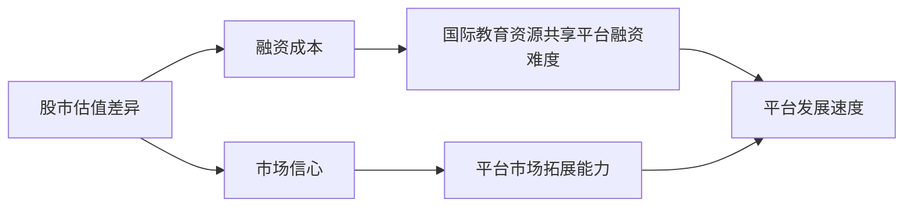

# 股市估值差异对国际教育资源共享平台的影响

> 关键词：股市估值差异、国际教育资源共享平台、资本市场、平台发展、财务策略

> 摘要：本文聚焦于股市估值差异对国际教育资源共享平台的影响。通过对股市估值差异的原理、形成机制的分析，探讨其在融资、运营、战略布局等方面对国际教育资源共享平台产生的作用。深入研究核心算法、数学模型，结合实际案例，剖析平台在不同股市估值环境下的应对策略。同时介绍相关工具和资源，展望未来发展趋势与挑战，为国际教育资源共享平台的发展提供全面的理论与实践参考。

## 1. 背景介绍 
### 1.1 目的和范围
本研究旨在全面探究股市估值差异对国际教育资源共享平台的具体影响。范围涵盖了不同国家和地区股市的估值情况，以及国际教育资源共享平台在融资、运营、市场拓展等多个环节受到的影响。通过分析这些影响，为平台的管理者、投资者以及相关政策制定者提供有价值的决策依据。

### 1.2 预期读者
本文的预期读者包括国际教育资源共享平台的管理人员、投资者、金融分析师、教育行业研究者以及对教育与金融交叉领域感兴趣的人士。对于平台管理人员，可帮助其制定更合理的发展战略；投资者可据此评估投资风险与收益；金融分析师能深入了解行业动态；教育行业研究者可丰富研究视角；普通爱好者能增进对该领域的认识。

### 1.3 文档结构概述
本文首先介绍相关背景知识，包括目的、预期读者和文档结构。接着阐述核心概念与联系，明确股市估值差异和国际教育资源共享平台的原理及架构。然后详细讲解核心算法原理和具体操作步骤，通过 Python 代码进行说明。之后介绍数学模型和公式，并举例解释。再通过项目实战展示实际案例及代码解读。随后分析实际应用场景，推荐相关工具和资源。最后总结未来发展趋势与挑战，解答常见问题，并提供扩展阅读和参考资料。

### 1.4 术语表
#### 1.4.1 核心术语定义
- **股市估值差异**：指不同股票市场或同一市场中不同股票在估值水平上的差别，通常用市盈率、市净率等指标衡量。
- **国际教育资源共享平台**：借助互联网技术，整合全球各类教育资源，为用户提供学习服务的在线平台。

#### 1.4.2 相关概念解释
- **资本市场**：金融市场的重要组成部分，包括股票市场、债券市场等，为企业提供融资和投资渠道。
- **教育科技（EdTech）**：将信息技术应用于教育领域，推动教育创新和发展的相关技术和服务。

#### 1.4.3 缩略词列表
- **PE**：市盈率（Price - Earnings Ratio），反映股票价格与每股盈利的比率。
- **PB**：市净率（Price - Book Ratio），衡量股票价格与每股净资产的关系。

## 2. 核心概念与联系 

### 股市估值差异原理
股市估值差异主要源于不同市场的宏观经济环境、政策法规、投资者偏好等因素。例如，成熟市场如美国股市，投资者更注重企业的长期业绩和稳定性，估值相对较为理性；而新兴市场可能受到政策刺激、资金涌入等影响，估值波动较大。

### 国际教育资源共享平台架构
国际教育资源共享平台通常由前端用户界面、后端服务器、数据库和教育资源库等部分组成。用户通过前端界面访问平台，后端服务器处理用户请求，从数据库中调取相关教育资源。

### 两者联系示意图


从图中可以看出，股市估值差异通过影响融资成本和市场信心，进而对国际教育资源共享平台的融资难度、市场拓展能力和发展速度产生影响。

## 3. 核心算法原理 & 具体操作步骤 

### 股市估值计算算法
股市估值常用的指标是市盈率（PE）和市净率（PB）。以下是使用 Python 计算市盈率和市净率的代码示例：

```python
# 计算市盈率
def calculate_pe(stock_price, earnings_per_share):
    """
    计算市盈率
    :param stock_price: 股票价格
    :param earnings_per_share: 每股盈利
    :return: 市盈率
    """
    if earnings_per_share == 0:
        return float('inf')
    return stock_price / earnings_per_share

# 计算市净率
def calculate_pb(stock_price, book_value_per_share):
    """
    计算市净率
    :param stock_price: 股票价格
    :param book_value_per_share: 每股净资产
    :return: 市净率
    """
    if book_value_per_share == 0:
        return float('inf')
    return stock_price / book_value_per_share

# 示例数据
stock_price = 50
earnings_per_share = 5
book_value_per_share = 10

pe = calculate_pe(stock_price, earnings_per_share)
pb = calculate_pb(stock_price, book_value_per_share)

print(f"市盈率: {pe}")
print(f"市净率: {pb}")
```

### 操作步骤
1. 收集股票的相关数据，包括股票价格、每股盈利和每股净资产。
2. 调用 `calculate_pe` 函数计算市盈率。
3. 调用 `calculate_pb` 函数计算市净率。
4. 根据计算结果分析股票的估值情况。

## 4. 数学模型和公式 & 详细讲解 & 举例说明 

### 市盈率模型
市盈率（PE）的计算公式为：
$$PE = \frac{P}{EPS}$$
其中，$P$ 表示股票价格，$EPS$ 表示每股盈利。

市盈率反映了投资者为获取每单位盈利所愿意支付的价格。例如，某股票价格为 100 元，每股盈利为 10 元，则市盈率为 $100\div10 = 10$ 倍。一般来说，市盈率越高，表明市场对该股票的预期越高，但也可能存在估值泡沫。

### 市净率模型
市净率（PB）的计算公式为：
$$PB = \frac{P}{BVPS}$$
其中，$P$ 表示股票价格，$BVPS$ 表示每股净资产。

市净率衡量了股票价格相对于每股净资产的倍数。例如，某股票价格为 50 元，每股净资产为 20 元，则市净率为 $50\div20 = 2.5$ 倍。市净率较低的股票可能被低估，但也可能反映了公司的盈利能力较弱。

### 举例说明
假设国际教育资源共享平台 A 在甲股市的股票价格为 80 元，每股盈利为 8 元，每股净资产为 20 元；在乙股市的股票价格为 120 元，每股盈利为 10 元，每股净资产为 30 元。

在甲股市：
- 市盈率 $PE_1=\frac{80}{8}=10$ 倍
- 市净率 $PB_1=\frac{80}{20}=4$ 倍

在乙股市：
- 市盈率 $PE_2=\frac{120}{10}=12$ 倍
- 市净率 $PB_2=\frac{120}{30}=4$ 倍

可以看出，该平台在乙股市的市盈率较高，可能意味着乙股市的投资者对其未来发展更有信心。

## 5. 项目实战：代码实际案例和详细解释说明 

### 5.1  开发环境搭建
为了模拟股市估值差异对国际教育资源共享平台的影响，我们使用 Python 进行开发。以下是所需的开发环境搭建步骤：
1. 安装 Python：从 Python 官方网站（https://www.python.org/downloads/）下载并安装 Python 3.x 版本。
2. 安装必要的库：使用 `pip` 安装 `pandas`、`numpy` 等库，用于数据处理和分析。
```sh
pip install pandas numpy
```

### 5.2  源代码详细实现和代码解读
```python
import pandas as pd
import numpy as np

# 模拟不同股市的估值数据
data = {
    'stock_market': ['Market A', 'Market B', 'Market C'],
    'stock_price': [50, 60, 70],
    'earnings_per_share': [5, 6, 7],
    'book_value_per_share': [10, 12, 14]
}

df = pd.DataFrame(data)

# 计算市盈率和市净率
df['PE'] = df['stock_price'] / df['earnings_per_share']
df['PB'] = df['stock_price'] / df['book_value_per_share']

# 模拟国际教育资源共享平台在不同股市的融资情况
# 假设融资额与估值相关
df['funding_amount'] = df['PE'] * 1000

print(df)
```

### 代码解读与分析
1. **数据模拟**：使用 `pandas` 库创建一个包含不同股市估值数据的 DataFrame，包括股票价格、每股盈利和每股净资产。
2. **计算指标**：通过简单的除法运算计算市盈率和市净率，并将结果添加到 DataFrame 中。
3. **模拟融资情况**：假设融资额与市盈率成正比，计算每个股市的融资额。
4. **结果输出**：打印包含所有信息的 DataFrame，方便分析不同股市的估值差异对平台融资的影响。

## 6. 实际应用场景 
### 融资决策
国际教育资源共享平台在选择上市地点时，会考虑不同股市的估值差异。如果某股市的估值较高，平台可以获得更高的融资额，为其发展提供更多资金支持。例如，一些教育科技公司选择在美国纳斯达克上市，因为美国股市对科技类企业的估值相对较高。

### 市场拓展
股市估值差异也会影响平台的市场拓展策略。在估值较高的市场，平台可以利用融资资金加大市场推广力度，吸引更多用户。而在估值较低的市场，平台可能需要更加注重成本控制和盈利模式的优化。

### 战略投资与并购
估值差异还会影响平台的战略投资和并购决策。在估值较低的市场，平台可以寻找合适的目标企业进行并购，以较低的成本扩大业务规模。而在估值较高的市场，平台可能会选择进行战略投资，与其他企业合作，共同开拓市场。

## 7. 工具和资源推荐
### 7.1 学习资源推荐
#### 7.1.1 书籍推荐
- 《证券分析》（Security Analysis）：由本杰明·格雷厄姆（Benjamin Graham）和大卫·多德（David Dodd）所著，是价值投资的经典之作，介绍了股票估值的基本方法和原理。
- 《金融市场与金融机构》（Financial Markets and Institutions）：涵盖了金融市场的各个方面，包括股票市场、债券市场等，有助于了解股市估值的宏观环境。

#### 7.1.2 在线课程
- Coursera 上的“投资学原理”（Principles of Investing）：由知名教授授课，系统讲解了投资的基本概念和方法，包括股票估值。
- edX 上的“金融市场”（Financial Markets）：深入分析了金融市场的运行机制和股票估值的相关理论。

#### 7.1.3 技术博客和网站
- 雪球（https://xueqiu.com/）：国内知名的财经社区，提供股票估值分析、市场动态等信息。
- Seeking Alpha（https://seekingalpha.com/）：国外的金融分析网站，有大量关于股票估值和投资策略的文章。

### 7.2 开发工具框架推荐
#### 7.2.1 IDE和编辑器
- PyCharm：功能强大的 Python 集成开发环境，提供代码编辑、调试、版本控制等功能。
- Jupyter Notebook：交互式编程环境，适合进行数据分析和代码演示。

#### 7.2.2 调试和性能分析工具
- pdb：Python 内置的调试器，可用于调试 Python 代码。
- cProfile：Python 的性能分析工具，可帮助找出代码中的性能瓶颈。

#### 7.2.3 相关框架和库
- pandas：用于数据处理和分析的 Python 库，提供了丰富的数据结构和函数。
- numpy：Python 的数值计算库，支持高效的数组操作。

### 7.3 相关论文著作推荐
#### 7.3.1 经典论文
- Fama, E. F., & French, K. R. (1992). The cross - section of expected stock returns. The Journal of Finance, 47(2), 427 - 465. 该论文提出了著名的 Fama - French 三因子模型，对股票估值和投资组合理论有重要影响。
- Sharpe, W. F. (1964). Capital asset prices: A theory of market equilibrium under conditions of risk. The Journal of Finance, 19(3), 425 - 442. 提出了资本资产定价模型（CAPM），是股票估值和风险评估的重要理论基础。

#### 7.3.2 最新研究成果
- 关注顶级金融期刊如《Journal of Financial Economics》《Review of Financial Studies》上的相关研究，了解股市估值和教育科技行业的最新动态。

#### 7.3.3 应用案例分析
- 可以参考一些知名咨询公司的报告，如麦肯锡（McKinsey）、波士顿咨询集团（BCG）关于教育科技行业的研究报告，其中包含了许多实际应用案例。

## 8. 总结：未来发展趋势与挑战
### 未来发展趋势
- **国际化程度加深**：随着全球化的发展，国际教育资源共享平台将更加注重拓展国际市场，股市估值差异将促使平台在全球范围内寻找更有利的融资和发展机会。
- **技术驱动创新**：教育科技的不断发展将推动平台的创新，如人工智能、大数据等技术的应用将提升平台的教学效果和用户体验，进而影响股市对平台的估值。
- **行业整合加剧**：估值差异将加速行业的整合，一些估值较低的平台可能会被并购，而估值较高的平台将通过战略投资和并购扩大市场份额。

### 挑战
- **政策不确定性**：不同国家和地区的政策法规对教育和金融行业的影响较大，政策的变化可能导致股市估值的波动，给平台的发展带来不确定性。
- **市场竞争激烈**：国际教育资源共享平台市场竞争日益激烈，如何在不同股市估值环境下脱颖而出，吸引用户和投资者，是平台面临的重要挑战。
- **技术安全问题**：随着平台对技术的依赖程度不断提高，技术安全问题也日益突出。数据泄露、网络攻击等问题可能会影响平台的声誉和股市估值。

## 9. 附录：常见问题与解答
### 问题 1：股市估值差异对国际教育资源共享平台的短期和长期影响有何不同？
解答：短期来看，股市估值差异主要影响平台的融资成本和市场信心。估值较高的市场可以为平台提供更多的融资资金，提升市场对平台的关注度。长期来看，估值差异会影响平台的战略布局和发展方向。在估值较高的市场，平台可能会加大研发和市场拓展投入；而在估值较低的市场，平台可能会更加注重成本控制和盈利提升。

### 问题 2：如何衡量股市估值差异对平台的影响程度？
解答：可以通过分析平台在不同股市的融资额、股价波动、市场份额变化等指标来衡量影响程度。同时，也可以使用一些金融模型，如回归分析，来量化估值差异与平台业绩之间的关系。

### 问题 3：国际教育资源共享平台如何应对股市估值差异带来的挑战？
解答：平台可以采取以下策略应对挑战：一是优化财务策略，根据不同股市的估值情况选择合适的融资时机和方式；二是加强市场拓展，提高平台的知名度和用户粘性；三是注重技术创新，提升平台的竞争力和盈利能力。

## 10. 扩展阅读 & 参考资料
- 《金融炼金术》（The Alchemy of Finance），乔治·索罗斯（George Soros）著，探讨了金融市场的运行规律和投资者的心理因素。
- 《创新者的窘境》（The Innovator's Dilemma），克莱顿·克里斯坦森（Clayton Christensen）著，分析了企业在创新过程中面临的挑战和机遇。
- Yahoo Finance（https://finance.yahoo.com/）：提供全球股市的实时行情和相关数据，可用于研究股市估值差异。

作者：AI天才研究院/AI Genius Institute & 禅与计算机程序设计艺术 /Zen And The Art of Computer Programming