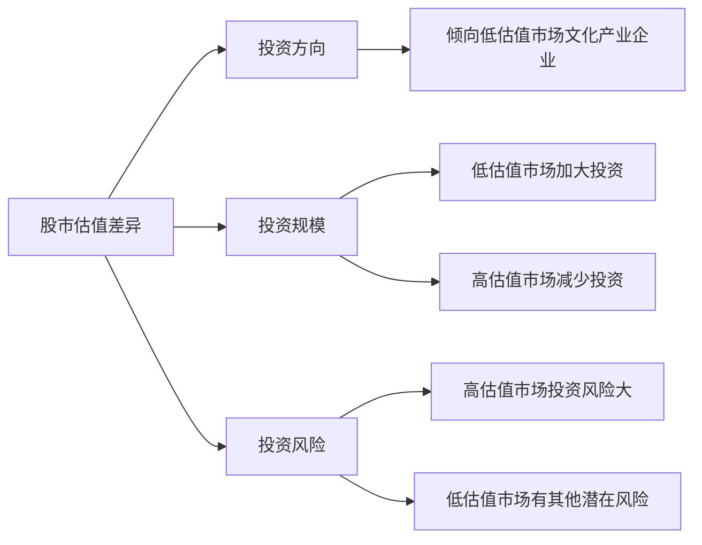

# 股市估值差异对国际文化产业投资的影响

> 关键词：股市估值差异、国际文化产业投资、估值理论、投资策略、市场分析

> 摘要：本文深入探讨了股市估值差异对国际文化产业投资的影响。首先介绍了研究的背景、目的、预期读者等内容，接着阐述了股市估值和国际文化产业投资的核心概念及联系，分析了相关的核心算法原理和数学模型。通过项目实战案例展示了如何在实际中考虑股市估值差异进行投资决策。同时，探讨了其在不同场景下的实际应用，推荐了相关的学习资源、开发工具和论文著作。最后总结了未来发展趋势与挑战，并对常见问题进行了解答。旨在为投资者在国际文化产业投资中更好地应对股市估值差异提供全面的理论和实践指导。

## 1. 背景介绍 
### 1.1 目的和范围
随着全球经济一体化的发展，国际文化产业投资逐渐成为投资者关注的热点领域。股市估值作为衡量股票价值的重要指标，其在不同国家和地区的差异会对国际文化产业投资决策产生深远影响。本研究的目的在于深入分析股市估值差异如何影响国际文化产业投资，包括对投资规模、投资方向、投资风险等方面的影响，并提出相应的投资策略和建议。研究范围涵盖了全球主要文化产业市场，如美国、欧洲、亚洲等地区的股市和文化产业企业。

### 1.2 预期读者
本文的预期读者主要包括专业的投资机构和投资者，他们希望在国际文化产业投资中获取更高的收益并降低风险；文化产业企业的管理者，以便更好地了解资本市场的动态，制定合理的融资和发展战略；以及对金融和文化产业交叉领域感兴趣的研究人员和学者，为他们的研究提供参考和借鉴。

### 1.3 文档结构概述
本文将按照以下结构展开：首先介绍相关的核心概念，包括股市估值和国际文化产业投资的定义、原理和相互关系；接着阐述核心算法原理和具体操作步骤，用 Python 代码进行详细说明；然后介绍相关的数学模型和公式，并通过具体例子进行解释；之后通过项目实战案例展示如何在实际中应用这些理论和方法；再探讨其实际应用场景；推荐相关的工具和资源；最后总结未来发展趋势与挑战，解答常见问题并提供扩展阅读和参考资料。

### 1.4 术语表
#### 1.4.1 核心术语定义
- **股市估值**：是指对股票的内在价值进行评估，通常通过各种估值方法来确定股票价格是否合理，常见的估值方法包括市盈率（P/E）、市净率（P/B）、现金流折现法（DCF）等。
- **国际文化产业投资**：是指投资者跨越国界，对其他国家或地区的文化产业进行的投资活动，包括对文化企业的股权、债权投资，以及对文化项目的直接投资等。
- **估值差异**：是指不同国家或地区股市中，相同或相似类型的文化产业企业在估值水平上的差异，这种差异可能是由于市场环境、经济发展水平、行业政策等多种因素引起的。

#### 1.4.2 相关概念解释
- **文化产业**：是指从事文化产品生产和提供文化服务的经营性行业，包括广播影视、新闻出版、文化艺术、动漫游戏、数字内容等多个领域。
- **投资组合**：是指投资者将资金分散投资于不同的资产或项目，以降低投资风险并实现预期收益的一种投资策略。
- **市场有效性**：是指市场价格能够充分反映所有可用信息的程度，在有效市场中，股票价格能够及时、准确地反映其内在价值。

#### 1.4.3 缩略词列表
- **P/E**：市盈率（Price-to-Earnings Ratio），是指股票价格与每股收益的比率，用于衡量股票的估值水平。
- **P/B**：市净率（Price-to-Book Ratio），是指股票价格与每股净资产的比率，也是常用的估值指标之一。
- **DCF**：现金流折现法（Discounted Cash Flow），是一种通过预测企业未来的现金流，并将其折现到当前的估值方法。

## 2. 核心概念与联系 

### 股市估值的原理
股市估值的核心是确定股票的内在价值，其原理基于企业未来的盈利能力和现金流。不同的估值方法从不同的角度来评估股票的价值：
- **市盈率法（P/E）**：其原理是通过比较股票价格与每股收益，反映投资者为获取每单位收益所愿意支付的价格。计算公式为 $P/E=\frac{股票价格}{每股收益}$。一般来说，市盈率越高，说明市场对该股票的预期越高，但也可能意味着股票被高估。
- **市净率法（P/B）**：该方法通过比较股票价格与每股净资产，衡量股票价格相对于净资产的溢价程度。计算公式为 $P/B=\frac{股票价格}{每股净资产}$。市净率较低的股票可能被低估，但也可能反映企业存在一些潜在问题。
- **现金流折现法（DCF）**：这是一种较为复杂但理论上更为准确的估值方法。它基于企业未来的自由现金流，并将其按照一定的折现率折现到当前，得到企业的内在价值。公式为 $V=\sum_{t=1}^{n}\frac{FCF_t}{(1+r)^t}$，其中 $V$ 是企业的内在价值，$FCF_t$ 是第 $t$ 期的自由现金流，$r$ 是折现率，$n$ 是预测期数。

### 国际文化产业投资的特点
国际文化产业投资具有以下特点：
- **文化差异性**：不同国家和地区的文化背景、消费习惯和审美观念存在很大差异，这会影响文化产品的市场需求和盈利能力。例如，好莱坞电影在全球市场具有广泛的影响力，但一些具有本土特色的文化产品可能在特定地区更受欢迎。
- **政策敏感性**：文化产业往往受到国家政策的严格监管和支持，不同国家的文化政策、税收政策等会对文化产业投资产生重要影响。例如，一些国家为了鼓励文化产业发展，会给予税收优惠、财政补贴等政策支持。
- **技术创新性**：随着科技的不断发展，文化产业与新技术的融合越来越紧密，如虚拟现实、人工智能等技术在文化领域的应用。这要求投资者具备对新技术的敏锐洞察力和判断力，以把握投资机会。

### 股市估值差异与国际文化产业投资的联系
股市估值差异会对国际文化产业投资产生多方面的影响：
- **投资方向**：当不同国家的股市估值存在差异时，投资者会倾向于投资估值较低的市场中的文化产业企业，以获取更高的投资回报。例如，如果美国股市中的文化产业企业估值普遍较高，而亚洲某国家的文化产业企业估值相对较低，投资者可能会将资金投向亚洲市场。
- **投资规模**：估值差异也会影响投资规模。在估值较低的市场，投资者可能会加大投资规模，因为他们认为这些市场中的文化产业企业具有更大的增长潜力和投资价值。相反，在估值较高的市场，投资者可能会减少投资规模，以降低投资风险。
- **投资风险**：股市估值差异还会影响投资风险。如果投资者不考虑估值差异，盲目投资高估值市场中的文化产业企业，可能会面临较大的投资风险，因为这些企业的股价可能已经偏离了其内在价值。而投资低估值市场中的企业也并非没有风险，可能存在市场流动性不足、政策不稳定等问题。

### 文本示意图
```plaintext
股市估值差异
    |
    |--影响投资方向
    |   |--倾向低估值市场文化产业企业
    |
    |--影响投资规模
    |   |--低估值市场加大投资
    |   |--高估值市场减少投资
    |
    |--影响投资风险
        |--高估值市场投资风险大
        |--低估值市场有其他潜在风险
```

### Mermaid 流程图


## 3. 核心算法原理 & 具体操作步骤 

### 市盈率法（P/E）的 Python 实现
```python
def calculate_pe(stock_price, earnings_per_share):
    """
    计算市盈率
    :param stock_price: 股票价格
    :param earnings_per_share: 每股收益
    :return: 市盈率
    """
    if earnings_per_share == 0:
        return float('inf')
    return stock_price / earnings_per_share

# 示例数据
stock_price = 50
earnings_per_share = 2
pe_ratio = calculate_pe(stock_price, earnings_per_share)
print(f"市盈率: {pe_ratio}")
```
### 操作步骤
1. 收集股票价格和每股收益的数据。可以从金融数据提供商（如雅虎财经、彭博等）获取这些数据。
2. 调用 `calculate_pe` 函数，将股票价格和每股收益作为参数传入，计算市盈率。
3. 根据计算得到的市盈率，结合行业平均市盈率和市场情况，判断股票的估值水平。

### 市净率法（P/B）的 Python 实现
```python
def calculate_pb(stock_price, book_value_per_share):
    """
    计算市净率
    :param stock_price: 股票价格
    :param book_value_per_share: 每股净资产
    :return: 市净率
    """
    if book_value_per_share == 0:
        return float('inf')
    return stock_price / book_value_per_share

# 示例数据
stock_price = 50
book_value_per_share = 10
pb_ratio = calculate_pb(stock_price, book_value_per_share)
print(f"市净率: {pb_ratio}")
```
### 操作步骤
1. 收集股票价格和每股净资产的数据。同样可以从金融数据提供商获取。
2. 调用 `calculate_pb` 函数，将股票价格和每股净资产作为参数传入，计算市净率。
3. 参考行业平均市净率，评估股票的估值情况。

### 现金流折现法（DCF）的 Python 实现
```python
def dcf_valuation(free_cash_flows, discount_rate):
    """
    现金流折现法估值
    :param free_cash_flows: 未来各期自由现金流列表
    :param discount_rate: 折现率
    :return: 企业内在价值
    """
    value = 0
    for i, fcf in enumerate(free_cash_flows):
        value += fcf / ((1 + discount_rate) ** (i + 1))
    return value

# 示例数据
free_cash_flows = [100, 120, 150, 180, 200]
discount_rate = 0.1
intrinsic_value = dcf_valuation(free_cash_flows, discount_rate)
print(f"企业内在价值: {intrinsic_value}")
```
### 操作步骤
1. 预测企业未来各期的自由现金流。这需要对企业的业务和财务状况进行深入分析，并结合市场趋势和行业前景进行预测。
2. 确定合适的折现率。折现率通常考虑了无风险利率、市场风险溢价和企业特定风险等因素。
3. 调用 `dcf_valuation` 函数，将自由现金流列表和折现率作为参数传入，计算企业的内在价值。
4. 将计算得到的内在价值与当前股票价格进行比较，判断股票是否被低估或高估。

## 4. 数学模型和公式 & 详细讲解 & 举例说明 

### 市盈率法（P/E）
#### 公式
$P/E=\frac{P}{EPS}$
其中，$P$ 是股票价格，$EPS$ 是每股收益。

#### 详细讲解
市盈率反映了投资者为获取每单位收益所愿意支付的价格。一般来说，市盈率越高，说明市场对该股票的预期越高，但也可能意味着股票被高估。不同行业的市盈率水平可能存在较大差异，因此在使用市盈率进行估值时，需要与同行业的其他企业进行比较。

#### 举例说明
假设某文化产业企业的股票价格为 50 元，每股收益为 2 元，则该股票的市盈率为 $P/E=\frac{50}{2}=25$。如果该行业的平均市盈率为 20，说明该股票的估值相对较高，可能存在一定的泡沫。

### 市净率法（P/B）
#### 公式
$P/B=\frac{P}{BVPS}$
其中，$P$ 是股票价格，$BVPS$ 是每股净资产。

#### 详细讲解
市净率衡量了股票价格相对于净资产的溢价程度。市净率较低的股票可能被低估，但也可能反映企业存在一些潜在问题，如资产质量不佳、盈利能力较弱等。与市盈率一样，市净率也需要与同行业的平均水平进行比较。

#### 举例说明
假设某文化产业企业的股票价格为 50 元，每股净资产为 10 元，则该股票的市净率为 $P/B=\frac{50}{10}=5$。如果该行业的平均市净率为 3，说明该股票的估值相对较高。

### 现金流折现法（DCF）
#### 公式
$V=\sum_{t=1}^{n}\frac{FCF_t}{(1+r)^t}$
其中，$V$ 是企业的内在价值，$FCF_t$ 是第 $t$ 期的自由现金流，$r$ 是折现率，$n$ 是预测期数。

#### 详细讲解
现金流折现法基于企业未来的自由现金流，并将其按照一定的折现率折现到当前，得到企业的内在价值。该方法考虑了企业的长期盈利能力和现金流状况，理论上更为准确。但该方法的缺点是需要对未来的现金流和折现率进行预测，存在一定的不确定性。

#### 举例说明
假设某文化产业企业未来 5 年的自由现金流分别为 100 万元、120 万元、150 万元、180 万元和 200 万元，折现率为 10%。则该企业的内在价值为：
\[
\begin{align*}
V&=\frac{100}{(1 + 0.1)^1}+\frac{120}{(1 + 0.1)^2}+\frac{150}{(1 + 0.1)^3}+\frac{180}{(1 + 0.1)^4}+\frac{200}{(1 + 0.1)^5}\\
&=\frac{100}{1.1}+\frac{120}{1.21}+\frac{150}{1.331}+\frac{180}{1.4641}+\frac{200}{1.61051}\\
&\approx90.91 + 99.17+112.69+122.99+124.18\\
&=549.94
\end{align*}
\]
如果该企业的当前市值为 500 万元，说明该企业的股票可能被低估。

## 5. 项目实战：代码实际案例和详细解释说明 

### 5.1  开发环境搭建
#### 安装 Python
首先需要安装 Python 环境，建议使用 Python 3.7 及以上版本。可以从 Python 官方网站（https://www.python.org/downloads/）下载并安装。

#### 安装必要的库
在本项目中，需要使用 `pandas`、`numpy` 等库进行数据处理和分析，使用 `yfinance` 库获取金融数据。可以使用以下命令进行安装：
```sh
pip install pandas numpy yfinance
```

### 5.2  源代码详细实现和代码解读
```python
import yfinance as yf
import pandas as pd

# 定义股票代码列表，这里以美国几家知名文化产业企业为例
stock_symbols = ['DIS', 'NFLX', 'AMZN']

# 获取股票数据
data = yf.download(stock_symbols, start='2020-01-01', end='2023-01-01')

# 提取收盘价和每股收益数据
close_prices = data['Close']
# 这里假设每股收益数据可以通过其他途径获取，为了简化示例，使用随机生成的数据
import numpy as np
eps_data = pd.DataFrame(np.random.rand(len(close_prices), len(stock_symbols)),
                        index=close_prices.index, columns=stock_symbols)

# 计算市盈率
pe_ratios = close_prices / eps_data

# 打印结果
print("市盈率数据：")
print(pe_ratios)

# 分析市盈率差异
mean_pe = pe_ratios.mean()
print("\n平均市盈率：")
print(mean_pe)
```

### 代码解读与分析
1. **导入必要的库**：`yfinance` 用于获取金融数据，`pandas` 用于数据处理和分析。
2. **定义股票代码列表**：选择了美国几家知名文化产业企业的股票代码，如迪士尼（DIS）、Netflix（NFLX）和亚马逊（AMZN）。
3. **获取股票数据**：使用 `yfinance` 的 `download` 函数获取指定时间段内的股票数据。
4. **提取收盘价和每股收益数据**：从获取的数据中提取收盘价，每股收益数据为了简化示例使用随机生成的数据，实际应用中需要从可靠的数据源获取。
5. **计算市盈率**：将收盘价除以每股收益，得到市盈率数据。
6. **分析市盈率差异**：计算每家企业的平均市盈率，通过比较平均市盈率可以分析不同企业之间的估值差异。

通过以上代码，我们可以对不同文化产业企业的股市估值差异进行初步分析，为投资决策提供参考。

## 6. 实际应用场景 
### 跨国投资决策
投资者在进行国际文化产业投资时，可以利用股市估值差异来选择投资目标。例如，当美国股市中的文化产业企业估值普遍较高，而亚洲某国家的文化产业企业估值相对较低时，投资者可以考虑将资金投向亚洲市场。通过比较不同国家和地区的股市估值，投资者可以找到被低估的文化产业企业，从而获取更高的投资回报。

### 企业并购与重组
在国际文化产业的并购与重组活动中，股市估值差异也起着重要作用。如果一家企业所在国家的股市估值较高，而目标企业所在国家的股市估值较低，那么该企业可能会选择并购目标企业，以实现资源整合和价值提升。例如，一家美国的大型传媒集团可能会收购一家亚洲的小型文化创意企业，以获取其独特的创意和市场渠道。

### 风险控制
股市估值差异还可以用于风险控制。投资者可以通过分散投资于不同估值水平的市场和企业，降低投资组合的整体风险。例如，同时投资于高估值市场中的优质文化产业企业和低估值市场中的潜力企业，当高估值市场出现回调时，低估值市场的投资可能会起到一定的缓冲作用。

### 行业分析与研究
研究机构和学者可以利用股市估值差异来分析不同国家和地区文化产业的发展状况和趋势。通过比较不同市场的估值水平，可以了解文化产业在不同地区的竞争力和发展潜力，为政策制定和行业发展提供参考。

## 7. 工具和资源推荐
### 7.1 学习资源推荐
#### 7.1.1 书籍推荐
- 《证券分析》（Security Analysis）：由本杰明·格雷厄姆（Benjamin Graham）和大卫·多德（David Dodd）所著，是价值投资领域的经典著作，详细介绍了股票估值的基本方法和原理。
- 《聪明的投资者》（The Intelligent Investor）：同样是本杰明·格雷厄姆的作品，为投资者提供了实用的投资策略和风险控制方法。
- 《文化产业商业模式与投资战略》：深入探讨了文化产业的商业模式和投资策略，对国际文化产业投资具有重要的指导意义。

#### 7.1.2 在线课程
- Coursera 上的“Financial Markets”课程：由耶鲁大学教授罗伯特·席勒（Robert Shiller）主讲，介绍了金融市场的基本原理和投资分析方法。
- edX 上的“Investment Management”课程：提供了系统的投资管理知识，包括资产估值、投资组合构建等内容。

#### 7.1.3 技术博客和网站
- Seeking Alpha：是一个专业的金融投资博客平台，提供了大量关于股票估值、投资分析和市场评论的文章。
- Investopedia：是一个知名的金融教育网站，提供了丰富的金融术语解释、投资教程和市场分析工具。

### 7.2 开发工具框架推荐
#### 7.2.1 IDE和编辑器
- PyCharm：是一款专业的 Python 集成开发环境，提供了丰富的代码编辑、调试和分析功能，适合进行金融数据分析和算法实现。
- Jupyter Notebook：是一个交互式的开发环境，支持 Python 等多种编程语言，方便进行数据可视化和模型验证。

#### 7.2.2 调试和性能分析工具
- pdb：是 Python 自带的调试工具，可以帮助开发者定位代码中的问题和错误。
- cProfile：是 Python 的性能分析工具，可以分析代码的运行时间和资源消耗情况，帮助优化代码性能。

#### 7.2.3 相关框架和库
- pandas：是一个强大的数据处理和分析库，提供了丰富的数据结构和函数，方便进行金融数据的清洗、整理和分析。
- numpy：是 Python 的数值计算库，提供了高效的数组和矩阵运算功能，在金融数据分析中广泛应用。
- scikit-learn：是一个机器学习库，提供了多种机器学习算法和工具，可用于股票价格预测、投资组合优化等任务。

### 7.3 相关论文著作推荐
#### 7.3.1 经典论文
- “The Capital Asset Pricing Model: Theory and Evidence”：由 Eugene F. Fama 和 Kenneth R. French 所著，对资本资产定价模型进行了深入研究和实证分析。
- “Market Efficiency, Long-Term Returns, and Behavioral Finance”：由 Richard Thaler 所著，探讨了市场有效性和行为金融学的相关问题。

#### 7.3.2 最新研究成果
- 关注顶级金融学术期刊，如《Journal of Finance》、《Review of Financial Studies》等，这些期刊上发表了许多关于股市估值、投资决策和市场分析的最新研究成果。

#### 7.3.3 应用案例分析
- 可以参考一些专业的金融研究报告和案例分析书籍，了解股市估值差异在国际文化产业投资中的实际应用案例和经验教训。

## 8. 总结：未来发展趋势与挑战
### 未来发展趋势
#### 全球化趋势加强
随着全球经济一体化的深入发展，国际文化产业投资的全球化趋势将进一步加强。投资者将更加关注不同国家和地区的文化产业市场，利用股市估值差异进行跨国投资和资产配置。

#### 技术创新推动
科技的不断创新将为国际文化产业投资带来新的机遇和挑战。例如，虚拟现实、人工智能、区块链等技术的应用将改变文化产业的商业模式和市场格局，投资者需要关注这些技术创新对文化产业企业估值的影响。

#### 政策环境优化
越来越多的国家和地区将出台支持文化产业发展的政策，优化投资环境。这将吸引更多的投资者进入国际文化产业市场，进一步促进文化产业的发展和繁荣。

### 挑战
#### 市场不确定性增加
全球政治经济形势的不确定性增加，如贸易摩擦、地缘政治冲突等，将对国际文化产业投资产生不利影响。股市估值差异也可能受到这些因素的影响而变得更加复杂和难以预测。

#### 文化差异与风险
不同国家和地区的文化差异仍然是国际文化产业投资面临的重要挑战。投资者需要深入了解当地的文化背景和市场需求，避免因文化差异导致的投资失败。

#### 数据质量和信息不对称
在国际文化产业投资中，数据质量和信息不对称问题较为突出。不同国家和地区的金融数据标准和披露要求存在差异，投资者可能难以获取准确和及时的信息，从而影响投资决策的准确性。

## 9. 附录：常见问题与解答
### 问：股市估值差异的主要原因是什么？
答：股市估值差异的主要原因包括市场环境、经济发展水平、行业政策、投资者情绪等。不同国家和地区的市场环境和经济发展水平不同，会导致文化产业企业的盈利能力和成长潜力存在差异，从而影响其估值水平。行业政策的不同也会对文化产业的发展产生重要影响，进而影响企业的估值。此外，投资者情绪的波动也会导致股市估值的差异。

### 问：如何判断股市估值差异是否合理？
答：可以通过比较不同市场的估值指标（如市盈率、市净率等）与历史数据和行业平均水平，来判断股市估值差异是否合理。同时，还需要考虑市场的基本面因素，如经济增长、企业盈利能力、行业发展前景等。如果估值差异过大，且与基本面因素不相符，可能意味着存在估值泡沫或低估的情况。

### 问：在国际文化产业投资中，如何利用股市估值差异降低风险？
答：可以通过分散投资于不同估值水平的市场和企业，降低投资组合的整体风险。同时，需要对投资目标进行深入的研究和分析，了解其基本面情况和发展前景，避免盲目投资高估值市场中的企业。此外，还可以利用风险管理工具，如期权、期货等，对冲投资风险。

### 问：股市估值差异对文化产业企业的融资有什么影响？
答：股市估值差异会影响文化产业企业的融资成本和融资规模。在估值较高的市场，企业可以以较高的价格发行股票或债券，从而降低融资成本，扩大融资规模。相反，在估值较低的市场，企业的融资成本可能会较高，融资规模也可能受到限制。

## 10. 扩展阅读 & 参考资料
### 扩展阅读
- 《金融炼金术》（The Alchemy of Finance）：乔治·索罗斯（George Soros）的著作，探讨了金融市场的运行规律和投资者的心理行为。
- 《黑天鹅》（The Black Swan）：纳西姆·尼古拉斯·塔勒布（Nassim Nicholas Taleb）的作品，介绍了极端事件对金融市场的影响和应对策略。

### 参考资料
- 雅虎财经（https://finance.yahoo.com/）：提供全球金融市场的实时数据和新闻资讯。
- 彭博社（https://www.bloomberg.com/）：是全球知名的金融信息提供商，提供全面的金融数据、分析和研究报告。
- 联合国教科文组织（https://en.unesco.org/）：发布了许多关于文化产业发展的报告和研究成果，为国际文化产业投资提供了重要的参考依据。

作者：AI天才研究院/AI Genius Institute & 禅与计算机程序设计艺术 /Zen And The Art of Computer Programming