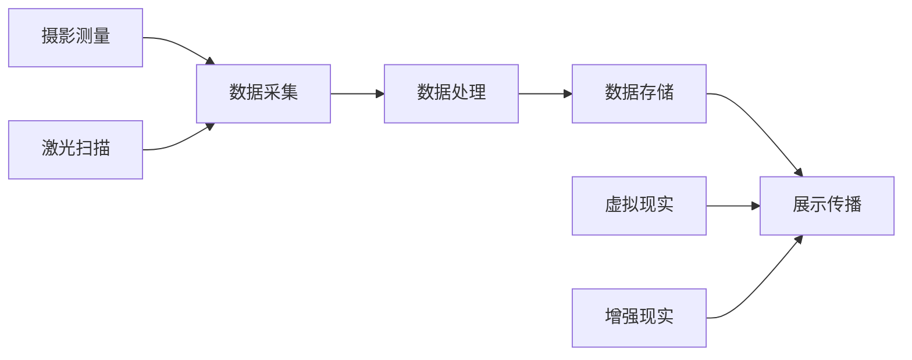

# 股市估值差异对国际文化遗产数字化保护的影响

> 关键词：股市估值差异、国际文化遗产、数字化保护、资金流动、市场信心

> 摘要：本文深入探讨了股市估值差异对国际文化遗产数字化保护的多方面影响。从股市估值差异的基本概念出发，阐述其与文化遗产数字化保护在资金供给、市场信心等方面的联系。详细分析了核心算法原理、数学模型，结合实际案例说明其影响机制。通过项目实战展示相关技术在文化遗产数字化保护中的应用。同时探讨了该领域的实际应用场景、推荐了相关工具和资源。最后总结了未来发展趋势与挑战，并对常见问题进行解答，为进一步研究和实践提供全面的参考。

## 1. 背景介绍 
### 1.1 目的和范围
本研究旨在全面探究股市估值差异对国际文化遗产数字化保护的影响。具体范围包括分析不同国家和地区股市估值差异的表现形式，研究这种差异如何影响文化遗产数字化保护项目的资金获取、市场参与度以及技术创新等方面。通过深入研究，为文化遗产保护机构、投资者和政策制定者提供决策依据，促进国际文化遗产数字化保护工作的可持续发展。

### 1.2 预期读者
本文预期读者包括文化遗产保护领域的专业人士，如博物馆馆长、文化遗产研究员等；金融领域的投资者、分析师；政府文化部门的政策制定者；以及对文化遗产数字化保护和金融市场感兴趣的研究人员和学生。

### 1.3 文档结构概述
本文首先介绍背景信息，包括目的、预期读者和文档结构。接着阐述核心概念与联系，分析股市估值差异和国际文化遗产数字化保护的原理及相互关系。然后讲解核心算法原理和具体操作步骤，给出相关数学模型和公式。通过项目实战展示实际应用案例并进行代码解读。之后探讨实际应用场景，推荐相关工具和资源。最后总结未来发展趋势与挑战，解答常见问题并提供扩展阅读和参考资料。

### 1.4 术语表
#### 1.4.1 核心术语定义
- **股市估值差异**：指不同股票市场或同一市场中不同股票在估值水平上的差异，通常通过市盈率、市净率等指标衡量。
- **国际文化遗产数字化保护**：运用数字化技术对国际范围内的文化遗产进行记录、保存、修复和展示的过程。

#### 1.4.2 相关概念解释
- **数字化技术**：包括摄影测量、三维建模、虚拟现实、增强现实等技术，用于获取、处理和展示文化遗产的数字信息。
- **市场信心**：投资者对股票市场和相关投资项目的信心程度，受股市估值等多种因素影响。

#### 1.4.3 缩略词列表
- **PE**：市盈率（Price-to-Earnings Ratio）
- **PB**：市净率（Price-to-Book Ratio）

## 2. 核心概念与联系 
### 2.1 股市估值差异原理
股市估值是对股票价值的评估，常见的估值方法有市盈率法、市净率法等。市盈率 $PE$ 计算公式为：
$$PE = \frac{股票价格}{每股收益}$$
市净率 $PB$ 计算公式为：
$$PB = \frac{股票价格}{每股净资产}$$
不同国家和地区的股市由于经济发展水平、政策环境、行业结构等因素的不同，会出现估值差异。例如，新兴市场国家的股市可能由于经济增长潜力大，市盈率相对较高；而成熟市场国家的股市估值可能相对稳定。

### 2.2 国际文化遗产数字化保护原理
国际文化遗产数字化保护主要通过数字化技术对文化遗产进行数据采集、处理和存储。首先利用摄影测量、激光扫描等技术获取文化遗产的三维数据，然后进行数据处理和修复，最后通过虚拟现实、增强现实等技术进行展示和传播。其架构可以用以下示意图表示：



### 2.3 股市估值差异与国际文化遗产数字化保护的联系
股市估值差异会通过多种方式影响国际文化遗产数字化保护。一方面，高估值股市的企业和投资者可能更有资金和意愿参与文化遗产数字化保护项目，提供更多的资金支持。另一方面，股市估值差异也会影响市场信心，进而影响文化遗产数字化保护项目的融资难度和市场参与度。例如，当股市估值较高时，投资者对市场前景乐观，更愿意投资文化遗产数字化保护相关的创新项目。

## 3. 核心算法原理 & 具体操作步骤 
### 3.1 股市估值差异计算算法
以下是使用 Python 计算市盈率和市净率的示例代码：

```python
def calculate_pe(stock_price, earnings_per_share):
    """
    计算市盈率
    :param stock_price: 股票价格
    :param earnings_per_share: 每股收益
    :return: 市盈率
    """
    if earnings_per_share == 0:
        return float('inf')
    return stock_price / earnings_per_share

def calculate_pb(stock_price, book_value_per_share):
    """
    计算市净率
    :param stock_price: 股票价格
    :param book_value_per_share: 每股净资产
    :return: 市净率
    """
    if book_value_per_share == 0:
        return float('inf')
    return stock_price / book_value_per_share

# 示例数据
stock_price = 50
earnings_per_share = 5
book_value_per_share = 10

pe = calculate_pe(stock_price, earnings_per_share)
pb = calculate_pb(stock_price, book_value_per_share)

print(f"市盈率: {pe}")
print(f"市净率: {pb}")
```

### 3.2 具体操作步骤
1. **数据收集**：收集不同股票的价格、每股收益和每股净资产等数据。可以通过金融数据提供商、证券交易所网站等渠道获取。
2. **计算估值指标**：使用上述算法计算市盈率和市净率。
3. **分析估值差异**：比较不同股票或不同市场的估值指标，分析估值差异的原因和趋势。

## 4. 数学模型和公式 & 详细讲解 & 举例说明 
### 4.1 股市估值差异模型
假设我们有两个股票市场 $A$ 和 $B$，市场 $A$ 的平均市盈率为 $PE_A$，市场 $B$ 的平均市盈率为 $PE_B$，则两市的市盈率差异 $\Delta PE$ 为：
$$\Delta PE = PE_A - PE_B$$
同理，市净率差异 $\Delta PB$ 为：
$$\Delta PB = PB_A - PB_B$$

### 4.2 资金流动模型
假设股市估值差异会影响资金在不同市场和文化遗产数字化保护项目之间的流动。设 $F$ 为流向文化遗产数字化保护项目的资金，$PE_d$ 为相关股票的市盈率差异，$k$ 为资金流动系数，则资金流动模型可以表示为：
$$F = k \times PE_d$$
当 $PE_d$ 为正且较大时，意味着相关股票在高估值市场，可能会吸引更多资金流向文化遗产数字化保护项目。

### 4.3 举例说明
假设市场 $A$ 的平均市盈率 $PE_A = 20$，市场 $B$ 的平均市盈率 $PE_B = 15$，则 $\Delta PE = 20 - 15 = 5$。如果资金流动系数 $k = 100$ 万元/市盈率单位，那么由于市盈率差异可能会有 $F = 100 \times 5 = 500$ 万元的资金流向文化遗产数字化保护项目。

## 5. 项目实战：代码实际案例和详细解释说明 
### 5.1  开发环境搭建
- **操作系统**：推荐使用 Windows 10、Linux（如 Ubuntu）或 macOS。
- **编程语言**：Python 3.7 及以上版本。
- **开发工具**：推荐使用 PyCharm 作为集成开发环境（IDE）。
- **依赖库**：安装 pandas、numpy 等库，用于数据处理和分析。可以使用以下命令进行安装：
```sh
pip install pandas numpy
```

### 5.2  源代码详细实现和代码解读
以下是一个简单的项目示例，用于分析不同股市的估值差异对文化遗产数字化保护项目资金投入的影响：

```python
import pandas as pd

# 模拟不同股市的估值数据
data = {
    'Market': ['A', 'B', 'C'],
    'PE': [20, 15, 18],
    'PB': [2.5, 2, 2.2],
    'Funding': [0, 0, 0]  # 初始资金投入为 0
}

df = pd.DataFrame(data)

# 定义资金流动系数
k = 100

# 以市场 A 为基准，计算市盈率差异并更新资金投入
base_pe = df[df['Market'] == 'A']['PE'].values[0]
for index, row in df.iterrows():
    pe_difference = row['PE'] - base_pe
    df.at[index, 'Funding'] = k * pe_difference

print(df)
```

### 5.3  代码解读与分析
1. **数据模拟**：使用 `pandas` 库创建一个包含不同股市估值数据的 DataFrame，包括市场名称、市盈率、市净率和初始资金投入。
2. **定义资金流动系数**：设定资金流动系数 $k$，用于计算由于市盈率差异导致的资金流动。
3. **计算市盈率差异和资金投入**：以市场 $A$ 为基准，计算其他市场与市场 $A$ 的市盈率差异，并根据资金流动模型更新资金投入。
4. **输出结果**：打印包含更新后资金投入的 DataFrame，以便分析不同股市估值差异对资金投入的影响。

## 6. 实际应用场景 
### 6.1 资金募集
文化遗产数字化保护项目通常需要大量资金，股市估值差异可以影响资金的募集。高估值股市的企业和投资者可能更愿意为文化遗产数字化保护项目提供资金，例如通过股权投资、捐赠等方式。

### 6.2 技术创新合作
不同国家和地区的股市估值差异可能导致技术创新资源的不平衡。高估值股市地区的企业可能有更多资金投入研发，与文化遗产保护机构开展技术创新合作，推动数字化保护技术的发展。

### 6.3 市场推广
股市估值差异也会影响文化遗产数字化保护项目的市场推广。在高估值股市地区，由于市场信心较高，项目更容易获得媒体关注和公众支持，从而提高项目的知名度和影响力。

## 7. 工具和资源推荐
### 7.1 学习资源推荐
#### 7.1.1 书籍推荐
- 《金融市场与金融机构》：全面介绍金融市场的基本概念和运作机制，有助于理解股市估值差异的原理。
- 《文化遗产数字化保护技术》：详细阐述文化遗产数字化保护的技术方法和应用案例。

#### 7.1.2 在线课程
- Coursera 上的“金融市场分析”课程：提供深入的金融市场分析知识，包括股市估值方法。
- edX 上的“文化遗产数字化保护导论”课程：介绍文化遗产数字化保护的基本原理和技术。

#### 7.1.3 技术博客和网站
- 金融界网站：提供丰富的金融市场资讯和分析报告，有助于了解股市估值动态。
- 中国文化遗产网：发布文化遗产保护领域的最新政策、技术和研究成果。

### 7.2 开发工具框架推荐
#### 7.2.1 IDE和编辑器
- PyCharm：功能强大的 Python 集成开发环境，提供代码编辑、调试、版本控制等功能。
- Visual Studio Code：轻量级的代码编辑器，支持多种编程语言和插件扩展。

#### 7.2.2 调试和性能分析工具
- pdb：Python 自带的调试器，用于调试 Python 代码。
- cProfile：Python 标准库中的性能分析工具，用于分析代码的性能瓶颈。

#### 7.2.3 相关框架和库
- pandas：用于数据处理和分析的 Python 库，提供高效的数据结构和数据分析工具。
- numpy：用于科学计算的 Python 库，提供多维数组对象和各种数学函数。

### 7.3 相关论文著作推荐
#### 7.3.1 经典论文
- Fama, E. F., & French, K. R. (1992). The cross-section of expected stock returns. Journal of Finance, 47(2), 427-465. 该论文提出了著名的 Fama-French 三因子模型，对股市估值研究有重要影响。
- UNESCO. (2003). Convention for the Safeguarding of the Intangible Cultural Heritage. 联合国教科文组织关于非物质文化遗产保护的重要文件，为文化遗产数字化保护提供了政策指导。

#### 7.3.2 最新研究成果
- 关注《Journal of Financial Economics》《Heritage Science》等学术期刊，获取股市估值和文化遗产保护领域的最新研究成果。

#### 7.3.3 应用案例分析
- 分析国内外文化遗产数字化保护项目的成功案例，如故宫博物院的数字化展示项目、敦煌莫高窟的数字化保护工程等，了解实际应用中的经验和挑战。

## 8. 总结：未来发展趋势与挑战
### 8.1 未来发展趋势
- **跨领域融合加深**：股市估值与文化遗产数字化保护的联系将更加紧密，金融市场将为文化遗产保护提供更多创新的融资模式和投资机会。
- **技术创新加速**：随着数字化技术的不断发展，如人工智能、区块链等技术将在文化遗产数字化保护中得到更广泛的应用，提高保护效率和质量。
- **国际合作加强**：国际间在文化遗产数字化保护方面的合作将不断加强，共同应对全球性的文化遗产保护挑战。

### 8.2 挑战
- **市场不确定性**：股市估值受多种因素影响，具有较大的不确定性，可能导致文化遗产数字化保护项目的资金来源不稳定。
- **技术标准不统一**：不同国家和地区在文化遗产数字化保护技术标准和规范方面存在差异，增加了国际合作的难度。
- **文化差异**：不同文化背景下的文化遗产保护需求和价值观不同，需要在保护过程中充分考虑文化差异，避免文化冲突。

## 9. 附录：常见问题与解答
### 9.1 股市估值差异如何具体影响文化遗产数字化保护项目的资金获取？
股市估值差异主要通过影响投资者的资金分配决策来影响文化遗产数字化保护项目的资金获取。在高估值股市中，投资者的资产增值较快，可能更有资金和意愿投资文化遗产数字化保护项目。此外，高估值股市也会吸引更多的机构投资者和风险资本，这些资金可能会流向与文化遗产相关的创新项目。

### 9.2 如何衡量股市估值差异对文化遗产数字化保护的影响程度？
可以通过建立数学模型，如资金流动模型，来衡量股市估值差异对文化遗产数字化保护的影响程度。同时，可以结合实际案例，分析不同股市估值情况下文化遗产数字化保护项目的资金投入、技术创新和市场推广等方面的变化，从而综合评估影响程度。

### 9.3 文化遗产数字化保护项目如何应对股市估值差异带来的不确定性？
文化遗产数字化保护项目可以采取多元化的融资策略，除了依赖股市投资外，还可以争取政府补贴、社会捐赠、企业赞助等多种资金来源。同时，项目团队应加强风险管理，合理规划资金使用，提高项目的抗风险能力。

## 10. 扩展阅读 & 参考资料
### 10.1 扩展阅读
- 《数字时代的文化遗产保护》：探讨数字技术在文化遗产保护中的应用和发展趋势。
- 《金融与文化产业发展》：研究金融市场与文化产业的相互关系和协同发展。

### 10.2 参考资料
- 金融数据提供商：如 Bloomberg、Wind 等，提供准确的股市估值数据。
- 国际文化遗产保护组织：如 UNESCO、ICOMOS 等，发布文化遗产保护的政策和研究报告。

作者：AI天才研究院/AI Genius Institute & 禅与计算机程序设计艺术 /Zen And The Art of Computer Programming