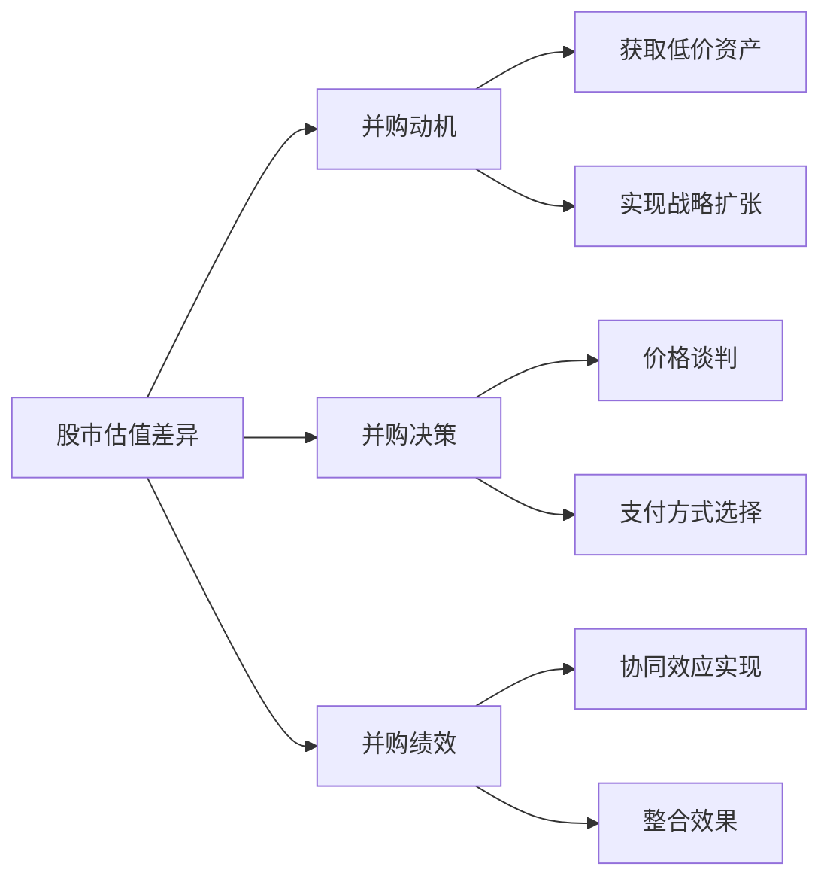

# 股市估值差异对跨境并购活动的影响

> 关键词：股市估值差异、跨境并购活动、估值理论、并购动机、经济效应

> 摘要：本文旨在深入探讨股市估值差异对跨境并购活动的影响。通过详细阐述股市估值和跨境并购的核心概念，分析两者之间的内在联系，介绍相关核心算法原理和数学模型。结合实际案例，研究股市估值差异在跨境并购中的具体表现和作用机制。同时，探讨其在不同场景下的应用，并推荐相关学习资源、开发工具和研究论文。最后，总结未来发展趋势与挑战，为解决常见问题提供参考，以期为相关领域的研究和实践提供有价值的见解。

## 1. 背景介绍 
### 1.1 目的和范围
随着经济全球化的不断推进，跨境并购已经成为企业实现国际化战略、拓展市场、获取资源的重要手段。股市作为经济的重要组成部分，其估值差异在跨境并购活动中扮演着关键角色。本研究的目的在于全面深入地分析股市估值差异如何影响跨境并购活动，包括对并购动机、并购决策、并购绩效等方面的影响。研究范围涵盖不同国家和地区的股市，以及各种行业的跨境并购案例，旨在揭示普遍存在的规律和特殊情况。

### 1.2 预期读者
本文预期读者包括金融领域的研究人员、企业管理人员、投资银行家、证券分析师以及对跨境并购和股市估值感兴趣的学生和专业人士。对于研究人员，本文提供了深入的理论分析和实证研究案例；对于企业管理人员，有助于他们在制定跨境并购战略时考虑股市估值差异因素；对于投资银行家和证券分析师，可作为评估跨境并购项目的参考；对于学生和专业人士，是了解相关领域知识的重要资料。

### 1.3 文档结构概述
本文首先介绍背景信息，包括目的、预期读者和文档结构。接着阐述股市估值和跨境并购的核心概念及其联系，通过文本示意图和 Mermaid 流程图进行直观展示。然后讲解核心算法原理和数学模型，并给出具体操作步骤和实例。随后进行项目实战，包括开发环境搭建、源代码实现和代码解读。之后探讨股市估值差异在实际应用场景中的表现。推荐相关的学习资源、开发工具和研究论文。最后总结未来发展趋势与挑战，解答常见问题，并提供扩展阅读和参考资料。

### 1.4 术语表
#### 1.4.1 核心术语定义
- **股市估值**：是指对股票市场中上市公司的价值进行评估的过程和结果。它反映了市场参与者对公司未来盈利能力、资产质量、行业前景等因素的综合判断。常见的估值方法包括市盈率法、市净率法、现金流折现法等。
- **跨境并购**：指企业跨越国界，通过收购、合并等方式获取其他国家企业的控制权或部分股权的商业行为。跨境并购可以帮助企业实现资源整合、市场拓展、技术引进等战略目标。
- **估值差异**：在跨境并购中，估值差异是指不同国家或地区股市对同一行业或类似企业的估值水平存在的差异。这种差异可能由于宏观经济环境、市场制度、投资者偏好等多种因素引起。

#### 1.4.2 相关概念解释
- **协同效应**：在跨境并购中，协同效应是指并购后企业整体价值大于并购前各企业价值之和的现象。协同效应可以来自于经营协同、财务协同和管理协同等方面。例如，通过整合供应链、共享技术和市场渠道等实现经营协同；通过优化资本结构、降低融资成本等实现财务协同；通过引入先进的管理经验和制度等实现管理协同。
- **文化差异**：由于不同国家和地区具有不同的文化背景、价值观和商业习惯，跨境并购中可能会面临文化差异带来的挑战。文化差异可能影响企业的整合过程、员工的工作积极性和团队合作效率等。因此，在跨境并购中需要充分考虑文化差异因素，并采取相应的措施进行文化整合。

#### 1.4.3 缩略词列表
- **PE**：市盈率（Price-to-Earnings Ratio），是指股票价格与每股收益的比率，用于衡量股票的估值水平。
- **PB**：市净率（Price-to-Book Ratio），是指股票价格与每股净资产的比率，反映了市场对公司净资产的估值。
- **DCF**：现金流折现法（Discounted Cash Flow），是一种通过预测企业未来现金流并将其折现到当前的估值方法。

## 2. 核心概念与联系 

### 股市估值核心原理
股市估值是基于对上市公司未来盈利能力和资产价值的预期进行的。其核心原理在于综合考虑公司的财务状况、行业前景、宏观经济环境等因素，运用各种估值方法来确定公司的合理价值。常见的估值方法及其原理如下：
- **市盈率法（PE）**：市盈率是股票价格与每股收益的比值。其原理是通过比较不同公司的市盈率，判断股票的相对估值水平。一般来说，市盈率越高，说明市场对公司未来盈利增长的预期越高。公式为：$PE = \frac{P}{EPS}$，其中 $P$ 为股票价格，$EPS$ 为每股收益。
- **市净率法（PB）**：市净率是股票价格与每股净资产的比值。该方法基于公司的净资产价值来评估股票的价值。市净率越低，说明股票相对于净资产的估值越低，可能具有一定的投资价值。公式为：$PB = \frac{P}{BVPS}$，其中 $P$ 为股票价格，$BVPS$ 为每股净资产。
- **现金流折现法（DCF）**：现金流折现法是一种基于未来现金流的估值方法。其原理是将公司未来的自由现金流按照一定的折现率折现到当前，得到公司的内在价值。公式为：$V = \sum_{t=1}^{n} \frac{FCF_t}{(1 + r)^t}$，其中 $V$ 为公司内在价值，$FCF_t$ 为第 $t$ 期的自由现金流，$r$ 为折现率，$n$ 为预测期数。

### 跨境并购核心原理
跨境并购是企业实现国际化战略的重要手段，其核心原理在于通过整合资源、实现协同效应来提升企业的竞争力和价值。跨境并购的主要动机包括：
- **市场拓展**：企业通过并购进入新的市场，扩大市场份额，提高市场竞争力。例如，一家中国企业并购一家美国企业，可以借助美国企业的销售渠道和品牌影响力，快速进入美国市场。
- **资源获取**：企业通过并购获取目标企业的资源，如技术、人才、原材料等。例如，一家科技企业并购另一家拥有先进技术的企业，可以提升自身的技术水平和创新能力。
- **协同效应**：如前文所述，协同效应是跨境并购的重要目标之一。通过整合双方的业务、管理和财务等方面，实现成本降低、收入增加等协同效应，提升企业的整体价值。

### 股市估值差异与跨境并购的联系
股市估值差异对跨境并购活动有着重要的影响，主要体现在以下几个方面：
- **并购动机**：当目标企业所在国家的股市估值较低，而收购企业所在国家的股市估值较高时，收购企业可能会出于获取低价资产的动机进行跨境并购。例如，在金融危机期间，一些发达国家的股市估值大幅下降，而新兴市场国家的股市相对稳定，新兴市场国家的企业可能会趁机并购发达国家的企业。
- **并购决策**：股市估值差异会影响收购企业的并购决策。如果估值差异较大，收购企业可能会认为并购具有较高的性价比，从而更倾向于进行并购。同时，估值差异也会影响并购的价格谈判和支付方式选择。例如，当收购企业的股市估值较高时，它可能更愿意采用换股的方式进行并购。
- **并购绩效**：股市估值差异对并购绩效也有一定的影响。如果收购企业能够合理利用估值差异，实现协同效应，那么并购可能会提升企业的绩效。反之，如果收购企业高估了协同效应，或者在并购后整合不力，那么并购可能会导致企业绩效下降。

### 文本示意图
```plaintext
股市估值差异
    |
    |-- 影响并购动机
    |       |-- 获取低价资产
    |       |-- 实现战略扩张
    |
    |-- 影响并购决策
    |       |-- 价格谈判
    |       |-- 支付方式选择
    |
    |-- 影响并购绩效
            |-- 协同效应实现
            |-- 整合效果
```

### Mermaid 流程图


## 3. 核心算法原理 & 具体操作步骤 

### 市盈率法计算股市估值差异及对并购的影响分析

#### 核心算法原理
市盈率法计算股市估值差异的核心在于比较不同国家或地区同一行业或类似企业的市盈率。假设我们有两个国家的企业，国家 A 和国家 B，企业 A 和企业 B 属于同一行业。我们可以通过以下步骤计算市盈率差异：
1. 计算企业 A 的市盈率 $PE_A = \frac{P_A}{EPS_A}$，其中 $P_A$ 为企业 A 的股票价格，$EPS_A$ 为企业 A 的每股收益。
2. 计算企业 B 的市盈率 $PE_B = \frac{P_B}{EPS_B}$，其中 $P_B$ 为企业 B 的股票价格，$EPS_B$ 为企业 B 的每股收益。
3. 计算市盈率差异 $\Delta PE = PE_A - PE_B$。

#### Python 源代码实现
```python
def calculate_pe(price, eps):
    """
    计算市盈率
    :param price: 股票价格
    :param eps: 每股收益
    :return: 市盈率
    """
    return price / eps

def calculate_pe_difference(price_a, eps_a, price_b, eps_b):
    """
    计算两个企业的市盈率差异
    :param price_a: 企业 A 的股票价格
    :param eps_a: 企业 A 的每股收益
    :param price_b: 企业 B 的股票价格
    :param eps_b: 企业 B 的每股收益
    :return: 市盈率差异
    """
    pe_a = calculate_pe(price_a, eps_a)
    pe_b = calculate_pe(price_b, eps_b)
    return pe_a - pe_b

# 示例数据
price_a = 50
eps_a = 2
price_b = 40
eps_b = 1.5

pe_difference = calculate_pe_difference(price_a, eps_a, price_b, eps_b)
print(f"市盈率差异: {pe_difference}")
```

#### 具体操作步骤
1. 收集数据：收集目标企业和收购企业所在国家或地区同一行业或类似企业的股票价格和每股收益数据。可以通过金融数据库、证券交易所网站等渠道获取数据。
2. 计算市盈率：使用上述 Python 代码中的 `calculate_pe` 函数分别计算目标企业和收购企业的市盈率。
3. 计算市盈率差异：使用 `calculate_pe_difference` 函数计算两者的市盈率差异。
4. 分析影响：根据市盈率差异的大小和正负，分析其对跨境并购的动机、决策和绩效的影响。例如，如果市盈率差异较大且收购企业的市盈率高于目标企业，那么收购企业可能有更强的动机进行并购。

### 现金流折现法评估目标企业价值及并购可行性分析

#### 核心算法原理
现金流折现法评估目标企业价值的核心是预测企业未来的自由现金流，并将其折现到当前。具体步骤如下：
1. 预测未来自由现金流：根据目标企业的历史财务数据、行业发展趋势和市场环境等因素，预测企业未来 $n$ 期的自由现金流 $FCF_t$。
2. 确定折现率：折现率反映了资金的时间价值和投资风险。一般可以使用加权平均资本成本（WACC）作为折现率。
3. 计算企业内在价值：使用公式 $V = \sum_{t=1}^{n} \frac{FCF_t}{(1 + r)^t}$ 计算企业的内在价值。

#### Python 源代码实现
```python
def calculate_dcf(fcf_list, discount_rate):
    """
    计算现金流折现价值
    :param fcf_list: 未来自由现金流列表
    :param discount_rate: 折现率
    :return: 企业内在价值
    """
    value = 0
    for t, fcf in enumerate(fcf_list, start=1):
        value += fcf / ((1 + discount_rate) ** t)
    return value

# 示例数据
fcf_list = [100, 120, 150, 180, 200]
discount_rate = 0.1

dcf_value = calculate_dcf(fcf_list, discount_rate)
print(f"企业内在价值: {dcf_value}")
```

#### 具体操作步骤
1. 预测自由现金流：通过对目标企业的财务报表进行分析，结合行业研究和市场预测，预测未来 $n$ 期的自由现金流。可以采用线性回归、时间序列分析等方法进行预测。
2. 确定折现率：根据目标企业的资本结构、风险水平等因素，计算加权平均资本成本（WACC）作为折现率。WACC 的计算公式为：$WACC = w_e \times r_e + w_d \times r_d \times (1 - T)$，其中 $w_e$ 和 $w_d$ 分别为股权和债务的权重，$r_e$ 和 $r_d$ 分别为股权和债务的成本，$T$ 为企业所得税税率。
3. 计算企业内在价值：使用上述 Python 代码中的 `calculate_dcf` 函数计算目标企业的内在价值。
4. 分析并购可行性：将计算得到的企业内在价值与目标企业的市场价值进行比较，如果内在价值高于市场价值，那么并购可能具有一定的可行性。同时，还需要考虑并购的协同效应、整合成本等因素。

## 4. 数学模型和公式 & 详细讲解 & 举例说明 

### 市盈率模型
#### 公式
$PE = \frac{P}{EPS}$

#### 详细讲解
市盈率（PE）是衡量股票估值的常用指标之一。它反映了投资者为获取每单位收益所愿意支付的价格。市盈率越高，说明投资者对公司未来盈利增长的预期越高；反之，市盈率越低，说明股票可能被低估。

#### 举例说明
假设公司 A 的股票价格为 $50$ 元，每股收益为 $2$ 元，则其市盈率为：$PE = \frac{50}{2} = 25$。这意味着投资者为获取公司 A 每 $1$ 元的收益，愿意支付 $25$ 元的价格。如果同行业其他公司的平均市盈率为 $20$，则公司 A 的估值相对较高。

### 市净率模型
#### 公式
$PB = \frac{P}{BVPS}$

#### 详细讲解
市净率（PB）是股票价格与每股净资产的比值。它反映了市场对公司净资产的估值。市净率越低，说明股票相对于净资产的估值越低，可能具有一定的投资价值。

#### 举例说明
假设公司 B 的股票价格为 $30$ 元，每股净资产为 $10$ 元，则其市净率为：$PB = \frac{30}{10} = 3$。如果同行业其他公司的平均市净率为 $2$，则公司 B 的估值相对较高。

### 现金流折现模型
#### 公式
$V = \sum_{t=1}^{n} \frac{FCF_t}{(1 + r)^t}$

#### 详细讲解
现金流折现模型（DCF）是一种基于未来现金流的估值方法。它将公司未来的自由现金流按照一定的折现率折现到当前，得到公司的内在价值。其中，$FCF_t$ 为第 $t$ 期的自由现金流，$r$ 为折现率，$n$ 为预测期数。

#### 举例说明
假设公司 C 未来 $5$ 年的自由现金流分别为 $100$ 万元、$120$ 万元、$150$ 万元、$180$ 万元和 $200$ 万元，折现率为 $10\%$。则公司 C 的内在价值为：
\[
\begin{align*}
V &= \frac{100}{(1 + 0.1)^1} + \frac{120}{(1 + 0.1)^2} + \frac{150}{(1 + 0.1)^3} + \frac{180}{(1 + 0.1)^4} + \frac{200}{(1 + 0.1)^5}\\
&= \frac{100}{1.1} + \frac{120}{1.21} + \frac{150}{1.331} + \frac{180}{1.4641} + \frac{200}{1.61051}\\
&\approx 90.91 + 99.17 + 112.69 + 122.94 + 124.18\\
&= 549.89 \text{（万元）}
\end{align*}
\]

### 并购绩效评估模型
#### 公式
$CAR = \sum_{t=t_1}^{t_2} AR_t$

其中，$AR_t = R_{it} - R_{mt}$，$R_{it}$ 为并购企业在第 $t$ 期的实际收益率，$R_{mt}$ 为市场在第 $t$ 期的收益率。

#### 详细讲解
累计超额收益率（CAR）是评估并购绩效的常用指标之一。它反映了并购事件对企业股价的影响。超额收益率 $AR_t$ 是指并购企业在第 $t$ 期的实际收益率与市场收益率的差值。通过计算累计超额收益率，可以判断并购是否为股东带来了额外的收益。

#### 举例说明
假设在并购事件发生后的 $[-1, 1]$ 窗口期内，并购企业的实际收益率分别为 $2\%$、$3\%$ 和 $1\%$，市场收益率分别为 $1\%$、$2\%$ 和 $0.5\%$。则超额收益率分别为：
$AR_{-1} = 2\% - 1\% = 1\%$
$AR_0 = 3\% - 2\% = 1\%$
$AR_1 = 1\% - 0.5\% = 0.5\%$

累计超额收益率为：$CAR = 1\% + 1\% + 0.5\% = 2.5\%$。这表明在该窗口期内，并购事件为股东带来了 $2.5\%$ 的额外收益。

## 5. 项目实战：代码实际案例和详细解释说明 

### 5.1  开发环境搭建
#### 安装 Python
首先，需要安装 Python 编程语言。可以从 Python 官方网站（https://www.python.org/downloads/）下载适合自己操作系统的 Python 版本。安装完成后，打开命令行工具，输入 `python --version` 验证安装是否成功。

#### 安装必要的库
在进行股市估值和跨境并购分析时，需要使用一些 Python 库，如 `pandas`、`numpy`、`matplotlib` 等。可以使用 `pip` 命令进行安装：
```sh
pip install pandas numpy matplotlib
```

### 5.2  源代码详细实现和代码解读

#### 数据获取与处理
```python
import pandas as pd

# 模拟获取股票价格和每股收益数据
data = {
    'Company': ['A', 'B'],
    'StockPrice': [50, 40],
    'EPS': [2, 1.5]
}
df = pd.DataFrame(data)

# 计算市盈率
df['PE'] = df['StockPrice'] / df['EPS']

print(df)
```
**代码解读**：
- 首先，导入 `pandas` 库，用于数据处理和分析。
- 然后，模拟创建一个包含公司名称、股票价格和每股收益的数据字典，并将其转换为 `pandas` 的 `DataFrame` 对象。
- 最后，通过 `StockPrice` 除以 `EPS` 计算市盈率，并将结果添加到 `DataFrame` 中。

#### 现金流折现法计算企业价值
```python
import numpy as np

# 未来自由现金流列表
fcf_list = [100, 120, 150, 180, 200]
# 折现率
discount_rate = 0.1

# 计算现金流折现价值
years = np.arange(1, len(fcf_list) + 1)
dcf_value = np.sum(np.array(fcf_list) / ((1 + discount_rate) ** years))

print(f"企业内在价值: {dcf_value}")
```
**代码解读**：
- 导入 `numpy` 库，用于数值计算。
- 定义未来自由现金流列表和折现率。
- 使用 `np.arange` 函数生成年份数组，从 $1$ 到自由现金流列表的长度。
- 通过 `np.sum` 函数计算现金流折现价值。

#### 市盈率差异分析
```python
# 假设企业 A 和企业 B 的数据
price_a = 50
eps_a = 2
price_b = 40
eps_b = 1.5

def calculate_pe(price, eps):
    return price / eps

pe_a = calculate_pe(price_a, eps_a)
pe_b = calculate_pe(price_b, eps_b)

pe_difference = pe_a - pe_b

print(f"企业 A 的市盈率: {pe_a}")
print(f"企业 B 的市盈率: {pe_b}")
print(f"市盈率差异: {pe_difference}")
```
**代码解读**：
- 定义企业 A 和企业 B 的股票价格和每股收益。
- 定义 `calculate_pe` 函数，用于计算市盈率。
- 分别计算企业 A 和企业 B 的市盈率。
- 计算两者的市盈率差异并输出结果。

### 5.3  代码解读与分析
#### 数据获取与处理部分
通过 `pandas` 库可以方便地处理和分析金融数据。在实际应用中，可以从金融数据库或 API 获取真实的股票价格和每股收益数据，而不是模拟数据。计算市盈率的过程简单直观，通过 `DataFrame` 的列运算即可完成。

#### 现金流折现法计算企业价值部分
使用 `numpy` 库进行数值计算可以提高计算效率。通过生成年份数组和使用 `np.sum` 函数，可以简洁地实现现金流折现价值的计算。在实际应用中，需要更准确地预测未来自由现金流和确定折现率。

#### 市盈率差异分析部分
定义函数 `calculate_pe` 提高了代码的复用性。通过计算市盈率差异，可以初步判断两个企业的估值差异情况。在跨境并购分析中，可以根据市盈率差异进一步分析并购的动机和可行性。

## 6. 实际应用场景 
### 新兴市场企业并购发达国家企业
在新兴市场国家，由于经济快速发展和市场潜力较大，股市估值可能相对较高。而发达国家的股市可能由于经济增长放缓等原因，估值相对较低。新兴市场企业可以利用这种估值差异，并购发达国家的企业，获取其先进的技术、品牌和市场渠道。例如，中国的一些科技企业并购美国的芯片设计公司，以提升自身的技术水平和国际竞争力。

### 发达国家企业并购新兴市场企业
发达国家企业可能看好新兴市场的巨大消费潜力和低成本优势。当新兴市场股市估值较低时，发达国家企业可以通过跨境并购进入新兴市场，扩大市场份额。例如，美国的零售企业并购中国的电商平台，以拓展在中国市场的业务。

### 行业整合中的跨境并购
在某些行业中，不同国家或地区的企业可能存在估值差异。行业领先企业可以利用这种差异进行跨境并购，实现行业整合。例如，全球汽车行业中，一些欧洲汽车企业并购亚洲的汽车零部件企业，以优化供应链和降低成本。

### 应对金融危机的跨境并购
在金融危机期间，股市估值会大幅下降。一些具有资金实力的企业可以利用估值差异进行跨境并购，低价收购优质资产。例如，在 2008 年全球金融危机期间，一些中国企业并购了欧美国家的金融机构和制造业企业。

## 7. 工具和资源推荐
### 7.1 学习资源推荐
#### 7.1.1 书籍推荐
- 《证券分析》（Security Analysis）：由本杰明·格雷厄姆（Benjamin Graham）和大卫·多德（David Dodd）所著，是价值投资的经典之作，详细介绍了股票估值的方法和原理。
- 《并购创造价值》（Creating Value through Mergers and Acquisitions）：作者是马克·L·赛罗沃（Mark L. Sirower），本书深入探讨了并购的战略、估值和整合等方面的问题。
- 《公司金融》（Corporate Finance）：由斯蒂芬·A·罗斯（Stephen A. Ross）等人所著，涵盖了公司金融的各个领域，包括股票估值、并购融资等内容。

#### 7.1.2 在线课程
- Coursera 平台上的“公司财务”（Corporate Finance）课程：由宾夕法尼亚大学的教授授课，系统介绍了公司财务的基本理论和方法，包括股票估值和并购决策。
- edX 平台上的“投资银行与并购”（Investment Banking and Mergers & Acquisitions）课程：由纽约大学的教授授课，讲解了投资银行在并购中的作用和操作流程。
- 中国大学 MOOC 平台上的“金融市场学”课程：许多高校都开设了该课程，介绍了金融市场的基本概念和股票估值的方法。

#### 7.1.3 技术博客和网站
- Seeking Alpha：提供了大量的股票分析和投资建议，包括对不同行业和公司的估值分析。
- Bloomberg：全球知名的金融信息服务提供商，提供实时的股票价格、财务数据和市场分析。
- 雪球网：国内知名的财经社区，有许多投资者分享股票估值和并购案例的分析。

### 7.2 开发工具框架推荐
#### 7.2.1 IDE和编辑器
- PyCharm：一款专业的 Python 集成开发环境，提供了丰富的代码编辑、调试和项目管理功能。
- Jupyter Notebook：交互式的开发环境，适合进行数据分析和模型验证，方便代码的展示和分享。
- Visual Studio Code：轻量级的代码编辑器，支持多种编程语言，有丰富的插件可以扩展功能。

#### 7.2.2 调试和性能分析工具
- pdb：Python 内置的调试器，可以帮助开发者定位代码中的错误。
- cProfile：Python 标准库中的性能分析工具，可以分析代码的运行时间和函数调用情况。
- Py-Spy：一个简单易用的 Python 性能分析工具，可以实时查看 Python 程序的性能瓶颈。

#### 7.2.3 相关框架和库
- Pandas：强大的数据处理和分析库，提供了丰富的数据结构和数据操作方法，适合处理金融数据。
- Numpy：用于数值计算的基础库，提供了高效的数组操作和数学函数。
- Matplotlib：用于数据可视化的库，可以绘制各种类型的图表，如折线图、柱状图等，方便展示分析结果。

### 7.3 相关论文著作推荐
#### 7.3.1 经典论文
- Shleifer, A., & Vishny, R. W. (2003). Stock market driven acquisitions. The Journal of Financial Economics, 70(3), 295-311. 该论文提出了股市驱动并购的理论，探讨了股市估值差异对并购活动的影响。
- Rhodes-Kropf, M., & Viswanathan, S. (2004). Market valuation and merger waves. The Journal of Finance, 59(6), 2685-2718. 研究了市场估值与并购浪潮之间的关系，分析了股市估值差异在并购浪潮中的作用。

#### 7.3.2 最新研究成果
- 近年来，许多学者在国际顶级金融期刊上发表了关于股市估值差异和跨境并购的研究成果。可以通过 Google Scholar、Web of Science 等学术搜索引擎搜索相关论文，了解最新的研究动态。

#### 7.3.3 应用案例分析
- 一些知名的商业杂志和研究机构会发布跨境并购的案例分析报告，如《哈佛商业评论》、麦肯锡咨询公司的研究报告等。这些案例分析可以帮助读者更好地理解股市估值差异在实际跨境并购中的应用。

## 8. 总结：未来发展趋势与挑战
### 未来发展趋势
#### 科技驱动的跨境并购增加
随着科技的不断进步，新兴技术如人工智能、大数据、区块链等将在跨境并购中发挥越来越重要的作用。企业为了获取先进的技术和创新能力，将更多地进行科技相关的跨境并购。例如，科技企业之间的跨境并购将有助于整合技术资源，推动技术的快速发展。

#### 新兴市场成为跨境并购的重要力量
新兴市场国家的经济持续增长，企业实力不断增强。未来，新兴市场企业将在跨境并购中扮演更加重要的角色。新兴市场企业将利用自身的优势，如低成本劳动力、庞大的市场需求等，进行跨境并购，实现国际化发展。

#### 绿色可持续发展相关的跨境并购兴起
随着全球对环境保护和可持续发展的关注度不断提高，绿色可持续发展相关的跨境并购将逐渐兴起。企业将通过并购获取环保技术、绿色能源项目等，以满足市场对可持续产品和服务的需求。

### 挑战
#### 政策和法规的不确定性
不同国家和地区的政策和法规差异较大，且政策和法规可能会随时发生变化。这给跨境并购带来了很大的不确定性。例如，一些国家可能会出台限制外资并购的政策，或者加强对跨境并购的监管，这可能会导致并购项目的失败或成本增加。

#### 文化和管理整合难题
跨境并购涉及不同国家和地区的企业，文化差异和管理模式的不同可能会导致整合难题。在并购后，企业需要花费大量的时间和精力进行文化整合和管理协调，以实现协同效应。如果整合不善，可能会导致企业绩效下降。

#### 金融市场波动风险
股市估值差异受到金融市场波动的影响较大。金融市场的不稳定可能会导致股市估值的大幅波动，从而影响跨境并购的决策和绩效。例如，在金融危机期间，股市估值大幅下降，可能会使并购企业面临资产减值的风险。

## 9. 附录：常见问题与解答
### 问题 1：股市估值差异是否是跨境并购的唯一决定因素？
解答：不是。股市估值差异是跨境并购的重要影响因素之一，但不是唯一的决定因素。跨境并购还受到企业战略、市场需求、技术创新、政策法规等多种因素的影响。例如，企业可能出于战略扩张的需要，即使目标企业的股市估值较高，也会进行并购。

### 问题 2：如何准确计算股市估值差异？
解答：可以使用多种估值方法来计算股市估值差异，如市盈率法、市净率法、现金流折现法等。在计算时，需要收集准确的财务数据，并结合行业特点和市场环境进行分析。同时，还可以参考同行业其他企业的估值水平，以提高计算的准确性。

### 问题 3：跨境并购后如何实现协同效应？
解答：实现协同效应需要从多个方面进行努力。首先，要进行有效的文化整合，促进不同文化背景的员工之间的沟通和合作。其次，要优化业务流程，整合供应链和销售渠道，降低成本。此外，还可以共享技术和资源，提高创新能力。同时，建立有效的管理机制，确保并购后的企业能够高效运作。

### 问题 4：如何应对跨境并购中的政策和法规风险？
解答：企业在进行跨境并购前，需要充分了解目标国家和地区的政策和法规，包括外资并购政策、反垄断法、税收政策等。可以聘请专业的律师和顾问，提供法律咨询和风险评估。在并购过程中，要严格遵守当地的政策和法规，及时调整并购策略，以降低政策和法规风险。

## 10. 扩展阅读 & 参考资料
### 扩展阅读
- 《国际金融》：深入了解国际金融市场的运作机制和跨境资本流动的规律，有助于更好地理解股市估值差异和跨境并购的背景。
- 《跨国公司战略管理》：探讨跨国公司在全球范围内的战略布局和管理模式，对于分析跨境并购的战略动机和整合策略有很大帮助。

### 参考资料
- 金融数据库：如 Bloomberg、Wind、Capital IQ 等，提供了丰富的股票价格、财务数据和市场信息。
- 证券交易所网站：如纽约证券交易所、上海证券交易所等，可获取上市公司的公告和财务报表等信息。
- 学术期刊：如《Journal of Financial Economics》、《The Journal of Finance》、《管理世界》等，发表了许多关于股市估值和跨境并购的研究论文。

作者：AI天才研究院/AI Genius Institute & 禅与计算机程序设计艺术 /Zen And The Art of Computer Programming