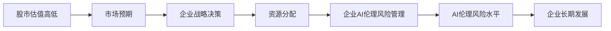

# 股市估值高低对企业AI伦理风险管理的影响

> 关键词：股市估值、企业AI伦理风险管理、市场预期、企业决策、长期发展

> 摘要：本文深入探讨了股市估值高低对企业AI伦理风险管理的影响。在当今科技飞速发展的时代，AI技术在企业中得到广泛应用，而股市估值作为市场对企业价值的综合评估，其高低会对企业在AI伦理风险管理方面的决策和实践产生多方面的作用。文章首先介绍了相关背景，包括目的、预期读者、文档结构和术语表；接着阐述了核心概念及联系，通过示意图和流程图进行直观展示；详细分析了核心算法原理和具体操作步骤，运用Python代码进行说明；探讨了相关数学模型和公式，并举例解释；通过项目实战案例展示代码实现和解读；分析了实际应用场景；推荐了相关工具和资源；最后总结了未来发展趋势与挑战，解答了常见问题，并提供了扩展阅读和参考资料，旨在为企业在应对股市估值变化下的AI伦理风险管理提供全面的理论和实践指导。

## 1. 背景介绍 
### 1.1 目的和范围
本研究的目的在于全面且深入地剖析股市估值高低对企业AI伦理风险管理所产生的各种影响。随着人工智能技术在企业运营中的广泛渗透，其伦理问题日益凸显。同时，股市作为企业价值的重要衡量场所，其估值的波动不仅反映了市场对企业的预期，还可能对企业的战略决策、资源分配等方面产生重大影响。本研究将聚焦于这种影响的机制、表现形式以及可能带来的后果，范围涵盖不同行业、不同规模的企业，旨在为企业管理者、投资者以及监管机构提供有价值的参考。

### 1.2 预期读者
本文的预期读者主要包括企业管理者，他们可以通过了解股市估值与AI伦理风险管理之间的关系，更好地制定企业战略和决策，平衡短期市场表现和长期伦理责任；投资者，帮助他们在评估企业投资价值时，考虑到AI伦理风险因素，做出更明智的投资决策；监管机构人员，有助于他们制定更合理的监管政策，引导企业在AI应用中遵循伦理规范；以及对人工智能伦理和金融市场感兴趣的研究人员和学者，为他们的研究提供新的视角和思路。

### 1.3 文档结构概述
本文将按照以下结构展开：首先介绍核心概念，明确股市估值和企业AI伦理风险管理的定义和内涵，并通过示意图和流程图展示它们之间的联系；接着详细阐述核心算法原理和具体操作步骤，借助Python代码进行说明；然后引入数学模型和公式，通过实际例子进行深入讲解；之后通过项目实战案例，展示代码实现过程并进行详细解读；分析股市估值高低对企业AI伦理风险管理的实际应用场景；推荐相关的学习资源、开发工具和论文著作；最后总结未来发展趋势与挑战，解答常见问题，并提供扩展阅读和参考资料。

### 1.4 术语表
#### 1.4.1 核心术语定义
- **股市估值**：指市场参与者对一家上市公司的价值进行评估和判断的结果，通常通过各种估值方法，如市盈率、市净率等，来衡量企业在股票市场中的价值水平。
- **企业AI伦理风险管理**：企业对在人工智能技术的研发、应用过程中可能出现的伦理问题进行识别、评估、控制和监督的一系列活动，以确保AI技术的使用符合道德、法律和社会价值观。

#### 1.4.2 相关概念解释
- **市场预期**：投资者和市场参与者对企业未来业绩、发展前景等方面的预期，它会影响股市估值的高低。
- **AI伦理问题**：包括但不限于数据隐私保护、算法偏见、AI系统的透明度和可解释性、AI对就业的影响等问题。

#### 1.4.3 缩略词列表
- **AI**：Artificial Intelligence，人工智能
- **PE**：Price-to-Earnings Ratio，市盈率
- **PB**：Price-to-Book Ratio，市净率

## 2. 核心概念与联系 
### 核心概念原理
#### 股市估值原理
股市估值是基于多种因素对企业价值进行评估的过程。常见的估值方法包括相对估值法和绝对估值法。相对估值法通过与同行业其他企业的相关指标进行比较，如市盈率（PE）、市净率（PB）等，来确定企业的相对价值。例如，市盈率是指股票价格与每股收益的比率，反映了投资者愿意为每一元收益支付的价格。绝对估值法主要基于企业未来的现金流折现来计算企业的内在价值，如现金流折现模型（DCF）。市场参与者根据企业的财务状况、行业前景、宏观经济环境等因素，综合判断企业的价值，并通过股票交易形成市场价格，从而体现股市估值。

#### 企业AI伦理风险管理原理
企业AI伦理风险管理的核心是识别、评估和控制AI技术应用过程中的伦理风险。首先，企业需要建立一套完善的风险识别机制，通过对AI系统的各个环节进行审查，包括数据采集、算法设计、模型训练和应用等，发现可能存在的伦理问题，如数据泄露、算法歧视等。然后，对识别出的风险进行评估，确定其发生的可能性和影响程度。最后，根据评估结果采取相应的控制措施，如改进算法、加强数据安全保护、制定伦理准则等，以降低风险水平。

### 架构的文本示意图
```plaintext
股市估值高低
    |
    | 影响市场预期
    |
    V
企业战略决策
    |
    | 影响资源分配
    |
    V
企业AI伦理风险管理
        |
        | 影响AI伦理风险水平
        |
        V
企业长期发展
```

### Mermaid流程图


## 3. 核心算法原理 & 具体操作步骤 
### 股市估值算法原理及Python实现
#### 市盈率估值法
市盈率估值法是一种常用的相对估值方法，其原理是通过比较目标企业与同行业可比企业的市盈率，来估算目标企业的价值。计算公式为：
$$V = EPS \times PE$$
其中，$V$ 表示企业的价值，$EPS$ 表示每股收益，$PE$ 表示市盈率。

以下是使用Python实现市盈率估值法的代码示例：
```python
def pe_valuation(eps, pe):
    """
    市盈率估值法计算企业价值
    :param eps: 每股收益
    :param pe: 市盈率
    :return: 企业价值
    """
    value = eps * pe
    return value

# 示例数据
eps = 2.5
pe = 20

# 计算企业价值
enterprise_value = pe_valuation(eps, pe)
print(f"企业价值: {enterprise_value}")
```
#### 具体操作步骤
1. 收集同行业可比企业的市盈率数据，计算平均市盈率作为目标企业的参考市盈率。
2. 获取目标企业的每股收益数据。
3. 将每股收益和参考市盈率代入公式计算企业价值。

### 企业AI伦理风险评估算法原理及Python实现
#### 风险评估模型
我们可以使用简单的加权评分模型来评估企业AI伦理风险。该模型通过对不同的伦理风险因素进行评分，并根据其重要性赋予相应的权重，最后计算加权总分来评估风险水平。假设我们考虑三个风险因素：数据隐私保护、算法透明度和算法偏见，其权重分别为 $w_1$、$w_2$、$w_3$，对应的评分分别为 $s_1$、$s_2$、$s_3$，则风险评估得分 $R$ 的计算公式为：
$$R = w_1s_1 + w_2s_2 + w_3s_3$$

以下是使用Python实现风险评估模型的代码示例：
```python
def ai_ethics_risk_assessment(weights, scores):
    """
    企业AI伦理风险评估
    :param weights: 风险因素权重列表
    :param scores: 风险因素评分列表
    :return: 风险评估得分
    """
    if len(weights)!= len(scores):
        raise ValueError("权重列表和评分列表长度必须一致")
    risk_score = sum([w * s for w, s in zip(weights, scores)])
    return risk_score

# 示例数据
weights = [0.4, 0.3, 0.3]
scores = [7, 6, 8]

# 计算风险评估得分
risk_score = ai_ethics_risk_assessment(weights, scores)
print(f"企业AI伦理风险评估得分: {risk_score}")
```
#### 具体操作步骤
1. 确定影响企业AI伦理风险的关键因素。
2. 为每个风险因素分配权重，反映其相对重要性。
3. 对每个风险因素进行评分，评分范围可以根据实际情况设定。
4. 将权重和评分代入公式计算风险评估得分。

## 4. 数学模型和公式 & 详细讲解 & 举例说明 
### 股市估值模型
#### 现金流折现模型（DCF）
现金流折现模型是一种绝对估值方法，其基本原理是将企业未来的现金流按照一定的折现率折现到当前时刻，从而得到企业的内在价值。假设企业在未来 $n$ 期的现金流分别为 $CF_1, CF_2, \cdots, CF_n$，折现率为 $r$，则企业的内在价值 $V$ 的计算公式为：
$$V = \sum_{i=1}^{n} \frac{CF_i}{(1 + r)^i}$$

**详细讲解**：现金流折现模型的核心在于预测企业未来的现金流和确定合适的折现率。未来现金流的预测需要考虑企业的业务模式、市场前景、竞争态势等因素。折现率反映了投资者对资金时间价值和风险的要求，通常可以使用资本资产定价模型（CAPM）来确定。

**举例说明**：假设某企业未来三年的现金流分别为 $100$ 万元、$120$ 万元、$150$ 万元，折现率为 $10\%$，则该企业的内在价值为：
$$V = \frac{100}{(1 + 0.1)^1} + \frac{120}{(1 + 0.1)^2} + \frac{150}{(1 + 0.1)^3}$$
```python
import math

cf = [100, 120, 150]
r = 0.1
n = len(cf)

value = sum([cf[i] / math.pow(1 + r, i + 1) for i in range(n)])
print(f"企业内在价值: {value} 万元")
```

### 企业AI伦理风险量化模型
#### 基于模糊综合评价法的风险量化模型
模糊综合评价法是一种将定性评价转化为定量评价的方法，适用于处理具有模糊性和不确定性的问题。假设我们有 $m$ 个评价因素 $U = \{u_1, u_2, \cdots, u_m\}$，$n$ 个评价等级 $V = \{v_1, v_2, \cdots, v_n\}$，评价因素的权重向量为 $W = (w_1, w_2, \cdots, w_m)$，模糊评价矩阵为 $R = (r_{ij})_{m \times n}$，其中 $r_{ij}$ 表示第 $i$ 个评价因素对第 $j$ 个评价等级的隶属度，则模糊综合评价结果 $B$ 的计算公式为：
$$B = W \cdot R$$

**详细讲解**：首先需要确定评价因素和评价等级，然后通过专家打分或问卷调查等方式确定模糊评价矩阵。评价因素的权重可以通过层次分析法（AHP）等方法确定。最后将权重向量和模糊评价矩阵相乘得到模糊综合评价结果，根据最大隶属度原则确定企业AI伦理风险的等级。

**举例说明**：假设我们有三个评价因素：数据安全、算法公平性、系统透明度，评价等级分为高、中、低三个等级。通过专家打分得到模糊评价矩阵 $R$ 为：
$$R = \begin{bmatrix}
0.2 & 0.5 & 0.3 \\
0.3 & 0.4 & 0.3 \\
0.1 & 0.6 & 0.3
\end{bmatrix}$$
评价因素的权重向量 $W$ 为 $(0.4, 0.3, 0.3)$，则模糊综合评价结果为：
$$B = (0.4, 0.3, 0.3) \cdot \begin{bmatrix}
0.2 & 0.5 & 0.3 \\
0.3 & 0.4 & 0.3 \\
0.1 & 0.6 & 0.3
\end{bmatrix} = (0.2, 0.5, 0.3)$$
根据最大隶属度原则，该企业AI伦理风险等级为中。

```python
import numpy as np

W = np.array([0.4, 0.3, 0.3])
R = np.array([[0.2, 0.5, 0.3],
              [0.3, 0.4, 0.3],
              [0.1, 0.6, 0.3]])

B = np.dot(W, R)
print(f"模糊综合评价结果: {B}")
```

## 5. 项目实战：代码实际案例和详细解释说明 
### 5.1  开发环境搭建
#### 操作系统
本项目可以在Windows、Linux或Mac OS等主流操作系统上进行开发。建议使用Linux系统，如Ubuntu 18.04及以上版本，因为Linux系统在开发和部署Python项目方面具有更好的稳定性和兼容性。

#### Python环境
安装Python 3.7及以上版本。可以从Python官方网站（https://www.python.org/downloads/）下载安装包进行安装。安装完成后，建议使用虚拟环境来管理项目的依赖，避免不同项目之间的依赖冲突。可以使用`venv`模块创建虚拟环境：
```bash
python3 -m venv myenv
source myenv/bin/activate  # 在Windows上使用 myenv\Scripts\activate
```

#### 依赖库安装
本项目需要使用一些常用的Python库，如`numpy`、`pandas`等。可以使用`pip`命令进行安装：
```bash
pip install numpy pandas
```

### 5.2  源代码详细实现和代码解读
#### 股市估值与AI伦理风险关联分析代码
```python
import numpy as np
import pandas as pd

# 模拟股市估值数据
stock_valuations = np.random.randint(10, 100, 100)
# 模拟AI伦理风险评估得分
ai_ethics_risks = np.random.randint(1, 10, 100)

# 创建DataFrame
data = pd.DataFrame({
    'Stock Valuation': stock_valuations,
    'AI Ethics Risk': ai_ethics_risks
})

# 计算相关性
correlation = data['Stock Valuation'].corr(data['AI Ethics Risk'])
print(f"股市估值与AI伦理风险的相关性: {correlation}")

# 绘制散点图
import matplotlib.pyplot as plt

plt.scatter(data['Stock Valuation'], data['AI Ethics Risk'])
plt.xlabel('Stock Valuation')
plt.ylabel('AI Ethics Risk')
plt.title('Stock Valuation vs AI Ethics Risk')
plt.show()
```
**代码解读**：
1. 首先，使用`numpy`库生成模拟的股市估值数据和AI伦理风险评估得分数据。
2. 然后，使用`pandas`库创建一个DataFrame，将模拟数据存储在其中。
3. 接着，使用`corr`方法计算股市估值和AI伦理风险之间的相关性，并打印结果。
4. 最后，使用`matplotlib`库绘制散点图，直观展示股市估值和AI伦理风险之间的关系。

#### 基于股市估值调整AI伦理风险管理策略代码
```python
# 定义不同股市估值区间对应的AI伦理风险管理策略
valuation_ranges = [(0, 20), (20, 50), (50, 100)]
strategies = ['Low investment in ethics management', 'Moderate investment in ethics management', 'High investment in ethics management']

def get_strategy(valuation):
    for i, (low, high) in enumerate(valuation_ranges):
        if low <= valuation < high:
            return strategies[i]
    return None

# 示例股市估值
sample_valuation = 30
strategy = get_strategy(sample_valuation)
print(f"当股市估值为 {sample_valuation} 时，AI伦理风险管理策略为: {strategy}")
```
**代码解读**：
1. 定义了不同股市估值区间和对应的AI伦理风险管理策略。
2. 定义了一个函数`get_strategy`，根据输入的股市估值返回相应的管理策略。
3. 给出一个示例股市估值，调用`get_strategy`函数获取对应的管理策略并打印结果。

### 5.3  代码解读与分析
#### 相关性分析代码
通过计算股市估值和AI伦理风险之间的相关性，我们可以了解两者之间的线性关系。正相关表示股市估值越高，AI伦理风险可能越高；负相关表示股市估值越高，AI伦理风险可能越低；相关性接近0表示两者之间没有明显的线性关系。散点图可以直观地展示数据的分布情况，帮助我们进一步分析两者之间的关系。

#### 策略调整代码
根据股市估值的不同区间，制定不同的AI伦理风险管理策略。当股市估值较低时，企业可能会减少在伦理管理方面的投入；当股市估值较高时，企业可能会增加在伦理管理方面的投入，以维护企业的声誉和长期发展。这种策略调整可以帮助企业在不同的市场环境下平衡短期利益和长期责任。

## 6. 实际应用场景 
### 高股市估值下的企业AI伦理风险管理
#### 积极投入伦理管理
当企业的股市估值较高时，市场对企业的预期也较高。为了维护企业的声誉和形象，企业可能会积极投入资源进行AI伦理风险管理。例如，大型科技公司在高估值的情况下，会建立专门的AI伦理委员会，制定严格的伦理准则和规范，对AI项目进行全面的伦理审查。同时，企业会加强对员工的伦理培训，提高员工的伦理意识，确保AI技术的应用符合道德和法律要求。

#### 应对公众监督
高估值的企业往往受到公众的广泛关注，其AI应用的伦理问题更容易引发社会舆论的关注。因此，企业需要更加注重应对公众监督，及时回应公众的质疑和关切。例如，当企业的AI算法被质疑存在偏见时，企业需要迅速进行调查和整改，并向公众公开处理结果，以避免对企业的声誉造成负面影响。

### 低股市估值下的企业AI伦理风险管理
#### 资源受限下的权衡
在低股市估值的情况下，企业可能面临资金紧张、资源有限的问题。此时，企业在AI伦理风险管理方面可能会面临权衡。一方面，企业需要确保AI技术的应用不违反基本的伦理原则，避免因伦理问题引发法律诉讼和声誉损失；另一方面，企业可能会减少在伦理管理方面的投入，优先保障核心业务的发展。例如，一些小型企业可能无法承担建立完善的AI伦理管理体系的成本，只能采取一些基本的措施，如加强数据安全保护、对算法进行简单的公平性检查等。

#### 寻求差异化竞争
低估值的企业也可以将AI伦理风险管理作为一种差异化竞争的手段。通过加强伦理管理，提高AI技术的透明度和可解释性，企业可以赢得部分对伦理问题较为关注的客户和投资者的信任。例如，一些新兴的金融科技公司在发展初期，通过强调其AI算法的公平性和透明度，吸引了一批注重伦理的客户，从而在市场竞争中脱颖而出。

## 7. 工具和资源推荐
### 7.1 学习资源推荐
#### 7.1.1 书籍推荐
- 《人工智能伦理》：本书全面介绍了人工智能领域的伦理问题，包括数据隐私、算法偏见、AI系统的责任等方面，为读者提供了深入了解AI伦理的理论基础。
- 《金融市场与金融机构》：涵盖了股市估值的基本原理和方法，以及金融市场的运行机制，有助于读者理解股市估值的影响因素和变化规律。
- 《Python数据分析实战》：通过实际案例介绍了Python在数据分析领域的应用，包括数据处理、可视化等方面，对于使用Python进行股市估值和AI伦理风险分析的读者有很大的帮助。

#### 7.1.2 在线课程
- Coursera上的“人工智能伦理”课程：由知名高校的教授授课，系统讲解了人工智能伦理的理论和实践，提供了丰富的案例分析和讨论。
- edX上的“金融市场”课程：介绍了金融市场的基本概念、估值方法和投资策略，帮助学员掌握股市估值的相关知识。
- 阿里云天池的“Python数据分析入门”课程：通过实际项目引导学员学习Python数据分析的基本技能，适合初学者入门。

#### 7.1.3 技术博客和网站
- Medium：上面有很多关于人工智能伦理和金融市场的优质文章，作者来自不同的领域和背景，可以提供多元化的观点和见解。
- 机器之心：专注于人工智能领域的前沿技术和应用，经常发布关于AI伦理的研究报告和分析文章。
- 雪球网：国内知名的金融投资社区，提供了丰富的股市估值数据和分析工具，以及投资者的交流和讨论平台。

### 7.2 开发工具框架推荐
#### 7.2.1 IDE和编辑器
- PyCharm：功能强大的Python集成开发环境，提供了代码编辑、调试、版本控制等一系列功能，适合专业的Python开发者使用。
- Jupyter Notebook：交互式的开发环境，支持Python代码的实时运行和可视化展示，非常适合进行数据分析和实验。
- Visual Studio Code：轻量级的代码编辑器，具有丰富的插件生态系统，可以方便地进行Python开发和调试。

#### 7.2.2 调试和性能分析工具
- PDB：Python自带的调试器，可以帮助开发者定位代码中的问题和错误。
- cProfile：Python的性能分析工具，可以分析代码的运行时间和函数调用情况，帮助开发者优化代码性能。
- Memory Profiler：用于分析Python代码的内存使用情况，帮助开发者发现内存泄漏等问题。

#### 7.2.3 相关框架和库
- NumPy：Python的数值计算库，提供了高效的数组操作和数学函数，是进行数据分析和机器学习的基础库。
- Pandas：用于数据处理和分析的库，提供了灵活的数据结构和数据操作方法，方便对股市估值和AI伦理风险数据进行处理和分析。
- Scikit-learn：机器学习库，提供了丰富的机器学习算法和工具，可用于建立股市估值模型和AI伦理风险评估模型。

### 7.3 相关论文著作推荐
#### 7.3.1 经典论文
- “The Ethical Algorithm: The Science of Socially Aware Algorithm Design”：探讨了如何设计具有社会意识的算法，以避免算法偏见和伦理问题。
- “Valuation: Measuring and Managing the Value of Companies”：详细介绍了企业估值的方法和理论，是金融领域的经典论文之一。
- “AI and Ethics: A Survey”：对人工智能伦理领域的研究进行了全面的综述，分析了当前存在的主要伦理问题和挑战。

#### 7.3.2 最新研究成果
- 每年在顶级学术会议如NeurIPS、ICML等上发表的关于人工智能伦理的研究论文，反映了该领域的最新研究动态和成果。
- 金融领域的学术期刊如《Journal of Financial Economics》《Review of Financial Studies》等上发表的关于股市估值的研究论文，提供了最新的理论和方法。

#### 7.3.3 应用案例分析
- 《AI in Business: How Successful Companies Leverage Artificial Intelligence to Win》：通过实际案例分析了企业如何应用人工智能技术，并探讨了其中涉及的伦理问题和管理策略。
- 《Financial Technology: Applications, Challenges, and Future Trends》：介绍了金融科技领域的应用案例，包括股市估值和风险管理等方面，对企业的实践具有一定的借鉴意义。

## 8. 总结：未来发展趋势与挑战
### 未来发展趋势
#### 股市估值与AI伦理风险管理的融合加深
随着市场对企业社会责任和伦理形象的关注度不断提高，股市估值将越来越多地考虑企业的AI伦理风险管理水平。投资者在评估企业价值时，会更加重视企业在AI伦理方面的表现，将其作为重要的参考因素之一。企业也会认识到良好的AI伦理管理有助于提升企业的长期价值和市场竞争力，从而更加主动地将伦理管理纳入企业战略和决策中。

#### AI伦理风险管理的标准化和规范化
为了应对AI技术带来的伦理挑战，未来将出现更多的行业标准和规范，指导企业进行AI伦理风险管理。国际组织、政府机构和行业协会将制定相关的准则和指南，明确企业在AI研发、应用过程中的伦理责任和义务。企业需要遵循这些标准和规范，建立完善的伦理管理体系，确保AI技术的合法、合规和道德使用。

#### 技术创新推动伦理风险管理
随着技术的不断发展，将出现更多的技术手段和工具用于AI伦理风险管理。例如，可解释性AI技术可以提高AI算法的透明度和可解释性，帮助企业更好地识别和管理伦理风险；区块链技术可以用于保障数据的安全性和隐私性，防止数据泄露和滥用。企业需要积极采用这些新技术，提升AI伦理风险管理的效率和效果。

### 挑战
#### 伦理标准的制定和统一难度大
由于不同文化、价值观和利益诉求的存在，制定统一的AI伦理标准面临很大的挑战。不同国家和地区对AI伦理问题的看法和关注点可能存在差异，难以达成共识。此外，AI技术的快速发展也使得伦理标准的更新和完善跟不上技术的变化，导致标准的滞后性。

#### 技术复杂性增加管理难度
AI技术本身具有高度的复杂性，包括算法的复杂性、数据的多样性和模型的黑盒性等。这使得企业在进行AI伦理风险管理时面临很大的困难，难以准确识别和评估潜在的伦理风险。同时，随着AI技术的不断演进，新的伦理问题也不断涌现，对企业的管理能力提出了更高的要求。

#### 短期利益与长期责任的平衡
企业在面对股市估值的压力时，往往需要在短期利益和长期责任之间进行平衡。高股市估值可能促使企业追求短期的业绩增长，而忽视AI伦理风险管理；低股市估值则可能使企业因资源有限而无法充分投入伦理管理。如何在不同的市场环境下，兼顾短期利益和长期责任，是企业面临的一大挑战。

## 9. 附录：常见问题与解答
### 问题1：股市估值高低是如何影响企业AI伦理风险管理决策的？
股市估值高低会影响市场对企业的预期，进而影响企业的战略决策和资源分配。当股市估值较高时，企业为了维护良好的声誉和形象，可能会增加在AI伦理风险管理方面的投入；当股市估值较低时，企业可能会因资源受限而减少投入，或者将伦理管理作为差异化竞争的手段。

### 问题2：如何衡量企业AI伦理风险的大小？
可以使用多种方法来衡量企业AI伦理风险的大小，如加权评分模型、模糊综合评价法等。这些方法通过对不同的伦理风险因素进行评分和加权计算，得到一个综合的风险评估得分，从而衡量企业AI伦理风险的大小。

### 问题3：企业在高股市估值下是否一定会加强AI伦理风险管理？
不一定。虽然高股市估值可能促使企业加强AI伦理风险管理，但企业的决策还受到多种因素的影响，如企业的文化、管理层的意识、行业竞争等。有些企业可能会为了追求短期的业绩增长，而忽视伦理风险；而有些企业则会将伦理管理作为长期发展的重要战略，积极投入资源进行管理。

### 问题4：AI伦理风险管理对股市估值有反向影响吗？
有反向影响。良好的AI伦理风险管理可以提升企业的声誉和形象，增强投资者对企业的信心，从而可能提高企业的股市估值。相反，若企业在AI伦理方面出现问题，如数据泄露、算法偏见等，可能会引发社会舆论的关注和投资者的担忧，导致股市估值下降。

## 10. 扩展阅读 & 参考资料
### 扩展阅读
- 《人类简史：从动物到上帝》：探讨了人类的进化和发展历程，以及科技对人类社会的影响，有助于从更宏观的角度理解AI伦理问题。
- 《黑天鹅：如何应对不可预知的未来》：介绍了不确定性和突发事件对金融市场和企业的影响，对于理解股市估值的波动和企业面临的风险具有一定的启示作用。

### 参考资料
- 国际标准化组织（ISO）发布的关于人工智能伦理的相关标准和指南。
- 各国政府发布的关于人工智能发展和伦理管理的政策文件。
- 相关学术期刊和会议上发表的研究论文，如《Nature》《Science》《ACM Transactions on Intelligent Systems and Technology》等。

作者：AI天才研究院/AI Genius Institute & 禅与计算机程序设计艺术 /Zen And The Art of Computer Programming