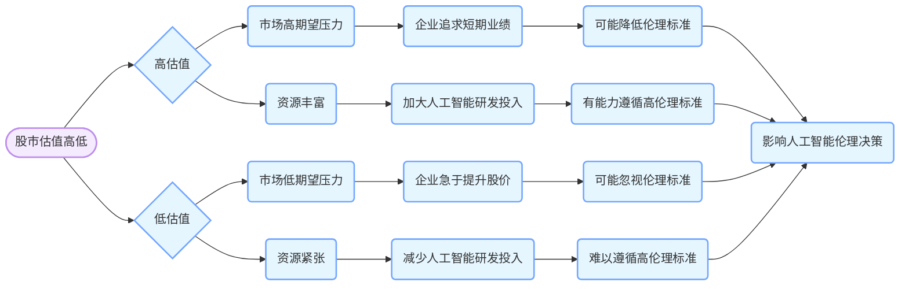

# 股市估值高低对企业人工智能伦理标准的影响

> 关键词：股市估值、企业人工智能、伦理标准、市场压力、长期发展

> 摘要：本文深入探讨了股市估值高低对企业人工智能伦理标准的影响。在当今科技飞速发展的时代，人工智能在企业中的应用日益广泛，而股市估值作为衡量企业市场价值的重要指标，其高低变化会给企业带来不同程度的市场压力和发展导向。通过分析核心概念、算法原理、数学模型等方面，结合实际案例和应用场景，揭示了股市估值高低如何影响企业在人工智能伦理标准上的决策和实践。同时，为企业在追求经济利益与遵循伦理道德之间提供了平衡的思路，也对该领域的未来发展趋势与挑战进行了展望。

## 1. 背景介绍 
### 1.1 目的和范围
本研究旨在全面剖析股市估值高低与企业人工智能伦理标准之间的内在联系。随着人工智能技术在企业运营、产品研发等多个领域的深度融合，企业在应用人工智能时需要遵循一定的伦理标准，以确保技术的合理、公正和可持续应用。而股市估值反映了市场对企业的预期和评价，其高低变化会影响企业的战略决策、资源分配等方面，进而对企业人工智能伦理标准的制定和执行产生作用。本研究的范围涵盖了不同行业、不同规模的企业，通过理论分析和实际案例相结合的方式，深入探讨这一复杂的关系。

### 1.2 预期读者
本文的预期读者包括企业管理者、人工智能研究者、金融分析师、政策制定者以及对人工智能伦理和金融市场感兴趣的人士。对于企业管理者来说，了解股市估值对人工智能伦理标准的影响有助于他们在追求企业经济利益的同时，更好地平衡伦理道德和社会责任；人工智能研究者可以从金融市场的角度思考人工智能伦理问题，为技术的健康发展提供新的视角；金融分析师可以将企业的人工智能伦理标准纳入对企业估值的考量因素中，提高估值的准确性；政策制定者可以根据研究结果制定相关政策，引导企业在人工智能应用中遵循伦理规范；而对相关领域感兴趣的人士可以通过本文了解这一新兴领域的研究动态和实际影响。

### 1.3 文档结构概述
本文共分为十个部分。第一部分为背景介绍，阐述了研究的目的、范围、预期读者和文档结构概述，并对相关术语进行了定义和解释。第二部分介绍了股市估值、企业人工智能和伦理标准的核心概念及其相互联系，通过文本示意图和 Mermaid 流程图进行了直观展示。第三部分详细讲解了与股市估值和企业人工智能伦理决策相关的核心算法原理，并给出了具体的 Python 代码示例。第四部分介绍了相关的数学模型和公式，并通过具体例子进行了详细说明。第五部分通过实际项目案例，展示了开发环境搭建、源代码实现和代码解读的过程。第六部分探讨了股市估值高低对企业人工智能伦理标准影响的实际应用场景。第七部分推荐了相关的学习资源、开发工具框架和论文著作。第八部分对未来发展趋势与挑战进行了总结。第九部分为附录，解答了常见问题。最后一部分提供了扩展阅读和参考资料。

### 1.4 术语表
#### 1.4.1 核心术语定义
- **股市估值**：指通过一定的方法和模型，对上市公司的股票价值进行评估和判断，反映了市场对企业未来盈利能力和发展前景的预期。常见的估值方法包括市盈率法、市净率法、现金流折现法等。
- **企业人工智能**：指企业在生产、经营、管理等各个环节中应用人工智能技术，如机器学习、深度学习、自然语言处理等，以提高效率、降低成本、创新产品和服务。
- **人工智能伦理标准**：是指在人工智能技术的研发、应用和管理过程中，遵循的一系列道德原则和规范，旨在确保人工智能技术的发展和应用符合人类的利益和价值观，避免对人类社会造成负面影响。例如，公平性、透明度、隐私保护、责任追究等都是人工智能伦理标准的重要内容。

#### 1.4.2 相关概念解释
- **市场压力**：股市估值高低会给企业带来不同程度的市场压力。当股市估值较高时，市场对企业的业绩和发展前景有较高的期望，企业面临着保持高增长和高盈利的压力；当股市估值较低时，企业可能面临被市场低估、融资困难等压力。
- **短期利益与长期发展**：企业在面对股市估值的影响时，需要在追求短期经济利益和实现长期可持续发展之间进行平衡。短期利益可能表现为通过牺牲一定的伦理标准来提高业绩和股价，而长期发展则需要企业遵循伦理规范，树立良好的企业形象，赢得市场和社会的信任。

#### 1.4.3 缩略词列表
- **AI**：Artificial Intelligence，人工智能
- **ML**：Machine Learning，机器学习
- **DL**：Deep Learning，深度学习
- **NLP**：Natural Language Processing，自然语言处理

## 2. 核心概念与联系 

### 核心概念原理
#### 股市估值原理
股市估值是基于对企业未来现金流、盈利能力、市场竞争力等因素的预测和分析。常见的估值模型如市盈率（P/E）模型，通过将股票价格除以每股收益来计算市盈率，市盈率反映了市场对企业盈利的预期。公式为：$P/E = \frac{股价}{每股收益}$ 。较高的市盈率通常意味着市场对企业未来的盈利增长有较高的预期，而较低的市盈率则可能表示市场对企业的前景不太乐观。

#### 企业人工智能原理
企业人工智能是利用机器学习、深度学习等技术，从大量的数据中提取有价值的信息和模式，以实现自动化决策、智能预测、智能客服等功能。例如，在客户关系管理中，企业可以利用人工智能算法对客户的购买行为、偏好等数据进行分析，从而实现精准营销和个性化服务。

#### 人工智能伦理标准原理
人工智能伦理标准旨在确保人工智能技术的应用符合人类的价值观和道德原则。其核心原理包括公平性，即人工智能系统不应对不同群体产生歧视；透明度，即人工智能系统的决策过程和算法应该是可解释的；隐私保护，即确保用户的数据不被滥用和泄露等。

### 架构的文本示意图
```plaintext
股市估值高低
    │
    ├── 高估值
    │   │
    │   ├── 市场高期望压力
    │   │   │
    │   │   ├── 企业追求短期业绩
    │   │   │   │
    │   │   │   ├── 可能降低伦理标准
    │   │   │   │
    │   │   │   └── 影响人工智能伦理决策
    │   │
    │   └── 资源丰富
    │       │
    │       ├── 加大人工智能研发投入
    │       │   │
    │       │   ├── 有能力遵循高伦理标准
    │       │
    │       └── 提升企业形象
    │           │
    │           ├── 主动遵循伦理标准
    │
    └── 低估值
        │
        ├── 市场低期望压力
        │   │
        │   ├── 企业急于提升股价
        │   │   │
        │   │   ├── 可能忽视伦理标准
        │   │   │
        │   │   └── 影响人工智能伦理决策
        │
        └── 资源紧张
            │
            ├── 减少人工智能研发投入
            │   │
            │   ├── 难以遵循高伦理标准
```

### Mermaid 流程图


## 3. 核心算法原理 & 具体操作步骤 

### 股市估值算法原理
在股市估值中，现金流折现法（DCF）是一种常用的方法。其核心思想是将企业未来的现金流折现到当前时刻，以评估企业的内在价值。

#### 算法步骤
1. **预测未来现金流**：根据企业的历史财务数据、市场趋势和行业前景，预测企业未来若干年的自由现金流（FCF）。自由现金流是指企业在满足了所有运营成本和资本支出后剩余的现金流量。
2. **确定折现率**：折现率反映了投资者对投资风险的预期。通常使用加权平均资本成本（WACC）作为折现率，其计算公式为：
$WACC = E/V \times Re + D/V \times Rd \times (1 - Tc)$
其中，$E$ 为股权价值，$D$ 为债务价值，$V = E + D$ 为企业总价值，$Re$ 为股权成本，$Rd$ 为债务成本，$Tc$ 为企业所得税税率。
3. **计算现金流现值**：将预测的未来现金流按照折现率折现到当前时刻，计算公式为：
$PV = \sum_{t=1}^{n} \frac{FCF_t}{(1 + r)^t}$
其中，$PV$ 为现金流现值，$FCF_t$ 为第 $t$ 年的自由现金流，$r$ 为折现率，$n$ 为预测期数。
4. **计算企业价值**：将预测期内的现金流现值和预测期后企业的终值（Terminal Value）相加，得到企业的总价值。终值通常使用永续增长模型计算，公式为：
$TV = \frac{FCF_{n+1}}{r - g}$
其中，$TV$ 为终值，$FCF_{n+1}$ 为预测期后第一年的自由现金流，$g$ 为永续增长率。

### Python 代码实现
```python
import numpy as np

def dcf_valuation(fcf_forecast, discount_rate, growth_rate):
    """
    现金流折现法估值函数
    :param fcf_forecast: 未来现金流预测列表
    :param discount_rate: 折现率
    :param growth_rate: 永续增长率
    :return: 企业价值
    """
    n = len(fcf_forecast)
    # 计算预测期内现金流现值
    present_values = [fcf / ((1 + discount_rate) ** (i + 1)) for i, fcf in enumerate(fcf_forecast)]
    # 计算终值
    terminal_value = fcf_forecast[-1] * (1 + growth_rate) / (discount_rate - growth_rate)
    terminal_value_pv = terminal_value / ((1 + discount_rate) ** n)
    # 计算企业价值
    enterprise_value = sum(present_values) + terminal_value_pv
    return enterprise_value

# 示例数据
fcf_forecast = [100, 120, 140, 160, 180]  # 未来 5 年的自由现金流预测
discount_rate = 0.1  # 折现率为 10%
growth_rate = 0.03  # 永续增长率为 3%

# 计算企业价值
value = dcf_valuation(fcf_forecast, discount_rate, growth_rate)
print(f"企业价值: {value:.2f}")
```

### 企业人工智能伦理决策算法原理
企业在进行人工智能伦理决策时，可以采用多准则决策方法。例如，层次分析法（AHP）可以帮助企业将复杂的伦理决策问题分解为多个层次和准则，通过比较不同准则和方案的相对重要性，做出最优决策。

#### 算法步骤
1. **建立层次结构模型**：将伦理决策问题分解为目标层、准则层和方案层。目标层是企业要实现的伦理目标，准则层是影响决策的伦理准则，如公平性、透明度、隐私保护等，方案层是可供选择的人工智能应用方案。
2. **构造判断矩阵**：对准则层和方案层的元素进行两两比较，构造判断矩阵。判断矩阵的元素表示两个元素之间的相对重要性，通常采用 1 - 9 标度法进行赋值。
3. **计算权重向量**：通过求解判断矩阵的特征值和特征向量，得到各元素的权重向量。
4. **一致性检验**：检验判断矩阵的一致性，确保判断的合理性。一致性指标 $CI$ 和随机一致性比率 $CR$ 可以用来判断一致性的程度。
5. **计算方案得分**：根据权重向量和方案层的判断矩阵，计算各方案的得分，选择得分最高的方案作为最优决策。

### Python 代码实现
```python
import numpy as np

def ahp_decision(criteria_matrix, alternatives_matrix):
    """
    层次分析法决策函数
    :param criteria_matrix: 准则层判断矩阵
    :param alternatives_matrix: 方案层判断矩阵列表
    :return: 各方案得分
    """
    # 计算准则层权重向量
    eigenvalues, eigenvectors = np.linalg.eig(criteria_matrix)
    max_eigenvalue = np.max(eigenvalues).real
    index = np.argmax(eigenvalues)
    criteria_weights = eigenvectors[:, index].real
    criteria_weights = criteria_weights / np.sum(criteria_weights)

    # 计算方案层权重向量
    num_alternatives = len(alternatives_matrix)
    alternative_weights = []
    for matrix in alternatives_matrix:
        eigenvalues, eigenvectors = np.linalg.eig(matrix)
        max_eigenvalue = np.max(eigenvalues).real
        index = np.argmax(eigenvalues)
        weights = eigenvectors[:, index].real
        weights = weights / np.sum(weights)
        alternative_weights.append(weights)

    # 计算各方案得分
    scores = []
    for i in range(len(alternative_weights[0])):
        score = 0
        for j in range(len(criteria_weights)):
            score += criteria_weights[j] * alternative_weights[j][i]
        scores.append(score)

    return scores

# 示例数据
# 准则层判断矩阵
criteria_matrix = np.array([[1, 3, 5],
                            [1/3, 1, 3],
                            [1/5, 1/3, 1]])

# 方案层判断矩阵列表
alternatives_matrix = [np.array([[1, 2, 3],
                                 [1/2, 1, 2],
                                 [1/3, 1/2, 1]]),
                       np.array([[1, 1/2, 1/3],
                                 [2, 1, 1/2],
                                 [3, 2, 1]]),
                       np.array([[1, 3, 5],
                                 [1/3, 1, 3],
                                 [1/5, 1/3, 1]])]

# 计算各方案得分
scores = ahp_decision(criteria_matrix, alternatives_matrix)
print("各方案得分:", scores)
```

## 4. 数学模型和公式 & 详细讲解 & 举例说明 

### 股市估值数学模型
#### 市盈率模型
市盈率（P/E）模型是一种简单直观的股市估值模型，其公式为：
$P = E \times P/E$
其中，$P$ 为股票价格，$E$ 为每股收益，$P/E$ 为市盈率。

**详细讲解**：市盈率反映了市场对企业盈利的预期。较高的市盈率意味着市场认为企业未来的盈利增长潜力较大，愿意为每股收益支付更高的价格；较低的市盈率则表示市场对企业的前景不太乐观。

**举例说明**：假设某公司的每股收益为 $5$ 元，市场平均市盈率为 $20$ 倍，则该公司的股票价格理论上应为 $P = 5 \times 20 = 100$ 元。

#### 市净率模型
市净率（P/B）模型是通过比较股票价格与每股净资产的比率来评估企业价值，公式为：
$P = B \times P/B$
其中，$P$ 为股票价格，$B$ 为每股净资产，$P/B$ 为市净率。

**详细讲解**：市净率反映了市场对企业净资产的估值。一般来说，市净率较高的企业可能具有较高的盈利能力、品牌价值或成长潜力；市净率较低的企业可能存在经营困境或被市场低估的情况。

**举例说明**：某公司的每股净资产为 $10$ 元，市净率为 $1.5$ 倍，则该公司的股票价格应为 $P = 10 \times 1.5 = 15$ 元。

### 企业人工智能伦理决策数学模型
#### 层次分析法数学模型
在层次分析法中，判断矩阵 $A$ 的元素 $a_{ij}$ 表示元素 $i$ 相对于元素 $j$ 的相对重要性。判断矩阵应满足 $a_{ij} > 0$，$a_{ji} = 1/a_{ij}$，$a_{ii} = 1$。

判断矩阵的最大特征值 $\lambda_{max}$ 和对应的特征向量 $W$ 可以通过求解矩阵方程 $AW = \lambda_{max}W$ 得到。

一致性指标 $CI$ 的计算公式为：
$CI = \frac{\lambda_{max} - n}{n - 1}$
其中，$n$ 为判断矩阵的阶数。

随机一致性比率 $CR$ 的计算公式为：
$CR = \frac{CI}{RI}$
其中，$RI$ 为随机一致性指标，其值与判断矩阵的阶数有关，可通过查表得到。当 $CR < 0.1$ 时，认为判断矩阵具有满意的一致性。

**详细讲解**：层次分析法通过构造判断矩阵和计算权重向量，将复杂的决策问题进行量化分析。一致性检验是为了确保判断矩阵的合理性，避免判断的主观性和随意性。

**举例说明**：假设有一个 $3$ 阶判断矩阵 $A$：
$A = \begin{bmatrix}
1 & 3 & 5 \\
1/3 & 1 & 3 \\
1/5 & 1/3 & 1
\end{bmatrix}$
通过计算得到最大特征值 $\lambda_{max} = 3.0385$，一致性指标 $CI = \frac{3.0385 - 3}{3 - 1} = 0.01925$。查随机一致性指标表可知，$RI = 0.58$，则随机一致性比率 $CR = \frac{0.01925}{0.58} \approx 0.0332 < 0.1$，说明该判断矩阵具有满意的一致性。

## 5. 项目实战：代码实际案例和详细解释说明 

### 5.1  开发环境搭建
#### 安装 Python
首先，需要安装 Python 编程语言。可以从 Python 官方网站（https://www.python.org/downloads/）下载适合自己操作系统的 Python 安装包，并按照安装向导进行安装。建议安装 Python 3.7 及以上版本。

#### 安装必要的库
在本项目中，需要使用到 `numpy` 库进行数值计算。可以使用以下命令通过 `pip` 进行安装：
```sh
pip install numpy
```

### 5.2  源代码详细实现和代码解读
#### 股市估值代码实现
```python
import numpy as np

def dcf_valuation(fcf_forecast, discount_rate, growth_rate):
    """
    现金流折现法估值函数
    :param fcf_forecast: 未来现金流预测列表
    :param discount_rate: 折现率
    :param growth_rate: 永续增长率
    :return: 企业价值
    """
    n = len(fcf_forecast)
    # 计算预测期内现金流现值
    present_values = [fcf / ((1 + discount_rate) ** (i + 1)) for i, fcf in enumerate(fcf_forecast)]
    # 计算终值
    terminal_value = fcf_forecast[-1] * (1 + growth_rate) / (discount_rate - growth_rate)
    terminal_value_pv = terminal_value / ((1 + discount_rate) ** n)
    # 计算企业价值
    enterprise_value = sum(present_values) + terminal_value_pv
    return enterprise_value

# 示例数据
fcf_forecast = [100, 120, 140, 160, 180]  # 未来 5 年的自由现金流预测
discount_rate = 0.1  # 折现率为 10%
growth_rate = 0.03  # 永续增长率为 3%

# 计算企业价值
value = dcf_valuation(fcf_forecast, discount_rate, growth_rate)
print(f"企业价值: {value:.2f}")
```
**代码解读**：
- `dcf_valuation` 函数接受三个参数：`fcf_forecast` 为未来现金流预测列表，`discount_rate` 为折现率，`growth_rate` 为永续增长率。
- 在函数内部，首先计算预测期内现金流的现值，通过列表推导式将每个现金流按照折现率折现到当前时刻。
- 然后计算终值，使用永续增长模型公式计算预测期后企业的价值，并将其折现到当前时刻。
- 最后将预测期内现金流现值和终值相加，得到企业的总价值。

#### 企业人工智能伦理决策代码实现
```python
import numpy as np

def ahp_decision(criteria_matrix, alternatives_matrix):
    """
    层次分析法决策函数
    :param criteria_matrix: 准则层判断矩阵
    :param alternatives_matrix: 方案层判断矩阵列表
    :return: 各方案得分
    """
    # 计算准则层权重向量
    eigenvalues, eigenvectors = np.linalg.eig(criteria_matrix)
    max_eigenvalue = np.max(eigenvalues).real
    index = np.argmax(eigenvalues)
    criteria_weights = eigenvectors[:, index].real
    criteria_weights = criteria_weights / np.sum(criteria_weights)

    # 计算方案层权重向量
    num_alternatives = len(alternatives_matrix)
    alternative_weights = []
    for matrix in alternatives_matrix:
        eigenvalues, eigenvectors = np.linalg.eig(matrix)
        max_eigenvalue = np.max(eigenvalues).real
        index = np.argmax(eigenvalues)
        weights = eigenvectors[:, index].real
        weights = weights / np.sum(weights)
        alternative_weights.append(weights)

    # 计算各方案得分
    scores = []
    for i in range(len(alternative_weights[0])):
        score = 0
        for j in range(len(criteria_weights)):
            score += criteria_weights[j] * alternative_weights[j][i]
        scores.append(score)

    return scores

# 示例数据
# 准则层判断矩阵
criteria_matrix = np.array([[1, 3, 5],
                            [1/3, 1, 3],
                            [1/5, 1/3, 1]])

# 方案层判断矩阵列表
alternatives_matrix = [np.array([[1, 2, 3],
                                 [1/2, 1, 2],
                                 [1/3, 1/2, 1]]),
                       np.array([[1, 1/2, 1/3],
                                 [2, 1, 1/2],
                                 [3, 2, 1]]),
                       np.array([[1, 3, 5],
                                 [1/3, 1, 3],
                                 [1/5, 1/3, 1]])]

# 计算各方案得分
scores = ahp_decision(criteria_matrix, alternatives_matrix)
print("各方案得分:", scores)
```
**代码解读**：
- `ahp_decision` 函数接受两个参数：`criteria_matrix` 为准则层判断矩阵，`alternatives_matrix` 为方案层判断矩阵列表。
- 在函数内部，首先计算准则层的权重向量，通过求解准则层判断矩阵的特征值和特征向量，得到最大特征值对应的特征向量，并进行归一化处理。
- 然后遍历方案层判断矩阵列表，计算每个方案层判断矩阵的权重向量。
- 最后，根据准则层权重向量和方案层权重向量，计算各方案的得分。

### 5.3  代码解读与分析
#### 股市估值代码分析
现金流折现法是一种较为复杂但准确的股市估值方法。代码中通过预测未来现金流、确定折现率和永续增长率，将未来现金流折现到当前时刻，得到企业的内在价值。该方法的优点是考虑了企业未来的盈利能力和现金流状况，但缺点是需要对未来现金流和折现率进行准确预测，存在一定的主观性和不确定性。

#### 企业人工智能伦理决策代码分析
层次分析法通过将复杂的伦理决策问题分解为多个层次和准则，利用判断矩阵和权重向量进行量化分析，为企业提供了一种科学的决策方法。代码中通过求解判断矩阵的特征值和特征向量，计算各准则和方案的权重，并最终得到各方案的得分。该方法的优点是可以综合考虑多个因素，提高决策的科学性和合理性，但缺点是判断矩阵的构造需要专家的经验和判断，存在一定的主观性。

## 6. 实际应用场景 
### 高估值企业场景
当企业股市估值较高时，通常会面临市场的高期望压力，同时也拥有较为丰富的资源。

#### 追求短期业绩与伦理标准冲突
一些高估值企业为了满足市场对业绩增长的期望，可能会在人工智能应用中追求短期效益，从而降低伦理标准。例如，某些科技公司为了快速推出人工智能产品，可能会忽视数据隐私保护和算法公平性问题。在开发智能推荐系统时，为了提高用户点击率和广告收入，可能会使用用户的敏感信息进行精准推送，而不充分告知用户或获得用户的明确授权。

#### 加大研发投入与遵循高伦理标准
另一方面，高估值企业也有能力加大在人工智能研发方面的投入，从而有机会遵循更高的伦理标准。例如，一些大型科技企业会成立专门的伦理委员会，负责审查人工智能项目的伦理合规性。他们会投入大量资源进行数据治理和算法审计，确保人工智能系统的公平性、透明度和可解释性。同时，这些企业还会积极参与行业伦理标准的制定，推动整个行业的健康发展。

### 低估值企业场景
低估值企业通常面临市场的低期望压力和资源紧张的问题。

#### 急于提升股价与忽视伦理标准
为了尽快提升股价，低估值企业可能会急于推出人工智能产品或服务，而忽视了伦理标准。例如，一些小型创业公司为了吸引投资者和客户，可能会夸大人工智能产品的性能和效果，而不充分考虑产品可能带来的伦理风险。在开发人工智能医疗诊断系统时，可能会在数据质量和算法验证不充分的情况下就推向市场，导致诊断结果不准确，给患者带来潜在的健康风险。

#### 资源紧张与难以遵循高伦理标准
由于资源有限，低估值企业可能难以在人工智能研发和伦理标准遵循方面投入足够的资源。例如，他们可能无法聘请专业的伦理专家进行咨询和审查，也无法建立完善的数据安全和隐私保护体系。这使得他们在人工智能应用中更容易出现伦理问题。

## 7. 工具和资源推荐
### 7.1 学习资源推荐
#### 7.1.1 书籍推荐
- 《人工智能伦理》：本书全面介绍了人工智能伦理的基本概念、理论和实践，涵盖了公平性、透明度、隐私保护等多个方面的内容，是学习人工智能伦理的经典著作。
- 《股市估值建模》：详细讲解了各种股市估值方法和模型，包括现金流折现法、市盈率法、市净率法等，并通过实际案例进行了分析和应用。
- 《决策分析》：介绍了层次分析法、多属性决策等决策分析方法，为企业在人工智能伦理决策等复杂问题上提供了理论和方法支持。

#### 7.1.2 在线课程
- Coursera 上的“人工智能伦理”课程：由知名高校的教授授课，系统地介绍了人工智能伦理的相关知识和案例分析。
- edX 上的“金融估值与建模”课程：深入讲解了股市估值的方法和技巧，通过实际项目让学员掌握估值模型的应用。
- Udemy 上的“决策科学与分析”课程：介绍了多种决策分析方法，包括层次分析法，通过实际案例让学员学会如何运用这些方法解决实际问题。

#### 7.1.3 技术博客和网站
- Medium 上的人工智能伦理相关博客：许多专家和学者会在 Medium 上分享人工智能伦理的最新研究成果和实践经验。
- Seeking Alpha：提供股市估值分析和研究报告，有助于了解不同行业和企业的估值情况。
- IEEE 计算机协会官网：发布人工智能领域的最新技术和研究动态，包括人工智能伦理方面的文章和会议信息。

### 7.2 开发工具框架推荐
#### 7.2.1 IDE和编辑器
- PyCharm：一款功能强大的 Python 集成开发环境，提供代码编辑、调试、版本控制等功能，适合开发股市估值和人工智能伦理决策相关的 Python 代码。
- Jupyter Notebook：一种交互式的开发环境，支持 Python、R 等多种编程语言，适合进行数据探索、模型开发和代码演示。

#### 7.2.2 调试和性能分析工具
- PDB：Python 自带的调试工具，可以帮助开发者定位代码中的错误和问题。
- cProfile：Python 标准库中的性能分析工具，可以分析代码的运行时间和函数调用情况，帮助开发者优化代码性能。

#### 7.2.3 相关框架和库
- NumPy：用于数值计算的 Python 库，提供了高效的数组操作和数学函数，在股市估值和人工智能伦理决策的代码实现中经常使用。
- Pandas：用于数据处理和分析的 Python 库，提供了数据结构和数据操作方法，方便对股市数据和人工智能相关数据进行处理和分析。

### 7.3 相关论文著作推荐
#### 7.3.1 经典论文
- “The Ethics of Artificial Intelligence”：探讨了人工智能伦理的基本问题和挑战，提出了一些伦理原则和框架。
- “Valuation of Equity Securities”：介绍了股市估值的基本理论和方法，对现金流折现法、市盈率法等进行了深入分析。
- “Analytic Hierarchy Process: A Survey of the Method and its Applications”：对层次分析法进行了全面的介绍和综述，包括方法的原理、应用领域和发展趋势。

#### 7.3.2 最新研究成果
- 近年来，关于股市估值与企业社会责任、人工智能伦理的研究逐渐增多。可以通过学术数据库如 IEEE Xplore、ACM Digital Library、ScienceDirect 等搜索相关的最新研究论文。
- 一些知名学术会议如 AAAI（Association for the Advancement of Artificial Intelligence）、NeurIPS（Conference on Neural Information Processing Systems）也会发布人工智能伦理方面的最新研究成果。

#### 7.3.3 应用案例分析
- 一些咨询公司和研究机构会发布关于企业人工智能伦理应用的案例分析报告，如麦肯锡、波士顿咨询集团等。这些报告可以帮助我们了解不同企业在人工智能伦理方面的实践经验和面临的挑战。

## 8. 总结：未来发展趋势与挑战
### 未来发展趋势
#### 伦理标准的规范化和制度化
随着人工智能技术的广泛应用，社会对企业人工智能伦理标准的关注度将不断提高。未来，可能会出台更多的法律法规和行业标准，对企业在人工智能研发、应用和管理过程中的伦理行为进行规范和约束。例如，欧盟已经出台了《通用数据保护条例》（GDPR），对数据隐私保护提出了严格要求。

#### 股市估值与伦理标准的融合
投资者将越来越重视企业的人工智能伦理标准，将其纳入对企业估值的考量因素中。具有良好伦理记录的企业可能会获得更高的估值和市场认可，而忽视伦理标准的企业可能会面临股价下跌和声誉受损的风险。这将促使企业更加注重人工智能伦理建设，实现经济利益和社会责任的双赢。

#### 技术创新推动伦理标准提升
随着人工智能技术的不断发展，新的技术手段将被应用于伦理标准的提升。例如，可解释人工智能技术可以提高人工智能系统的透明度和可解释性，帮助企业更好地遵循伦理标准；区块链技术可以实现数据的安全共享和追溯，保障数据隐私和安全。

### 挑战
#### 伦理标准的界定和衡量难题
人工智能伦理标准涉及多个方面，如公平性、透明度、隐私保护等，不同的人对这些标准的理解和界定可能存在差异。此外，如何准确衡量企业在人工智能应用中是否遵循了伦理标准也是一个挑战。目前还缺乏统一的、可量化的伦理评价指标和方法。

#### 企业短期利益与长期发展的平衡
企业在面对股市估值的压力时，往往需要在追求短期经济利益和实现长期可持续发展之间进行平衡。在短期内，降低伦理标准可能会带来一定的业绩提升和股价上涨，但从长期来看，这可能会损害企业的声誉和市场竞争力。如何引导企业树立正确的发展观，平衡短期利益和长期发展，是一个亟待解决的问题。

#### 国际协调与合作的需求
人工智能技术的发展是全球性的，其伦理问题也具有跨国性和全球性。不同国家和地区在人工智能伦理标准的制定和执行上可能存在差异，这可能会导致国际间的贸易摩擦和技术壁垒。因此，需要加强国际协调与合作，制定统一的国际伦理标准和规范，共同应对人工智能伦理挑战。

## 9. 附录：常见问题与解答
### 问题 1：股市估值的高低是如何确定的？
股市估值的高低通常通过多种方法和指标来确定。常见的方法包括市盈率法、市净率法、现金流折现法等。市盈率是股票价格与每股收益的比率，市净率是股票价格与每股净资产的比率，现金流折现法是将企业未来的现金流折现到当前时刻来评估企业的内在价值。此外，市场供求关系、行业前景、宏观经济环境等因素也会影响股市估值的高低。

### 问题 2：企业为什么要遵循人工智能伦理标准？
企业遵循人工智能伦理标准具有多方面的重要意义。首先，遵循伦理标准可以保护用户的权益和利益，避免人工智能技术对用户造成伤害。例如，保护用户的隐私数据、确保算法的公平性等。其次，遵循伦理标准可以提升企业的声誉和形象，赢得用户和社会的信任。在竞争激烈的市场环境中，良好的声誉是企业的重要资产。最后，遵循伦理标准有助于企业实现长期可持续发展，避免因伦理问题引发的法律风险和社会风险。

### 问题 3：如何衡量企业在人工智能应用中是否遵循了伦理标准？
目前还没有统一的、可量化的伦理评价指标和方法。但可以从以下几个方面进行评估：一是数据使用的合规性，包括数据收集、存储、处理和共享是否符合法律法规和用户授权；二是算法的公平性和透明度，算法是否对不同群体产生歧视，是否能够解释其决策过程；三是系统的安全性和可靠性，是否能够保障用户数据的安全和系统的正常运行；四是企业的伦理管理体系，是否建立了完善的伦理审查机制和监督机制。

### 问题 4：股市估值高低对企业人工智能伦理标准的影响是绝对的吗？
不是绝对的。虽然股市估值高低会给企业带来不同程度的市场压力和资源状况，从而影响企业在人工智能伦理标准上的决策和实践，但企业的决策还受到多种因素的影响，如企业的文化价值观、管理层的理念、行业竞争态势等。一些企业即使面临高估值的压力，也会坚守伦理底线；而一些低估值企业也可能会积极遵循伦理标准，通过提升企业形象来实现价值提升。

## 10. 扩展阅读 & 参考资料
### 扩展阅读
- 《人工智能时代的社会伦理与法律问题》：深入探讨了人工智能技术发展带来的社会伦理和法律挑战，以及应对策略。
- 《金融市场与企业战略》：分析了金融市场对企业战略决策的影响，包括股市估值对企业研发投入、市场拓展等方面的影响。
- 《科技伦理前沿问题研究》：关注科技领域的伦理前沿问题，包括人工智能、生物技术等，为企业在科技应用中遵循伦理标准提供了理论支持。

### 参考资料
- 欧盟《通用数据保护条例》（GDPR）
- 中国《网络安全法》《数据安全法》《个人信息保护法》
- 相关学术论文和研究报告，如 IEEE Xplore、ACM Digital Library、ScienceDirect 等数据库中的文献

作者：AI天才研究院/AI Genius Institute & 禅与计算机程序设计艺术 /Zen And The Art of Computer Programming