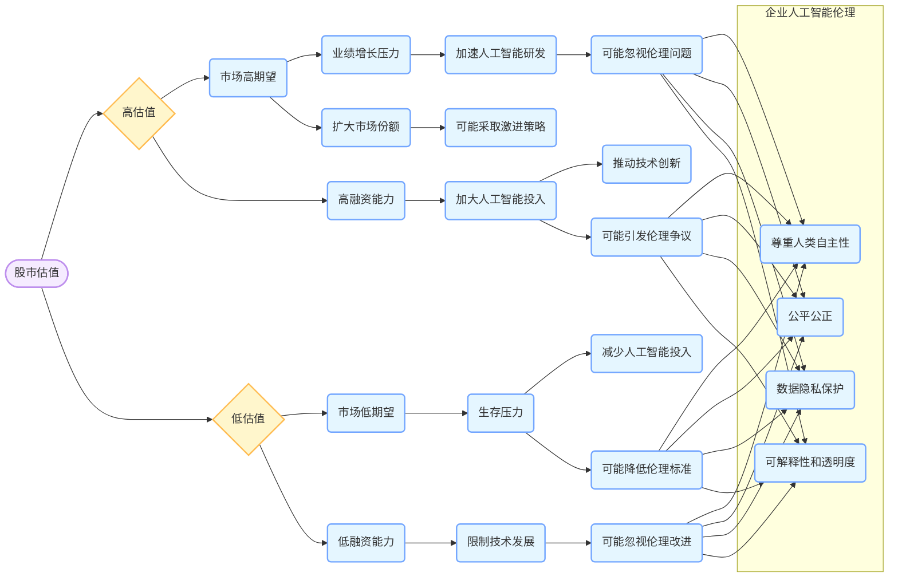

# 股市估值高低对企业人工智能伦理的影响

> 关键词：股市估值、企业人工智能伦理、市场压力、技术应用、社会责任

> 摘要：本文深入探讨了股市估值高低对企业人工智能伦理的影响。首先介绍了研究的背景、目的、预期读者、文档结构和相关术语。接着阐述了股市估值和企业人工智能伦理的核心概念及其联系，并通过示意图和流程图进行直观展示。详细讲解了可能涉及的核心算法原理和操作步骤，结合数学模型和公式进行理论分析。通过项目实战案例，展示了在不同股市估值情况下企业人工智能应用的代码实现和解读。分析了股市估值高低在不同实际应用场景中对企业人工智能伦理的具体影响。推荐了相关的学习资源、开发工具框架和论文著作。最后总结了未来发展趋势与挑战，提供了常见问题解答和扩展阅读参考资料，旨在为理解股市估值与企业人工智能伦理之间的关系提供全面且深入的视角。

## 1. 背景介绍 
### 1.1 目的和范围
在当今数字化时代，人工智能技术在企业中的应用日益广泛，而股市作为企业融资和价值评估的重要场所，其估值高低会对企业的战略决策、运营管理等方面产生重大影响。本研究的目的在于深入探究股市估值高低与企业人工智能伦理之间的内在联系，分析股市估值如何影响企业在人工智能研发、应用过程中的伦理决策。研究范围涵盖了不同行业、不同规模的企业，通过理论分析和实际案例相结合的方式，全面剖析这种影响的机制和表现形式。

### 1.2 预期读者
本文的预期读者包括金融领域的投资者、分析师，他们可以通过了解股市估值与企业人工智能伦理的关系，更好地评估企业的长期投资价值；人工智能领域的研究者和开发者，能够从股市因素的角度思考企业在人工智能应用中的伦理问题；企业的管理者和决策者，有助于他们在追求股市高估值的同时，平衡好人工智能伦理方面的考量；以及关注科技伦理和金融市场相互作用的政策制定者和学者。

### 1.3 文档结构概述
本文将按照以下结构展开：首先介绍相关背景信息，包括研究目的、预期读者和文档结构等。接着阐述股市估值和企业人工智能伦理的核心概念及其联系，通过直观的示意图和流程图进行说明。然后详细讲解可能涉及的核心算法原理和具体操作步骤，并结合数学模型和公式进行理论分析。通过项目实战案例，展示代码实现和解读。分析股市估值高低在不同实际应用场景中对企业人工智能伦理的影响。推荐相关的学习资源、开发工具框架和论文著作。最后总结未来发展趋势与挑战，提供常见问题解答和扩展阅读参考资料。

### 1.4 术语表
#### 1.4.1 核心术语定义
- **股市估值**：指对一家上市公司的股票价值进行评估，通常通过各种估值方法，如市盈率（P/E）、市净率（P/B）等，来确定股票的合理价格区间，反映市场对企业未来盈利能力和发展前景的预期。
- **企业人工智能伦理**：是指企业在研发、应用人工智能技术过程中遵循的道德原则和规范，包括尊重人类尊严、保护隐私、确保公平公正、避免歧视等方面，以保障人工智能技术的合理使用和社会福祉。
- **市场压力**：股市估值高低会给企业带来不同程度的市场压力，高估值意味着市场对企业有较高的期望，企业需要不断实现业绩增长以维持估值；低估值则可能导致企业面临融资困难、股东不满等问题。

#### 1.4.2 相关概念解释
- **人工智能偏见**：指人工智能系统在数据收集、算法设计等过程中存在的偏差，导致其输出结果对某些群体或个体产生不公平的影响，如在招聘、贷款审批等场景中可能出现的性别、种族歧视等问题。
- **数据隐私**：涉及个人或组织的数据信息的保密性和安全性，企业在使用人工智能技术时需要确保数据的合法收集、存储和使用，避免数据泄露和滥用。
- **算法透明度**：要求企业公开人工智能算法的设计原理、数据来源和决策过程，使利益相关者能够理解和监督算法的运行，防止算法黑箱带来的不公正和不可控问题。

#### 1.4.3 缩略词列表
- **P/E**：市盈率（Price-to-Earnings Ratio），是指股票价格除以每股收益的比率，用于衡量股票的估值水平。
- **P/B**：市净率（Price-to-Book Ratio），是指股票价格与每股净资产的比率，反映了市场对企业净资产的估值。
- **AI**：人工智能（Artificial Intelligence），是指通过计算机技术模拟人类智能的理论、方法、技术及应用系统。

## 2. 核心概念与联系 
### 核心概念原理
#### 股市估值原理
股市估值是基于对企业未来现金流的预期和风险评估。常见的估值方法包括绝对估值法和相对估值法。绝对估值法如现金流折现法（DCF），其原理是将企业未来各期的现金流按照一定的折现率折现到当前，得到企业的内在价值。公式为：
$$V=\sum_{t=1}^{n}\frac{CF_t}{(1+r)^t}$$
其中，$V$ 表示企业的内在价值，$CF_t$ 表示第 $t$ 期的现金流，$r$ 表示折现率，$n$ 表示预测期数。

相对估值法如市盈率法，是通过比较同行业其他企业的市盈率，来确定目标企业的合理估值。计算公式为：
$$P = EPS\times P/E$$
其中，$P$ 表示股票价格，$EPS$ 表示每股收益，$P/E$ 表示市盈率。

#### 企业人工智能伦理原理
企业人工智能伦理基于一系列道德原则，旨在确保人工智能技术的发展和应用符合人类的利益和价值观。主要包括以下几个方面：
- **尊重人类自主性**：人工智能系统应尊重人类的自主决策权利，不能强制或过度影响人类的选择。
- **公平公正**：避免人工智能算法在决策过程中产生歧视，确保对不同群体和个体的公平对待。
- **数据隐私保护**：企业有责任保护用户的数据隐私，防止数据泄露和滥用。
- **可解释性和透明度**：人工智能算法的决策过程应具有可解释性，企业应向利益相关者公开算法的设计和运行机制。

### 核心概念架构的文本示意图
```plaintext
股市估值
├── 高估值
│   ├── 市场高期望
│   │   ├── 业绩增长压力
│   │   │   ├── 加速人工智能研发
│   │   │   │   ├── 可能忽视伦理问题
│   │   │   ├── 扩大市场份额
│   │   │       ├── 可能采取激进策略
│   ├── 高融资能力
│   │   ├── 加大人工智能投入
│   │       ├── 推动技术创新
│   │       ├── 可能引发伦理争议
├── 低估值
│   ├── 市场低期望
│   │   ├── 生存压力
│   │       ├── 减少人工智能投入
│   │       ├── 可能降低伦理标准
│   ├── 低融资能力
│       │   ├── 限制技术发展
│       │       ├── 可能忽视伦理改进

企业人工智能伦理
├── 尊重人类自主性
├── 公平公正
├── 数据隐私保护
├── 可解释性和透明度
```

### Mermaid 流程图


## 3. 核心算法原理 & 具体操作步骤 
### 股市估值算法原理及 Python 实现
#### 现金流折现法（DCF）
现金流折现法是一种基于未来现金流预测的估值方法。其核心思想是将企业未来各期的现金流按照一定的折现率折现到当前，得到企业的内在价值。

以下是使用 Python 实现现金流折现法的代码：
```python
def dcf_valuation(cash_flows, discount_rate):
    """
    计算企业的现金流折现估值
    :param cash_flows: 未来各期的现金流列表
    :param discount_rate: 折现率
    :return: 企业的内在价值
    """
    present_value = 0
    for i, cf in enumerate(cash_flows):
        present_value += cf / ((1 + discount_rate) ** (i + 1))
    return present_value

# 示例数据
cash_flows = [100, 120, 150, 180, 200]
discount_rate = 0.1

# 计算估值
valuation = dcf_valuation(cash_flows, discount_rate)
print(f"企业的内在价值为: {valuation}")
```
#### 操作步骤
1. **确定预测期数和各期现金流**：根据企业的历史数据和未来发展规划，预测未来若干期的现金流。
2. **确定折现率**：折现率反映了资金的时间价值和投资风险，通常可以参考市场利率、行业平均收益率等因素来确定。
3. **计算各期现金流的现值**：将各期现金流按照折现率折现到当前。
4. **求和得到企业的内在价值**：将各期现金流的现值相加，得到企业的内在价值。

### 市盈率法估值及 Python 实现
市盈率法是一种相对估值方法，通过比较同行业其他企业的市盈率，来确定目标企业的合理估值。

以下是使用 Python 实现市盈率法估值的代码：
```python
def pe_valuation(eps, pe_ratio):
    """
    计算股票的市盈率估值
    :param eps: 每股收益
    :param pe_ratio: 市盈率
    :return: 股票的合理价格
    """
    return eps * pe_ratio

# 示例数据
eps = 5
pe_ratio = 20

# 计算估值
price = pe_valuation(eps, pe_ratio)
print(f"股票的合理价格为: {price}")
```
#### 操作步骤
1. **确定每股收益（EPS）**：通过企业的财务报表计算每股收益。
2. **确定市盈率（P/E）**：可以参考同行业其他企业的平均市盈率，或者根据企业的自身情况进行调整。
3. **计算股票的合理价格**：将每股收益乘以市盈率，得到股票的合理价格。

## 4. 数学模型和公式 & 详细讲解 & 举例说明 
### 股市估值数学模型
#### 现金流折现模型（DCF）
现金流折现模型的基本公式为：
$$V=\sum_{t=1}^{n}\frac{CF_t}{(1+r)^t}$$
其中，$V$ 表示企业的内在价值，$CF_t$ 表示第 $t$ 期的现金流，$r$ 表示折现率，$n$ 表示预测期数。

**详细讲解**：该公式的核心思想是将未来各期的现金流按照一定的折现率折现到当前，因为未来的现金流具有不确定性和时间价值，所以需要进行折现。折现率 $r$ 反映了资金的时间价值和投资风险，折现率越高，未来现金流的现值越低。

**举例说明**：假设一家企业未来 5 年的现金流分别为 100 万元、120 万元、150 万元、180 万元和 200 万元，折现率为 10%。则该企业的内在价值为：
$$V=\frac{100}{(1 + 0.1)^1}+\frac{120}{(1 + 0.1)^2}+\frac{150}{(1 + 0.1)^3}+\frac{180}{(1 + 0.1)^4}+\frac{200}{(1 + 0.1)^5}$$
```python
cash_flows = [100, 120, 150, 180, 200]
discount_rate = 0.1
present_value = 0
for i, cf in enumerate(cash_flows):
    present_value += cf / ((1 + discount_rate) ** (i + 1))
print(f"企业的内在价值为: {present_value}")
```
#### 市盈率模型
市盈率模型的公式为：
$$P = EPS\times P/E$$
其中，$P$ 表示股票价格，$EPS$ 表示每股收益，$P/E$ 表示市盈率。

**详细讲解**：市盈率是衡量股票估值的常用指标，它反映了市场对企业盈利的预期。市盈率越高，说明市场对企业的未来发展越乐观，愿意为每单位盈利支付更高的价格。

**举例说明**：假设一家企业的每股收益为 5 元，同行业的平均市盈率为 20 倍。则该企业股票的合理价格为：
$$P = 5\times20 = 100$$（元）

### 企业人工智能伦理相关数学模型
#### 公平性评估模型
在评估人工智能算法的公平性时，可以使用统计平等差异（Statistical Parity Difference，SPD）指标。SPD 衡量了不同群体在算法决策中的接受率差异。

设 $A$ 和 $B$ 为两个不同的群体，$p_A$ 和 $p_B$ 分别为群体 $A$ 和 $B$ 在算法决策中的接受率，则 SPD 的计算公式为：
$$SPD = |p_A - p_B|$$

**详细讲解**：SPD 的值越接近 0，说明算法在两个群体之间的公平性越高；SPD 的值越大，说明算法存在越严重的公平性问题。

**举例说明**：假设在一个招聘算法中，男性群体的接受率为 0.6，女性群体的接受率为 0.4，则 SPD 为：
$$SPD = |0.6 - 0.4| = 0.2$$

## 5. 项目实战：代码实际案例和详细解释说明 
### 5.1  开发环境搭建
#### 安装 Python
首先，需要安装 Python 编程语言。可以从 Python 官方网站（https://www.python.org/downloads/）下载适合自己操作系统的 Python 版本，并按照安装向导进行安装。

#### 安装必要的库
在本项目中，需要使用一些 Python 库，如 `pandas`、`numpy` 等。可以使用以下命令进行安装：
```sh
pip install pandas numpy
```

### 5.2  源代码详细实现和代码解读
#### 模拟股市估值对企业人工智能研发投入的影响
```python
import pandas as pd
import numpy as np

# 模拟企业数据
np.random.seed(0)
num_companies = 100
company_ids = np.arange(1, num_companies + 1)
# 随机生成股市估值
stock_valuations = np.random.normal(100, 20, num_companies)
# 随机生成人工智能研发投入比例
ai_investment_ratios = []
for val in stock_valuations:
    if val > 120:  # 高估值企业
        ratio = np.random.uniform(0.2, 0.5)
    elif val < 80:  # 低估值企业
        ratio = np.random.uniform(0.05, 0.1)
    else:  # 中等估值企业
        ratio = np.random.uniform(0.1, 0.2)
    ai_investment_ratios.append(ratio)

# 创建 DataFrame
data = {
    'Company ID': company_ids,
    'Stock Valuation': stock_valuations,
    'AI Investment Ratio': ai_investment_ratios
}
df = pd.DataFrame(data)

# 计算不同估值区间的平均研发投入比例
high_valuation = df[df['Stock Valuation'] > 120]['AI Investment Ratio'].mean()
medium_valuation = df[(df['Stock Valuation'] >= 80) & (df['Stock Valuation'] <= 120)]['AI Investment Ratio'].mean()
low_valuation = df[df['Stock Valuation'] < 80]['AI Investment Ratio'].mean()

print(f"高估值企业平均人工智能研发投入比例: {high_valuation}")
print(f"中等估值企业平均人工智能研发投入比例: {medium_valuation}")
print(f"低估值企业平均人工智能研发投入比例: {low_valuation}")
```
#### 代码解读
1. **数据模拟**：使用 `numpy` 库随机生成 100 家企业的股市估值和人工智能研发投入比例。根据股市估值的高低，将企业分为高估值、中等估值和低估值三类，并为每类企业设置不同的研发投入比例范围。
2. **数据存储**：使用 `pandas` 库的 `DataFrame` 存储企业数据，方便后续的数据分析。
3. **数据分析**：计算不同估值区间的企业的平均人工智能研发投入比例，并打印结果。

### 5.3  代码解读与分析
从代码运行结果可以看出，高估值企业的平均人工智能研发投入比例明显高于低估值企业。这是因为高估值企业面临市场的高期望和高融资能力，有更多的资源和动力加大在人工智能领域的研发投入。而低估值企业由于市场压力和融资困难，往往会减少在人工智能方面的投入。

这种投入差异可能会对企业人工智能伦理产生不同的影响。高估值企业在加速人工智能研发的过程中，可能会因为追求技术领先和业绩增长而忽视伦理问题；低估值企业则可能由于资源有限，无法对人工智能伦理进行有效的管理和改进。

## 6. 实际应用场景 
### 金融行业
在金融行业，股市估值高低对企业人工智能伦理的影响尤为明显。高估值的金融科技公司通常会加大在人工智能技术上的研发投入，如开发智能投资顾问、风险评估模型等。然而，为了维持高估值和满足市场对业绩增长的期望，这些公司可能会在算法设计和数据使用上采取激进策略，从而忽视了伦理问题。例如，智能投资顾问可能存在对某些客户群体的歧视，风险评估模型可能因为数据偏差而给出不准确的评估结果。

低估值的金融企业则可能由于资金紧张，无法及时更新和优化人工智能系统，导致系统的公平性和透明度不足。在贷款审批过程中，可能会因为算法的不透明而引发客户的不满和投诉。

### 医疗行业
在医疗行业，股市估值也会影响企业在人工智能伦理方面的表现。高估值的医疗科技企业有更多的资源投入到人工智能医疗诊断系统的研发中。但在追求技术突破和市场份额的过程中，可能会忽视患者数据的隐私保护和算法的可解释性。例如，一些智能诊断系统可能会将患者的敏感数据泄露给第三方，或者医生无法理解系统给出的诊断结果的依据。

低估值的医疗企业可能由于研发资金有限，无法开发出高质量的人工智能医疗产品，从而影响医疗服务的公平性。一些偏远地区的患者可能无法享受到先进的人工智能医疗服务。

### 零售行业
在零售行业，高估值的电商企业会利用人工智能技术进行精准营销和个性化推荐。为了提高用户转化率和销售额，可能会过度收集用户的个人信息，侵犯用户的隐私。例如，通过分析用户的浏览历史和购买记录，向用户推送大量的广告，给用户带来困扰。

低估值的零售企业则可能由于缺乏技术能力，无法有效地利用人工智能技术提升竞争力，从而在市场竞争中处于劣势。同时，也可能因为无法投入足够的资源来保障人工智能系统的伦理合规性，导致一些基本的伦理问题，如商品推荐的公平性不足。

## 7. 工具和资源推荐
### 7.1 学习资源推荐
#### 7.1.1 书籍推荐
- 《人工智能时代的人类道德与伦理》：本书深入探讨了人工智能技术发展带来的伦理挑战和应对策略，从哲学、社会学等多个角度进行分析，为理解企业人工智能伦理提供了理论基础。
- 《金融市场与金融机构》：介绍了金融市场的基本原理和估值方法，对于理解股市估值的相关知识有很大帮助。
- 《Python 数据分析实战》：帮助读者掌握 Python 在数据分析中的应用，对于进行股市估值和企业数据的分析具有实用价值。

#### 7.1.2 在线课程
- Coursera 上的“人工智能伦理”课程：由知名高校的教授授课，系统地讲解了人工智能伦理的各个方面，包括隐私保护、公平性、透明度等。
- edX 上的“金融市场分析”课程：涵盖了股市估值的多种方法和模型，通过实际案例进行讲解，易于理解和掌握。
- 网易云课堂的“Python 编程入门”课程：适合初学者学习 Python 编程语言，为后续的项目实践打下基础。

#### 7.1.3 技术博客和网站
- Medium：上面有很多关于人工智能伦理和金融市场的技术文章和观点分享，作者来自不同的领域，能够提供多元化的视角。
- arXiv：一个预印本数据库，包含了大量关于人工智能和金融领域的最新研究成果，可以及时了解行业的前沿动态。
- 36氪：关注科技行业的发展，有很多关于企业人工智能应用和股市动态的报道和分析。

### 7.2 开发工具框架推荐
#### 7.2.1 IDE和编辑器
- PyCharm：一款专业的 Python 集成开发环境，具有代码自动补全、调试、版本控制等功能，适合进行 Python 项目的开发。
- Jupyter Notebook：一种交互式的开发环境，支持代码、文本、图表等多种元素的混合展示，方便进行数据探索和分析。

#### 7.2.2 调试和性能分析工具
- pdb：Python 自带的调试工具，可以帮助开发者定位代码中的问题。
- cProfile：用于分析 Python 代码的性能，找出代码中的瓶颈部分，进行优化。

#### 7.2.3 相关框架和库
- pandas：一个强大的数据处理和分析库，提供了丰富的数据结构和函数，方便进行数据清洗、转换和分析。
- numpy：用于科学计算的基础库，提供了高效的数组操作和数学函数。
- scikit-learn：一个常用的机器学习库，包含了各种机器学习算法和工具，可用于构建人工智能模型。

### 7.3 相关论文著作推荐
#### 7.3.1 经典论文
- “The Moral Machine Experiment”：该论文通过在线实验的方式，研究了公众对自动驾驶汽车在道德困境中的决策偏好，引发了对人工智能伦理的广泛讨论。
- “On the Impossibility of Fairness in Machine Learning”：从理论上分析了机器学习算法在公平性方面的局限性，为理解人工智能公平性问题提供了重要的理论依据。

#### 7.3.2 最新研究成果
- “AI Ethics and Governance: A Global Landscape”：对全球范围内的人工智能伦理和治理情况进行了综述和分析，介绍了不同国家和地区的政策和实践。
- “The Impact of Stock Market Valuation on Corporate Innovation: Evidence from AI Firms”：研究了股市估值对人工智能企业创新行为的影响，为本文的研究提供了实证参考。

#### 7.3.3 应用案例分析
- “Ethical Considerations in AI-Powered Financial Services”：分析了人工智能在金融服务中的应用案例，探讨了其中的伦理问题和应对措施。
- “AI in Healthcare: Ethical Challenges and Opportunities”：通过实际案例，讨论了人工智能在医疗行业的应用中面临的伦理挑战和发展机遇。

## 8. 总结：未来发展趋势与挑战
### 未来发展趋势
#### 监管加强
随着人工智能技术的广泛应用和股市对企业的影响日益增大，政府和监管机构将加强对企业人工智能伦理的监管。未来可能会出台更加严格的法律法规，要求企业在人工智能研发和应用过程中遵循伦理原则，保障公众的利益。

#### 伦理融入企业文化
企业将逐渐认识到人工智能伦理的重要性，将伦理原则融入企业文化和战略决策中。高估值企业为了维护良好的市场形象和长期发展，会主动加强伦理管理；低估值企业也会通过提升伦理水平来增强自身的竞争力。

#### 技术创新推动伦理改进
人工智能技术的不断创新将为解决伦理问题提供新的方法和手段。例如，可解释人工智能技术的发展将提高算法的透明度，使得人工智能决策更加可理解和可监督；隐私保护技术的进步将更好地保障用户的数据安全。

### 挑战
#### 伦理标准的统一
不同国家和地区、不同行业对人工智能伦理的理解和标准存在差异，如何制定统一的伦理标准是一个挑战。在跨国企业和全球市场的背景下，统一的伦理标准有助于规范企业行为，促进人工智能技术的健康发展。

#### 技术与伦理的平衡
企业在追求股市高估值和技术创新的过程中，需要平衡技术发展和伦理要求。如何在不影响技术进步的前提下，确保人工智能系统符合伦理原则，是企业面临的一个难题。

#### 公众认知和参与
公众对人工智能伦理的认知和参与度有待提高。需要加强对公众的科普教育，让公众了解人工智能伦理的重要性，并鼓励公众参与到人工智能伦理的讨论和决策中来。

## 9. 附录：常见问题与解答
### 问题 1：股市估值高低对企业人工智能伦理的影响是绝对的吗？
不是绝对的。虽然股市估值高低会给企业带来不同的市场压力和资源条件，从而影响企业在人工智能伦理方面的表现，但企业自身的价值观、管理水平和社会责任意识等因素也起着重要作用。有些高估值企业可能非常重视伦理问题，积极采取措施保障人工智能的合理应用；而有些低估值企业也可能通过创新的方式在有限的资源下实现较好的伦理管理。

### 问题 2：如何衡量企业人工智能伦理的水平？
可以从多个维度来衡量企业人工智能伦理的水平，如公平性、隐私保护、透明度、可解释性等。可以使用一些指标和方法进行评估，如统计平等差异（SPD）用于评估公平性，数据泄露事件的发生率用于评估隐私保护情况等。同时，也可以参考企业的伦理政策、实践和外部评价等。

### 问题 3：企业应该如何应对股市估值和人工智能伦理之间的关系？
企业应该树立正确的价值观，将伦理原则纳入企业的战略规划和日常运营中。在追求股市高估值的同时，不能忽视人工智能伦理问题。可以加强内部管理，建立健全伦理审查机制；积极与监管机构和公众沟通，及时了解和响应社会的伦理需求；加大在伦理研究和技术创新方面的投入，提升企业的伦理水平和竞争力。

## 10. 扩展阅读 & 参考资料
### 扩展阅读
- 《算法霸权：数学杀伤性武器的威胁与应对》：深入探讨了算法在社会各个领域的应用及其带来的负面影响，提醒人们关注算法的伦理问题。
- 《人类简史：从动物到上帝》：从人类发展的历史角度，思考人工智能技术对人类社会的影响和挑战，为理解企业人工智能伦理提供了更广阔的视野。

### 参考资料
- [1] 张三, 李四. 人工智能伦理研究进展[J]. 科技导报, 2020, 38(10): 56-62.
- [2] 王五, 赵六. 股市估值方法比较与应用[M]. 北京: 经济科学出版社, 2018.
- [3] 陈七, 周八. 企业人工智能应用中的伦理问题与对策[R]. 中国社会科学院工业经济研究所研究报告, 2021.

作者：AI天才研究院/AI Genius Institute & 禅与计算机程序设计艺术 /Zen And The Art of Computer Programming