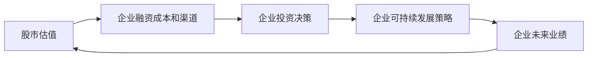

# 股市估值高低对企业可持续发展策略的影响

> 关键词：股市估值、企业可持续发展策略、市场预期、资本运作、长期战略

> 摘要：本文深入探讨了股市估值高低对企业可持续发展策略的多方面影响。从股市估值的基本概念出发，详细分析了其与企业可持续发展策略之间的内在联系，包括对企业融资、投资、经营管理等方面的作用机制。通过阐述核心算法原理、数学模型，结合实际项目案例，揭示了股市估值高低如何引导企业制定不同的可持续发展策略。同时，介绍了在该领域的实际应用场景、相关工具和资源，最后对未来发展趋势与挑战进行了总结，并提供了常见问题解答和扩展阅读参考资料，旨在为企业管理者和投资者提供全面且深入的理论与实践指导。

## 1. 背景介绍 
### 1.1 目的和范围
本研究的主要目的是深入剖析股市估值高低对企业可持续发展策略的具体影响。通过综合运用金融、管理等多学科知识，全面探讨不同股市估值水平下企业在融资、投资、运营管理等方面所采取的策略及其背后的逻辑。研究范围涵盖了各种类型和规模的企业，包括上市企业和准备上市的企业，旨在为企业制定科学合理的可持续发展策略提供理论支持和实践参考。

### 1.2 预期读者
本文预期读者包括企业管理者、投资者、金融分析师、学者以及对股市和企业发展感兴趣的人士。企业管理者可以从本文中获取关于如何根据股市估值调整企业可持续发展策略的建议；投资者可以更好地理解企业行为背后的原因，从而做出更明智的投资决策；金融分析师可以将本文的观点和方法应用于实际的分析工作中；学者可以在本文的基础上开展进一步的研究；而对股市和企业发展感兴趣的人士则可以通过本文了解相关领域的基本知识和最新动态。

### 1.3 文档结构概述
本文将按照以下结构展开：首先介绍股市估值和企业可持续发展策略的核心概念及其联系，通过文本示意图和 Mermaid 流程图进行直观展示；接着阐述与股市估值和企业可持续发展策略相关的核心算法原理，并给出具体操作步骤，同时用 Python 源代码详细说明；然后介绍相关的数学模型和公式，并结合实际例子进行详细讲解；之后通过项目实战，给出代码实际案例并进行详细解释说明；再探讨股市估值高低在实际中的应用场景；推荐相关的学习资源、开发工具框架和论文著作；最后总结未来发展趋势与挑战，提供常见问题解答和扩展阅读参考资料。

### 1.4 术语表
#### 1.4.1 核心术语定义
- **股市估值**：指对上市公司股票价值的评估，通常通过各种估值方法，如市盈率（P/E）、市净率（P/B）、现金流折现法（DCF）等，来确定股票的合理价格范围。
- **企业可持续发展策略**：企业为了实现长期的生存和发展，在经济、社会和环境等多个维度上制定的一系列战略规划和行动方案，旨在平衡当前利益和未来发展需求。
- **市场预期**：投资者对企业未来业绩和发展前景的预期，会影响股市估值和企业的市场表现。
- **资本运作**：企业通过融资、投资、并购等方式，对资本进行优化配置，以实现企业价值最大化的活动。

#### 1.4.2 相关概念解释
- **市盈率（P/E）**：是指股票价格除以每股收益（EPS）的比率，反映了投资者为获取每一元利润所愿意支付的价格，是衡量股票估值的常用指标之一。
- **市净率（P/B）**：是指股票价格除以每股净资产的比率，用于评估股票相对于其账面价值的溢价程度，也是常用的估值指标。
- **现金流折现法（DCF）**：通过预测企业未来的现金流，并将其折现到当前时点，来计算企业的内在价值，是一种较为复杂但更具理论基础的估值方法。

#### 1.4.3 缩略词列表
- **P/E**：市盈率（Price-to-Earnings Ratio）
- **P/B**：市净率（Price-to-Book Ratio）
- **DCF**：现金流折现法（Discounted Cash Flow）

## 2. 核心概念与联系 
### 核心概念原理
股市估值是投资者对企业未来盈利能力和市场价值的综合评估。它受到多种因素的影响，包括企业的财务状况、行业前景、宏观经济环境等。较高的股市估值意味着投资者对企业的未来发展充满信心，愿意为其股票支付较高的价格；相反，较低的股市估值则反映了投资者对企业的担忧或不看好。

企业可持续发展策略则是企业为了实现长期稳定发展而制定的战略规划。它包括企业的产品研发、市场拓展、成本控制、社会责任等多个方面。企业需要在不同的发展阶段和市场环境下，灵活调整可持续发展策略，以适应变化并实现自身价值的最大化。

股市估值与企业可持续发展策略之间存在着密切的联系。股市估值的高低会影响企业的融资成本和融资渠道，进而影响企业的投资决策和发展战略。同时，企业的可持续发展策略也会影响其未来的业绩表现，从而反过来影响股市估值。

### 文本示意图
```plaintext
股市估值
    |
    | 影响
    |
企业融资成本和渠道
    |
    | 决定
    |
企业投资决策
    |
    | 形成
    |
企业可持续发展策略
    |
    | 影响
    |
企业未来业绩
    |
    | 反馈
    |
股市估值
```

### Mermaid 流程图


## 3. 核心算法原理 & 具体操作步骤 
### 股市估值算法原理
#### 市盈率法
市盈率法是一种简单常用的股市估值方法。其原理是通过比较同行业或类似企业的市盈率，来估算目标企业的股票价值。计算公式为：

$$V = EPS \times P/E$$

其中，$V$ 表示股票价值，$EPS$ 表示每股收益，$P/E$ 表示市盈率。

#### Python 代码实现
```python
def pe_valuation(eps, pe):
    """
    使用市盈率法计算股票价值
    :param eps: 每股收益
    :param pe: 市盈率
    :return: 股票价值
    """
    return eps * pe

# 示例
eps = 2.0
pe = 15
stock_value = pe_valuation(eps, pe)
print(f"使用市盈率法计算的股票价值为: {stock_value}")
```

#### 市净率法
市净率法是通过比较企业的市净率与同行业平均市净率，来评估企业股票的价值。计算公式为：

$$V = BVPS \times P/B$$

其中，$V$ 表示股票价值，$BVPS$ 表示每股净资产，$P/B$ 表示市净率。

#### Python 代码实现
```python
def pb_valuation(bvps, pb):
    """
    使用市净率法计算股票价值
    :param bvps: 每股净资产
    :param pb: 市净率
    :return: 股票价值
    """
    return bvps * pb

# 示例
bvps = 10.0
pb = 2.0
stock_value = pb_valuation(bvps, pb)
print(f"使用市净率法计算的股票价值为: {stock_value}")
```

#### 现金流折现法
现金流折现法是一种更为复杂但更具理论基础的估值方法。其原理是将企业未来的现金流折现到当前时点，以计算企业的内在价值。具体步骤如下：
1. 预测企业未来的自由现金流（FCF）。
2. 确定折现率（r），通常可以使用加权平均资本成本（WACC）。
3. 将未来各期的自由现金流折现到当前时点。
4. 计算企业的内在价值，即各期折现现金流的总和。

计算公式为：

$$V = \sum_{t=1}^{n} \frac{FCF_t}{(1 + r)^t} + \frac{TV}{(1 + r)^n}$$

其中，$V$ 表示企业内在价值，$FCF_t$ 表示第 $t$ 期的自由现金流，$r$ 表示折现率，$n$ 表示预测期数，$TV$ 表示终值。

#### Python 代码实现
```python
def dcf_valuation(fcf_list, r, tv):
    """
    使用现金流折现法计算企业内在价值
    :param fcf_list: 未来各期自由现金流列表
    :param r: 折现率
    :param tv: 终值
    :return: 企业内在价值
    """
    value = 0
    n = len(fcf_list)
    for t in range(n):
        value += fcf_list[t] / ((1 + r) ** (t + 1))
    value += tv / ((1 + r) ** n)
    return value

# 示例
fcf_list = [100, 120, 150, 180, 200]
r = 0.1
tv = 2500
company_value = dcf_valuation(fcf_list, r, tv)
print(f"使用现金流折现法计算的企业内在价值为: {company_value}")
```

### 企业可持续发展策略制定步骤
1. **环境分析**：对企业所处的宏观经济环境、行业竞争环境、政策法规环境等进行全面分析，了解企业面临的机遇和挑战。
2. **企业评估**：评估企业的自身资源和能力，包括财务状况、技术实力、人力资源等，明确企业的优势和劣势。
3. **目标设定**：根据环境分析和企业评估的结果，制定企业的长期和短期发展目标，包括市场份额、盈利能力、社会责任等方面的目标。
4. **策略选择**：根据目标设定，选择适合企业的可持续发展策略，如产品创新策略、市场拓展策略、成本控制策略等。
5. **实施与监控**：将选定的策略付诸实施，并建立有效的监控机制，及时调整策略以适应环境变化。

## 4. 数学模型和公式 & 详细讲解 & 举例说明 
### 市盈率模型
#### 公式
$$P/E = \frac{P}{EPS}$$

其中，$P$ 表示股票价格，$EPS$ 表示每股收益。

#### 详细讲解
市盈率反映了投资者为获取每一元利润所愿意支付的价格。较高的市盈率意味着投资者对企业的未来发展前景较为乐观，愿意为其支付较高的价格；较低的市盈率则可能表示投资者对企业的未来发展存在担忧。

#### 举例说明
假设 A 公司的股票价格为 30 元，每股收益为 2 元，则其市盈率为：

$$P/E = \frac{30}{2} = 15$$

这意味着投资者为了获取 A 公司每一元的利润，愿意支付 15 元的价格。如果同行业的平均市盈率为 20，那么 A 公司的股票可能被低估，具有一定的投资价值。

### 市净率模型
#### 公式
$$P/B = \frac{P}{BVPS}$$

其中，$P$ 表示股票价格，$BVPS$ 表示每股净资产。

#### 详细讲解
市净率用于评估股票相对于其账面价值的溢价程度。一般来说，市净率较高的企业可能具有较高的品牌价值、技术实力或市场竞争力；市净率较低的企业可能存在资产质量不佳或市场认可度不高等问题。

#### 举例说明
假设 B 公司的股票价格为 20 元，每股净资产为 10 元，则其市净率为：

$$P/B = \frac{20}{10} = 2$$

如果同行业的平均市净率为 3，那么 B 公司的股票可能被低估。

### 现金流折现模型
#### 公式
$$V = \sum_{t=1}^{n} \frac{FCF_t}{(1 + r)^t} + \frac{TV}{(1 + r)^n}$$

其中，$V$ 表示企业内在价值，$FCF_t$ 表示第 $t$ 期的自由现金流，$r$ 表示折现率，$n$ 表示预测期数，$TV$ 表示终值。

#### 详细讲解
现金流折现模型的核心思想是将企业未来的现金流折现到当前时点，以反映其真实的价值。自由现金流是指企业在满足了所有必要的投资和运营成本后，剩余的可分配给股东和债权人的现金流量。折现率反映了投资者对投资风险的预期，风险越高，折现率越高。终值是指预测期结束后企业的持续经营价值。

#### 举例说明
假设 C 公司未来 5 年的自由现金流分别为 100 万元、120 万元、150 万元、180 万元和 200 万元，折现率为 10%，预测期结束后的终值为 2500 万元。则 C 公司的内在价值为：

$$V = \frac{100}{(1 + 0.1)^1} + \frac{120}{(1 + 0.1)^2} + \frac{150}{(1 + 0.1)^3} + \frac{180}{(1 + 0.1)^4} + \frac{200}{(1 + 0.1)^5} + \frac{2500}{(1 + 0.1)^5}$$

```python
fcf_list = [100, 120, 150, 180, 200]
r = 0.1
tv = 2500
company_value = dcf_valuation(fcf_list, r, tv)
print(f"C 公司的内在价值为: {company_value} 万元")
```

## 5. 项目实战：代码实际案例和详细解释说明 
### 5.1  开发环境搭建
#### 操作系统
可以选择 Windows、Linux 或 macOS 等常见操作系统。

#### 编程语言
使用 Python 作为开发语言，因为 Python 具有丰富的金融分析库和简洁易读的语法。

#### 开发工具
推荐使用 Anaconda 作为 Python 环境管理工具，Jupyter Notebook 作为代码编辑和运行环境。

#### 安装必要的库
在命令行中使用以下命令安装必要的库：
```sh
pip install pandas numpy matplotlib
```

### 5.2  源代码详细实现和代码解读
#### 案例：根据股市估值数据制定企业投资策略
```python
import pandas as pd
import numpy as np
import matplotlib.pyplot as plt

# 模拟股市估值数据
data = {
    'Year': [2016, 2017, 2018, 2019, 2020, 2021, 2022],
    'PE': [12, 15, 18, 20, 16, 14, 13],
    'PB': [1.5, 1.8, 2.0, 2.2, 1.9, 1.7, 1.6]
}
df = pd.DataFrame(data)

# 计算估值指标的均值和标准差
pe_mean = df['PE'].mean()
pe_std = df['PE'].std()
pb_mean = df['PB'].mean()
pb_std = df['PB'].std()

# 根据估值指标制定投资策略
df['PE_Strategy'] = np.where(df['PE'] < pe_mean - pe_std, '买入', np.where(df['PE'] > pe_mean + pe_std, '卖出', '持有'))
df['PB_Strategy'] = np.where(df['PB'] < pb_mean - pb_std, '买入', np.where(df['PB'] > pb_mean + pb_std, '卖出', '持有'))

# 可视化估值数据和投资策略
plt.figure(figsize=(12, 6))

plt.subplot(2, 1, 1)
plt.plot(df['Year'], df['PE'], label='PE')
plt.axhline(y=pe_mean, color='r', linestyle='--', label='PE 均值')
plt.axhline(y=pe_mean - pe_std, color='g', linestyle='--', label='PE 均值 - 标准差')
plt.axhline(y=pe_mean + pe_std, color='m', linestyle='--', label='PE 均值 + 标准差')
for i, row in df.iterrows():
    plt.text(row['Year'], row['PE'], row['PE_Strategy'], ha='center', va='bottom')
plt.title('市盈率（PE）估值与投资策略')
plt.xlabel('年份')
plt.ylabel('PE')
plt.legend()

plt.subplot(2, 1, 2)
plt.plot(df['Year'], df['PB'], label='PB')
plt.axhline(y=pb_mean, color='r', linestyle='--', label='PB 均值')
plt.axhline(y=pb_mean - pb_std, color='g', linestyle='--', label='PB 均值 - 标准差')
plt.axhline(y=pb_mean + pb_std, color='m', linestyle='--', label='PB 均值 + 标准差')
for i, row in df.iterrows():
    plt.text(row['Year'], row['PB'], row['PB_Strategy'], ha='center', va='bottom')
plt.title('市净率（PB）估值与投资策略')
plt.xlabel('年份')
plt.ylabel('PB')
plt.legend()

plt.tight_layout()
plt.show()
```

#### 代码解读
1. **数据模拟**：使用 `pandas` 库创建一个包含年份、市盈率（PE）和市净率（PB）的数据集。
2. **计算均值和标准差**：使用 `mean()` 和 `std()` 方法计算 PE 和 PB 的均值和标准差。
3. **制定投资策略**：根据 PE 和 PB 与均值和标准差的比较，使用 `np.where()` 函数制定买入、卖出或持有的投资策略。
4. **可视化**：使用 `matplotlib` 库绘制 PE 和 PB 的折线图，并标注投资策略。

### 5.3  代码解读与分析
通过上述代码，我们可以直观地看到不同年份的股市估值情况以及根据估值制定的投资策略。当估值指标低于均值减去标准差时，建议买入；当估值指标高于均值加上标准差时，建议卖出；当估值指标在均值加减标准差之间时，建议持有。

这种投资策略的核心思想是基于均值回归理论，即估值指标在长期内会围绕其均值波动。当估值指标偏离均值过大时，有回归均值的趋势。因此，在估值较低时买入，在估值较高时卖出，可以获得较好的投资回报。

## 6. 实际应用场景 
### 高估值下的企业可持续发展策略
#### 融资扩张
当企业股市估值较高时，意味着投资者对企业的未来发展前景较为乐观，愿意为其股票支付较高的价格。此时，企业可以通过增发股票、发行可转债等方式进行股权融资，筹集大量资金用于扩大生产规模、进行技术研发、开展并购活动等，以实现企业的快速扩张。

例如，某科技企业在股市估值较高时，通过增发股票成功筹集了数亿元资金。利用这些资金，企业加大了在人工智能领域的研发投入，推出了一系列具有竞争力的新产品，市场份额得到了显著提升。

#### 品牌建设和市场拓展
高估值也为企业提供了良好的品牌形象和市场声誉。企业可以利用这一优势，加大品牌建设和市场拓展的力度，提高产品的知名度和美誉度，进一步扩大市场份额。

例如，某知名消费品牌企业在股市估值较高时，加大了广告宣传和市场营销的投入，赞助了多个大型体育赛事和文化活动，提升了品牌的知名度和影响力。同时，企业还积极拓展海外市场，在多个国家和地区开设了专卖店，实现了市场的快速扩张。

#### 股权激励
高估值的企业可以通过实施股权激励计划，吸引和留住优秀的人才。股权激励计划可以将员工的利益与企业的利益紧密结合起来，提高员工的工作积极性和创造力，促进企业的长期发展。

例如，某互联网企业在股市估值较高时，推出了员工持股计划，让员工持有一定比例的公司股票。这一计划激发了员工的工作热情，员工们更加努力地为企业的发展贡献力量，企业的业绩也得到了显著提升。

### 低估值下的企业可持续发展策略
#### 回购股份
当企业股市估值较低时，企业可以通过回购股份的方式，减少市场上的流通股份数量，提高每股收益和股价。回购股份还可以向市场传递企业对自身价值的认可和信心，增强投资者的信心。

例如，某传统制造业企业在股市估值较低时，宣布回购一定数量的公司股份。这一举措引起了市场的关注，投资者对企业的信心得到了增强，股价也随之上涨。

#### 优化成本结构
低估值可能意味着企业面临着一定的经营压力。此时，企业可以通过优化成本结构，降低生产成本、管理成本和营销成本等，提高企业的盈利能力和竞争力。

例如，某零售企业在股市估值较低时，通过优化供应链管理、降低采购成本、精简管理机构等方式，有效地降低了企业的运营成本。同时，企业还加强了市场营销，提高了产品的销售效率，实现了业绩的逐步回升。

#### 战略转型
如果企业的低估值是由于行业发展趋势或自身业务模式的问题导致的，企业可以考虑进行战略转型，调整业务方向和产品结构，以适应市场的变化。

例如，某传统能源企业在股市估值较低时，意识到传统能源行业的发展前景受到限制，于是决定进行战略转型，加大在新能源领域的投资和研发力度。通过几年的努力，企业成功实现了从传统能源向新能源的转型，股市估值也得到了显著提升。

## 7. 工具和资源推荐
### 7.1 学习资源推荐
#### 7.1.1 书籍推荐
- 《证券分析》（Security Analysis）：本杰明·格雷厄姆（Benjamin Graham）和戴维·多德（David Dodd）所著，被誉为投资领域的圣经，详细介绍了股票估值的基本方法和理论。
- 《聪明的投资者》（The Intelligent Investor）：本杰明·格雷厄姆所著，是一本面向普通投资者的投资指南，强调了价值投资的理念和方法。
- 《财务报表分析与证券定价》（Financial Statement Analysis and Security Valuation）：斯蒂芬·佩因曼（Stephen Penman）所著，系统介绍了如何通过分析企业的财务报表来评估企业的价值。

#### 7.1.2 在线课程
- Coursera 上的“投资学原理”（Principles of Investing）：由宾夕法尼亚大学沃顿商学院教授杰里米·西格尔（Jeremy Siegel）授课，全面介绍了投资学的基本原理和方法。
- edX 上的“金融市场”（Financial Markets）：由耶鲁大学教授罗伯特·席勒（Robert Shiller）授课，深入探讨了金融市场的运行机制和投资策略。
- 中国大学 MOOC 上的“公司金融”：由国内知名高校教授授课，系统介绍了公司金融的基本理论和实践应用。

#### 7.1.3 技术博客和网站
- 雪球网（xueqiu.com）：国内知名的投资交流社区，提供了丰富的股票估值、企业分析和投资策略等方面的内容。
- 东方财富网（eastmoney.com）：国内领先的财经门户网站，提供了全面的股市行情、财务数据和研究报告等信息。
- Seeking Alpha（seekingalpha.com）：美国知名的投资研究网站，汇聚了众多投资专家和分析师的观点和研究报告。

### 7.2 开发工具框架推荐
#### 7.2.1 IDE和编辑器
- PyCharm：一款专业的 Python 集成开发环境，提供了丰富的代码编辑、调试和分析功能，适合开发复杂的金融分析程序。
- Jupyter Notebook：一种交互式的代码编辑和运行环境，支持多种编程语言，特别适合进行数据探索和分析。
- Visual Studio Code：一款轻量级的代码编辑器，支持多种编程语言和插件扩展，具有良好的用户体验。

#### 7.2.2 调试和性能分析工具
- pdb：Python 内置的调试工具，可以帮助开发者逐步调试代码，查找和解决问题。
- cProfile：Python 标准库中的性能分析工具，可以统计代码的运行时间和函数调用次数，帮助开发者优化代码性能。
- Py-Spy：一款基于 Rust 实现的 Python 性能分析工具，具有高效、易用的特点，可以实时监控 Python 程序的性能。

#### 7.2.3 相关框架和库
- pandas：Python 中用于数据处理和分析的强大库，提供了丰富的数据结构和数据操作方法，适合处理和分析股市估值数据。
- numpy：Python 中用于科学计算的基础库，提供了高效的数组操作和数学函数，是许多金融分析库的基础。
- matplotlib：Python 中用于数据可视化的库，提供了丰富的绘图函数和样式，适合绘制股市估值和投资策略的可视化图表。

### 7.3 相关论文著作推荐
#### 7.3.1 经典论文
- “Capital Asset Pricing Model: Theory and Evidence”（资本资产定价模型：理论与证据）：由威廉·夏普（William Sharpe）等学者撰写，系统介绍了资本资产定价模型的理论和实证研究。
- “Efficient Capital Markets: A Review of Theory and Empirical Work”（有效资本市场：理论与实证研究综述）：由尤金·法玛（Eugene Fama）撰写，对有效市场假说进行了全面的阐述和评价。
- “The Dividend Puzzle”（股利之谜）：由弗兰科·莫迪利安尼（Franco Modigliani）和默顿·米勒（Merton Miller）撰写，探讨了企业股利政策的理论和实践问题。

#### 7.3.2 最新研究成果
- 近年来，关于股市估值和企业可持续发展策略的研究不断涌现。可以通过学术数据库，如知网、万方、Web of Science 等，搜索相关的最新研究论文。

#### 7.3.3 应用案例分析
- 一些知名的商业杂志和财经媒体，如《哈佛商业评论》（Harvard Business Review）、《财经》杂志等，经常发表关于企业股市估值和可持续发展策略的应用案例分析，可以从中获取实际案例和经验教训。

## 8. 总结：未来发展趋势与挑战
### 未来发展趋势
#### 科技驱动的估值方法创新
随着人工智能、大数据、区块链等技术的不断发展，未来股市估值方法将更加多元化和智能化。例如，利用大数据分析企业的非财务信息，如社交媒体数据、行业动态数据等，来更准确地评估企业的价值；利用人工智能算法建立更复杂的估值模型，提高估值的准确性和效率。

#### 企业可持续发展的重要性日益凸显
在全球可持续发展的大背景下，投资者越来越关注企业的社会责任和环境绩效。未来，企业的可持续发展策略将不仅仅是为了满足监管要求，更是为了提高企业的竞争力和市场价值。股市估值也将更多地考虑企业的可持续发展因素，如绿色发展、社会责任履行等。

#### 国际化和跨境投资的增加
随着全球经济一体化的深入发展，国际化和跨境投资将越来越普遍。企业将面临更加复杂的市场环境和竞争格局，股市估值也将受到国际市场因素的影响。企业需要制定更加国际化的可持续发展策略，以适应全球市场的变化。

### 挑战
#### 市场不确定性增加
全球政治经济形势的不确定性、贸易摩擦、疫情等因素将增加股市的波动性和不确定性，给企业的估值和可持续发展策略制定带来挑战。企业需要更加灵活地应对市场变化，及时调整发展策略。

#### 数据质量和隐私问题
在利用大数据和人工智能进行股市估值和企业分析时，数据质量和隐私问题是需要解决的重要挑战。不准确或不完整的数据可能导致估值结果的偏差，而数据隐私问题则可能引发法律风险。企业和投资者需要加强数据管理和安全保护。

#### 人才短缺
科技驱动的股市估值和企业可持续发展策略需要具备跨学科知识和技能的人才，如金融、计算机科学、统计学等。目前，这类人才相对短缺，企业和研究机构需要加强人才培养和引进。

## 9. 附录：常见问题与解答
### 问题 1：股市估值的高低是绝对的吗？
解答：股市估值的高低不是绝对的，而是相对的。它受到多种因素的影响，如行业特点、宏观经济环境、企业自身的发展阶段等。不同行业的合理估值水平可能存在较大差异，例如，科技行业的市盈率通常较高，而传统制造业的市盈率相对较低。因此，在判断股市估值高低时，需要结合具体行业和企业情况进行综合分析。

### 问题 2：高估值的企业一定具有投资价值吗？
解答：高估值的企业不一定具有投资价值。高估值可能是由于市场对企业的未来发展前景过于乐观，或者是受到短期炒作因素的影响。如果企业的实际业绩无法达到市场预期，高估值可能难以维持，股价可能会出现回调。因此，投资者在投资高估值企业时，需要仔细分析企业的基本面和发展潜力，评估其是否具有真正的投资价值。

### 问题 3：企业在低估值时应该立即进行战略转型吗？
解答：企业在低估值时是否进行战略转型需要综合考虑多种因素，不能一概而论。低估值可能是由于行业周期性波动、短期经营困难等原因导致的，如果企业的核心业务仍然具有竞争力，通过优化内部管理、降低成本等方式可能可以实现业绩的回升，不一定需要立即进行战略转型。但是，如果企业的低估值是由于行业发展趋势的根本性变化导致的，战略转型可能是企业实现可持续发展的必要选择。

### 问题 4：股市估值和企业可持续发展策略之间的关系是单向的吗？
解答：股市估值和企业可持续发展策略之间的关系不是单向的，而是相互影响的。股市估值的高低会影响企业的融资成本和融资渠道，进而影响企业的投资决策和可持续发展策略；而企业的可持续发展策略也会影响其未来的业绩表现，从而反过来影响股市估值。因此，企业需要在制定可持续发展策略时，充分考虑股市估值的因素，同时通过实施有效的可持续发展策略来提升企业的市场价值。

## 10. 扩展阅读 & 参考资料
### 扩展阅读
- 《金融炼金术》（The Alchemy of Finance）：乔治·索罗斯（George Soros）所著，介绍了作者的投资哲学和市场分析方法。
- 《非理性繁荣》（Irrational Exuberance）：罗伯特·席勒（Robert Shiller）所著，探讨了股市泡沫和投资者非理性行为的原因和影响。
- 《从 0 到 1》（Zero to One）：彼得·蒂尔（Peter Thiel）所著，讲述了创业公司如何从无到有，创造独特的价值。

### 参考资料
- 各上市公司的年报、季报和招股说明书等公开披露信息。
- 证券交易所发布的股市行情数据和统计报告。
- 相关的学术研究论文和财经媒体报道。

作者：AI天才研究院/AI Genius Institute & 禅与计算机程序设计艺术 /Zen And The Art of Computer Programming