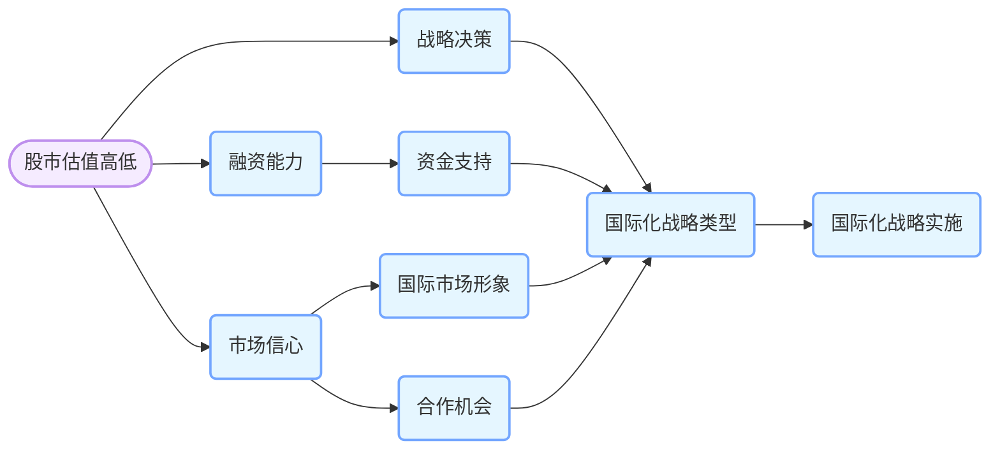

# 股市估值高低对企业国际化战略的影响

> 关键词：股市估值、企业国际化战略、市场价值、融资能力、战略决策

> 摘要：本文深入探讨了股市估值高低对企业国际化战略的影响。首先介绍了研究的背景、目的、预期读者等信息。接着阐述了股市估值和企业国际化战略的核心概念及它们之间的联系。详细讲解了相关的核心算法原理和操作步骤，并运用数学模型和公式进行分析。通过项目实战案例展示了股市估值对企业国际化战略决策的实际影响。分析了股市估值在不同实际应用场景中的作用。推荐了学习相关知识的工具和资源。最后总结了未来发展趋势与挑战，解答了常见问题，并提供了扩展阅读和参考资料，旨在帮助企业更好地理解股市估值与国际化战略之间的关系，做出更合理的战略决策。

## 1. 背景介绍 
### 1.1 目的和范围
本研究的主要目的是全面剖析股市估值高低对企业国际化战略的具体影响。随着经济全球化的不断深入，越来越多的企业选择实施国际化战略以拓展市场、获取资源和提升竞争力。而股市估值作为企业市场价值的重要体现，其高低变化可能会对企业的国际化战略决策、实施过程以及战略效果产生多方面的影响。本研究将涵盖股市估值的基本概念、企业国际化战略的主要类型，以及两者之间相互作用的机制和具体表现。同时，通过实际案例分析和理论探讨，为企业在不同股市估值情况下制定和调整国际化战略提供参考和建议。

### 1.2 预期读者
本文的预期读者主要包括企业管理者、战略规划师、投资者、金融分析师以及对企业国际化和金融市场感兴趣的研究人员。对于企业管理者和战略规划师来说，了解股市估值对国际化战略的影响有助于他们在决策过程中充分考虑市场因素，制定更加科学合理的战略方案。投资者可以通过本文了解股市估值与企业国际化战略之间的关系，从而更好地评估企业的投资价值和发展潜力。金融分析师可以借助本文的研究成果，为客户提供更专业的投资建议和市场分析。研究人员则可以将本文作为进一步深入研究的基础，拓展相关领域的学术研究。

### 1.3 文档结构概述
本文将按照以下结构展开：首先介绍股市估值和企业国际化战略的核心概念，并分析它们之间的联系，通过文本示意图和 Mermaid 流程图进行直观展示。接着详细讲解与股市估值和企业国际化战略相关的核心算法原理和具体操作步骤，同时运用 Python 源代码进行阐述。然后引入数学模型和公式，对两者之间的关系进行定量分析，并通过具体例子进行说明。通过项目实战案例，展示股市估值对企业国际化战略决策的实际影响，包括开发环境搭建、源代码实现和代码解读。分析股市估值在不同实际应用场景中的作用，为企业提供实践指导。推荐学习相关知识的工具和资源，包括书籍、在线课程、技术博客、开发工具框架和相关论文著作等。最后总结未来发展趋势与挑战，解答常见问题，并提供扩展阅读和参考资料。

### 1.4 术语表
#### 1.4.1 核心术语定义
- **股市估值**：是指对一家上市公司的股票价值进行评估的过程和结果。它通常基于公司的财务状况、盈利能力、市场前景等多种因素，通过一定的估值方法来确定股票的合理价格或价值区间。常见的估值方法包括市盈率法、市净率法、现金流折现法等。
- **企业国际化战略**：是指企业为了实现自身的发展目标，跨越国界在全球范围内进行资源配置、市场拓展和业务布局的战略规划和行动。企业国际化战略的类型包括出口战略、跨国并购战略、海外直接投资战略、战略联盟等。

#### 1.4.2 相关概念解释
- **市场价值**：是指企业在市场上的总体价值，通常通过股票价格乘以总股本得出。股市估值是评估企业市场价值的重要手段之一，但市场价值还受到市场供求关系、宏观经济环境、行业竞争态势等多种因素的影响。
- **融资能力**：是指企业通过各种渠道筹集资金的能力。股市估值高低会影响企业的融资能力，高估值的企业在股权融资时可以以较高的价格发行股票，从而筹集到更多的资金；在债权融资时，也更容易获得银行贷款和其他金融机构的支持。
- **战略决策**：是指企业为了实现长期发展目标而做出的重大决策。企业国际化战略决策涉及到市场选择、进入方式、资源配置等多个方面，股市估值高低可能会影响企业在这些方面的决策。

#### 1.4.3 缩略词列表
- **PE**：市盈率（Price Earnings Ratio），是指股票价格除以每股收益的比率，用于衡量股票的估值水平。
- **PB**：市净率（Price to Book Ratio），是指股票价格除以每股净资产的比率，反映了市场对企业净资产的估值。
- **DCF**：现金流折现法（Discounted Cash Flow），是一种通过预测企业未来现金流并将其折现到当前价值的估值方法。

## 2. 核心概念与联系 
### 2.1 股市估值的原理和方法
股市估值是基于对企业未来盈利能力和现金流的预期，通过一定的估值模型将其转化为当前的股票价值。常见的估值方法如下：
- **市盈率法（PE）**：市盈率是最常用的估值指标之一，其计算公式为：$PE = \frac{P}{EPS}$，其中 $P$ 为股票价格，$EPS$ 为每股收益。市盈率反映了投资者愿意为每单位收益支付的价格。一般来说，市盈率越高，说明市场对企业的未来盈利预期越高，但也可能意味着股票被高估；反之，市盈率越低，股票可能被低估。
- **市净率法（PB）**：市净率的计算公式为：$PB = \frac{P}{BVPS}$，其中 $P$ 为股票价格，$BVPS$ 为每股净资产。市净率反映了市场对企业净资产的估值。通常情况下，市净率大于 1 表示市场对企业的资产价值有一定的溢价；市净率小于 1 则可能表示企业的资产被低估。
- **现金流折现法（DCF）**：现金流折现法是一种较为复杂但理论上更为准确的估值方法。其基本原理是将企业未来的自由现金流按照一定的折现率折现到当前价值。计算公式为：$V = \sum_{t=1}^{n} \frac{FCF_t}{(1 + r)^t}$，其中 $V$ 为企业的内在价值，$FCF_t$ 为第 $t$ 期的自由现金流，$r$ 为折现率，$n$ 为预测期数。

### 2.2 企业国际化战略的类型和特点
企业国际化战略主要包括以下几种类型：
- **出口战略**：是指企业将国内生产的产品销售到国外市场。出口战略的优点是进入门槛低、风险小，企业可以利用现有的生产能力和销售渠道；缺点是对国外市场的控制能力较弱，容易受到贸易壁垒和汇率波动的影响。
- **跨国并购战略**：是指企业通过收购或合并国外企业来实现国际化扩张。跨国并购可以快速获取目标企业的技术、品牌、市场渠道等资源，实现规模经济和协同效应；但同时也面临着文化整合、管理协调等方面的挑战。
- **海外直接投资战略**：是指企业在国外直接投资设立生产基地、研发中心等机构。海外直接投资可以使企业更好地贴近市场，降低生产成本，提高对市场的响应速度；但需要大量的资金投入和承担较高的风险。
- **战略联盟**：是指企业与国外企业通过签订合作协议等方式建立战略合作伙伴关系。战略联盟可以实现资源共享、优势互补，降低企业的国际化成本和风险；但合作双方需要在利益分配、决策机制等方面进行有效的协调。

### 2.3 股市估值与企业国际化战略的联系
股市估值高低对企业国际化战略的影响主要体现在以下几个方面：
- **融资能力**：高股市估值的企业在股权融资时可以以较高的价格发行股票，从而筹集到更多的资金，为企业的国际化战略提供充足的资金支持。例如，一家高估值的科技企业可以通过增发股票获得大量资金，用于在海外设立研发中心和拓展市场。相反，低估值的企业在融资时可能会面临困难，限制了其国际化战略的实施。
- **市场信心**：股市估值是市场对企业价值的一种评价，高估值表明市场对企业的未来发展前景充满信心。这种市场信心可以为企业在国际市场上树立良好的形象，增强合作伙伴和客户的信任，有利于企业开展国际化业务。例如，一家高估值的企业在与国外企业进行合作谈判时，更容易获得对方的认可和支持。
- **战略决策**：股市估值高低会影响企业的战略决策。高估值的企业可能更倾向于采取激进的国际化战略，如跨国并购和海外直接投资，以进一步提升企业的市场地位和竞争力。而低估值的企业可能会更加谨慎，选择出口战略或战略联盟等相对保守的方式进入国际市场。

### 2.4 文本示意图和 Mermaid 流程图
#### 文本示意图
股市估值与企业国际化战略的联系可以用以下文本示意图表示：

股市估值高低 -> 融资能力变化 -> 影响企业国际化战略的资金支持
        -> 市场信心变化 -> 影响企业在国际市场的形象和合作机会
        -> 战略决策调整 -> 选择不同类型的国际化战略

#### Mermaid 流程图


## 3. 核心算法原理 & 具体操作步骤 
### 3.1 股市估值算法原理及 Python 实现
#### 市盈率法（PE）
市盈率法的核心原理是通过比较同行业企业的市盈率或企业历史市盈率，来评估当前股票的估值水平。以下是使用 Python 实现市盈率计算的代码：
```python
def calculate_pe(stock_price, eps):
    """
    计算市盈率
    :param stock_price: 股票价格
    :param eps: 每股收益
    :return: 市盈率
    """
    if eps == 0:
        return 0
    return stock_price / eps

# 示例数据
stock_price = 50
eps = 2
pe = calculate_pe(stock_price, eps)
print(f"市盈率: {pe}")
```
#### 市净率法（PB）
市净率法通过比较股票价格与每股净资产的比率，来判断股票的估值是否合理。以下是使用 Python 实现市净率计算的代码：
```python
def calculate_pb(stock_price, bvps):
    """
    计算市净率
    :param stock_price: 股票价格
    :param bvps: 每股净资产
    :return: 市净率
    """
    if bvps == 0:
        return 0
    return stock_price / bvps

# 示例数据
stock_price = 50
bvps = 10
pb = calculate_pb(stock_price, bvps)
print(f"市净率: {pb}")
```
#### 现金流折现法（DCF）
现金流折现法需要预测企业未来的自由现金流，并选择合适的折现率进行折现。以下是一个简化的 DCF 模型的 Python 实现：
```python
def dcf_valuation(fcf_list, discount_rate):
    """
    现金流折现法估值
    :param fcf_list: 未来自由现金流列表
    :param discount_rate: 折现率
    :return: 企业内在价值
    """
    value = 0
    for i, fcf in enumerate(fcf_list):
        discounted_fcf = fcf / ((1 + discount_rate) ** (i + 1))
        value += discounted_fcf
    return value

# 示例数据
fcf_list = [100, 120, 150, 180, 200]
discount_rate = 0.1
intrinsic_value = dcf_valuation(fcf_list, discount_rate)
print(f"企业内在价值: {intrinsic_value}")
```

### 3.2 基于股市估值的企业国际化战略决策步骤
#### 步骤 1：评估股市估值水平
首先，企业需要通过上述估值方法对自身的股市估值进行评估，同时分析同行业企业的估值情况，以确定自身在市场中的估值地位。例如，计算企业的市盈率、市净率等指标，并与行业平均水平进行比较。

#### 步骤 2：分析融资需求和能力
根据企业的国际化战略目标，分析所需的资金规模和融资渠道。高估值的企业可以考虑股权融资，如增发股票；低估值的企业可以尝试债权融资或其他融资方式。同时，评估企业的融资能力，包括信用评级、财务状况等因素。

#### 步骤 3：制定国际化战略方案
根据股市估值水平和融资能力，制定合适的国际化战略方案。高估值的企业可以选择激进的战略，如跨国并购和海外直接投资；低估值的企业可以选择保守的战略，如出口战略和战略联盟。在制定战略方案时，还需要考虑市场需求、竞争态势、政策环境等因素。

#### 步骤 4：实施和监控战略
按照制定的国际化战略方案进行实施，并建立有效的监控机制，及时评估战略的实施效果。如果股市估值发生变化，企业需要根据新的情况对战略进行调整。

## 4. 数学模型和公式 & 详细讲解 & 举例说明 
### 4.1 股市估值与融资能力的数学模型
企业的融资能力可以用融资规模来衡量，融资规模与股市估值之间存在一定的关系。假设企业通过股权融资，融资规模 $S$ 可以表示为：
$$S = N \times P$$
其中，$N$ 为发行的股票数量，$P$ 为股票发行价格。股票发行价格通常与股市估值相关，假设股票发行价格 $P$ 与企业的市盈率 $PE$ 和每股收益 $EPS$ 有关，即 $P = PE \times EPS$。则融资规模可以进一步表示为：
$$S = N \times PE \times EPS$$

例如，某企业计划发行 1000 万股股票，每股收益为 1 元，当前股市估值下的市盈率为 20 倍。则该企业的融资规模为：
$$S = 1000 \times 20 \times 1 = 20000（万元）$$

### 4.2 股市估值与市场信心的量化关系
市场信心可以用投资者对企业股票的预期收益率来衡量。假设投资者的预期收益率 $r_e$ 与股市估值 $V$ 之间存在线性关系，即：
$$r_e = a + bV$$
其中，$a$ 和 $b$ 为常数。当股市估值 $V$ 升高时，投资者的预期收益率 $r_e$ 也会相应升高，表明市场信心增强；反之，当股市估值 $V$ 降低时，投资者的预期收益率 $r_e$ 也会降低，市场信心减弱。

例如，假设 $a = 0.05$，$b = 0.01$，当股市估值 $V = 50$ 时，投资者的预期收益率为：
$$r_e = 0.05 + 0.01 \times 50 = 0.55 = 55\%$$

### 4.3 股市估值对企业国际化战略决策的数学模型
企业在选择国际化战略时，需要考虑多个因素，如融资成本、市场风险、预期收益等。假设企业有两种国际化战略选择：战略 A 和战略 B，战略 A 的预期收益为 $R_A$，战略 B 的预期收益为 $R_B$。企业的决策取决于两种战略的净现值（NPV），净现值的计算公式为：
$$NPV = \sum_{t=1}^{n} \frac{CF_t}{(1 + r)^t} - I$$
其中，$CF_t$ 为第 $t$ 期的现金流量，$r$ 为折现率，$I$ 为初始投资。

假设股市估值高低会影响企业的融资成本和预期收益。高估值企业实施战略 A 的融资成本为 $C_{A1}$，预期收益为 $R_{A1}$；实施战略 B 的融资成本为 $C_{B1}$，预期收益为 $R_{B1}$。低估值企业实施战略 A 的融资成本为 $C_{A2}$，预期收益为 $R_{A2}$；实施战略 B 的融资成本为 $C_{B2}$，预期收益为 $R_{B2}$。企业会选择净现值较大的战略。

例如，高估值企业实施战略 A 的初始投资为 1000 万元，未来 5 年的现金流量分别为 200 万元、300 万元、400 万元、500 万元、600 万元，折现率为 10%。则战略 A 的净现值为：
$$NPV_A = \frac{200}{(1 + 0.1)^1} + \frac{300}{(1 + 0.1)^2} + \frac{400}{(1 + 0.1)^3} + \frac{500}{(1 + 0.1)^4} + \frac{600}{(1 + 0.1)^5} - 1000 \approx 532.5（万元）$$

假设战略 B 的净现值为 400 万元，则高估值企业会选择战略 A。

## 5. 项目实战：代码实际案例和详细解释说明 
### 5.1  开发环境搭建
本项目实战使用 Python 语言进行开发，需要安装以下必要的库：
- **pandas**：用于数据处理和分析。
- **numpy**：用于数值计算。
- **matplotlib**：用于数据可视化。

可以使用以下命令进行安装：
```sh
pip install pandas numpy matplotlib
```

### 5.2  源代码详细实现和代码解读
#### 数据获取和预处理
首先，我们需要获取企业的财务数据和股票价格数据，并进行预处理。以下是示例代码：
```python
import pandas as pd

# 模拟获取企业财务数据和股票价格数据
financial_data = {
    'EPS': [1, 1.2, 1.5, 1.8, 2],
    'BVPS': [10, 11, 12, 13, 14],
    'Stock_Price': [20, 25, 30, 35, 40]
}
df = pd.DataFrame(financial_data)

# 计算市盈率和市净率
df['PE'] = df['Stock_Price'] / df['EPS']
df['PB'] = df['Stock_Price'] / df['BVPS']

print(df)
```
代码解读：
- 首先，我们使用字典 `financial_data` 模拟获取企业的每股收益（EPS）、每股净资产（BVPS）和股票价格数据。
- 然后，使用 `pandas` 的 `DataFrame` 类将数据转换为数据框。
- 最后，计算市盈率和市净率，并将结果添加到数据框中。

#### 基于股市估值的战略决策模拟
接下来，我们根据股市估值模拟企业的国际化战略决策。假设企业有两种国际化战略选择：出口战略和跨国并购战略。出口战略的初始投资较小，风险较低，但预期收益也相对较低；跨国并购战略的初始投资较大，风险较高，但预期收益也相对较高。以下是示例代码：
```python
import numpy as np

# 假设不同估值水平下的战略参数
high_valuation = {
    'Export': {
        'Initial_Investment': 100,
        'Expected_Return': [20, 30, 40, 50, 60]
    },
    'M&A': {
        'Initial_Investment': 500,
        'Expected_Return': [100, 200, 300, 400, 500]
    }
}

low_valuation = {
    'Export': {
        'Initial_Investment': 100,
        'Expected_Return': [15, 25, 35, 45, 55]
    },
    'M&A': {
        'Initial_Investment': 500,
        'Expected_Return': [80, 150, 220, 280, 320]
    }
}

# 折现率
discount_rate = 0.1

# 计算净现值
def calculate_npv(expected_return, initial_investment, discount_rate):
    npv = np.sum([cf / ((1 + discount_rate) ** (i + 1)) for i, cf in enumerate(expected_return)]) - initial_investment
    return npv

# 高估值企业的战略决策
high_npv_export = calculate_npv(high_valuation['Export']['Expected_Return'], high_valuation['Export']['Initial_Investment'], discount_rate)
high_npv_ma = calculate_npv(high_valuation['M&A']['Expected_Return'], high_valuation['M&A']['Initial_Investment'], discount_rate)

if high_npv_export > high_npv_ma:
    high_decision = 'Export'
else:
    high_decision = 'M&A'

# 低估值企业的战略决策
low_npv_export = calculate_npv(low_valuation['Export']['Expected_Return'], low_valuation['Export']['Initial_Investment'], discount_rate)
low_npv_ma = calculate_npv(low_valuation['M&A']['Expected_Return'], low_valuation['M&A']['Initial_Investment'], discount_rate)

if low_npv_export > low_npv_ma:
    low_decision = 'Export'
else:
    low_decision = 'M&A'

print(f"高估值企业的战略决策: {high_decision}")
print(f"低估值企业的战略决策: {low_decision}")
```
代码解读：
- 首先，我们定义了高估值和低估值情况下两种国际化战略（出口战略和跨国并购战略）的初始投资和预期收益。
- 然后，定义了计算净现值的函数 `calculate_npv`。
- 接着，分别计算高估值和低估值企业实施两种战略的净现值。
- 最后，根据净现值的大小做出战略决策，并输出结果。

### 5.3  代码解读与分析
通过上述代码，我们可以看到股市估值高低对企业国际化战略决策的影响。高估值企业由于融资能力较强，更倾向于选择跨国并购战略，以获取更高的预期收益；而低估值企业由于融资能力相对较弱，更倾向于选择出口战略，以降低风险。

同时，代码中的数据和参数可以根据实际情况进行调整，以模拟不同企业和市场环境下的战略决策。例如，可以修改预期收益、初始投资和折现率等参数，观察战略决策的变化。

## 6. 实际应用场景 
### 6.1 高估值企业的国际化战略
高估值企业在实施国际化战略时具有以下优势和特点：
- **跨国并购**：高估值企业可以利用其高市值的优势，通过发行股票或现金支付的方式进行跨国并购。例如，某高估值的科技企业通过跨国并购获得了国外先进的技术和研发团队，提升了自身的核心竞争力。
- **海外直接投资**：高估值企业有较强的融资能力，可以在海外直接投资设立生产基地、研发中心等机构。例如，某高估值的制造业企业在海外设立生产基地，降低了生产成本，提高了产品的市场竞争力。
- **品牌推广**：高估值企业在国际市场上具有较高的知名度和美誉度，可以更容易地进行品牌推广和市场拓展。例如，某高估值的消费品牌通过赞助国际体育赛事等方式，提升了品牌在国际市场上的影响力。

### 6.2 低估值企业的国际化战略
低估值企业在实施国际化战略时面临着一些挑战，但也可以采取以下策略：
- **出口战略**：低估值企业可以通过出口战略将产品销售到国外市场，积累国际市场经验和资金。例如，某低估值的制造业企业通过参加国际展会等方式，拓展了海外销售渠道，提高了产品的出口量。
- **战略联盟**：低估值企业可以与国外企业建立战略联盟，实现资源共享、优势互补。例如，某低估值的科技企业与国外知名企业结成战略联盟，共同开展研发合作，提升了自身的技术水平。
- **差异化竞争**：低估值企业可以通过提供差异化的产品或服务，在国际市场上寻找细分市场，避免与高估值企业的直接竞争。例如，某低估值的服装企业专注于设计和生产环保服装，满足了国际市场上对环保产品的需求。

### 6.3 股市估值波动对企业国际化战略的影响
股市估值是动态变化的，其波动会对企业的国际化战略产生影响。当股市估值上升时，企业的融资能力增强，市场信心提高，可能会促使企业加快国际化战略的实施步伐，如加大跨国并购和海外直接投资的力度。相反，当股市估值下降时，企业的融资难度增加，市场信心减弱，可能会导致企业调整国际化战略，采取更加保守的策略，如减少海外投资、加强国内市场的拓展等。

例如，某企业原本计划进行跨国并购，但由于股市估值下降，融资成本上升，该企业不得不暂停并购计划，等待股市估值回升后再做决策。

## 7. 工具和资源推荐
### 7.1 学习资源推荐
#### 7.1.1 书籍推荐
- 《证券分析》（Security Analysis）：由本杰明·格雷厄姆（Benjamin Graham）和戴维·多德（David Dodd）所著，是价值投资领域的经典著作，详细介绍了股票估值的方法和原理。
- 《跨国公司战略管理》（Strategic Management of Multinational Corporations）：全面阐述了跨国公司的战略制定、实施和控制等方面的内容，对企业国际化战略有深入的分析。
- 《财务报表分析》（Financial Statement Analysis）：帮助读者掌握如何分析企业的财务报表，从而评估企业的价值和财务状况，为股市估值提供依据。

#### 7.1.2 在线课程
- Coursera 上的“Financial Markets”：由耶鲁大学教授罗伯特·席勒（Robert Shiller）主讲，介绍了金融市场的基本原理和股票估值的方法。
- edX 上的“Global Strategy”：提供了关于企业国际化战略的理论和实践知识，包括市场进入策略、跨国并购等内容。
- 中国大学 MOOC 上的“财务管理”：系统讲解了财务管理的基本概念和方法，对理解股市估值和企业融资有很大帮助。

#### 7.1.3 技术博客和网站
- Seeking Alpha：是一个专业的金融投资博客平台，提供了大量关于股票估值、企业分析和市场趋势的文章和研究报告。
- Bloomberg：全球知名的金融信息服务提供商，提供实时的股票行情、财经新闻和分析评论，有助于了解股市动态和企业估值情况。
- 雪球：国内知名的投资交流社区，用户可以在上面分享股票投资经验、讨论企业估值和国际化战略等话题。

### 7.2 开发工具框架推荐
#### 7.2.1 IDE和编辑器
- PyCharm：是一款专门为 Python 开发设计的集成开发环境，具有代码编辑、调试、自动补全、版本控制等功能，适合开发与股市估值和企业国际化战略相关的 Python 程序。
- Jupyter Notebook：是一个交互式的开发环境，支持 Python、R 等多种编程语言，适合进行数据探索、分析和可视化，方便对股市数据和企业财务数据进行处理和分析。

#### 7.2.2 调试和性能分析工具
- pdb：Python 内置的调试器，可以帮助开发者在代码中设置断点、单步执行代码，方便查找和解决代码中的问题。
- cProfile：Python 标准库中的性能分析工具，可以分析代码的运行时间和函数调用情况，帮助开发者优化代码性能。

#### 7.2.3 相关框架和库
- pandas：是一个强大的数据处理和分析库，提供了高效的数据结构和数据操作方法，适合处理股市数据和企业财务数据。
- numpy：是 Python 的数值计算基础库，提供了高性能的多维数组对象和各种数学函数，用于进行数值计算和数据分析。
- scikit-learn：是一个常用的机器学习库，提供了各种机器学习算法和工具，可用于股市估值预测和企业国际化战略决策分析。

### 7.3 相关论文著作推荐
#### 7.3.1 经典论文
- Modigliani, F., & Miller, M. H. (1958). The Cost of Capital, Corporation Finance and the Theory of Investment. The American Economic Review, 48(3), 261 - 297. 该论文提出了著名的 MM 定理，对企业融资和估值理论产生了深远影响。
- Vernon, R. (1966). International Investment and International Trade in the Product Cycle. The Quarterly Journal of Economics, 80(2), 190 - 207. 提出了产品生命周期理论，解释了企业国际化的动机和过程。

#### 7.3.2 最新研究成果
- Gabaix, X., & Koijen, R. S. (2020). How Much Do Stock Prices Move When Firms Issue Equity? The Quarterly Journal of Economics, 135(1), 345 - 403. 研究了企业股权发行对股票价格的影响，与股市估值和企业融资密切相关。
- Contractor, F. J., Kundu, S. K., & Hsu, C. L. (2003). A Three-Stage Theory of International Expansion: The Link between Multinationality and Performance in the Service Sector. Journal of International Business Studies, 34(1), 5 - 18. 提出了服务业企业国际化的三阶段理论，对企业国际化战略有重要的指导意义。

#### 7.3.3 应用案例分析
- Harvard Business School 案例库：提供了大量关于企业国际化战略的实际案例，包括跨国并购、海外市场进入等方面的案例，通过分析这些案例可以学习企业在不同情况下的战略决策和实施经验。
- McKinsey Global Institute 报告：麦肯锡全球研究院发布的报告涵盖了全球经济、企业战略等多个领域，其中不乏关于企业国际化和股市估值的案例分析和研究成果。

## 8. 总结：未来发展趋势与挑战
### 8.1 未来发展趋势
- **数字化转型加速**：随着信息技术的快速发展，企业在国际化战略实施过程中将更加注重数字化转型。高估值的科技企业将利用其技术优势，推动数字化营销、数字化供应链管理等方面的创新，提高企业的运营效率和市场竞争力。低估值企业也将通过数字化手段提升自身的管理水平和服务质量，拓展国际市场。
- **绿色可持续发展成为主流**：全球对环境保护和可持续发展的关注度不断提高，企业在国际化战略中也将更加注重绿色可持续发展。无论是高估值企业还是低估值企业，都将面临来自国际市场和投资者的环保压力，需要在产品设计、生产过程和供应链管理等方面采取更加环保的措施。
- **区域化合作加强**：在全球化面临挑战的背景下，区域化合作将成为企业国际化战略的重要方向。企业将更加注重在区域内的市场拓展和资源整合，通过参与区域自由贸易协定和区域经济合作组织，降低贸易壁垒和成本，提高市场份额。

### 8.2 挑战
- **股市估值波动风险**：股市估值受到宏观经济环境、行业竞争态势、企业业绩等多种因素的影响，波动较大。企业在制定国际化战略时，需要充分考虑股市估值波动的风险，避免因估值下降导致融资困难和战略实施受阻。
- **文化差异和国际政治风险**：企业在实施国际化战略过程中，需要面对不同国家和地区的文化差异和国际政治风险。文化差异可能会影响企业的市场推广、管理模式和员工关系；国际政治风险如贸易保护主义、地缘政治冲突等可能会对企业的国际化业务造成不利影响。
- **技术创新和人才竞争**：在数字化转型和绿色可持续发展的背景下，企业需要不断进行技术创新，以满足市场需求和提高竞争力。同时，企业也面临着人才竞争的挑战，需要吸引和留住具有国际化视野和专业技能的人才。

## 9. 附录：常见问题与解答
### 9.1 股市估值高就一定适合实施跨国并购战略吗？
不一定。虽然高估值企业在融资能力和市场信心方面具有优势，但跨国并购战略还需要考虑目标企业的价值、协同效应、文化整合等因素。如果目标企业的估值过高，或者并购后无法实现协同效应，可能会导致并购失败。因此，企业在实施跨国并购战略时，需要进行充分的尽职调查和战略评估。

### 9.2 低估值企业如何提高自身的股市估值？
低估值企业可以通过以下方式提高自身的股市估值：
- 提高企业的盈利能力：通过优化产品结构、降低成本、提高生产效率等方式，提高企业的净利润和每股收益。
- 加强品牌建设：提升企业的品牌知名度和美誉度，增强市场竞争力。
- 加强信息披露：及时、准确地披露企业的财务信息和经营情况，增强投资者的信心。
- 推进战略转型：积极探索新的业务领域和商业模式，展示企业的发展潜力。

### 9.3 股市估值对企业国际化战略的影响是短期还是长期的？
股市估值对企业国际化战略的影响既有短期的也有长期的。短期来看，股市估值高低会影响企业的融资能力和市场信心，从而影响企业国际化战略的决策和实施进度。长期来看，股市估值反映了市场对企业未来发展前景的预期，如果企业能够通过实施国际化战略提升自身的竞争力和盈利能力，将有助于提高股市估值；反之，如果国际化战略实施失败，可能会导致股市估值下降。

## 10. 扩展阅读 & 参考资料
### 扩展阅读
- 《创新者的窘境》（The Innovator's Dilemma）：探讨了企业在面对技术创新和市场变革时的战略选择，对企业国际化战略中的创新和转型有一定的启示。
- 《竞争战略》（Competitive Strategy）：由迈克尔·波特（Michael Porter）所著，提出了企业竞争战略的三种基本类型，对企业在国际市场上的竞争策略制定有重要的指导意义。

### 参考资料
- 上市公司的年报和财务报表，可从证券交易所网站或公司官方网站获取。
- 金融数据提供商，如 Wind、东方财富等，提供了丰富的股市数据和企业财务数据。
- 学术数据库，如 CNKI、万方数据、Web of Science 等，可用于查找相关的学术论文和研究报告。

作者：AI天才研究院/AI Genius Institute & 禅与计算机程序设计艺术 /Zen And The Art of Computer Programming