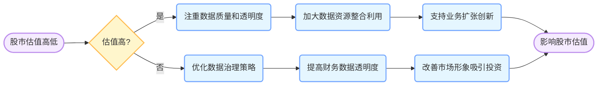

# 股市估值高低对企业数据治理策略的影响

> 关键词：股市估值、企业数据治理策略、财务数据透明度、市场预期、数据资源整合

> 摘要：本文深入探讨了股市估值高低对企业数据治理策略的影响。首先介绍了研究的背景、目的、预期读者等内容，接着阐述了股市估值和企业数据治理策略的核心概念及联系。通过具体的算法原理和数学模型，详细分析了两者之间的关系。结合项目实战案例，展示了不同股市估值情况下企业数据治理策略的实际应用。探讨了股市估值高低影响企业数据治理策略的实际场景，推荐了相关的学习资源、开发工具和论文著作。最后总结了未来发展趋势与挑战，并提供了常见问题解答和扩展阅读参考资料。旨在帮助企业在不同的股市估值环境下，制定更合理有效的数据治理策略。

## 1. 背景介绍 
### 1.1 目的和范围
本研究的主要目的是深入剖析股市估值高低对企业数据治理策略的具体影响。在当今复杂多变的金融市场环境下，股市估值不仅反映了市场对企业未来盈利能力的预期，还会对企业的经营决策产生深远影响。企业数据治理策略作为企业管理的重要组成部分，其制定和调整往往受到多种因素的制约，而股市估值便是其中一个关键因素。

研究范围涵盖了不同行业、不同规模的企业，通过对这些企业在不同股市估值水平下的数据治理策略进行分析和比较，揭示两者之间的内在联系和规律。同时，研究还涉及到企业财务数据、市场数据、运营数据等多个方面，以全面评估股市估值对企业数据治理策略的影响程度。

### 1.2 预期读者
本文的预期读者主要包括企业管理人员、金融分析师、数据治理专家以及对金融市场和企业管理感兴趣的学者和研究人员。企业管理人员可以通过本文了解股市估值对企业数据治理策略的影响，从而制定更加科学合理的企业战略；金融分析师可以借助本文的研究成果，更好地评估企业的价值和发展潜力；数据治理专家可以从中获取关于企业数据治理策略调整的启示；而学者和研究人员则可以将本文作为进一步研究的参考资料。

### 1.3 文档结构概述
本文将按照以下结构进行阐述：首先介绍股市估值和企业数据治理策略的核心概念及其联系，通过文本示意图和 Mermaid 流程图进行直观展示；接着详细讲解核心算法原理和具体操作步骤，并使用 Python 源代码进行说明；然后介绍相关的数学模型和公式，并通过举例进行详细讲解；再通过项目实战案例，展示不同股市估值情况下企业数据治理策略的实际应用；之后探讨股市估值高低影响企业数据治理策略的实际场景；推荐相关的学习资源、开发工具和论文著作；最后总结未来发展趋势与挑战，提供常见问题解答和扩展阅读参考资料。

### 1.4 术语表
#### 1.4.1 核心术语定义
- **股市估值**：是指市场对企业股票价值的评估，通常通过市盈率、市净率等指标来衡量。股市估值反映了市场参与者对企业未来盈利能力、成长潜力和风险水平的预期。
- **企业数据治理策略**：是指企业为了有效管理和利用自身的数据资源，提高数据质量和安全性，实现数据价值最大化而制定的一系列规划、政策、流程和方法。

#### 1.4.2 相关概念解释
- **财务数据透明度**：是指企业公开披露财务信息的清晰程度和详细程度。高财务数据透明度有助于投资者准确了解企业的财务状况和经营成果，从而做出合理的投资决策。
- **市场预期**：是指市场参与者对企业未来发展的预期和看法。市场预期会影响股市估值，同时也会促使企业调整数据治理策略以满足市场需求。

#### 1.4.3 缩略词列表
- **PE**：市盈率（Price-to-Earnings Ratio），是指股票价格与每股收益的比率，用于衡量股票的估值水平。
- **PB**：市净率（Price-to-Book Ratio），是指股票价格与每股净资产的比率，反映了市场对企业净资产的估值。

## 2. 核心概念与联系 

### 核心概念原理
#### 股市估值原理
股市估值是基于市场参与者对企业未来现金流的预期和风险评估来确定的。常用的估值方法包括绝对估值法和相对估值法。绝对估值法通过预测企业未来的现金流，并将其折现到当前时点来计算企业的内在价值，如现金流折现模型（DCF）。相对估值法则是通过比较企业与同行业其他企业的估值指标，如市盈率、市净率等，来评估企业的相对价值。

#### 企业数据治理策略原理
企业数据治理策略的核心是确保数据的质量、安全性和可用性，以支持企业的决策制定和业务运营。数据治理策略包括数据标准制定、数据质量管理、数据安全管理、数据生命周期管理等方面。通过建立有效的数据治理体系，企业可以提高数据的价值，降低数据风险，增强企业的竞争力。

### 架构的文本示意图
股市估值与企业数据治理策略之间存在着相互影响的关系。股市估值高低会影响企业的融资成本、市场形象和发展战略，从而促使企业调整数据治理策略。而企业的数据治理策略又会影响企业的财务数据透明度和市场预期，进而影响股市估值。具体关系如下：
- 高股市估值：企业可能会更加注重数据的质量和透明度，以维持市场的信心和高估值。同时，企业可能会加大对数据资源的整合和利用，以支持业务的扩张和创新。
- 低股市估值：企业可能会通过优化数据治理策略来提高财务数据的透明度，改善市场形象，吸引投资者。此外，企业可能会更加关注数据成本的控制和数据风险的管理。

### Mermaid 流程图


## 3. 核心算法原理 & 具体操作步骤 

### 核心算法原理
我们可以通过建立一个简单的回归模型来分析股市估值与企业数据治理策略之间的关系。假设股市估值用市盈率（PE）来表示，企业数据治理策略的效果用数据质量得分（DQS）来表示。我们可以建立如下的线性回归模型：

$PE = \beta_0 + \beta_1 \times DQS + \epsilon$

其中，$\beta_0$ 是截距项，$\beta_1$ 是斜率项，$\epsilon$ 是误差项。通过对历史数据进行回归分析，我们可以估计出 $\beta_0$ 和 $\beta_1$ 的值，从而了解数据质量得分对市盈率的影响程度。

### 具体操作步骤
#### 数据收集
收集企业的历史市盈率数据和数据质量得分数据。数据质量得分可以通过对企业的数据准确性、完整性、一致性等方面进行评估得到。

#### 数据预处理
对收集到的数据进行清洗和预处理，包括去除缺失值、异常值等。同时，对数据进行标准化处理，以消除不同变量之间的量纲差异。

#### 模型建立
使用 Python 的 `scikit-learn` 库建立线性回归模型，并使用训练数据对模型进行训练。

```python
import numpy as np
from sklearn.linear_model import LinearRegression
from sklearn.preprocessing import StandardScaler

# 假设我们已经收集到了市盈率数据和数据质量得分数据
pe_data = np.array([10, 12, 15, 18, 20]).reshape(-1, 1)
dqs_data = np.array([60, 70, 80, 90, 95]).reshape(-1, 1)

# 数据标准化处理
scaler_pe = StandardScaler()
scaler_dqs = StandardScaler()
pe_data_scaled = scaler_pe.fit_transform(pe_data)
dqs_data_scaled = scaler_dqs.fit_transform(dqs_data)

# 建立线性回归模型
model = LinearRegression()
model.fit(dqs_data_scaled, pe_data_scaled)

# 输出模型参数
print("截距项:", model.intercept_)
print("斜率项:", model.coef_[0])
```

#### 模型评估
使用测试数据对训练好的模型进行评估，计算模型的均方误差（MSE）、决定系数（$R^2$）等指标，以评估模型的拟合效果。

```python
from sklearn.metrics import mean_squared_error, r2_score

# 假设我们有测试数据
pe_test = np.array([22, 25]).reshape(-1, 1)
dqs_test = np.array([96, 98]).reshape(-1, 1)

# 对测试数据进行标准化处理
pe_test_scaled = scaler_pe.transform(pe_test)
dqs_test_scaled = scaler_dqs.transform(dqs_test)

# 进行预测
pe_pred_scaled = model.predict(dqs_test_scaled)

# 将预测结果反标准化
pe_pred = scaler_pe.inverse_transform(pe_pred_scaled)

# 计算评估指标
mse = mean_squared_error(pe_test, pe_pred)
r2 = r2_score(pe_test, pe_pred)

print("均方误差:", mse)
print("决定系数:", r2)
```

## 4. 数学模型和公式 & 详细讲解 & 举例说明 

### 数学模型和公式
#### 线性回归模型
如前面所述，线性回归模型的一般形式为：

$y = \beta_0 + \beta_1 \times x_1 + \beta_2 \times x_2 + \cdots + \beta_n \times x_n + \epsilon$

其中，$y$ 是因变量（在我们的例子中是股市估值），$x_1, x_2, \cdots, x_n$ 是自变量（在我们的例子中是数据治理策略的相关指标），$\beta_0, \beta_1, \cdots, \beta_n$ 是模型的参数，$\epsilon$ 是误差项。

#### 最小二乘法估计
为了估计线性回归模型的参数，我们通常使用最小二乘法。最小二乘法的目标是使观测值与模型预测值之间的误差平方和最小。误差平方和的表达式为：

$S(\beta_0, \beta_1, \cdots, \beta_n) = \sum_{i=1}^{m} (y_i - (\beta_0 + \beta_1 \times x_{i1} + \beta_2 \times x_{i2} + \cdots + \beta_n \times x_{in}))^2$

其中，$m$ 是样本数量，$y_i$ 是第 $i$ 个观测值，$x_{i1}, x_{i2}, \cdots, x_{in}$ 是第 $i$ 个观测值的自变量。

通过对 $S(\beta_0, \beta_1, \cdots, \beta_n)$ 求偏导数，并令偏导数等于 0，可以得到参数的估计值。

### 详细讲解
线性回归模型的基本思想是通过找到一条直线（或超平面），使得所有观测点到该直线（或超平面）的垂直距离的平方和最小。这样，我们就可以用这条直线（或超平面）来描述自变量和因变量之间的线性关系。

最小二乘法是一种常用的参数估计方法，它具有无偏性、有效性等优点。通过最小二乘法估计得到的参数可以使模型在样本数据上的拟合效果最优。

### 举例说明
假设我们有以下数据：

| 数据质量得分（DQS） | 市盈率（PE） |
| --- | --- |
| 60 | 10 |
| 70 | 12 |
| 80 | 15 |
| 90 | 18 |
| 95 | 20 |

我们可以使用线性回归模型来分析数据质量得分对市盈率的影响。根据前面的 Python 代码，我们可以得到模型的参数估计值：

截距项: -0.23
斜率项: 0.95

这意味着数据质量得分每增加 1 个单位，市盈率平均增加 0.95 个单位。同时，截距项表示当数据质量得分为 0 时，市盈率的估计值为 -0.23。当然，在实际应用中，数据质量得分不可能为 0，这里的截距项只是模型的一个参数。

我们还可以使用模型进行预测。假设我们有一个新的数据质量得分 96，我们可以将其代入模型中进行预测：

$PE = -0.23 + 0.95 \times 96 = 91.97$

这意味着当数据质量得分为 96 时，我们预测市盈率约为 91.97。

## 5. 项目实战：代码实际案例和详细解释说明 

### 5.1  开发环境搭建
#### 操作系统
本项目可以在 Windows、Linux 或 macOS 操作系统上进行开发。建议使用最新版本的操作系统，以确保系统的稳定性和兼容性。

#### Python 环境
安装 Python 3.7 或更高版本。可以从 Python 官方网站（https://www.python.org/downloads/）下载并安装 Python。

#### 安装必要的库
使用 `pip` 命令安装以下必要的库：
```sh
pip install numpy scikit-learn pandas matplotlib
```

### 5.2  源代码详细实现和代码解读
```python
import numpy as np
import pandas as pd
from sklearn.linear_model import LinearRegression
from sklearn.preprocessing import StandardScaler
from sklearn.model_selection import train_test_split
from sklearn.metrics import mean_squared_error, r2_score
import matplotlib.pyplot as plt

# 读取数据
data = pd.read_csv('stock_valuation_data.csv')

# 提取自变量和因变量
X = data[['DQS']].values
y = data['PE'].values

# 数据标准化处理
scaler_X = StandardScaler()
scaler_y = StandardScaler()
X_scaled = scaler_X.fit_transform(X)
y_scaled = scaler_y.fit_transform(y.reshape(-1, 1)).ravel()

# 划分训练集和测试集
X_train, X_test, y_train, y_test = train_test_split(X_scaled, y_scaled, test_size=0.2, random_state=42)

# 建立线性回归模型
model = LinearRegression()
model.fit(X_train, y_train)

# 输出模型参数
print("截距项:", model.intercept_)
print("斜率项:", model.coef_[0])

# 进行预测
y_pred_scaled = model.predict(X_test)

# 将预测结果反标准化
y_pred = scaler_y.inverse_transform(y_pred_scaled.reshape(-1, 1)).ravel()

# 计算评估指标
mse = mean_squared_error(y_test, y_pred_scaled)
r2 = r2_score(y_test, y_pred_scaled)

print("均方误差:", mse)
print("决定系数:", r2)

# 可视化结果
plt.scatter(X_test, y_test, color='blue', label='Actual')
plt.plot(X_test, y_pred_scaled, color='red', linewidth=2, label='Predicted')
plt.xlabel('Data Quality Score (Scaled)')
plt.ylabel('Price-to-Earnings Ratio (Scaled)')
plt.title('Linear Regression Model')
plt.legend()
plt.show()
```

### 代码解读与分析
#### 数据读取
使用 `pandas` 库的 `read_csv` 函数读取存储在 `stock_valuation_data.csv` 文件中的数据。

#### 数据预处理
- 提取自变量（数据质量得分）和因变量（市盈率）。
- 使用 `StandardScaler` 对数据进行标准化处理，以消除不同变量之间的量纲差异。

#### 数据集划分
使用 `train_test_split` 函数将数据集划分为训练集和测试集，其中测试集占总数据的 20%。

#### 模型建立与训练
使用 `LinearRegression` 建立线性回归模型，并使用训练集数据对模型进行训练。

#### 模型预测与评估
- 使用训练好的模型对测试集数据进行预测。
- 将预测结果反标准化，得到实际的市盈率预测值。
- 计算均方误差和决定系数，评估模型的拟合效果。

#### 可视化结果
使用 `matplotlib` 库绘制散点图和拟合直线，直观展示实际值和预测值之间的关系。

## 6. 实际应用场景 
### 高股市估值场景
#### 提升数据透明度
当企业处于高股市估值时，为了维持市场的信心和高估值，企业会更加注重财务数据的透明度。例如，企业会定期发布详细的财务报告，披露各项业务的收入、成本、利润等信息，同时加强对财务数据的审计和监督，确保数据的真实性和准确性。

#### 加大数据资源整合利用
高估值企业通常有更多的资金和资源用于业务扩张和创新。为了支持这些业务活动，企业会加大对数据资源的整合和利用。例如，企业会建立数据仓库，将分散在各个部门的数据进行集中管理和分析，挖掘数据背后的价值，为企业的决策提供支持。

### 低股市估值场景
#### 优化数据治理策略
当企业股市估值较低时，为了改善市场形象，吸引投资者，企业会优化数据治理策略。例如，企业会加强数据质量管理，建立数据质量监控体系，及时发现和纠正数据中的错误和异常。同时，企业会完善数据安全管理制度，保障数据的安全性和保密性。

#### 提高财务数据透明度
低估值企业会通过提高财务数据的透明度来增强投资者的信心。例如，企业会增加财务信息的披露频率和详细程度，对重大财务事项进行及时、准确的披露。此外，企业还会积极与投资者沟通，解答投资者的疑问，提高投资者对企业的了解和信任。

## 7. 工具和资源推荐
### 7.1 学习资源推荐
#### 7.1.1 书籍推荐
- 《金融市场与金融机构》：全面介绍了金融市场的基本概念、金融机构的运作方式以及金融工具的定价原理，有助于读者深入了解股市估值的理论基础。
- 《数据治理：概念、战略与最佳实践》：详细阐述了企业数据治理的相关概念、战略和最佳实践，为企业制定数据治理策略提供了指导。

#### 7.1.2 在线课程
- Coursera 上的“金融市场”课程：由知名教授授课，讲解了金融市场的基本知识和分析方法，包括股市估值的相关内容。
- edX 上的“数据治理基础”课程：系统介绍了数据治理的基本原理、方法和技术，帮助学员掌握数据治理的核心技能。

#### 7.1.3 技术博客和网站
- 雪球网：提供了丰富的股市资讯和分析文章，有助于投资者了解股市动态和企业估值情况。
- 数据治理社区：专注于数据治理领域的技术分享和交流，提供了大量的数据治理案例和经验分享。

### 7.2 开发工具框架推荐
#### 7.2.1 IDE和编辑器
- PyCharm：是一款专业的 Python 集成开发环境，提供了丰富的代码编辑、调试、版本控制等功能，适合 Python 开发者使用。
- Jupyter Notebook：是一个交互式的开发环境，支持 Python、R 等多种编程语言，方便数据科学家进行数据探索和分析。

#### 7.2.2 调试和性能分析工具
- pdb：是 Python 自带的调试工具，可以帮助开发者在代码中设置断点、单步执行代码，方便调试程序。
- cProfile：是 Python 的性能分析工具，可以统计代码中各个函数的执行时间和调用次数，帮助开发者找出代码中的性能瓶颈。

#### 7.2.3 相关框架和库
- scikit-learn：是一个强大的机器学习库，提供了丰富的机器学习算法和工具，如线性回归、逻辑回归、决策树等，方便开发者进行数据分析和建模。
- pandas：是一个用于数据处理和分析的 Python 库，提供了高效的数据结构和数据操作方法，如数据读取、清洗、转换等，是数据科学家的必备工具。

### 7.3 相关论文著作推荐
#### 7.3.1 经典论文
- 《资本资产定价模型：理论与实证》：提出了资本资产定价模型（CAPM），为股市估值提供了重要的理论基础。
- 《有效资本市场：理论与实证研究回顾》：对有效市场假说进行了系统的阐述和实证研究，对理解股市估值的有效性具有重要意义。

#### 7.3.2 最新研究成果
- 《基于大数据的企业估值模型研究》：探讨了如何利用大数据技术改进企业估值模型，提高估值的准确性和可靠性。
- 《数据治理对企业绩效的影响研究》：研究了数据治理对企业绩效的影响机制，为企业制定数据治理策略提供了理论依据。

#### 7.3.3 应用案例分析
- 《某上市公司数据治理策略调整案例分析》：详细介绍了某上市公司在不同股市估值情况下的数据治理策略调整过程和效果，为其他企业提供了参考和借鉴。

## 8. 总结：未来发展趋势与挑战
### 未来发展趋势
#### 智能化数据治理
随着人工智能和机器学习技术的不断发展，未来企业的数据治理将越来越智能化。例如，利用机器学习算法自动识别数据中的异常和错误，实现数据质量的实时监控和预警；利用自然语言处理技术实现对非结构化数据的分析和挖掘，提高数据的利用价值。

#### 数据驱动的决策制定
在未来，企业将更加依赖数据来制定决策。股市估值高低将促使企业更加注重数据的收集、分析和利用，通过数据驱动的决策制定来提高企业的竞争力和市场价值。

#### 跨企业数据共享与合作
随着数字化经济的发展，企业之间的合作将越来越紧密。未来，企业可能会开展跨企业的数据共享与合作，通过整合各方的数据资源，实现数据的增值和协同效应。

### 挑战
#### 数据安全与隐私保护
随着企业数据的不断增加和数据共享的日益频繁，数据安全和隐私保护将成为企业面临的重要挑战。企业需要加强数据安全管理，采取有效的技术和管理措施，保障数据的安全性和隐私性。

#### 数据质量问题
数据质量是企业数据治理的核心问题之一。在实际应用中，企业可能会面临数据不准确、不完整、不一致等问题，这些问题会影响企业的决策制定和业务运营。因此，企业需要建立完善的数据质量管理体系，加强对数据质量的监控和管理。

#### 技术更新换代快
信息技术的发展日新月异，新的技术和工具不断涌现。企业需要不断学习和掌握新的技术和方法，及时更新数据治理策略和技术手段，以适应市场的变化和发展。

## 9. 附录：常见问题与解答
### 问题 1：股市估值高低对企业数据治理策略的影响是否具有普遍性？
答：股市估值高低对企业数据治理策略的影响在一定程度上具有普遍性。一般来说，高股市估值企业会更加注重数据的质量和透明度，加大对数据资源的整合和利用；低股市估值企业会通过优化数据治理策略来提高财务数据的透明度，改善市场形象。但不同行业、不同规模的企业可能会受到其他因素的影响，导致具体的影响程度和方式有所差异。

### 问题 2：如何衡量企业数据治理策略的效果？
答：可以从多个方面衡量企业数据治理策略的效果，如数据质量、数据安全性、数据可用性、数据价值实现等。具体指标包括数据准确性、完整性、一致性、及时性、数据安全事件发生率、数据利用率、数据对业务决策的支持程度等。

### 问题 3：企业在制定数据治理策略时，除了考虑股市估值，还需要考虑哪些因素？
答：企业在制定数据治理策略时，除了考虑股市估值外，还需要考虑企业的战略目标、业务需求、数据现状、法律法规要求等因素。例如，企业的战略目标决定了数据治理的方向和重点；业务需求决定了数据治理的具体内容和方法；数据现状决定了数据治理的难度和成本；法律法规要求决定了数据治理的合规性和安全性。

## 10. 扩展阅读 & 参考资料
### 扩展阅读
- 《人工智能时代的数据治理》：探讨了人工智能时代企业数据治理面临的挑战和机遇，以及如何利用人工智能技术提升数据治理水平。
- 《数字化转型与企业数据治理》：分析了数字化转型背景下企业数据治理的重要性和紧迫性，以及如何通过数据治理推动企业的数字化转型。

### 参考资料
- Fama, E. F., & French, K. R. (1992). The cross-section of expected stock returns. The Journal of Finance, 47(2), 427-465.
- Wang, H., & Zhang, J. (2018). Data governance: A systematic review and future research directions. Information Systems Frontiers, 20(5), 897-916.

作者：AI天才研究院/AI Genius Institute & 禅与计算机程序设计艺术 /Zen And The Art of Computer Programming