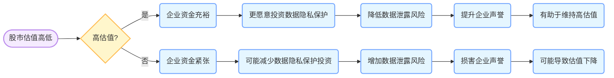

# 股市估值高低对企业数据隐私保护投资的影响

> 关键词：股市估值、企业数据隐私保护、投资影响、企业决策、市场机制

> 摘要：本文深入探讨了股市估值高低对企业数据隐私保护投资的影响。通过分析股市估值的内涵、企业数据隐私保护投资的重要性，阐述两者之间的内在联系。结合核心算法原理、数学模型和实际案例，详细解读股市估值如何影响企业在数据隐私保护方面的投资决策。同时，介绍了相关的实际应用场景、工具资源，并对未来发展趋势与挑战进行了总结，旨在为企业和投资者提供全面的参考和决策依据。

## 1. 背景介绍 
### 1.1 目的和范围
本研究的主要目的是全面剖析股市估值高低与企业数据隐私保护投资之间的关系。通过理论分析、算法推导、案例研究等方法，揭示股市估值因素如何影响企业在数据隐私保护方面的资金投入决策。研究范围涵盖了不同行业、不同规模的企业，综合考虑了宏观经济环境、行业竞争态势等多种因素对两者关系的影响。

### 1.2 预期读者
本文预期读者包括企业管理人员、投资者、金融分析师、数据安全专家以及对股市和企业数据隐私保护感兴趣的研究人员。对于企业管理人员，可帮助其在不同股市估值环境下做出合理的隐私保护投资决策；投资者可以借助本文的分析更好地评估企业的潜在价值和风险；金融分析师能够丰富其对企业财务和战略决策的分析视角；数据安全专家可以从企业投资决策的角度深入理解数据隐私保护的市场驱动力；研究人员则可将本文作为进一步学术研究的参考。

### 1.3 文档结构概述
本文首先介绍了相关的背景知识，包括研究目的、预期读者和文档结构。接着阐述了股市估值和企业数据隐私保护的核心概念及其联系，并给出了相应的文本示意图和 Mermaid 流程图。然后详细讲解了核心算法原理和具体操作步骤，同时运用数学模型和公式进行了深入分析，并举例说明。通过实际案例展示了股市估值对企业数据隐私保护投资的具体影响。之后介绍了实际应用场景、相关的工具和资源。最后对未来发展趋势与挑战进行总结，并提供了常见问题解答和扩展阅读参考资料。

### 1.4 术语表
#### 1.4.1 核心术语定义
- **股市估值**：指对股票市场中企业价值的评估，通常通过多种方法计算得出，反映了市场对企业未来盈利能力、资产质量、发展前景等方面的综合预期。常见的估值指标包括市盈率（P/E）、市净率（P/B）等。
- **企业数据隐私保护投资**：企业为了保护其收集、存储、处理和传输的各类数据的隐私性和安全性而进行的资金投入，包括购买安全软件、建设安全基础设施、开展员工培训、聘请专业安全顾问等方面的费用。
- **数据泄露风险**：企业数据由于各种原因（如黑客攻击、内部人员违规操作等）被非法获取、披露或使用的可能性，数据泄露可能导致企业面临法律诉讼、声誉损失、客户流失等严重后果。

#### 1.4.2 相关概念解释
- **市场情绪**：投资者对股票市场整体或个别股票的乐观或悲观态度，市场情绪会影响股票价格和股市估值。例如，在市场乐观情绪下，投资者更愿意为股票支付较高的价格，从而提高企业的股市估值。
- **合规要求**：政府和监管机构制定的关于企业数据隐私保护的法律法规和标准，企业必须遵守这些要求，否则将面临处罚。合规要求的严格程度会影响企业在数据隐私保护方面的投资决策。

#### 1.4.3 缩略词列表
- **P/E**：市盈率（Price-to-Earnings Ratio），计算公式为股票价格除以每股收益，反映了市场对企业盈利的预期。
- **P/B**：市净率（Price-to-Book Ratio），计算公式为股票价格除以每股净资产，反映了市场对企业资产价值的评估。
- **GDPR**：通用数据保护条例（General Data Protection Regulation），欧盟制定的一项严格的数据隐私保护法规，对企业的数据处理和隐私保护提出了高要求。

## 2. 核心概念与联系 
### 核心概念原理
#### 股市估值原理
股市估值是基于企业的基本面和市场预期来评估企业的价值。基本面因素包括企业的财务状况、盈利能力、资产质量等，市场预期则反映了投资者对企业未来发展的信心。常见的估值方法有绝对估值法和相对估值法。绝对估值法如现金流折现法（DCF），通过预测企业未来的现金流并折现到当前来计算企业的内在价值；相对估值法如市盈率法、市净率法，通过与同行业其他企业的估值指标进行比较来评估企业的价值。

#### 企业数据隐私保护投资原理
企业进行数据隐私保护投资是为了降低数据泄露风险，保护企业的声誉和客户信任，同时满足合规要求。随着企业数字化程度的提高，数据资产的重要性日益凸显，数据泄露可能给企业带来巨大的损失。因此，企业需要投入资金来建立和完善数据安全防护体系，包括数据加密、访问控制、安全审计等措施。

### 核心概念架构的文本示意图
```plaintext
股市估值
├── 基本面因素
│   ├── 财务状况
│   ├── 盈利能力
│   ├── 资产质量
│   └── 其他
├── 市场预期
│   ├── 行业前景
│   ├── 企业竞争力
│   └── 宏观经济环境
└── 估值方法
    ├── 绝对估值法
    │   └── 现金流折现法
    └── 相对估值法
        ├── 市盈率法
        └── 市净率法

企业数据隐私保护投资
├── 投资目的
│   ├── 降低数据泄露风险
│   ├── 保护企业声誉
│   ├── 满足合规要求
│   └── 保护客户信任
├── 投资领域
│   ├── 数据加密
│   ├── 访问控制
│   ├── 安全审计
│   └── 其他
└── 投资决策因素
    ├── 数据重要性
    ├── 数据泄露风险
    ├── 合规要求
    └── 成本效益分析
```

### Mermaid 流程图


从流程图可以看出，股市估值高低影响企业的资金状况，进而影响企业在数据隐私保护方面的投资决策。投资决策又会影响数据泄露风险和企业声誉，最终对股市估值产生反馈作用。

## 3. 核心算法原理 & 具体操作步骤 
### 核心算法原理
我们可以通过建立一个简单的成本效益模型来分析股市估值高低对企业数据隐私保护投资的影响。假设企业的股市估值为 $V$，数据隐私保护投资为 $I$，数据泄露风险为 $R$，数据泄露造成的损失为 $L$，投资的成本效益函数为 $U$。

企业的目标是最大化成本效益函数 $U$，可以表示为：

$U = V - C(I) - R(I) \times L$

其中，$C(I)$ 是投资 $I$ 所带来的成本，通常是一个递增函数，即随着投资的增加，成本也会增加；$R(I)$ 是数据泄露风险与投资的函数，通常是一个递减函数，即随着投资的增加，数据泄露风险会降低。

### 具体操作步骤
#### 步骤 1：确定股市估值 $V$
可以使用市盈率法或现金流折现法等估值方法来确定企业的股市估值。例如，使用市盈率法时，根据同行业平均市盈率和企业的每股收益计算企业的股票价格，进而得到股市估值。

#### 步骤 2：估计数据泄露风险 $R$ 和损失 $L$
通过历史数据统计、风险评估模型等方法估计企业的数据泄露风险 $R$ 和数据泄露造成的损失 $L$。例如，可以参考同行业其他企业的数据泄露案例，分析数据泄露的频率和损失程度。

#### 步骤 3：确定投资成本函数 $C(I)$
根据企业的实际情况，确定投资成本函数 $C(I)$。例如，可以假设投资成本与投资金额成正比，即 $C(I) = kI$，其中 $k$ 是一个常数，表示单位投资的成本。

#### 步骤 4：求解最优投资 $I^*$
对成本效益函数 $U$ 求关于 $I$ 的导数，并令导数等于 0，得到最优投资 $I^*$。即：

$\frac{dU}{dI} = - \frac{dC(I)}{dI} - \frac{dR(I)}{dI} \times L = 0$

通过求解上述方程，可以得到使成本效益函数 $U$ 最大化的最优投资 $I^*$。

### Python 源代码实现
```python
import numpy as np
from scipy.optimize import minimize

# 定义投资成本函数
def cost_function(I, k):
    return k * I

# 定义数据泄露风险函数
def risk_function(I, a, b):
    return a * np.exp(-b * I)

# 定义成本效益函数
def cost_benefit_function(I, V, k, a, b, L):
    C = cost_function(I, k)
    R = risk_function(I, a, b)
    return V - C - R * L

# 定义目标函数（取负号是因为 scipy.optimize.minimize 是求最小值）
def objective_function(I, V, k, a, b, L):
    return -cost_benefit_function(I, V, k, a, b, L)

# 初始参数设置
V = 1000  # 股市估值
k = 1  # 单位投资成本
a = 0.5  # 风险函数参数
b = 0.1  # 风险函数参数
L = 200  # 数据泄露损失

# 初始投资猜测值
initial_guess = 10

# 求解最优投资
result = minimize(objective_function, initial_guess, args=(V, k, a, b, L))

optimal_investment = result.x[0]
print(f"最优数据隐私保护投资: {optimal_investment}")
```

在上述代码中，我们首先定义了投资成本函数、数据泄露风险函数和成本效益函数。然后使用 `scipy.optimize.minimize` 函数来求解使成本效益函数最大化的最优投资。最后输出最优投资的结果。

## 4. 数学模型和公式 & 详细讲解 & 举例说明 
### 数学模型和公式
我们在前面已经介绍了成本效益模型：

$U = V - C(I) - R(I) \times L$

其中，$U$ 是成本效益函数，$V$ 是股市估值，$C(I)$ 是投资成本函数，$R(I)$ 是数据泄露风险函数，$L$ 是数据泄露造成的损失。

### 详细讲解
- **股市估值 $V$**：反映了市场对企业的综合评估，是企业的一项重要资产。高估值意味着企业在市场上具有较高的价值和声誉，可能更容易获得资金支持。
- **投资成本函数 $C(I)$**：表示企业进行数据隐私保护投资所需要付出的成本。通常情况下，投资成本随着投资金额的增加而增加，而且可能存在边际成本递增的情况。例如，购买更高级的安全设备、聘请更专业的安全团队等都会增加投资成本。
- **数据泄露风险函数 $R(I)$**：表示数据泄露风险与投资的关系。一般来说，随着投资的增加，数据泄露风险会降低。这是因为企业可以通过增加投资来加强数据安全防护措施，如安装防火墙、进行数据加密等。
- **数据泄露损失 $L$**：是指企业一旦发生数据泄露事件可能遭受的损失，包括经济损失、声誉损失、法律诉讼费用等。数据泄露损失的大小取决于企业的数据类型、重要性以及数据泄露的影响范围。

### 举例说明
假设一家企业的股市估值 $V = 5000$ 万元，单位投资成本 $k = 2$ 万元/单位投资，数据泄露风险函数为 $R(I) = 0.3 \times e^{-0.2I}$，数据泄露造成的损失 $L = 1000$ 万元。

我们可以使用前面的 Python 代码来求解最优投资：

```python
import numpy as np
from scipy.optimize import minimize

# 定义投资成本函数
def cost_function(I, k):
    return k * I

# 定义数据泄露风险函数
def risk_function(I, a, b):
    return a * np.exp(-b * I)

# 定义成本效益函数
def cost_benefit_function(I, V, k, a, b, L):
    C = cost_function(I, k)
    R = risk_function(I, a, b)
    return V - C - R * L

# 定义目标函数（取负号是因为 scipy.optimize.minimize 是求最小值）
def objective_function(I, V, k, a, b, L):
    return -cost_benefit_function(I, V, k, a, b, L)

# 初始参数设置
V = 5000
k = 2
a = 0.3
b = 0.2
L = 1000

# 初始投资猜测值
initial_guess = 10

# 求解最优投资
result = minimize(objective_function, initial_guess, args=(V, k, a, b, L))

optimal_investment = result.x[0]
print(f"最优数据隐私保护投资: {optimal_investment} 万元")
```

运行上述代码，我们可以得到该企业的最优数据隐私保护投资金额。通过这个例子，我们可以看到如何使用数学模型和公式来分析企业在不同股市估值下的最优数据隐私保护投资决策。

## 5. 项目实战：代码实际案例和详细解释说明 
### 5.1 开发环境搭建
为了运行前面的 Python 代码，我们需要搭建一个基本的开发环境。以下是具体步骤：

#### 安装 Python
首先，从 Python 官方网站（https://www.python.org/downloads/）下载并安装 Python 3.x 版本。安装过程中，记得勾选“Add Python to PATH”选项，以便在命令行中可以直接使用 Python。

#### 安装必要的库
我们需要安装 `numpy` 和 `scipy` 库，这两个库可以帮助我们进行数值计算和优化求解。可以使用以下命令来安装：

```sh
pip install numpy scipy
```

### 5.2 源代码详细实现和代码解读
以下是完整的源代码：

```python
import numpy as np
from scipy.optimize import minimize

# 定义投资成本函数
def cost_function(I, k):
    return k * I

# 定义数据泄露风险函数
def risk_function(I, a, b):
    return a * np.exp(-b * I)

# 定义成本效益函数
def cost_benefit_function(I, V, k, a, b, L):
    C = cost_function(I, k)
    R = risk_function(I, a, b)
    return V - C - R * L

# 定义目标函数（取负号是因为 scipy.optimize.minimize 是求最小值）
def objective_function(I, V, k, a, b, L):
    return -cost_benefit_function(I, V, k, a, b, L)

# 初始参数设置
V = 5000
k = 2
a = 0.3
b = 0.2
L = 1000

# 初始投资猜测值
initial_guess = 10

# 求解最优投资
result = minimize(objective_function, initial_guess, args=(V, k, a, b, L))

optimal_investment = result.x[0]
print(f"最优数据隐私保护投资: {optimal_investment} 万元")
```

#### 代码解读
- **导入必要的库**：`numpy` 用于数值计算，`scipy.optimize.minimize` 用于求解最优值。
- **定义投资成本函数 `cost_function`**：该函数接受投资金额 $I$ 和单位投资成本 $k$ 作为参数，返回投资成本 $C(I) = kI$。
- **定义数据泄露风险函数 `risk_function`**：该函数接受投资金额 $I$ 和风险函数参数 $a$、$b$ 作为参数，返回数据泄露风险 $R(I) = a \times e^{-bI}$。
- **定义成本效益函数 `cost_benefit_function`**：该函数接受投资金额 $I$、股市估值 $V$、单位投资成本 $k$、风险函数参数 $a$、$b$ 和数据泄露损失 $L$ 作为参数，返回成本效益 $U = V - C(I) - R(I) \times L$。
- **定义目标函数 `objective_function`**：由于 `scipy.optimize.minimize` 是求最小值，而我们需要求成本效益函数的最大值，所以取负号。
- **设置初始参数**：包括股市估值 $V$、单位投资成本 $k$、风险函数参数 $a$、$b$ 和数据泄露损失 $L$。
- **设置初始投资猜测值**：`initial_guess` 是求解最优值的初始猜测。
- **求解最优投资**：使用 `minimize` 函数求解使目标函数最小化的投资金额，即成本效益函数最大化的投资金额。
- **输出最优投资结果**：将求解得到的最优投资金额输出。

### 5.3 代码解读与分析
通过上述代码，我们可以看到如何使用 Python 来实现成本效益模型，并求解最优数据隐私保护投资。代码的核心在于定义了各个函数和使用 `scipy.optimize.minimize` 函数进行优化求解。

在实际应用中，我们可以根据企业的具体情况调整参数值，如股市估值、单位投资成本、数据泄露风险函数参数和数据泄露损失等，以得到更符合实际的最优投资决策。同时，我们还可以对代码进行扩展，例如考虑不同的投资成本函数和数据泄露风险函数，或者引入更多的约束条件。

## 6. 实际应用场景 
### 高股市估值企业的应用场景
- **提升企业竞争力**：高股市估值的企业通常具有较强的资金实力，它们可以加大在数据隐私保护方面的投资，建立更完善的数据安全防护体系。这不仅可以降低数据泄露风险，保护企业的核心数据资产，还可以提升企业在市场上的竞争力。例如，一些科技巨头公司通过投资先进的数据加密技术和安全审计系统，为客户提供更安全可靠的服务，从而吸引更多的客户和合作伙伴。
- **满足监管要求**：随着数据隐私保护法规的不断完善，企业面临着越来越严格的合规要求。高股市估值的企业更注重自身的声誉和合规性，它们愿意投入更多的资金来满足监管要求。例如，欧盟的 GDPR 法规对企业的数据处理和隐私保护提出了严格的要求，一些在欧洲市场有业务的高估值企业为了遵守该法规，加大了在数据隐私保护方面的投资，包括开展员工培训、建立数据保护管理体系等。
- **增强投资者信心**：数据隐私保护是投资者关注的重要因素之一。高股市估值的企业通过加大数据隐私保护投资，向投资者展示了其对数据安全的重视和负责任的态度，从而增强了投资者的信心。这有助于企业维持高估值，并进一步吸引更多的投资。

### 低股市估值企业的应用场景
- **降低成本压力**：低股市估值的企业通常面临着资金紧张的问题，它们可能会减少在数据隐私保护方面的投资，以降低成本压力。然而，这种做法可能会增加数据泄露风险，对企业的声誉和业务造成潜在威胁。因此，低估值企业需要在成本和风险之间进行权衡，寻找一种合适的投资策略。例如，一些小型企业可能会选择使用开源的安全软件和免费的安全工具，以降低投资成本。
- **寻求差异化竞争**：尽管低股市估值企业资金有限，但它们可以通过在数据隐私保护方面采取一些独特的措施，寻求差异化竞争优势。例如，一些企业可以专注于特定领域的数据隐私保护，提供更个性化、更安全的服务，从而吸引那些对数据隐私要求较高的客户。
- **借助外部资源**：低估值企业可以借助外部资源来提升数据隐私保护水平，而不必进行大量的自有资金投资。例如，企业可以与专业的数据安全服务提供商合作，购买其安全服务；或者参与行业联盟和共享安全资源，共同应对数据安全挑战。

## 7. 工具和资源推荐
### 7.1 学习资源推荐
#### 7.1.1 书籍推荐
- 《数据隐私与保护》：这本书全面介绍了数据隐私保护的基本概念、技术和法规，适合初学者了解数据隐私保护的基础知识。
- 《股市估值：方法与模型》：详细讲解了各种股市估值方法和模型，包括市盈率法、市净率法、现金流折现法等，有助于读者深入理解股市估值的原理和应用。
- 《企业风险管理》：探讨了企业在面对各种风险时的管理策略和方法，其中包括数据隐私保护风险的管理，为企业管理人员提供了实用的风险管理思路。

#### 7.1.2 在线课程
- Coursera 上的“数据隐私与安全”课程：由知名大学的教授授课，内容涵盖数据隐私保护的前沿技术和法规要求，通过在线视频、作业和讨论等方式进行教学，适合对数据隐私保护感兴趣的学习者。
- edX 上的“股市投资分析”课程：介绍了股市投资的基本理论和分析方法，包括股市估值、财务报表分析等内容，帮助学习者掌握股市投资的技巧。
- Udemy 上的“企业数据安全管理”课程：从企业管理的角度出发，讲解了如何建立和完善企业的数据安全管理体系，包括数据隐私保护投资决策等方面的内容。

#### 7.1.3 技术博客和网站
- 安全牛（https://www.aqniu.com/）：专注于网络安全和数据隐私保护领域，提供最新的行业动态、技术文章和安全报告，是了解数据隐私保护技术和市场趋势的重要渠道。
- 雪球（https://xueqiu.com/）：国内知名的财经社区，提供股市行情、估值分析、企业研究等内容，投资者可以在上面交流和分享股市投资经验和观点。
- GDPR 官网（https://gdpr.eu/）：欧盟通用数据保护条例的官方网站，提供了关于 GDPR 法规的详细信息和解读，对于企业了解和遵守数据隐私保护法规具有重要参考价值。

### 7.2 开发工具框架推荐
#### 7.2.1 IDE和编辑器
- PyCharm：一款专业的 Python 集成开发环境，提供了丰富的代码编辑、调试、测试等功能，适合开发和调试 Python 代码。
- Visual Studio Code：一款轻量级的代码编辑器，支持多种编程语言，具有丰富的插件扩展功能，可以方便地进行 Python 开发。

#### 7.2.2 调试和性能分析工具
- PySnooper：一个简单易用的 Python 调试工具，可以自动记录函数的执行过程和变量的值，帮助开发者快速定位问题。
- cProfile：Python 标准库中的性能分析工具，可以分析 Python 程序的性能瓶颈，找出耗时较长的函数和代码段。

#### 7.2.3 相关框架和库
- numpy：一个用于科学计算的 Python 库，提供了高效的数组操作和数学函数，是进行数值计算和数据分析的基础库。
- scipy：一个基于 numpy 的科学计算库，提供了优化、插值、积分等多种算法，可用于求解最优值和进行数值模拟。
- pandas：一个用于数据处理和分析的 Python 库，提供了数据结构和数据分析工具，方便对数据进行清洗、转换和分析。

### 7.3 相关论文著作推荐
#### 7.3.1 经典论文
- “The Economics of Privacy”：该论文从经济学的角度分析了数据隐私的价值和保护问题，探讨了数据隐私保护与市场机制之间的关系，对理解数据隐私保护的经济意义具有重要参考价值。
- “Valuation of Firms Using Discounted Cash Flows”：详细介绍了现金流折现法在企业估值中的应用，包括模型的原理、参数估计和实际案例分析，是研究股市估值的经典论文之一。

#### 7.3.2 最新研究成果
- 近年来，随着人工智能和大数据技术的发展，一些研究关注了这些技术对数据隐私保护的影响，以及如何在新的技术环境下进行有效的数据隐私保护。例如，“Privacy-Preserving Machine Learning” 研究了如何在机器学习过程中保护数据隐私，提出了一些隐私保护的算法和方法。
- 关于股市估值和企业决策的研究也在不断深入，一些研究探讨了宏观经济因素、行业竞争态势等对股市估值和企业投资决策的影响。例如，“Macroeconomic Factors and Stock Valuation” 分析了宏观经济指标如 GDP、通货膨胀率等对股市估值的影响机制。

#### 7.3.3 应用案例分析
- 一些研究机构和咨询公司发布了关于企业数据隐私保护投资的应用案例分析报告，这些报告通过实际案例展示了不同企业在不同股市估值环境下的数据隐私保护投资策略和效果。例如，某咨询公司的报告分析了几家科技企业在高股市估值下如何通过加大数据隐私保护投资提升企业竞争力和市场价值。

## 8. 总结：未来发展趋势与挑战
### 未来发展趋势
- **数据隐私保护投资将持续增加**：随着数字化程度的不断提高，企业对数据的依赖程度越来越高，数据隐私保护的重要性日益凸显。同时，监管法规对数据隐私保护的要求也越来越严格，企业将不得不加大在数据隐私保护方面的投资。预计未来几年，企业的数据隐私保护投资将呈现持续增长的趋势。
- **股市估值与数据隐私保护的关联将更加紧密**：投资者对企业的数据隐私保护情况将更加关注，数据隐私保护措施的完善程度将成为影响企业股市估值的重要因素之一。企业在进行数据隐私保护投资时，不仅要考虑降低风险和满足合规要求，还要考虑对股市估值的影响。
- **技术创新将推动数据隐私保护投资**：随着人工智能、区块链、零知识证明等技术的发展，将为数据隐私保护提供更有效的技术手段。企业将更愿意投资于这些新技术，以提升数据隐私保护水平。例如，区块链技术可以实现数据的分布式存储和加密，保证数据的安全性和不可篡改；零知识证明技术可以在不泄露数据内容的情况下进行数据验证，保护数据隐私。

### 挑战
- **成本与效益的平衡**：企业在进行数据隐私保护投资时，需要在成本和效益之间进行平衡。过高的投资可能会增加企业的负担，影响企业的盈利能力；而过低的投资则可能无法有效降低数据泄露风险，给企业带来潜在损失。如何确定合理的投资水平是企业面临的一个挑战。
- **技术更新换代快**：数据隐私保护技术发展迅速，新的安全威胁和攻击手段不断涌现。企业需要不断跟进技术发展，及时更新数据隐私保护措施。然而，技术更新换代快也意味着企业需要投入更多的资金和人力来进行技术研发和升级，这对企业的技术实力和资源管理能力提出了挑战。
- **监管法规的不确定性**：不同国家和地区的数据隐私保护法规存在差异，而且法规也在不断更新和完善。企业需要遵守不同地区的法规要求，这增加了企业的合规成本和管理难度。同时，法规的不确定性也给企业的投资决策带来了一定的风险。

## 9. 附录：常见问题与解答
### 问题 1：股市估值高的企业就一定会加大数据隐私保护投资吗？
不一定。虽然高股市估值的企业通常具有较强的资金实力，但它们是否加大数据隐私保护投资还受到多种因素的影响。例如，企业的战略重点、行业竞争态势、管理层的风险偏好等。有些高估值企业可能更注重业务拓展和市场份额的扩大，而对数据隐私保护投资的重视程度相对较低。

### 问题 2：低股市估值企业减少数据隐私保护投资会有什么后果？
低股市估值企业减少数据隐私保护投资可能会增加数据泄露风险。一旦发生数据泄露事件，企业可能会面临法律诉讼、声誉损失、客户流失等严重后果，这将进一步影响企业的市场形象和股市估值。此外，随着监管法规的加强，企业不遵守数据隐私保护要求可能会面临高额罚款。

### 问题 3：如何衡量数据隐私保护投资的效益？
数据隐私保护投资的效益可以从多个方面进行衡量。一方面，可以通过降低数据泄露风险来衡量，即投资后数据泄露的概率是否降低。另一方面，可以从企业的声誉和市场价值方面进行衡量，例如，投资后企业的客户满意度是否提高、股市估值是否上升等。还可以考虑投资对企业合规性的影响，即是否满足了监管法规的要求。

### 问题 4：数据隐私保护投资与企业的财务状况有什么关系？
数据隐私保护投资会直接影响企业的财务状况。投资增加会导致企业的成本上升，可能会影响企业的盈利能力和现金流。然而，如果投资能够有效降低数据泄露风险，保护企业的声誉和市场价值，从长期来看，可能会为企业带来更大的收益。因此，企业需要在投资成本和潜在收益之间进行权衡，根据自身的财务状况制定合理的投资策略。

## 10. 扩展阅读 & 参考资料
### 扩展阅读
- 《数据安全治理：从理论到实践》：深入探讨了数据安全治理的理论和方法，包括数据隐私保护的策略和措施，适合对数据安全治理感兴趣的读者进一步阅读。
- 《金融科技与监管创新》：介绍了金融科技领域的数据隐私保护和监管问题，分析了金融科技企业在数据隐私保护方面面临的挑战和应对策略，对于理解金融行业的数据隐私保护具有重要参考价值。

### 参考资料
- 相关的学术期刊和会议论文，如《Journal of Financial Economics》《ACM Transactions on Privacy and Security》等。
- 政府和监管机构发布的数据隐私保护法规和政策文件，如欧盟的 GDPR、中国的《网络安全法》《数据安全法》等。
- 行业报告和研究机构发布的市场调研报告，如 Gartner、IDC 等机构关于数据隐私保护市场的研究报告。

作者：AI天才研究院/AI Genius Institute & 禅与计算机程序设计艺术 /Zen And The Art of Computer Programming