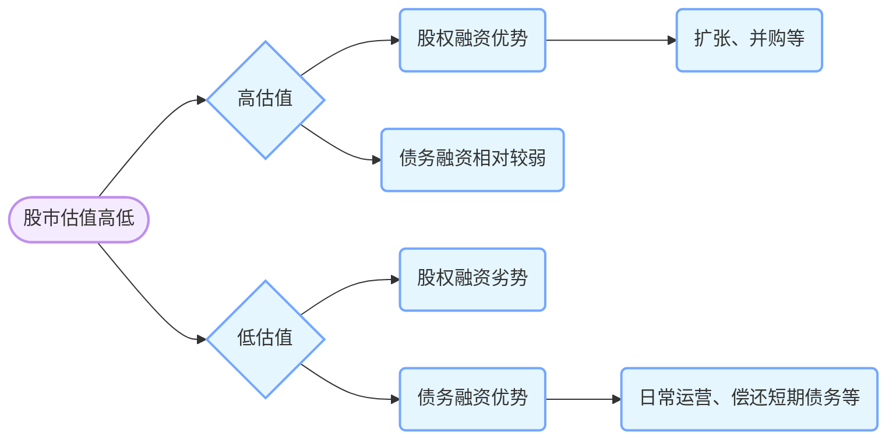

# 股市估值高低对企业融资决策的影响

> 关键词：股市估值、企业融资决策、股权融资、债务融资、市场环境

> 摘要：本文深入探讨了股市估值高低对企业融资决策的影响。通过分析股市估值的核心概念及其与企业融资的联系，阐述了相关算法原理和数学模型，结合实际案例说明股市估值如何在不同情况下左右企业的融资选择。同时介绍了在该领域的实际应用场景、相关工具和资源，最后对未来发展趋势与挑战进行了总结，并提供常见问题解答和扩展阅读资料，旨在为企业在复杂的市场环境中制定合理的融资决策提供理论和实践指导。

## 1. 背景介绍 
### 1.1 目的和范围
本研究旨在全面剖析股市估值高低这一关键因素如何影响企业的融资决策。范围涵盖了不同行业、不同规模企业在各种市场环境下，因股市估值波动而做出的融资策略调整。通过对理论和实际案例的研究，揭示股市估值与企业融资决策之间的内在联系和规律，为企业管理层、投资者以及相关研究人员提供有价值的参考。

### 1.2 预期读者
本文预期读者包括企业的高层管理人员、财务决策者，他们可以从中获取有关融资决策的重要信息，以优化企业的资本结构和融资策略；金融机构的从业者，如银行信贷人员、投资银行家等，有助于他们更好地评估企业的融资需求和风险；以及对金融市场和企业财务感兴趣的研究人员和学生，为他们的学术研究和学习提供理论和实践依据。

### 1.3 文档结构概述
本文首先介绍股市估值和企业融资决策的核心概念及其相互联系，通过文本示意图和 Mermaid 流程图进行直观展示。接着阐述核心算法原理，并给出具体操作步骤，同时结合 Python 代码进行详细说明。然后介绍相关的数学模型和公式，并举例说明其应用。在项目实战部分，通过实际案例展示股市估值对企业融资决策的影响，并对代码进行详细解读。之后分析股市估值高低在不同场景下的实际应用。再推荐相关的学习资源、开发工具框架和论文著作。最后总结未来发展趋势与挑战，提供常见问题解答和扩展阅读资料。

### 1.4 术语表
#### 1.4.1 核心术语定义
- **股市估值**：指对股票市场中上市公司价值的评估，通常通过各种估值方法计算得出，反映了市场对公司未来盈利能力和发展前景的预期。
- **企业融资决策**：企业为了满足自身的生产经营、投资扩张等资金需求，在多种融资方式中进行选择和组合的过程。
- **股权融资**：企业通过发行股票的方式向投资者筹集资金，投资者成为公司股东，分享公司的利润和承担风险。
- **债务融资**：企业通过向银行等金融机构借款或发行债券等方式筹集资金，需要按照约定的期限和利率偿还本金和利息。

#### 1.4.2 相关概念解释
- **市盈率（P/E）**：是最常用的估值指标之一，计算公式为 $P/E=\frac{股价}{每股收益}$，反映了投资者为获取公司每一元盈利所愿意支付的价格。
- **市净率（P/B）**：计算公式为 $P/B=\frac{股价}{每股净资产}$，衡量了市场对公司净资产的估值水平。

#### 1.4.3 缩略词列表
- **P/E**：Price-to-Earnings Ratio，市盈率
- **P/B**：Price-to-Book Ratio，市净率

## 2. 核心概念与联系 
### 核心概念原理
股市估值是基于对企业未来现金流、盈利能力、资产价值等多方面因素的综合评估。常用的估值方法包括绝对估值法（如现金流折现法）和相对估值法（如市盈率法、市净率法）。企业融资决策则是企业根据自身的发展战略、资金需求、财务状况等因素，在股权融资和债务融资等多种方式中进行选择。

当股市估值较高时，意味着市场对企业的未来发展前景较为乐观，投资者愿意为企业的股票支付较高的价格。此时，企业进行股权融资可以以较低的股权稀释成本筹集到更多的资金。相反，当股市估值较低时，企业进行股权融资可能会面临较高的股权稀释成本，因此可能更倾向于选择债务融资。

### 架构的文本示意图
```plaintext
股市估值高低
|
|-- 高估值
|   |-- 股权融资优势：低股权稀释成本，易筹集资金
|   |   |-- 用于扩张、并购等
|   |-- 债务融资：可能仍有一定吸引力，但相对股权融资较弱
|
|-- 低估值
|   |-- 股权融资劣势：高股权稀释成本
|   |-- 债务融资优势：相对更具吸引力，可维持股权结构稳定
|   |   |-- 用于日常运营、偿还短期债务等
```

### Mermaid 流程图


## 3. 核心算法原理 & 具体操作步骤 
### 核心算法原理
在评估股市估值对企业融资决策的影响时，我们可以通过计算企业的市盈率和市净率等指标来判断股市估值的高低。同时，我们可以建立一个简单的融资决策模型，根据估值指标和企业的财务状况来确定最优的融资方式。

### 具体操作步骤
1. **收集数据**：收集企业的股价、每股收益、每股净资产等数据。
2. **计算估值指标**：根据收集的数据计算市盈率和市净率。
3. **评估股市估值高低**：将计算得到的估值指标与同行业平均水平或历史数据进行比较，判断股市估值的高低。
4. **建立融资决策模型**：根据估值指标和企业的财务状况，如资产负债率、现金流等，建立一个融资决策模型。
5. **确定最优融资方式**：根据融资决策模型的结果，确定企业的最优融资方式。

### Python 代码实现
```python
import pandas as pd

# 收集数据
data = {
    '股价': [10, 12, 15, 18, 20],
    '每股收益': [1, 1.2, 1.5, 1.8, 2],
    '每股净资产': [5, 6, 7, 8, 9]
}
df = pd.DataFrame(data)

# 计算估值指标
df['市盈率'] = df['股价'] / df['每股收益']
df['市净率'] = df['股价'] / df['每股净资产']

# 评估股市估值高低
industry_avg_pe = 15
industry_avg_pb = 2

df['估值高低（市盈率）'] = df['市盈率'].apply(lambda x: '高' if x > industry_avg_pe else '低')
df['估值高低（市净率）'] = df['市净率'].apply(lambda x: '高' if x > industry_avg_pb else '低')

# 建立融资决策模型
def financing_decision(pe, pb, debt_ratio):
    if pe > industry_avg_pe and pb > industry_avg_pb and debt_ratio < 0.5:
        return '股权融资'
    else:
        return '债务融资'

df['资产负债率'] = [0.3, 0.4, 0.6, 0.2, 0.5]
df['最优融资方式'] = df.apply(lambda row: financing_decision(row['市盈率'], row['市净率'], row['资产负债率']), axis=1)

print(df)
```

## 4. 数学模型和公式 & 详细讲解 & 举例说明 
### 数学模型和公式
- **市盈率（P/E）**：$P/E=\frac{股价}{每股收益}$
- **市净率（P/B）**：$P/B=\frac{股价}{每股净资产}$

### 详细讲解
市盈率反映了投资者为获取公司每一元盈利所愿意支付的价格，是衡量股票估值水平的重要指标之一。市净率则衡量了市场对公司净资产的估值水平，反映了公司的资产质量和市场对其的认可度。

### 举例说明
假设某公司的股价为 20 元，每股收益为 2 元，每股净资产为 10 元。则该公司的市盈率为 $P/E=\frac{20}{2}=10$，市净率为 $P/B=\frac{20}{10}=2$。如果同行业平均市盈率为 15，平均市净率为 2.5，则该公司的市盈率低于行业平均水平，市净率与行业平均水平相当，说明该公司的股票可能被低估。

## 5. 项目实战：代码实际案例和详细解释说明 
### 5.1  开发环境搭建
- **操作系统**：Windows、Linux 或 macOS
- **编程语言**：Python 3.x
- **开发工具**：Jupyter Notebook 或 PyCharm
- **所需库**：pandas

### 5.2  源代码详细实现和代码解读
```python
import pandas as pd

# 收集数据
data = {
    '股价': [10, 12, 15, 18, 20],
    '每股收益': [1, 1.2, 1.5, 1.8, 2],
    '每股净资产': [5, 6, 7, 8, 9]
}
df = pd.DataFrame(data)

# 代码解读：使用字典创建一个包含股价、每股收益和每股净资产的数据，并将其转换为 Pandas 数据框。

# 计算估值指标
df['市盈率'] = df['股价'] / df['每股收益']
df['市净率'] = df['股价'] / df['每股净资产']

# 代码解读：根据市盈率和市净率的计算公式，在数据框中添加相应的列。

# 评估股市估值高低
industry_avg_pe = 15
industry_avg_pb = 2

df['估值高低（市盈率）'] = df['市盈率'].apply(lambda x: '高' if x > industry_avg_pe else '低')
df['估值高低（市净率）'] = df['市净率'].apply(lambda x: '高' if x > industry_avg_pb else '低')

# 代码解读：设定同行业平均市盈率和市净率，使用 apply 方法根据条件判断每个公司的估值高低，并添加相应的列。

# 建立融资决策模型
def financing_decision(pe, pb, debt_ratio):
    if pe > industry_avg_pe and pb > industry_avg_pb and debt_ratio < 0.5:
        return '股权融资'
    else:
        return '债务融资'

df['资产负债率'] = [0.3, 0.4, 0.6, 0.2, 0.5]
df['最优融资方式'] = df.apply(lambda row: financing_decision(row['市盈率'], row['市净率'], row['资产负债率']), axis=1)

# 代码解读：定义一个融资决策函数，根据市盈率、市净率和资产负债率判断最优融资方式。在数据框中添加资产负债率列，并使用 apply 方法根据函数结果添加最优融资方式列。

print(df)
```

### 5.3  代码解读与分析
通过上述代码，我们可以对不同公司的股市估值进行评估，并根据估值结果和财务状况确定最优的融资方式。代码的核心在于数据的处理和分析，通过 Pandas 库的强大功能，我们可以方便地进行数据计算和条件判断。

从分析结果来看，当股市估值较高且企业资产负债率较低时，企业更倾向于选择股权融资；反之，则更倾向于选择债务融资。这与我们之前的理论分析一致，说明该模型具有一定的合理性和实用性。

## 6. 实际应用场景 
### 扩张型企业
对于处于扩张阶段的企业，需要大量的资金用于投资新项目、扩大生产规模等。当股市估值较高时，企业可以通过股权融资以较低的成本筹集到足够的资金，为企业的扩张提供支持。例如，某科技公司计划开发一款新的软件产品，需要大量的研发资金。此时，若股市对科技行业的估值较高，该公司可以通过发行股票的方式筹集资金，避免了高额的债务利息负担。

### 困境型企业
当企业面临经营困境，如资金周转困难、业绩下滑等情况时，股市估值往往较低。此时，企业进行股权融资可能会面临较大的困难，因为投资者对企业的信心不足。因此，企业可能更倾向于选择债务融资，如向银行申请贷款或发行债券。例如，某传统制造业企业由于市场竞争激烈，业绩出现下滑，股市估值下降。该企业为了维持日常运营，向银行申请了一笔短期贷款，以缓解资金压力。

### 并购重组企业
在企业进行并购重组时，股市估值高低也会对融资决策产生重要影响。当股市估值较高时，企业可以通过发行股票的方式收购目标企业，实现低成本的扩张。例如，某大型企业计划收购一家小型创新企业，以获取其技术和市场份额。在股市估值较高的情况下，该大型企业可以通过发行股票换取小型企业的股权，完成并购交易。

## 7. 工具和资源推荐
### 7.1 学习资源推荐
#### 7.1.1 书籍推荐
- 《证券分析》（Security Analysis）：由本杰明·格雷厄姆（Benjamin Graham）和大卫·多德（David Dodd）所著，是价值投资领域的经典著作，详细介绍了股票估值的方法和理论。
- 《公司金融》（Corporate Finance）：由斯蒂芬·罗斯（Stephen Ross）等人所著，全面涵盖了企业融资、投资决策等方面的内容，是学习企业金融的权威教材。

#### 7.1.2 在线课程
- Coursera 上的“公司财务基础”（Fundamentals of Corporate Finance）课程：由宾夕法尼亚大学的教授授课，系统讲解了企业融资、资本预算等核心内容。
- edX 上的“投资学”（Investment Principles）课程：提供了股票估值、投资组合管理等方面的知识。

#### 7.1.3 技术博客和网站
- 雪球网：国内知名的财经社区，提供股票估值分析、企业财务报告等丰富的信息。
- Seeking Alpha：国外专业的金融分析网站，有大量关于股市估值和企业融资的研究文章。

### 7.2 开发工具框架推荐
#### 7.2.1 IDE和编辑器
- Jupyter Notebook：交互式的开发环境，适合进行数据探索和分析，方便展示代码和结果。
- PyCharm：功能强大的 Python 集成开发环境，提供代码调试、自动补全等功能。

#### 7.2.2 调试和性能分析工具
- PDB：Python 自带的调试工具，可用于调试代码中的错误。
- cProfile：Python 的性能分析工具，可帮助分析代码的性能瓶颈。

#### 7.2.3 相关框架和库
- Pandas：用于数据处理和分析的 Python 库，提供了强大的数据结构和数据操作功能。
- NumPy：用于科学计算的 Python 库，支持高效的数组运算。

### 7.3 相关论文著作推荐
#### 7.3.1 经典论文
- Modigliani, F., & Miller, M. H. (1958). The Cost of Capital, Corporation Finance and the Theory of Investment. American Economic Review, 48(3), 261-297. 该论文提出了著名的 MM 定理，为企业融资理论奠定了基础。
- Fama, E. F., & French, K. R. (1992). The Cross-Section of Expected Stock Returns. Journal of Finance, 47(2), 427-465. 提出了 Fama-French 三因子模型，对股票估值和投资组合理论产生了深远影响。

#### 7.3.2 最新研究成果
- Baker, M., & Wurgler, J. (2002). Market Timing and Capital Structure. Journal of Finance, 57(1), 1-32. 研究了市场时机对企业资本结构的影响。
- Welch, I. (2004). Capital Structure and Stock Returns. Journal of Political Economy, 112(1), 106-131. 探讨了企业资本结构与股票回报之间的关系。

#### 7.3.3 应用案例分析
- 可以参考各大金融研究机构发布的研究报告，如麦肯锡、波士顿咨询等，其中包含了大量关于企业融资决策的实际案例分析。

## 8. 总结：未来发展趋势与挑战
### 未来发展趋势
- **数字化和智能化**：随着金融科技的发展，股市估值和企业融资决策将越来越依赖于大数据、人工智能等技术。通过对海量数据的分析和挖掘，可以更准确地评估股市估值和预测企业的融资需求。
- **绿色融资兴起**：在全球关注环境保护和可持续发展的背景下，绿色融资将成为企业融资的重要方向。股市估值也将更加关注企业的环境、社会和治理（ESG）表现。
- **国际化趋势加强**：随着全球经济一体化的加深，企业的融资渠道将更加多元化，跨国融资和跨境并购将越来越频繁。股市估值也将受到国际市场因素的影响。

### 挑战
- **市场不确定性增加**：全球政治经济形势的不确定性、宏观经济政策的变化等因素将增加股市估值的难度，给企业融资决策带来更大的挑战。
- **数据安全和隐私问题**：在数字化和智能化的背景下，企业融资决策需要处理大量的敏感数据，数据安全和隐私保护成为重要问题。
- **监管要求提高**：为了维护金融市场的稳定和保护投资者的利益，监管机构对企业融资的监管要求将越来越严格，企业需要遵守更多的法规和规范。

## 9. 附录：常见问题与解答
### 问题 1：股市估值高就一定适合股权融资吗？
答：不一定。虽然股市估值高时股权融资可以以较低的股权稀释成本筹集资金，但企业还需要考虑自身的财务状况、发展战略等因素。例如，如果企业的资产负债率已经很高，过度的股权融资可能会导致股权结构过于分散，影响企业的控制权。

### 问题 2：如何准确评估股市估值的高低？
答：可以通过多种方法评估股市估值的高低，如比较市盈率、市净率等估值指标与同行业平均水平或历史数据，分析企业的基本面和行业发展趋势等。同时，还可以参考专业机构的研究报告和市场分析师的观点。

### 问题 3：债务融资和股权融资各有什么优缺点？
答：债务融资的优点是成本相对较低，不会稀释股权，且利息支出可以在税前扣除；缺点是需要按时偿还本金和利息，增加了企业的财务风险。股权融资的优点是不需要偿还本金，没有固定的利息支出，能够增强企业的资本实力；缺点是会稀释股权，可能导致股东控制权分散，且融资成本相对较高。

## 10. 扩展阅读 & 参考资料
- Damodaran, A. (2012). Investment Valuation: Tools and Techniques for Determining the Value of Any Asset. Wiley.
- Brealey, R. A., Myers, S. C., & Allen, F. (2020). Principles of Corporate Finance. McGraw-Hill Education.
- 各大财经媒体网站，如新浪财经、东方财富网等。

作者：AI天才研究院/AI Genius Institute & 禅与计算机程序设计艺术 /Zen And The Art of Computer Programming