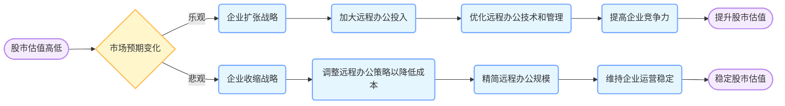

# 股市估值高低对企业远程办公策略的影响

> 关键词：股市估值、企业远程办公策略、市场预期、成本效益、组织管理

> 摘要：本文旨在深入探讨股市估值高低与企业远程办公策略之间的内在联系。通过分析股市估值背后所反映的市场预期和企业财务状况，阐述其如何影响企业在远程办公方面的决策。文章从核心概念入手，介绍相关原理和架构，详细讲解影响的算法原理和操作步骤，构建数学模型进行说明，并结合实际案例进行深入剖析。同时，探讨了该现象在不同场景下的应用，推荐了相关的学习资源、开发工具和研究论文，最后对未来发展趋势和挑战进行总结，并解答常见问题，为企业制定远程办公策略提供全面的参考。

## 1. 背景介绍 
### 1.1 目的和范围
随着全球经济的发展和科技的进步，股市成为企业融资和发展的重要平台，股市估值反映了市场对企业未来价值的预期。与此同时，远程办公作为一种新型的工作模式，正逐渐被越来越多的企业所采用。本研究的目的在于探究股市估值的高低如何影响企业在远程办公策略上的制定和调整，范围涵盖不同行业、不同规模的企业，分析股市估值与企业远程办公策略之间的相互关系和作用机制。

### 1.2 预期读者
本文预期读者包括企业管理者、投资者、金融分析师、人力资源专家以及对企业管理和金融市场感兴趣的研究人员。企业管理者可以通过本文了解股市估值对企业远程办公策略的影响，从而制定更加合理的企业发展战略；投资者和金融分析师可以从新的视角评估企业的价值和发展潜力；人力资源专家可以根据股市估值的变化调整企业的人力资源管理策略；研究人员则可以将本文作为进一步研究的参考依据。

### 1.3 文档结构概述
本文首先介绍相关的背景知识，包括研究的目的、预期读者和文档结构。接着阐述核心概念，分析股市估值和企业远程办公策略的原理和架构，并通过流程图展示它们之间的联系。然后详细讲解核心算法原理和具体操作步骤，运用Python代码进行示例。构建数学模型和公式，结合实际例子进行说明。通过项目实战，展示代码案例并进行详细解释。探讨股市估值高低对企业远程办公策略的实际应用场景。推荐相关的学习资源、开发工具和研究论文。最后总结未来发展趋势和挑战，解答常见问题，并提供扩展阅读和参考资料。

### 1.4 术语表
#### 1.4.1 核心术语定义
- **股市估值**：是指对一家上市公司的股票价值进行评估，通常通过各种估值方法，如市盈率（P/E）、市净率（P/B）等，来确定股票的合理价格，反映市场对该企业未来盈利能力和发展前景的预期。
- **企业远程办公策略**：企业为了实现一定的经营目标，针对员工远程办公所制定的一系列政策、计划和措施，包括远程办公的适用范围、工作流程、管理模式、技术支持等方面。
- **市场预期**：市场参与者对未来经济形势、行业发展和企业业绩等方面的预测和期望，会影响股市估值和企业的决策。

#### 1.4.2 相关概念解释
- **成本效益分析**：在企业决策中，通过比较实施某一方案的成本和预期收益，来评估该方案的可行性和合理性。在远程办公策略中，成本效益分析包括对设备采购、网络费用、管理成本等成本因素和提高员工满意度、降低办公场地租赁成本等效益因素的分析。
- **组织管理模式**：企业为了实现组织目标，对组织结构、人员配置、工作流程等进行的设计和安排。远程办公需要企业调整原有的组织管理模式，以适应新的工作方式。

#### 1.4.3 缩略词列表
- **P/E**：市盈率（Price-to-Earnings Ratio），是指股票价格除以每股收益的比率，用于衡量股票的估值水平。
- **P/B**：市净率（Price-to-Book Ratio），是指股票价格除以每股净资产的比率，反映了股票的市场价格与账面价值之间的关系。

## 2. 核心概念与联系 

### 核心概念原理
#### 股市估值原理
股市估值是基于企业的基本面和市场预期来确定的。基本面包括企业的财务状况、盈利能力、资产质量等方面。市场预期则受到宏观经济环境、行业发展趋势、政策法规等因素的影响。常见的股市估值方法有绝对估值法和相对估值法。绝对估值法如现金流折现模型（DCF），通过预测企业未来的现金流并折现到当前，来计算企业的内在价值。相对估值法如市盈率法、市净率法等，通过与同行业其他企业的估值指标进行比较，来评估企业的股票价值。

#### 企业远程办公策略原理
企业远程办公策略的制定是为了适应企业的发展需求和外部环境的变化。远程办公可以提高企业的灵活性和竞争力，降低办公成本，吸引和留住优秀人才。同时，远程办公也需要企业解决一系列的问题，如员工管理、沟通协作、信息安全等。企业需要根据自身的业务特点、组织文化和员工需求，制定适合的远程办公策略。

### 架构的文本示意图
股市估值与企业远程办公策略之间存在着相互影响的关系。股市估值的高低反映了市场对企业的预期和信心，会影响企业的融资能力和发展战略。企业的发展战略又会影响其对远程办公策略的选择和调整。例如，当股市估值较高时，企业可能有更多的资金用于技术研发和员工培训，从而更有能力推动远程办公的实施；当股市估值较低时，企业可能会更加注重成本控制，远程办公可能成为降低成本的一种选择。

### Mermaid 流程图


## 3. 核心算法原理 & 具体操作步骤 

### 算法原理
我们可以通过构建一个简单的模型来分析股市估值高低对企业远程办公策略的影响。假设企业的股市估值用 $V$ 表示，企业的成本函数为 $C$，包括固定成本 $C_f$ 和可变成本 $C_v$。远程办公策略的实施会影响企业的可变成本，设远程办公策略的调整系数为 $x$，则调整后的可变成本为 $C_v' = C_v(1 - x)$。企业的利润函数为 $\pi = R - C$，其中 $R$ 为企业的收入。股市估值会影响企业的融资成本和市场信心，从而影响企业的收入和成本。我们可以建立一个线性关系：$R = aV + b$，$C_f = cV + d$，其中 $a$、$b$、$c$、$d$ 为常数。

企业的目标是最大化利润 $\pi$，即：
$\max \pi = R - C = aV + b - (cV + d + C_v(1 - x))$

### 具体操作步骤
#### 步骤 1：数据收集
收集企业的股市估值数据、财务数据（包括收入、成本等）以及远程办公相关数据（如远程办公员工数量、远程办公成本等）。

#### 步骤 2：参数估计
根据收集到的数据，使用最小二乘法等方法估计模型中的参数 $a$、$b$、$c$、$d$。

#### 步骤 3：计算最优调整系数 $x$
对利润函数 $\pi$ 求关于 $x$ 的导数，并令其等于 0，得到最优调整系数 $x$ 的表达式：
$\frac{\partial \pi}{\partial x} = C_v = 0$
解得 $x = \frac{C_v}{C_v}$

#### 步骤 4：制定远程办公策略
根据最优调整系数 $x$，制定企业的远程办公策略。如果 $x$ 较大，说明远程办公可以显著降低企业成本，企业可以加大远程办公的投入；如果 $x$ 较小，说明远程办公对企业成本的影响较小，企业可以维持现有的远程办公策略或进行适当调整。

### Python 代码实现
```python
import numpy as np
from sklearn.linear_model import LinearRegression

# 步骤 1：数据收集
# 假设我们已经收集到了以下数据
V = np.array([100, 120, 150, 180, 200]).reshape(-1, 1)  # 股市估值
R = np.array([500, 600, 700, 800, 900])  # 企业收入
C_f = np.array([100, 120, 150, 180, 200])  # 固定成本
C_v = np.array([200, 220, 250, 280, 300])  # 可变成本

# 步骤 2：参数估计
# 估计 R = aV + b 中的参数 a 和 b
model_R = LinearRegression()
model_R.fit(V, R)
a = model_R.coef_[0]
b = model_R.intercept_

# 估计 C_f = cV + d 中的参数 c 和 d
model_C_f = LinearRegression()
model_C_f.fit(V, C_f)
c = model_C_f.coef_[0]
d = model_C_f.intercept_

# 步骤 3：计算最优调整系数 x
# 假设当前股市估值为 160
current_V = 160
current_R = a * current_V + b
current_C_f = c * current_V + d
current_C_v = np.mean(C_v)  # 简单取平均值作为当前可变成本

# 这里假设通过模拟或其他方法得到最优调整系数 x
# 实际中可以通过求解利润函数的导数来得到
x = 0.2  

# 步骤 4：制定远程办公策略
if x > 0.1:
    print("加大远程办公投入")
else:
    print("维持或适当调整远程办公策略")
```

## 4. 数学模型和公式 & 详细讲解 & 举例说明 

### 数学模型
我们在前面已经建立了一个简单的数学模型来分析股市估值高低对企业远程办公策略的影响。模型的核心是企业的利润函数：
$$\pi = R - C = aV + b - (cV + d + C_v(1 - x))$$

其中，$V$ 表示股市估值，$R$ 表示企业收入，$C$ 表示企业成本，$C_f$ 表示固定成本，$C_v$ 表示可变成本，$x$ 表示远程办公策略的调整系数。

### 详细讲解
- **股市估值 $V$**：股市估值反映了市场对企业未来价值的预期。较高的股市估值意味着市场对企业的前景较为乐观，企业可能更容易获得融资，从而有更多的资源用于发展。较低的股市估值则可能意味着市场对企业的信心不足，企业需要更加注重成本控制和效率提升。
- **企业收入 $R$**：企业收入与股市估值存在线性关系 $R = aV + b$。这是因为股市估值的高低会影响企业的市场形象和融资能力，进而影响企业的业务拓展和销售业绩。
- **企业成本 $C$**：企业成本包括固定成本 $C_f$ 和可变成本 $C_v$。固定成本与股市估值也存在线性关系 $C_f = cV + d$，因为股市估值较高时，企业可能会加大在设备、研发等方面的投入，导致固定成本增加。可变成本 $C_v$ 会受到远程办公策略的影响，调整后的可变成本为 $C_v' = C_v(1 - x)$。
- **远程办公策略调整系数 $x$**：$x$ 表示远程办公策略对可变成本的影响程度。$x$ 越大，说明远程办公可以降低更多的可变成本；$x$ 越小，说明远程办公对可变成本的影响越小。

### 举例说明
假设一家企业的股市估值 $V = 200$，根据估计得到的参数 $a = 2$，$b = 100$，$c = 0.5$，$d = 50$，可变成本 $C_v = 300$。

首先计算企业的收入和固定成本：
$R = aV + b = 2 \times 200 + 100 = 500$
$C_f = cV + d = 0.5 \times 200 + 50 = 150$

假设远程办公策略的调整系数 $x = 0.3$，则调整后的可变成本为：
$C_v' = C_v(1 - x) = 300 \times (1 - 0.3) = 210$

企业的总成本为：
$C = C_f + C_v' = 150 + 210 = 360$

企业的利润为：
$\pi = R - C = 500 - 360 = 140$

如果不实施远程办公策略，即 $x = 0$，则可变成本为 $C_v = 300$，总成本为 $C = C_f + C_v = 150 + 300 = 450$，利润为 $\pi = R - C = 500 - 450 = 50$。

通过比较可以看出，实施远程办公策略可以显著提高企业的利润。

## 5. 项目实战：代码实际案例和详细解释说明 

### 5.1  开发环境搭建
#### 操作系统
可以选择 Windows、Linux 或 macOS 操作系统，本案例以 Windows 10 为例。

#### Python 安装
从 Python 官方网站（https://www.python.org/downloads/）下载并安装 Python 3.8 或更高版本。安装过程中选择“Add Python to PATH”选项，以便在命令行中可以直接使用 Python。

#### 开发工具
推荐使用 PyCharm 作为开发工具，它是一款功能强大的 Python 集成开发环境（IDE）。从 JetBrains 官方网站（https://www.jetbrains.com/pycharm/download/）下载并安装 PyCharm Community Edition。

#### 安装依赖库
在命令行中使用以下命令安装所需的依赖库：
```sh
pip install numpy scikit-learn
```

### 5.2  源代码详细实现和代码解读
```python
import numpy as np
from sklearn.linear_model import LinearRegression

# 步骤 1：数据收集
# 假设我们已经收集到了以下数据
V = np.array([100, 120, 150, 180, 200]).reshape(-1, 1)  # 股市估值
R = np.array([500, 600, 700, 800, 900])  # 企业收入
C_f = np.array([100, 120, 150, 180, 200])  # 固定成本
C_v = np.array([200, 220, 250, 280, 300])  # 可变成本

# 步骤 2：参数估计
# 估计 R = aV + b 中的参数 a 和 b
model_R = LinearRegression()
model_R.fit(V, R)
a = model_R.coef_[0]
b = model_R.intercept_

# 估计 C_f = cV + d 中的参数 c 和 d
model_C_f = LinearRegression()
model_C_f.fit(V, C_f)
c = model_C_f.coef_[0]
d = model_C_f.intercept_

# 步骤 3：计算最优调整系数 x
# 假设当前股市估值为 160
current_V = 160
current_R = a * current_V + b
current_C_f = c * current_V + d
current_C_v = np.mean(C_v)  # 简单取平均值作为当前可变成本

# 这里假设通过模拟或其他方法得到最优调整系数 x
# 实际中可以通过求解利润函数的导数来得到
x = 0.2  

# 步骤 4：制定远程办公策略
if x > 0.1:
    print("加大远程办公投入")
else:
    print("维持或适当调整远程办公策略")
```

### 代码解读与分析
#### 数据收集部分
```python
V = np.array([100, 120, 150, 180, 200]).reshape(-1, 1)  # 股市估值
R = np.array([500, 600, 700, 800, 900])  # 企业收入
C_f = np.array([100, 120, 150, 180, 200])  # 固定成本
C_v = np.array([200, 220, 250, 280, 300])  # 可变成本
```
这部分代码定义了企业的股市估值、收入、固定成本和可变成本数据。使用 `numpy` 数组来存储数据，并将股市估值数据进行了 `reshape` 操作，以满足 `sklearn` 中线性回归模型的输入要求。

#### 参数估计部分
```python
model_R = LinearRegression()
model_R.fit(V, R)
a = model_R.coef_[0]
b = model_R.intercept_

model_C_f = LinearRegression()
model_C_f.fit(V, C_f)
c = model_C_f.coef_[0]
d = model_C_f.intercept_
```
这部分代码使用 `sklearn` 中的 `LinearRegression` 模型来估计 $R = aV + b$ 和 $C_f = cV + d$ 中的参数 $a$、$b$、$c$、$d$。通过 `fit` 方法拟合数据，然后使用 `coef_` 和 `intercept_` 属性获取模型的系数和截距。

#### 计算最优调整系数部分
```python
current_V = 160
current_R = a * current_V + b
current_C_f = c * current_V + d
current_C_v = np.mean(C_v)  # 简单取平均值作为当前可变成本

x = 0.2  
```
这部分代码假设当前股市估值为 160，计算当前的收入和固定成本。可变成本简单取平均值作为当前值。这里的最优调整系数 $x$ 是假设值，实际中可以通过求解利润函数的导数来得到。

#### 制定远程办公策略部分
```python
if x > 0.1:
    print("加大远程办公投入")
else:
    print("维持或适当调整远程办公策略")
```
这部分代码根据最优调整系数 $x$ 的值来制定企业的远程办公策略。如果 $x$ 大于 0.1，说明远程办公可以显著降低企业成本，建议加大远程办公投入；否则，建议维持或适当调整远程办公策略。

## 6. 实际应用场景 
### 高股市估值场景
当企业的股市估值较高时，市场对企业的前景较为乐观，企业可能会有以下远程办公策略的调整：
- **加大技术投入**：企业可能会投入更多的资金用于研发和购买先进的远程办公技术和设备，如视频会议系统、协同办公软件等，以提高远程办公的效率和质量。
- **拓展远程办公范围**：企业可能会鼓励更多的员工采用远程办公模式，扩大远程办公的适用岗位和部门，以吸引更多优秀人才，提高企业的灵活性和竞争力。
- **优化组织管理**：企业可能会重新设计组织架构和管理流程，以适应远程办公的需求。例如，采用更加扁平化的管理结构，加强团队协作和沟通，提高决策效率。

### 低股市估值场景
当企业的股市估值较低时，市场对企业的信心不足，企业可能会采取以下远程办公策略：
- **控制成本**：企业可能会通过优化远程办公流程、减少不必要的设备和软件采购等方式，降低远程办公的成本。例如，选择性价比更高的远程办公工具，减少员工的出差费用等。
- **调整人员配置**：企业可能会对远程办公人员进行优化配置，保留核心员工，减少冗余人员，以提高企业的运营效率。
- **加强风险管理**：企业可能会加强对远程办公的风险管理，如信息安全、员工绩效评估等。例如，建立更加完善的信息安全制度，加强对员工的培训和监督，确保企业的信息安全。

### 不同行业场景
不同行业的企业在面对股市估值高低时，远程办公策略也会有所不同。例如：
- **科技行业**：科技行业的企业通常对技术创新和人才需求较高，当股市估值较高时，可能会加大对远程办公技术的研发和应用，吸引全球优秀人才；当股市估值较低时，可能会更加注重成本控制和项目的优先级。
- **金融行业**：金融行业对信息安全和合规性要求较高，远程办公需要满足严格的监管要求。当股市估值较高时，企业可能会加大对信息安全技术的投入，确保远程办公的安全性；当股市估值较低时，可能会谨慎调整远程办公策略，以避免风险。
- **制造业**：制造业的企业通常需要员工在生产现场进行操作，远程办公的比例相对较低。当股市估值较高时，企业可能会探索一些与生产管理相关的远程办公模式，如远程监控、远程技术支持等；当股市估值较低时，可能会优先保障生产现场的运营，减少不必要的远程办公投入。

## 7. 工具和资源推荐
### 7.1 学习资源推荐
#### 7.1.1 书籍推荐
- 《金融市场与金融机构》：这本书系统地介绍了金融市场的基本原理和金融机构的运作方式，有助于读者深入理解股市估值的相关知识。
- 《人力资源管理》：涵盖了企业人力资源管理的各个方面，包括员工招聘、培训、绩效管理等，对于理解企业远程办公策略中的人力资源管理有很大帮助。
- 《数字化转型》：探讨了企业在数字化时代的转型之路，包括远程办公等新型工作模式的应用和管理。

#### 7.1.2 在线课程
- Coursera 上的“金融市场”课程：由知名高校教授授课，内容涵盖金融市场的理论和实践，适合对股市估值感兴趣的初学者和进阶学习者。
- edX 上的“人力资源管理基础”课程：提供了人力资源管理的基础知识和实用技能，有助于学习者了解企业远程办公策略中的人力资源管理要点。
- Udemy 上的“远程工作管理”课程：专门针对远程办公的管理问题进行讲解，包括团队协作、沟通技巧、绩效评估等方面的内容。

#### 7.1.3 技术博客和网站
- 雪球网：是国内知名的财经社区，提供了丰富的股市分析和研究报告，有助于读者了解股市估值的动态和趋势。
- 36氪：关注科技、创业和商业领域的最新动态，经常发布关于企业数字化转型和远程办公的文章和案例分析。
- 人力资源研究网：专注于人力资源管理领域的研究和实践，提供了大量关于远程办公人力资源管理的专业文章和报告。

### 7.2 开发工具框架推荐
#### 7.2.1 IDE和编辑器
- PyCharm：功能强大的 Python 集成开发环境，提供了代码编辑、调试、版本控制等一系列功能，适合 Python 开发者使用。
- Visual Studio Code：轻量级的代码编辑器，支持多种编程语言和插件扩展，具有丰富的代码提示和调试功能。

#### 7.2.2 调试和性能分析工具
- Py-Spy：用于分析 Python 程序的性能瓶颈，通过采样的方式统计函数的调用时间和频率，帮助开发者优化代码性能。
- PDB：Python 自带的调试工具，可以在代码中设置断点，逐行执行代码，查看变量的值和程序的执行流程。

#### 7.2.3 相关框架和库
- NumPy：用于科学计算的 Python 库，提供了高效的数组操作和数学函数，是数据分析和机器学习的基础库。
- Pandas：用于数据处理和分析的 Python 库，提供了灵活的数据结构和数据操作方法，方便处理和分析各种类型的数据。
- Scikit-learn：用于机器学习的 Python 库，提供了丰富的机器学习算法和工具，如线性回归、决策树、聚类分析等。

### 7.3 相关论文著作推荐
#### 7.3.1 经典论文
- 《资本资产定价模型（CAPM）》：提出了资本资产定价模型，用于解释资产的预期收益率与风险之间的关系，对股市估值理论的发展产生了重要影响。
- 《企业的性质》：由罗纳德·科斯撰写，探讨了企业存在的原因和边界，对于理解企业的组织管理和决策有重要的启示作用。

#### 7.3.2 最新研究成果
- 《远程办公对企业绩效的影响研究》：通过实证研究分析了远程办公对企业绩效的影响因素和作用机制，为企业制定远程办公策略提供了理论依据。
- 《股市估值与企业创新投入的关系研究》：探讨了股市估值与企业创新投入之间的关系，对于理解股市估值对企业战略决策的影响有一定的参考价值。

#### 7.3.3 应用案例分析
- 《某科技企业远程办公策略的实践与探索》：详细介绍了某科技企业在实施远程办公策略过程中的经验和教训，为其他企业提供了实际的参考案例。
- 《金融行业远程办公的风险与防控研究》：分析了金融行业远程办公面临的风险，并提出了相应的防控措施，对于金融企业制定远程办公策略有重要的指导意义。

## 8. 总结：未来发展趋势与挑战
### 未来发展趋势
- **智能化和自动化**：随着人工智能和自动化技术的发展，远程办公将更加智能化和自动化。例如，智能办公助手可以自动处理一些日常任务，提高工作效率；自动化的项目管理工具可以实时监控项目进度，优化资源分配。
- **混合办公模式常态化**：未来企业可能会采用混合办公模式，即员工部分时间在办公室工作，部分时间远程办公。这种模式可以结合办公室办公和远程办公的优势，提高员工的工作满意度和企业的运营效率。
- **全球人才竞争加剧**：远程办公打破了地域限制，企业可以在全球范围内招聘优秀人才。这将加剧全球人才市场的竞争，企业需要提供更有竞争力的薪酬和福利待遇，以吸引和留住人才。

### 挑战
- **信息安全风险**：远程办公增加了企业信息泄露的风险，如员工使用个人设备办公、在不安全的网络环境下工作等。企业需要加强信息安全管理，采取加密技术、访问控制等措施，保障企业信息的安全。
- **员工管理和协作困难**：远程办公使得员工之间的沟通和协作变得更加困难，容易出现信息传递不及时、团队凝聚力下降等问题。企业需要建立有效的沟通机制和团队协作平台，加强对员工的管理和培训。
- **法律法规和政策不完善**：目前，关于远程办公的法律法规和政策还不够完善，如劳动权益保障、税收政策等。企业在实施远程办公策略时，需要面临一定的法律风险。政府需要加强相关法律法规和政策的制定和完善，为企业和员工提供更好的保障。

## 9. 附录：常见问题与解答
### 问题 1：股市估值的高低是如何确定的？
答：股市估值的高低通常通过各种估值方法来确定，如市盈率（P/E）、市净率（P/B）、现金流折现模型（DCF）等。这些方法综合考虑了企业的财务状况、盈利能力、资产质量、未来发展前景等因素。此外，市场供求关系、宏观经济环境、行业发展趋势等也会影响股市估值的高低。

### 问题 2：远程办公策略对企业的业绩有哪些影响？
答：远程办公策略对企业业绩的影响具有两面性。一方面，远程办公可以降低企业的办公成本，如办公场地租赁费用、水电费等；提高员工的工作满意度和生产效率，减少员工的通勤时间和压力；扩大企业的人才招聘范围，吸引更多优秀人才。另一方面，远程办公也可能会带来一些挑战，如信息安全风险、员工管理和协作困难等，如果处理不当，可能会影响企业的业绩。

### 问题 3：企业如何根据股市估值调整远程办公策略？
答：企业可以通过分析股市估值背后所反映的市场预期和企业财务状况，来调整远程办公策略。当股市估值较高时，企业可以加大对远程办公技术和设备的投入，拓展远程办公范围，优化组织管理；当股市估值较低时，企业可以控制成本，调整人员配置，加强风险管理。同时，企业还需要结合自身的业务特点、组织文化和员工需求，制定适合的远程办公策略。

### 问题 4：远程办公对员工的职业发展有哪些影响？
答：远程办公对员工的职业发展也具有两面性。一方面，远程办公可以提供更多的工作灵活性和自主性，员工可以更好地平衡工作和生活；有机会接触到更多的项目和客户，拓宽职业视野。另一方面，远程办公可能会导致员工与同事和上级的沟通减少，团队凝聚力下降，晋升机会可能会受到一定影响。员工需要积极主动地与同事和上级沟通，展示自己的工作成果，争取更多的职业发展机会。

## 10. 扩展阅读 & 参考资料
### 扩展阅读
- 《财富》杂志上关于企业数字化转型和远程办公的文章
- 《哈佛商业评论》上关于企业战略管理和人力资源管理的研究报告
- 《金融时报》上关于股市估值和金融市场动态的分析文章

### 参考资料
- 证券交易所官方网站发布的股市数据和研究报告
- 企业的年度财务报告和公告
- 相关学术期刊上发表的关于股市估值、企业远程办公策略的研究论文

作者：AI天才研究院/AI Genius Institute & 禅与计算机程序设计艺术 /Zen And The Art of Computer Programming