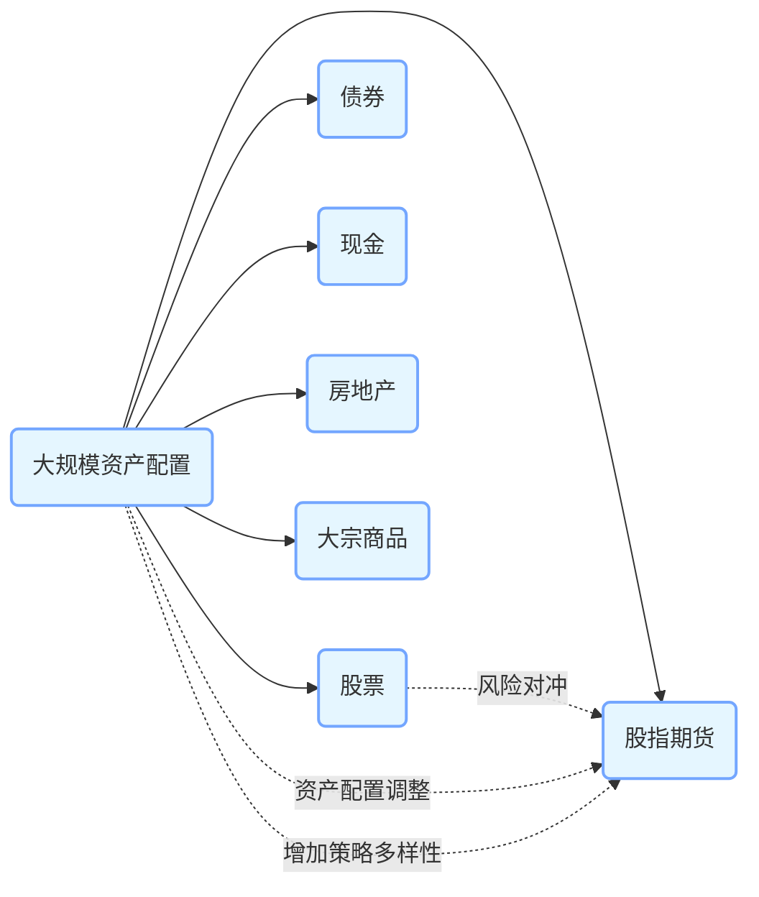

# 股指期货：大规模资产配置的对冲工具

> 关键词：股指期货、大规模资产配置、对冲工具、风险管理、金融市场

> 摘要：本文围绕股指期货作为大规模资产配置的对冲工具展开深入探讨。首先介绍了相关背景知识，包括目的范围、预期读者等内容。接着阐述了股指期货的核心概念及与大规模资产配置的联系，详细讲解了核心算法原理和具体操作步骤，并运用数学模型和公式进行理论分析。通过项目实战案例，展示了股指期货在实际应用中的代码实现和解读。分析了股指期货在不同场景下的实际应用，还推荐了学习相关知识的工具和资源。最后总结了股指期货的未来发展趋势与挑战，同时提供了常见问题解答和扩展阅读参考资料，旨在帮助读者全面深入地了解股指期货在大规模资产配置中的作用和应用。

## 1. 背景介绍 
### 1.1 目的和范围
在金融市场中，大规模资产配置面临着诸多风险，如市场波动、系统性风险等。股指期货作为一种重要的金融衍生品，具有对冲风险的功能，能够为大规模资产配置提供有效的风险管理手段。本文的目的在于深入剖析股指期货作为大规模资产配置对冲工具的原理、应用和相关技术细节，涵盖股指期货的基本概念、核心算法、数学模型、实际案例以及未来发展趋势等方面，旨在为投资者、金融从业者和相关研究人员提供全面且深入的参考。

### 1.2 预期读者
本文预期读者包括但不限于以下几类人群：
- **投资者**：包括个人投资者和机构投资者，希望通过了解股指期货来优化大规模资产配置，降低投资风险。
- **金融从业者**：如基金经理、分析师、交易员等，需要深入掌握股指期货的相关知识，以便在工作中更好地运用这一工具。
- **研究人员**：从事金融工程、风险管理等领域研究的学者和研究人员，可从本文获取相关理论和实践方面的参考。
- **学生**：金融、经济等专业的学生，通过阅读本文可以加深对股指期货和资产配置的理解。

### 1.3 文档结构概述
本文共分为十个部分，具体结构如下：
- **背景介绍**：阐述文章的目的、范围、预期读者和文档结构概述，并对相关术语进行解释。
- **核心概念与联系**：介绍股指期货和大规模资产配置的核心概念，分析它们之间的联系，并通过文本示意图和 Mermaid 流程图进行直观展示。
- **核心算法原理 & 具体操作步骤**：详细讲解股指期货对冲的核心算法原理，并给出具体的 Python 代码实现和操作步骤。
- **数学模型和公式 & 详细讲解 & 举例说明**：运用数学模型和公式对股指期货对冲进行理论分析，并通过具体例子进行说明。
- **项目实战：代码实际案例和详细解释说明**：通过实际项目案例，展示如何在开发环境中使用股指期货进行大规模资产配置的对冲，并对代码进行详细解读。
- **实际应用场景**：分析股指期货在不同场景下的实际应用，如股票投资组合对冲、资产再平衡等。
- **工具和资源推荐**：推荐学习股指期货和大规模资产配置相关知识的工具和资源，包括书籍、在线课程、技术博客、开发工具和相关论文等。
- **总结：未来发展趋势与挑战**：总结股指期货作为大规模资产配置对冲工具的发展趋势和面临的挑战。
- **附录：常见问题与解答**：解答读者在阅读过程中可能遇到的常见问题。
- **扩展阅读 & 参考资料**：提供相关的扩展阅读资料和参考文献，方便读者进一步深入学习。

### 1.4 术语表
#### 1.4.1 核心术语定义
- **股指期货**：是以股票指数为标的物的标准化期货合约，双方约定在未来的某个特定日期，可以按照事先确定的股价指数的大小，进行标的指数的买卖。
- **大规模资产配置**：是指投资者根据自身的投资目标、风险承受能力和投资期限等因素，将资金分配到不同的资产类别（如股票、债券、期货等）中，以实现资产的多元化和风险的分散。
- **对冲**：是指通过在期货市场上进行与现货市场相反的交易，来抵消现货市场价格波动带来的风险。
- **基差**：是指现货价格与期货价格之间的差值，即基差 = 现货价格 - 期货价格。
- **套期保值比率**：是指为了实现套期保值目标，在期货市场上交易的期货合约数量与现货市场上交易的现货数量之间的比例。

#### 1.4.2 相关概念解释
- **期货市场**：是进行期货交易的场所，是期货合约买卖交换的活动空间。期货市场具有价格发现、套期保值和投机等功能。
- **现货市场**：是指买卖商品或金融资产的实际交易市场，交易双方在交易时立即进行实物交割或资金结算。
- **系统性风险**：是指由于宏观经济、政治、社会等因素引起的，对整个市场或大部分资产产生影响的风险，无法通过分散投资来消除。
- **非系统性风险**：是指由于个别公司、行业等因素引起的，只对个别资产产生影响的风险，可以通过分散投资来降低。

#### 1.4.3 缩略词列表
- **IF**：沪深 300 股指期货合约代码。
- **IH**：上证 50 股指期货合约代码。
- **IC**：中证 500 股指期货合约代码。

## 2. 核心概念与联系 
### 2.1 股指期货核心概念
股指期货是一种金融衍生品，它的交易对象是股票指数。与股票不同，股指期货交易的是对未来股票指数的预期价格。投资者可以通过买入或卖出股指期货合约，来表达对市场走势的看法。例如，如果投资者预期市场将上涨，可以买入股指期货合约；反之，如果预期市场将下跌，则可以卖出股指期货合约。

股指期货具有以下特点：
- **杠杆效应**：投资者只需缴纳一定比例的保证金，就可以控制较大价值的合约。例如，保证金比例为 10%，则投资者用 10 万元的保证金可以控制价值 100 万元的股指期货合约。
- **标准化合约**：股指期货合约是标准化的，包括合约标的、合约乘数、报价单位、最小变动价位、合约月份、交易时间、最后交易日、交割方式等都有明确规定。
- **双向交易**：投资者既可以做多（买入合约），也可以做空（卖出合约），无论市场上涨还是下跌，都有获利机会。
- **现金交割**：股指期货合约到期时，采用现金交割方式，即根据最后交易日的结算价，计算合约盈亏并进行现金结算，而不进行股票的实物交割。

### 2.2 大规模资产配置核心概念
大规模资产配置是指投资者将大量资金分配到不同的资产类别中，以实现投资目标的过程。资产类别包括股票、债券、现金、房地产、大宗商品等。大规模资产配置的目的是通过分散投资，降低投资组合的风险，同时实现资产的保值增值。

大规模资产配置的关键因素包括：
- **投资目标**：投资者的投资目标可以是长期资本增值、短期收益、风险规避等，不同的投资目标会影响资产配置的比例和策略。
- **风险承受能力**：投资者的风险承受能力取决于其财务状况、投资经验、投资期限等因素。风险承受能力较高的投资者可以配置更多的股票等高风险资产；风险承受能力较低的投资者则应配置更多的债券、现金等低风险资产。
- **投资期限**：投资期限的长短会影响资产配置的策略。长期投资者可以承受更大的短期波动，更适合配置股票等长期收益较高的资产；短期投资者则应更注重资产的流动性和稳定性，配置更多的现金和短期债券。

### 2.3 股指期货与大规模资产配置的联系
股指期货在大规模资产配置中具有重要作用，主要体现在以下几个方面：
- **风险对冲**：通过在期货市场上进行与现货市场相反的交易，投资者可以对冲股票投资组合的系统性风险。例如，当投资者持有大量股票时，如果预期市场将下跌，可以卖出股指期货合约，当市场实际下跌时，股指期货合约的盈利可以弥补股票投资组合的损失。
- **资产配置调整**：股指期货可以帮助投资者快速调整资产配置比例。当投资者需要减少股票资产的比例时，可以卖出股指期货合约，而不必立即卖出大量股票，从而避免对市场造成较大冲击，同时降低交易成本。
- **增加投资策略多样性**：股指期货的双向交易特性为投资者提供了更多的投资策略选择。除了套期保值外，投资者还可以进行套利交易、投机交易等，以获取额外的收益。

### 2.4 文本示意图和 Mermaid 流程图
#### 文本示意图
```plaintext
大规模资产配置
├── 股票
├── 债券
├── 现金
├── 房地产
├── 大宗商品
└── 股指期货

股指期货与大规模资产配置的关系：
- 股指期货用于对冲股票资产的系统性风险
- 帮助调整资产配置比例
- 增加投资策略多样性
```

#### Mermaid 流程图


## 3. 核心算法原理 & 具体操作步骤 
### 3.1 套期保值原理
套期保值是股指期货最主要的应用之一，其基本原理是利用期货市场和现货市场价格变动的相关性，通过在期货市场上进行与现货市场相反的交易，来抵消现货市场价格波动带来的风险。

假设投资者持有一个股票投资组合，为了对冲该组合的系统性风险，投资者可以卖出一定数量的股指期货合约。当市场下跌时，股票投资组合的价值会下降，但股指期货合约的价值会上升，两者的盈亏可以相互抵消；当市场上涨时，股票投资组合的价值会上升，但股指期货合约的价值会下降，同样可以实现风险的对冲。

### 3.2 套期保值比率计算
套期保值比率是指为了实现套期保值目标，在期货市场上交易的期货合约数量与现货市场上交易的现货数量之间的比例。常见的套期保值比率计算方法有以下几种：

#### 3.2.1 简单套期保值比率
简单套期保值比率是指直接根据现货资产的价值和期货合约的价值来计算所需的期货合约数量，公式如下：
$$
\text{套期保值比率} = \frac{\text{现货资产价值}}{\text{期货合约价值}}
$$

其中，期货合约价值 = 期货合约价格 × 合约乘数。

#### 3.2.2 最小方差套期保值比率
最小方差套期保值比率是指通过最小化套期保值组合的方差来确定的套期保值比率。该方法考虑了现货价格和期货价格的波动关系，计算公式如下：
$$
h = \rho \frac{\sigma_S}{\sigma_F}
$$

其中，$h$ 为最小方差套期保值比率，$\rho$ 为现货价格和期货价格的相关系数，$\sigma_S$ 为现货价格的标准差，$\sigma_F$ 为期货价格的标准差。

### 3.3 Python 代码实现套期保值比率计算
```python
import numpy as np
import pandas as pd
import yfinance as yf

# 下载股票指数和股指期货数据
start_date = '2020-01-01'
end_date = '2023-01-01'
stock_index = yf.download('^GSPC', start=start_date, end=end_date)['Close']
futures_index = yf.download('ES=F', start=start_date, end=end_date)['Close']

# 计算收益率
stock_returns = stock_index.pct_change().dropna()
futures_returns = futures_index.pct_change().dropna()

# 计算相关系数和标准差
correlation = np.corrcoef(stock_returns, futures_returns)[0, 1]
stock_std = stock_returns.std()
futures_std = futures_returns.std()

# 计算最小方差套期保值比率
min_var_hedge_ratio = correlation * (stock_std / futures_std)

print(f"最小方差套期保值比率: {min_var_hedge_ratio}")
```

### 3.4 具体操作步骤
#### 3.4.1 确定套期保值目标
投资者首先需要明确套期保值的目标，例如是为了对冲股票投资组合的系统性风险，还是为了锁定特定时间段内的资产价值等。

#### 3.4.2 选择合适的股指期货合约
根据投资者持有的现货资产和套期保值目标，选择合适的股指期货合约。例如，如果投资者持有的是沪深 300 指数成分股的投资组合，可以选择沪深 300 股指期货合约（IF）进行套期保值。

#### 3.4.3 计算套期保值比率
根据上述介绍的方法，计算所需的套期保值比率。如果使用简单套期保值比率，需要确定现货资产的价值和期货合约的价值；如果使用最小方差套期保值比率，需要计算现货价格和期货价格的相关系数、标准差等参数。

#### 3.4.4 开仓交易
根据计算得到的套期保值比率，在期货市场上进行开仓交易。如果是卖出套期保值，投资者需要卖出相应数量的股指期货合约；如果是买入套期保值，投资者需要买入相应数量的股指期货合约。

#### 3.4.5 监控和调整
在套期保值期间，投资者需要密切监控现货市场和期货市场的价格变化，以及套期保值组合的盈亏情况。如果市场情况发生变化，可能需要调整套期保值比率或平仓操作，以确保套期保值目标的实现。

## 4. 数学模型和公式 & 详细讲解 & 举例说明 
### 4.1 套期保值组合价值变化模型
设 $S_t$ 为 $t$ 时刻的现货价格，$F_t$ 为 $t$ 时刻的期货价格，$h$ 为套期保值比率，$N_S$ 为现货资产的数量，$N_F$ 为期货合约的数量。则套期保值组合在 $t$ 时刻的价值 $V_t$ 为：
$$
V_t = N_S S_t + N_F F_t
$$

假设投资者在 $t_0$ 时刻进行套期保值操作，在 $t_1$ 时刻平仓，则套期保值组合的价值变化 $\Delta V$ 为：
$$
\Delta V = V_{t_1} - V_{t_0} = N_S (S_{t_1} - S_{t_0}) + N_F (F_{t_1} - F_{t_0})
$$

### 4.2 基差风险模型
基差是指现货价格与期货价格之间的差值，即 $b_t = S_t - F_t$。基差的变化会影响套期保值的效果，产生基差风险。

设 $b_{t_0}$ 为套期保值开始时的基差，$b_{t_1}$ 为套期保值结束时的基差，则套期保值组合的盈亏 $\pi$ 可以表示为：
$$
\pi = N_S (S_{t_1} - S_{t_0}) + N_F (F_{t_1} - F_{t_0}) = N_S (b_{t_1} - b_{t_0})
$$

从上述公式可以看出，套期保值组合的盈亏只与基差的变化有关，而与现货价格和期货价格的绝对变化无关。如果基差在套期保值期间保持不变，则套期保值可以完全消除风险；如果基差发生变化，则会产生基差风险。

### 4.3 举例说明
假设投资者持有价值 1000 万元的股票投资组合，当前沪深 300 指数为 5000 点，沪深 300 股指期货合约的价格为 5100 点，合约乘数为 300 元/点。投资者希望通过卖出沪深 300 股指期货合约来对冲股票投资组合的系统性风险。

#### 4.3.1 计算简单套期保值比率
首先计算期货合约的价值：
$$
\text{期货合约价值} = 5100 \times 300 = 1530000 \text{（元）}
$$

然后计算简单套期保值比率：
$$
\text{套期保值比率} = \frac{10000000}{1530000} \approx 6.54
$$

由于期货合约的数量必须为整数，因此投资者需要卖出 7 份沪深 300 股指期货合约。

#### 4.3.2 假设市场情况变化
假设一段时间后，沪深 300 指数下跌到 4800 点，沪深 300 股指期货合约的价格下跌到 4900 点。

股票投资组合的价值变化为：
$$
\Delta S = 10000000 \times \frac{4800 - 5000}{5000} = -400000 \text{（元）}
$$

股指期货合约的价值变化为：
$$
\Delta F = 7 \times 300 \times (5100 - 4900) = 420000 \text{（元）}
$$

套期保值组合的价值变化为：
$$
\Delta V = \Delta S + \Delta F = -400000 + 420000 = 20000 \text{（元）}
$$

通过套期保值，投资者成功对冲了股票投资组合的部分损失，并且获得了 2 万元的盈利。

## 5. 项目实战：代码实际案例和详细解释说明 
### 5.1  开发环境搭建
#### 5.1.1 安装 Python
首先需要安装 Python 编程语言，建议使用 Python 3.7 及以上版本。可以从 Python 官方网站（https://www.python.org/downloads/）下载适合自己操作系统的安装包，并按照安装向导进行安装。

#### 5.1.2 安装必要的库
在 Python 环境中，需要安装一些必要的库来进行数据下载、数据分析和可视化等操作。可以使用以下命令来安装这些库：
```sh
pip install yfinance pandas numpy matplotlib
```

- **yfinance**：用于从雅虎财经下载金融数据。
- **pandas**：用于数据处理和分析。
- **numpy**：用于数值计算。
- **matplotlib**：用于数据可视化。

### 5.2  源代码详细实现和代码解读
```python
import yfinance as yf
import pandas as pd
import numpy as np
import matplotlib.pyplot as plt

# 下载股票指数和股指期货数据
start_date = '2020-01-01'
end_date = '2023-01-01'
stock_index = yf.download('^GSPC', start=start_date, end=end_date)['Close']
futures_index = yf.download('ES=F', start=start_date, end=end_date)['Close']

# 计算收益率
stock_returns = stock_index.pct_change().dropna()
futures_returns = futures_index.pct_change().dropna()

# 计算相关系数和标准差
correlation = np.corrcoef(stock_returns, futures_returns)[0, 1]
stock_std = stock_returns.std()
futures_std = futures_returns.std()

# 计算最小方差套期保值比率
min_var_hedge_ratio = correlation * (stock_std / futures_std)

# 模拟套期保值过程
initial_stock_value = 1000000  # 初始股票投资组合价值
initial_futures_value = 0
stock_values = [initial_stock_value]
futures_values = [initial_futures_value]

for i in range(len(stock_returns)):
    # 计算股票投资组合价值变化
    stock_value = stock_values[-1] * (1 + stock_returns.iloc[i])
    stock_values.append(stock_value)
    
    # 计算期货合约价值变化
    futures_value = futures_values[-1] + min_var_hedge_ratio * initial_stock_value * futures_returns.iloc[i]
    futures_values.append(futures_value)

# 计算套期保值组合价值
hedged_portfolio_values = np.array(stock_values) + np.array(futures_values)

# 绘制图表
plt.figure(figsize=(12, 6))
plt.plot(stock_values, label='Stock Portfolio Value')
plt.plot(hedged_portfolio_values, label='Hedged Portfolio Value')
plt.title('Stock Portfolio and Hedged Portfolio Value')
plt.xlabel('Time')
plt.ylabel('Value')
plt.legend()
plt.show()
```

### 5.3  代码解读与分析
#### 5.3.1 数据下载
使用 `yfinance` 库从雅虎财经下载股票指数（标普 500 指数）和股指期货（标普 500 股指期货）的数据。下载的数据为每日收盘价。

#### 5.3.2 收益率计算
使用 `pct_change()` 方法计算股票指数和股指期货的每日收益率，并使用 `dropna()` 方法去除缺失值。

#### 5.3.3 套期保值比率计算
使用最小方差套期保值比率公式计算所需的套期保值比率。首先计算股票收益率和期货收益率的相关系数和标准差，然后代入公式计算套期保值比率。

#### 5.3.4 模拟套期保值过程
初始化股票投资组合价值和期货合约价值，然后根据每日收益率模拟股票投资组合和期货合约的价值变化。在每次迭代中，更新股票投资组合价值和期货合约价值，并将其添加到相应的列表中。

#### 5.3.5 计算套期保值组合价值
将股票投资组合价值和期货合约价值相加，得到套期保值组合的价值。

#### 5.3.6 绘制图表
使用 `matplotlib` 库绘制股票投资组合价值和套期保值组合价值随时间变化的图表，以便直观地观察套期保值的效果。

通过以上代码，我们可以看到股指期货在大规模资产配置中的对冲效果。在市场波动较大的情况下，套期保值组合的价值波动相对较小，说明股指期货有效地降低了投资组合的风险。

## 6. 实际应用场景 
### 6.1 股票投资组合对冲
对于持有大量股票投资组合的投资者来说，股指期货是一种有效的对冲工具。当市场出现系统性风险时，股票投资组合的价值可能会大幅下跌。通过卖出相应数量的股指期货合约，投资者可以对冲股票投资组合的系统性风险，降低损失。

例如，一家基金公司持有价值 5 亿元的股票投资组合，为了应对市场可能的下跌风险，该基金公司可以根据计算得到的套期保值比率，卖出一定数量的沪深 300 股指期货合约。如果市场真的下跌，股票投资组合的价值会下降，但股指期货合约的盈利可以弥补部分损失，从而实现风险的对冲。

### 6.2 资产再平衡
在大规模资产配置过程中，投资者需要定期进行资产再平衡，以保持资产配置的比例符合投资目标。股指期货可以帮助投资者快速调整资产配置比例。

例如，投资者的资产配置目标是股票占 60%，债券占 40%。由于市场波动，股票资产的比例上升到了 70%，债券资产的比例下降到了 30%。为了恢复到目标配置比例，投资者可以卖出部分股票，或者卖出股指期货合约来降低股票资产的风险敞口。相比直接卖出股票，卖出股指期货合约的交易成本更低，操作更便捷。

### 6.3 套利交易
股指期货市场和现货市场之间可能会出现价格差异，从而为投资者提供套利机会。常见的套利策略包括期现套利、跨期套利和跨品种套利等。

#### 6.3.1 期现套利
期现套利是指利用股指期货合约与现货指数之间的价格差异进行套利。当股指期货合约价格高于现货指数价格时，投资者可以买入现货指数成分股，同时卖出股指期货合约；当股指期货合约价格低于现货指数价格时，投资者可以卖出现货指数成分股，同时买入股指期货合约。在合约到期时，通过平仓操作实现套利收益。

#### 6.3.2 跨期套利
跨期套利是指利用不同到期月份的股指期货合约之间的价格差异进行套利。当远期合约价格高于近期合约价格时，投资者可以买入近期合约，同时卖出远期合约；当远期合约价格低于近期合约价格时，投资者可以卖出近期合约，同时买入远期合约。在合约到期前，通过平仓操作实现套利收益。

#### 6.3.3 跨品种套利
跨品种套利是指利用不同标的指数的股指期货合约之间的价格差异进行套利。例如，当沪深 300 股指期货合约价格与上证 50 股指期货合约价格之间的价差偏离正常范围时，投资者可以买入价格相对较低的合约，同时卖出价格相对较高的合约，在价差回归正常时平仓获利。

### 6.4 投机交易
除了套期保值和套利交易外，股指期货还可以用于投机交易。投资者可以根据对市场走势的判断，买入或卖出股指期货合约，以获取价差收益。

例如，投资者预期市场将上涨，可以买入股指期货合约。如果市场真的上涨，股指期货合约的价格也会上涨，投资者可以在合适的时机平仓卖出合约，获得盈利。但需要注意的是，投机交易具有较高的风险，投资者需要具备较强的市场分析能力和风险承受能力。

## 7. 工具和资源推荐
### 7.1 学习资源推荐
#### 7.1.1 书籍推荐
- 《期货市场技术分析》（约翰·墨菲著）：这本书是期货市场技术分析领域的经典著作，详细介绍了期货市场的技术分析方法和工具，包括趋势线、图表形态、技术指标等，对于学习股指期货的技术分析具有重要的参考价值。
- 《期权、期货及其他衍生产品》（约翰·赫尔著）：本书是金融衍生品领域的权威教材，全面介绍了期权、期货、互换等各种衍生产品的定价、交易和风险管理等方面的知识，对于深入理解股指期货的原理和应用具有重要的帮助。
- 《聪明的投资者》（本杰明·格雷厄姆著）：虽然这本书主要讨论股票投资，但其中关于价值投资和风险管理的理念对于股指期货投资也具有重要的启示作用。书中强调了投资者应该保持理性和耐心，避免盲目跟风和投机行为。

#### 7.1.2 在线课程
- Coursera 上的“Financial Markets”课程：由耶鲁大学教授罗伯特·席勒主讲，该课程介绍了金融市场的基本原理和运作机制，包括股票市场、债券市场、期货市场等，对于学习股指期货的基础知识非常有帮助。
- edX 上的“Derivatives Markets”课程：该课程深入讲解了期权、期货等金融衍生品的定价、交易和风险管理等方面的知识，适合有一定金融基础的学习者。
- 中国大学 MOOC 上的“金融工程学”课程：由国内高校教授授课，系统介绍了金融工程的基本理论和方法，包括股指期货的定价、套期保值策略等内容，对于国内学习者来说更加贴近实际。

#### 7.1.3 技术博客和网站
- 中金所官网（https://www.cffex.com.cn/）：中国金融期货交易所的官方网站，提供了股指期货的相关规则、交易数据、市场动态等信息，是了解国内股指期货市场的重要渠道。
- 华尔街见闻（https://wallstreetcn.com/）：提供全球金融市场的实时新闻、数据分析和研究报告等内容，对于关注股指期货市场的投资者来说是一个很好的信息来源。
- 雪球网（https://xueqiu.com/）：是一个投资者社区，用户可以在上面交流投资经验、分享研究报告和观点，对于学习股指期货的投资策略和市场分析方法具有一定的参考价值。

### 7.2 开发工具框架推荐
#### 7.2.1 IDE和编辑器
- PyCharm：是一款专门为 Python 开发设计的集成开发环境（IDE），具有强大的代码编辑、调试、代码分析等功能，适合进行股指期货相关的数据分析和算法开发。
- Jupyter Notebook：是一个基于网页的交互式开发环境，支持 Python、R 等多种编程语言。它可以将代码、文本、图表等内容整合在一个文档中，方便进行数据分析和结果展示，非常适合进行股指期货的研究和实验。
- Visual Studio Code：是一款轻量级的代码编辑器，支持多种编程语言和插件扩展。它具有丰富的代码编辑功能和调试功能，同时可以通过安装相关插件来实现数据可视化、版本控制等功能，是一个不错的选择。

#### 7.2.2 调试和性能分析工具
- pdb：是 Python 内置的调试器，可以帮助开发者在代码运行过程中进行调试，查看变量的值、执行流程等信息，定位和解决代码中的问题。
- cProfile：是 Python 标准库中的性能分析工具，可以统计代码中各个函数的执行时间和调用次数，帮助开发者找出代码中的性能瓶颈，进行优化。
- TensorBoard：是 TensorFlow 提供的可视化工具，也可以用于其他深度学习框架。它可以可视化模型的训练过程、损失函数变化、参数分布等信息，对于股指期货的算法模型训练和优化具有重要的帮助。

#### 7.2.3 相关框架和库
- Pandas：是 Python 中用于数据处理和分析的强大库，提供了丰富的数据结构和数据操作方法，如 DataFrame、Series 等，可以方便地进行金融数据的读取、清洗、分析和可视化。
- Numpy：是 Python 中用于数值计算的基础库，提供了高效的多维数组对象和各种数学函数，对于股指期货的算法实现和数值计算非常有用。
- Scikit-learn：是 Python 中用于机器学习的常用库，提供了各种机器学习算法和工具，如分类、回归、聚类等，可以用于股指期货的市场预测和风险评估等方面。

### 7.3 相关论文著作推荐
#### 7.3.1 经典论文
- “Capital Asset Prices: A Theory of Market Equilibrium Under Conditions of Risk”（Harry Markowitz 著）：该论文提出了现代投资组合理论，奠定了资产配置和风险管理的理论基础，对于理解股指期货在大规模资产配置中的作用具有重要的意义。
- “The Pricing of Options and Corporate Liabilities”（Fischer Black 和 Myron Scholes 著）：该论文提出了著名的 Black-Scholes 期权定价模型，为金融衍生品的定价提供了重要的理论依据，对于股指期货的定价和风险管理具有重要的参考价值。
- “Efficient Capital Markets: A Review of Theory and Empirical Work”（Eugene F. Fama 著）：该论文提出了有效市场假说，对金融市场的效率和信息传递进行了深入研究，对于理解股指期货市场的运行机制和价格波动具有重要的启示作用。

#### 7.3.2 最新研究成果
- 可以通过学术数据库（如知网、万方、Web of Science 等）搜索关于股指期货的最新研究论文，了解当前学术界在股指期货定价、套期保值策略、市场效率等方面的最新研究成果。
- 参加金融学术会议（如中国金融学年会、世界金融大会等），听取国内外专家学者的研究报告，与同行进行交流和讨论，获取最新的研究动态和前沿信息。

#### 7.3.3 应用案例分析
- 可以参考各大金融机构（如证券公司、基金公司、期货公司等）发布的研究报告和案例分析，了解他们在实际业务中如何运用股指期货进行大规模资产配置和风险管理。
- 关注金融媒体（如财经杂志、金融报纸等）的报道，了解一些成功的股指期货投资案例和经验教训，从中学习和借鉴。

## 8. 总结：未来发展趋势与挑战
### 8.1 未来发展趋势
#### 8.1.1 市场规模扩大
随着金融市场的不断发展和投资者对风险管理需求的增加，股指期货市场的规模有望进一步扩大。越来越多的投资者将认识到股指期货在大规模资产配置中的重要作用，参与股指期货交易的投资者数量和交易金额将不断增加。

#### 8.1.2 产品创新
为了满足投资者多样化的需求，期货交易所可能会推出更多的股指期货产品。例如，推出基于不同标的指数的股指期货合约，或者开发与其他金融衍生品相结合的创新产品，如股指期货期权等。

#### 8.1.3 国际化发展
随着全球金融市场的一体化进程加快，股指期货市场也将朝着国际化方向发展。国内股指期货市场将与国际市场更加紧密地联系在一起，投资者可以更加便捷地参与国际股指期货市场的交易，同时也将面临更多的国际竞争和挑战。

#### 8.1.4 技术应用升级
随着科技的不断进步，股指期货市场将更多地应用先进的技术，如人工智能、大数据、区块链等。这些技术将提高市场的交易效率、风险管理能力和信息透明度，为投资者提供更好的服务和体验。

### 8.2 面临的挑战
#### 8.2.1 市场风险
股指期货市场具有较高的风险性，价格波动较大。投资者在参与股指期货交易时，如果不能正确认识和管理风险，可能会遭受较大的损失。此外，市场的系统性风险、基差风险等也会影响股指期货的套期保值效果。

#### 8.2.2 监管难度
股指期货市场的交易机制复杂，涉及到多个参与主体和环节，监管难度较大。监管部门需要不断完善监管制度和手段，加强对市场的监测和管理，防范市场操纵、内幕交易等违法行为的发生。

#### 8.2.3 投资者教育
由于股指期货市场具有较高的专业性和风险性，投资者需要具备一定的金融知识和投资经验。目前，我国投资者对股指期货的认识和了解还不够深入，投资者教育工作还需要进一步加强。

#### 8.2.4 国际竞争压力
随着股指期货市场的国际化发展，国内市场将面临来自国际市场的竞争压力。国际金融机构在技术、资金、人才等方面具有较强的优势，国内期货公司和投资者需要不断提高自身的竞争力，以应对国际竞争的挑战。

## 9. 附录：常见问题与解答
### 9.1 股指期货交易有哪些风险？
股指期货交易的风险主要包括市场风险、基差风险、杠杆风险、流动性风险等。市场风险是指由于市场价格波动导致的损失风险；基差风险是指由于基差变化导致的套期保值效果不佳的风险；杠杆风险是指由于股指期货的杠杆效应，投资者可能面临较大的损失；流动性风险是指在市场交易不活跃时，投资者可能无法及时买卖合约的风险。

### 9.2 如何选择合适的股指期货合约进行套期保值？
选择合适的股指期货合约进行套期保值需要考虑以下因素：
- **标的指数相关性**：选择与现货资产标的指数相关性较高的股指期货合约，以提高套期保值的效果。
- **合约到期时间**：根据套期保值的期限，选择合适到期时间的股指期货合约。一般来说，合约到期时间应与套期保值期限相匹配。
- **合约流动性**：选择流动性较好的股指期货合约，以确保在交易时能够及时成交，降低交易成本。

### 9.3 套期保值比率是否需要经常调整？
套期保值比率是否需要经常调整取决于市场情况和套期保值目标。如果市场情况发生较大变化，如现货价格和期货价格的相关性发生改变，或者基差出现较大波动，可能需要调整套期保值比率。此外，如果套期保值目标发生变化，也需要相应地调整套期保值比率。

### 9.4 股指期货交易的保证金如何计算？
股指期货交易的保证金计算公式为：
$$
\text{保证金} = \text{合约价值} \times \text{保证金比例}
$$

其中，合约价值 = 期货合约价格 × 合约乘数。保证金比例由期货交易所规定，不同的合约和交易时段可能会有所不同。

### 9.5 股指期货交易与股票交易有哪些区别？
股指期货交易与股票交易的区别主要包括以下几个方面：
- **交易对象**：股指期货交易的对象是股票指数，而股票交易的对象是具体的股票。
- **交易方式**：股指期货可以双向交易，既可以做多也可以做空；而股票一般只能做多，即先买入后卖出。
- **杠杆效应**：股指期货具有杠杆效应，投资者只需缴纳一定比例的保证金就可以控制较大价值的合约；而股票交易一般没有杠杆效应，需要全额资金买入。
- **交割方式**：股指期货合约到期时采用现金交割方式；而股票交易一般采用实物交割方式，即买入股票后持有相应的股份。

## 10. 扩展阅读 & 参考资料
### 10.1 扩展阅读
- 《金融炼金术》（乔治·索罗斯著）：这本书介绍了索罗斯的投资哲学和交易策略，对于理解金融市场的波动和投资决策具有重要的启示作用。
- 《非理性繁荣》（罗伯特·席勒著）：作者通过对历史上多次金融泡沫的分析，揭示了投资者的非理性行为对市场的影响，对于认识股指期货市场的风险和泡沫具有一定的参考价值。
- 《量化投资：策略与技术》（丁鹏著）：本书系统介绍了量化投资的基本理论、方法和技术，包括股指期货的量化交易策略等内容，适合对量化投资感兴趣的读者阅读。

### 10.2 参考资料
- 中国金融期货交易所官网（https://www.cffex.com.cn/）：提供了股指期货的相关规则、交易数据、市场动态等信息。
- 雅虎财经（https://finance.yahoo.com/）：提供全球金融市场的实时数据和新闻资讯。
- 中国证券监督管理委员会官网（https://www.csrc.gov.cn/）：提供证券期货市场的监管政策、法规和相关信息。

作者：AI天才研究院/AI Genius Institute & 禅与计算机程序设计艺术 /Zen And The Art of Computer Programming