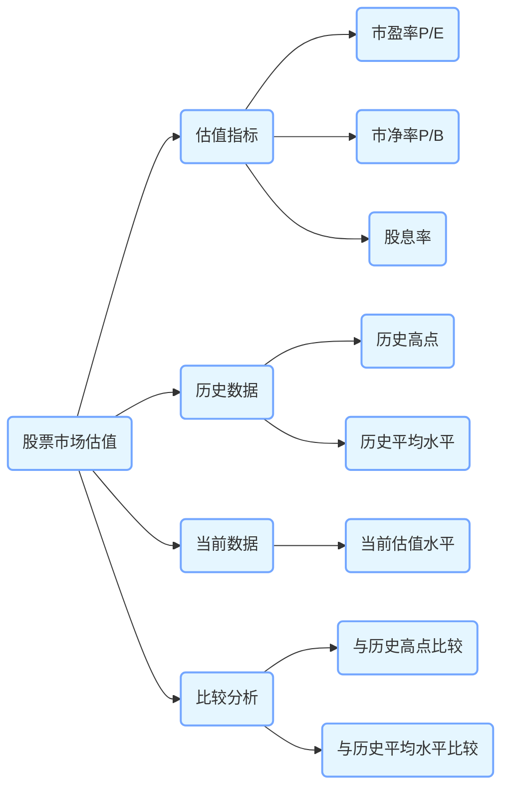

# 股票市场估值：历史高点与当前水平的比较

> 关键词：股票市场估值、历史高点、当前水平、估值指标、市场分析

> 摘要：本文旨在深入探讨股票市场估值，通过将当前市场估值水平与历史高点进行比较，为投资者和市场研究者提供全面且深入的分析。文章详细介绍了股票市场估值的核心概念，阐述了常用的估值算法原理及操作步骤，结合数学模型和公式进行量化分析，并通过实际案例展示如何运用这些知识进行市场评估。同时，探讨了股票市场估值在不同场景下的实际应用，推荐了相关的学习资源、开发工具和重要论文著作。最后，对股票市场估值的未来发展趋势与挑战进行了总结，并提供了常见问题解答和扩展阅读资料。

## 1. 背景介绍 
### 1.1 目的和范围
股票市场估值是投资者决策的重要依据，通过比较当前市场估值与历史高点，能够帮助投资者更好地理解市场所处的位置，判断市场是否存在高估或低估的情况，从而制定合理的投资策略。本文的范围涵盖了常见的股票市场估值指标，如市盈率（P/E）、市净率（P/B）等，以及如何运用这些指标进行历史与当前水平的对比分析。

### 1.2 预期读者
本文预期读者包括股票投资者、金融分析师、市场研究人员以及对股票市场估值感兴趣的人士。无论是专业的金融从业者还是普通的投资者，都能从本文中获取有价值的信息，提升对股票市场估值的理解和分析能力。

### 1.3 文档结构概述
本文将首先介绍股票市场估值的核心概念和相关联系，包括各种估值指标的原理和架构。接着详细阐述核心算法原理和具体操作步骤，并使用Python代码进行示例。然后引入数学模型和公式，结合实际例子进行讲解。通过项目实战部分，展示如何在实际中运用这些知识进行市场估值分析。之后探讨股票市场估值的实际应用场景，推荐相关的工具和资源。最后总结未来发展趋势与挑战，提供常见问题解答和扩展阅读资料。

### 1.4 术语表
#### 1.4.1 核心术语定义
- **股票市场估值**：对股票市场整体或个别股票的价值进行评估的过程，旨在确定股票的合理价格。
- **市盈率（P/E）**：股票价格与每股收益的比率，反映了投资者为获取公司每一元盈利所愿意支付的价格。
- **市净率（P/B）**：股票价格与每股净资产的比率，用于衡量股票价格相对于每股净资产的高低。
- **历史高点**：在特定的历史时期内，股票市场估值达到的最高水平。
- **当前水平**：当前时刻股票市场的估值情况。

#### 1.4.2 相关概念解释
- **估值泡沫**：当股票市场估值过高，远远超过其内在价值时，就可能形成估值泡沫。估值泡沫通常伴随着市场的过度乐观情绪和投机行为，一旦泡沫破裂，市场可能会出现大幅下跌。
- **估值修复**：当股票市场估值过低或过高时，市场会通过价格调整使估值回归到合理水平，这个过程称为估值修复。

#### 1.4.3 缩略词列表
- **P/E**：市盈率（Price-to-Earnings Ratio）
- **P/B**：市净率（Price-to-Book Ratio）

## 2. 核心概念与联系 
### 核心概念原理
股票市场估值的核心在于确定股票的内在价值，常用的估值指标有市盈率（P/E）、市净率（P/B）、股息率等。

#### 市盈率（P/E）
市盈率是最常用的估值指标之一，其计算公式为：
$$P/E = \frac{股价}{每股收益}$$
市盈率反映了投资者对公司未来盈利的预期。一般来说，市盈率越高，说明投资者对公司的未来盈利增长越乐观；反之，市盈率越低，说明投资者对公司的未来盈利增长预期较低。

#### 市净率（P/B）
市净率的计算公式为：
$$P/B = \frac{股价}{每股净资产}$$
市净率衡量了股票价格相对于每股净资产的高低。市净率较低的股票可能被低估，具有一定的投资价值；而市净率较高的股票可能存在高估的风险。

#### 股息率
股息率是指股票每年的股息与股价的比率，计算公式为：
$$股息率 = \frac{每股股息}{股价} \times 100\%$$
股息率反映了股票的分红能力，对于追求稳定收益的投资者来说，股息率是一个重要的参考指标。

### 架构的文本示意图
```plaintext
股票市场估值
|-- 估值指标
|   |-- 市盈率（P/E）
|   |-- 市净率（P/B）
|   |-- 股息率
|-- 历史数据
|   |-- 历史高点
|   |-- 历史平均水平
|-- 当前数据
|   |-- 当前估值水平
|-- 比较分析
|   |-- 与历史高点比较
|   |-- 与历史平均水平比较
```

### Mermaid 流程图


## 3. 核心算法原理 & 具体操作步骤 
### 核心算法原理
在比较股票市场估值的历史高点与当前水平时，主要使用的算法是计算各种估值指标，并将当前的估值指标值与历史高点进行对比。以下是使用Python代码实现计算市盈率和市净率的示例：

```python
# 计算市盈率
def calculate_pe(stock_price, earnings_per_share):
    if earnings_per_share == 0:
        return None
    return stock_price / earnings_per_share

# 计算市净率
def calculate_pb(stock_price, book_value_per_share):
    if book_value_per_share == 0:
        return None
    return stock_price / book_value_per_share

# 示例数据
stock_price = 50
earnings_per_share = 2
book_value_per_share = 10

# 计算市盈率和市净率
pe = calculate_pe(stock_price, earnings_per_share)
pb = calculate_pb(stock_price, book_value_per_share)

print(f"市盈率 (P/E): {pe}")
print(f"市净率 (P/B): {pb}")
```

### 具体操作步骤
1. **数据收集**：收集股票市场的历史数据和当前数据，包括股票价格、每股收益、每股净资产等。
2. **计算估值指标**：使用上述算法计算历史数据和当前数据的市盈率、市净率等估值指标。
3. **确定历史高点**：从历史数据中找出估值指标的最高点。
4. **比较分析**：将当前的估值指标值与历史高点进行比较，分析市场的估值水平。

## 4. 数学模型和公式 & 详细讲解 & 举例说明 
### 数学模型和公式
#### 市盈率（P/E）
$$P/E = \frac{P}{EPS}$$
其中，$P$ 表示股票价格，$EPS$ 表示每股收益。

#### 市净率（P/B）
$$P/B = \frac{P}{BVPS}$$
其中，$P$ 表示股票价格，$BVPS$ 表示每股净资产。

#### 股息率
$$股息率 = \frac{DPS}{P} \times 100\%$$
其中，$DPS$ 表示每股股息，$P$ 表示股票价格。

### 详细讲解
- **市盈率（P/E）**：市盈率反映了投资者对公司未来盈利的预期。一般来说，成长型公司的市盈率较高，因为投资者预期其未来盈利会有较大增长；而成熟型公司的市盈率相对较低。例如，一家科技公司的市盈率可能达到50倍，而一家传统制造业公司的市盈率可能只有10倍。
- **市净率（P/B）**：市净率衡量了股票价格相对于每股净资产的高低。市净率小于1的股票可能被低估，具有一定的投资价值；而市净率大于1的股票可能存在高估的风险。例如，一家银行股的市净率为0.8，说明其股票价格低于每股净资产，可能被低估。
- **股息率**：股息率反映了股票的分红能力。股息率较高的股票通常适合追求稳定收益的投资者。例如，一家公用事业公司的股息率可能达到5%，对于投资者来说具有一定的吸引力。

### 举例说明
假设某股票的当前价格为20元，每股收益为1元，每股净资产为5元，每股股息为0.5元。则该股票的市盈率、市净率和股息率计算如下：
- **市盈率（P/E）**：
$$P/E = \frac{20}{1} = 20$$
- **市净率（P/B）**：
$$P/B = \frac{20}{5} = 4$$
- **股息率**：
$$股息率 = \frac{0.5}{20} \times 100\% = 2.5\%$$

通过与该股票的历史估值数据和市场平均估值水平进行比较，可以判断该股票当前的估值是否合理。

## 5. 项目实战：代码实际案例和详细解释说明 
### 5.1  开发环境搭建
- **Python环境**：建议使用Python 3.7及以上版本。可以从Python官方网站（https://www.python.org/downloads/）下载并安装。
- **开发工具**：推荐使用PyCharm作为开发工具，它提供了丰富的功能和良好的开发体验。可以从JetBrains官方网站（https://www.jetbrains.com/pycharm/download/）下载并安装。
- **第三方库**：需要安装`pandas`、`numpy`等第三方库，用于数据处理和分析。可以使用以下命令进行安装：
```sh
pip install pandas numpy
```

### 5.2  源代码详细实现和代码解读
以下是一个完整的Python代码示例，用于比较股票市场估值的历史高点与当前水平：

```python
import pandas as pd
import numpy as np

# 模拟历史数据和当前数据
historical_data = pd.DataFrame({
    'date': pd.date_range(start='2010-01-01', end='2023-12-31', freq='D'),
    'stock_price': np.random.rand(4748) * 100,
    'earnings_per_share': np.random.rand(4748) * 10,
    'book_value_per_share': np.random.rand(4748) * 20
})

current_data = pd.DataFrame({
    'date': [pd.Timestamp('2024-01-01')],
    'stock_price': [80],
    'earnings_per_share': [5],
    'book_value_per_share': [15]
})

# 计算历史数据的市盈率和市净率
historical_data['pe'] = historical_data['stock_price'] / historical_data['earnings_per_share']
historical_data['pb'] = historical_data['stock_price'] / historical_data['book_value_per_share']

# 计算历史高点
pe_high = historical_data['pe'].max()
pb_high = historical_data['pb'].max()

# 计算当前数据的市盈率和市净率
current_data['pe'] = current_data['stock_price'] / current_data['earnings_per_share']
current_data['pb'] = current_data['stock_price'] / current_data['book_value_per_share']

# 获取当前的市盈率和市净率
current_pe = current_data['pe'].values[0]
current_pb = current_data['pb'].values[0]

# 比较分析
print(f"历史市盈率高点: {pe_high}")
print(f"当前市盈率: {current_pe}")
if current_pe > pe_high:
    print("当前市盈率高于历史高点，市场可能存在高估风险。")
else:
    print("当前市盈率低于历史高点，市场估值相对合理。")

print(f"历史市净率高点: {pb_high}")
print(f"当前市净率: {current_pb}")
if current_pb > pb_high:
    print("当前市净率高于历史高点，市场可能存在高估风险。")
else:
    print("当前市净率低于历史高点，市场估值相对合理。")
```

### 代码解读与分析
1. **数据模拟**：使用`pandas`和`numpy`库模拟了历史数据和当前数据，包括股票价格、每股收益和每股净资产。
2. **计算估值指标**：分别计算了历史数据和当前数据的市盈率和市净率。
3. **确定历史高点**：使用`max()`方法找出历史数据中市盈率和市净率的最高点。
4. **比较分析**：将当前的市盈率和市净率与历史高点进行比较，并输出比较结果。

通过这个代码示例，可以清晰地看到如何比较股票市场估值的历史高点与当前水平，为投资者提供了一定的参考依据。

## 6. 实际应用场景 
### 投资决策
投资者可以通过比较股票市场估值的历史高点与当前水平，判断市场是否存在高估或低估的情况，从而制定合理的投资策略。例如，当市场估值接近或超过历史高点时，投资者可以适当减仓或保持谨慎；当市场估值远低于历史高点时，投资者可以考虑增加投资。

### 市场研究
市场研究人员可以利用股票市场估值的历史数据和当前数据，分析市场的走势和趋势，预测市场的未来发展方向。通过对不同市场、不同行业的估值进行比较，还可以发现投资机会和潜在风险。

### 风险管理
金融机构和投资者可以通过监测股票市场估值的变化，及时调整投资组合，降低市场风险。当市场估值过高时，金融机构可以采取措施限制杠杆使用，投资者可以增加现金储备或配置防御性资产。

## 7. 工具和资源推荐
### 7.1 学习资源推荐
#### 7.1.1 书籍推荐
- 《聪明的投资者》（The Intelligent Investor）：作者是本杰明·格雷厄姆（Benjamin Graham），这本书是价值投资的经典之作，介绍了股票投资的基本原理和方法，包括如何进行估值分析。
- 《证券分析》（Security Analysis）：同样由本杰明·格雷厄姆和戴维·多德（David Dodd）所著，是投资领域的权威著作，深入探讨了股票和债券的估值方法。
- 《财务报表分析与证券定价》（Financial Statement Analysis and Security Valuation）：作者是斯蒂芬·佩因曼（Stephen Penman），这本书详细介绍了如何通过财务报表分析来评估股票的价值。

#### 7.1.2 在线课程
- Coursera上的“投资学原理”（Principles of Investing）：该课程由宾夕法尼亚大学沃顿商学院的教授授课，介绍了投资的基本概念和方法，包括股票估值。
- edX上的“金融市场”（Financial Markets）：由耶鲁大学的罗伯特·席勒（Robert Shiller）教授授课，探讨了金融市场的运行机制和投资策略。

#### 7.1.3 技术博客和网站
- 雪球（https://xueqiu.com/）：国内知名的投资社区，提供股票市场的实时行情、分析报告和投资者交流平台。
- Seeking Alpha（https://seekingalpha.com/）：国际知名的金融分析网站，提供大量的股票分析文章和投资建议。

### 7.2 开发工具框架推荐
#### 7.2.1 IDE和编辑器
- PyCharm：功能强大的Python集成开发环境，适合开发Python数据分析和机器学习项目。
- Jupyter Notebook：交互式的开发环境，方便进行数据探索和分析，支持Python、R等多种编程语言。

#### 7.2.2 调试和性能分析工具
- Py-Spy：用于分析Python程序的性能瓶颈，可以帮助开发者找出程序中耗时较长的部分。
- PDB：Python自带的调试工具，用于调试Python代码，定位和解决程序中的问题。

#### 7.2.3 相关框架和库
- Pandas：用于数据处理和分析的Python库，提供了丰富的数据结构和函数，方便进行数据清洗、转换和分析。
- Numpy：用于科学计算的Python库，提供了高效的数组操作和数学函数，是许多数据分析和机器学习库的基础。

### 7.3 相关论文著作推荐
#### 7.3.1 经典论文
- “The Cross - Section of Expected Stock Returns”（Fama and French, 1992）：这篇论文提出了著名的Fama - French三因子模型，对股票收益的横截面进行了深入分析。
- “Efficient Capital Markets: A Review of Theory and Empirical Work”（Fama, 1970）：该论文对有效市场假说进行了系统的阐述和总结，是金融领域的经典之作。

#### 7.3.2 最新研究成果
- 关注顶级金融学术期刊，如《Journal of Finance》、《Review of Financial Studies》等，这些期刊会发表最新的股票市场估值和投资领域的研究成果。

#### 7.3.3 应用案例分析
- 可以参考一些专业的金融研究报告和案例分析，了解如何在实际中应用股票市场估值方法进行投资决策和风险管理。

## 8. 总结：未来发展趋势与挑战
### 未来发展趋势
- **智能化估值**：随着人工智能和机器学习技术的不断发展，未来股票市场估值可能会更加智能化。通过利用大数据和深度学习算法，可以更准确地预测公司的未来盈利和市场走势，提高估值的准确性。
- **全球化估值**：随着全球经济一体化的加速，股票市场的全球化程度越来越高。未来的股票市场估值需要考虑全球市场的因素，进行跨国比较和分析。
- **多维度估值**：传统的估值指标主要关注公司的财务数据，未来的估值可能会更加注重多维度的信息，如公司的创新能力、社会责任、行业竞争力等。

### 挑战
- **数据质量和可靠性**：股票市场估值需要大量的数据支持，数据的质量和可靠性直接影响估值的准确性。如何获取准确、及时、全面的数据是一个挑战。
- **市场不确定性**：股票市场受到多种因素的影响，如宏观经济环境、政策变化、突发事件等，市场的不确定性增加了估值的难度。
- **模型的局限性**：现有的估值模型都是基于一定的假设和理论，存在一定的局限性。如何改进和完善估值模型，提高其适应性和准确性是一个重要的挑战。

## 9. 附录：常见问题与解答
### 1. 为什么不同行业的市盈率和市净率差异较大？
不同行业的盈利模式、增长潜力和风险水平不同，导致其市盈率和市净率存在较大差异。例如，科技行业通常具有较高的增长潜力，投资者对其未来盈利预期较高，因此市盈率和市净率相对较高；而传统制造业的增长速度相对较慢，市盈率和市净率相对较低。

### 2. 市盈率和市净率哪个更重要？
市盈率和市净率都有其优缺点，不能简单地说哪个更重要。市盈率主要反映了公司的盈利情况和市场对其未来盈利的预期，适用于盈利稳定的公司；市净率主要反映了公司的净资产价值，适用于资产较重的公司。在实际应用中，需要综合考虑两个指标，并结合其他因素进行分析。

### 3. 如何判断市场估值是否合理？
判断市场估值是否合理需要综合考虑多个因素，如历史估值水平、宏观经济环境、行业发展趋势等。可以通过比较当前的估值指标与历史平均水平、历史高点进行初步判断。同时，还需要结合公司的基本面分析和市场情绪等因素进行综合评估。

## 10. 扩展阅读 & 参考资料
### 扩展阅读
- 《金融炼金术》（The Alchemy of Finance）：作者是乔治·索罗斯（George Soros），这本书介绍了索罗斯的投资哲学和金融市场的反射理论。
- 《漫步华尔街》（A Random Walk Down Wall Street）：作者是伯顿·马尔基尔（Burton Malkiel），这本书探讨了股票市场的随机性和有效市场假说。

### 参考资料
- 相关的金融学术期刊和研究报告。
- 股票市场的历史数据和统计资料。
- 各大金融机构和投资公司发布的研究报告和分析文章。

作者：AI天才研究院/AI Genius Institute & 禅与计算机程序设计艺术 /Zen And The Art of Computer Programming