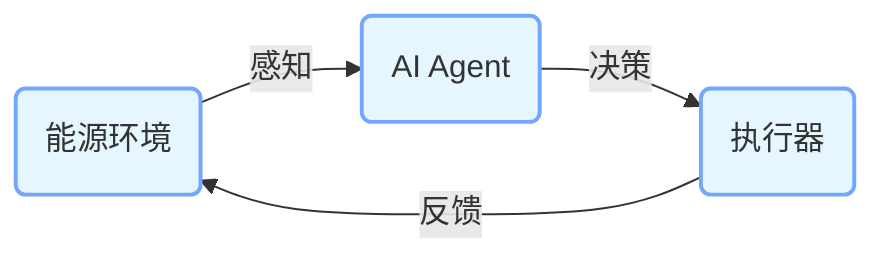

# 能源行业AI Agent解决方案

> 关键词：能源行业、AI Agent、解决方案、智能决策、自动化控制

> 摘要：本文聚焦于能源行业的AI Agent解决方案，旨在探讨如何利用先进的人工智能技术提升能源行业的运营效率、降低成本和增强安全性。文章首先介绍了能源行业引入AI Agent的背景，包括目的、预期读者、文档结构和相关术语。接着详细阐述了AI Agent的核心概念、算法原理、数学模型，并通过Python代码进行了具体实现。然后通过项目实战展示了如何搭建开发环境、实现代码以及对代码进行解读分析。此外，还探讨了AI Agent在能源行业的实际应用场景，推荐了相关的学习资源、开发工具和论文著作。最后总结了能源行业AI Agent的未来发展趋势与挑战，并提供了常见问题解答和扩展阅读参考资料。

## 1. 背景介绍 
### 1.1 目的和范围
能源行业是全球经济发展的重要支撑，但面临着资源有限、环境压力和市场竞争等诸多挑战。引入AI Agent技术可以帮助能源企业实现智能化决策、自动化控制和优化运营，提高能源利用效率，降低成本和环境影响。本文的目的是提供一个全面的能源行业AI Agent解决方案，涵盖从核心概念到实际应用的各个方面，为能源企业和相关技术人员提供参考。
本文的范围包括AI Agent在能源生产、传输、分配和消费等各个环节的应用，涉及到的能源类型包括煤炭、石油、天然气、电力等。同时，还将探讨AI Agent与能源行业现有系统的集成以及相关的技术挑战和解决方案。

### 1.2 预期读者
本文的预期读者包括能源行业的企业管理者、技术人员、研究人员以及对人工智能在能源领域应用感兴趣的人士。对于企业管理者，本文可以帮助他们了解AI Agent技术的潜力和应用场景，为企业的战略决策提供参考；对于技术人员，本文提供了详细的技术原理和实现方法，有助于他们在实际项目中应用AI Agent技术；对于研究人员，本文可以激发他们对能源行业AI Agent技术的进一步研究和探索。

### 1.3 文档结构概述
本文的文档结构如下：
- 核心概念与联系：介绍AI Agent的基本概念、原理和架构，以及与能源行业的联系。
- 核心算法原理 & 具体操作步骤：详细讲解AI Agent的核心算法原理，并通过Python代码展示具体的操作步骤。
- 数学模型和公式 & 详细讲解 & 举例说明：建立AI Agent的数学模型，推导相关公式，并通过具体例子进行说明。
- 项目实战：代码实际案例和详细解释说明：通过一个实际的能源行业项目，展示如何使用AI Agent技术进行开发和实现，并对代码进行详细解读。
- 实际应用场景：探讨AI Agent在能源行业的实际应用场景，包括能源生产优化、电网调度、能源消费预测等。
- 工具和资源推荐：推荐相关的学习资源、开发工具和论文著作，帮助读者进一步深入学习和研究。
- 总结：未来发展趋势与挑战：总结能源行业AI Agent的未来发展趋势和面临的挑战。
- 附录：常见问题与解答：提供常见问题的解答，帮助读者解决在学习和应用过程中遇到的问题。
- 扩展阅读 & 参考资料：提供相关的扩展阅读资料和参考文献，方便读者进一步查阅。

### 1.4 术语表
#### 1.4.1 核心术语定义
- **AI Agent（人工智能代理）**：是一种能够感知环境、做出决策并采取行动的智能实体，它可以自主地完成特定的任务或目标。
- **能源行业**：包括能源的生产、传输、分配和消费等各个环节的产业，涵盖煤炭、石油、天然气、电力等多种能源类型。
- **智能决策**：利用人工智能技术对复杂的问题进行分析和推理，做出最优的决策。
- **自动化控制**：通过计算机系统和自动化设备对生产过程进行自动控制和调节，提高生产效率和质量。
- **能源利用效率**：指能源在生产、传输、分配和消费过程中的有效利用程度，通常用能源产出与能源投入的比值来表示。

#### 1.4.2 相关概念解释
- **机器学习**：是人工智能的一个重要分支，它通过让计算机从数据中学习模式和规律，从而实现对未知数据的预测和分类。
- **深度学习**：是机器学习的一种特殊形式，它使用多层神经网络来学习数据的复杂特征和模式，在图像识别、语音识别等领域取得了显著的成果。
- **强化学习**：是一种通过智能体与环境进行交互，根据环境反馈的奖励信号来学习最优策略的机器学习方法。
- **物联网（IoT）**：是指通过各种传感器、网络设备和通信技术，将物理世界中的各种物体连接起来，实现数据的采集、传输和共享。

#### 1.4.3 缩略词列表
- **AI**：Artificial Intelligence，人工智能
- **ML**：Machine Learning，机器学习
- **DL**：Deep Learning，深度学习
- **RL**：Reinforcement Learning，强化学习
- **IoT**：Internet of Things，物联网

## 2. 核心概念与联系 
### 2.1 AI Agent的基本概念
AI Agent是一种具有自主性、反应性、社会性和学习性的智能实体。自主性意味着AI Agent可以在没有人类干预的情况下自主地感知环境、做出决策并采取行动；反应性表示AI Agent能够及时对环境的变化做出反应；社会性指AI Agent可以与其他智能体进行交互和协作；学习性则是指AI Agent可以通过学习不断提高自己的性能和能力。

### 2.2 AI Agent的原理和架构
AI Agent的基本原理是通过感知器感知环境信息，将其传递给决策器，决策器根据预设的目标和规则进行决策，然后通过执行器采取相应的行动。AI Agent的架构可以分为三种类型：反应式架构、慎思式架构和混合式架构。

- **反应式架构**：基于简单的条件 - 动作规则，直接根据感知到的环境信息做出反应，不进行复杂的推理和规划。这种架构的优点是响应速度快，适用于实时性要求较高的场景。
- **慎思式架构**：通过建立环境模型，进行推理和规划，然后根据规划结果做出决策。这种架构的优点是能够处理复杂的问题，但响应速度较慢。
- **混合式架构**：结合了反应式架构和慎思式架构的优点，既能够快速响应环境变化，又能够进行复杂的推理和规划。

### 2.3 AI Agent与能源行业的联系
在能源行业中，AI Agent可以应用于多个环节，如能源生产、传输、分配和消费等。例如，在能源生产环节，AI Agent可以通过对生产设备的实时监测和数据分析，优化生产过程，提高能源生产效率；在电网调度环节，AI Agent可以根据电网的实时状态和负荷预测，自动调整发电计划和输电线路的功率分配，确保电网的安全稳定运行；在能源消费环节，AI Agent可以根据用户的用电习惯和实时电价，为用户提供最优的用电建议，降低用户的用电成本。

### 2.4 文本示意图
以下是一个简单的AI Agent在能源行业应用的文本示意图：

```plaintext
能源环境（生产、传输、分配、消费）
    |
    | 感知（传感器数据、市场信息等）
    v
AI Agent
    |
    | 决策（智能算法、模型预测）
    v
执行器（设备控制、调度指令等）
    |
    | 反馈（环境变化、执行结果）
    v
能源环境（更新状态）
```

### 2.5 Mermaid流程图


## 3. 核心算法原理 & 具体操作步骤 
### 3.1 强化学习算法原理
强化学习是AI Agent中常用的一种算法，它通过智能体与环境进行交互，根据环境反馈的奖励信号来学习最优策略。强化学习的基本要素包括智能体、环境、状态、动作和奖励。智能体在环境中处于某个状态，选择一个动作执行，环境根据智能体的动作更新状态，并给予智能体一个奖励。智能体的目标是通过不断地与环境交互，学习到一个最优策略，使得长期累积奖励最大化。

强化学习的核心算法包括Q - learning、SARSA和深度Q网络（DQN）等。下面以Q - learning为例，详细介绍其算法原理。

Q - learning是一种无模型的强化学习算法，它通过维护一个Q表来记录每个状态 - 动作对的价值。Q表中的每个元素$Q(s, a)$表示在状态$s$下执行动作$a$的预期累积奖励。Q - learning的更新公式如下：

$$Q(s_t, a_t) \leftarrow Q(s_t, a_t) + \alpha [r_{t+1} + \gamma \max_{a} Q(s_{t+1}, a) - Q(s_t, a_t)]$$

其中，$s_t$表示当前状态，$a_t$表示当前动作，$r_{t+1}$表示执行动作$a_t$后获得的奖励，$s_{t+1}$表示下一个状态，$\alpha$是学习率，$\gamma$是折扣因子。

### 3.2 Python代码实现
以下是一个简单的Q - learning算法的Python实现，用于解决一个简单的能源调度问题。假设我们有一个能源系统，有两种能源（能源A和能源B）可供选择，系统的状态由能源需求和当前能源储备决定，动作是选择使用哪种能源。

```python
import numpy as np

# 定义环境参数
num_states = 10  # 状态数量
num_actions = 2  # 动作数量
learning_rate = 0.1  # 学习率
discount_factor = 0.9  # 折扣因子
num_episodes = 1000  # 训练回合数

# 初始化Q表
Q_table = np.zeros((num_states, num_actions))

# 定义环境反馈函数
def get_reward(state, action):
    # 简单的奖励函数示例
    if state % 2 == 0 and action == 0:
        return 1
    elif state % 2 == 1 and action == 1:
        return 1
    else:
        return -1

# 定义状态转移函数
def get_next_state(state, action):
    # 简单的状态转移函数示例
    return (state + action) % num_states

# Q - learning算法主循环
for episode in range(num_episodes):
    state = np.random.randint(0, num_states)  # 随机初始化状态
    done = False
    while not done:
        # 选择动作（epsilon - greedy策略）
        epsilon = 0.1
        if np.random.uniform(0, 1) < epsilon:
            action = np.random.randint(0, num_actions)
        else:
            action = np.argmax(Q_table[state, :])
        
        # 执行动作，获取奖励和下一个状态
        reward = get_reward(state, action)
        next_state = get_next_state(state, action)
        
        # 更新Q表
        Q_table[state, action] = Q_table[state, action] + learning_rate * (
            reward + discount_factor * np.max(Q_table[next_state, :]) - Q_table[state, action]
        )
        
        # 更新状态
        state = next_state
        
        # 判断是否结束
        if state == 0:
            done = True

# 输出最终的Q表
print("Final Q - table:")
print(Q_table)
```

### 3.3 具体操作步骤
1. **初始化Q表**：将Q表初始化为全零矩阵，每个元素表示一个状态 - 动作对的初始价值。
2. **选择动作**：使用epsilon - greedy策略选择动作。以一定的概率（epsilon）随机选择一个动作，以避免陷入局部最优；以$1 - \epsilon$的概率选择Q表中当前状态下价值最大的动作。
3. **执行动作并获取反馈**：执行选择的动作，从环境中获取奖励和下一个状态。
4. **更新Q表**：根据Q - learning的更新公式更新Q表中当前状态 - 动作对的价值。
5. **更新状态**：将当前状态更新为下一个状态。
6. **判断是否结束**：如果达到终止条件（如达到目标状态），则结束当前回合；否则，继续执行步骤2 - 5。

## 4. 数学模型和公式 & 详细讲解 & 举例说明 
### 4.1 马尔可夫决策过程（MDP）
强化学习问题通常可以用马尔可夫决策过程（MDP）来建模。MDP是一个五元组$(S, A, P, R, \gamma)$，其中：
- $S$是状态集合，表示环境的所有可能状态。
- $A$是动作集合，表示智能体可以采取的所有动作。
- $P(s'|s, a)$是状态转移概率，表示在状态$s$下执行动作$a$后转移到状态$s'$的概率。
- $R(s, a, s')$是奖励函数，表示在状态$s$下执行动作$a$后转移到状态$s'$所获得的奖励。
- $\gamma$是折扣因子，用于平衡即时奖励和未来奖励。

### 4.2 价值函数和最优策略
在MDP中，有两种重要的价值函数：状态价值函数$V(s)$和动作价值函数$Q(s, a)$。

- 状态价值函数$V(s)$表示从状态$s$开始，遵循某个策略$\pi$所能获得的预期累积奖励：

$$V^{\pi}(s) = \mathbb{E}_{\pi} \left[ \sum_{t=0}^{\infty} \gamma^t r_{t+1} \mid s_0 = s \right]$$

- 动作价值函数$Q(s, a)$表示在状态$s$下执行动作$a$，然后遵循某个策略$\pi$所能获得的预期累积奖励：

$$Q^{\pi}(s, a) = \mathbb{E}_{\pi} \left[ \sum_{t=0}^{\infty} \gamma^t r_{t+1} \mid s_0 = s, a_0 = a \right]$$

最优策略$\pi^*$是使得所有状态的价值函数最大的策略，即：

$$\pi^*(s) = \arg \max_{a} Q^*(s, a)$$

其中，$Q^*(s, a)$是最优动作价值函数。

### 4.3 贝尔曼方程
价值函数满足贝尔曼方程，它描述了当前状态的价值与下一个状态的价值之间的关系。

- 状态价值函数的贝尔曼方程：

$$V^{\pi}(s) = \sum_{a \in A} \pi(a|s) \sum_{s' \in S} P(s'|s, a) [R(s, a, s') + \gamma V^{\pi}(s')]$$

- 动作价值函数的贝尔曼方程：

$$Q^{\pi}(s, a) = \sum_{s' \in S} P(s'|s, a) [R(s, a, s') + \gamma \sum_{a' \in A} \pi(a'|s') Q^{\pi}(s', a')]$$

最优动作价值函数的贝尔曼方程：

$$Q^*(s, a) = \sum_{s' \in S} P(s'|s, a) [R(s, a, s') + \gamma \max_{a'} Q^*(s', a')]$$

### 4.4 举例说明
假设我们有一个简单的能源调度问题，状态集合$S = \{s_0, s_1, s_2\}$，动作集合$A = \{a_0, a_1\}$，状态转移概率和奖励函数如下：

- $P(s_0|s_0, a_0) = 0.8$，$P(s_1|s_0, a_0) = 0.2$，$R(s_0, a_0, s_0) = 1$，$R(s_0, a_0, s_1) = -1$
- $P(s_1|s_0, a_1) = 0.9$，$P(s_2|s_0, a_1) = 0.1$，$R(s_0, a_1, s_1) = 2$，$R(s_0, a_1, s_2) = -2$

折扣因子$\gamma = 0.9$。

我们可以使用贝尔曼方程来计算最优动作价值函数。假设初始时$Q^*(s, a) = 0$，进行迭代更新：

1. 对于状态$s_0$和动作$a_0$：

$$Q^*(s_0, a_0) = 0.8 \times (1 + 0.9 \times \max_{a'} Q^*(s_0, a')) + 0.2 \times (-1 + 0.9 \times \max_{a'} Q^*(s_1, a'))$$

2. 对于状态$s_0$和动作$a_1$：

$$Q^*(s_0, a_1) = 0.9 \times (2 + 0.9 \times \max_{a'} Q^*(s_1, a')) + 0.1 \times (-2 + 0.9 \times \max_{a'} Q^*(s_2, a'))$$

通过不断迭代更新，直到$Q^*(s, a)$收敛，即可得到最优动作价值函数。

## 5. 项目实战：代码实际案例和详细解释说明 
### 5.1 开发环境搭建
为了实现能源行业AI Agent解决方案，我们可以使用Python作为开发语言，并结合一些常用的机器学习和深度学习库。以下是开发环境搭建的步骤：

1. **安装Python**：建议安装Python 3.7及以上版本，可以从Python官方网站（https://www.python.org/downloads/）下载并安装。
2. **安装必要的库**：使用pip命令安装以下库：
    - `numpy`：用于数值计算。
    - `pandas`：用于数据处理和分析。
    - `scikit - learn`：用于机器学习算法。
    - `tensorflow`或`pytorch`：用于深度学习。
    - `gym`：用于强化学习环境的创建和管理。

示例安装命令：

```sh
pip install numpy pandas scikit - learn tensorflow gym
```

### 5.2 源代码详细实现和代码解读
以下是一个基于OpenAI Gym的能源调度强化学习项目的源代码：

```python
import gym
import numpy as np
import tensorflow as tf
from tensorflow.keras import layers

# 创建能源调度环境
env = gym.make('CartPole-v1')  # 这里使用CartPole环境作为示例，实际应用中需要自定义能源调度环境

# 定义DQN模型
class DQN(tf.keras.Model):
    def __init__(self, num_actions):
        super(DQN, self).__init__()
        self.dense1 = layers.Dense(64, activation='relu')
        self.dense2 = layers.Dense(64, activation='relu')
        self.dense3 = layers.Dense(num_actions)

    def call(self, x):
        x = self.dense1(x)
        x = self.dense2(x)
        return self.dense3(x)

# 初始化DQN模型和目标模型
num_actions = env.action_space.n
model = DQN(num_actions)
target_model = DQN(num_actions)
target_model.set_weights(model.get_weights())

# 定义优化器和损失函数
optimizer = tf.keras.optimizers.Adam(learning_rate=0.001)
loss_fn = tf.keras.losses.Huber()

# 经验回放缓冲区
class ReplayBuffer:
    def __init__(self, buffer_size):
        self.buffer_size = buffer_size
        self.buffer = []
        self.index = 0

    def add(self, state, action, reward, next_state, done):
        if len(self.buffer) < self.buffer_size:
            self.buffer.append(None)
        self.buffer[self.index] = (state, action, reward, next_state, done)
        self.index = (self.index + 1) % self.buffer_size

    def sample(self, batch_size):
        indices = np.random.choice(len(self.buffer), batch_size, replace=False)
        states, actions, rewards, next_states, dones = zip(*[self.buffer[i] for i in indices])
        return np.array(states), np.array(actions), np.array(rewards), np.array(next_states), np.array(dones)

replay_buffer = ReplayBuffer(buffer_size=10000)

# 训练参数
batch_size = 32
gamma = 0.99
epsilon = 1.0
epsilon_min = 0.01
epsilon_decay = 0.995
target_update_freq = 10

# 训练循环
num_episodes = 1000
for episode in range(num_episodes):
    state = env.reset()
    state = np.expand_dims(state, axis=0)
    done = False
    total_reward = 0

    while not done:
        # epsilon - greedy策略选择动作
        if np.random.uniform(0, 1) < epsilon:
            action = env.action_space.sample()
        else:
            q_values = model.predict(state)
            action = np.argmax(q_values)

        # 执行动作
        next_state, reward, done, _ = env.step(action)
        next_state = np.expand_dims(next_state, axis=0)

        # 将经验添加到回放缓冲区
        replay_buffer.add(state, action, reward, next_state, done)

        # 更新状态
        state = next_state
        total_reward += reward

        # 经验回放
        if len(replay_buffer.buffer) >= batch_size:
            states, actions, rewards, next_states, dones = replay_buffer.sample(batch_size)

            target_q_values = target_model.predict(next_states)
            max_target_q_values = np.max(target_q_values, axis=1)
            target_q = rewards + (1 - dones) * gamma * max_target_q_values

            with tf.GradientTape() as tape:
                q_values = model(states)
                action_masks = tf.one_hot(actions, num_actions)
                q = tf.reduce_sum(action_masks * q_values, axis=1)
                loss = loss_fn(target_q, q)

            gradients = tape.gradient(loss, model.trainable_variables)
            optimizer.apply_gradients(zip(gradients, model.trainable_variables))

    # 更新目标模型
    if episode % target_update_freq == 0:
        target_model.set_weights(model.get_weights())

    # 衰减epsilon
    if epsilon > epsilon_min:
        epsilon *= epsilon_decay

    print(f"Episode {episode}: Total Reward = {total_reward}, Epsilon = {epsilon}")

# 关闭环境
env.close()
```

### 5.3 代码解读与分析
1. **环境创建**：使用`gym.make`函数创建一个OpenAI Gym环境，这里使用`CartPole-v1`环境作为示例，实际应用中需要自定义能源调度环境。
2. **DQN模型定义**：定义一个简单的深度Q网络（DQN）模型，包含三个全连接层。
3. **目标模型**：使用目标模型来稳定训练过程，定期将主模型的参数复制到目标模型。
4. **经验回放缓冲区**：使用`ReplayBuffer`类来存储智能体的经验，通过随机采样的方式从缓冲区中取出一批经验进行训练，以减少数据之间的相关性。
5. **训练循环**：在每个回合中，智能体根据epsilon - greedy策略选择动作，执行动作并获取奖励和下一个状态，将经验添加到回放缓冲区。当缓冲区中的经验数量达到一定数量时，从缓冲区中采样一批经验进行训练，更新主模型的参数。定期更新目标模型的参数，并衰减epsilon值。
6. **损失函数和优化器**：使用Huber损失函数和Adam优化器来训练模型。

## 6. 实际应用场景 
### 6.1 能源生产优化
在能源生产环节，AI Agent可以实时监测生产设备的运行状态、能源资源的供应情况和市场需求等信息，通过强化学习算法优化生产过程，提高能源生产效率和质量。例如，在石油开采过程中，AI Agent可以根据油井的地质条件、开采设备的性能和市场油价等因素，自动调整开采参数，实现最优开采方案。

### 6.2 电网调度
电网调度是能源行业的重要环节，AI Agent可以根据电网的实时状态、负荷预测和发电计划等信息，自动调整发电设备的出力和输电线路的功率分配，确保电网的安全稳定运行。例如，在电力系统中，AI Agent可以通过对分布式能源资源（如太阳能、风能等）的实时监测和控制，实现对电网的智能调度，提高电网的可再生能源消纳能力。

### 6.3 能源消费预测
AI Agent可以通过对用户的用电历史数据、气象数据和社会经济数据等进行分析和挖掘，建立能源消费预测模型，提前预测用户的能源需求。例如，在智能家居系统中，AI Agent可以根据用户的生活习惯和实时电价，为用户提供最优的用电建议，帮助用户降低用电成本。

### 6.4 能源设备故障诊断
AI Agent可以通过对能源设备的运行数据进行实时监测和分析，及时发现设备的故障隐患，并提供故障诊断和维修建议。例如，在风力发电机组中，AI Agent可以通过对发电机的振动、温度和电流等参数的监测，预测发电机的故障发生概率，提前安排维修计划，减少设备的停机时间。

## 7. 工具和资源推荐
### 7.1 学习资源推荐
#### 7.1.1 书籍推荐
- 《Reinforcement Learning: An Introduction》（Richard S. Sutton和Andrew G. Barto著）：强化学习领域的经典教材，全面介绍了强化学习的基本概念、算法和应用。
- 《Artificial Intelligence: A Modern Approach》（Stuart Russell和Peter Norvig著）：人工智能领域的权威教材，涵盖了人工智能的各个方面，包括搜索算法、知识表示、机器学习和自然语言处理等。
- 《Python Machine Learning》（Sebastian Raschka和Vahid Mirjalili著）：介绍了使用Python进行机器学习的方法和技巧，包括数据预处理、模型选择和评估等。

#### 7.1.2 在线课程
- Coursera上的“Reinforcement Learning Specialization”：由University of Alberta的教授授课，系统地介绍了强化学习的理论和实践。
- edX上的“Artificial Intelligence”：由Berkeley University的教授授课，涵盖了人工智能的基本概念和算法。
- Udemy上的“Python for Data Science and Machine Learning Bootcamp”：介绍了使用Python进行数据科学和机器学习的方法和技巧。

#### 7.1.3 技术博客和网站
- OpenAI Blog（https://openai.com/blog/）：OpenAI发布的最新研究成果和技术文章。
- Medium上的“Towards Data Science”：数据科学和机器学习领域的优质博客，有很多关于强化学习和人工智能的文章。
- arXiv（https://arxiv.org/）：一个预印本平台，提供了大量的学术论文，包括人工智能和强化学习领域的最新研究成果。

### 7.2 开发工具框架推荐
#### 7.2.1 IDE和编辑器
- PyCharm：一款专业的Python集成开发环境，提供了代码编辑、调试、版本控制等功能。
- Jupyter Notebook：一个交互式的开发环境，适合进行数据探索和模型实验。
- Visual Studio Code：一款轻量级的代码编辑器，支持多种编程语言和插件扩展。

#### 7.2.2 调试和性能分析工具
- TensorBoard：TensorFlow提供的可视化工具，用于监控模型的训练过程和性能指标。
- Py-Spy：一个Python性能分析工具，可以帮助你找出代码中的性能瓶颈。
- PDB：Python自带的调试器，用于调试Python代码。

#### 7.2.3 相关框架和库
- TensorFlow：Google开发的深度学习框架，提供了丰富的神经网络模型和工具。
- PyTorch：Facebook开发的深度学习框架，具有动态图和易于使用的特点。
- Gym：OpenAI开发的强化学习环境库，提供了多种经典的强化学习环境。

### 7.3 相关论文著作推荐
#### 7.3.1 经典论文
- “Q - learning”（Christopher J. C. H. Watkins和Peter Dayan著）：介绍了Q - learning算法的基本原理和实现方法。
- “Playing Atari with Deep Reinforcement Learning”（Volodymyr Mnih等著）：首次提出了深度Q网络（DQN）算法，在Atari游戏上取得了很好的效果。
- “Asynchronous Methods for Deep Reinforcement Learning”（Volodymyr Mnih等著）：提出了异步优势演员 - 评论家（A3C）算法，提高了强化学习的训练效率。

#### 7.3.2 最新研究成果
- 在arXiv上搜索“Reinforcement Learning in Energy Industry”可以找到很多关于强化学习在能源行业应用的最新研究成果。
- 在顶级学术会议（如NeurIPS、ICML、AAAI等）上发表的关于人工智能和强化学习的论文。

#### 7.3.3 应用案例分析
- 一些能源企业的官方网站或技术博客会分享他们在AI Agent应用方面的案例和经验。
- 行业报告和研究机构发布的关于能源行业数字化转型和人工智能应用的报告。

## 8. 总结：未来发展趋势与挑战
### 8.1 未来发展趋势
- **多智能体协作**：未来的能源系统将越来越复杂，需要多个AI Agent之间进行协作和交互，共同完成能源生产、传输、分配和消费等任务。例如，在分布式能源系统中，多个能源节点的AI Agent可以通过协作实现能源的优化调度和共享。
- **与物联网和大数据的深度融合**：物联网技术可以为AI Agent提供丰富的实时数据，大数据技术可以对这些数据进行存储、处理和分析，从而提高AI Agent的决策能力和性能。例如，通过物联网传感器实时监测能源设备的运行状态，利用大数据分析技术挖掘数据中的潜在信息，为AI Agent的决策提供支持。
- **强化学习与深度学习的结合**：强化学习可以用于解决复杂的决策问题，深度学习可以用于处理大规模的高维数据，将两者结合起来可以进一步提高AI Agent的智能水平。例如，使用深度学习模型来学习环境的特征表示，然后使用强化学习算法进行决策。

### 8.2 挑战
- **数据质量和安全性**：能源行业的数据通常具有高价值和敏感性，数据的质量和安全性是AI Agent应用的关键问题。数据不准确、不完整或被篡改可能会导致AI Agent做出错误的决策，而数据泄露可能会带来安全风险。
- **模型可解释性**：AI Agent的决策过程通常是基于复杂的机器学习和深度学习模型，这些模型的可解释性较差，难以理解其决策依据。在能源行业，决策的可解释性非常重要，因为需要对决策结果进行评估和验证。
- **技术复杂性和成本**：AI Agent技术的实现需要具备较高的技术水平和专业知识，同时还需要大量的计算资源和数据存储设备，这增加了技术应用的复杂性和成本。

## 9. 附录：常见问题与解答
### 9.1 什么是AI Agent？
AI Agent是一种能够感知环境、做出决策并采取行动的智能实体，它可以自主地完成特定的任务或目标。AI Agent具有自主性、反应性、社会性和学习性等特点。

### 9.2 AI Agent在能源行业有哪些应用场景？
AI Agent在能源行业的应用场景包括能源生产优化、电网调度、能源消费预测、能源设备故障诊断等。通过AI Agent技术，可以提高能源行业的运营效率、降低成本和增强安全性。

### 9.3 如何选择适合能源行业的AI Agent算法？
选择适合能源行业的AI Agent算法需要考虑问题的特点和需求。如果问题具有明确的奖励函数和状态转移规则，可以考虑使用强化学习算法；如果问题需要处理大规模的高维数据，可以考虑使用深度学习算法；如果问题需要快速响应和实时决策，可以考虑使用反应式架构的AI Agent。

### 9.4 如何解决AI Agent在能源行业应用中的数据质量和安全性问题？
解决AI Agent在能源行业应用中的数据质量和安全性问题需要采取以下措施：
- 建立数据质量管理体系，对数据进行清洗、验证和标注，确保数据的准确性和完整性。
- 采用数据加密、访问控制和安全审计等技术手段，保障数据的安全性。
- 建立数据备份和恢复机制，防止数据丢失。

### 9.5 如何提高AI Agent模型的可解释性？
提高AI Agent模型的可解释性可以采用以下方法：
- 使用可解释的机器学习模型，如决策树、线性回归等。
- 对模型的决策过程进行可视化，例如使用特征重要性分析、决策树可视化等方法。
- 采用模型解释技术，如LIME、SHAP等，对模型的预测结果进行解释。

## 10. 扩展阅读 & 参考资料
### 10.1 扩展阅读
- 《Deep Reinforcement Learning Hands - On》（Max Lapan著）：介绍了深度强化学习的实践方法和技巧。
- 《AI for Energy Systems》（IEEE Xplore上的相关论文）：探讨了人工智能在能源系统中的应用。
- 《The Future of Energy: A Roadmap to 2050》（国际能源署发布的报告）：分析了能源行业的未来发展趋势。

### 10.2 参考资料
- Sutton, R. S., & Barto, A. G. (2018). Reinforcement Learning: An Introduction. MIT Press.
- Russell, S. J., & Norvig, P. (2020). Artificial Intelligence: A Modern Approach. Pearson.
- Mnih, V., Kavukcuoglu, K., Silver, D., et al. (2013). Playing Atari with Deep Reinforcement Learning. arXiv preprint arXiv:1312.5602.

作者：AI天才研究院/AI Genius Institute & 禅与计算机程序设计艺术 /Zen And The Art of Computer Programming