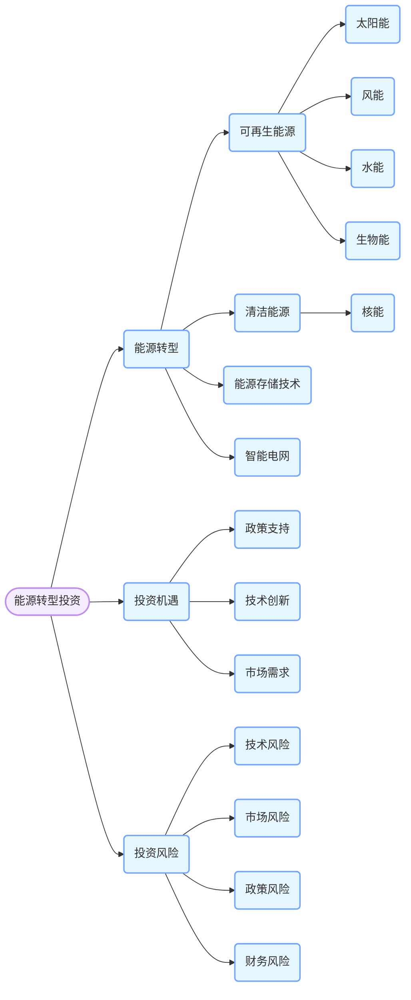

# 能源转型投资：机遇与风险分析

> 关键词：能源转型、投资机遇、投资风险、可再生能源、传统能源、能源市场、可持续发展

> 摘要：本文围绕能源转型投资的机遇与风险展开深入分析。在全球倡导可持续发展的大背景下，能源转型已成为必然趋势，这为投资领域带来了诸多新的机遇，但同时也伴随着各类风险。文章首先介绍能源转型投资的背景信息，包括目的、预期读者等内容；接着阐述能源转型相关的核心概念及其联系；详细讲解能源转型投资涉及的核心算法原理和具体操作步骤；探讨相关的数学模型和公式；通过项目实战案例展示投资过程及代码实现；分析能源转型投资的实际应用场景；推荐相关的学习工具和资源；最后总结能源转型投资的未来发展趋势与挑战，并对常见问题进行解答，为投资者和相关从业者提供全面且有价值的参考。

## 1. 背景介绍 
### 1.1 目的和范围
能源转型是全球应对气候变化、实现可持续发展的关键举措。随着传统能源的逐渐枯竭和环境问题的日益突出，各国纷纷加大对可再生能源和清洁能源的投入，推动能源结构的调整和升级。本文章的目的在于全面分析能源转型投资过程中存在的机遇与风险，为投资者、能源企业、政策制定者等相关方提供深入的见解和决策依据。

文章的范围涵盖了能源转型的各个方面，包括可再生能源（如太阳能、风能、水能等）、能源存储技术、智能电网、能源效率提升等领域的投资机遇与风险。同时，也会涉及到传统能源在能源转型过程中的发展趋势以及对投资的影响。

### 1.2 预期读者
本文的预期读者包括但不限于以下几类人群：
1. **投资者**：包括个人投资者、机构投资者等，他们希望了解能源转型领域的投资机会和风险，以便做出明智的投资决策。
2. **能源企业从业者**：如能源公司的管理人员、技术人员等，他们需要了解能源转型的趋势和投资方向，为企业的战略规划和业务发展提供参考。
3. **政策制定者**：政府部门的相关人员，他们需要掌握能源转型投资的情况，以便制定合理的政策来促进能源转型的顺利进行。
4. **研究人员**：从事能源经济、环境科学、投资学等相关领域研究的学者和科研人员，他们可以从本文中获取相关的研究数据和观点，为进一步的研究提供参考。

### 1.3 文档结构概述
本文将按照以下结构进行阐述：
1. **背景介绍**：介绍能源转型投资的目的、范围、预期读者和文档结构概述，以及相关术语的定义和解释。
2. **核心概念与联系**：阐述能源转型、投资机遇、投资风险等核心概念的原理和架构，并通过文本示意图和 Mermaid 流程图展示它们之间的联系。
3. **核心算法原理 & 具体操作步骤**：讲解能源转型投资中常用的核心算法原理，并使用 Python 源代码详细阐述具体的操作步骤。
4. **数学模型和公式 & 详细讲解 & 举例说明**：介绍能源转型投资中涉及的数学模型和公式，并通过具体的例子进行详细讲解。
5. **项目实战：代码实际案例和详细解释说明**：通过实际的项目案例，展示能源转型投资的代码实现过程，并对代码进行详细的解读和分析。
6. **实际应用场景**：分析能源转型投资在不同领域的实际应用场景。
7. **工具和资源推荐**：推荐相关的学习资源、开发工具框架和论文著作，帮助读者进一步深入了解能源转型投资。
8. **总结：未来发展趋势与挑战**：总结能源转型投资的未来发展趋势，并分析面临的挑战。
9. **附录：常见问题与解答**：对读者可能关心的常见问题进行解答。
10. **扩展阅读 & 参考资料**：提供相关的扩展阅读材料和参考资料，方便读者进一步查阅。

### 1.4 术语表
#### 1.4.1 核心术语定义
1. **能源转型**：指从传统的化石能源为主的能源体系向以可再生能源和清洁能源为主的能源体系转变的过程。
2. **投资机遇**：指在能源转型过程中，由于市场需求、政策支持、技术进步等因素而产生的具有投资价值的机会。
3. **投资风险**：指在能源转型投资过程中，由于各种不确定因素而导致投资损失的可能性。
4. **可再生能源**：指在自然界中可以不断再生、永续利用的能源，如太阳能、风能、水能、生物能等。
5. **清洁能源**：指在生产和使用过程中不产生或很少产生污染物的能源，如太阳能、风能、水能、核能等。
6. **能源存储技术**：指将能源以某种形式存储起来，以便在需要时释放使用的技术，如电池储能、抽水蓄能等。
7. **智能电网**：指利用现代信息技术和通信技术，实现电力系统的智能化管理和运行的电网。

#### 1.4.2 相关概念解释
1. **能源转型的驱动因素**：包括气候变化、能源安全、经济发展等因素。气候变化要求减少温室气体排放，能源安全需要降低对进口化石能源的依赖，经济发展则需要寻找新的经济增长点。
2. **投资机遇的来源**：主要包括政策支持、技术创新、市场需求等方面。政府的补贴政策、税收优惠等可以降低投资成本，技术创新可以提高能源利用效率和降低成本，市场需求的增长可以保证投资的回报。
3. **投资风险的类型**：包括技术风险、市场风险、政策风险、财务风险等。技术风险指技术不成熟或出现故障导致投资失败，市场风险指市场需求变化、价格波动等导致投资回报下降，政策风险指政策变化导致投资环境恶化，财务风险指资金链断裂、债务违约等导致投资损失。

#### 1.4.3 缩略词列表
1. **RE**：Renewable Energy，可再生能源
2. **CE**：Clean Energy，清洁能源
3. **ES**：Energy Storage，能源存储
4. **SG**：Smart Grid，智能电网

## 2. 核心概念与联系 

### 核心概念原理
#### 能源转型
能源转型的原理基于可持续发展的理念，旨在解决传统能源带来的环境和资源问题。随着全球对气候变化的关注度不断提高，减少温室气体排放成为当务之急。传统化石能源（如煤炭、石油、天然气）在燃烧过程中会释放大量的二氧化碳等温室气体，对环境造成严重影响。因此，需要逐步减少对传统化石能源的依赖，增加可再生能源和清洁能源的使用比例。

可再生能源具有取之不尽、用之不竭的特点，且在生产和使用过程中对环境的影响较小。例如，太阳能通过光伏电池将太阳能转化为电能，风能通过风力发电机将风能转化为电能，水能通过水电站将水能转化为电能。这些能源的开发和利用可以有效减少对环境的污染，实现能源的可持续供应。

#### 投资机遇
投资机遇的原理在于能源转型过程中市场需求的变化和政策的支持。随着能源转型的推进，可再生能源和清洁能源的市场需求不断增加。例如，太阳能光伏发电和风力发电的装机容量逐年增长，对相关设备和技术的需求也随之增加。此外，政府为了鼓励能源转型，出台了一系列的政策支持，如补贴政策、税收优惠政策等，这些政策降低了投资者的成本，提高了投资的回报率，从而吸引了更多的投资者进入能源转型领域。

#### 投资风险
投资风险的原理主要源于能源转型过程中的不确定性。技术方面，可再生能源和清洁能源技术仍处于不断发展和完善的阶段，存在技术不成熟、效率低下、成本较高等问题。例如，太阳能光伏发电的效率有待提高，储能技术的成本仍然较高。市场方面，能源市场价格波动较大，可再生能源和清洁能源的市场需求也受到多种因素的影响，如经济形势、政策变化等。政策方面，政府的能源政策可能会随着形势的变化而调整，这可能会对投资者的利益产生影响。

### 架构的文本示意图
能源转型投资的架构可以用以下文本示意图表示：

能源转型投资
|-- 能源转型
|   |-- 可再生能源
|   |   |-- 太阳能
|   |   |-- 风能
|   |   |-- 水能
|   |   |-- 生物能
|   |-- 清洁能源
|   |   |-- 核能
|   |-- 能源存储技术
|   |-- 智能电网
|-- 投资机遇
|   |-- 政策支持
|   |-- 技术创新
|   |-- 市场需求
|-- 投资风险
|   |-- 技术风险
|   |-- 市场风险
|   |-- 政策风险
|   |-- 财务风险

### Mermaid 流程图


这个流程图展示了能源转型投资中能源转型、投资机遇和投资风险之间的关系，以及它们各自包含的子内容。能源转型投资是一个复杂的系统，涉及到多个方面的因素，这些因素相互影响、相互制约。

## 3. 核心算法原理 & 具体操作步骤 

### 核心算法原理
在能源转型投资中，常用的核心算法包括净现值（NPV）算法、内部收益率（IRR）算法和风险评估算法。

#### 净现值（NPV）算法
净现值是指投资项目在未来各期现金流量的现值之和与初始投资之间的差额。其原理是将未来的现金流量按照一定的折现率折现到当前时刻，然后与初始投资进行比较。如果净现值大于零，则说明该投资项目具有投资价值；如果净现值小于零，则说明该投资项目不具有投资价值。

净现值的计算公式为：

$$NPV = \sum_{t=0}^{n} \frac{CF_t}{(1 + r)^t}$$

其中，$NPV$ 表示净现值，$CF_t$ 表示第 $t$ 期的现金流量，$r$ 表示折现率，$n$ 表示投资项目的寿命期。

#### 内部收益率（IRR）算法
内部收益率是指使投资项目的净现值等于零的折现率。其原理是通过不断试错的方法，找到一个折现率，使得投资项目的净现值等于零。内部收益率反映了投资项目的实际收益率，如果内部收益率大于投资者要求的最低收益率，则说明该投资项目具有投资价值；如果内部收益率小于投资者要求的最低收益率，则说明该投资项目不具有投资价值。

#### 风险评估算法
风险评估算法主要用于评估投资项目的风险程度。常用的风险评估方法包括敏感性分析、蒙特卡罗模拟等。敏感性分析是指通过分析某个因素的变化对投资项目净现值的影响程度，来评估该因素的风险程度。蒙特卡罗模拟是指通过随机抽样的方法，模拟投资项目在不同情况下的现金流量和净现值，从而评估投资项目的风险程度。

### 具体操作步骤及 Python 源代码

#### 净现值（NPV）算法的 Python 实现
```python
def npv(cash_flows, discount_rate):
    """
    计算净现值
    :param cash_flows: 现金流量列表，第一个元素为初始投资（负数）
    :param discount_rate: 折现率
    :return: 净现值
    """
    npv_value = 0
    for t in range(len(cash_flows)):
        npv_value += cash_flows[t] / (1 + discount_rate) ** t
    return npv_value

# 示例使用
cash_flows = [-1000, 300, 400, 500]  # 初始投资为 -1000，后续三年的现金流量分别为 300, 400, 500
discount_rate = 0.1  # 折现率为 10%
npv_result = npv(cash_flows, discount_rate)
print(f"净现值: {npv_result}")
```

#### 内部收益率（IRR）算法的 Python 实现
```python
import numpy as np

def irr(cash_flows):
    """
    计算内部收益率
    :param cash_flows: 现金流量列表，第一个元素为初始投资（负数）
    :return: 内部收益率
    """
    return np.irr(cash_flows)

# 示例使用
cash_flows = [-1000, 300, 400, 500]
irr_result = irr(cash_flows)
print(f"内部收益率: {irr_result * 100}%")
```

#### 敏感性分析的 Python 实现
```python
def sensitivity_analysis(cash_flows, discount_rate, factor_index, factor_range):
    """
    敏感性分析
    :param cash_flows: 现金流量列表，第一个元素为初始投资（负数）
    :param discount_rate: 折现率
    :param factor_index: 要分析的因素的索引
    :param factor_range: 因素的变化范围
    :return: 不同因素值下的净现值列表
    """
    npv_values = []
    for factor_value in factor_range:
        new_cash_flows = cash_flows.copy()
        new_cash_flows[factor_index] = factor_value
        npv_value = npv(new_cash_flows, discount_rate)
        npv_values.append(npv_value)
    return npv_values

# 示例使用
cash_flows = [-1000, 300, 400, 500]
discount_rate = 0.1
factor_index = 2  # 分析第二个现金流量的敏感性
factor_range = np.linspace(300, 500, 10)  # 因素的变化范围从 300 到 500，共 10 个值
npv_values = sensitivity_analysis(cash_flows, discount_rate, factor_index, factor_range)
print("敏感性分析结果:")
for i in range(len(factor_range)):
    print(f"因素值: {factor_range[i]}, 净现值: {npv_values[i]}")
```

## 4. 数学模型和公式 & 详细讲解 & 举例说明 

### 净现值（NPV）模型
#### 公式
$$NPV = \sum_{t=0}^{n} \frac{CF_t}{(1 + r)^t}$$

#### 详细讲解
- $NPV$：净现值，反映了投资项目在考虑资金时间价值后的实际价值。如果 $NPV > 0$，说明投资项目的收益超过了资金的成本，具有投资价值；如果 $NPV < 0$，说明投资项目的收益不足以弥补资金的成本，不具有投资价值；如果 $NPV = 0$，说明投资项目的收益刚好等于资金的成本。
- $CF_t$：第 $t$ 期的现金流量，包括初始投资（通常为负数）和后续各期的收入和支出。初始投资是指在项目开始时投入的资金，后续各期的现金流量是指项目在运营过程中产生的收入和支出的净额。
- $r$：折现率，反映了资金的时间价值和投资的风险程度。折现率越高，说明资金的时间价值和投资的风险程度越高，未来现金流量的现值就越低；折现率越低，说明资金的时间价值和投资的风险程度越低，未来现金流量的现值就越高。
- $n$：投资项目的寿命期，即项目从开始到结束的时间跨度。

#### 举例说明
假设一个投资项目的初始投资为 1000 万元，预计未来三年的现金流量分别为 300 万元、400 万元和 500 万元，折现率为 10%。则该投资项目的净现值为：

$$NPV = -1000 + \frac{300}{(1 + 0.1)^1} + \frac{400}{(1 + 0.1)^2} + \frac{500}{(1 + 0.1)^3}$$

$$NPV = -1000 + \frac{300}{1.1} + \frac{400}{1.21} + \frac{500}{1.331}$$

$$NPV = -1000 + 272.73 + 330.58 + 375.66$$

$$NPV = -1000 + 979.97 = -20.03$$

由于 $NPV < 0$，说明该投资项目不具有投资价值。

### 内部收益率（IRR）模型
#### 公式
内部收益率是指使 $NPV = 0$ 的折现率，即：

$$\sum_{t=0}^{n} \frac{CF_t}{(1 + IRR)^t} = 0$$

#### 详细讲解
内部收益率反映了投资项目的实际收益率。通过求解上述方程，可以得到投资项目的内部收益率。在实际计算中，通常使用迭代法或数值计算方法来求解内部收益率。

#### 举例说明
仍然使用上述投资项目的例子，初始投资为 1000 万元，未来三年的现金流量分别为 300 万元、400 万元和 500 万元。通过 Python 代码计算得到内部收益率约为 9.7%。如果投资者要求的最低收益率为 10%，由于内部收益率小于最低收益率，说明该投资项目不具有投资价值。

### 风险评估模型
#### 敏感性分析
敏感性分析主要是分析某个因素的变化对净现值的影响程度。假设某个因素 $x$ 的变化会影响现金流量 $CF_t$，则净现值对该因素的敏感性可以表示为：

$$S = \frac{\Delta NPV / NPV}{\Delta x / x}$$

其中，$S$ 表示敏感性系数，$\Delta NPV$ 表示净现值的变化量，$NPV$ 表示初始净现值，$\Delta x$ 表示因素 $x$ 的变化量，$x$ 表示因素 $x$ 的初始值。

#### 举例说明
假设在上述投资项目中，第二个现金流量 $CF_2$ 受到某个因素的影响。初始现金流量 $CF_2 = 400$ 万元，当 $CF_2$ 增加到 450 万元时，净现值从 -20.03 万元变为 29.97 万元。则敏感性系数为：

$$S = \frac{(29.97 - (-20.03)) / (-20.03)}{(450 - 400) / 400}$$

$$S = \frac{50 / (-20.03)}{50 / 400}$$

$$S = \frac{-2.496}{0.125} = -19.97$$

敏感性系数为负数，说明该因素的增加会导致净现值的减少。敏感性系数的绝对值越大，说明该因素对净现值的影响越大。

## 5. 项目实战：代码实际案例和详细解释说明 

### 5.1  开发环境搭建
本项目实战将使用 Python 语言进行开发，以下是开发环境的搭建步骤：

1. **安装 Python**：从 Python 官方网站（https://www.python.org/downloads/）下载并安装 Python 3.x 版本。
2. **安装开发工具**：推荐使用 PyCharm 或 Visual Studio Code 作为开发工具。可以从官方网站下载并安装相应的开发工具。
3. **安装必要的库**：本项目需要使用 `numpy` 库进行数值计算。可以使用以下命令安装：
```sh
pip install numpy
```

### 5.2  源代码详细实现和代码解读
以下是一个完整的能源转型投资项目的代码示例，包括净现值计算、内部收益率计算和敏感性分析：

```python
import numpy as np

def npv(cash_flows, discount_rate):
    """
    计算净现值
    :param cash_flows: 现金流量列表，第一个元素为初始投资（负数）
    :param discount_rate: 折现率
    :return: 净现值
    """
    npv_value = 0
    for t in range(len(cash_flows)):
        npv_value += cash_flows[t] / (1 + discount_rate) ** t
    return npv_value

def irr(cash_flows):
    """
    计算内部收益率
    :param cash_flows: 现金流量列表，第一个元素为初始投资（负数）
    :return: 内部收益率
    """
    return np.irr(cash_flows)

def sensitivity_analysis(cash_flows, discount_rate, factor_index, factor_range):
    """
    敏感性分析
    :param cash_flows: 现金流量列表，第一个元素为初始投资（负数）
    :param discount_rate: 折现率
    :param factor_index: 要分析的因素的索引
    :param factor_range: 因素的变化范围
    :return: 不同因素值下的净现值列表
    """
    npv_values = []
    for factor_value in factor_range:
        new_cash_flows = cash_flows.copy()
        new_cash_flows[factor_index] = factor_value
        npv_value = npv(new_cash_flows, discount_rate)
        npv_values.append(npv_value)
    return npv_values

# 示例投资项目参数
initial_investment = -1000  # 初始投资
cash_flows_year_1 = 300  # 第一年现金流量
cash_flows_year_2 = 400  # 第二年现金流量
cash_flows_year_3 = 500  # 第三年现金流量
discount_rate = 0.1  # 折现率

# 现金流量列表
cash_flows = [initial_investment, cash_flows_year_1, cash_flows_year_2, cash_flows_year_3]

# 计算净现值
npv_result = npv(cash_flows, discount_rate)
print(f"净现值: {npv_result}")

# 计算内部收益率
irr_result = irr(cash_flows)
print(f"内部收益率: {irr_result * 100}%")

# 敏感性分析
factor_index = 2  # 分析第二个现金流量的敏感性
factor_range = np.linspace(300, 500, 10)  # 因素的变化范围从 300 到 500，共 10 个值
npv_values = sensitivity_analysis(cash_flows, discount_rate, factor_index, factor_range)
print("敏感性分析结果:")
for i in range(len(factor_range)):
    print(f"因素值: {factor_range[i]}, 净现值: {npv_values[i]}")
```

### 5.3  代码解读与分析
1. **净现值计算函数 `npv`**：该函数接受现金流量列表和折现率作为参数，通过循环计算每一期现金流量的现值，并将它们相加得到净现值。
2. **内部收益率计算函数 `irr`**：该函数使用 `numpy` 库的 `irr` 函数计算内部收益率。`numpy` 库提供了高效的数值计算功能。
3. **敏感性分析函数 `sensitivity_analysis`**：该函数接受现金流量列表、折现率、要分析的因素的索引和因素的变化范围作为参数。通过循环改变因素的值，计算不同因素值下的净现值，并将结果存储在列表中返回。
4. **主程序**：定义了示例投资项目的参数，包括初始投资、各年的现金流量和折现率。调用 `npv` 函数计算净现值，调用 `irr` 函数计算内部收益率，调用 `sensitivity_analysis` 函数进行敏感性分析，并输出结果。

通过这个代码示例，我们可以对能源转型投资项目进行初步的评估和分析，了解项目的投资价值和风险程度。

## 6. 实际应用场景 
### 可再生能源发电项目投资
在可再生能源发电领域，如太阳能光伏发电、风力发电、水力发电等项目的投资中，能源转型投资的机遇和风险分析具有重要的应用价值。

#### 机遇
1. **政策支持**：政府为了鼓励可再生能源的发展，出台了一系列的补贴政策、税收优惠政策等。例如，对太阳能光伏发电项目给予度电补贴，对风力发电项目给予增值税优惠等。这些政策降低了项目的投资成本，提高了项目的投资回报率。
2. **市场需求增长**：随着全球对清洁能源的需求不断增加，可再生能源发电项目的市场前景广阔。例如，越来越多的企业和家庭开始使用太阳能光伏发电系统，以减少对传统能源的依赖，降低能源成本。
3. **技术进步**：可再生能源发电技术不断进步，成本不断降低。例如，太阳能光伏发电的效率不断提高，风力发电的单机容量不断增大，水力发电的技术不断创新。这些技术进步提高了项目的盈利能力。

#### 风险
1. **技术风险**：可再生能源发电技术仍处于不断发展和完善的阶段，存在技术不成熟、效率低下、成本较高等问题。例如，太阳能光伏发电的储能技术还不够成熟，风力发电的设备维护成本较高。
2. **市场风险**：可再生能源发电项目的市场价格波动较大，受到政策、天气等因素的影响。例如，太阳能光伏发电的上网电价可能会随着政策的调整而变化，风力发电的发电量可能会受到天气的影响。
3. **政策风险**：政府的能源政策可能会随着形势的变化而调整，这可能会对可再生能源发电项目的投资产生影响。例如，政府可能会减少对可再生能源发电项目的补贴，提高准入门槛等。

### 能源存储技术投资
能源存储技术是能源转型的关键环节，对于提高可再生能源的消纳能力、保障能源供应的稳定性具有重要意义。

#### 机遇
1. **可再生能源发展的需求**：随着可再生能源发电装机容量的不断增加，能源存储技术的需求也日益增长。例如，太阳能光伏发电和风力发电具有间歇性和波动性的特点，需要能源存储技术来平滑输出，提高能源的利用效率。
2. **技术创新**：能源存储技术不断创新，新型储能技术不断涌现。例如，锂离子电池、液流电池、抽水蓄能等技术的发展，为能源存储技术的投资提供了更多的选择。
3. **政策支持**：政府对能源存储技术的发展给予了高度重视，出台了一系列的政策支持。例如，对储能项目给予补贴、鼓励建设储能电站等。

#### 风险
1. **技术风险**：能源存储技术仍处于发展阶段，存在技术不成熟、成本较高、寿命较短等问题。例如，锂离子电池的安全性和成本问题仍然是制约其发展的关键因素。
2. **市场风险**：能源存储技术的市场需求还不够明确，商业模式还不够成熟。例如，储能项目的盈利模式主要依赖于峰谷电价差，而峰谷电价差的大小受到政策和市场的影响。
3. **竞争风险**：随着能源存储技术的发展，市场竞争日益激烈。例如，锂离子电池市场存在众多的企业竞争，价格战激烈，利润空间不断压缩。

### 智能电网投资
智能电网是能源转型的重要支撑，对于提高电网的智能化水平、实现能源的高效利用具有重要意义。

#### 机遇
1. **能源转型的需求**：随着可再生能源的大规模接入和分布式能源的发展，对电网的智能化水平提出了更高的要求。智能电网可以实现对电力系统的实时监测、控制和优化，提高电网的安全性和可靠性。
2. **技术创新**：智能电网技术不断创新，如物联网、大数据、人工智能等技术在智能电网中的应用，为智能电网的发展提供了技术支持。
3. **政策支持**：政府对智能电网的建设给予了大力支持，出台了一系列的政策措施。例如，鼓励建设智能变电站、推广智能电表等。

#### 风险
1. **技术风险**：智能电网技术涉及多个领域，技术复杂度较高，存在技术集成难度大、安全隐患等问题。例如，物联网技术在智能电网中的应用可能会面临信息安全风险。
2. **投资成本高**：智能电网的建设需要大量的资金投入，包括设备采购、网络建设、系统集成等方面的费用。投资成本高可能会影响项目的投资回报率。
3. **市场风险**：智能电网的市场需求还不够明确，商业模式还不够成熟。例如，智能电网的增值服务市场还处于发展阶段，盈利模式还需要进一步探索。

## 7. 工具和资源推荐
### 7.1 学习资源推荐
#### 7.1.1 书籍推荐
1. 《可再生能源经济学》：本书系统地介绍了可再生能源的经济原理、市场机制和政策环境，对于了解可再生能源投资具有重要的参考价值。
2. 《能源转型：前景与挑战》：该书探讨了能源转型的背景、趋势和挑战，以及实现能源转型的路径和策略。
3. 《投资学》：经典的投资学教材，涵盖了投资的基本理论、方法和技巧，对于能源转型投资的分析和决策具有指导意义。

#### 7.1.2 在线课程
1. Coursera 上的 “可再生能源与可持续发展” 课程：该课程由知名大学的教授授课，介绍了可再生能源的技术、经济和政策等方面的知识。
2. edX 上的 “能源经济学” 课程：该课程深入讲解了能源市场的运行机制、能源政策的制定和评估等内容。
3. 中国大学 MOOC 上的 “智能电网技术” 课程：该课程介绍了智能电网的基本概念、关键技术和应用案例。

#### 7.1.3 技术博客和网站
1. 能源研究网（https://www.energyresearch.net/）：提供能源领域的最新研究成果、政策动态和市场信息。
2. 可再生能源世界（https://www.renewableenergyworld.com/）：专注于可再生能源领域的新闻、技术和市场分析。
3. 国际能源署（IEA）官网（https://www.iea.org/）：提供全球能源市场的权威数据、分析和报告。

### 7.2 开发工具框架推荐
#### 7.2.1 IDE和编辑器
1. PyCharm：功能强大的 Python 集成开发环境，提供代码编辑、调试、版本控制等功能。
2. Visual Studio Code：轻量级的代码编辑器，支持多种编程语言，具有丰富的插件生态系统。

#### 7.2.2 调试和性能分析工具
1. Py-Spy：用于分析 Python 代码的性能，找出性能瓶颈。
2. PDB：Python 内置的调试器，用于调试 Python 代码。

#### 7.2.3 相关框架和库
1. NumPy：用于高效的数值计算，提供了数组、矩阵等数据结构和丰富的数学函数。
2. Pandas：用于数据处理和分析，提供了数据框、序列等数据结构和数据清洗、数据分析等功能。
3. Matplotlib：用于数据可视化，提供了各种绘图函数，如折线图、柱状图、散点图等。

### 7.3 相关论文著作推荐
#### 7.3.1 经典论文
1. “The Economics of Renewable Energy: A Review”：该论文对可再生能源的经济理论和实证研究进行了全面的综述。
2. “Energy Transition and Sustainable Development: A Global Perspective”：该论文从全球视角探讨了能源转型与可持续发展的关系。
3. “Investment Decision-Making in the Energy Sector: A Review of Methods and Applications”：该论文对能源领域的投资决策方法和应用进行了总结和分析。

#### 7.3.2 最新研究成果
1. 关注《Nature Energy》、《Energy Policy》等国际知名能源期刊，获取能源转型投资领域的最新研究成果。
2. 查阅国际能源署（IEA）、国际可再生能源署（IRENA）等国际组织发布的研究报告。

#### 7.3.3 应用案例分析
1. 分析国内外知名能源企业的能源转型投资案例，了解其投资策略、项目实施过程和经验教训。
2. 参考能源咨询公司发布的能源转型投资案例分析报告，获取实际应用场景中的投资决策方法和实践经验。

## 8. 总结：未来发展趋势与挑战
### 未来发展趋势
#### 可再生能源占比持续提高
随着技术的不断进步和成本的不断降低，可再生能源在能源结构中的占比将持续提高。太阳能、风能等可再生能源将成为未来能源供应的重要组成部分。

#### 能源存储技术快速发展
能源存储技术将成为能源转型的关键环节，随着技术的创新和成本的降低，能源存储技术将得到快速发展。锂离子电池、液流电池等新型储能技术将得到广泛应用。

#### 智能电网建设加速推进
智能电网将实现电力系统的智能化管理和运行，提高电网的安全性和可靠性。随着物联网、大数据、人工智能等技术的发展，智能电网的建设将加速推进。

#### 能源市场改革不断深化
能源市场改革将不断深化，市场机制将在能源资源配置中发挥更大的作用。电力市场、天然气市场等能源市场将逐步开放，促进能源的高效利用和合理配置。

### 挑战
#### 技术挑战
可再生能源和清洁能源技术仍需要进一步创新和突破，以提高能源利用效率、降低成本。能源存储技术的安全性、寿命和成本等问题也需要得到解决。

#### 市场挑战
能源市场价格波动较大，可再生能源和清洁能源的市场需求还不够稳定。能源市场的竞争日益激烈，需要建立公平、公正、透明的市场环境。

#### 政策挑战
政府的能源政策需要保持稳定性和连续性，以引导投资者的预期。同时，政策的制定需要充分考虑能源转型的实际情况和市场需求，避免政策的盲目性和滞后性。

#### 社会挑战
能源转型涉及到社会的各个方面，需要得到社会的广泛支持和参与。公众对可再生能源和清洁能源的认知度和接受度还需要进一步提高，能源转型过程中可能会面临就业结构调整等社会问题。

## 9. 附录：常见问题与解答
### 1. 能源转型投资的风险是否可以完全避免？
能源转型投资的风险是客观存在的，由于技术、市场、政策等因素的不确定性，风险无法完全避免。但是，通过合理的风险评估和管理措施，可以降低风险的发生概率和影响程度。例如，在投资前进行充分的市场调研和技术分析，选择风险较低的投资项目；在投资过程中，建立风险预警机制，及时调整投资策略。

### 2. 可再生能源投资的回报率如何？
可再生能源投资的回报率受到多种因素的影响，如项目的类型、规模、地理位置、政策支持等。一般来说，随着技术的进步和成本的降低，可再生能源投资的回报率逐渐提高。但是，不同的可再生能源项目的回报率也存在差异。例如，太阳能光伏发电项目的回报率相对较高，但也受到光照资源、上网电价等因素的影响；风力发电项目的回报率也较为可观，但受到风速、设备维护成本等因素的影响。

### 3. 能源转型投资对环境有哪些影响？
能源转型投资对环境具有积极的影响。可再生能源和清洁能源的开发和利用可以减少对传统化石能源的依赖，降低温室气体排放，减少空气污染和水污染，保护生态环境。例如，太阳能光伏发电和风力发电在生产和使用过程中不产生温室气体排放，对环境的影响较小；水能发电可以有效利用水资源，减少对煤炭等化石能源的使用。

### 4. 如何评估能源转型投资项目的可行性？
评估能源转型投资项目的可行性需要综合考虑多个因素，包括技术可行性、经济可行性、环境可行性和社会可行性等。技术可行性方面，需要评估项目所采用的技术是否成熟、可靠，是否具有发展前景；经济可行性方面，需要计算项目的净现值、内部收益率等经济指标，评估项目的盈利能力和投资回报率；环境可行性方面，需要评估项目对环境的影响，是否符合环保要求；社会可行性方面，需要考虑项目对社会的影响，是否得到社会的支持和认可。

### 5. 能源转型投资的政策支持有哪些？
能源转型投资的政策支持主要包括补贴政策、税收优惠政策、电价政策、准入政策等。补贴政策方面，政府对可再生能源发电项目给予度电补贴、建设补贴等，降低项目的投资成本；税收优惠政策方面，对可再生能源企业给予增值税、所得税等税收减免，提高企业的盈利能力；电价政策方面，制定合理的上网电价政策，保障可再生能源发电项目的收益；准入政策方面，降低可再生能源项目的准入门槛，鼓励更多的投资者参与能源转型投资。

## 10. 扩展阅读 & 参考资料
### 扩展阅读
1. 《零碳社会：气候经济与人类未来》：探讨了实现零碳社会的路径和策略，以及能源转型在其中的重要作用。
2. 《第四次工业革命与能源转型》：分析了第四次工业革命对能源转型的影响，以及能源转型如何推动第四次工业革命的发展。
3. 《能源互联网：从理论到实践》：介绍了能源互联网的概念、技术和应用，探讨了能源互联网在能源转型中的作用。

### 参考资料
1. 国际能源署（IEA）发布的《世界能源展望》报告。
2. 国际可再生能源署（IRENA）发布的《可再生能源市场报告》。
3. 中国国家能源局发布的《能源发展“十四五”规划》。
4. 相关学术期刊上发表的关于能源转型投资的研究论文。

作者：AI天才研究院/AI Genius Institute & 禅与计算机程序设计艺术 /Zen And The Art of Computer Programming