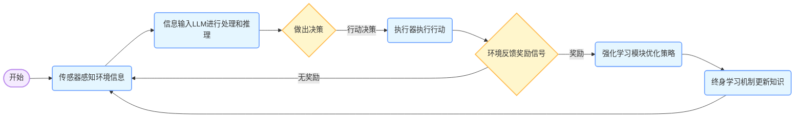

# 自主学习AI Agent：LLM驱动的终身学习系统

> 关键词：自主学习AI Agent、大语言模型（LLM）、终身学习系统、人工智能、强化学习、知识表示

> 摘要：本文聚焦于自主学习AI Agent，深入探讨由大语言模型（LLM）驱动的终身学习系统。详细介绍了相关核心概念、算法原理、数学模型，通过项目实战展示其具体实现过程，分析了实际应用场景，并推荐了学习工具和资源。最后对该领域的未来发展趋势与挑战进行总结，旨在为相关领域的研究者和开发者提供全面且深入的技术参考。

## 1. 背景介绍 
### 1.1 目的和范围
随着人工智能技术的不断发展，构建能够自主学习、适应新环境和新知识的智能体成为研究的重要方向。自主学习AI Agent以大语言模型（LLM）为驱动的终身学习系统，旨在让智能体在不断变化的环境中持续学习，积累知识和技能，实现自我进化。本文的范围涵盖了该系统的核心概念、算法原理、数学模型、项目实战、应用场景以及未来发展等方面。

### 1.2 预期读者
本文预期读者包括人工智能领域的研究者、开发者、学生，以及对自主学习AI Agent和终身学习系统感兴趣的技术爱好者。他们希望通过本文深入了解该系统的原理、实现方法和应用前景。

### 1.3 文档结构概述
本文首先介绍自主学习AI Agent和LLM驱动的终身学习系统的背景知识，包括目的、预期读者和文档结构。接着阐述核心概念及其联系，给出原理和架构的文本示意图和Mermaid流程图。然后详细讲解核心算法原理和具体操作步骤，结合Python源代码进行说明。随后介绍数学模型和公式，并举例说明。通过项目实战展示代码实际案例和详细解释。分析实际应用场景，推荐相关的工具和资源。最后总结未来发展趋势与挑战，提供常见问题解答和扩展阅读参考资料。

### 1.4 术语表
#### 1.4.1 核心术语定义
- **自主学习AI Agent**：能够在没有人类过多干预的情况下，自主感知环境、学习知识、做出决策并执行行动的智能体。
- **大语言模型（LLM）**：基于深度学习技术，在大规模文本数据上训练得到的语言模型，具有强大的语言理解和生成能力。
- **终身学习系统**：允许智能体在其生命周期内持续学习新知识、适应新任务和环境变化，避免灾难性遗忘的学习系统。
- **强化学习**：智能体通过与环境进行交互，根据环境反馈的奖励信号来学习最优策略的机器学习方法。
- **知识表示**：将知识以计算机能够理解和处理的形式进行表示，以便智能体进行存储、推理和应用。

#### 1.4.2 相关概念解释
- **灾难性遗忘**：在传统机器学习模型中，当模型学习新任务时，往往会忘记之前学习的知识，导致在旧任务上的性能显著下降。
- **元学习**：一种学习如何学习的方法，旨在让模型能够快速适应新任务，通过在多个任务上进行训练，学习到通用的学习策略。
- **迁移学习**：将在一个任务上学习到的知识和技能迁移到另一个相关任务上，以加速新任务的学习过程。

#### 1.4.3 缩略词列表
- **LLM**：Large Language Model（大语言模型）
- **RL**：Reinforcement Learning（强化学习）
- **ML**：Machine Learning（机器学习）
- **DL**：Deep Learning（深度学习）

## 2. 核心概念与联系 

### 核心概念原理
自主学习AI Agent是一个复杂的智能系统，它以大语言模型（LLM）为核心驱动力，结合终身学习机制，实现持续的知识积累和能力提升。

#### 大语言模型（LLM）
大语言模型基于深度学习架构，如Transformer，通过在大规模文本数据上进行无监督学习，学习到语言的统计规律和语义信息。LLM具有强大的语言理解和生成能力，可以用于回答问题、生成文本、进行对话等任务。在自主学习AI Agent中，LLM作为知识源和推理引擎，为智能体提供语言相关的知识和推理能力。

#### 终身学习机制
终身学习机制允许AI Agent在不断变化的环境中持续学习新知识，避免灾难性遗忘。它通过多种技术实现，如增量学习、元学习和迁移学习。增量学习允许智能体在已有模型的基础上，逐步学习新的数据和知识，而不需要重新训练整个模型。元学习则让智能体学习如何学习，能够快速适应新任务。迁移学习将在一个任务上学习到的知识迁移到另一个相关任务上，加速新任务的学习过程。

#### 自主学习AI Agent
自主学习AI Agent是一个能够自主感知环境、学习知识、做出决策并执行行动的智能体。它通过传感器感知环境信息，将信息输入到LLM中进行处理和推理，根据推理结果做出决策，并通过执行器执行相应的行动。同时，智能体根据环境反馈的奖励信号，利用强化学习算法不断优化自己的策略。

### 架构的文本示意图
```plaintext
+---------------------+
|  自主学习AI Agent   |
+---------------------+
|  - 传感器           |
|  - LLM（知识源/推理引擎） |
|  - 决策模块         |
|  - 执行器           |
|  - 终身学习机制     |
|    - 增量学习       |
|    - 元学习         |
|    - 迁移学习       |
|  - 强化学习模块     |
+---------------------+
|  环境               |
|  - 反馈奖励信号     |
+---------------------+
```

### Mermaid流程图


## 3. 核心算法原理 & 具体操作步骤 

### 核心算法原理
在自主学习AI Agent的终身学习系统中，主要涉及到强化学习算法和增量学习算法。

#### 强化学习算法（以Q-learning为例）
Q-learning是一种无模型的强化学习算法，它通过学习一个动作价值函数 $Q(s, a)$ 来找到最优策略。动作价值函数 $Q(s, a)$ 表示在状态 $s$ 下采取动作 $a$ 并遵循最优策略时的期望累计奖励。

Q-learning的更新公式为：
$$Q(s_t, a_t) \leftarrow Q(s_t, a_t) + \alpha [r_{t+1} + \gamma \max_{a} Q(s_{t+1}, a) - Q(s_t, a_t)]$$
其中，$s_t$ 是当前状态，$a_t$ 是当前动作，$r_{t+1}$ 是执行动作 $a_t$ 后获得的奖励，$s_{t+1}$ 是下一个状态，$\alpha$ 是学习率，$\gamma$ 是折扣因子。

#### 增量学习算法（以在线梯度下降为例）
在线梯度下降是一种简单而有效的增量学习算法，它在每次接收到新的数据时，更新模型的参数。假设我们有一个损失函数 $L(\theta; x, y)$，其中 $\theta$ 是模型的参数，$x$ 是输入数据，$y$ 是目标输出。在线梯度下降的更新公式为：
$$\theta \leftarrow \theta - \eta \nabla_{\theta} L(\theta; x, y)$$
其中，$\eta$ 是学习率，$\nabla_{\theta} L(\theta; x, y)$ 是损失函数关于参数 $\theta$ 的梯度。

### 具体操作步骤
#### 初始化
- 初始化LLM的参数和强化学习的动作价值函数 $Q(s, a)$。
- 初始化增量学习的模型参数 $\theta$。

#### 环境交互
- 传感器感知环境信息，得到当前状态 $s_t$。
- 根据当前状态 $s_t$ 和动作价值函数 $Q(s, a)$，选择一个动作 $a_t$。可以使用 $\epsilon$-贪心策略，以 $\epsilon$ 的概率随机选择一个动作，以 $1 - \epsilon$ 的概率选择 $Q(s_t, a)$ 最大的动作。
- 执行器执行动作 $a_t$，环境返回奖励 $r_{t+1}$ 和下一个状态 $s_{t+1}$。

#### 强化学习更新
- 根据Q-learning的更新公式，更新动作价值函数 $Q(s_t, a_t)$。

#### 增量学习更新
- 如果接收到新的数据 $(x, y)$，根据在线梯度下降的更新公式，更新模型参数 $\theta$。

#### 重复步骤2-4
不断重复环境交互、强化学习更新和增量学习更新的过程，直到达到终止条件。

### Python源代码实现
```python
import numpy as np

# 初始化参数
num_states = 10
num_actions = 4
Q = np.zeros((num_states, num_actions))
theta = np.random.randn(10)  # 假设模型有10个参数
alpha = 0.1  # 强化学习学习率
gamma = 0.9  # 折扣因子
eta = 0.01  # 增量学习学习率
epsilon = 0.1  # epsilon-贪心策略参数

# 定义环境交互函数
def interact(state):
    if np.random.rand() < epsilon:
        action = np.random.randint(num_actions)
    else:
        action = np.argmax(Q[state])
    # 这里简单模拟环境反馈
    next_state = (state + action) % num_states
    reward = np.random.randn()
    return action, next_state, reward

# 定义损失函数和梯度计算函数
def loss_function(theta, x, y):
    # 简单的线性回归损失函数
    y_pred = np.dot(x, theta)
    return np.mean((y_pred - y) ** 2)

def gradient(theta, x, y):
    y_pred = np.dot(x, theta)
    return 2 * np.dot(x.T, (y_pred - y)) / len(x)

# 主循环
num_episodes = 1000
for episode in range(num_episodes):
    state = np.random.randint(num_states)
    for step in range(100):
        action, next_state, reward = interact(state)
        # 强化学习更新
        Q[state, action] = Q[state, action] + alpha * (reward + gamma * np.max(Q[next_state]) - Q[state, action])
        # 增量学习更新
        x = np.random.randn(10)  # 模拟新数据
        y = np.random.randn()
        theta = theta - eta * gradient(theta, x, y)
        state = next_state
```

## 4. 数学模型和公式 & 详细讲解 & 举例说明 

### 强化学习数学模型
在强化学习中，智能体与环境进行交互，通过不断尝试不同的动作来最大化长期累积奖励。强化学习可以用马尔可夫决策过程（MDP）来建模。

#### 马尔可夫决策过程（MDP）
一个马尔可夫决策过程由一个五元组 $(S, A, P, R, \gamma)$ 组成：
- $S$ 是状态空间，表示环境的所有可能状态。
- $A$ 是动作空间，表示智能体可以采取的所有可能动作。
- $P(s'|s, a)$ 是状态转移概率，表示在状态 $s$ 下采取动作 $a$ 后转移到状态 $s'$ 的概率。
- $R(s, a, s')$ 是奖励函数，表示在状态 $s$ 下采取动作 $a$ 转移到状态 $s'$ 时获得的奖励。
- $\gamma$ 是折扣因子，用于权衡即时奖励和未来奖励，取值范围为 $[0, 1]$。

#### 策略和价值函数
策略 $\pi(a|s)$ 是一个条件概率分布，表示在状态 $s$ 下采取动作 $a$ 的概率。价值函数用于评估状态或状态-动作对的好坏。

- 状态价值函数 $V^{\pi}(s)$ 表示在策略 $\pi$ 下，从状态 $s$ 开始的期望累计奖励：
$$V^{\pi}(s) = \mathbb{E}_{\pi} \left[ \sum_{t=0}^{\infty} \gamma^t R(s_t, a_t, s_{t+1}) \big| s_0 = s \right]$$
- 动作价值函数 $Q^{\pi}(s, a)$ 表示在策略 $\pi$ 下，从状态 $s$ 采取动作 $a$ 开始的期望累计奖励：
$$Q^{\pi}(s, a) = \mathbb{E}_{\pi} \left[ \sum_{t=0}^{\infty} \gamma^t R(s_t, a_t, s_{t+1}) \big| s_0 = s, a_0 = a \right]$$

#### 最优价值函数和最优策略
最优状态价值函数 $V^*(s)$ 和最优动作价值函数 $Q^*(s, a)$ 分别定义为：
$$V^*(s) = \max_{\pi} V^{\pi}(s)$$
$$Q^*(s, a) = \max_{\pi} Q^{\pi}(s, a)$$
最优策略 $\pi^*$ 是使得 $V^{\pi}(s)$ 或 $Q^{\pi}(s, a)$ 达到最大值的策略。

### 增量学习数学模型
增量学习的目标是在每次接收到新的数据时，更新模型的参数，以最小化损失函数。假设我们有一个损失函数 $L(\theta; x, y)$，其中 $\theta$ 是模型的参数，$x$ 是输入数据，$y$ 是目标输出。

#### 在线梯度下降
在线梯度下降是一种简单的增量学习算法，它的更新公式为：
$$\theta \leftarrow \theta - \eta \nabla_{\theta} L(\theta; x, y)$$
其中，$\eta$ 是学习率，$\nabla_{\theta} L(\theta; x, y)$ 是损失函数关于参数 $\theta$ 的梯度。

### 举例说明
#### 强化学习举例
假设我们有一个简单的网格世界环境，智能体可以在一个 $3 \times 3$ 的网格中移动，目标是从起点 $(0, 0)$ 移动到终点 $(2, 2)$。智能体可以采取四个动作：上、下、左、右。

- 状态空间 $S$：包含 $3 \times 3 = 9$ 个状态，表示网格中的每个位置。
- 动作空间 $A$：包含四个动作：上、下、左、右。
- 状态转移概率 $P(s'|s, a)$：如果动作合法，智能体将移动到相应的位置；否则，保持当前状态不变。
- 奖励函数 $R(s, a, s')$：如果智能体到达终点，获得奖励 $+1$；否则，获得奖励 $-0.1$。
- 折扣因子 $\gamma = 0.9$。

使用Q-learning算法，智能体通过不断与环境交互，学习到最优策略，最终能够找到从起点到终点的最短路径。

#### 增量学习举例
假设我们要训练一个线性回归模型 $y = \theta^T x$，其中 $x$ 是输入特征，$y$ 是目标输出。损失函数为均方误差：
$$L(\theta; x, y) = \frac{1}{n} \sum_{i=1}^{n} (y_i - \theta^T x_i)^2$$
使用在线梯度下降算法，每次接收到一个新的数据点 $(x, y)$ 时，更新模型的参数 $\theta$：
$$\theta \leftarrow \theta - \eta \frac{2}{n} (y - \theta^T x) x$$
通过不断更新参数，模型能够逐渐适应新的数据，提高预测的准确性。

## 5. 项目实战：代码实际案例和详细解释说明 

### 5.1  开发环境搭建
#### 操作系统
建议使用Linux或macOS系统，因为它们对Python开发环境的支持更好。如果使用Windows系统，也可以通过安装Anaconda来搭建开发环境。

#### Python版本
建议使用Python 3.7及以上版本。

#### 安装依赖库
使用以下命令安装必要的依赖库：
```bash
pip install numpy torch gym
```
- `numpy`：用于数值计算。
- `torch`：用于深度学习模型的开发。
- `gym`：OpenAI提供的强化学习环境库，用于创建和管理各种强化学习环境。

### 5.2  源代码详细实现和代码解读
```python
import numpy as np
import torch
import torch.nn as nn
import torch.optim as optim
import gym

# 定义神经网络模型
class QNetwork(nn.Module):
    def __init__(self, input_dim, output_dim):
        super(QNetwork, self).__init__()
        self.fc1 = nn.Linear(input_dim, 64)
        self.fc2 = nn.Linear(64, 64)
        self.fc3 = nn.Linear(64, output_dim)

    def forward(self, x):
        x = torch.relu(self.fc1(x))
        x = torch.relu(self.fc2(x))
        x = self.fc3(x)
        return x

# 定义Q-learning智能体
class QLearningAgent:
    def __init__(self, input_dim, output_dim, learning_rate=0.001, gamma=0.99, epsilon=1.0, epsilon_decay=0.995, epsilon_min=0.01):
        self.input_dim = input_dim
        self.output_dim = output_dim
        self.learning_rate = learning_rate
        self.gamma = gamma
        self.epsilon = epsilon
        self.epsilon_decay = epsilon_decay
        self.epsilon_min = epsilon_min

        self.model = QNetwork(input_dim, output_dim)
        self.optimizer = optim.Adam(self.model.parameters(), lr=learning_rate)
        self.criterion = nn.MSELoss()

    def act(self, state):
        if np.random.rand() <= self.epsilon:
            return np.random.choice(self.output_dim)
        state = torch.FloatTensor(state).unsqueeze(0)
        q_values = self.model(state)
        action = torch.argmax(q_values).item()
        return action

    def learn(self, state, action, reward, next_state, done):
        state = torch.FloatTensor(state).unsqueeze(0)
        next_state = torch.FloatTensor(next_state).unsqueeze(0)
        reward = torch.FloatTensor([reward])
        done = torch.FloatTensor([done])

        q_values = self.model(state)
        next_q_values = self.model(next_state)
        target_q_values = q_values.clone()
        target_q_values[0][action] = reward + (1 - done) * self.gamma * torch.max(next_q_values)

        loss = self.criterion(q_values, target_q_values)
        self.optimizer.zero_grad()
        loss.backward()
        self.optimizer.step()

        if self.epsilon > self.epsilon_min:
            self.epsilon *= self.epsilon_decay

# 主训练循环
def train():
    env = gym.make('CartPole-v1')
    input_dim = env.observation_space.shape[0]
    output_dim = env.action_space.n
    agent = QLearningAgent(input_dim, output_dim)

    num_episodes = 1000
    for episode in range(num_episodes):
        state = env.reset()
        total_reward = 0
        done = False
        while not done:
            action = agent.act(state)
            next_state, reward, done, _ = env.step(action)
            agent.learn(state, action, reward, next_state, done)
            state = next_state
            total_reward += reward
        print(f"Episode {episode}: Total Reward = {total_reward}")

    env.close()

if __name__ == "__main__":
    train()
```

### 5.3  代码解读与分析
#### 神经网络模型 `QNetwork`
`QNetwork` 是一个简单的三层全连接神经网络，用于近似动作价值函数 $Q(s, a)$。输入层的维度为 `input_dim`，表示环境状态的维度；输出层的维度为 `output_dim`，表示动作的数量。网络使用ReLU激活函数进行非线性变换。

#### Q-learning智能体 `QLearningAgent`
- `__init__` 方法：初始化智能体的参数，包括学习率、折扣因子、探索率等。创建神经网络模型和优化器，并定义损失函数。
- `act` 方法：根据当前状态选择动作。使用 $\epsilon$-贪心策略，以 $\epsilon$ 的概率随机选择一个动作，以 $1 - \epsilon$ 的概率选择 $Q(s, a)$ 最大的动作。
- `learn` 方法：根据环境反馈的奖励和下一个状态，更新神经网络的参数。计算目标Q值和当前Q值之间的损失，并使用反向传播算法更新模型参数。同时，逐渐减小探索率 $\epsilon$。

#### 主训练循环 `train`
- 创建OpenAI Gym环境 `CartPole-v1`。
- 初始化Q-learning智能体。
- 进行多个回合的训练，每个回合中智能体与环境进行交互，根据环境反馈更新模型参数。
- 打印每个回合的总奖励。

通过这个项目实战，我们可以看到如何使用Q-learning算法训练一个智能体在 `CartPole-v1` 环境中学习平衡杆子的策略。

## 6. 实际应用场景 
### 智能客服
自主学习AI Agent可以用于智能客服系统，通过与用户进行对话，理解用户的问题并提供准确的回答。LLM可以作为知识源，为智能客服提供丰富的知识和语言理解能力。同时，智能客服可以通过强化学习不断优化自己的回答策略，提高用户满意度。

### 智能家居控制
在智能家居系统中，自主学习AI Agent可以根据用户的习惯和环境条件，自动控制家居设备。例如，根据用户的日常作息时间自动调节灯光亮度和温度，通过学习用户的使用模式，提供个性化的服务。

### 自动驾驶
自动驾驶汽车可以看作是一个自主学习AI Agent，它需要不断感知周围环境，做出决策并控制车辆行驶。LLM可以用于处理和理解交通规则、地图信息等文本数据，强化学习可以帮助自动驾驶汽车学习最优的驾驶策略。

### 金融投资
自主学习AI Agent可以用于金融投资领域，通过分析市场数据、新闻资讯等信息，做出投资决策。LLM可以帮助智能体理解金融文本信息，强化学习可以优化投资策略，提高投资回报率。

### 医疗诊断
在医疗领域，自主学习AI Agent可以辅助医生进行疾病诊断。通过学习大量的医学文献和病例数据，智能体可以提供诊断建议和治疗方案。同时，通过与医生的交互和反馈，不断优化自己的诊断能力。

## 7. 工具和资源推荐
### 7.1 学习资源推荐
#### 7.1.1 书籍推荐
- 《人工智能：一种现代的方法》（Artificial Intelligence: A Modern Approach）：全面介绍人工智能的基本概念、算法和应用，是人工智能领域的经典教材。
- 《深度学习》（Deep Learning）：由深度学习领域的三位顶尖专家编写，详细介绍了深度学习的理论和实践。
- 《强化学习：原理与Python实现》（Reinforcement Learning: An Introduction）：系统介绍强化学习的基本概念、算法和应用，是强化学习领域的经典著作。

#### 7.1.2 在线课程
- Coursera上的“人工智能基础”（Foundations of Artificial Intelligence）课程：由斯坦福大学教授授课，介绍人工智能的基本概念和算法。
- edX上的“深度学习”（Deep Learning Specialization）课程：由吴恩达教授授课，深入介绍深度学习的理论和实践。
- OpenAI Gym官方文档和教程：提供了丰富的强化学习环境和示例代码，帮助学习者快速上手强化学习。

#### 7.1.3 技术博客和网站
- Medium上的人工智能相关博客：有许多人工智能领域的专家和开发者分享他们的研究成果和实践经验。
- arXiv.org：提供了大量的人工智能领域的学术论文，包括最新的研究成果和技术进展。
- GitHub上的开源项目：可以找到许多与自主学习AI Agent和终身学习系统相关的开源代码和项目。

### 7.2 开发工具框架推荐
#### 7.2.1 IDE和编辑器
- PyCharm：功能强大的Python集成开发环境，提供代码编辑、调试、版本控制等功能。
- Jupyter Notebook：交互式的开发环境，适合进行数据分析和模型实验。
- Visual Studio Code：轻量级的代码编辑器，支持多种编程语言和插件扩展。

#### 7.2.2 调试和性能分析工具
- PyTorch Profiler：用于分析PyTorch模型的性能瓶颈，帮助优化模型的训练和推理速度。
- TensorBoard：用于可视化深度学习模型的训练过程和性能指标，方便调试和优化模型。
- cProfile：Python自带的性能分析工具，用于分析Python代码的运行时间和函数调用关系。

#### 7.2.3 相关框架和库
- PyTorch：一个开源的深度学习框架，提供了丰富的深度学习模型和工具，支持GPU加速。
- TensorFlow：另一个流行的深度学习框架，具有强大的分布式训练和部署能力。
- OpenAI Gym：用于创建和管理各种强化学习环境，提供了丰富的环境和示例代码。

### 7.3 相关论文著作推荐
#### 7.3.1 经典论文
- “Attention Is All You Need”：提出了Transformer架构，是大语言模型的基础。
- “Human-Level Control through Deep Reinforcement Learning”：介绍了深度Q网络（DQN）算法，开创了深度强化学习的先河。
- “Lifelong Machine Learning”：探讨了终身学习的概念和方法，为终身学习系统的研究奠定了基础。

#### 7.3.2 最新研究成果
- 关注NeurIPS、ICML、CVPR等顶级人工智能学术会议上的最新研究成果，了解自主学习AI Agent和终身学习系统的最新技术进展。
- 关注知名研究机构和学者的最新论文，如OpenAI、DeepMind等。

#### 7.3.3 应用案例分析
- 分析实际应用场景中的成功案例，了解自主学习AI Agent和终身学习系统在不同领域的应用方法和效果。可以参考一些行业报告和技术博客上的案例分析。

## 8. 总结：未来发展趋势与挑战
### 未来发展趋势
#### 更强的语言理解和生成能力
随着大语言模型的不断发展，自主学习AI Agent将具备更强的语言理解和生成能力，能够更好地与人类进行自然语言交互，处理复杂的语言任务。

#### 多模态融合
未来的自主学习AI Agent将不仅仅局限于语言处理，还将融合视觉、听觉等多种模态信息，实现更加全面和智能的感知和决策能力。

#### 自适应和个性化
智能体将能够根据不同用户的需求和偏好，提供个性化的服务和解决方案。同时，能够快速适应新的环境和任务，实现终身学习和自我进化。

#### 与人类协作
自主学习AI Agent将与人类更加紧密地协作，成为人类的智能助手和合作伙伴，共同完成复杂的任务。

### 挑战
#### 数据隐私和安全
在终身学习过程中，智能体需要不断收集和处理大量的数据，这涉及到数据隐私和安全问题。如何保护用户的数据隐私，防止数据泄露和滥用，是一个重要的挑战。

#### 灾难性遗忘
虽然终身学习机制可以在一定程度上缓解灾难性遗忘问题，但如何彻底解决这一问题，仍然是一个研究热点。

#### 计算资源和效率
训练和运行大语言模型和复杂的智能体需要大量的计算资源和时间。如何提高计算效率，降低计算成本，是实现自主学习AI Agent广泛应用的关键。

#### 伦理和法律问题
随着自主学习AI Agent的应用越来越广泛，涉及到的伦理和法律问题也越来越多。例如，智能体的决策责任、道德准则等问题，需要建立相应的伦理和法律框架来规范。

## 9. 附录：常见问题与解答
### 什么是自主学习AI Agent？
自主学习AI Agent是一个能够在没有人类过多干预的情况下，自主感知环境、学习知识、做出决策并执行行动的智能体。它通过与环境进行交互，不断积累知识和经验，实现自我进化。

### 大语言模型（LLM）在自主学习AI Agent中起到什么作用？
大语言模型作为知识源和推理引擎，为自主学习AI Agent提供语言相关的知识和推理能力。它可以帮助智能体理解自然语言、回答问题、生成文本等。

### 什么是终身学习系统？
终身学习系统允许智能体在其生命周期内持续学习新知识、适应新任务和环境变化，避免灾难性遗忘。它通过增量学习、元学习和迁移学习等技术实现。

### 强化学习在自主学习AI Agent中是如何应用的？
强化学习通过智能体与环境进行交互，根据环境反馈的奖励信号来学习最优策略。在自主学习AI Agent中，强化学习可以用于优化智能体的决策和行动，使其能够在不同的环境中获得最大的奖励。

### 如何解决自主学习AI Agent中的灾难性遗忘问题？
可以通过增量学习、元学习和迁移学习等技术来缓解灾难性遗忘问题。增量学习允许智能体在已有模型的基础上逐步学习新的数据和知识，元学习让智能体学习如何学习，能够快速适应新任务，迁移学习将在一个任务上学习到的知识迁移到另一个相关任务上。

## 10. 扩展阅读 & 参考资料
### 扩展阅读
- 《人工智能的未来》（The Future of Artificial Intelligence）：探讨人工智能的发展趋势和未来挑战。
- 《思考，快与慢》（Thinking, Fast and Slow）：介绍人类思维的两种模式，对理解智能体的决策过程有一定的启示。
- 《技术的本质》（The Nature of Technology）：探讨技术的本质和发展规律，对理解人工智能技术的发展有一定的帮助。

### 参考资料
- OpenAI官方文档：https://openai.com/
- PyTorch官方文档：https://pytorch.org/
- TensorFlow官方文档：https://www.tensorflow.org/
- OpenAI Gym官方文档：https://gym.openai.com/

作者：AI天才研究院/AI Genius Institute & 禅与计算机程序设计艺术 /Zen And The Art of Computer Programming