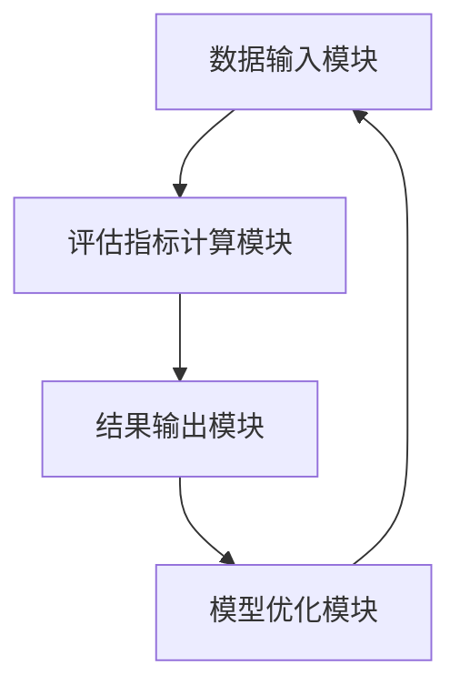

# 自动化评估系统:减少AI训练中的人工干预

> 关键词：自动化评估系统、AI训练、人工干预、评估指标、机器学习

> 摘要：本文聚焦于自动化评估系统在减少AI训练中人工干预的应用。首先介绍了该主题的背景，包括目的、预期读者、文档结构和相关术语。接着阐述了核心概念及其联系，展示了系统的原理和架构。详细讲解了核心算法原理及具体操作步骤，结合Python代码进行说明。深入分析了数学模型和公式，并举例说明。通过项目实战，从开发环境搭建到源代码实现与解读，展示了系统的实际应用。探讨了系统的实际应用场景，推荐了相关的学习资源、开发工具框架和论文著作。最后总结了未来发展趋势与挑战，提供了常见问题解答和扩展阅读参考资料，旨在帮助读者全面了解自动化评估系统在AI训练中的重要性和应用方法。

## 1. 背景介绍 
### 1.1 目的和范围
在人工智能（AI）的发展过程中，训练模型是一个至关重要的环节。传统的AI训练往往需要大量的人工干预，包括数据标注、模型评估等工作。这些人工操作不仅耗费大量的时间和人力成本，还容易引入人为误差。自动化评估系统的出现旨在解决这些问题，通过自动化的方式对AI模型进行评估，减少人工干预，提高评估的效率和准确性。

本文的范围主要涵盖自动化评估系统的基本原理、核心算法、数学模型、实际应用以及相关的工具和资源。我们将探讨如何利用自动化评估系统在不同的AI训练场景中减少人工干预，提高训练的效果和效率。

### 1.2 预期读者
本文预期的读者包括AI研究人员、数据科学家、机器学习工程师、软件开发人员以及对AI训练和自动化评估感兴趣的技术爱好者。无论你是初学者还是有一定经验的专业人士，都可以从本文中获得关于自动化评估系统的深入理解和实用知识。

### 1.3 文档结构概述
本文将按照以下结构进行组织：
1. **背景介绍**：介绍自动化评估系统的目的、预期读者、文档结构和相关术语。
2. **核心概念与联系**：阐述自动化评估系统的核心概念、原理和架构，并通过文本示意图和Mermaid流程图进行展示。
3. **核心算法原理 & 具体操作步骤**：详细讲解自动化评估系统的核心算法原理，并结合Python源代码进行说明。
4. **数学模型和公式 & 详细讲解 & 举例说明**：分析自动化评估系统的数学模型和公式，并通过具体例子进行详细讲解。
5. **项目实战：代码实际案例和详细解释说明**：通过一个实际项目，展示自动化评估系统的开发过程，包括开发环境搭建、源代码实现和代码解读。
6. **实际应用场景**：探讨自动化评估系统在不同领域的实际应用场景。
7. **工具和资源推荐**：推荐相关的学习资源、开发工具框架和论文著作。
8. **总结：未来发展趋势与挑战**：总结自动化评估系统的未来发展趋势和面临的挑战。
9. **附录：常见问题与解答**：提供常见问题的解答，帮助读者更好地理解和应用自动化评估系统。
10. **扩展阅读 & 参考资料**：提供扩展阅读的建议和相关的参考资料。

### 1.4 术语表
#### 1.4.1 核心术语定义
- **自动化评估系统**：一种能够自动对AI模型进行评估的系统，通过预设的评估指标和算法，减少人工干预，提高评估的效率和准确性。
- **AI训练**：通过大量的数据对AI模型进行训练，使其能够学习到数据中的模式和规律，从而实现特定的任务。
- **人工干预**：在AI训练过程中，需要人工进行的数据标注、模型评估等操作。
- **评估指标**：用于衡量AI模型性能的标准，如准确率、召回率、F1值等。

#### 1.4.2 相关概念解释
- **机器学习**：一门多领域交叉学科，涉及概率论、统计学、逼近论、凸分析、算法复杂度理论等多门学科。它专门研究计算机怎样模拟或实现人类的学习行为，以获取新的知识或技能，重新组织已有的知识结构使之不断改善自身的性能。
- **深度学习**：机器学习的一个分支领域，它是一种基于对数据进行表征学习的方法。深度学习通过构建具有很多层的神经网络模型，自动从数据中学习到复杂的特征和模式。

#### 1.4.3 缩略词列表
- **AI**：Artificial Intelligence，人工智能
- **ML**：Machine Learning，机器学习
- **DL**：Deep Learning，深度学习
- **CNN**：Convolutional Neural Network，卷积神经网络
- **RNN**：Recurrent Neural Network，循环神经网络

## 2. 核心概念与联系 

### 核心概念原理
自动化评估系统的核心原理是通过预设的评估指标和算法，自动对AI模型的输出结果进行评估。在AI训练过程中，模型会不断地进行预测和输出结果，自动化评估系统会根据这些输出结果，计算相应的评估指标，如准确率、召回率、F1值等。通过这些评估指标，我们可以了解模型的性能表现，从而对模型进行优化和调整。

### 架构的文本示意图
自动化评估系统的架构主要包括以下几个部分：
1. **数据输入模块**：负责接收AI模型的输入数据和输出结果。
2. **评估指标计算模块**：根据预设的评估指标和算法，对模型的输出结果进行计算和评估。
3. **结果输出模块**：将评估结果输出，供用户查看和分析。
4. **模型优化模块**：根据评估结果，对AI模型进行优化和调整。

### Mermaid流程图


## 3. 核心算法原理 & 具体操作步骤 

### 核心算法原理
自动化评估系统的核心算法主要包括评估指标的计算算法。常见的评估指标包括准确率、召回率、F1值等。下面我们以准确率为例，介绍评估指标的计算算法。

准确率是指模型预测正确的样本数占总样本数的比例。其计算公式为：
$$准确率 = \frac{预测正确的样本数}{总样本数}$$

### 具体操作步骤
以下是使用Python实现准确率计算的具体操作步骤：

```python
# 定义预测结果和真实标签
predictions = [1, 0, 1, 1, 0]
labels = [1, 1, 1, 0, 0]

# 初始化预测正确的样本数
correct_count = 0

# 遍历预测结果和真实标签
for i in range(len(predictions)):
    if predictions[i] == labels[i]:
        correct_count += 1

# 计算准确率
accuracy = correct_count / len(predictions)

# 输出准确率
print("准确率:", accuracy)
```

### 代码解释
1. 首先，我们定义了预测结果和真实标签。
2. 然后，我们初始化了预测正确的样本数为0。
3. 接着，我们遍历预测结果和真实标签，比较每个样本的预测结果和真实标签。如果预测结果和真实标签相同，则预测正确的样本数加1。
4. 最后，我们计算准确率，并将其输出。

## 4. 数学模型和公式 & 详细讲解 & 举例说明 

### 常见评估指标的数学模型和公式
#### 准确率（Accuracy）
准确率是指模型预测正确的样本数占总样本数的比例。其计算公式为：
$$准确率 = \frac{预测正确的样本数}{总样本数}$$

#### 召回率（Recall）
召回率是指模型预测为正例的样本中，实际为正例的样本数占实际正例样本数的比例。其计算公式为：
$$召回率 = \frac{真正例数}{真正例数 + 假反例数}$$

#### F1值（F1-Score）
F1值是准确率和召回率的调和平均数，用于综合衡量模型的性能。其计算公式为：
$$F1值 = 2 \times \frac{准确率 \times 召回率}{准确率 + 召回率}$$

### 详细讲解
- **准确率**：准确率是最常用的评估指标之一，它反映了模型整体的预测准确性。但是，在样本不均衡的情况下，准确率可能会产生误导。例如，在一个二分类问题中，正例样本占总样本数的90%，负例样本占总样本数的10%。如果模型总是预测为正例，那么准确率将达到90%，但实际上模型并没有学习到任何有用的信息。
- **召回率**：召回率主要关注模型对正例样本的识别能力。在一些应用场景中，如疾病诊断、垃圾邮件过滤等，召回率更为重要。例如，在疾病诊断中，我们希望尽可能地识别出所有的患病患者，因此召回率越高越好。
- **F1值**：F1值综合考虑了准确率和召回率，能够更全面地衡量模型的性能。当准确率和召回率都较高时，F1值也会较高。

### 举例说明
假设我们有一个二分类问题，模型的预测结果和真实标签如下：
| 样本编号 | 预测结果 | 真实标签 |
| ---- | ---- | ---- |
| 1 | 1 | 1 |
| 2 | 0 | 1 |
| 3 | 1 | 1 |
| 4 | 1 | 0 |
| 5 | 0 | 0 |

#### 准确率计算
预测正确的样本数为3，总样本数为5，因此准确率为：
$$准确率 = \frac{3}{5} = 0.6$$

#### 召回率计算
真正例数为2，假反例数为1，因此召回率为：
$$召回率 = \frac{2}{2 + 1} \approx 0.67$$

#### F1值计算
准确率为0.6，召回率为0.67，因此F1值为：
$$F1值 = 2 \times \frac{0.6 \times 0.67}{0.6 + 0.67} \approx 0.63$$

## 5. 项目实战：代码实际案例和详细解释说明 

### 5.1  开发环境搭建
本项目使用Python进行开发，需要安装以下库：
- **NumPy**：用于数值计算。
- **Scikit-learn**：用于机器学习算法和评估指标的计算。

可以使用以下命令安装这些库：
```sh
pip install numpy scikit-learn
```

### 5.2  源代码详细实现和代码解读
以下是一个使用Scikit-learn库实现自动化评估系统的示例代码：

```python
import numpy as np
from sklearn.metrics import accuracy_score, recall_score, f1_score
from sklearn.datasets import make_classification
from sklearn.model_selection import train_test_split
from sklearn.linear_model import LogisticRegression

# 生成数据集
X, y = make_classification(n_samples=1000, n_features=10, n_informative=5, n_redundant=0, random_state=42)

# 划分训练集和测试集
X_train, X_test, y_train, y_test = train_test_split(X, y, test_size=0.2, random_state=42)

# 训练模型
model = LogisticRegression()
model.fit(X_train, y_train)

# 预测结果
y_pred = model.predict(X_test)

# 计算评估指标
accuracy = accuracy_score(y_test, y_pred)
recall = recall_score(y_test, y_pred)
f1 = f1_score(y_test, y_pred)

# 输出评估结果
print("准确率:", accuracy)
print("召回率:", recall)
print("F1值:", f1)
```

### 代码解读与分析
1. **数据生成**：使用`make_classification`函数生成一个二分类数据集，包含1000个样本和10个特征。
2. **数据划分**：使用`train_test_split`函数将数据集划分为训练集和测试集，测试集占总样本数的20%。
3. **模型训练**：使用逻辑回归模型对训练集进行训练。
4. **模型预测**：使用训练好的模型对测试集进行预测。
5. **评估指标计算**：使用`accuracy_score`、`recall_score`和`f1_score`函数计算准确率、召回率和F1值。
6. **结果输出**：将评估结果输出。

## 6. 实际应用场景 
### 图像识别领域
在图像识别领域，自动化评估系统可以用于评估图像分类模型的性能。例如，在人脸识别系统中，自动化评估系统可以对模型的准确率、召回率等指标进行评估，帮助开发者优化模型。

### 自然语言处理领域
在自然语言处理领域，自动化评估系统可以用于评估文本分类、情感分析等模型的性能。例如，在垃圾邮件过滤系统中，自动化评估系统可以对模型的准确率、召回率等指标进行评估，提高过滤的效果。

### 医疗诊断领域
在医疗诊断领域，自动化评估系统可以用于评估疾病诊断模型的性能。例如，在癌症诊断系统中，自动化评估系统可以对模型的准确率、召回率等指标进行评估，帮助医生更准确地诊断疾病。

## 7. 工具和资源推荐
### 7.1 学习资源推荐
#### 7.1.1 书籍推荐
- 《机器学习》（周志华）：这本书是机器学习领域的经典教材，涵盖了机器学习的基本概念、算法和应用。
- 《深度学习》（Ian Goodfellow、Yoshua Bengio和Aaron Courville）：这本书是深度学习领域的权威著作，详细介绍了深度学习的原理、算法和应用。

#### 7.1.2 在线课程
- Coursera上的“机器学习”课程（Andrew Ng）：这是一门非常受欢迎的机器学习课程，由斯坦福大学的Andrew Ng教授主讲。
- edX上的“深度学习”课程（DeepLearning.AI）：这是一门深度学习领域的专业课程，由深度学习领域的专家主讲。

#### 7.1.3 技术博客和网站
- Medium：这是一个技术博客平台，上面有很多关于机器学习、深度学习的优质文章。
- Kaggle：这是一个数据科学竞赛平台，上面有很多关于机器学习、深度学习的数据集和代码示例。

### 7.2 开发工具框架推荐
#### 7.2.1 IDE和编辑器
- PyCharm：这是一个专业的Python IDE，提供了丰富的开发工具和插件，适合开发机器学习和深度学习项目。
- Jupyter Notebook：这是一个交互式的开发环境，适合进行数据探索和模型实验。

#### 7.2.2 调试和性能分析工具
- TensorBoard：这是一个用于可视化深度学习模型训练过程的工具，可以帮助开发者调试和优化模型。
- PyTorch Profiler：这是一个用于分析PyTorch模型性能的工具，可以帮助开发者找出模型的性能瓶颈。

#### 7.2.3 相关框架和库
- TensorFlow：这是一个开源的深度学习框架，提供了丰富的深度学习模型和工具。
- PyTorch：这是一个开源的深度学习框架，具有简洁易用的特点，适合快速开发和实验。

### 7.3 相关论文著作推荐
#### 7.3.1 经典论文
- 《Gradient-Based Learning Applied to Document Recognition》（Yann LeCun、Léon Bottou、Yoshua Bengio和Patrick Haffner）：这篇论文提出了卷积神经网络（CNN）的基本思想，是深度学习领域的经典论文之一。
- 《Long Short-Term Memory》（Sepp Hochreiter和Jürgen Schmidhuber）：这篇论文提出了长短期记忆网络（LSTM）的基本思想，是循环神经网络（RNN）领域的经典论文之一。

#### 7.3.2 最新研究成果
- arXiv：这是一个预印本平台，上面有很多关于机器学习、深度学习的最新研究成果。
- NeurIPS、ICML、CVPR等学术会议：这些学术会议是机器学习、深度学习领域的顶级会议，上面有很多最新的研究成果和技术趋势。

#### 7.3.3 应用案例分析
- Google AI Blog：这是Google的AI博客，上面有很多关于Google在AI领域的应用案例和技术分享。
- Facebook AI Research：这是Facebook的AI研究团队的官方网站，上面有很多关于Facebook在AI领域的应用案例和技术分享。

## 8. 总结：未来发展趋势与挑战
### 未来发展趋势
- **智能化程度不断提高**：自动化评估系统将越来越智能化，能够自动选择合适的评估指标和算法，对不同类型的AI模型进行评估。
- **与其他技术融合**：自动化评估系统将与大数据、云计算、物联网等技术融合，实现更高效、更准确的评估。
- **应用领域不断拓展**：自动化评估系统将在更多的领域得到应用，如金融、交通、教育等。

### 挑战
- **评估指标的选择和优化**：不同的AI模型和应用场景需要不同的评估指标，如何选择和优化评估指标是一个挑战。
- **数据质量和多样性**：自动化评估系统的性能依赖于数据的质量和多样性，如何获取高质量、多样化的数据是一个挑战。
- **模型的可解释性**：随着AI模型的复杂度不断提高，模型的可解释性变得越来越重要，如何提高模型的可解释性是一个挑战。

## 9. 附录：常见问题与解答
### 问题1：自动化评估系统可以完全替代人工评估吗？
答：虽然自动化评估系统可以减少人工干预，提高评估的效率和准确性，但它不能完全替代人工评估。在一些复杂的情况下，如模型的可解释性评估、伦理和法律问题评估等，仍然需要人工进行评估。

### 问题2：如何选择合适的评估指标？
答：选择合适的评估指标需要考虑多个因素，如模型的类型、应用场景、数据的特点等。一般来说，可以根据问题的性质选择合适的评估指标，如分类问题可以选择准确率、召回率、F1值等，回归问题可以选择均方误差、平均绝对误差等。

### 问题3：自动化评估系统的性能受哪些因素影响？
答：自动化评估系统的性能受多个因素影响，如数据的质量和多样性、评估指标的选择和优化、模型的复杂度等。为了提高自动化评估系统的性能，需要注意数据的收集和预处理，选择合适的评估指标和算法，优化模型的结构和参数。

## 10. 扩展阅读 & 参考资料
### 扩展阅读
- 《人工智能：现代方法》（Stuart Russell和Peter Norvig）：这本书是人工智能领域的经典教材，涵盖了人工智能的各个方面。
- 《Python机器学习实战》（Sebastian Raschka）：这本书通过实际案例介绍了Python在机器学习中的应用。

### 参考资料
- 《机器学习》（周志华）
- 《深度学习》（Ian Goodfellow、Yoshua Bengio和Aaron Courville）
- Coursera上的“机器学习”课程（Andrew Ng）
- edX上的“深度学习”课程（DeepLearning.AI）
- Medium
- Kaggle
- TensorFlow官方文档
- PyTorch官方文档
- arXiv
- NeurIPS、ICML、CVPR等学术会议论文

作者：AI天才研究院/AI Genius Institute & 禅与计算机程序设计艺术 /Zen And The Art of Computer Programming