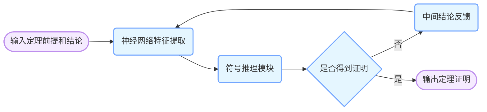

# 自动定理生成器中神经符号推理的应用

> 关键词：自动定理生成器、神经符号推理、人工智能、定理证明、符号逻辑

> 摘要：本文深入探讨了神经符号推理在自动定理生成器中的应用。首先介绍了自动定理生成器和神经符号推理的背景知识，包括目的、范围、预期读者等。接着阐述了核心概念及其联系，通过文本示意图和 Mermaid 流程图进行清晰展示。详细讲解了核心算法原理，并给出 Python 源代码示例。分析了相关数学模型和公式，并举例说明。通过项目实战，展示了代码的实际实现和详细解读。探讨了其在不同领域的实际应用场景，推荐了学习资源、开发工具框架和相关论文著作。最后总结了未来发展趋势与挑战，并提供了常见问题解答和扩展阅读参考资料。

## 1. 背景介绍 
### 1.1 目的和范围
自动定理生成器旨在自动生成数学定理、逻辑定理等的证明过程，其应用范围涵盖了数学研究、计算机科学中的程序验证、人工智能中的知识推理等多个领域。而神经符号推理则结合了神经网络的强大学习能力和符号逻辑的精确推理能力，为自动定理生成器带来了新的发展机遇。本文的目的是深入研究神经符号推理在自动定理生成器中的具体应用，包括算法原理、实际案例等，范围涉及从理论基础到实际应用的各个方面。

### 1.2 预期读者
本文预期读者包括计算机科学、数学、人工智能等领域的研究人员、工程师和学生。对于对自动定理证明和神经符号推理感兴趣的初学者，本文可以作为入门学习资料；对于有一定基础的专业人士，本文可以提供深入的技术分析和最新的研究动态。

### 1.3 文档结构概述
本文首先介绍背景知识，让读者对自动定理生成器和神经符号推理有初步了解。接着阐述核心概念及其联系，帮助读者建立清晰的理论框架。然后详细讲解核心算法原理和具体操作步骤，通过 Python 代码进行说明。之后分析数学模型和公式，并举例说明。通过项目实战展示代码的实际应用和详细解读。探讨实际应用场景，为读者提供应用思路。推荐学习资源、开发工具框架和相关论文著作，方便读者进一步学习和研究。最后总结未来发展趋势与挑战，提供常见问题解答和扩展阅读参考资料。

### 1.4 术语表
#### 1.4.1 核心术语定义
- **自动定理生成器**：一种能够自动生成定理证明过程的软件系统，它可以根据给定的公理、规则和前提条件，推导出新的定理。
- **神经符号推理**：结合神经网络和符号逻辑的推理方法，利用神经网络的学习能力处理数据，利用符号逻辑的规则进行精确推理。
- **神经网络**：一种模仿人类神经系统的计算模型，由大量的神经元组成，可以自动学习数据中的模式和规律。
- **符号逻辑**：用符号来表示命题、谓词等逻辑概念，并通过一系列的推理规则进行推理的逻辑系统。

#### 1.4.2 相关概念解释
- **定理证明**：通过逻辑推理和演绎，从已知的公理和前提条件出发，推导出某个命题为真的过程。
- **知识表示**：将知识以某种形式表示出来，以便计算机能够处理和理解，常见的知识表示方法有逻辑表示法、语义网络等。
- **机器学习**：让计算机通过数据学习模式和规律，从而实现预测、分类等任务的技术，神经网络是机器学习中的一种重要方法。

#### 1.4.3 缩略词列表
- **AI**：Artificial Intelligence，人工智能
- **ML**：Machine Learning，机器学习
- **NN**：Neural Network，神经网络

## 2. 核心概念与联系 
### 核心概念原理
自动定理生成器的核心原理是基于逻辑推理，它根据给定的公理和推理规则，从已知的前提条件出发，逐步推导出新的定理。传统的自动定理生成器主要采用符号逻辑的方法，通过精确的规则进行推理，但这种方法在处理复杂问题时效率较低。

神经符号推理结合了神经网络和符号逻辑的优点。神经网络具有强大的学习能力，可以从大量的数据中学习到模式和规律。在自动定理生成器中，神经网络可以用于对定理的前提条件和结论进行特征提取和表示，帮助自动定理生成器更好地理解问题。符号逻辑则可以提供精确的推理规则，保证推理过程的正确性。通过将神经网络和符号逻辑相结合，神经符号推理可以在提高推理效率的同时，保证推理结果的准确性。

### 架构的文本示意图
自动定理生成器中的神经符号推理架构可以描述如下：

输入层接收定理的前提条件和结论，这些信息可以是自然语言文本、逻辑表达式等。然后，神经网络模块对输入信息进行处理，提取特征并进行表示。接下来，符号推理模块根据神经网络输出的表示和预定义的符号逻辑规则进行推理，生成中间结论。这些中间结论可以再次输入到神经网络模块中进行处理，形成一个迭代的过程，直到推导出最终的定理证明。

### Mermaid 流程图


## 3. 核心算法原理 & 具体操作步骤 
### 核心算法原理
神经符号推理在自动定理生成器中的核心算法主要包括两个部分：神经网络部分和符号推理部分。

#### 神经网络部分
神经网络用于对定理的前提条件和结论进行特征提取和表示。常用的神经网络模型有卷积神经网络（CNN）、循环神经网络（RNN）及其变体（如 LSTM、GRU）等。以 LSTM 为例，它可以处理序列数据，非常适合处理自然语言文本形式的定理描述。

LSTM 的核心思想是通过门控机制来控制信息的流动，包括输入门、遗忘门和输出门。输入门决定了哪些新的信息可以进入细胞状态，遗忘门决定了哪些旧的信息需要被遗忘，输出门决定了细胞状态的哪些部分需要输出。

#### 符号推理部分
符号推理部分根据神经网络输出的特征表示和预定义的符号逻辑规则进行推理。常用的符号逻辑规则包括命题逻辑规则（如合取、析取、蕴含等）和谓词逻辑规则。推理过程可以采用前向推理或后向推理的方法。前向推理从已知的前提条件出发，逐步推导出新的结论；后向推理则从目标结论出发，反向寻找支持该结论的前提条件。

### 具体操作步骤
#### 步骤 1：数据预处理
将定理的前提条件和结论转换为适合神经网络处理的格式，如将自然语言文本转换为词向量序列。可以使用词嵌入技术（如 Word2Vec、GloVe）来实现。

#### 步骤 2：神经网络训练
使用训练数据对神经网络进行训练，让神经网络学习到定理的特征表示。训练过程可以采用反向传播算法来更新神经网络的参数。

#### 步骤 3：符号推理初始化
根据预定义的符号逻辑规则，初始化符号推理模块。

#### 步骤 4：推理过程
将神经网络输出的特征表示输入到符号推理模块中，进行推理。如果推理过程中得到新的中间结论，则将这些中间结论反馈给神经网络，进行下一轮的特征提取和推理。

#### 步骤 5：输出结果
当推理过程得到最终的定理证明时，输出证明结果。

### Python 源代码示例
```python
import torch
import torch.nn as nn
import torch.optim as optim

# 定义 LSTM 模型
class LSTMModel(nn.Module):
    def __init__(self, input_size, hidden_size, num_layers, output_size):
        super(LSTMModel, self).__init__()
        self.hidden_size = hidden_size
        self.num_layers = num_layers
        self.lstm = nn.LSTM(input_size, hidden_size, num_layers, batch_first=True)
        self.fc = nn.Linear(hidden_size, output_size)

    def forward(self, x):
        h0 = torch.zeros(self.num_layers, x.size(0), self.hidden_size).to(x.device)
        c0 = torch.zeros(self.num_layers, x.size(0), self.hidden_size).to(x.device)
        out, _ = self.lstm(x, (h0, c0))
        out = self.fc(out[:, -1, :])
        return out

# 数据预处理示例
input_size = 100
hidden_size = 128
num_layers = 2
output_size = 50
model = LSTMModel(input_size, hidden_size, num_layers, output_size)

# 训练数据
train_data = torch.randn(100, 20, input_size)  # 100 个样本，每个样本长度为 20
train_labels = torch.randn(100, output_size)

# 定义损失函数和优化器
criterion = nn.MSELoss()
optimizer = optim.Adam(model.parameters(), lr=0.001)

# 训练模型
num_epochs = 10
for epoch in range(num_epochs):
    outputs = model(train_data)
    loss = criterion(outputs, train_labels)
    optimizer.zero_grad()
    loss.backward()
    optimizer.step()
    print(f'Epoch [{epoch+1}/{num_epochs}], Loss: {loss.item():.4f}')

# 符号推理部分（简化示例）
def symbolic_reasoning(features):
    # 这里简单返回一个示例结果
    return features * 2

# 推理过程
test_data = torch.randn(1, 20, input_size)
features = model(test_data)
result = symbolic_reasoning(features)
print('推理结果:', result)
```

## 4. 数学模型和公式 & 详细讲解 & 举例说明 
### 神经网络部分的数学模型和公式
#### LSTM 的数学公式
LSTM 单元的输入包括当前时刻的输入 $x_t$、上一时刻的隐藏状态 $h_{t-1}$ 和上一时刻的细胞状态 $c_{t-1}$。LSTM 单元的输出包括当前时刻的隐藏状态 $h_t$ 和当前时刻的细胞状态 $c_t$。

遗忘门 $f_t$ 的计算公式为：
$$f_t = \sigma(W_f \cdot [h_{t-1}, x_t] + b_f)$$
其中，$W_f$ 是遗忘门的权重矩阵，$b_f$ 是遗忘门的偏置向量，$\sigma$ 是 sigmoid 函数。

输入门 $i_t$ 的计算公式为：
$$i_t = \sigma(W_i \cdot [h_{t-1}, x_t] + b_i)$$
其中，$W_i$ 是输入门的权重矩阵，$b_i$ 是输入门的偏置向量。

候选细胞状态 $\tilde{c}_t$ 的计算公式为：
$$\tilde{c}_t = \tanh(W_c \cdot [h_{t-1}, x_t] + b_c)$$
其中，$W_c$ 是候选细胞状态的权重矩阵，$b_c$ 是候选细胞状态的偏置向量，$\tanh$ 是双曲正切函数。

当前细胞状态 $c_t$ 的计算公式为：
$$c_t = f_t \odot c_{t-1} + i_t \odot \tilde{c}_t$$
其中，$\odot$ 表示逐元素相乘。

输出门 $o_t$ 的计算公式为：
$$o_t = \sigma(W_o \cdot [h_{t-1}, x_t] + b_o)$$
其中，$W_o$ 是输出门的权重矩阵，$b_o$ 是输出门的偏置向量。

当前隐藏状态 $h_t$ 的计算公式为：
$$h_t = o_t \odot \tanh(c_t)$$

#### 举例说明
假设输入 $x_t$ 的维度为 100，隐藏状态 $h_{t-1}$ 的维度为 128。则遗忘门的权重矩阵 $W_f$ 的维度为 $(128 + 100) \times 128$，偏置向量 $b_f$ 的维度为 128。通过上述公式，可以计算出遗忘门的输出 $f_t$，进而计算出当前细胞状态 $c_t$ 和当前隐藏状态 $h_t$。

### 符号推理部分的数学模型和公式
#### 命题逻辑规则
命题逻辑中常用的规则包括合取（$\land$）、析取（$\lor$）、蕴含（$\rightarrow$）等。

合取规则：如果 $P$ 为真且 $Q$ 为真，则 $P \land Q$ 为真。
析取规则：如果 $P$ 为真或 $Q$ 为真，则 $P \lor Q$ 为真。
蕴含规则：如果 $P$ 为真且 $P \rightarrow Q$ 为真，则 $Q$ 为真。

#### 举例说明
假设已知命题 $P$ 为真，命题 $P \rightarrow Q$ 为真。根据蕴含规则，可以推出命题 $Q$ 为真。

## 5. 项目实战：代码实际案例和详细解释说明 
### 5.1  开发环境搭建
#### 操作系统
可以选择 Linux（如 Ubuntu）、Windows 或 macOS 作为开发操作系统。

#### Python 环境
安装 Python 3.6 及以上版本。可以使用 Anaconda 来管理 Python 环境，创建一个新的虚拟环境：
```bash
conda create -n theorem_generator python=3.8
conda activate theorem_generator
```

#### 依赖库安装
安装 PyTorch、NumPy 等必要的依赖库：
```bash
pip install torch numpy
```

### 5.2  源代码详细实现和代码解读
```python
import torch
import torch.nn as nn
import torch.optim as optim

# 定义 LSTM 模型
class LSTMModel(nn.Module):
    def __init__(self, input_size, hidden_size, num_layers, output_size):
        super(LSTMModel, self).__init__()
        self.hidden_size = hidden_size
        self.num_layers = num_layers
        self.lstm = nn.LSTM(input_size, hidden_size, num_layers, batch_first=True)
        self.fc = nn.Linear(hidden_size, output_size)

    def forward(self, x):
        h0 = torch.zeros(self.num_layers, x.size(0), self.hidden_size).to(x.device)
        c0 = torch.zeros(self.num_layers, x.size(0), self.hidden_size).to(x.device)
        out, _ = self.lstm(x, (h0, c0))
        out = self.fc(out[:, -1, :])
        return out

# 数据预处理示例
input_size = 100
hidden_size = 128
num_layers = 2
output_size = 50
model = LSTMModel(input_size, hidden_size, num_layers, output_size)

# 训练数据
train_data = torch.randn(100, 20, input_size)  # 100 个样本，每个样本长度为 20
train_labels = torch.randn(100, output_size)

# 定义损失函数和优化器
criterion = nn.MSELoss()
optimizer = optim.Adam(model.parameters(), lr=0.001)

# 训练模型
num_epochs = 10
for epoch in range(num_epochs):
    outputs = model(train_data)
    loss = criterion(outputs, train_labels)
    optimizer.zero_grad()
    loss.backward()
    optimizer.step()
    print(f'Epoch [{epoch+1}/{num_epochs}], Loss: {loss.item():.4f}')

# 符号推理部分（简化示例）
def symbolic_reasoning(features):
    # 这里简单返回一个示例结果
    return features * 2

# 推理过程
test_data = torch.randn(1, 20, input_size)
features = model(test_data)
result = symbolic_reasoning(features)
print('推理结果:', result)
```

### 代码解读与分析
#### LSTM 模型定义
`LSTMModel` 类继承自 `nn.Module`，定义了一个 LSTM 模型。在 `__init__` 方法中，初始化了 LSTM 层和全连接层。在 `forward` 方法中，定义了模型的前向传播过程，包括 LSTM 层的计算和全连接层的计算。

#### 数据预处理
`input_size` 表示输入数据的维度，`hidden_size` 表示 LSTM 隐藏层的维度，`num_layers` 表示 LSTM 的层数，`output_size` 表示输出的维度。`train_data` 是训练数据，`train_labels` 是训练标签。

#### 训练过程
使用均方误差损失函数 `nn.MSELoss()` 和 Adam 优化器 `optim.Adam()` 进行模型训练。在每个 epoch 中，计算模型的输出，计算损失，进行反向传播和参数更新。

#### 符号推理部分
`symbolic_reasoning` 函数是一个简化的符号推理函数，这里简单地将输入特征乘以 2 作为推理结果。

#### 推理过程
使用随机生成的测试数据 `test_data` 进行推理，先通过 LSTM 模型得到特征表示，再将特征表示输入到符号推理函数中得到最终的推理结果。

## 6. 实际应用场景 
### 数学研究
在数学研究中，自动定理生成器可以帮助数学家快速验证猜想、发现新的定理。神经符号推理的应用可以提高自动定理生成器的效率和准确性，帮助数学家处理更复杂的数学问题。例如，在代数、几何等领域，自动定理生成器可以根据已知的公理和定理，推导出新的结论。

### 程序验证
在计算机科学中，程序验证是确保程序正确性的重要手段。自动定理生成器可以用于验证程序的正确性，通过将程序的规范和性质转化为逻辑定理，然后使用自动定理生成器进行证明。神经符号推理可以帮助处理程序中的复杂逻辑和数据，提高程序验证的效率。

### 人工智能知识推理
在人工智能领域，知识推理是实现智能决策和问题解决的关键。自动定理生成器可以作为知识推理的工具，根据已知的知识和规则，推导出新的知识。神经符号推理可以结合机器学习和符号逻辑的优势，处理不确定的知识和复杂的推理任务。

## 7. 工具和资源推荐
### 7.1 学习资源推荐
#### 7.1.1 书籍推荐
- 《人工智能：一种现代的方法》：全面介绍了人工智能的各个领域，包括自动定理证明和神经符号推理。
- 《深度学习》：详细介绍了深度学习的理论和实践，对于理解神经网络在神经符号推理中的应用有很大帮助。
- 《离散数学及其应用》：介绍了离散数学的基础知识，包括命题逻辑、谓词逻辑等，是学习符号推理的重要参考书籍。

#### 7.1.2 在线课程
- Coursera 上的 “人工智能基础” 课程：提供了人工智能的基础理论和方法，包括自动定理证明的相关内容。
- edX 上的 “深度学习” 课程：深入讲解了深度学习的原理和应用，对于学习神经网络有很大帮助。

#### 7.1.3 技术博客和网站
- Medium：有很多关于人工智能和自动定理证明的技术博客文章，可以了解最新的研究动态和实践经验。
- arXiv：提供了大量的学术论文，包括神经符号推理和自动定理生成器的相关研究。

### 7.2 开发工具框架推荐
#### 7.2.1 IDE和编辑器
- PyCharm：是一款专业的 Python 集成开发环境，提供了丰富的代码编辑、调试和分析功能。
- Jupyter Notebook：适合进行交互式的代码开发和实验，方便展示和分享代码和结果。

#### 7.2.2 调试和性能分析工具
- PyTorch Profiler：可以帮助分析 PyTorch 模型的性能瓶颈，优化代码性能。
- TensorBoard：可以可视化模型的训练过程和性能指标，方便调试和优化模型。

#### 7.2.3 相关框架和库
- PyTorch：是一个开源的深度学习框架，提供了丰富的神经网络模型和工具，方便进行神经网络的开发和训练。
- SymPy：是一个 Python 库，用于符号计算和推理，可以帮助实现符号推理部分的功能。

### 7.3 相关论文著作推荐
#### 7.3.1 经典论文
- “Neural Theorem Prover”：介绍了一种基于神经网络的定理证明方法，为神经符号推理在自动定理生成器中的应用提供了重要的思路。
- “Combining Neural Networks and Symbolic Reasoning for AI”：探讨了神经网络和符号推理相结合的方法和应用。

#### 7.3.2 最新研究成果
- 在 arXiv 上搜索 “Neural Symbolic Reasoning in Automated Theorem Provers” 可以找到最新的研究论文，了解该领域的最新发展动态。

#### 7.3.3 应用案例分析
- 一些学术会议（如 AAAI、IJCAI）的论文中会有关于神经符号推理在自动定理生成器中的应用案例分析，可以参考这些案例来了解实际应用中的问题和解决方案。

## 8. 总结：未来发展趋势与挑战
### 未来发展趋势
- **融合更多的知识源**：未来的自动定理生成器将融合更多的知识源，如数学知识库、自然语言文本等，以提高定理生成的能力和范围。
- **结合强化学习**：强化学习可以用于优化神经符号推理的策略，提高推理效率和准确性。通过与环境的交互，自动定理生成器可以不断学习和改进推理策略。
- **跨领域应用**：自动定理生成器将在更多的领域得到应用，如医学、生物学等，为这些领域的研究和决策提供支持。

### 挑战
- **知识表示和融合**：如何将不同来源的知识进行有效的表示和融合，是神经符号推理面临的一个挑战。不同的知识源可能具有不同的表示形式和语义，需要开发有效的方法来处理这些差异。
- **计算资源需求**：神经符号推理通常需要大量的计算资源，特别是在处理复杂问题时。如何优化算法和模型，降低计算资源的需求，是一个需要解决的问题。
- **可解释性**：神经网络的黑盒性质使得神经符号推理的结果难以解释。如何提高推理结果的可解释性，让用户能够理解推理过程和结果，是未来研究的一个重要方向。

## 9. 附录：常见问题与解答
### 问题 1：神经符号推理和传统符号推理有什么区别？
神经符号推理结合了神经网络的学习能力和符号逻辑的精确推理能力。传统符号推理主要基于精确的规则进行推理，在处理复杂问题时效率较低。而神经符号推理可以通过神经网络学习数据中的模式和规律，提高推理效率，同时利用符号逻辑保证推理结果的准确性。

### 问题 2：如何选择合适的神经网络模型用于神经符号推理？
选择合适的神经网络模型需要考虑问题的特点和数据的类型。如果处理的是序列数据，如自然语言文本，可以选择 LSTM、GRU 等循环神经网络模型。如果处理的是图像数据，可以选择卷积神经网络（CNN）模型。此外，还可以根据问题的复杂度和数据量的大小来选择合适的模型规模。

### 问题 3：神经符号推理在自动定理生成器中的应用有哪些局限性？
神经符号推理在自动定理生成器中的应用存在一些局限性。例如，神经网络的黑盒性质使得推理结果难以解释；神经符号推理需要大量的训练数据，在数据不足的情况下性能可能会受到影响；此外，符号推理部分的规则设计需要人工干预，对于复杂的问题可能难以设计出合适的规则。

## 10. 扩展阅读 & 参考资料
### 扩展阅读
- 《逻辑与计算机设计基础》：深入介绍了逻辑设计和计算机原理，对于理解符号推理和自动定理证明的硬件实现有帮助。
- 《人工智能中的不确定性推理》：探讨了在不确定环境下的推理方法，与神经符号推理的结合有一定的关联。

### 参考资料
- 相关学术论文：在 IEEE Xplore、ACM Digital Library 等学术数据库中搜索相关论文，了解最新的研究成果。
- 开源代码库：在 GitHub 上搜索自动定理生成器和神经符号推理的相关代码库，学习和参考他人的实现。

作者：AI天才研究院/AI Genius Institute & 禅与计算机程序设计艺术 /Zen And The Art of Computer Programming